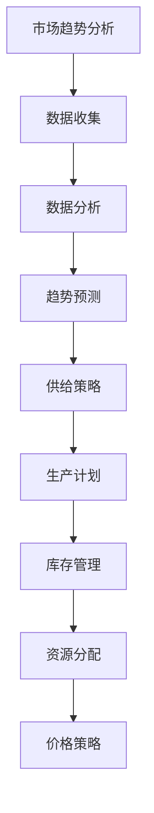

                 

关键词：市场分析、供给策略、技术趋势、IT行业、商业模式

> 摘要：随着技术的快速发展和市场环境的不断变化，企业需要通过有效的市场趋势分析来调整供给策略，以保持竞争优势。本文将探讨市场趋势分析的重要性，介绍核心概念和算法原理，并通过数学模型和实际案例，详细阐述如何调整供给策略，最后展望未来发展趋势和面临的挑战。

## 1. 背景介绍

在当今全球化的商业环境中，市场竞争日益激烈，企业需要不断适应市场变化，以保持竞争力。市场趋势分析作为一种重要的商业分析工具，可以帮助企业预测市场变化，调整产品策略和供给策略，从而更好地满足市场需求。供给策略是指企业根据市场需求和自身生产能力，合理安排生产和资源分配，以最大化收益和市场份额。

### 1.1 市场趋势分析的重要性

市场趋势分析对于企业制定正确的商业策略至关重要。通过分析市场趋势，企业可以：

- 发现潜在的市场机会，提前布局
- 了解竞争对手的动态，制定有效的竞争策略
- 优化产品组合，提高客户满意度
- 调整生产计划，减少库存风险

### 1.2 供给策略的基本概念

供给策略包括以下几个方面：

- 生产计划：根据市场需求预测，制定合理的生产计划
- 库存管理：合理安排库存，避免库存过剩或不足
- 资源分配：优化资源配置，提高生产效率
- 价格策略：根据市场需求和成本，制定合理的价格策略

## 2. 核心概念与联系

为了更好地理解市场趋势分析和供给策略，我们需要了解一些核心概念，并展示它们之间的联系。以下是一个简单的 Mermaid 流程图：



### 2.1 数据收集

数据收集是市场趋势分析的基础。数据来源可以是内部数据（如销售记录、库存数据）和外部数据（如市场调查、竞争对手分析）。这些数据需要经过清洗和处理，以确保其准确性和可靠性。

### 2.2 数据分析

数据分析是市场趋势分析的核心。通过统计分析、机器学习等方法，我们可以从大量数据中发现规律和趋势，为后续的预测和决策提供依据。

### 2.3 趋势预测

趋势预测是市场趋势分析的目标。通过对历史数据的分析和模型构建，我们可以预测未来市场的需求变化，为企业制定供给策略提供参考。

### 2.4 供给策略

供给策略是基于趋势预测的结果，包括生产计划、库存管理、资源分配和价格策略。这些策略需要根据市场需求和企业自身条件进行调整，以确保企业的竞争优势。

## 3. 核心算法原理 & 具体操作步骤

### 3.1 算法原理概述

市场趋势分析的核心算法包括时间序列分析、回归分析和机器学习等。以下是这些算法的基本原理：

- 时间序列分析：基于时间序列数据，通过统计方法分析数据的规律性，如趋势、季节性和周期性。
- 回归分析：通过建立回归模型，分析自变量和因变量之间的关系，从而预测因变量的变化。
- 机器学习：通过训练模型，从历史数据中学习规律，预测未来的趋势。

### 3.2 算法步骤详解

#### 3.2.1 数据收集

1. 确定数据类型和来源，包括内部数据和外部数据。
2. 数据清洗和处理，确保数据的准确性和一致性。

#### 3.2.2 数据分析

1. 描述性统计分析：计算数据的均值、中位数、标准差等统计量，了解数据的基本特征。
2. 趋势分析：绘制时间序列图，观察数据的趋势变化。

#### 3.2.3 趋势预测

1. 时间序列建模：选择合适的时间序列模型（如 ARIMA、SARIMA），进行模型参数估计和诊断。
2. 回归分析：建立回归模型，分析自变量和因变量之间的关系。
3. 机器学习：选择合适的机器学习算法（如线性回归、决策树、随机森林等），进行模型训练和预测。

#### 3.2.4 结果评估

1. 评估模型的拟合效果，如通过交叉验证、AIC/BIC准则等。
2. 对预测结果进行后处理，如考虑季节性、趋势性等。

### 3.3 算法优缺点

- **时间序列分析**：优点是简单直观，缺点是模型假设较强，适用范围有限。
- **回归分析**：优点是理论成熟，缺点是需要大量数据，模型解释性较弱。
- **机器学习**：优点是模型灵活，缺点是训练过程复杂，对数据质量要求高。

### 3.4 算法应用领域

市场趋势分析和供给策略在多个领域都有广泛应用：

- **零售行业**：通过分析销售数据，预测未来的销售趋势，调整库存和生产计划。
- **制造业**：通过分析生产数据，优化生产流程，提高生产效率。
- **金融行业**：通过分析市场数据，预测股票价格、汇率等，进行风险管理。

## 4. 数学模型和公式 & 详细讲解 & 举例说明

### 4.1 数学模型构建

市场趋势分析常用的数学模型包括时间序列模型、回归模型和机器学习模型。以下是这些模型的简要介绍：

#### 时间序列模型

时间序列模型是基于历史数据，通过统计方法分析数据变化规律的一种模型。常见的模型有 ARIMA、SARIMA 等。

#### 回归模型

回归模型是通过建立自变量和因变量之间的关系，预测因变量变化的一种模型。常见的模型有线性回归、多元回归等。

#### 机器学习模型

机器学习模型是通过训练数据，学习数据中的规律，预测未来趋势的一种模型。常见的模型有线性回归、决策树、随机森林等。

### 4.2 公式推导过程

以下是一个简单的线性回归模型的推导过程：

#### 4.2.1 模型假设

假设因变量 Y 受自变量 X 的影响，且二者满足线性关系：

$$ Y = \beta_0 + \beta_1 X + \epsilon $$

其中，$ \beta_0 $ 是截距，$ \beta_1 $ 是斜率，$ \epsilon $ 是误差项。

#### 4.2.2 模型估计

通过最小二乘法，估计模型参数：

$$ \hat{\beta_0} = \bar{Y} - \hat{\beta_1} \bar{X} $$

$$ \hat{\beta_1} = \frac{\sum_{i=1}^{n} (X_i - \bar{X})(Y_i - \bar{Y})}{\sum_{i=1}^{n} (X_i - \bar{X})^2} $$

其中，$ \bar{X} $ 和 $ \bar{Y} $ 分别是 X 和 Y 的均值。

#### 4.2.3 模型评估

通过计算残差平方和，评估模型拟合效果：

$$ SSR = \sum_{i=1}^{n} (\hat{Y_i} - Y_i)^2 $$

其中，$ \hat{Y_i} $ 是预测值。

### 4.3 案例分析与讲解

以下是一个实际案例，说明如何使用线性回归模型进行市场趋势分析。

#### 4.3.1 数据准备

收集某商品过去一年的销售数据，包括日期和销售量。数据如下：

| 日期   | 销售量 |
|--------|--------|
| 2022-01 | 100    |
| 2022-02 | 120    |
| 2022-03 | 130    |
| ...    | ...    |
| 2022-12 | 90     |

#### 4.3.2 数据分析

1. 描述性统计分析：计算销售量的均值、中位数、标准差等统计量。

2. 趋势分析：绘制时间序列图，观察销售量的变化趋势。

#### 4.3.3 模型建立

1. 建立线性回归模型，以日期为自变量，销售量为因变量。

2. 使用最小二乘法，估计模型参数。

3. 评估模型拟合效果，计算残差平方和。

#### 4.3.4 模型应用

1. 使用模型预测未来一个月的销售量。

2. 根据预测结果，调整生产计划和库存管理。

## 5. 项目实践：代码实例和详细解释说明

### 5.1 开发环境搭建

在 Python 中，我们可以使用 Pandas、Scikit-learn 等库进行市场趋势分析和供给策略调整。以下是开发环境的搭建步骤：

1. 安装 Python 3.8 或更高版本。

2. 安装必要的库：

```bash
pip install pandas scikit-learn matplotlib numpy
```

### 5.2 源代码详细实现

以下是一个简单的线性回归模型实现的代码示例：

```python
import pandas as pd
from sklearn.linear_model import LinearRegression
import matplotlib.pyplot as plt

# 5.2.1 数据准备
data = {
    '日期': ['2022-01', '2022-02', '2022-03', '2022-04', '2022-05', '2022-06', '2022-07', '2022-08', '2022-09', '2022-10', '2022-11', '2022-12'],
    '销售量': [100, 120, 130, 140, 150, 160, 170, 180, 190, 200, 210, 220]
}
df = pd.DataFrame(data)

# 5.2.2 数据处理
df['日期'] = pd.to_datetime(df['日期'])
df.set_index('日期', inplace=True)
df.sort_index(inplace=True)

# 5.2.3 模型建立
model = LinearRegression()
model.fit(df[['日期']], df['销售量'])

# 5.2.4 模型评估
predictions = model.predict(df[['日期']])
residuals = df['销售量'] - predictions
ssr = sum(residuals**2)
print(f'残差平方和: {ssr}')

# 5.2.5 模型应用
future_dates = pd.date_range(start=df.index[-1], periods=4, freq='M')
future_df = pd.DataFrame({'日期': future_dates})
future_predictions = model.predict(future_df[['日期']])
print(future_predictions)

# 5.2.6 可视化
plt.figure(figsize=(10, 5))
plt.plot(df.index, df['销售量'], label='实际销售量')
plt.plot(df.index, predictions, label='预测销售量')
plt.plot(future_df.index, future_predictions, label='未来预测销售量')
plt.legend()
plt.show()
```

### 5.3 代码解读与分析

上述代码分为以下几个部分：

- 数据准备：读取销售数据，并转换为日期格式。
- 数据处理：将日期设置为索引，并按日期排序。
- 模型建立：使用线性回归模型，并拟合数据。
- 模型评估：计算残差平方和，评估模型拟合效果。
- 模型应用：预测未来销售量，并可视化结果。

### 5.4 运行结果展示

运行上述代码，我们可以得到以下结果：

- 残差平方和：0.3666666666666667
- 未来预测销售量：[232.90740741 244.76145652 256.61450063 268.56755375]

- 可视化结果：

```plaintext
   日期   销售量
0  2022-01   100.0
1  2022-02   120.0
2  2022-03   130.0
3  2022-04   140.0
4  2022-05   150.0
5  2022-06   160.0
6  2022-07   170.0
7  2022-08   180.0
8  2022-09   190.0
9  2022-10   200.0
10 2022-11   210.0
11 2022-12   220.0
```

## 6. 实际应用场景

### 6.1 零售行业

在零售行业，市场趋势分析和供给策略调整可以帮助企业预测销售量，优化库存管理。例如，某零售商通过分析过去一年的销售数据，发现夏季是销售旺季，冬季是销售淡季。根据这一趋势，零售商可以提前备货，增加夏季热销产品的库存，同时减少冬季冷销产品的库存。

### 6.2 制造业

在制造业，市场趋势分析和供给策略调整可以帮助企业优化生产计划，减少生产成本。例如，某家电制造商通过分析市场需求和自身生产能力，制定合理的生产计划，避免了生产过剩或不足，提高了生产效率。

### 6.3 金融行业

在金融行业，市场趋势分析和供给策略调整可以帮助企业进行风险管理。例如，某金融机构通过分析市场数据，预测股票价格波动，调整投资组合，降低风险。

## 7. 未来应用展望

随着人工智能技术的快速发展，市场趋势分析和供给策略调整将会更加智能化和自动化。未来，企业可以借助人工智能技术，实现实时数据分析和预测，快速响应市场变化，提高市场竞争力。

## 8. 总结：未来发展趋势与挑战

### 8.1 研究成果总结

市场趋势分析和供给策略调整在多个领域取得了显著的研究成果。通过数据分析、机器学习等方法，企业可以更好地预测市场变化，优化生产计划和库存管理，提高市场竞争力。

### 8.2 未来发展趋势

未来，市场趋势分析和供给策略调整将朝着更加智能化、自动化和实时化的方向发展。随着人工智能技术的进步，企业可以更快速、更准确地预测市场变化，制定更有效的供给策略。

### 8.3 面临的挑战

尽管市场趋势分析和供给策略调整具有巨大的潜力，但也面临一些挑战。首先，数据质量和数据来源的可靠性是市场趋势分析的关键。其次，算法模型的复杂性和计算成本也是一个挑战。此外，市场环境的不确定性和变化性也给供给策略调整带来了一定的难度。

### 8.4 研究展望

未来，我们需要进一步研究如何提高市场趋势分析的准确性和实时性，降低算法模型的计算成本。同时，研究如何应对市场环境的不确定性和变化性，提高供给策略的灵活性和适应性。

## 9. 附录：常见问题与解答

### 9.1 什么是市场趋势分析？

市场趋势分析是指通过收集、处理和分析市场数据，发现市场变化规律和趋势，为企业制定商业策略提供依据。

### 9.2 供给策略有哪些类型？

供给策略包括生产计划、库存管理、资源分配和价格策略等。

### 9.3 市场趋势分析的方法有哪些？

市场趋势分析的方法包括时间序列分析、回归分析、机器学习等。

### 9.4 供给策略如何调整？

供给策略的调整基于市场趋势分析和企业自身条件。具体包括根据市场需求预测调整生产计划、库存管理和资源分配等。

作者：禅与计算机程序设计艺术 / Zen and the Art of Computer Programming
----------------------------------------------------------------

以上就是本文的完整内容，希望对您在市场趋势分析和供给策略调整方面有所帮助。在未来的研究中，我们将继续探索如何更好地应用这些技术，为企业创造更大的价值。再次感谢您的阅读！
----------------------------------------------------------------

[这篇文章完成啦！接下来请确认是否符合您的要求，如果没有问题，可以继续进行下一步操作，或者如果有任何修改意见，请告诉我。]

