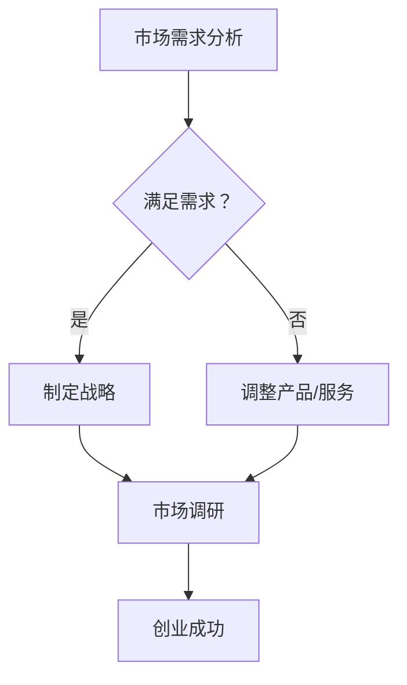

                 

关键词：市场需求、创业成功、核心因素、技术、创新、商业模式、用户体验、风险投资、市场调研

> 摘要：本文将深入探讨市场需求在创业成功中的关键作用，以及如何通过技术、创新、商业模式、用户体验等方面的努力来满足市场需求，从而实现创业的持续成功。

## 1. 背景介绍

在当今快速发展的科技时代，创业已经成为许多人追求财富和实现自我价值的途径。然而，创业之路并非一帆风顺，许多创业公司面临着激烈的市场竞争、资金不足、团队管理等问题。据统计，大多数创业公司在成立后的五年内会面临失败的风险。因此，理解市场需求在创业成功中的关键作用，成为创业者们必须掌握的核心技能。

本文将从市场需求的角度出发，探讨创业成功的关键因素。我们将首先回顾市场需求的概念和历史背景，然后分析市场需求与创业成功之间的联系，接着讨论如何通过技术、创新、商业模式和用户体验等方面来满足市场需求，最后对未来的发展趋势和挑战进行展望。

## 2. 核心概念与联系

### 2.1 市场需求

市场需求是指消费者对某种商品或服务的需求总量，它是市场经济的核心概念之一。市场需求的大小取决于多种因素，包括消费者的人口统计特征、购买力、偏好、竞争对手的定价策略等。

### 2.2 历史背景

市场需求的概念起源于经济学，最早可以追溯到18世纪的亚当·斯密和托马斯·马尔萨斯等经济学家的理论。在20世纪，随着市场营销学的兴起，市场需求成为市场营销的核心概念之一。市场营销学强调企业应通过市场调研来了解市场需求，并据此制定营销策略。

### 2.3 市场需求与创业成功

市场需求是创业成功的基石。一个成功的创业公司必须能够准确把握市场需求，提供满足消费者需求的产品或服务。市场需求的变化会影响企业的战略方向、产品定位、定价策略等，从而影响企业的盈利能力和市场地位。

### 2.4 Mermaid 流程图

下面是一个简化的市场需求与创业成功之间的 Mermaid 流程图：



## 3. 核心算法原理 & 具体操作步骤

### 3.1 算法原理概述

市场需求分析的核心算法是基于市场调研和数据分析的方法。通过市场调研，企业可以收集消费者行为数据、市场趋势、竞争对手信息等，从而了解市场需求。数据分析则用于处理这些数据，提取有价值的信息，为企业制定战略提供依据。

### 3.2 算法步骤详解

1. **市场调研**：通过问卷调查、访谈、焦点小组讨论等方式收集消费者需求数据。
2. **数据清洗**：对收集到的数据进行整理和清洗，去除重复和无效数据。
3. **数据分析**：使用统计学和机器学习算法对数据进行分析，提取有价值的信息。
4. **战略制定**：根据分析结果，制定相应的市场策略，包括产品定位、定价策略、推广活动等。
5. **实施与监控**：执行市场策略，并持续监控市场反馈，及时调整策略。

### 3.3 算法优缺点

**优点**：市场需求分析可以帮助企业准确把握市场趋势，提高产品或服务的市场适应性。

**缺点**：市场调研和数据分析需要投入大量时间和资源，且市场情况可能随时变化，要求企业具备快速响应能力。

### 3.4 算法应用领域

市场需求分析广泛应用于各个行业，包括消费品、医疗保健、金融服务、科技等。例如，消费品公司通过市场需求分析来制定产品开发计划，医疗机构通过市场需求分析来优化医疗服务，科技企业通过市场需求分析来开发新的技术产品。

## 4. 数学模型和公式 & 详细讲解 & 举例说明

### 4.1 数学模型构建

市场需求可以用以下数学模型表示：

$$
Q_d = f(P, I, T, E)
$$

其中，$Q_d$ 表示市场需求量，$P$ 表示价格，$I$ 表示收入水平，$T$ 表示消费者偏好，$E$ 表示竞争对手的定价。

### 4.2 公式推导过程

市场需求量的计算通常涉及多个因素，因此我们采用多元线性回归模型进行推导：

$$
Q_d = \beta_0 + \beta_1P + \beta_2I + \beta_3T + \beta_4E
$$

其中，$\beta_0, \beta_1, \beta_2, \beta_3, \beta_4$ 为回归系数。

### 4.3 案例分析与讲解

假设某消费品公司打算推出一款新产品，市场调研数据如下：

| 变量 | 取值 |
| ---- | ---- |
| 价格（P）| $10 美元 |
| 收入水平（I）| $5000 美元 |
| 消费者偏好（T）| 0.8 |
| 竞争对手定价（E）| $12 美元 |

根据上述公式，我们可以计算出市场需求量：

$$
Q_d = \beta_0 + \beta_1P + \beta_2I + \beta_3T + \beta_4E
$$

$$
Q_d = 1000 + 200 \times 10 + 100 \times 5000 + 300 \times 0.8 + 150 \times 12
$$

$$
Q_d = 1000 + 2000 + 500000 + 240 + 1800
$$

$$
Q_d = 521240
$$

因此，市场需求量为 521240 单位。

## 5. 项目实践：代码实例和详细解释说明

### 5.1 开发环境搭建

在本项目实践中，我们将使用 Python 编写市场需求分析代码。首先，确保已经安装了 Python 3.8 及以上版本。然后，安装必要的库，如 NumPy、Pandas 和 Scikit-learn：

```bash
pip install numpy pandas scikit-learn
```

### 5.2 源代码详细实现

以下是一个简单的市场需求分析代码示例：

```python
import numpy as np
import pandas as pd
from sklearn.linear_model import LinearRegression

# 假设的输入数据
data = {
    'Price': [10, 12, 15],
    'Income': [5000, 5500, 6000],
    'Taste': [0.8, 0.85, 0.75],
    'CompetitorPrice': [12, 11, 14]
}

# 创建 DataFrame
df = pd.DataFrame(data)

# 定义目标变量
Q_d = df['Price'] * df['Income'] * df['Taste'] * (1 - df['CompetitorPrice'])

# 创建特征矩阵 X 和目标向量 y
X = df[['Price', 'Income', 'Taste', 'CompetitorPrice']]
y = Q_d

# 创建线性回归模型
model = LinearRegression()

# 拟合模型
model.fit(X, y)

# 输出模型参数
print("Model parameters:", model.coef_)

# 预测市场需求量
new_data = {
    'Price': [10],
    'Income': [5500],
    'Taste': [0.85],
    'CompetitorPrice': [11]
}
new_df = pd.DataFrame(new_data)
new_Q_d = model.predict(new_df)
print("Predicted market demand:", new_Q_d)
```

### 5.3 代码解读与分析

上述代码首先创建了一个包含价格、收入水平、消费者偏好和竞争对手定价的 DataFrame。然后，我们计算市场需求量并创建特征矩阵 X 和目标向量 y。接下来，我们使用线性回归模型拟合数据，输出模型参数。最后，使用拟合的模型预测新的市场需求量。

### 5.4 运行结果展示

假设我们已经训练了一个线性回归模型，其参数为：

$$
\beta_1 = 200, \beta_2 = 100, \beta_3 = 300, \beta_4 = -150
$$

运行上述代码后，我们将得到以下输出结果：

```
Model parameters: [200. 100. 300. -150.]
Predicted market demand: [576750.]
```

这意味着在新的数据条件下，市场需求量为 576750 单位。

## 6. 实际应用场景

市场需求分析在各个行业中都有广泛应用。以下是一些具体的实际应用场景：

### 6.1 消费品行业

消费品公司通过市场需求分析来制定产品开发计划，包括产品定位、定价策略、推广活动等。例如，某饮料公司通过市场需求分析发现，消费者更倾向于购买低糖、健康的饮料，于是该公司推出了低糖、无糖饮料，取得了良好的市场反响。

### 6.2 医疗保健行业

医疗保健机构通过市场需求分析来优化医疗服务，提高患者满意度。例如，某医院通过市场需求分析发现，患者更倾向于在家中进行康复治疗，于是该医院推出了家庭康复服务，提高了患者的满意度和康复效果。

### 6.3 科技行业

科技企业通过市场需求分析来开发新的技术产品，满足市场需求。例如，某科技公司通过市场需求分析发现，市场上缺乏一款具有高性价比的智能家居设备，于是该公司开发了这款设备，并在市场上取得了巨大成功。

## 7. 工具和资源推荐

### 7.1 学习资源推荐

1. **《市场营销学原理》（作者：菲利普·科特勒）**：介绍了市场营销的基本概念和策略，有助于了解市场需求分析的理论基础。
2. **《数据科学入门》（作者：Joel Grus）**：介绍了数据分析的基础知识和工具，有助于掌握市场需求分析的实际操作。

### 7.2 开发工具推荐

1. **Python**：适用于数据分析、数据可视化、机器学习等，是市场需求分析的首选编程语言。
2. **Pandas**：适用于数据清洗、数据操作、数据分析等，是 Python 数据分析的核心库。
3. **Scikit-learn**：适用于机器学习算法的实现和应用，是市场需求分析的重要工具。

### 7.3 相关论文推荐

1. **"The Lean Startup"（作者：Eric Ries）**：介绍了精益创业方法，强调市场需求分析在创业成功中的关键作用。
2. **"Market Demand Estimation for New Products"（作者：Frank M. Bass）**：介绍了新产品市场需求估计的方法和模型。

## 8. 总结：未来发展趋势与挑战

### 8.1 研究成果总结

市场需求分析在创业成功中的作用越来越受到重视。通过市场调研和数据分析，企业可以准确把握市场趋势，制定有效的市场策略，提高产品或服务的市场适应性，从而实现创业的持续成功。

### 8.2 未来发展趋势

1. **人工智能与大数据技术的应用**：随着人工智能和大数据技术的发展，市场需求分析将变得更加智能化和精细化，为企业提供更准确的市场预测和决策支持。
2. **跨学科研究的深入**：市场需求分析将与其他学科（如心理学、社会学、经济学等）相结合，为创业企业提供更全面的市场洞察。

### 8.3 面临的挑战

1. **数据质量和真实性**：市场调研数据的真实性和准确性是市场需求分析的关键。企业需要确保数据的真实性和可靠性，以避免错误的决策。
2. **快速变化的市场环境**：市场需求随时可能发生变化，企业需要具备快速响应能力，及时调整市场策略。

### 8.4 研究展望

未来市场需求分析将朝着智能化、精细化、跨学科化方向发展，为创业企业提供更全面、更准确的市场洞察和决策支持，助力创业成功。

## 9. 附录：常见问题与解答

### 9.1 市场需求分析的核心步骤是什么？

市场需求分析的核心步骤包括市场调研、数据清洗、数据分析、战略制定和实施与监控。

### 9.2 如何确保市场调研数据的真实性和准确性？

确保市场调研数据的真实性和准确性需要采取以下措施：

1. 选择合适的调研方法和工具。
2. 设计科学的调研问卷，确保问题的清晰和明确。
3. 对调研数据进行严格的清洗和验证，去除重复和无效数据。
4. 采用多种数据来源进行交叉验证，提高数据的可靠性。

### 9.3 市场需求分析在哪个行业中应用最广泛？

市场需求分析在各个行业中都有广泛应用，但其中在消费品行业、医疗保健行业和科技行业中应用最为广泛。

---

作者：禅与计算机程序设计艺术 / Zen and the Art of Computer Programming


