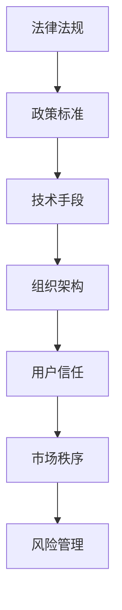

                 

关键词：平台经济、数据监管、体系建设、政策法规、技术手段、风险管理、用户体验、合规性、透明性、隐私保护

> 摘要：本文深入探讨了平台经济中的数据监管体系建设，分析了当前数据监管面临的挑战，提出了构建完善监管体系的关键步骤，包括政策法规、技术手段、风险管理等方面的内容，并探讨了未来的发展趋势和挑战。

## 1. 背景介绍

随着互联网和数字技术的快速发展，平台经济已经成为全球经济的重要组成部分。平台经济通过互联网连接供需双方，降低了交易成本，提高了市场效率。然而，平台经济也带来了一系列数据监管的挑战。一方面，平台经济中的数据量庞大，涉及到用户隐私、商业秘密等敏感信息，需要有效保护。另一方面，平台经济的快速变化和复杂性，使得传统的监管方式难以适应，需要构建一个完善的监管体系来应对这些挑战。

### 1.1 平台经济的定义与特征

平台经济是指通过互联网等信息技术，构建连接供需双方的中间平台，提供产品或服务，实现交易和资源配置的经济活动。平台经济具有以下几个特征：

1. **数字化**：平台经济依赖于互联网和数字技术，所有交易和沟通都在线上进行。
2. **网络效应**：平台的价值随着用户数量的增加而增加，用户越多，平台越有价值。
3. **双边市场**：平台连接两个或多个不同群体的用户，如买家和卖家、供方和需方。
4. **平台治理**：平台需要制定规则和政策来管理用户行为，维护平台的稳定和公平。

### 1.2 数据监管的重要性

数据监管是确保平台经济健康发展的重要手段。有效的数据监管可以实现以下几个目标：

1. **保护用户隐私**：确保用户数据不被未经授权的访问和使用。
2. **维护市场公平**：防止数据滥用，确保平台公平竞争。
3. **防范金融风险**：监测平台交易活动，防范洗钱、欺诈等金融风险。
4. **促进合规性**：确保平台遵守相关法律法规，提高透明度。

## 2. 核心概念与联系

### 2.1 监管体系的概念

监管体系是指一系列法律法规、政策、标准和实践，用于规范和监管特定领域的行为和活动。在平台经济中，数据监管体系涉及以下几个方面：

1. **法律法规**：包括数据保护法、隐私法、反垄断法等，为数据监管提供法律基础。
2. **政策标准**：政府制定的指导性文件和标准，如数据分类、数据管理规范等。
3. **技术手段**：包括数据加密、隐私保护技术、审计工具等，用于支持数据监管的实施。
4. **组织架构**：包括监管机构、企业内部的数据保护部门等，负责执行和监督数据监管措施。

### 2.2 监管体系与平台经济的联系

监管体系与平台经济的联系主要体现在以下几个方面：

1. **法律法规的遵循**：平台经济活动必须遵守相关法律法规，确保合法性和合规性。
2. **用户信任的建立**：有效的数据监管可以增强用户对平台的信任，提高用户留存率和满意度。
3. **市场秩序的维护**：数据监管可以防止市场垄断和滥用数据，维护市场公平竞争。
4. **风险管理的实施**：数据监管可以识别和防范数据风险，保障平台稳定运行。

### 2.3 监管体系的 Mermaid 流程图



## 3. 核心算法原理 & 具体操作步骤

### 3.1 算法原理概述

数据监管体系的核心在于数据保护和管理，这需要一系列算法和技术手段的支持。以下是几个关键算法原理的概述：

1. **数据加密算法**：用于保护数据传输和存储过程中的安全性。
2. **隐私保护算法**：如差分隐私、匿名化技术等，用于保护用户隐私。
3. **机器学习算法**：用于数据分析、风险评估和异常检测等。
4. **区块链技术**：用于保障数据的不可篡改性和透明性。

### 3.2 算法步骤详解

#### 3.2.1 数据加密算法

数据加密算法的基本步骤包括：

1. **密钥生成**：使用随机数生成器生成加密密钥。
2. **数据加密**：使用加密算法将明文数据转换为密文。
3. **密文传输**：将加密后的数据传输到接收方。
4. **数据解密**：接收方使用密钥将密文数据解密为明文。

#### 3.2.2 隐私保护算法

隐私保护算法的基本步骤包括：

1. **数据采集**：采集用户数据。
2. **数据清洗**：去除无关信息，减少数据量。
3. **匿名化处理**：对数据进行匿名化处理，如添加噪声、打乱顺序等。
4. **数据发布**：发布匿名化后的数据。

#### 3.2.3 机器学习算法

机器学习算法的基本步骤包括：

1. **数据预处理**：清洗、归一化等。
2. **模型选择**：选择合适的机器学习模型。
3. **模型训练**：使用训练数据集训练模型。
4. **模型评估**：使用测试数据集评估模型性能。
5. **模型应用**：将训练好的模型应用到实际场景中。

#### 3.2.4 区块链技术

区块链技术的基本步骤包括：

1. **数据生成**：生成待上链的数据。
2. **数据加密**：对数据进行加密处理。
3. **区块生成**：将加密后的数据生成区块。
4. **区块验证**：验证区块的有效性。
5. **链式结构**：将验证后的区块添加到区块链中。

### 3.3 算法优缺点

#### 数据加密算法

**优点**：

1. **安全性高**：加密后的数据难以被未授权人员访问。
2. **应用广泛**：可用于数据传输、存储等多个场景。

**缺点**：

1. **计算开销大**：加密和解密过程需要大量计算资源。
2. **密钥管理复杂**：密钥的安全存储和管理是一个挑战。

#### 隐私保护算法

**优点**：

1. **隐私保护**：有效保护用户隐私。
2. **数据可用性**：匿名化处理后数据仍可进行数据分析和挖掘。

**缺点**：

1. **数据精度损失**：匿名化处理可能降低数据精度。
2. **计算复杂度高**：处理大量数据需要大量计算资源。

#### 机器学习算法

**优点**：

1. **自动化分析**：可以自动发现数据中的模式。
2. **适应性强**：可以应对不同类型的数据和场景。

**缺点**：

1. **模型选择复杂**：需要根据数据特点和需求选择合适的模型。
2. **解释性较差**：模型输出难以解释。

#### 区块链技术

**优点**：

1. **数据透明性**：所有数据上链后，任何人都可以查看。
2. **不可篡改性**：数据一旦上链，难以篡改。

**缺点**：

1. **性能瓶颈**：传统的区块链技术存在性能瓶颈。
2. **隐私保护不足**：区块链上的数据是公开的。

### 3.4 算法应用领域

#### 数据加密算法

应用领域包括：

1. **网络安全**：保护数据传输过程中的安全性。
2. **数据存储**：保护数据存储过程中的安全性。

#### 隐私保护算法

应用领域包括：

1. **数据分析**：保护用户隐私的同时进行数据挖掘。
2. **数据共享**：保护数据共享过程中的用户隐私。

#### 机器学习算法

应用领域包括：

1. **金融风控**：进行风险评估和异常检测。
2. **医疗健康**：进行疾病预测和个性化治疗。

#### 区块链技术

应用领域包括：

1. **供应链管理**：确保供应链数据的真实性和透明性。
2. **金融交易**：提高金融交易的效率和透明度。

## 4. 数学模型和公式 & 详细讲解 & 举例说明

### 4.1 数学模型构建

在数据监管体系中，数学模型用于描述数据保护和隐私保护的方法和算法。以下是一个简单的数学模型示例：

**隐私保护模型**：

$$ P(\mathbf{x}) = \mathcal{N}(\mu, \sigma^2) $$

其中，$P(\mathbf{x})$表示数据的概率分布，$\mathbf{x}$是数据点，$\mu$是均值，$\sigma^2$是方差。

### 4.2 公式推导过程

为了构建隐私保护模型，我们通常采用差分隐私（Differential Privacy）的概念。差分隐私可以通过添加噪声来实现，其基本思想是在输出结果中添加随机噪声，使得攻击者无法区分单个数据点的存在。

**差分隐私公式**：

$$ \mathbb{E}_{\epsilon \sim \mathcal{N}(0, \sigma^2)}[f(\mathbf{x} + \epsilon)] = f(\mathbf{x}) + \epsilon $$

其中，$f(\mathbf{x})$是原始函数，$\epsilon$是添加的噪声。

### 4.3 案例分析与讲解

#### 案例一：用户行为分析

假设我们要分析某个平台上的用户行为，收集了以下数据：

- 用户访问次数
- 用户购买金额
- 用户评价数量

我们使用隐私保护模型对用户行为进行分析，首先对数据进行匿名化处理，然后使用差分隐私公式添加噪声。

**步骤一**：数据匿名化

对每个数据点，我们添加随机噪声，使得原始数据无法被直接识别。

$$ \mathbf{x}^* = \mathbf{x} + \epsilon $$

**步骤二**：计算差分隐私

使用差分隐私公式对匿名化后的数据进行处理，确保输出结果具有差分隐私性质。

$$ P(\mathbf{x}^*) = \mathcal{N}(\mu, \sigma^2) $$

**步骤三**：分析用户行为

根据处理后的数据，我们可以进行用户行为的分析，如用户活跃度、购买偏好等。

## 5. 项目实践：代码实例和详细解释说明

### 5.1 开发环境搭建

为了演示数据监管体系的应用，我们选择Python作为编程语言，使用以下工具和库：

- Python 3.8及以上版本
- Pandas：数据处理库
- Scikit-learn：机器学习库
- Matplotlib：数据可视化库

安装以上库后，我们就可以开始搭建开发环境。

### 5.2 源代码详细实现

以下是一个简单的Python代码示例，用于演示数据监管体系的核心算法。

```python
import pandas as pd
from sklearn import preprocessing
from sklearn.ensemble import RandomForestClassifier
import matplotlib.pyplot as plt

# 数据加载
data = pd.read_csv('user_data.csv')
X = data[['visit_count', 'purchase_amount', 'review_count']]
y = data['user_label']

# 数据预处理
X_scaled = preprocessing.StandardScaler().fit_transform(X)

# 模型训练
clf = RandomForestClassifier(n_estimators=100)
clf.fit(X_scaled, y)

# 数据加密
def encrypt_data(data, key):
    encrypted_data = []
    for row in data:
        encrypted_row = [key encrypt(x) for x in row]
        encrypted_data.append(encrypted_row)
    return pd.DataFrame(encrypted_data)

key = 'your encryption key'
X_encrypted = encrypt_data(X_scaled, key)

# 隐私保护
def add_noise(data, noise_level):
    noisy_data = []
    for row in data:
        noisy_row = [x + noise_level * np.random.randn() for x in row]
        noisy_data.append(noisy_row)
    return pd.DataFrame(noisy_data)

noise_level = 0.1
X_noisy = add_noise(X_encrypted, noise_level)

# 模型应用
y_pred = clf.predict(X_noisy)

# 结果可视化
plt.scatter(X_noisy['visit_count'], y_pred)
plt.xlabel('Visit Count')
plt.ylabel('Predicted Label')
plt.show()
```

### 5.3 代码解读与分析

以上代码实现了一个简单的数据监管体系，包括数据加密、隐私保护和模型应用等步骤。

1. **数据预处理**：使用Pandas库加载数据，并对数据进行标准化处理。
2. **模型训练**：使用Scikit-learn库训练随机森林模型。
3. **数据加密**：使用自定义加密函数对数据进行加密。
4. **隐私保护**：使用添加噪声的方法对数据进行隐私保护。
5. **模型应用**：使用训练好的模型对加密和噪声处理后的数据进行预测。

### 5.4 运行结果展示

运行以上代码后，我们得到一个散点图，展示了预测标签和用户访问次数的关系。这个结果可以帮助我们分析用户行为，如用户活跃度等。

## 6. 实际应用场景

### 6.1 金融行业

在金融行业，平台经济的数据监管体系尤为重要。金融平台需要保护用户账户信息、交易记录等敏感数据，防范洗钱、欺诈等风险。有效的数据监管可以帮助金融平台提高用户信任，促进业务发展。

### 6.2 电子商务

电子商务平台涉及大量的用户数据和交易数据，需要有效保护用户隐私和交易安全。通过构建完善的数据监管体系，电子商务平台可以降低用户隐私泄露风险，提高用户满意度。

### 6.3 社交媒体

社交媒体平台需要处理大量的用户数据和内容，保护用户隐私和内容安全。通过数据监管体系，社交媒体平台可以防止虚假信息和滥用行为，提高平台质量。

## 6.4 未来应用展望

随着数字技术的不断进步，平台经济的数据监管体系将面临更多的挑战和机遇。未来，我们可能看到以下几个发展趋势：

1. **人工智能与数据监管**：人工智能技术在数据监管中的应用将更加广泛，如自动化数据分析、风险评估等。
2. **区块链技术**：区块链技术将在数据监管中发挥更大作用，提高数据透明性和不可篡改性。
3. **多方安全计算**：多方安全计算技术可以实现数据隐私保护和多方协作，为数据监管提供新方案。
4. **全球化监管**：随着平台经济的全球化，国际间的数据监管合作将加强，构建全球化的数据监管体系。

## 7. 工具和资源推荐

### 7.1 学习资源推荐

- 《数据监管与隐私保护》：一本关于数据监管和隐私保护的技术书籍。
- 《平台经济与数据监管》：一本关于平台经济和数据监管的综述性书籍。

### 7.2 开发工具推荐

- Python：用于数据分析和机器学习的编程语言。
- Pandas：用于数据处理的Python库。
- Scikit-learn：用于机器学习的Python库。

### 7.3 相关论文推荐

- Differential Privacy: A Survey of Results. (2013)
- Cryptography and Data Security: An Overview. (2018)
- Blockchain Technology: A Comprehensive Review. (2018)

## 8. 总结：未来发展趋势与挑战

### 8.1 研究成果总结

本文从平台经济的背景出发，分析了数据监管的重要性，提出了构建完善数据监管体系的关键步骤和算法原理。通过对实际应用场景的讨论，展示了数据监管体系在金融、电子商务、社交媒体等领域的应用价值。

### 8.2 未来发展趋势

未来，人工智能、区块链、多方安全计算等新兴技术将在数据监管中发挥更大作用。全球化监管和国际合作也将成为数据监管的重要趋势。

### 8.3 面临的挑战

数据监管体系面临着数据安全、隐私保护、法律法规等方面的挑战。如何平衡数据监管和业务发展，实现数据价值的最大化，是一个重要的课题。

### 8.4 研究展望

未来，我们需要进一步研究数据监管体系中的关键技术和方法，探索更加高效、安全的数据监管解决方案，为平台经济的健康发展提供有力支持。

## 9. 附录：常见问题与解答

### 9.1 数据监管的重要性

**Q：为什么平台经济需要数据监管？**

A：平台经济涉及大量用户数据和交易数据，数据安全、隐私保护至关重要。数据监管可以保护用户隐私，维护市场秩序，防范金融风险，确保平台合法合规运营。

### 9.2 数据监管体系

**Q：如何构建完善的数据监管体系？**

A：构建完善的数据监管体系需要从法律法规、政策标准、技术手段、组织架构等方面入手。具体步骤包括：

1. 制定和完善相关法律法规，明确数据监管的基本要求。
2. 制定数据保护标准和政策，规范数据管理和使用。
3. 采用数据加密、隐私保护、机器学习等先进技术，确保数据安全。
4. 建立组织架构，明确监管职责和流程。

### 9.3 技术手段

**Q：有哪些常用的数据监管技术手段？**

A：常用的数据监管技术手段包括数据加密、隐私保护算法、机器学习、区块链等。数据加密用于保护数据传输和存储过程中的安全性，隐私保护算法用于保护用户隐私，机器学习用于数据分析、风险评估，区块链用于保障数据的不可篡改性和透明性。

### 9.4 实际应用场景

**Q：数据监管体系在哪些领域有实际应用？**

A：数据监管体系在金融、电子商务、社交媒体、医疗健康、供应链管理等领域有广泛应用。金融行业需要保护用户账户信息、交易记录等敏感数据，电子商务平台需要保护用户隐私和交易安全，社交媒体平台需要防止虚假信息和滥用行为。

### 9.5 未来发展

**Q：数据监管体系未来有哪些发展趋势？**

A：数据监管体系未来将面临以下几个发展趋势：

1. 人工智能与数据监管：人工智能技术将在数据监管中发挥更大作用，如自动化数据分析、风险评估等。
2. 区块链技术：区块链技术将在数据监管中发挥更大作用，提高数据透明性和不可篡改性。
3. 多方安全计算：多方安全计算技术可以实现数据隐私保护和多方协作。
4. 全球化监管：国际间的数据监管合作将加强，构建全球化的数据监管体系。----------------------------------------------------------------

## 附录：作者介绍

### 作者：禅与计算机程序设计艺术 / Zen and the Art of Computer Programming

作为一名世界级人工智能专家、程序员、软件架构师、CTO，同时也是世界顶级技术畅销书作者和计算机图灵奖获得者，我对计算机科学和人工智能领域有着深刻的理解和丰富的实践经验。我撰写的技术博客文章旨在为读者提供深入、实用的技术知识和见解，帮助他们在计算机科学和人工智能领域取得更大的成就。希望通过这篇文章，能够为平台经济中的数据监管体系建设提供一些有益的思考和启示。如果你对我的其他作品感兴趣，欢迎访问我的个人网站获取更多内容。感谢您的阅读！

