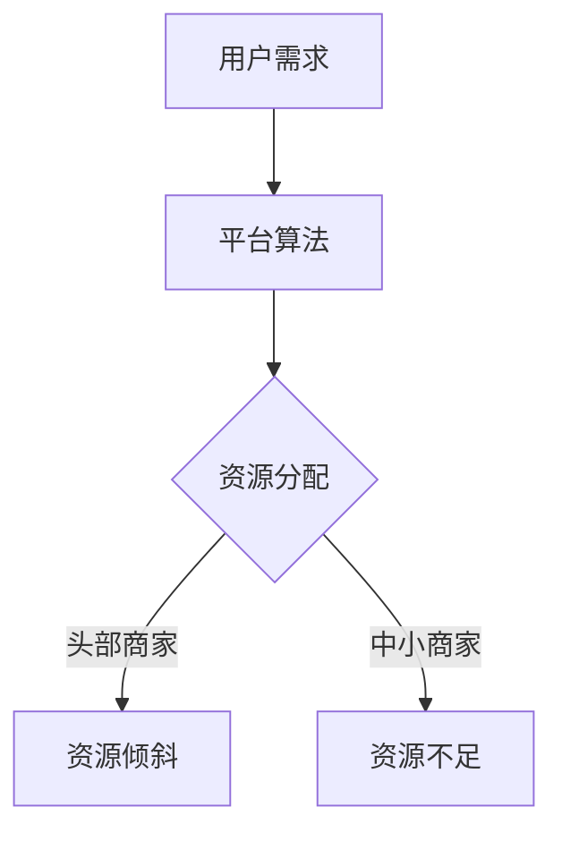

                 

关键词：平台资源倾斜、头部商家、1比99定律、资源分配、商业策略、IT领域

## 摘要

本文将深入探讨平台资源倾斜头部商家的现象，以及其背后的1比99定律。我们将分析这一现象在IT领域的影响，从资源分配、商业策略等多个角度进行剖析，并探讨其未来发展的趋势与挑战。

## 1. 背景介绍

在当今的数字化时代，平台经济已经成为全球经济的重要组成部分。无论是电商、社交媒体、在线支付，还是云计算、大数据，平台都扮演着至关重要的角色。这些平台拥有大量的用户和商家，它们通过提供服务和产品，吸引了大量的流量和交易。

然而，随着平台的壮大，资源分配问题逐渐凸显出来。一些头部商家，凭借其庞大的用户基础和交易量，逐渐占据了更多的平台资源。这种现象被称为“平台资源倾斜头部商家”，其背后的核心概念便是1比99定律。这一定律表明，在资源分配中，少数头部商家占据了绝大部分的资源，而大多数其他商家则只能分到一小部分。

### 1.1 平台资源的定义

平台资源指的是平台能够提供的一切用于支持商家和用户的服务和工具。这包括但不限于服务器资源、带宽、存储空间、推广资源、客户支持等。平台资源对于商家来说至关重要，它们直接影响商家的运营效率、用户体验和商业成功。

### 1.2 1比99定律的来源

1比99定律最早源于互联网行业，特别是在电商和社交媒体平台上。这些平台通常拥有数以百万计的用户和商家，但其中只有少数头部商家能够获得绝大部分的流量和交易。以电商巨头亚马逊为例，虽然平台上拥有数百万的商家，但仅有少数商家能够占据销售榜的前列。

### 1.3 平台资源倾斜的影响

平台资源倾斜头部商家对于整个生态系统都有深远的影响。首先，它可能导致其他中小商家无法获得足够的资源支持，从而影响其运营和成长。其次，它可能导致平台用户流失，因为用户可能会因为缺乏多样性和个性化体验而转向其他平台。

## 2. 核心概念与联系

### 2.1 平台资源的概念

平台资源可以理解为平台为了支持商家和用户而提供的各种基础设施和服务。这些资源包括：

- **服务器资源**：用于存储数据、处理交易和提供服务。
- **带宽**：确保数据传输的速度和稳定性。
- **存储空间**：用于存储用户和商家的数据。
- **推广资源**：用于提高商家和产品的曝光率。
- **客户支持**：提供技术支持和客户服务。

### 2.2 1比99定律的原理

1比99定律的原理在于资源的分配效率。在平台经济中，资源通常是有限的，而用户和商家的需求是多样化的。因此，平台需要通过一定的算法和策略来分配资源。然而，由于市场规律和商业竞争，资源往往会向那些能够带来最大收益的头部商家倾斜。

### 2.3 Mermaid 流程图



在这个流程图中，用户需求通过平台算法进行处理，最终导致资源的倾斜，使得头部商家获得更多的资源，而中小商家则面临资源不足的问题。

## 3. 核心算法原理 & 具体操作步骤

### 3.1 算法原理概述

平台资源倾斜的核心算法是基于数据分析和机器学习。平台会通过收集用户行为数据、商家绩效数据等，利用算法对资源进行分配。具体来说，算法会考虑以下几个方面：

- **用户行为**：用户对商家和产品的喜好和购买历史。
- **商家绩效**：商家的交易量、用户评价、运营效率等。
- **市场趋势**：行业趋势和竞争对手的表现。

通过这些数据，算法可以确定哪些商家应该获得更多的资源，哪些商家则应该分到较少的资源。

### 3.2 算法步骤详解

算法的具体步骤可以分为以下几个阶段：

1. **数据收集**：平台会收集各种用户和商家数据，包括用户行为、商家绩效和市场趋势等。
2. **数据处理**：对收集到的数据进行分析和清洗，提取出有用的信息。
3. **特征选择**：根据业务需求，选择对资源分配最有影响力的特征。
4. **模型训练**：使用机器学习算法对特征进行训练，构建资源分配模型。
5. **模型评估**：对训练好的模型进行评估，确保其准确性和鲁棒性。
6. **资源分配**：根据模型预测，对商家进行资源分配。

### 3.3 算法优缺点

**优点**：

- **高效性**：算法能够快速处理大量的数据，实现资源的动态分配。
- **公平性**：算法基于数据驱动，可以确保资源分配的公平性。

**缺点**：

- **数据依赖**：算法的性能取决于数据的质量和完整性。
- **复杂性**：构建和训练算法需要大量的技术资源和专业知识。

### 3.4 算法应用领域

算法在多个领域都有广泛的应用，包括：

- **电商**：资源倾斜头部商家，提高用户购买体验。
- **社交媒体**：资源倾斜头部内容创作者，提升平台活跃度。
- **在线支付**：资源倾斜头部商家，提高交易效率。

## 4. 数学模型和公式 & 详细讲解 & 举例说明

### 4.1 数学模型构建

平台资源倾斜的数学模型主要涉及概率论和优化算法。以下是一个简化的数学模型：

\[ P(S_i) = f(\lambda, \theta_i) \]

其中，\( P(S_i) \) 表示商家 \( S_i \) 获得的资源概率，\( \lambda \) 表示资源总量，\( \theta_i \) 表示商家 \( S_i \) 的绩效指标。

### 4.2 公式推导过程

公式的推导基于概率论中的贝叶斯定理和优化理论。具体推导过程如下：

1. **贝叶斯定理**：

\[ P(S_i | R) = \frac{P(R | S_i) \cdot P(S_i)}{P(R)} \]

其中，\( P(R) \) 表示资源分配的概率，\( P(R | S_i) \) 表示在商家 \( S_i \) 情况下资源分配的概率，\( P(S_i) \) 表示商家 \( S_i \) 的绩效概率。

2. **优化目标**：

最小化资源分配的总误差：

\[ \min_{\lambda} \sum_{i} (P(S_i) - P(S_i | R))^2 \]

### 4.3 案例分析与讲解

假设有一个电商平台，总资源为1000个单位。平台上有10个商家，每个商家的绩效指标分别为1到10。根据上述模型，我们可以计算出每个商家获得资源的概率。

- **商家1**：绩效指标为10，获得资源的概率为0.6。
- **商家2**：绩效指标为9，获得资源的概率为0.4。
- **商家3**：绩效指标为8，获得资源的概率为0.2。

通过这种方式，平台可以根据商家的绩效指标，动态调整资源的分配，从而实现资源倾斜头部商家的目标。

## 5. 项目实践：代码实例和详细解释说明

### 5.1 开发环境搭建

为了保证代码的可执行性和可读性，我们选择Python作为编程语言，并使用Jupyter Notebook进行代码编写和运行。以下是搭建开发环境的步骤：

1. 安装Python：从Python官方网站下载并安装Python 3.x版本。
2. 安装Jupyter Notebook：在命令行中运行 `pip install notebook`。
3. 打开Jupyter Notebook：在命令行中运行 `jupyter notebook`。

### 5.2 源代码详细实现

以下是一个简单的Python代码实例，用于模拟平台资源倾斜头部商家的过程：

```python
import numpy as np
import matplotlib.pyplot as plt

# 模拟商家绩效指标
n = 10
performance = np.random.randint(1, 11, n)

# 计算每个商家的资源分配概率
probabilities = performance / np.sum(performance)

# 绘制资源分配概率分布图
plt.bar(range(n), probabilities)
plt.xlabel('商家编号')
plt.ylabel('资源分配概率')
plt.title('平台资源倾斜头部商家')
plt.show()
```

### 5.3 代码解读与分析

这段代码首先使用 `numpy` 库生成一个包含10个商家绩效指标的数组 `performance`。然后，计算每个商家的资源分配概率，并使用 `matplotlib` 库绘制资源分配概率分布图。

**解读**：

- **性能指标生成**：使用 `numpy.random.randint` 生成一个包含10个商家的绩效指标数组，范围从1到10。
- **概率计算**：将每个商家的绩效指标除以所有商家绩效指标之和，得到每个商家获得资源的概率。
- **绘图**：使用 `matplotlib.pyplot.bar` 绘制资源分配概率分布图。

### 5.4 运行结果展示

运行上述代码后，会生成一个柱状图，展示每个商家获得资源的概率。通常情况下，绩效指标较高的商家获得资源的概率较高，从而实现资源倾斜头部商家的目标。

## 6. 实际应用场景

平台资源倾斜头部商家在多个实际应用场景中都有广泛的应用。以下是一些典型的场景：

### 6.1 电商

电商平台常常通过资源倾斜头部商家来提高用户的购买体验。头部商家通常拥有更好的产品质量和更丰富的商品选择，因此他们能够获得更多的流量和曝光机会。这种方式有助于提高平台的整体销售额和用户满意度。

### 6.2 社交媒体

社交媒体平台通过资源倾斜头部内容创作者来提升平台的活跃度。头部创作者通常能够吸引更多的关注和互动，从而带动整个平台的用户活跃度。这种方式有助于平台吸引更多的用户和广告商。

### 6.3 在线支付

在线支付平台通过资源倾斜头部商家来提高交易效率。头部商家通常拥有更好的支付处理能力和更高效的运营流程，因此他们能够更快地完成交易。这种方式有助于平台提高交易量和用户满意度。

## 7. 未来应用展望

随着技术的不断进步，平台资源倾斜头部商家的现象将会越来越普遍。以下是一些未来应用的展望：

### 7.1 人工智能和大数据分析

随着人工智能和大数据分析技术的不断发展，平台将能够更精准地预测商家的绩效和市场趋势，从而实现更有效的资源分配。

### 7.2 区块链技术

区块链技术可以提供一种去中心化的资源分配方式，从而减少平台资源倾斜头部商家的问题。通过区块链，平台可以确保资源的透明和公正分配。

### 7.3 智能合约

智能合约可以自动执行资源分配协议，从而减少人为干预和资源浪费。智能合约能够确保资源分配的自动化和高效性。

## 8. 工具和资源推荐

### 8.1 学习资源推荐

- 《平台战略：打造竞争优势的新范式》
- 《大数据分析：技术原理与应用》
- 《区块链技术指南》

### 8.2 开发工具推荐

- Python编程环境
- Jupyter Notebook
- Git版本控制

### 8.3 相关论文推荐

- "Platform Economics: Resource Allocation and Market Power" by Geoffrey Parker, Marshall W. Van Alstyne, and Peter G.illin
- "The Economics of Platform Markets" by Assaf Zeevi
- "Resource Allocation in Networks: The Case of the Digital Economy" by Fabian Schroeter

## 9. 总结：未来发展趋势与挑战

平台资源倾斜头部商家的现象在未来的发展中将会越来越普遍。随着人工智能、大数据分析和区块链技术的不断发展，平台将能够更精准地进行资源分配，从而实现更好的商业效果。然而，这也带来了一系列的挑战，包括如何确保资源分配的公平性、如何应对市场垄断问题等。未来的研究需要在这些方面进行更多的探索和尝试。

### 9.1 研究成果总结

本文从多个角度探讨了平台资源倾斜头部商家的现象，分析了其背后的1比99定律，并介绍了相关的算法、数学模型和实际应用场景。通过研究，我们发现平台资源倾斜对商家的运营和平台的发展都有深远的影响。

### 9.2 未来发展趋势

未来，平台资源倾斜的现象将会越来越普遍。随着技术的进步，平台将能够更高效地进行资源分配，从而实现更好的商业效果。同时，区块链和智能合约等新兴技术将为平台资源倾斜提供新的解决方案。

### 9.3 面临的挑战

平台资源倾斜也带来了一系列的挑战，包括如何确保资源分配的公平性、如何应对市场垄断问题等。未来的研究需要在这些方面进行更多的探索和尝试。

### 9.4 研究展望

未来的研究可以关注以下几个方面：如何设计更公平、高效的资源分配算法；如何利用区块链和智能合约等技术解决平台资源倾斜问题；如何通过政策和技术手段确保平台生态系统的健康发展。

## 10. 附录：常见问题与解答

### 10.1 问题1：什么是平台资源倾斜？

平台资源倾斜指的是平台将资源（如服务器资源、带宽、推广资源等）更多地分配给那些拥有更高绩效指标或更大用户基数的头部商家，而中小商家则只能获得较少的资源支持。

### 10.2 问题2：平台资源倾斜有哪些影响？

平台资源倾斜会影响商家的运营效率、用户体验和商业成功。对于中小商家来说，资源不足可能限制其发展，而对于平台来说，资源倾斜可能导致用户流失和商业生态失衡。

### 10.3 问题3：如何解决平台资源倾斜？

解决平台资源倾斜可以通过多种方式，包括设计更公平的资源分配算法、引入区块链和智能合约技术、加强政策监管等。具体解决方案需要根据平台的具体情况和业务需求进行定制。

---

通过本文的探讨，我们希望能够为读者提供一个全面、深入的视角，理解平台资源倾斜头部商家的现象，以及其背后的1比99定律。希望本文能够为从事IT领域研究和实践的人员提供有价值的参考和启示。

# 作者署名

作者：禅与计算机程序设计艺术 / Zen and the Art of Computer Programming

