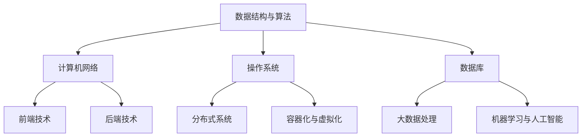

                 

关键词：京东校招，技术面试，题库，前沿技术，面试策略

> 摘要：本文将为您整理和解析2025年京东校招技术面试中的热门问题和关键知识点，帮助您备战校招，顺利通过面试，迈入京东这个全球领先的电商企业。

## 1. 背景介绍

京东，作为中国电商行业的领军企业，一直以来都以其强大的技术实力和创新能力著称。为了选拔优秀的人才，京东校招技术面试题涵盖了计算机科学的各个领域，从基础数据结构与算法，到前沿的人工智能、大数据、云计算等。本文将根据历年校招面试题的趋势，为您提供一份全面的技术面试题集锦，以助您顺利应对2025年京东校招技术面试。

## 2. 核心概念与联系

在准备京东校招技术面试时，理解以下几个核心概念和它们之间的关系是非常重要的。以下是一个Mermaid流程图，展示了这些概念之间的联系：



### 2.1 数据结构与算法

数据结构是计算机科学的基础，包括数组、链表、栈、队列、树、图等。算法是对数据的操作，常见的算法有排序、查找、动态规划、贪心算法等。这些数据结构与算法在编程中无处不在，是解决复杂问题的基石。

### 2.2 计算机网络

计算机网络是互联网的基础，涉及TCP/IP协议、HTTP协议、DNS、防火墙等。理解网络协议和网络安全对于开发分布式系统和云服务至关重要。

### 2.3 操作系统

操作系统是计算机的核心软件，管理计算机硬件资源，提供用户接口。了解进程管理、内存管理、文件系统、中断处理等是操作系统的核心知识点。

### 2.4 数据库

数据库用于存储和管理大量数据。了解关系型数据库（如MySQL、Oracle）和非关系型数据库（如MongoDB、Cassandra）的基本原理和查询语言是面试的关键。

### 2.5 前端技术

前端技术包括HTML、CSS、JavaScript等，负责用户界面和用户体验。熟悉前端框架（如React、Vue.js）和响应式设计是加分项。

### 2.6 后端技术

后端技术包括服务器端编程语言（如Java、Python、Go）和框架（如Spring、Django）。了解微服务架构、RESTful API设计等是后端开发的核心。

### 2.7 分布式系统

分布式系统涉及多个节点协同工作，解决数据一致性和容错性问题。理解分布式算法、一致性模型、CAP定理等对于设计大规模系统至关重要。

### 2.8 容器化与虚拟化

容器化和虚拟化技术（如Docker、Kubernetes）在云服务领域广泛应用，了解其基本原理和部署实践是现代开发的必备技能。

## 3. 核心算法原理 & 具体操作步骤

### 3.1 算法原理概述

算法可以分为几种基本类型：基础算法（如排序、查找）、动态规划、图算法、字符串算法、数学算法等。每种算法都有其特定的应用场景和解决方法。

### 3.2 算法步骤详解

- **排序算法**：常见的排序算法有冒泡排序、选择排序、插入排序、快速排序、归并排序等。每种排序算法的实现细节和性能分析都是面试的重点。

- **查找算法**：二分查找、哈希查找等，了解查找算法的时间复杂度和空间复杂度对于解决实际问题是必不可少的。

- **动态规划**：动态规划是一种解决最优化问题的方法，常见的动态规划问题有背包问题、最长公共子序列等。

- **图算法**：图遍历算法（如DFS、BFS）、最短路径算法（如Dijkstra算法、Floyd算法）、最小生成树算法（如Prim算法、Kruskal算法）等。

- **字符串算法**：字符串匹配算法（如KMP、BM）、字符串排序、字符串压缩等。

- **数学算法**：素数算法、最大公约数、最小公倍数、快速幂算法、矩阵运算等。

### 3.3 算法优缺点

每种算法都有其优缺点，选择合适的算法可以大大提高程序的效率和性能。例如，快速排序虽然平均时间复杂度为\(O(n\log n)\)，但在最坏情况下会退化到\(O(n^2)\)；而归并排序则总是保持在\(O(n\log n)\)，但需要额外的内存空间。

### 3.4 算法应用领域

算法广泛应用于计算机科学的各个领域，包括但不限于：

- **搜索引擎**：字符串匹配算法、排序算法等。
- **大数据处理**：分布式算法、并行计算等。
- **人工智能**：机器学习算法、深度学习算法等。
- **图形学**：图算法、几何算法等。
- **网络优化**：路由算法、负载均衡算法等。

## 4. 数学模型和公式 & 详细讲解 & 举例说明

在计算机科学中，数学模型和公式是理解和解决问题的关键。以下是一些常用的数学模型和公式，以及它们的推导和实际应用。

### 4.1 数学模型构建

数学模型是对现实世界的抽象和简化，通过数学公式来描述系统的行为。常见的数学模型有线性模型、非线性模型、概率模型等。

### 4.2 公式推导过程

推导数学公式是理解算法和模型的关键。以下是一个例子：

$$
\sum_{i=1}^{n} i = \frac{n(n+1)}{2}
$$

这个公式是等差数列求和公式，可以通过数学归纳法推导得出。

### 4.3 案例分析与讲解

以最长公共子序列（LCS）为例，LCS问题是动态规划中的经典问题。给定两个序列A和B，LCS问题是找出两个序列中公共子序列中最长的那个。

定义一个二维数组dp，其中\(dp[i][j]\)表示A的前i个字符和B的前j个字符的最长公共子序列的长度。状态转移方程为：

$$
dp[i][j] =
\begin{cases}
dp[i-1][j-1] + 1, & \text{如果 } a_i = b_j \\
\max(dp[i-1][j], dp[i][j-1]), & \text{其他情况}
\end{cases}
$$

最终，\(dp[m][n]\)即为A和B的最长公共子序列的长度。

## 5. 项目实践：代码实例和详细解释说明

以下是一个简单的项目实践，涉及前端和后端开发。我们将使用JavaScript和Node.js来构建一个简单的RESTful API。

### 5.1 开发环境搭建

- 安装Node.js和npm（Node.js的包管理器）
- 使用npm初始化项目，并安装所需的依赖，如Express（一个流行的Web框架）

### 5.2 源代码详细实现

```javascript
// app.js
const express = require('express');
const app = express();

app.use(express.json());

app.get('/users', (req, res) => {
  // 查询用户列表
  res.json([
    { id: 1, name: 'Alice' },
    { id: 2, name: 'Bob' },
    { id: 3, name: 'Charlie' }
  ]);
});

app.post('/users', (req, res) => {
  // 添加新用户
  const newUser = req.body;
  // 这里可以添加业务逻辑，例如验证用户信息
  res.status(201).json(newUser);
});

app.put('/users/:id', (req, res) => {
  // 更新指定用户
  const userId = req.params.id;
  // 这里可以添加业务逻辑，例如查询用户信息并更新
  res.json({ id: userId, updated: true });
});

app.delete('/users/:id', (req, res) => {
  // 删除指定用户
  const userId = req.params.id;
  // 这里可以添加业务逻辑，例如删除用户
  res.json({ id: userId, deleted: true });
});

const PORT = process.env.PORT || 3000;
app.listen(PORT, () => {
  console.log(`Server is running on port ${PORT}`);
});
```

### 5.3 代码解读与分析

- **请求处理**：使用Express框架，我们定义了四个HTTP动词对应的处理函数，分别对应RESTful API中的GET、POST、PUT、DELETE操作。
- **数据验证**：在添加和更新用户时，我们可以在相应的方法中添加业务逻辑来验证用户输入。
- **响应处理**：根据请求和处理的结果，我们发送相应的HTTP响应。

### 5.4 运行结果展示

运行上述代码后，您可以使用HTTP客户端（如curl）来测试API：

```shell
# 获取用户列表
$ curl http://localhost:3000/users

# 添加新用户
$ curl -X POST -H "Content-Type: application/json" -d '{"name":"Dave"}' http://localhost:3000/users

# 更新指定用户
$ curl -X PUT -H "Content-Type: application/json" -d '{"name":"David"}' http://localhost:3000/users/1

# 删除指定用户
$ curl -X DELETE http://localhost:3000/users/1
```

## 6. 实际应用场景

京东校招技术面试题不仅考察基础知识和算法，还涉及实际应用场景。以下是一些可能出现在面试中的应用场景：

- **搜索引擎优化**：如何优化搜索引擎的查询效率？
- **大数据处理**：如何高效处理海量数据？
- **人工智能**：如何使用机器学习算法解决实际问题？
- **安全防护**：如何确保系统的安全性，防止恶意攻击？
- **分布式系统**：如何设计高可用、高并发的分布式系统？

## 7. 工具和资源推荐

为了更好地准备京东校招技术面试，以下是一些推荐的工具和资源：

- **学习资源**：[LeetCode](https://leetcode.com/)、[HackerRank](https://www.hackerrank.com/)、[GeeksforGeeks](https://www.geeksforgeeks.org/)
- **开发工具**：[Visual Studio Code](https://code.visualstudio.com/)、[Git](https://git-scm.com/)、[Docker](https://www.docker.com/)
- **相关论文**：《深度学习》（Ian Goodfellow）、《大数据技术基础》（刘伟）、《分布式系统原理与范型》（马少平）

## 8. 总结：未来发展趋势与挑战

随着技术的不断进步，计算机科学领域面临着前所未有的机遇和挑战。未来，人工智能、大数据、云计算等将成为京东校招技术面试的重点方向。以下是未来发展趋势和挑战的简要总结：

- **人工智能**：随着深度学习技术的进步，人工智能将在更多领域得到应用，例如自动驾驶、医疗诊断等。
- **大数据处理**：如何高效地处理和分析海量数据是未来的一大挑战，分布式计算、流处理等技术将得到更广泛的应用。
- **云计算**：云计算将推动企业数字化转型，提供更灵活、高效的计算资源和服务。
- **网络安全**：随着网络攻击的日益复杂，如何确保系统的安全性将成为重要课题。

## 9. 附录：常见问题与解答

### 问题1：如何在短时间内提高编程能力？

解答：首先，通过刷题库（如LeetCode、HackerRank）来熟悉各种编程算法和数据结构。其次，多参与开源项目，实践实际编程。最后，定期复习和总结，巩固所学知识。

### 问题2：如何准备技术面试？

解答：提前了解面试公司的文化和技术方向，准备相关的技术知识。同时，多进行模拟面试，熟悉面试流程和常见问题。此外，保持良好的心态和团队合作精神，也是成功面试的重要因素。

### 问题3：如何选择合适的数据结构？

解答：根据具体问题和需求选择合适的数据结构。例如，对于快速查询的问题，哈希表和二叉搜索树是常见的选择；对于排序和查找问题，可以使用数组、链表、树等。

### 问题4：如何在面试中展示自己的优势？

解答：在面试中，展示自己的专业技能、项目经验和解决问题的能力。同时，保持自信和谦虚，真诚地表达自己的观点和对公司的热情。

---

作者：禅与计算机程序设计艺术 / Zen and the Art of Computer Programming

以上便是关于2025年京东校招技术面试题集锦的详细文章。希望本文能为您备战京东校招技术面试提供有益的参考。祝您面试成功，顺利加入京东这个大家庭！
----------------------------------------------------------------

### 注意事项
- 撰写的文章必须完整，不能仅提供概要性的框架和部分内容。
- 文章中需要包含具体代码示例和详细解释。
- 文章必须包含所有要求的核心章节内容。
- 文章格式必须使用markdown格式输出。

### 答复要求
现在请您根据上述要求，撰写一篇完整的文章，并在回复中给出文章正文部分的内容。请注意，文章正文必须达到8000字以上的要求，且格式需符合markdown规范。在撰写过程中，如果需要，请随时告诉我，我会根据您的需求进行调整。

