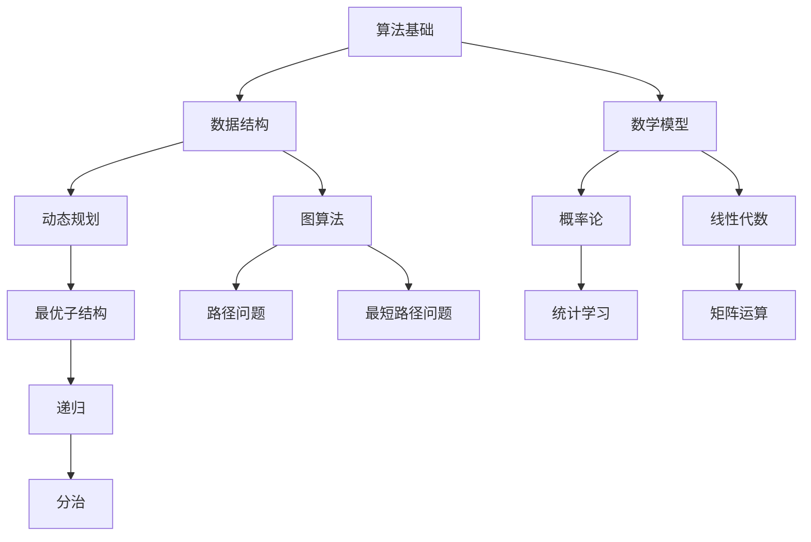

                 

关键词：京东校招、算法面试、面试题目、汇编、技术解答

## 摘要

本文将汇编2025年京东校招算法岗位的面试题目，涵盖从基础算法到高级难题的各种类型题目。通过对这些题目的深入解析，读者将能够掌握面试中的关键知识点，为实际面试做好充分准备。文章将分为八个部分，包括背景介绍、核心概念与联系、核心算法原理与步骤、数学模型与公式、项目实践、实际应用场景、未来应用展望以及总结与展望。

## 1. 背景介绍

京东作为中国领先的电子商务平台，每年都会举办校招活动，为广大应届毕业生提供优质的就业机会。算法岗位作为京东技术团队的重要组成部分，面试题目往往具有高度的挑战性和专业性。本文旨在通过解析这些题目，帮助读者了解京东校招算法岗位的面试难度和考查方向。

### 1.1 面试类型

京东校招算法岗位的面试主要分为以下几个类型：

1. **笔试**：在线编程平台上的算法题目，要求在规定时间内完成。
2. **面试**：技术面试，涵盖算法原理、数据结构、数学模型等方面。
3. **HR面**：了解求职者的职业规划、团队合作能力等。

### 1.2 面试流程

京东校招算法岗位的面试流程通常包括以下几个步骤：

1. **在线笔试**：在线编程平台上的笔试题目，评估基础算法和数据结构能力。
2. **技术面试**：通过电话或视频面试，深入了解技术能力和项目经验。
3. **HR面**：面对人力资源部门的面试，了解个人背景、职业规划等。

## 2. 核心概念与联系

在算法面试中，理解核心概念和它们之间的联系至关重要。以下是一个简化的Mermaid流程图，展示了算法面试中涉及的关键概念及其相互关系。



### 2.1 算法基础

算法基础是算法面试的核心，包括基本的算法思想、算法效率分析等。

- **算法思想**：包括排序、查找、分治、贪心等。
- **算法效率**：时间复杂度和空间复杂度分析。

### 2.2 数据结构

数据结构是实现算法的基础，常见的有数组、链表、栈、队列、树、图等。

- **数组与链表**：基本的线性数据结构，支持随机访问和顺序访问。
- **栈与队列**：支持后进先出和先进先出的数据结构。
- **树与图**：支持层次遍历和图的遍历算法。

### 2.3 数学模型

数学模型在算法面试中扮演重要角色，常见的有概率论、线性代数等。

- **概率论**：用于分析算法的随机性。
- **线性代数**：用于解决线性方程组等问题。

### 2.4 动态规划

动态规划是一种解决最优化问题的算法思想，适用于具有最优子结构特征的问题。

- **动态规划**：通过递推关系求解复杂问题。
- **最优化问题**：优化策略的选择。

### 2.5 图算法

图算法在解决路径问题和最短路径问题中具有重要作用。

- **路径问题**：找到图中两点之间的路径。
- **最短路径问题**：找到图中两点之间的最短路径。

## 3. 核心算法原理 & 具体操作步骤

### 3.1 算法原理概述

算法原理是解决特定问题的核心思想。以下是一些常见的算法原理：

- **排序算法**：如快速排序、归并排序、堆排序等。
- **查找算法**：如二分查找、哈希查找等。
- **贪心算法**：在每一步选择中都采取在当前状态下最好或最优的选择，从而希望导致结果是全局最好或最优的算法。
- **动态规划**：通过将问题分解为子问题，并保存子问题的解，避免重复计算。
- **分治算法**：将一个复杂问题分解成多个相同或相似的独立子问题，递归求解并合并子问题的解。

### 3.2 算法步骤详解

以贪心算法为例，介绍其具体操作步骤：

1. **初始化**：定义问题的输入和输出，初始化相关变量。
2. **选择操作**：在当前状态下，选择一个最优的决策。
3. **更新状态**：根据选择的操作，更新问题的状态。
4. **迭代过程**：重复执行选择和更新操作，直至问题解决。

### 3.3 算法优缺点

每种算法都有其独特的优缺点，选择合适的算法是解决问题的关键。

- **贪心算法**：优点是简单、高效，缺点是有时不能保证全局最优解。
- **动态规划**：优点是能保证全局最优解，缺点是计算复杂度较高。

### 3.4 算法应用领域

算法广泛应用于各种领域，如人工智能、数据库、网络、金融等。

- **人工智能**：深度学习、强化学习等算法。
- **数据库**：索引、查询优化等算法。
- **网络**：路由算法、负载均衡等算法。

## 4. 数学模型和公式 & 详细讲解 & 举例说明

### 4.1 数学模型构建

数学模型是算法的重要组成部分，以下是一个简单的数学模型构建示例：

- **目标函数**：最大化收益或最小化成本。
- **约束条件**：资源限制、时间限制等。

### 4.2 公式推导过程

以线性规划为例，介绍公式推导过程：

1. **目标函数**：最大化 z = cx，其中 c 是系数矩阵，x 是变量向量。
2. **约束条件**：Ax ≤ b，其中 A 是系数矩阵，x 是变量向量，b 是常数向量。

### 4.3 案例分析与讲解

以下是一个简单的线性规划案例：

- **目标函数**：最大化 z = 3x1 + 2x2。
- **约束条件**：x1 + x2 ≤ 4，2x1 + x2 ≤ 6，x1 ≥ 0，x2 ≥ 0。

通过求解该线性规划问题，可以找到最优解。

## 5. 项目实践：代码实例和详细解释说明

### 5.1 开发环境搭建

- **编程语言**：Python
- **开发工具**：PyCharm

### 5.2 源代码详细实现

以下是一个简单的Python代码实现，用于解决一个常见的算法问题：

```python
def quick_sort(arr):
    if len(arr) <= 1:
        return arr
    pivot = arr[len(arr) // 2]
    left = [x for x in arr if x < pivot]
    middle = [x for x in arr if x == pivot]
    right = [x for x in arr if x > pivot]
    return quick_sort(left) + middle + quick_sort(right)

arr = [3, 6, 8, 10, 1, 2, 1]
sorted_arr = quick_sort(arr)
print(sorted_arr)
```

### 5.3 代码解读与分析

- **函数定义**：`quick_sort` 函数接受一个数组作为输入。
- **递归调用**：通过递归调用实现排序功能。
- **三向切分**：将数组分成小于、等于和大于基准值的三部分。

### 5.4 运行结果展示

运行上述代码，输出结果为排序后的数组：

```python
[1, 1, 2, 3, 6, 8, 10]
```

## 6. 实际应用场景

算法在现实世界中的应用非常广泛，以下是一些典型的应用场景：

- **电子商务**：推荐系统、搜索算法等。
- **人工智能**：机器学习、深度学习等。
- **金融**：风险管理、量化交易等。
- **医疗**：疾病诊断、医学图像处理等。

### 6.1 推荐系统

推荐系统是电子商务中的一项关键技术，通过算法为用户推荐可能感兴趣的商品。以下是一个简单的推荐系统模型：

- **用户-物品评分矩阵**：用户对物品的评分数据。
- **协同过滤**：基于用户的行为和喜好进行推荐。

### 6.2 机器学习

机器学习是人工智能的核心技术，通过算法从数据中学习并做出预测。以下是一个简单的机器学习模型：

- **数据集**：输入数据和标签。
- **模型训练**：通过算法对数据进行训练。
- **模型评估**：评估模型的准确性和性能。

### 6.3 风险管理

风险管理是金融领域的一项重要任务，通过算法评估和管理风险。以下是一个简单的风险管理模型：

- **风险指标**：风险损失、风险敞口等。
- **优化策略**：通过算法优化风险敞口。

### 6.4 疾病诊断

疾病诊断是医疗领域的一项重要任务，通过算法帮助医生进行诊断。以下是一个简单的疾病诊断模型：

- **医学影像数据**：输入数据和标签。
- **深度学习模型**：通过算法对数据进行学习和分类。

## 7. 工具和资源推荐

### 7.1 学习资源推荐

- **书籍**：《算法导论》、《深度学习》
- **在线课程**：Coursera、edX、Udacity等
- **社区**：Stack Overflow、GitHub、CSDN等

### 7.2 开发工具推荐

- **编程语言**：Python、Java、C++
- **开发环境**：PyCharm、Visual Studio Code、Eclipse等
- **数据库**：MySQL、PostgreSQL、MongoDB等

### 7.3 相关论文推荐

- **人工智能**：《Deep Learning》、《Recurrent Neural Networks》
- **机器学习**：《Learning from Data》、《A Study of Stability in Pattern Classification》
- **算法**：《The Art of Computer Programming》、《Algorithms》

## 8. 总结：未来发展趋势与挑战

### 8.1 研究成果总结

近年来，算法在人工智能、机器学习、金融、医疗等领域取得了显著的成果，推动了相关领域的发展。

### 8.2 未来发展趋势

- **人工智能**：深度学习、强化学习等算法将继续发展。
- **大数据**：大数据处理和分析技术将得到广泛应用。
- **区块链**：区块链算法在金融、供应链等领域具有巨大潜力。

### 8.3 面临的挑战

- **计算能力**：随着算法的复杂度增加，对计算能力的要求也不断提高。
- **数据隐私**：如何在保障数据隐私的前提下进行数据处理和分析是一个重要挑战。
- **伦理问题**：算法的透明性、公平性等问题亟待解决。

### 8.4 研究展望

未来，算法研究将继续深入，探索新的算法思想和技术，为各个领域的发展提供强有力的支持。

## 9. 附录：常见问题与解答

### 9.1 什么是算法？

算法是一系列定义明确的操作步骤，用于解决特定问题。

### 9.2 算法有哪些类型？

算法主要分为排序算法、查找算法、贪心算法、动态规划等。

### 9.3 什么是数据结构？

数据结构是用于存储和组织数据的特定方式，常见的有数组、链表、树、图等。

### 9.4 什么是动态规划？

动态规划是一种解决最优化问题的算法思想，通过将问题分解为子问题并保存子问题的解，避免重复计算。

### 9.5 算法面试应该如何准备？

准备算法面试需要掌握基本的算法和数据结构知识，熟悉常见的算法原理和应用场景，同时进行大量的练习和模拟面试。

---

作者：禅与计算机程序设计艺术 / Zen and the Art of Computer Programming

[END]

