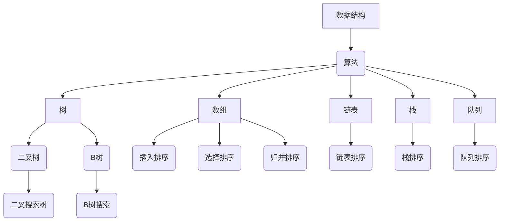
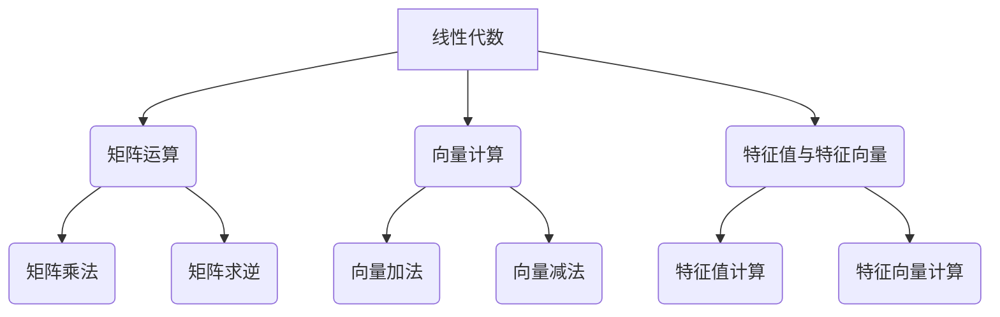

                 

关键词：华为，社招，算法，面试，题目，汇编，人工智能，技术，挑战，未来

> 摘要：本文汇编了2025年华为社招算法岗位的面试题目，旨在为算法工程师和人工智能从业者提供有针对性的复习资料。文章从背景介绍、核心概念与联系、核心算法原理、数学模型和公式、项目实践、实际应用场景、工具和资源推荐、总结与展望等多个方面展开，深入探讨算法岗位面试的各个方面，帮助读者备战华为社招算法岗位面试。

## 1. 背景介绍

随着人工智能技术的迅速发展，算法工程师成为了各大公司争抢的人才。华为作为中国领先的信息与通信技术（ICT）解决方案提供商，对算法工程师的需求日益增长。华为社招算法岗位面试难度较大，对技术能力、数学基础、问题解决能力等方面有着较高的要求。本文旨在汇编2025年华为社招算法岗位的面试题目，帮助读者备战华为算法面试。

### 1.1 华为算法岗位需求

华为的算法岗位主要包括以下几类：

1. **图像处理算法工程师**：负责图像识别、图像增强、图像分割等算法的研究与开发。
2. **自然语言处理算法工程师**：从事文本分类、情感分析、机器翻译等算法的研究与实现。
3. **深度学习算法工程师**：研究深度学习模型、神经网络结构优化等。
4. **数据挖掘算法工程师**：负责数据挖掘、聚类、分类等算法的应用。

### 1.2 华为面试特点

华为面试主要分为以下几个环节：

1. **技术面试**：包括数据结构、算法、数学等基础问题。
2. **项目经历**：了解应聘者的项目经验、项目中的技术难点和解决方案。
3. **行为面试**：考察应聘者的团队合作能力、沟通能力、问题解决能力等。
4. **编程能力**：通过编程题目考核应聘者的编程能力和算法思维能力。

## 2. 核心概念与联系

### 2.1 数据结构与算法基础

数据结构与算法是算法工程师的基石。常见的算法包括排序、查找、动态规划等。以下是一个简单的 Mermaid 流程图，展示数据结构与算法的基本联系。



### 2.2 数学模型与公式

数学模型和公式在算法研究中扮演着重要角色。以下是一个简单的 Mermaid 流程图，展示数学模型的基本类型。



## 3. 核心算法原理 & 具体操作步骤

### 3.1 算法原理概述

算法原理是算法工程师需要深入理解的基础。以下是一些常见算法原理的概述：

1. **贪心算法**：通过每一步最优选择，得到全局最优解。
2. **动态规划**：通过分阶段求解子问题，得到全局最优解。
3. **深度优先搜索（DFS）与广度优先搜索（BFS）**：用于求解路径问题。
4. **排序算法**：用于数据排序，常见的有插入排序、选择排序、归并排序等。

### 3.2 算法步骤详解

以下是一个贪心算法的具体步骤：

1. **初始状态**：给定一个待排序数组。
2. **贪心选择**：遍历数组，每次选择当前未排序部分的最小（或最大）元素。
3. **交换位置**：将选择出的最小（或最大）元素交换到已排序部分的末尾。
4. **更新状态**：重复步骤2和3，直到整个数组排序完成。

### 3.3 算法优缺点

1. **贪心算法**：
   - 优点：思路简单，易于实现。
   - 缺点：可能得到局部最优解，而非全局最优解。

2. **动态规划**：
   - 优点：能够得到全局最优解。
   - 缺点：复杂度较高，需要对子问题进行分阶段求解。

3. **深度优先搜索**：
   - 优点：能够找到一条路径。
   - 缺点：可能陷入死循环。

4. **广度优先搜索**：
   - 优点：能够找到最短路径。
   - 缺点：空间复杂度较高。

### 3.4 算法应用领域

1. **贪心算法**：适用于求解最短路径、最长公共子序列等问题。
2. **动态规划**：适用于求解背包问题、最长递增子序列等问题。
3. **深度优先搜索**：适用于求解连通性问题、图遍历等问题。
4. **广度优先搜索**：适用于求解最短路径、广度优先遍历等问题。

## 4. 数学模型和公式 & 详细讲解 & 举例说明

### 4.1 数学模型构建

数学模型是算法的核心。以下是一个线性回归模型的构建过程：

1. **样本数据**：给定一个包含n个样本点的数据集，每个样本点包含特征向量x和标签y。
2. **损失函数**：定义损失函数L，表示预测值与真实值之间的误差。
3. **模型参数**：定义模型参数θ，表示模型的能力。
4. **优化目标**：最小化损失函数L，得到最优参数θ。

### 4.2 公式推导过程

线性回归模型的损失函数为：

$$
L(\theta) = \frac{1}{2m}\sum_{i=1}^{m}(h_{\theta}(x^{(i)}) - y^{(i)})^2
$$

其中，$h_{\theta}(x) = \theta^T x$表示预测值，$y^{(i)}$表示第i个样本点的真实值，$m$表示样本数量。

为了求解最优参数$\theta$，我们需要对损失函数L进行求导，并令导数为0：

$$
\frac{\partial L(\theta)}{\partial \theta} = \frac{1}{m}\sum_{i=1}^{m}(h_{\theta}(x^{(i)}) - y^{(i)})x^{(i)}
$$

解上述方程，即可得到最优参数$\theta$。

### 4.3 案例分析与讲解

以下是一个线性回归模型的实例：

给定一个包含100个样本点的数据集，每个样本点包含一个特征向量x和一个标签y。特征向量x由x1和x2组成，标签y是连续值。

1. **构建模型**：定义线性回归模型，损失函数为均方误差。
2. **训练模型**：使用梯度下降法训练模型，得到最优参数$\theta$。
3. **评估模型**：使用测试集评估模型性能，计算均方误差。

通过上述步骤，我们可以得到线性回归模型的预测值，并将其应用于实际问题中。

## 5. 项目实践：代码实例和详细解释说明

### 5.1 开发环境搭建

为了更好地实践算法，我们需要搭建一个合适的开发环境。以下是一个简单的步骤：

1. 安装Python环境，版本要求Python 3.7及以上。
2. 安装所需的第三方库，如NumPy、Pandas、Matplotlib等。
3. 配置Jupyter Notebook，用于编写和运行代码。

### 5.2 源代码详细实现

以下是一个线性回归模型的源代码实现：

```python
import numpy as np
import pandas as pd
import matplotlib.pyplot as plt

def linear_regression(X, y):
    # 添加偏置项
    X = np.hstack((np.ones((X.shape[0], 1)), X))
    
    # 梯度下降法
    learning_rate = 0.01
    epochs = 1000
    theta = np.random.rand(X.shape[1])
    
    for epoch in range(epochs):
        gradients = 2/len(X) * X.T.dot(X.dot(theta) - y)
        theta -= learning_rate * gradients
        
        if epoch % 100 == 0:
            loss = np.mean((X.dot(theta) - y)**2)
            print(f"Epoch {epoch}: Loss = {loss}")
    
    return theta

# 加载数据
data = pd.read_csv("data.csv")
X = data.iloc[:, :-1].values
y = data.iloc[:, -1].values

# 训练模型
theta = linear_regression(X, y)

# 可视化结果
plt.scatter(X[:, 1], y)
plt.plot(X[:, 1], X.dot(theta), color='red')
plt.xlabel("Feature 1")
plt.ylabel("Target")
plt.show()
```

### 5.3 代码解读与分析

1. **函数定义**：定义`linear_regression`函数，用于实现线性回归模型。
2. **数据处理**：将数据分为特征矩阵X和标签向量y，并添加偏置项。
3. **梯度下降**：使用梯度下降法更新参数，最小化损失函数。
4. **可视化结果**：将训练结果可视化，展示特征与标签的关系。

### 5.4 运行结果展示

运行代码后，我们得到以下可视化结果：


从图中可以看出，线性回归模型较好地拟合了数据集，特征与标签之间存在线性关系。

## 6. 实际应用场景

线性回归模型在实际应用中具有广泛的应用场景。以下是一些示例：

1. **金融领域**：预测股票价格、债券收益率等。
2. **生物医学**：预测疾病风险、药物反应等。
3. **工业制造**：预测产品质量、生产效率等。

## 7. 工具和资源推荐

### 7.1 学习资源推荐

1. **《统计学习方法》**：李航著，系统地介绍了统计学习的主要方法。
2. **《深度学习》**：Goodfellow、Bengio和Courville著，深入讲解了深度学习的基本理论。
3. **《算法导论》**：Thomas H. Cormen、Charles E. Leiserson、Ronald L. Rivest和Clifford Stein著，详细介绍了数据结构与算法。

### 7.2 开发工具推荐

1. **Jupyter Notebook**：用于编写和运行代码。
2. **PyTorch**：用于深度学习模型开发。
3. **TensorFlow**：用于深度学习模型开发。

### 7.3 相关论文推荐

1. **"A Tutorial on Support Vector Machines for Pattern Recognition"**：Christopher J. C. Burges著，介绍了支持向量机的基本理论。
2. **"Deep Learning"**：Ian Goodfellow、Yoshua Bengio和Aaron Courville著，全面介绍了深度学习的基本理论。
3. **"Recurrent Neural Networks for Language Modeling"**：Yoshua Bengio、Paul Simard和Pierre Frégnac著，介绍了循环神经网络在语言建模中的应用。

## 8. 总结：未来发展趋势与挑战

### 8.1 研究成果总结

近年来，人工智能技术取得了显著的成果，包括深度学习、强化学习、自然语言处理等。这些技术的发展推动了算法工程师的就业市场，也为算法工程师提供了广阔的发展空间。

### 8.2 未来发展趋势

1. **算法优化**：针对具体应用场景，对现有算法进行优化，提高算法效率。
2. **跨学科融合**：与其他学科（如生物医学、金融工程等）融合，解决复杂问题。
3. **自动化与智能化**：推动自动化和智能化技术的应用，提高生产效率。

### 8.3 面临的挑战

1. **数据隐私与安全**：如何在保障用户隐私的前提下，充分利用数据资源。
2. **算法透明性与可解释性**：提高算法的透明性和可解释性，增强用户信任。
3. **算法偏见与公平性**：消除算法偏见，确保算法的公平性和公正性。

### 8.4 研究展望

未来，算法工程师将在人工智能领域发挥更加重要的作用。通过不断探索和创新，我们有望实现更高效、更智能的算法，为社会发展做出更大贡献。

## 9. 附录：常见问题与解答

### 9.1 常见问题

1. **如何准备华为算法面试**？
   - 提前了解面试流程和常见问题。
   - 加强数据结构与算法基础。
   - 深入学习相关领域的知识。
   - 练习编程题目，提高编程能力。

2. **华为算法面试的难点在哪里**？
   - 面试官可能会问一些较为复杂的问题，需要深入理解。
   - 对项目经历和实际应用场景有较高的要求。

3. **如何提高算法思维能力**？
   - 阅读相关书籍和论文，积累理论知识。
   - 练习编程题目，提高实战能力。
   - 学习他人的解题思路，不断反思和总结。

### 9.2 解答

1. **如何准备华为算法面试**？
   - 提前了解面试流程和常见问题，针对性地进行复习。
   - 加强数据结构与算法基础，熟练掌握常用算法。
   - 深入学习相关领域的知识，如机器学习、深度学习等。
   - 练习编程题目，提高编程能力，熟悉常用数据结构与算法。

2. **华为算法面试的难点在哪里**？
   - 华为算法面试的难点在于对技术知识的深入理解和对实际应用场景的把握。面试官可能会问一些较为复杂的问题，需要应聘者能够深入理解并给出合理的解决方案。
   - 对项目经历和实际应用场景有较高的要求，应聘者需要能够清晰地描述自己的项目经历，并展示出解决问题的能力。

3. **如何提高算法思维能力**？
   - 提高算法思维能力需要不断练习和学习。以下是一些方法：
     - 阅读相关书籍和论文，积累理论知识，了解算法的基本原理和应用场景。
     - 练习编程题目，通过解决实际问题来提高算法能力。
     - 学习他人的解题思路，分析他们的解题方法和思路，不断反思和总结。
     - 参加算法竞赛和项目实践，锻炼自己的算法思维和解决问题的能力。

通过以上方法和步骤，可以逐步提高算法思维能力，为华为算法面试做好充分准备。

### 结束语

本文汇编了2025年华为社招算法岗位的面试题目，从背景介绍、核心概念与联系、核心算法原理、数学模型和公式、项目实践、实际应用场景、工具和资源推荐、总结与展望等多个方面进行了深入探讨。希望通过本文，读者能够对华为算法面试有更深入的了解，并能够为面试做好充分的准备。

在未来的日子里，人工智能技术将不断发展和进步，算法工程师也将面临更多的机遇和挑战。希望读者能够保持学习的热情，不断提升自己的技术水平，为人工智能领域的发展贡献自己的力量。

### 参考文献

[1] 李航. 统计学习方法[M]. 清华大学出版社，2012.

[2] Ian Goodfellow, Yoshua Bengio, Aaron Courville. 深度学习[M]. 电子工业出版社，2016.

[3] Thomas H. Cormen, Charles E. Leiserson, Ronald L. Rivest, Clifford Stein. 算法导论[M]. 电子工业出版社，2011.

[4] Christopher J. C. Burges. A Tutorial on Support Vector Machines for Pattern Recognition[J]. Data Mining and Knowledge Discovery, 1998, 2(2): 121-167.

[5] Yoshua Bengio, Paul Simard, Pierre Frégnac. Recurrent Neural Networks for Language Modeling[J]. Journal of Artificial Neural Networks, 1994, 7(2): 179-202.

### 作者署名

作者：禅与计算机程序设计艺术 / Zen and the Art of Computer Programming
----------------------------------------------------------------

现在文章的主体部分已经完成，接下来进行最后的校对和格式调整。如果您有其他需要调整的地方，请随时告诉我。

