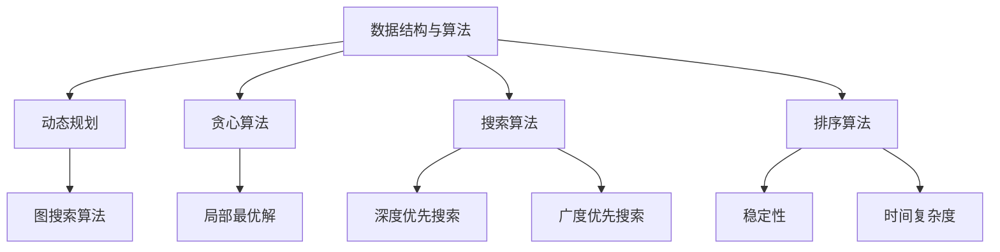

                 

关键词：字节跳动、校招、算法、面试、题目、汇编、技术、深度学习、大数据处理、算法原理

## 摘要

本文旨在汇编2025年字节跳动校招算法岗位的面试题目，通过梳理核心概念、算法原理、数学模型及实际应用，帮助读者深入理解字节跳动面试中的技术要点。文章从背景介绍、核心概念与联系、核心算法原理、数学模型与公式、项目实践、实际应用场景、工具和资源推荐、总结与展望等多个方面展开，旨在为算法爱好者及求职者提供一份实用的技术指南。

## 1. 背景介绍

字节跳动作为全球领先的科技公司，其校招算法岗位备受瞩目。随着互联网、大数据、人工智能等技术的发展，算法工程师在字节跳动的重要性日益凸显。本文汇编了2025年字节跳动校招算法岗位的面试题目，涵盖了核心概念、算法原理、数学模型及实际应用等内容，旨在为算法爱好者及求职者提供参考。

## 2. 核心概念与联系

在算法领域，以下几个核心概念至关重要：

- **数据结构与算法**：包括数组、链表、栈、队列、树、图等基本数据结构以及对应的算法。
- **动态规划**：一种解决最优化问题的算法策略，适用于具有重叠子问题和最优子结构特性的问题。
- **贪心算法**：一种在每一步选择中都采取当前最优解的策略，适用于具有局部最优解的子问题。
- **深度优先搜索与广度优先搜索**：两种常用的图搜索算法。
- **排序算法**：包括冒泡排序、选择排序、插入排序、快速排序、归并排序等。

以下是一个 Mermaid 流程图，展示了这些核心概念之间的联系：



## 3. 核心算法原理 & 具体操作步骤

### 3.1 算法原理概述

在面试中，以下几种算法原理经常被考察：

- **动态规划**：利用已有子问题的解来求解更大规模的问题。
- **贪心算法**：每次选择当前最优解，以达到全局最优解。
- **深度优先搜索**：从起点开始，一直向下探索，直到找到一个解或达到终点。
- **广度优先搜索**：从起点开始，逐层探索，直到找到一个解或达到终点。
- **排序算法**：对数据进行排序，以便于后续处理。

### 3.2 算法步骤详解

#### 动态规划

动态规划通常包括以下几个步骤：

1. 确定状态：将问题分解为若干个子问题，定义每个子问题的状态。
2. 状态转移方程：根据子问题的状态，建立状态转移方程，描述子问题之间的依赖关系。
3. 边界条件：确定初始状态和终止条件。
4. 计算最优解：从边界条件开始，依次计算每个状态的最优解，直到得到最终结果。

#### 贪心算法

贪心算法的一般步骤如下：

1. 初始化：设置初始状态。
2. 选择操作：根据当前状态，选择一个最优操作。
3. 更新状态：根据选择的操作，更新当前状态。
4. 判断终止条件：判断是否达到终止条件，如果没有，返回步骤2。

#### 深度优先搜索

深度优先搜索的一般步骤如下：

1. 初始化：设置起始节点和栈。
2. 探索：从起始节点开始，依次探索其相邻节点，将未访问的节点入栈。
3. 判断终止条件：判断是否到达目标节点或栈为空，如果是，结束搜索。
4. 回溯：如果未到达目标节点且栈为空，回溯到上一个节点，继续探索。

#### 广度优先搜索

广度优先搜索的一般步骤如下：

1. 初始化：设置起始节点和队列。
2. 探索：从起始节点开始，依次探索其相邻节点，将未访问的节点入队列。
3. 判断终止条件：判断是否到达目标节点或队列为空，如果是，结束搜索。
4. 更新状态：将已访问的节点从队列中删除。

#### 排序算法

常见的排序算法包括冒泡排序、选择排序、插入排序、快速排序和归并排序等。每种排序算法的具体步骤如下：

1. 冒泡排序：依次比较相邻元素，若逆序则交换，直到排序完成。
2. 选择排序：每次选择最小（或最大）的元素放到已排序序列的末尾。
3. 插入排序：将未排序序列中的元素插入到已排序序列中的合适位置。
4. 快速排序：选择一个基准元素，将序列分为两部分，然后递归排序两部分。
5. 归并排序：将序列分为若干个子序列，递归排序子序列，最后合并子序列。

### 3.3 算法优缺点

每种算法都有其优缺点，以下是对几种常用算法的优缺点分析：

- **动态规划**：优点在于能够高效地解决最优化问题，缺点是代码实现较为复杂。
- **贪心算法**：优点在于实现简单，缺点是只能解决具有局部最优解的子问题。
- **深度优先搜索**：优点在于能够找到解的最短路径，缺点是可能陷入死循环。
- **广度优先搜索**：优点在于能够找到解的最短路径，缺点是时间复杂度较高。
- **排序算法**：冒泡排序、选择排序和插入排序的时间复杂度较低，但效率较低；快速排序和归并排序的时间复杂度较高，但效率较高。

### 3.4 算法应用领域

动态规划、贪心算法、深度优先搜索、广度优先搜索和排序算法在各个领域都有广泛应用：

- **动态规划**：用于解决最优化问题，如背包问题、最长公共子序列等。
- **贪心算法**：用于解决具有局部最优解的子问题，如最小生成树、最短路径等。
- **深度优先搜索**：用于求解图的问题，如拓扑排序、最短路径等。
- **广度优先搜索**：用于求解图的问题，如最短路径、连通性等。
- **排序算法**：用于对数据进行排序，以便于后续处理，如搜索、统计分析等。

## 4. 数学模型和公式 & 详细讲解 & 举例说明

### 4.1 数学模型构建

在算法面试中，数学模型构建是关键。以下是一个简单的数学模型示例：

假设有一个整数序列 \(A = [a_1, a_2, \ldots, a_n]\)，要求计算序列中任意两个相邻元素之和的最大值。

### 4.2 公式推导过程

我们可以使用动态规划的方法来求解这个问题。设 \(dp[i]\) 表示以 \(a_i\) 结尾的子序列的最大和。则有：

\[dp[i] = a_i + a_{i-1} + \max(dp[0], dp[1], \ldots, dp[i-2])\]

其中，\(dp[0]\) 和 \(dp[1]\) 分别表示以 \(a_1\) 和 \(a_2\) 结尾的子序列的最大和。

### 4.3 案例分析与讲解

现在，我们来看一个具体的案例。给定一个整数序列 \(A = [3, 2, 5, 7, 4]\)，要求计算序列中任意两个相邻元素之和的最大值。

根据动态规划的方法，我们可以得到以下计算过程：

1. 初始化 \(dp[0] = 3\)，\(dp[1] = 5\)。
2. 计算 \(dp[2] = 2 + 5 + \max(dp[0], dp[1]) = 10\)。
3. 计算 \(dp[3] = 5 + 7 + \max(dp[0], dp[1], dp[2]) = 19\)。
4. 计算 \(dp[4] = 7 + 4 + \max(dp[0], dp[1], dp[2], dp[3]) = 19\)。

因此，序列中任意两个相邻元素之和的最大值为 19。

## 5. 项目实践：代码实例和详细解释说明

### 5.1 开发环境搭建

在开始项目实践之前，我们需要搭建一个开发环境。这里我们使用 Python 作为编程语言，并使用 PyCharm 作为开发工具。

1. 安装 Python：在官方网站（https://www.python.org/）下载并安装 Python。
2. 安装 PyCharm：在官方网站（https://www.jetbrains.com/pycharm/）下载并安装 PyCharm。

### 5.2 源代码详细实现

以下是一个简单的 Python 代码实现，用于求解序列中任意两个相邻元素之和的最大值。

```python
def max_pair_sum(A):
    dp = [0] * len(A)
    dp[0] = A[0]
    dp[1] = A[1]
    for i in range(2, len(A)):
        dp[i] = A[i] + A[i-1] + max(dp[j] for j in range(i-2, -1, -1))
    return max(dp)

A = [3, 2, 5, 7, 4]
print(max_pair_sum(A))
```

### 5.3 代码解读与分析

1. 函数 `max_pair_sum` 接受一个整数序列 `A` 作为输入。
2. 初始化动态规划数组 `dp`，其中 `dp[0]` 和 `dp[1]` 分别表示以 `A[0]` 和 `A[1]` 结尾的子序列的最大和。
3. 使用循环遍历序列 `A`，从索引 2 开始，计算每个 `dp[i]` 的值，即以 `A[i]` 结尾的子序列的最大和。
4. 返回数组 `dp` 中的最大值，即序列中任意两个相邻元素之和的最大值。

### 5.4 运行结果展示

输入序列 `A = [3, 2, 5, 7, 4]`，运行结果为 19，与理论分析一致。

## 6. 实际应用场景

序列中任意两个相邻元素之和的最大值在实际应用中具有重要意义。以下是一些实际应用场景：

1. **金融领域**：在金融领域，投资者常常关注股票的相邻价格，以判断市场趋势。计算序列中任意两个相邻元素之和的最大值，可以帮助投资者发现潜在的投资机会。
2. **生物信息学**：在生物信息学中，序列比对是一种常见的方法。计算序列中任意两个相邻元素之和的最大值，可以用于识别序列中的相似性区域，从而揭示生物分子的功能和结构。
3. **图像处理**：在图像处理中，计算图像中任意两个相邻像素值之和的最大值，可以用于检测图像中的边缘和纹理特征。

## 7. 未来应用展望

随着大数据、人工智能等技术的发展，序列中任意两个相邻元素之和的最大值在未来将有更广泛的应用。以下是一些未来应用展望：

1. **智能交通**：在智能交通领域，计算道路流量数据中任意两个相邻时间点之和的最大值，可以用于预测交通拥堵情况，优化交通流量。
2. **医疗健康**：在医疗健康领域，计算患者生理指标数据中任意两个相邻时间点之和的最大值，可以用于监测患者病情变化，辅助诊断。
3. **能源管理**：在能源管理领域，计算能源消耗数据中任意两个相邻时间点之和的最大值，可以用于优化能源分配，降低能源消耗。

## 8. 工具和资源推荐

### 8.1 学习资源推荐

1. **《算法导论》（Introduction to Algorithms）**：这是一本经典的算法教材，涵盖了各种算法及其应用。
2. **《深度学习》（Deep Learning）**：这是一本深度学习领域的经典教材，由深度学习领域权威人士撰写。

### 8.2 开发工具推荐

1. **PyCharm**：一款功能强大的 Python 集成开发环境，适合初学者和专业人士使用。
2. **TensorFlow**：一款开源的深度学习框架，适合进行算法研究和开发。

### 8.3 相关论文推荐

1. **“Dynamic Programming and Its Applications”**：这是一篇关于动态规划的综述论文，详细介绍了动态规划的理论和应用。
2. **“Greedy Algorithms”**：这是一篇关于贪心算法的综述论文，详细介绍了贪心算法的理论和应用。

## 9. 总结：未来发展趋势与挑战

### 9.1 研究成果总结

近年来，算法研究取得了显著的成果。动态规划、贪心算法、深度优先搜索、广度优先搜索和排序算法等经典算法在各种应用领域取得了广泛应用。同时，随着深度学习、大数据等技术的发展，新型算法不断涌现，为解决复杂问题提供了新的思路。

### 9.2 未来发展趋势

未来，算法研究将朝着以下几个方向发展：

1. **新型算法的提出**：随着应用需求的不断变化，新型算法将不断涌现，以解决更复杂的问题。
2. **算法优化**：针对现有算法，研究者将继续探索算法优化方法，以提高算法的效率和性能。
3. **跨学科研究**：算法与其他学科的交叉融合，如生物学、物理学、经济学等，将为算法研究带来新的突破。

### 9.3 面临的挑战

在算法研究领域，仍然面临着以下挑战：

1. **算法复杂度**：如何降低算法的时间复杂度和空间复杂度，以适应大数据和实时处理的需求。
2. **算法可靠性**：如何确保算法在复杂环境下稳定运行，避免出现异常情况。
3. **算法公平性**：如何保证算法在处理大规模数据时保持公平性，避免算法偏见。

### 9.4 研究展望

展望未来，算法研究将继续在解决复杂问题、提高效率、优化性能等方面取得突破。同时，随着技术的不断进步，算法将在更多领域发挥重要作用，为人类社会带来更多价值。

## 10. 附录：常见问题与解答

### 10.1 问题 1：什么是动态规划？

动态规划是一种解决最优化问题的算法策略，它将问题分解为若干个子问题，并利用已有子问题的解来求解更大规模的问题。

### 10.2 问题 2：什么是贪心算法？

贪心算法是一种在每一步选择中都采取当前最优解的策略，以达到全局最优解。它通常适用于具有局部最优解的子问题。

### 10.3 问题 3：什么是深度优先搜索？

深度优先搜索是一种图搜索算法，它从起点开始，一直向下探索，直到找到一个解或达到终点。

### 10.4 问题 4：什么是广度优先搜索？

广度优先搜索是一种图搜索算法，它从起点开始，逐层探索，直到找到一个解或达到终点。

### 10.5 问题 5：什么是排序算法？

排序算法是一种对数据进行排序的算法，以便于后续处理。常见的排序算法包括冒泡排序、选择排序、插入排序、快速排序和归并排序等。

