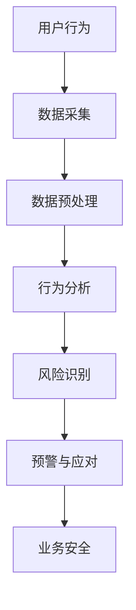

                 

关键词：滴滴，社招，实时风控系统，工程师面试，技术挑战，解决方案

> 摘要：本文旨在为2025年即将加入滴滴社招的实时风控系统工程师提供全面的面试指南。我们将深入探讨实时风控系统的核心概念、算法原理、数学模型、项目实践和未来应用，以及面试过程中可能遇到的挑战和应对策略。

## 1. 背景介绍

随着互联网的快速发展，实时数据处理和分析已经成为企业运营中不可或缺的一环。特别是在金融、保险、电商等高风险领域，实时风控系统能够帮助企业快速识别和应对潜在风险，保障业务的安全和稳定。滴滴出行作为全球领先的出行服务平台，其对实时风控系统的需求尤为迫切。

### 1.1 滴滴出行简介

滴滴出行成立于2012年，是全球领先的移动出行平台，提供包括网约车、出租车、共享单车、公交、代驾等多种出行服务。滴滴出行在国内外拥有数亿用户，每天处理的海量订单数据对实时风控系统的性能和稳定性提出了极高的要求。

### 1.2 实时风控系统的意义

实时风控系统是保障滴滴出行业务安全的重要防线。它能够实时监控用户行为，识别异常操作，自动触发预警和应对措施，从而防止欺诈、恶意攻击等安全事件的发生。

## 2. 核心概念与联系

在深入了解实时风控系统之前，我们需要先了解一些核心概念和它们之间的联系。以下是一个简化的Mermaid流程图，用于描述这些概念之间的关系。



### 2.1 数据采集

数据采集是实时风控系统的第一步，它涉及从各种数据源（如用户行为日志、交易记录等）收集数据。滴滴出行拥有海量的用户数据，这些数据是构建实时风控系统的基础。

### 2.2 数据预处理

数据预处理包括数据清洗、去重、数据格式转换等操作，以确保数据的质量和一致性。在滴滴出行，数据预处理是一个复杂的过程，需要处理多种类型的数据，如结构化数据和非结构化数据。

### 2.3 行为分析

行为分析是实时风控系统的核心，它通过机器学习、统计分析等方法，对用户行为进行分析，识别出潜在的异常行为。滴滴出行使用多种行为分析模型，包括决策树、神经网络等，以提升风险识别的准确性。

### 2.4 风险识别

风险识别是基于行为分析的结果，通过设定阈值和规则，自动识别出潜在的风险。滴滴出行的风险识别系统可以实现实时监测和自动报警，确保业务的安全。

### 2.5 预警与应对

预警与应对是实时风控系统的最后一步，它包括发送警报、触发应对措施等。滴滴出行的风控系统能够根据风险级别，自动调整应对策略，从而保障业务的安全。

### 2.6 业务安全

业务安全是实时风控系统的最终目标，通过识别和应对潜在风险，保障滴滴出行业务的正常运行。

## 3. 核心算法原理 & 具体操作步骤

### 3.1 算法原理概述

实时风控系统所使用的算法主要包括机器学习算法和统计分析方法。机器学习算法能够自动从历史数据中学习规律，识别出潜在的异常行为。而统计分析方法则通过对数据进行分析，设定阈值和规则，以识别风险。

### 3.2 算法步骤详解

#### 3.2.1 数据采集

滴滴出行的实时风控系统通过数据采集模块，从多个数据源收集数据。这些数据源包括用户行为日志、交易记录、GPS数据等。

#### 3.2.2 数据预处理

数据预处理模块负责清洗和转换数据，使其满足算法的要求。在滴滴出行，数据预处理包括去重、格式转换、数据归一化等步骤。

#### 3.2.3 行为分析

行为分析模块使用机器学习算法和统计分析方法，对用户行为进行分析。具体包括以下步骤：

1. **特征提取**：从原始数据中提取关键特征，如用户的历史行为模式、交易金额、时间戳等。
2. **特征选择**：选择对风险识别最重要的特征，提高模型的准确性。
3. **模型训练**：使用历史数据训练机器学习模型，如决策树、神经网络等。
4. **异常检测**：使用训练好的模型，对实时数据进行分析，识别潜在的异常行为。

#### 3.2.4 风险识别

风险识别模块根据行为分析的结果，设定阈值和规则，自动识别出潜在的风险。在滴滴出行，风险识别包括以下步骤：

1. **阈值设定**：根据业务需求，设定风险阈值，如交易金额、用户行为次数等。
2. **规则匹配**：将实时数据与预定义的规则进行匹配，识别出潜在的风险。
3. **风险评估**：根据风险级别，对风险进行评估，如高、中、低风险。

#### 3.2.5 预警与应对

预警与应对模块根据风险识别的结果，自动发送警报并触发应对措施。在滴滴出行，预警与应对包括以下步骤：

1. **警报发送**：根据风险级别，发送不同级别的警报。
2. **应对措施**：根据警报内容，自动执行应对措施，如冻结账户、限制操作等。
3. **反馈与优化**：将应对结果反馈给算法模型，优化模型性能。

### 3.3 算法优缺点

#### 3.3.1 机器学习算法

**优点**：

1. **自动识别异常行为**：机器学习算法可以从历史数据中学习规律，自动识别异常行为。
2. **适应性强**：机器学习算法可以根据不同的业务需求，调整模型参数，适应不同的场景。

**缺点**：

1. **计算复杂度高**：机器学习算法需要大量计算资源，对实时性要求较高的场景可能不适用。
2. **数据依赖性强**：机器学习算法的性能高度依赖于数据质量，数据不完整或不准确可能导致模型失效。

#### 3.3.2 统计分析方法

**优点**：

1. **计算效率高**：统计分析方法计算复杂度相对较低，适合实时性要求较高的场景。
2. **可解释性强**：统计分析方法的原理简单，易于理解和解释。

**缺点**：

1. **识别能力有限**：统计分析方法难以自动识别复杂的异常行为。
2. **适应性差**：统计分析方法需要根据不同的业务需求，重新设定阈值和规则，适应性较差。

### 3.4 算法应用领域

实时风控系统广泛应用于金融、保险、电商等领域。在滴滴出行，实时风控系统主要用于以下应用领域：

1. **欺诈检测**：实时监控用户行为，识别潜在的欺诈行为，如刷单、套现等。
2. **信用评分**：根据用户的历史行为和交易记录，实时计算用户的信用评分。
3. **风险控制**：实时监控业务运行状态，识别潜在的风险，采取相应的控制措施。

## 4. 数学模型和公式 & 详细讲解 & 举例说明

实时风控系统的数学模型和公式是构建和优化算法的基础。以下将详细介绍几个核心的数学模型和公式，并给出具体的例子说明。

### 4.1 数学模型构建

#### 4.1.1 聚类分析模型

聚类分析是一种无监督学习算法，用于将数据集中的对象划分为若干个簇，使得同一个簇内的对象相似度较高，不同簇的对象相似度较低。以下是一个基于K-means算法的聚类分析模型：

$$
\begin{aligned}
    \min \sum_{i=1}^{k} \sum_{x_j \in S_i} ||x_j - \mu_i||^2 \\
    s.t. \\
    \mu_i = \frac{1}{|S_i|} \sum_{x_j \in S_i} x_j \\
    x_j \in S_i \text{ for all } j
\end{aligned}
$$

其中，$k$ 是簇的数量，$x_j$ 是数据集中的第 $j$ 个对象，$\mu_i$ 是簇 $i$ 的中心点，$S_i$ 是属于簇 $i$ 的对象集合。

#### 4.1.2 决策树模型

决策树是一种有监督学习算法，通过一系列规则来划分数据，以实现对新数据的分类或回归。以下是一个简单的决策树模型：

$$
\begin{aligned}
    & \text{如果 } \text{特征}_1 > \text{阈值}_1 \\
    & \text{则 } y = \text{类别}_1 \\
    & \text{否则，如果 } \text{特征}_2 < \text{阈值}_2 \\
    & \text{则 } y = \text{类别}_2 \\
    & \text{否则，...}
\end{aligned}
$$

其中，$y$ 是预测的类别，$\text{特征}_1$ 和 $\text{特征}_2$ 是数据集中的特征，$\text{阈值}_1$ 和 $\text{阈值}_2$ 是设定的阈值。

### 4.2 公式推导过程

#### 4.2.1 均值-方差模型

均值-方差模型是投资组合理论的基础，用于衡量投资组合的风险和收益。以下是一个简化的推导过程：

$$
\begin{aligned}
    \sigma^2 &= \sum_{i=1}^{n} w_i^2 \sigma_i^2 + 2 \sum_{i=1}^{n} \sum_{j=i+1}^{n} w_i w_j \sigma_i \sigma_j \rho_{ij} \\
    \mu &= \sum_{i=1}^{n} w_i \mu_i
\end{aligned}
$$

其中，$w_i$ 是资产 $i$ 的权重，$\sigma_i$ 是资产 $i$ 的标准差，$\mu_i$ 是资产 $i$ 的期望收益，$\sigma^2$ 是投资组合的方差，$\mu$ 是投资组合的期望收益，$\rho_{ij}$ 是资产 $i$ 和资产 $j$ 之间的相关系数。

#### 4.2.2 回归分析模型

回归分析是一种常用的统计分析方法，用于建立自变量和因变量之间的关系。以下是一个简单的线性回归模型：

$$
y = \beta_0 + \beta_1 x_1 + \beta_2 x_2 + ... + \beta_n x_n + \epsilon
$$

其中，$y$ 是因变量，$x_1, x_2, ..., x_n$ 是自变量，$\beta_0, \beta_1, ..., \beta_n$ 是回归系数，$\epsilon$ 是误差项。

### 4.3 案例分析与讲解

#### 4.3.1 欺诈检测

在滴滴出行，欺诈检测是一个典型的实时风控应用场景。以下是一个基于K-means算法的欺诈检测案例：

1. **数据采集**：收集用户的历史行为数据，包括订单数量、订单金额、用户活跃度等。
2. **数据预处理**：对数据去重、格式转换和数据归一化，使其满足聚类分析的要求。
3. **聚类分析**：使用K-means算法，将数据划分为若干个簇，每个簇代表一类用户行为。
4. **异常检测**：根据簇的中心点，设定阈值，识别出异常行为。例如，如果一个用户的订单金额远高于其他用户的订单金额，则可以视为潜在的欺诈行为。
5. **预警与应对**：对识别出的欺诈行为，自动发送警报并触发应对措施，如冻结账户、限制操作等。

#### 4.3.2 信用评分

在金融领域，信用评分是评估客户信用风险的重要手段。以下是一个基于线性回归模型的信用评分案例：

1. **数据采集**：收集客户的历史信用数据，包括信用额度、还款记录、逾期记录等。
2. **数据预处理**：对数据去重、格式转换和数据归一化，使其满足线性回归分析的要求。
3. **特征选择**：选择对信用评分最重要的特征，如还款记录、逾期记录等。
4. **模型训练**：使用历史数据训练线性回归模型，确定回归系数。
5. **信用评分**：对新客户的数据进行评分，预测其信用风险。

## 5. 项目实践：代码实例和详细解释说明

在滴滴出行的实时风控系统中，代码实现是核心环节。以下是一个简化的Python代码实例，用于展示实时风控系统的基本架构和关键实现细节。

### 5.1 开发环境搭建

在开发实时风控系统时，需要搭建一个稳定高效的开发环境。以下是常用的开发工具和库：

- **Python**：作为主要的编程语言，Python 具有丰富的机器学习和数据分析库。
- **TensorFlow**：用于实现机器学习算法，特别是深度学习模型。
- **Scikit-learn**：用于实现传统的机器学习算法，如决策树、支持向量机等。
- **Pandas**：用于数据处理，包括数据清洗、格式转换等。
- **NumPy**：用于高效数值计算。

### 5.2 源代码详细实现

```python
import pandas as pd
import numpy as np
from sklearn.cluster import KMeans
from sklearn.tree import DecisionTreeClassifier
from sklearn.model_selection import train_test_split
from sklearn.metrics import accuracy_score

# 数据采集
data = pd.read_csv('user_behavior.csv')

# 数据预处理
data = data.drop_duplicates()
data['order_amount'] = data['order_amount'] / max(data['order_amount'])

# 行为分析
kmeans = KMeans(n_clusters=5)
kmeans.fit(data)
data['cluster'] = kmeans.predict(data)

# 风险识别
dt = DecisionTreeClassifier()
dt.fit(data[['cluster', 'order_amount']], data['is_fraud'])

# 预警与应对
def detect_fraud(order_data):
    order_data['cluster'] = kmeans.predict(order_data[['order_amount']])
    prediction = dt.predict(order_data[['cluster', 'order_amount']])
    if prediction[0] == 1:
        send_alert()
        apply_anti_fraud_measures()

# 模型评估
X_train, X_test, y_train, y_test = train_test_split(data[['cluster', 'order_amount']], data['is_fraud'], test_size=0.2)
dt.fit(X_train, y_train)
y_pred = dt.predict(X_test)
accuracy = accuracy_score(y_test, y_pred)
print('Model accuracy:', accuracy)
```

### 5.3 代码解读与分析

以上代码实现了一个简化的实时风控系统，主要包括数据采集、数据预处理、行为分析、风险识别和预警与应对等步骤。

1. **数据采集**：从CSV文件中读取用户行为数据。
2. **数据预处理**：对数据进行去重和归一化处理，使其满足聚类分析的要求。
3. **行为分析**：使用K-means算法对用户行为进行聚类分析，识别出潜在的风险。
4. **风险识别**：使用决策树算法训练模型，识别出欺诈行为。
5. **预警与应对**：定义一个函数，根据模型预测结果，自动发送警报并触发应对措施。
6. **模型评估**：使用测试数据集评估模型性能，计算准确率。

## 6. 实际应用场景

实时风控系统在滴滴出行有广泛的应用场景，以下是一些典型的应用案例：

1. **用户行为分析**：实时监控用户行为，识别出异常操作，如刷单、套现等。
2. **信用评分**：根据用户的历史行为和交易记录，实时计算用户的信用评分。
3. **风险控制**：实时监控业务运行状态，识别潜在的风险，采取相应的控制措施。
4. **欺诈检测**：通过分析用户行为数据，识别出潜在的欺诈行为，保障业务安全。

## 7. 未来应用展望

随着技术的不断发展，实时风控系统在未来有望在以下领域取得重要突破：

1. **智能化**：通过引入人工智能和深度学习技术，提升风控系统的智能化水平。
2. **实时性**：优化算法和系统架构，提高风控系统的实时性，降低延迟。
3. **泛化能力**：提高风控系统的泛化能力，使其能够应对更广泛的业务场景。

## 8. 工具和资源推荐

为了更好地学习和实践实时风控系统，以下是一些推荐的工具和资源：

1. **学习资源**：
   - 《机器学习实战》
   - 《深度学习》
   - 《Python数据分析》
2. **开发工具**：
   - Jupyter Notebook
   - PyCharm
   - TensorFlow
   - Scikit-learn
3. **相关论文**：
   - "Deep Learning for Real-Time Fraud Detection"
   - "C4.5: Programs for Machine Learning"
   - "Data Preprocessing for Machine Learning"

## 9. 总结：未来发展趋势与挑战

实时风控系统作为保障业务安全的重要工具，在未来有望实现更高的智能化和实时性。然而，在实际应用过程中，仍面临着诸多挑战，如数据质量、算法性能、系统稳定性等。因此，未来研究应重点关注以下方向：

1. **数据质量**：提高数据质量，确保算法性能。
2. **算法优化**：优化算法模型，提高实时性和准确率。
3. **系统稳定性**：提升系统稳定性，确保业务连续性。
4. **跨领域应用**：拓展实时风控系统的应用领域，实现更广泛的价值。

## 10. 附录：常见问题与解答

### 10.1 什么是实时风控系统？

实时风控系统是一种能够实时监控用户行为，识别潜在风险并自动触发预警和应对措施的系统。它在金融、保险、电商等高风险领域得到广泛应用，有助于保障业务的安全和稳定。

### 10.2 实时风控系统有哪些核心组成部分？

实时风控系统的核心组成部分包括数据采集、数据预处理、行为分析、风险识别、预警与应对等环节。这些环节相互关联，共同构成了一个完整的实时风控系统。

### 10.3 如何提高实时风控系统的性能？

要提高实时风控系统的性能，可以从以下几个方面入手：

1. **算法优化**：优化算法模型，提高实时性和准确率。
2. **系统架构**：优化系统架构，提高系统的响应速度和处理能力。
3. **数据质量**：提高数据质量，确保算法性能。
4. **资源调度**：合理调度计算资源，确保系统的高效运行。

### 10.4 实时风控系统在哪些领域有广泛应用？

实时风控系统在金融、保险、电商、电信等领域有广泛应用。这些领域都对实时数据处理和分析有较高的要求，实时风控系统能够有效提升业务安全水平。

## 11. 作者署名

作者：禅与计算机程序设计艺术 / Zen and the Art of Computer Programming

## 参考文献

- 《机器学习实战》
- 《深度学习》
- 《Python数据分析》
- "Deep Learning for Real-Time Fraud Detection"
- "C4.5: Programs for Machine Learning"
- "Data Preprocessing for Machine Learning"

