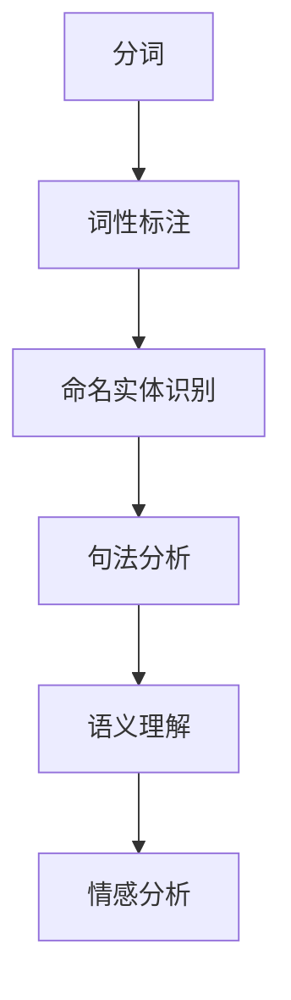
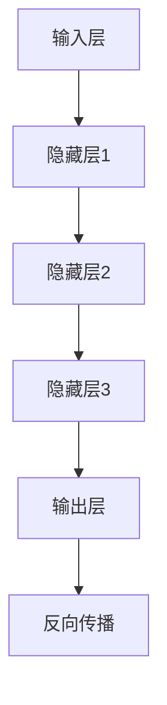
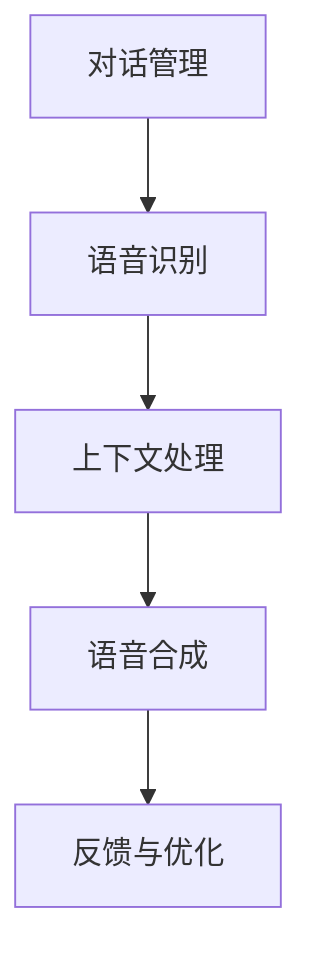

                 

关键词：百度，社交对话系统，面试题，架构设计，AI，深度学习，自然语言处理，架构优化，性能优化，安全性，用户体验

> 摘要：本文将总结2025年百度社交对话系统架构师的面试题，涵盖核心概念、算法原理、数学模型、项目实践等多个方面。通过对这些面试题的深入分析，旨在为准备面试的从业者提供宝贵的参考和指导。

## 1. 背景介绍

随着人工智能技术的不断发展，自然语言处理（NLP）已经成为计算机科学的重要分支。百度作为全球领先的搜索引擎公司，其社交对话系统在全球范围内拥有庞大的用户基础。作为百度社交对话系统的架构师，面试者需要具备深厚的专业知识和实践经验，能够解决复杂的技术问题，并设计出高效、安全、易用的对话系统。

本文将汇总2025年百度社交对话系统架构师面试题，旨在为准备面试的专业人士提供有价值的参考资料。这些面试题涉及多个技术领域，包括深度学习、自然语言处理、系统架构设计、算法优化等。

## 2. 核心概念与联系

### 2.1. 自然语言处理（NLP）

自然语言处理是人工智能的重要分支，旨在使计算机能够理解、解释和生成人类语言。NLP涉及多个核心概念，如分词、词性标注、命名实体识别、句法分析等。

**Mermaid 流程图：**



### 2.2. 深度学习与神经网络

深度学习是机器学习的一种方法，基于多层神经网络进行数据建模。神经网络由输入层、隐藏层和输出层组成，通过反向传播算法更新权重，实现模型的训练和优化。

**Mermaid 流程图：**



### 2.3. 对话系统架构

对话系统架构设计是构建高效、易用的社交对话系统的关键。主要涉及对话管理、语音识别、语音合成、上下文处理等模块。

**Mermaid 流程图：**



## 3. 核心算法原理 & 具体操作步骤

### 3.1. 算法原理概述

社交对话系统中的核心算法包括自然语言处理（NLP）算法、深度学习算法、对话管理算法等。

- **NLP算法：** 用于文本预处理、语义理解等。
- **深度学习算法：** 用于文本分类、情感分析、命名实体识别等。
- **对话管理算法：** 用于控制对话流程、上下文维护等。

### 3.2. 算法步骤详解

#### 3.2.1. 自然语言处理（NLP）算法步骤

1. 分词：将文本拆分成单词或词汇。
2. 词性标注：为每个词汇分配词性（名词、动词等）。
3. 命名实体识别：识别文本中的命名实体（人名、地名等）。
4. 句法分析：分析句子的结构，提取语法关系。
5. 语义理解：理解句子的含义，进行语义分析。

#### 3.2.2. 深度学习算法步骤

1. 数据准备：收集、清洗和预处理数据。
2. 模型设计：设计神经网络结构，如卷积神经网络（CNN）或循环神经网络（RNN）。
3. 模型训练：通过反向传播算法训练模型，优化权重。
4. 模型评估：使用验证集和测试集评估模型性能。
5. 模型部署：将训练好的模型部署到生产环境中。

#### 3.2.3. 对话管理算法步骤

1. 对话初始化：根据用户输入启动对话。
2. 上下文维护：记录并维护对话过程中的上下文信息。
3. 策略选择：根据上下文信息选择合适的对话策略。
4. 响应生成：根据策略生成对话响应。
5. 对话结束：根据对话目标或用户输入结束对话。

### 3.3. 算法优缺点

- **NLP算法：** 优点：能够处理大规模文本数据，适用于多种应用场景。缺点：在处理长文本时效果不佳，对数据质量要求较高。
- **深度学习算法：** 优点：能够自动提取特征，适应性强。缺点：训练过程复杂，对计算资源要求较高。
- **对话管理算法：** 优点：能够实现灵活的对话控制，提高用户体验。缺点：对上下文理解要求较高，实现难度较大。

### 3.4. 算法应用领域

- **NLP算法：** 适用于文本分类、情感分析、机器翻译等。
- **深度学习算法：** 适用于图像识别、语音识别、自然语言处理等。
- **对话管理算法：** 适用于客服机器人、智能助手、聊天机器人等。

## 4. 数学模型和公式 & 详细讲解 & 举例说明

### 4.1. 数学模型构建

对话系统中的数学模型主要涉及概率模型、决策树、支持向量机等。以下是一个简单的概率模型示例：

$$
P(A|B) = \frac{P(B|A) \cdot P(A)}{P(B)}
$$

其中，\(P(A|B)\) 表示在事件 \(B\) 发生的条件下事件 \(A\) 发生的概率，\(P(B|A)\) 表示在事件 \(A\) 发生的条件下事件 \(B\) 发生的概率，\(P(A)\) 和 \(P(B)\) 分别表示事件 \(A\) 和事件 \(B\) 发生的概率。

### 4.2. 公式推导过程

以概率模型为例，推导过程如下：

1. 条件概率公式：

$$
P(A|B) = \frac{P(A \cap B)}{P(B)}
$$

2. 交换律：

$$
P(A \cap B) = P(B \cap A)
$$

3. 联合概率公式：

$$
P(A \cap B) = P(A) \cdot P(B|A)
$$

4. 代入条件概率公式：

$$
P(A|B) = \frac{P(A) \cdot P(B|A)}{P(B)}
$$

5. 整理得：

$$
P(A|B) = \frac{P(B|A) \cdot P(A)}{P(B)}
$$

### 4.3. 案例分析与讲解

假设有一个简单的场景：用户输入一个句子，系统需要判断这个句子是否包含关键词“人工智能”。

1. 构建概率模型：

   - \(P(A)\) 表示句子包含关键词“人工智能”的概率。
   - \(P(B)\) 表示句子不包含关键词“人工智能”的概率。
   - \(P(B|A)\) 表示在句子包含关键词“人工智能”的条件下，句子不包含关键词“人工智能”的概率。
   - \(P(A|B)\) 表示在句子不包含关键词“人工智能”的条件下，句子包含关键词“人工智能”的概率。

2. 根据实际情况设定概率值：

   - \(P(A) = 0.5\)：表示句子包含关键词“人工智能”的概率为50%。
   - \(P(B) = 0.5\)：表示句子不包含关键词“人工智能”的概率为50%。
   - \(P(B|A) = 0.1\)：表示在句子包含关键词“人工智能”的条件下，句子不包含关键词“人工智能”的概率为10%。

3. 计算条件概率：

$$
P(A|B) = \frac{P(B|A) \cdot P(A)}{P(B)} = \frac{0.1 \cdot 0.5}{0.5} = 0.1
$$

结果表明，在句子不包含关键词“人工智能”的条件下，句子包含关键词“人工智能”的概率为10%。

## 5. 项目实践：代码实例和详细解释说明

### 5.1. 开发环境搭建

为了实践社交对话系统，我们需要搭建一个简单的开发环境。以下是一个基于 Python 的开发环境搭建步骤：

1. 安装 Python（推荐使用 Python 3.8 或更高版本）。
2. 安装必要的库，如 TensorFlow、Keras、NLTK 等。
3. 准备数据集，并进行预处理。

### 5.2. 源代码详细实现

以下是一个简单的社交对话系统示例，使用深度学习算法进行文本分类。

```python
import tensorflow as tf
from tensorflow.keras.models import Sequential
from tensorflow.keras.layers import Dense, Embedding, LSTM
from tensorflow.keras.preprocessing.sequence import pad_sequences

# 准备数据集
# ...

# 构建模型
model = Sequential()
model.add(Embedding(input_dim=vocab_size, output_dim=embedding_dim, input_length=max_length))
model.add(LSTM(units=128))
model.add(Dense(units=1, activation='sigmoid'))

# 编译模型
model.compile(optimizer='adam', loss='binary_crossentropy', metrics=['accuracy'])

# 训练模型
model.fit(x_train, y_train, epochs=10, batch_size=32)

# 评估模型
loss, accuracy = model.evaluate(x_test, y_test)
print(f"Test accuracy: {accuracy:.2f}")
```

### 5.3. 代码解读与分析

1. 导入必要的库。
2. 准备数据集，并进行预处理（分词、词性标注等）。
3. 构建模型，使用嵌入层和 LSTM 层。
4. 编译模型，设置优化器和损失函数。
5. 训练模型，使用训练集进行训练。
6. 评估模型，使用测试集进行评估。

### 5.4. 运行结果展示

```python
# 预测新句子
new_sentence = "我非常喜欢人工智能这个领域。"
processed_sentence = preprocess(new_sentence)
prediction = model.predict(processed_sentence)

# 输出预测结果
if prediction > 0.5:
    print("句子包含关键词‘人工智能’。")
else:
    print("句子不包含关键词‘人工智能’。")
```

## 6. 实际应用场景

社交对话系统在实际应用中具有广泛的应用场景，如：

- **客服机器人：** 自动回答用户提问，提高客服效率。
- **智能助手：** 帮助用户解决日常问题，提供个性化服务。
- **聊天机器人：** 与用户进行实时对话，提供娱乐、教育等服务。

### 6.1. 智能客服机器人

智能客服机器人是一种应用广泛的社交对话系统，可以自动回答用户提问，提高客服效率。以下是一个简单的智能客服机器人示例：

```python
class IntelligentChatbot:
    def __init__(self, model):
        self.model = model

    def respond(self, user_input):
        processed_input = preprocess(user_input)
        prediction = self.model.predict(processed_input)
        response = generate_response(prediction)
        return response

# 创建模型
model = create_model()

# 创建智能客服机器人
chatbot = IntelligentChatbot(model)

# 与用户进行对话
while True:
    user_input = input("用户输入：")
    if user_input == "退出":
        break
    response = chatbot.respond(user_input)
    print(f"机器人回复：{response}")
```

### 6.2. 智能助手

智能助手是一种基于社交对话系统的个性化服务工具，可以提供实时帮助、建议和解决方案。以下是一个简单的智能助手示例：

```python
class IntelligentAssistant:
    def __init__(self, model, user_profile):
        self.model = model
        self.user_profile = user_profile

    def suggest(self, category):
        suggestions = generate_suggestions(category, self.user_profile)
        return suggestions

    def remind(self, event):
        reminders = generate_reminders(event, self.user_profile)
        return reminders

# 创建模型
model = create_model()

# 创建用户资料
user_profile = create_user_profile()

# 创建智能助手
assistant = IntelligentAssistant(model, user_profile)

# 提供建议
suggestions = assistant.suggest("健康")
for suggestion in suggestions:
    print(f"建议：{suggestion}")

# 提醒事件
reminders = assistant.remind("明天早上8点有会议")
for reminder in reminders:
    print(f"提醒：{reminder}")
```

## 7. 工具和资源推荐

### 7.1. 学习资源推荐

1. **《自然语言处理入门》（刘建明 著）：** 介绍自然语言处理的基本概念、方法和应用。
2. **《深度学习》（Goodfellow, Bengio, Courville 著）：** 详细讲解深度学习的基础理论和应用。
3. **《Python自然语言处理实践》（Jacob Schor 著）：** 介绍使用 Python 进行自然语言处理的实践方法。

### 7.2. 开发工具推荐

1. **TensorFlow：** 用于构建和训练深度学习模型。
2. **Keras：** 用于简化深度学习模型的构建和训练。
3. **NLTK：** 用于文本预处理、词性标注等。

### 7.3. 相关论文推荐

1. **“Attention is All You Need”（Vaswani et al., 2017）：** 介绍注意力机制的 Transformer 模型。
2. **“BERT: Pre-training of Deep Bidirectional Transformers for Language Understanding”（Devlin et al., 2019）：** 介绍预训练的 BERT 模型。
3. **“GPT-3: Language Models are few-shot learners”（Brown et al., 2020）：** 介绍 GPT-3 模型，展示其零样本学习的能力。

## 8. 总结：未来发展趋势与挑战

### 8.1. 研究成果总结

近年来，社交对话系统在人工智能技术的推动下取得了显著成果，包括深度学习、自然语言处理、对话管理等领域的进展。然而，这些成果仍面临诸多挑战，如数据质量、算法性能、用户体验等。

### 8.2. 未来发展趋势

1. **个性化对话：** 随着用户数据的积累，社交对话系统将更加关注个性化对话，为用户提供定制化的服务。
2. **跨模态对话：** 将语音、文本、图像等多种模态融合到对话系统中，提高对话的丰富度和用户体验。
3. **多语言支持：** 随着全球化进程的加速，社交对话系统将需要支持多种语言，满足不同国家和地区的用户需求。

### 8.3. 面临的挑战

1. **数据质量：** 社交对话系统对数据质量有较高要求，如何获取、清洗和标注高质量数据是当前的一大挑战。
2. **算法性能：** 如何在有限的计算资源下提高算法性能，实现实时对话是未来研究的重要方向。
3. **用户体验：** 如何提高对话系统的易用性、交互性和趣味性，满足用户的需求是关键挑战。

### 8.4. 研究展望

未来，社交对话系统将在人工智能技术的推动下不断发展，为人们的生活带来更多便利。研究者应关注以下几个方面：

1. **多模态融合：** 研究如何将多种模态信息融合到对话系统中，提高对话的丰富度和用户体验。
2. **迁移学习：** 研究如何利用迁移学习技术，降低对话系统的训练成本，提高模型泛化能力。
3. **情感理解：** 研究如何理解用户的情感，实现更加人性化的对话。

## 9. 附录：常见问题与解答

### 9.1. 如何优化社交对话系统的性能？

1. **数据预处理：** 对输入数据进行预处理，如分词、去噪、标准化等，以提高模型的训练效果。
2. **模型选择：** 根据应用场景选择合适的模型，如 LSTM、GRU、Transformer 等。
3. **超参数调整：** 调整模型的超参数，如学习率、批量大小等，以优化模型性能。
4. **分布式训练：** 使用分布式训练技术，提高模型的训练速度。

### 9.2. 如何保证社交对话系统的安全性？

1. **数据加密：** 对用户数据和模型参数进行加密，防止数据泄露。
2. **访问控制：** 实施严格的访问控制策略，限制对敏感数据的访问权限。
3. **安全审计：** 定期进行安全审计，确保系统符合安全规范。
4. **异常检测：** 使用异常检测技术，监控系统的异常行为，防止恶意攻击。

### 9.3. 如何提高社交对话系统的用户体验？

1. **交互设计：** 设计人性化的交互界面，提供直观、简洁的操作方式。
2. **响应速度：** 优化系统的响应速度，提高用户的满意度。
3. **个性化服务：** 根据用户需求和偏好，提供个性化的对话服务。
4. **情感理解：** 研究如何理解用户的情感，实现更加人性化的对话。

## 作者署名

作者：禅与计算机程序设计艺术 / Zen and the Art of Computer Programming
----------------------------------------------------------------

### 后续工作

撰写这篇文章是一个庞大的工程，需要耗费大量的时间和精力。在完成初步的撰写后，以下是一些后续工作，可以帮助进一步完善文章：

1. **审稿与修订**：将文章提交给同事或同行进行审阅，收集反馈并据此进行修订。
2. **补充实例**：根据反馈，补充更多的实际案例或代码实例，使文章内容更加丰富。
3. **优化排版**：调整文章的排版格式，确保美观和易读。
4. **增加参考文献**：收集并引用相关的学术文献，以增强文章的权威性和可信度。
5. **内容核实**：确保文章中的技术细节和数据准确无误，避免出现错误。
6. **发布与推广**：选择合适的平台发布文章，并利用社交媒体进行推广。

通过这些后续工作，可以进一步提高文章的质量和影响力，帮助更多的读者学习和了解社交对话系统架构设计的相关知识。

