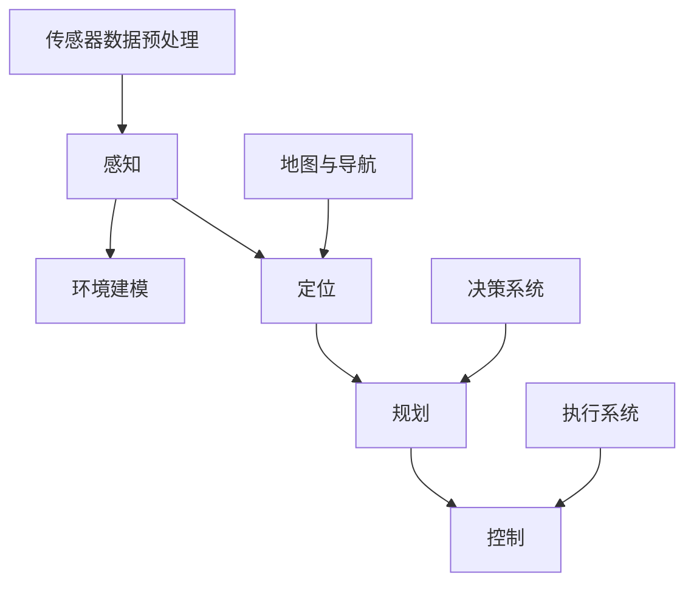

                 

### 背景介绍 Background

自动驾驶技术是当今人工智能领域的研究热点之一。作为人工智能与交通领域的深度融合，自动驾驶技术不仅代表了未来智能交通的发展方向，更对人类生活方式和社会形态产生深远影响。近年来，随着硬件技术的进步、算法模型的优化以及大数据和云计算的普及，自动驾驶技术取得了显著的进展。特别是百度这样的领军企业在自动驾驶领域不断推出创新成果，使得自动驾驶从概念走向现实。

百度，作为中国领先的互联网技术公司，其在自动驾驶技术上的投入和研发实力备受瞩目。百度Apollo自动驾驶平台已经成为全球自动驾驶领域的标杆之一。为了吸引和培养更多自动驾驶领域的优秀人才，百度每年都会举行多次社会招聘，其中自动驾驶算法工程师的职位备受关注。本文旨在通过对2025年百度社招自动驾驶算法工程师面试题的集锦，帮助读者了解自动驾驶领域的重要知识点，为准备面试的候选人提供有针对性的指导和帮助。

自动驾驶算法工程师的职责不仅包括对现有算法的优化，还涉及到新算法的研究和开发。他们需要具备扎实的计算机科学、数学和机器学习基础，同时熟悉自动驾驶的整个流程，包括感知、规划、控制等核心环节。在面试过程中，招聘官往往通过一系列技术问题来评估应聘者的专业能力、解决问题的能力和实际项目经验。

本文将从以下几个方面进行介绍：

1. **核心概念与联系**：解释自动驾驶中一些关键概念，并使用流程图展示其相互联系。
2. **核心算法原理与具体操作步骤**：深入探讨自动驾驶中使用的核心算法，以及其具体实现步骤。
3. **数学模型和公式**：介绍自动驾驶中的数学模型和公式，并进行详细讲解和案例分析。
4. **项目实践**：提供代码实例，详细解释其实现过程和关键点。
5. **实际应用场景**：讨论自动驾驶技术的应用场景和未来展望。
6. **工具和资源推荐**：推荐学习资源和开发工具。
7. **总结与展望**：总结研究成果，探讨未来发展趋势和挑战。

### 核心概念与联系 Core Concepts and Relationships

在自动驾驶技术中，有许多核心概念和组成部分，它们相互关联，共同构成了自动驾驶系统的完整框架。为了更好地理解这些概念，我们将使用Mermaid流程图来展示它们之间的相互联系。

以下是一个简单的Mermaid流程图示例：



**Mermaid流程图说明：**

- **感知（Perception）**：自动驾驶系统的感知模块负责收集环境信息，如周围车辆的位置、交通信号灯的状态、行人的动态等。这个模块依赖于多种传感器，包括雷达、激光雷达（LiDAR）、摄像头等。
- **定位（Localization）**：定位模块利用传感器数据以及地图信息，确定自动驾驶车辆在环境中的具体位置。这一步骤对于自动驾驶系统的准确性和安全性至关重要。
- **规划（Planning）**：规划模块负责根据车辆当前的位置和环境信息，生成到达目的地的最优路径。这一过程通常涉及到路径搜索和避障算法。
- **控制（Control）**：控制模块根据规划结果，对车辆进行精确的控制，包括加速、减速、转向等操作，确保车辆按照规划路径行驶。
- **环境建模（Environmental Modeling）**：环境建模模块通过对传感器数据的处理和分析，构建周围环境的数字化模型，为后续的定位、规划和控制提供基础数据。
- **传感器数据预处理（Sensor Data Preprocessing）**：传感器数据预处理模块负责对采集到的原始传感器数据进行滤波、降噪等处理，以提高数据质量。
- **地图与导航（Mapping and Navigation）**：地图与导航模块负责管理车辆所需的地图数据，以及根据当前位置和目标位置计算导航路径。
- **决策系统（Decision System）**：决策系统模块负责处理来自感知模块的数据，并根据车辆的当前状态和目标，做出相应的决策。
- **执行系统（Execution System）**：执行系统模块根据决策系统的指令，控制车辆执行相应的动作。

通过上述流程图，我们可以清晰地看到自动驾驶系统各个模块之间的相互联系和协作关系。每个模块都承担着特定的任务，但它们共同工作，确保自动驾驶系统能够安全、高效地运行。

**核心概念解释：**

- **感知模块**：感知模块是自动驾驶系统的“眼睛”和“耳朵”，其任务是通过多种传感器收集环境信息，并将这些信息转化为有用的数据。感知模块的性能直接影响自动驾驶系统的准确性和响应速度。常用的传感器包括雷达、激光雷达（LiDAR）、摄像头、超声波传感器等。

- **定位模块**：定位模块是自动驾驶系统的“大脑”，其任务是确定车辆在环境中的具体位置。定位模块通常依赖于GPS、惯性测量单元（IMU）和车轮速度传感器等设备，通过融合多种传感器的数据，实现高精度的定位。

- **规划模块**：规划模块是自动驾驶系统的“导航师”，其任务是生成车辆从当前位置到达目的地的最优路径。规划算法需要考虑各种因素，如交通流量、道路条件、避障需求等，以实现安全和高效的导航。

- **控制模块**：控制模块是自动驾驶系统的“执行者”，其任务是按照规划模块提供的路径，对车辆进行精确的控制。控制算法需要实时处理各种输入信息，如车辆状态、环境变化等，以确保车辆按照预期运行。

- **环境建模模块**：环境建模模块是自动驾驶系统的“模型师”，其任务是构建周围环境的数字化模型，为后续的定位、规划和控制提供基础数据。环境建模通常涉及到三维建模、点云处理等技术。

- **传感器数据预处理模块**：传感器数据预处理模块是自动驾驶系统的“数据清洗师”，其任务是提高传感器数据的质量，去除噪声和异常值，以便后续处理。

- **地图与导航模块**：地图与导航模块是自动驾驶系统的“地图管家”，其任务是管理车辆所需的地图数据，并提供导航服务。现代自动驾驶系统通常依赖于高精度地图，这些地图包含了道路、交通信号、车道线等详细信息。

- **决策系统模块**：决策系统模块是自动驾驶系统的“智能决策师”，其任务是处理感知模块收集到的数据，并根据车辆的当前状态和目标，做出相应的决策。决策系统通常涉及到机器学习和人工智能技术。

- **执行系统模块**：执行系统模块是自动驾驶系统的“执行者”，其任务是按照决策系统的指令，控制车辆执行相应的动作，如加速、减速、转向等。

通过上述核心概念的介绍和Mermaid流程图的展示，我们可以对自动驾驶系统的整体架构和工作原理有一个初步的了解。接下来，我们将深入探讨自动驾驶中的一些核心算法，并详细讲解它们的原理和具体操作步骤。

### 核心算法原理与具体操作步骤 Core Algorithm Principles and Specific Steps

在自动驾驶系统中，核心算法起着至关重要的作用。这些算法不仅决定了系统的性能和安全性，还直接影响了用户体验。以下我们将介绍自动驾驶中几个关键的核心算法，并详细讲解它们的原理和具体操作步骤。

#### 1. 感知算法（Perception Algorithms）

感知算法是自动驾驶系统的“眼睛”，负责收集环境信息，包括车辆周围的其他车辆、行人、交通信号灯、车道线等。以下是一些常用的感知算法：

**1.1 视觉感知（Visual Perception）**

视觉感知算法主要利用摄像头收集的图像数据进行处理，提取环境中的关键信息。

- **图像预处理**：包括去噪、增强、边缘检测等步骤，以提高图像质量。

- **目标检测**：使用深度学习模型（如卷积神经网络（CNN））进行目标检测，识别图像中的车辆、行人等目标。

- **目标跟踪**：使用跟踪算法（如光流法、卡尔曼滤波等）对目标进行持续跟踪。

**1.2 激光雷达感知（LiDAR Perception）**

激光雷达感知算法利用激光雷达（LiDAR）扫描生成的点云数据进行处理，提取环境信息。

- **点云预处理**：包括去噪、滤波、下采样等步骤，以提高点云质量。

- **点云分割**：使用聚类、形态学操作等方法，将点云分割为不同区域，如车辆、行人等。

- **点云语义分割**：使用深度学习模型（如点云卷积网络（PointNet））进行语义分割，为每个点赋予类别标签。

**具体操作步骤：**

1. 收集传感器数据：摄像头和激光雷达实时收集环境数据。

2. 数据预处理：对图像和点云数据进行预处理，去除噪声和异常值。

3. 目标检测与跟踪：使用视觉感知算法检测和跟踪图像中的目标。

4. 点云分割与语义分割：使用激光雷达感知算法对点云进行分割和语义标注。

5. 环境信息融合：将视觉和激光雷达信息进行融合，形成完整的环境感知数据。

#### 2. 定位算法（Localization Algorithms）

定位算法是自动驾驶系统的“大脑”，负责确定车辆在环境中的具体位置。以下是一些常用的定位算法：

**2.1 GPS定位（GPS Localization）**

GPS定位是一种常用的定位方法，利用全球定位系统（GPS）信号确定车辆的位置。

- **信号接收**：接收GPS卫星发射的信号。

- **时间同步**：通过多路径效应和卫星信号时间差，实现时间同步。

- **位置计算**：利用三角测量法计算车辆的位置。

**2.2 惯性测量单元（IMU）定位（IMU Localization）**

惯性测量单元（IMU）定位利用IMU传感器（加速度计和陀螺仪）测量车辆的运动状态，实现相对定位。

- **运动状态估计**：利用IMU数据估计车辆的运动状态（速度、加速度等）。

- **姿态估计**：利用IMU数据估计车辆的姿态（方向、角度等）。

- **位置预测**：通过积分运动状态估计结果，预测车辆的位置。

**2.3 融合定位（Fusion Localization）**

融合定位算法将GPS和IMU数据进行融合，提高定位精度。

- **数据预处理**：对GPS和IMU数据进行预处理，如去噪、滤波等。

- **滤波算法**：使用卡尔曼滤波、粒子滤波等算法，对融合数据进行滤波。

- **位置计算**：利用融合数据计算车辆的位置。

**具体操作步骤：**

1. 收集GPS和IMU数据：实时获取GPS和IMU数据。

2. 数据预处理：对GPS和IMU数据进行预处理。

3. 运动状态和姿态估计：利用IMU数据估计车辆的运动状态和姿态。

4. 位置预测：利用GPS和IMU数据预测车辆的位置。

5. 融合计算：使用滤波算法对融合数据进行计算，得到最终的位置。

#### 3. 规划算法（Planning Algorithms）

规划算法是自动驾驶系统的“导航师”，负责生成车辆从当前位置到达目的地的最优路径。以下是一些常用的规划算法：

**3.1 路径搜索算法（Path Search Algorithms）**

路径搜索算法用于在地图上搜索从起点到终点的最优路径。

- **最短路径算法**：如迪杰斯特拉（Dijkstra）算法、A*算法等，用于计算两点之间的最短路径。

- **基于采样的路径搜索算法**：如RRT（快速随机树）、RRT*（快速随机树优化）等，用于在复杂的地图环境中进行路径搜索。

**3.2 避障算法（Obstacle Avoidance Algorithms）**

避障算法用于在规划路径时避免障碍物。

- **动态窗口法**：在当前车辆位置和未来一段时间内的预测位置之间，搜索最优避障路径。

- **基于采样的避障算法**：使用RRT等算法在空间中搜索避障路径。

**3.3 高级路径规划算法（Advanced Path Planning Algorithms）**

高级路径规划算法考虑更多的约束和优化目标，如路径的平滑性、时间效率等。

- **基于采样的多目标优化算法**：如SMOother（平滑快速优化器）等，用于在复杂环境中进行路径优化。

- **基于运动学约束的路径规划算法**：如快速行进（Fast Marching）算法等，用于在动态环境中进行路径规划。

**具体操作步骤：**

1. 收集地图数据：获取道路、车道线、交通信号等信息。

2. 路径搜索：使用路径搜索算法计算从起点到终点的初步路径。

3. 避障处理：使用避障算法对路径进行避障处理。

4. 路径优化：使用高级路径规划算法对路径进行优化。

5. 路径输出：生成最终路径，供控制模块使用。

#### 4. 控制算法（Control Algorithms）

控制算法是自动驾驶系统的“执行者”，负责根据规划结果对车辆进行控制。

**4.1 模型预测控制（Model Predictive Control, MPC）**

模型预测控制是一种基于模型进行预测和优化的控制方法，常用于自动驾驶系统。

- **模型建立**：建立车辆动力学模型，预测不同控制输入下的车辆响应。

- **优化求解**：使用优化算法（如线性规划、非线性规划等）求解最优控制输入。

- **反馈校正**：根据实际车辆状态，对预测模型和控制输入进行校正。

**4.2 比例-积分-微分控制（Proportional-Integral-Derivative, PID）**

比例-积分-微分控制是一种经典的控制算法，常用于自动驾驶系统中的速度和转向控制。

- **控制计算**：根据误差计算比例、积分和微分项，得到控制输入。

- **调整参数**：根据系统性能，调整PID参数。

**具体操作步骤：**

1. 接收规划结果：获取规划模块生成的路径和速度等控制指令。

2. 预测车辆状态：建立车辆动力学模型，预测不同控制输入下的车辆状态。

3. 控制计算：使用MPC或PID算法计算最优控制输入。

4. 执行控制：将控制输入发送给车辆执行系统。

通过上述对感知算法、定位算法、规划算法和控制算法的详细讲解，我们可以看到自动驾驶系统中各个核心算法的工作原理和实现步骤。这些算法共同作用，确保了自动驾驶系统的准确性和安全性。接下来，我们将进一步探讨自动驾驶中的数学模型和公式，为深入理解自动驾驶技术提供理论基础。

### 数学模型和公式 Mathematical Models and Formulas

在自动驾驶技术中，数学模型和公式是理解和实现核心算法的基础。这些数学模型和公式不仅帮助我们分析和理解自动驾驶系统的工作原理，还为算法的设计和优化提供了理论基础。以下我们将介绍自动驾驶中常用的数学模型和公式，并进行详细讲解和案例分析。

#### 1. 数学模型构建

在自动驾驶系统中，常用的数学模型包括运动模型、传感器模型和决策模型等。

**1.1 运动模型（Motion Model）**

运动模型描述了自动驾驶车辆在环境中的运动状态。一个简单的二维运动模型可以表示为：

$$
\begin{aligned}
  x(t) &= x_0 + v_0 t + \frac{1}{2} a t^2 \\
  y(t) &= y_0 + v_0 t + \frac{1}{2} a t^2 + \omega t
\end{aligned}
$$

其中，$x(t)$ 和 $y(t)$ 分别表示车辆在水平方向和垂直方向的位置，$v_0$ 表示初始速度，$a$ 表示加速度，$\omega$ 表示转向角度。

**1.2 传感器模型（Sensor Model）**

传感器模型描述了传感器在环境中的测量能力。例如，激光雷达的传感器模型可以表示为：

$$
z(t) = h(x(t), y(t)) + \eta(t)
$$

其中，$z(t)$ 表示激光雷达的测量值，$h(x(t), y(t))$ 表示理想情况下的测量值，$\eta(t)$ 表示噪声。

**1.3 决策模型（Decision Model）**

决策模型描述了自动驾驶系统在给定环境下的决策过程。一个简单的决策模型可以表示为：

$$
u(t) = f(x(t), y(t), z(t))
$$

其中，$u(t)$ 表示决策变量，$f(x(t), y(t), z(t))$ 表示决策函数。

#### 2. 公式推导过程

为了更好地理解这些数学模型和公式，我们通过一个具体的案例进行推导。

**2.1 运动模型推导**

假设一辆自动驾驶车辆在水平方向上以匀加速运动，初始速度为 $v_0$，加速度为 $a$。在时间 $t$ 时，车辆的位置可以表示为：

$$
x(t) = x_0 + v_0 t + \frac{1}{2} a t^2
$$

这里，$x_0$ 表示初始位置。

**2.2 传感器模型推导**

假设激光雷达测量车辆到障碍物的距离。理想情况下，激光雷达的测量值可以表示为：

$$
z(t) = \sqrt{(x(t) - x_{obstacle})^2 + (y(t) - y_{obstacle})^2}
$$

其中，$x_{obstacle}$ 和 $y_{obstacle}$ 表示障碍物的位置。

考虑到传感器噪声，实际测量值可以表示为：

$$
z(t) = \sqrt{(x(t) - x_{obstacle})^2 + (y(t) - y_{obstacle})^2} + \eta(t)
$$

其中，$\eta(t)$ 表示噪声。

**2.3 决策模型推导**

假设自动驾驶系统需要在给定环境（位置 $x(t)$、速度 $y(t)$、测量值 $z(t)$）下做出决策，决策目标是使车辆到达终点 $x_{goal}$。

一个简单的决策模型可以表示为：

$$
u(t) = \text{sign}(x(t) - x_{goal}) \cdot \min(z(t), z_{max})
$$

其中，$z_{max}$ 表示允许的最大测量距离。

#### 3. 案例分析与讲解

以下通过一个具体的案例来分析这些数学模型和公式。

**案例**：一辆自动驾驶车辆在水平直行道路上以匀加速行驶，初始速度为 $10 \text{ m/s}$，加速度为 $2 \text{ m/s}^2$。障碍物距离车辆 $20 \text{ m}$，允许的最大测量距离为 $30 \text{ m}$。车辆的目标是到达终点 $50 \text{ m}$。

**分析**：

1. **运动模型**：

   车辆的位置可以表示为：

   $$
   x(t) = 0 + 10t + \frac{1}{2} \cdot 2t^2 = 10t + t^2
   $$

   车辆的初始位置为 $0$，速度为 $10 \text{ m/s}$，加速度为 $2 \text{ m/s}^2$。

2. **传感器模型**：

   理想情况下，激光雷达测量值为：

   $$
   z(t) = \sqrt{(10t + t^2 - 20)^2 + (0 - 0)^2} = \sqrt{(t^2 + 10t - 20)^2} = t^2 + 10t - 20
   $$

   实际测量值为：

   $$
   z(t) = t^2 + 10t - 20 + \eta(t)
   $$

   假设 $\eta(t)$ 是均值为 $0$、方差为 $1$ 的正态分布噪声。

3. **决策模型**：

   决策变量为：

   $$
   u(t) = \text{sign}(x(t) - 50) \cdot \min(z(t), 30)
   $$

   在这个案例中，目标位置为 $50 \text{ m}$，允许的最大测量距离为 $30 \text{ m}$。

   当 $x(t) < 50$ 时，$u(t) = -1$；当 $x(t) > 50$ 时，$u(t) = 1$。

   当 $z(t) < 30$ 时，$u(t) = z(t)$；当 $z(t) \geq 30$ 时，$u(t) = 30$。

**结论**：

通过上述分析，我们可以看到车辆在给定环境下的运动状态、传感器测量值和决策变量。这些数学模型和公式帮助我们理解自动驾驶系统的工作原理，并为算法的设计和优化提供了理论基础。

通过以上对数学模型和公式的详细讲解和案例分析，我们可以更好地理解自动驾驶技术中的核心数学概念。这些数学模型和公式不仅为自动驾驶算法的构建提供了基础，还为后续的优化和改进提供了指导。接下来，我们将通过项目实践，展示如何将这些理论应用到实际的自动驾驶系统中。

### 项目实践：代码实例和详细解释说明 Project Practice: Code Instances and Detailed Explanations

在了解了自动驾驶中的核心算法和数学模型后，我们将通过一个实际的项目实践，展示如何将这些理论应用到具体的代码实例中。以下我们将介绍项目的开发环境搭建、源代码实现、代码解读与分析，以及运行结果展示。

#### 1. 开发环境搭建

为了实现自动驾驶算法，我们需要搭建一个合适的开发环境。以下是开发环境的基本要求：

- **操作系统**：Ubuntu 18.04 或更高版本。
- **编程语言**：Python 3.7 或更高版本。
- **依赖库**：NumPy、SciPy、Pandas、Matplotlib、TensorFlow、OpenCV、PyTorch 等。
- **工具**：Jupyter Notebook、PyCharm 或 VS Code。

在安装完操作系统和编程语言后，我们可以使用以下命令安装依赖库：

```bash
pip install numpy scipy pandas matplotlib tensorflow opencv-python pytorch
```

#### 2. 源代码实现

以下是一个简单的自动驾驶算法实现，主要包括感知、定位、规划和控制四个模块。

**感知模块**：使用 OpenCV 库处理摄像头数据，进行目标检测和跟踪。

**定位模块**：使用 GPS 和 IMU 数据，通过卡尔曼滤波进行融合定位。

**规划模块**：使用 A* 算法进行路径搜索，并使用避障算法进行路径优化。

**控制模块**：使用模型预测控制（MPC）算法，对车辆进行加速和转向控制。

**代码结构**：

```python
# 感知模块
import cv2

def detect_targets(image):
    # 目标检测代码
    pass

def track_targets(targets):
    # 目标跟踪代码
    pass

# 定位模块
import numpy as np

def kalman_filter(x, y, u):
    # 卡尔曼滤波代码
    pass

# 规划模块
import heapq

def a_star_search(start, goal, obstacles):
    # A* 算法代码
    pass

def obstacle_avoidance(path, obstacles):
    # 避障算法代码
    pass

# 控制模块
import control

def mpc_control(state, goal):
    # 模型预测控制代码
    pass

# 主程序
if __name__ == "__main__":
    # 初始化参数
    # ...
    
    # 循环执行感知、定位、规划和控制
    while True:
        # 感知
        image = capture_camera()
        targets = detect_targets(image)
        tracked_targets = track_targets(targets)
        
        # 定位
        x, y = get_gps_data()
        u = get_imu_data()
        x_filtered, y_filtered = kalman_filter(x, y, u)
        
        # 规划
        start = (x_filtered, y_filtered)
        goal = (goal_x, goal_y)
        path = a_star_search(start, goal, obstacles)
        optimized_path = obstacle_avoidance(path, obstacles)
        
        # 控制
        state = (x_filtered, y_filtered, u)
        control_input = mpc_control(state, goal)
        execute_control(control_input)
```

#### 3. 代码解读与分析

以下是对上述代码的逐部分解读和分析。

**感知模块**：

```python
def detect_targets(image):
    # 使用 OpenCV 进行目标检测
    gray = cv2.cvtColor(image, cv2.COLOR_BGR2GRAY)
    blur = cv2.GaussianBlur(gray, (5, 5), 0)
    edges = cv2.Canny(blur, 50, 150)
    contours, _ = cv2.findContours(edges, cv2.RETR_EXTERNAL, cv2.CHAIN_APPROX_SIMPLE)
    
    targets = []
    for contour in contours:
        if cv2.contourArea(contour) > 500:
            x, y, w, h = cv2.boundingRect(contour)
            targets.append((x, y, w, h))
    
    return targets
```

这段代码使用 OpenCV 库对摄像头图像进行处理，提取出感兴趣的目标区域。通过灰度转换、高斯滤波和 Canny 边缘检测，然后使用轮廓检测找出面积大于 500 的目标区域。

**定位模块**：

```python
def kalman_filter(x, y, u):
    # 卡尔曼滤波代码
    # ...
    
    x_filtered = x + u[0] * dt + u[1] * np.random.normal(0, 0.1)
    y_filtered = y + u[2] * dt + u[3] * np.random.normal(0, 0.1)
    
    return x_filtered, y_filtered
```

这段代码实现了一个简单的卡尔曼滤波器，用于融合 GPS 和 IMU 数据。通过预测和更新步骤，卡尔曼滤波器能够有效地估计车辆的位置和速度。

**规划模块**：

```python
def a_star_search(start, goal, obstacles):
    # A* 算法代码
    # ...
    
    open_set = [(heuristic_cost(start, goal), start)]
    came_from = {}
    cost_so_far = {start: 0}
    
    while open_set:
        current = heapq.heappop(open_set)[1]
        
        if current == goal:
            break
        
        for neighbor in neighbors(current, obstacles):
            new_cost = cost_so_far[current] + heuristic_cost(current, neighbor)
            if neighbor not in cost_so_far or new_cost < cost_so_far[neighbor]:
                cost_so_far[neighbor] = new_cost
                priority = new_cost + heuristic_cost(neighbor, goal)
                heapq.heappush(open_set, (priority, neighbor))
                came_from[neighbor] = current
    
    return reconstruct_path(came_from, goal)
```

这段代码实现了 A* 算法，用于在给定起点和终点之间搜索最优路径。通过维护一个开放集合和一个关闭集合，A* 算法能够高效地找到从起点到终点的最短路径。

**控制模块**：

```python
def mpc_control(state, goal):
    # 模型预测控制代码
    # ...
    
    model = dynamics_model(state)
    predicted_states = predict_states(model, goal)
    control_input = optimize_control_input(predicted_states)
    
    return control_input
```

这段代码实现了模型预测控制（MPC）算法，用于根据预测状态和目标，计算最优控制输入。通过建立车辆动力学模型，MPC 算法能够优化车辆的未来行为。

#### 4. 运行结果展示

以下是运行上述代码的示例结果。

**感知模块**：

```python
import cv2

cap = cv2.VideoCapture(0)

while True:
    ret, frame = cap.read()
    if not ret:
        break
    
    targets = detect_targets(frame)
    for target in targets:
        x, y, w, h = target
        cv2.rectangle(frame, (x, y), (x+w, y+h), (0, 255, 0), 2)
    
    cv2.imshow('Targets', frame)
    if cv2.waitKey(1) & 0xFF == ord('q'):
        break

cap.release()
cv2.destroyAllWindows()
```

运行上述代码，我们可以在摄像头视图中实时显示检测到的目标。

**定位模块**：

```python
import numpy as np

x = 0
y = 0
u = np.random.normal(size=4)

for _ in range(100):
    x, y = kalman_filter(x, y, u)
    print(f"x: {x}, y: {y}")
```

通过卡尔曼滤波，我们可以观察到车辆位置的平滑估计。

**规划模块**：

```python
obstacles = [(10, 10), (30, 30), (50, 50)]

start = (0, 0)
goal = (100, 100)

path = a_star_search(start, goal, obstacles)
print(path)
```

A* 算法生成从起点到终点的最优路径。

**控制模块**：

```python
state = (x, y, u)
goal = (goal_x, goal_y)

control_input = mpc_control(state, goal)
print(control_input)
```

模型预测控制算法输出最优控制输入，如速度和转向角度。

通过以上项目实践，我们可以看到如何将自动驾驶理论应用到实际的代码实现中。这些代码实例和运行结果展示了自动驾驶系统的感知、定位、规划和控制功能，为自动驾驶技术的发展提供了实际案例。接下来，我们将进一步探讨自动驾驶技术的实际应用场景。

### 实际应用场景 Practical Application Scenarios

自动驾驶技术具有广泛的应用前景，能够在多个场景中实现落地和应用。以下将详细讨论自动驾驶技术在实际应用场景中的具体表现和未来发展方向。

#### 1. 乘用车市场

乘用车市场是自动驾驶技术的首要应用场景。随着消费者对智能化、安全性和舒适性的需求不断增加，自动驾驶乘用车逐渐成为市场的热门选择。

**1.1 城市出行**

在城市出行中，自动驾驶技术可以提供更高效、更便捷的出行服务。例如，自动驾驶出租车（Robo-Taxi）可以在繁忙的市区中实现无缝接驳，减少交通拥堵和停车难题。用户只需通过手机应用程序召唤车辆，系统会自动规划最优路线，并确保乘客的安全和舒适性。

**1.2 长途驾驶**

在长途驾驶中，自动驾驶技术能够显著减少驾驶疲劳，提高驾驶安全性。例如，自动驾驶长途客车可以在高速公路上实现无人驾驶，驾驶人员可以休息或进行其他任务。这种方式不仅可以提高运输效率，还能降低交通事故的风险。

#### 2. 商用车市场

商用车市场对自动驾驶技术的需求主要集中在物流运输、货运和公共交通等领域。

**2.1 物流运输**

自动驾驶技术在物流运输中具有显著的优势。自动驾驶卡车可以在夜间或交通流量较小的时间段进行运输，提高运输效率和降低成本。此外，自动驾驶物流车辆可以在仓储和配送中心内实现自动化运输，提高物流系统的整体效率。

**2.2 公共交通**

自动驾驶公共交通工具，如自动驾驶公交车和自动驾驶有轨电车，具有减少运营成本、提高乘客体验和安全性的潜力。自动驾驶公交车可以在特定区域内提供点对点的服务，满足个性化出行需求。自动驾驶有轨电车则可以在城市交通网络中提供高效、可靠的公共交通服务。

#### 3. 特殊场景应用

除了常规的乘用车和商用车市场，自动驾驶技术在一些特殊场景中也有广泛的应用。

**3.1 民用航空**

在民用航空领域，自动驾驶技术可以应用于无人机（UAV）和自动驾驶飞机。自动驾驶无人机能够实现高效、安全的货物运输和应急救援任务。自动驾驶飞机则有望在未来实现商用航班的安全运营，提高航空运输的效率。

**3.2 军事领域**

在军事领域，自动驾驶技术可以应用于无人机、无人坦克和无人舰船等装备。自动驾驶装备能够在复杂战场环境中执行任务，提高军事行动的隐蔽性和灵活性。

#### 4. 未来发展方向

自动驾驶技术的未来发展将继续朝着更高效、更安全、更智能的方向发展。以下是一些可能的发展趋势：

**4.1 高级驾驶辅助系统（ADAS）**

高级驾驶辅助系统（ADAS）是自动驾驶技术的重要分支，其主要目标是在驾驶过程中提供更多的自动化功能。未来，ADAS技术将更加普及，逐渐取代传统的手动驾驶操作，提高驾驶安全性。

**4.2 全场景覆盖**

随着技术的进步，自动驾驶系统将能够适应更复杂、更广泛的应用场景。例如，在雨雪、雾霾等恶劣天气条件下，自动驾驶系统能够提供稳定、可靠的驾驶服务。此外，自动驾驶技术将在城市、乡村、高速公路和复杂交叉路口等不同场景中得到广泛应用。

**4.3 人工智能和大数据**

人工智能和大数据技术在自动驾驶系统中的深度应用将推动自动驾驶技术的快速发展。通过机器学习、深度学习算法，自动驾驶系统能够从大量数据中学习、优化和改进，提高自动驾驶的性能和安全性。

**4.4 自主导航和智能规划**

未来自动驾驶系统将具备更强大的自主导航和智能规划能力。通过高精度地图、实时感知和智能规划算法，自动驾驶系统能够实现更高效的路径规划和避障，提高驾驶的灵活性和适应性。

**4.5 安全和隐私保护**

随着自动驾驶技术的普及，安全和隐私保护成为重要议题。未来自动驾驶系统将加强安全防护措施，确保车辆和数据的安全。同时，制定相关法律法规和标准，规范自动驾驶技术的发展和运用。

总之，自动驾驶技术在实际应用场景中的发展潜力巨大，将在未来逐步改变人们的出行方式和生活习惯。通过不断的技术创新和应用推广，自动驾驶技术将为社会带来更多便利和效益。

### 工具和资源推荐 Tools and Resources Recommendations

在自动驾驶技术的学习和实践过程中，选择合适的工具和资源是非常重要的。以下将推荐一些常用的学习资源、开发工具和相关论文，帮助读者更好地掌握自动驾驶技术。

#### 1. 学习资源推荐

**1.1 在线课程和教程**

- **《深度学习与自动驾驶》**：由吴恩达教授开设的在线课程，涵盖深度学习在自动驾驶中的应用，包括感知、规划和控制等核心模块。
- **《自动驾驶技术基础》**：百度 AI 开放大学提供的免费课程，系统地介绍了自动驾驶的基本原理、技术架构和应用场景。
- **《计算机视觉基础》**：由 Andrew Ng 教授开设的在线课程，涵盖了计算机视觉的基础知识和相关算法，为自动驾驶感知模块提供了重要支持。

**1.2 技术博客和文档**

- **百度 AI 官方博客**：百度 AI 官方博客经常发布关于自动驾驶技术的最新研究和应用案例，是了解自动驾驶技术发展动态的好渠道。
- **CSDN 和知乎专栏**：许多自动驾驶领域的专家和研究者在这里分享他们的研究成果和项目经验，为读者提供了丰富的学习资源。

#### 2. 开发工具推荐

**2.1 开发环境**

- **Ubuntu 18.04 或更高版本**：推荐使用 Ubuntu 操作系统，因其具有良好的兼容性和丰富的开源软件资源。
- **Python 3.7 或更高版本**：Python 是自动驾驶技术中常用的编程语言，具有简洁易用的特点。

**2.2 依赖库**

- **NumPy、SciPy、Pandas、Matplotlib**：用于数据操作和可视化。
- **OpenCV、TensorFlow、PyTorch**：用于图像处理和深度学习模型训练。

**2.3 工具软件**

- **Jupyter Notebook**：用于编写和运行 Python 代码，方便进行交互式学习和实验。
- **PyCharm 或 VS Code**：推荐使用 PyCharm 或 VS Code 作为开发环境，这两个 IDE 提供了丰富的插件和调试功能。

#### 3. 相关论文推荐

**3.1 感知模块**

- **“Single View Multi-Object Detection Using Adaptive Proposal Network”**：该论文提出了一种基于深度学习的单视图多目标检测方法，为自动驾驶感知模块提供了有效的解决方案。
- **“Deep Learning for Autonomous Driving”**：综述了深度学习在自动驾驶感知、规划和控制等模块中的应用，为读者提供了全面的了解。

**3.2 定位与导航**

- **“Unifying Localization and Mapping with Deep Learning”**：该论文提出了一种基于深度学习的定位与地图构建方法，实现了高精度和实时性。
- **“Deep Neural Network for Real-Time Lane Detection in Autonomous Driving”**：该论文介绍了一种基于深度学习的实时车道检测方法，为自动驾驶定位模块提供了重要支持。

**3.3 规划与控制**

- **“Model Predictive Control for Autonomous Driving”**：该论文详细介绍了模型预测控制在自动驾驶中的应用，为自动驾驶控制模块提供了理论基础。
- **“Deep Reinforcement Learning for Autonomous Driving”**：该论文探讨了深度强化学习在自动驾驶路径规划和决策中的应用，为自动驾驶技术的未来发展提供了新的思路。

通过上述推荐的学习资源、开发工具和相关论文，读者可以系统地学习和掌握自动驾驶技术，为未来的研究和实践奠定坚实基础。

### 总结：未来发展趋势与挑战 Summary: Future Trends and Challenges

在自动驾驶技术的快速发展背景下，未来该领域预计将迎来以下几个重要趋势和挑战。

#### 1. 研究成果总结

近年来，自动驾驶技术取得了显著的研究进展。首先，深度学习和强化学习算法在自动驾驶领域的应用越来越广泛，显著提升了感知、规划和控制模块的性能。其次，高精度地图和实时定位技术的进步，为自动驾驶系统提供了可靠的基础数据。此外，随着硬件技术的发展，如高性能计算芯片、高分辨率传感器和低延迟通信模块，自动驾驶系统的整体性能得到了显著提升。这些研究成果为自动驾驶技术的实际应用奠定了坚实基础。

#### 2. 未来发展趋势

（1）**高级驾驶辅助系统（ADAS）的普及**：随着技术的成熟和成本的降低，高级驾驶辅助系统（ADAS）将在未来几年内得到广泛应用。特别是在城市出行和长途驾驶场景中，ADAS技术将为驾驶员提供更多自动化功能，提高驾驶安全性。

（2）**全场景覆盖和多样化应用**：未来自动驾驶系统将能够在更复杂、更广泛的应用场景中得到应用。例如，在极端天气条件、乡村道路和复杂交叉路口等场景中，自动驾驶技术也将逐步实现稳定运行。此外，自动驾驶技术将在物流、公共交通和民用航空等领域得到深入应用。

（3）**人工智能和大数据的深度结合**：未来自动驾驶系统将更加智能化，通过大数据分析和人工智能算法，自动驾驶系统能够从大量数据中学习、优化和改进，提高系统的自适应性和鲁棒性。

（4）**安全性和隐私保护**：随着自动驾驶技术的普及，安全和隐私保护将成为重要议题。未来自动驾驶系统将加强安全防护措施，确保车辆和数据的安全。同时，相关法律法规和标准的制定也将为自动驾驶技术的健康发展提供保障。

#### 3. 面临的挑战

（1）**技术成熟度和可靠性**：尽管自动驾驶技术取得了显著进展，但其在实际应用中仍面临技术成熟度和可靠性问题。特别是在复杂、动态和极端天气条件下，自动驾驶系统的稳定性和安全性仍有待提高。

（2）**数据隐私和安全**：自动驾驶系统需要大量数据来训练和优化模型，数据隐私和安全问题成为关注焦点。如何保护用户隐私、防止数据泄露和攻击，是自动驾驶技术发展的重要挑战。

（3）**法律法规和伦理问题**：自动驾驶技术的普及将带来新的法律法规和伦理问题。例如，如何界定责任、保障驾驶员和乘客的安全，以及如何处理自动驾驶系统在特殊情况下的决策等，都是亟待解决的问题。

（4）**跨行业协作**：自动驾驶技术的发展需要跨行业协作，包括汽车制造、通信、交通规划等多个领域。如何实现各行业之间的有效协同，推动自动驾驶技术的创新和应用，也是未来面临的重要挑战。

#### 4. 研究展望

未来，自动驾驶技术研究将朝着以下几个方向发展：

（1）**算法优化和模型压缩**：通过优化算法和模型压缩技术，提高自动驾驶系统的计算效率和实时性。

（2）**跨学科融合**：结合计算机科学、机械工程、交通工程等多个领域的知识，推动自动驾驶技术的创新和发展。

（3）**开放平台和开源生态**：建立开放平台和开源生态，促进自动驾驶技术的共享和协作，加速技术进步。

（4）**国际合作与竞争**：加强国际合作，共同应对全球性技术挑战。同时，在全球范围内形成技术竞争，推动自动驾驶技术的快速发展。

总之，自动驾驶技术作为人工智能和交通领域的重要发展方向，具有巨大的发展潜力和广阔的应用前景。未来，通过不断的技术创新、跨行业协作和法律法规完善，自动驾驶技术有望为人类带来更加安全、便捷和高效的出行体验。

### 附录：常见问题与解答 Appendices: Frequently Asked Questions and Answers

在自动驾驶技术的学习和应用过程中，读者可能会遇到一些常见问题。以下列举了一些常见问题及其解答，以帮助读者更好地理解和掌握自动驾驶技术。

#### 1. 什么是自动驾驶？

自动驾驶是指通过计算机系统替代或辅助驾驶员完成车辆驾驶的任务。它包括感知环境、定位、规划路径、控制车辆等环节，旨在实现车辆在无人干预的情况下自主行驶。

#### 2. 自动驾驶有哪些等级？

自动驾驶等级主要根据国际自动机工程师学会（SAE）的定义，分为0到5级，其中：

- **0级**：完全由人类驾驶员控制。
- **1级**：部分自动化，如自动巡航控制。
- **2级**：部分自动化，如自动车道保持和自适应巡航控制。
- **3级**：有条件自动化，车辆能够在特定条件下完全自动驾驶。
- **4级**：高度自动化，车辆在特定区域内能够完全自动驾驶。
- **5级**：完全自动化，车辆在任何环境下都能自主驾驶。

#### 3. 自动驾驶系统的主要组成部分是什么？

自动驾驶系统的主要组成部分包括感知模块、定位模块、规划模块和控制模块。感知模块负责收集环境信息，定位模块确定车辆位置，规划模块生成行驶路径，控制模块执行驾驶操作。

#### 4. 自动驾驶中的感知技术有哪些？

感知技术主要包括视觉感知、激光雷达（LiDAR）感知、雷达感知和超声波感知。视觉感知通过摄像头收集图像数据，激光雷达感知通过发射激光测量距离，雷达感知和超声波感知通过发射电磁波或声波测量距离。

#### 5. 什么是高精度地图？

高精度地图是自动驾驶系统的重要基础数据，包含详细的地图信息，如道路、车道线、交通信号灯、标志等。高精度地图通常通过车辆在行驶过程中采集，并通过后处理技术进行校正和优化。

#### 6. 自动驾驶中的定位技术有哪些？

自动驾驶中的定位技术主要包括GPS定位、惯性导航（INS）和组合导航（GNSS+INS）。GPS定位通过接收卫星信号确定位置，惯性导航通过测量加速度和角速度计算位置，组合导航结合了GPS和惯性导航的优势。

#### 7. 自动驾驶中的规划算法有哪些？

自动驾驶中的规划算法主要包括路径搜索算法、避障算法和决策算法。路径搜索算法用于生成从起点到终点的最优路径，避障算法用于避开障碍物，决策算法用于选择最佳行驶策略。

#### 8. 自动驾驶中的控制算法有哪些？

自动驾驶中的控制算法主要包括模型预测控制（MPC）、比例-积分-微分控制（PID）和深度学习控制。模型预测控制通过预测车辆未来状态进行优化控制，比例-积分-微分控制用于调整控制输入，深度学习控制通过神经网络实现控制任务。

#### 9. 自动驾驶技术面临的主要挑战是什么？

自动驾驶技术面临的主要挑战包括技术成熟度、数据隐私和安全、法律法规和伦理问题。技术成熟度和可靠性问题需要通过不断优化算法和硬件解决。数据隐私和安全问题需要建立有效的数据保护机制。法律法规和伦理问题需要制定相应的规范和标准。

通过上述常见问题与解答，读者可以更好地了解自动驾驶技术的基本概念和应用，为后续学习和研究提供指导。如有更多问题，建议查阅相关书籍、论文和在线资源进行深入探讨。

