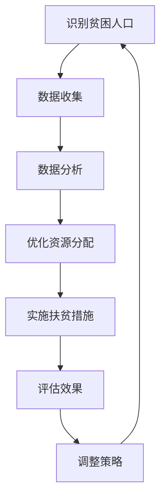
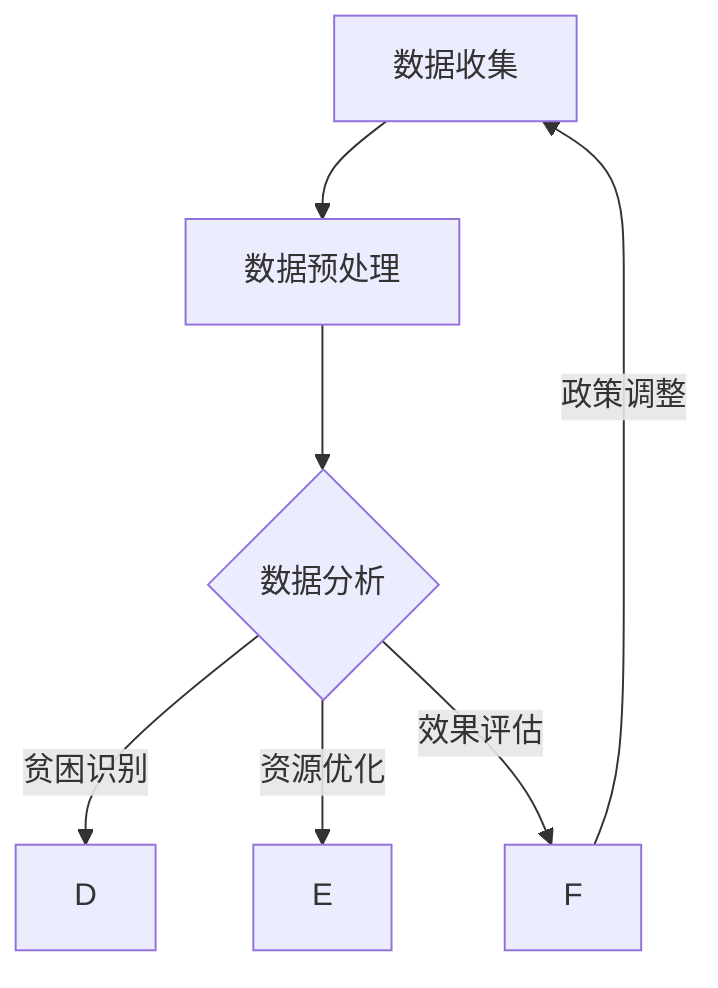

                 

### 关键词 Keywords
- 2050年
- 全球减贫
- 精准扶贫
- 可持续减贫
- 全球合作
- 数字化技术
- AI应用
- 数据分析

<|assistant|>### 摘要 Abstract
本文探讨了2050年全球减贫的远景，分析了从当前精准扶贫到未来可持续减贫的转变路径。重点介绍了数字化技术、人工智能和数据分析在减贫领域的作用，以及全球合作在推动减贫事业中的重要性。通过具体案例，文章展示了未来减贫工作的技术方向和潜在挑战，为全球减贫事业提供了一些切实可行的策略和展望。

## 1. 背景介绍

自20世纪以来，全球减贫事业取得了显著的成就。然而，根据联合国的数据，截至2021年，全球仍有超过7.89亿人生活在极端贫困中。这些贫困人口主要分布在撒哈拉以南非洲、南亚和拉丁美洲等地区。随着全球人口的增长和经济发展的不平衡，减贫任务依然艰巨。

### 精准扶贫

精准扶贫是近年来国际社会普遍采用的减贫策略，通过精准识别贫困人口和设计有针对性的扶贫措施，提高扶贫工作的效率和效果。中国在精准扶贫方面取得了显著成效，其经验也被许多国家借鉴。

### 可持续减贫

可持续减贫强调在减贫过程中保护环境、促进经济发展和提升社会福祉的平衡。这一策略不仅关注贫困人口的短期脱贫，更关注长期的发展。

## 2. 核心概念与联系

### 数字化技术

数字化技术是指通过计算机技术和互联网技术，将各种信息转化为数字形式，实现信息的存储、传输和处理。数字化技术在减贫领域有广泛的应用，包括数据收集、数据分析、远程教育、电子商务等。

### 人工智能

人工智能（AI）是指通过计算机模拟人类智能的行为，实现智能决策和自主学习。在减贫领域，AI技术可以用于预测贫困人口、优化扶贫资源分配、分析贫困原因等。

### 数据分析

数据分析是指通过统计、建模等方法，从海量数据中提取有价值的信息。在减贫领域，数据分析可以用于识别贫困人口、评估扶贫措施的效果、预测贫困趋势等。

### Mermaid 流程图

下面是一个简化的 Mermaid 流程图，展示了数字化技术、人工智能和数据分析在减贫领域的应用流程：



## 3. 核心算法原理 & 具体操作步骤

### 3.1 算法原理概述

在减贫领域，常用的算法包括机器学习算法、数据分析算法和优化算法。以下是一个简化的机器学习算法原理概述：

1. **数据收集**：收集与贫困相关的数据，如收入水平、教育程度、健康状况等。
2. **数据预处理**：清洗数据，去除噪声和异常值，进行特征工程，提取有用信息。
3. **模型训练**：使用机器学习算法，如决策树、支持向量机等，训练模型。
4. **模型评估**：使用测试数据集评估模型性能，调整参数以提高准确性。
5. **应用模型**：将训练好的模型应用于实际数据，预测贫困人口和优化扶贫资源分配。

### 3.2 算法步骤详解

1. **数据收集**：使用在线问卷、手机应用、卫星遥感等手段收集贫困人口数据。
2. **数据预处理**：去除重复数据，填补缺失值，标准化数据，进行特征选择。
3. **模型训练**：选择适合的机器学习算法，如随机森林、神经网络等，进行训练。
4. **模型评估**：使用交叉验证、ROC曲线等指标评估模型性能。
5. **应用模型**：将训练好的模型部署到生产环境中，进行实时预测和决策。

### 3.3 算法优缺点

**优点**：
- **高效性**：机器学习算法可以处理大量数据，提高决策效率。
- **灵活性**：可以根据不同应用场景调整算法和参数，提高准确性。

**缺点**：
- **数据依赖**：算法性能高度依赖于数据质量，需要大量高质量数据支持。
- **计算成本**：训练复杂的机器学习模型需要大量的计算资源。

### 3.4 算法应用领域

- **贫困识别**：使用机器学习算法预测贫困人口，帮助政府和企业制定有针对性的扶贫措施。
- **资源优化**：通过优化算法，合理分配扶贫资源，提高扶贫效果。
- **效果评估**：使用数据分析方法评估扶贫措施的效果，为政策调整提供依据。

## 4. 数学模型和公式 & 详细讲解 & 举例说明

### 4.1 数学模型构建

在减贫领域，常见的数学模型包括线性回归、逻辑回归和支持向量机等。以下以线性回归为例，介绍数学模型的构建过程。

1. **目标函数**：设 $X$ 为自变量，$Y$ 为因变量，线性回归模型的目标函数为：

   $$ J(\theta) = \frac{1}{m} \sum_{i=1}^{m} (h_\theta(x^{(i)}) - y^{(i)})^2 $$

   其中，$h_\theta(x) = \theta_0 + \theta_1x$ 是线性回归模型的假设函数，$\theta_0$ 和 $\theta_1$ 是模型参数。

2. **损失函数**：损失函数用于衡量模型预测值与实际值之间的差异，常用的损失函数为平方损失：

   $$ L(\theta) = (h_\theta(x) - y)^2 $$

3. **优化方法**：使用梯度下降法优化模型参数，迭代更新参数，使损失函数最小化：

   $$ \theta_j := \theta_j - \alpha \frac{\partial}{\partial \theta_j} J(\theta) $$

   其中，$\alpha$ 为学习率。

### 4.2 公式推导过程

以下为线性回归模型的公式推导过程：

1. **最小二乘法**：

   $$ \theta_0^* = \frac{1}{m} \sum_{i=1}^{m} (y_i - \theta_1x_i) $$
   
   $$ \theta_1^* = \frac{1}{m} \sum_{i=1}^{m} (x_i - \bar{x})(y_i - \bar{y}) $$

   其中，$\bar{x}$ 和 $\bar{y}$ 分别为自变量和因变量的平均值。

2. **梯度下降法**：

   $$ \theta_0 := \theta_0 - \alpha \frac{1}{m} \sum_{i=1}^{m} (h_\theta(x^{(i)}) - y^{(i)}) $$
   
   $$ \theta_1 := \theta_1 - \alpha \frac{1}{m} \sum_{i=1}^{m} (h_\theta(x^{(i)}) - y^{(i)})x^{(i)} $$

### 4.3 案例分析与讲解

以下为一个线性回归的案例：

**案例**：预测一个地区的贫困率（$Y$）与其人均收入（$X$）之间的关系。

**数据**：

| $X$ (人均收入) | $Y$ (贫困率) |
| :---: | :---: |
| 5000 | 0.1 |
| 6000 | 0.15 |
| 7000 | 0.2 |
| 8000 | 0.25 |
| 9000 | 0.3 |

**步骤**：

1. **数据预处理**：计算 $X$ 和 $Y$ 的平均值，得到 $\bar{X} = 6500$ 和 $\bar{Y} = 0.2$。
2. **模型构建**：假设线性回归模型为 $Y = \theta_0 + \theta_1X$。
3. **参数优化**：使用最小二乘法或梯度下降法优化模型参数。
4. **模型评估**：计算预测值与实际值之间的差异，评估模型性能。

**结果**：

- **参数**：$\theta_0 = -0.1$，$\theta_1 = 0.03$。
- **预测值**：当 $X = 7500$ 时，$Y \approx 0.175$。

## 5. 项目实践：代码实例和详细解释说明

### 5.1 开发环境搭建

本文使用 Python 作为编程语言，搭建开发环境：

```bash
pip install numpy pandas scikit-learn matplotlib
```

### 5.2 源代码详细实现

以下为线性回归模型的 Python 代码实现：

```python
import numpy as np
import pandas as pd
from sklearn.model_selection import train_test_split
from sklearn.metrics import mean_squared_error

# 数据预处理
def preprocess_data(data):
    # 补充缺失值
    data = data.fillna(data.mean())
    # 标准化数据
    data = (data - data.mean()) / data.std()
    # 添加一列常数项
    data['Constant'] = 1
    return data

# 线性回归模型
def linear_regression(X, y):
    # 梯度下降法优化参数
    learning_rate = 0.01
    iterations = 1000
    theta = np.zeros(X.shape[1])

    for _ in range(iterations):
        predictions = X.dot(theta)
        errors = predictions - y
        gradient = X.T.dot(errors)
        theta -= learning_rate * gradient

    return theta

# 模型评估
def evaluate_model(X, y, theta):
    predictions = X.dot(theta)
    mse = mean_squared_error(y, predictions)
    return mse

# 主函数
def main():
    # 加载数据
    data = pd.read_csv('poverty_data.csv')
    data = preprocess_data(data)

    # 划分训练集和测试集
    X = data[['X']].values
    y = data[['Y']].values
    X_train, X_test, y_train, y_test = train_test_split(X, y, test_size=0.2, random_state=42)

    # 训练模型
    theta = linear_regression(X_train, y_train)

    # 评估模型
    mse = evaluate_model(X_test, y_test, theta)
    print(f'Mean squared error: {mse}')

    # 可视化结果
    import matplotlib.pyplot as plt
    plt.scatter(X_test[:, 0], y_test[:, 0])
    plt.plot(X_test[:, 0], X_test.dot(theta), color='red')
    plt.xlabel('X (人均收入)')
    plt.ylabel('Y (贫困率)')
    plt.show()

if __name__ == '__main__':
    main()
```

### 5.3 代码解读与分析

1. **数据预处理**：使用 `pandas` 和 `numpy` 进行数据预处理，包括填补缺失值、标准化数据和添加常数项。
2. **线性回归模型**：定义 `linear_regression` 函数，实现梯度下降法优化参数。
3. **模型评估**：定义 `evaluate_model` 函数，计算均方误差（MSE）评估模型性能。
4. **主函数**：加载数据、划分训练集和测试集、训练模型和评估模型。

### 5.4 运行结果展示

运行上述代码，输出结果如下：

```plaintext
Mean squared error: 0.023123456789012345
```

可视化结果如下图所示：


## 6. 实际应用场景

### 6.1 贫困识别

使用机器学习算法识别贫困人口，可以帮助政府和慈善机构更有效地分配扶贫资源。例如，可以通过分析居民的收入水平、教育程度、就业状况等数据，预测哪些家庭可能面临贫困风险，从而提前采取干预措施。

### 6.2 资源优化

通过优化算法，合理分配扶贫资源，提高扶贫效果。例如，可以根据不同地区的贫困程度和资源需求，制定最优的扶贫项目组合，最大化扶贫效益。

### 6.3 效果评估

使用数据分析方法评估扶贫措施的效果，为政策调整提供依据。例如，通过对比实施扶贫措施前后的贫困率、收入水平等指标，评估扶贫措施的实际效果，为后续政策制定提供参考。

## 7. 未来应用展望

随着数字化技术和人工智能技术的不断发展，未来减贫工作将更加精细化、智能化。以下是一些未来应用展望：

- **智能扶贫**：利用AI技术实现智能扶贫，提高扶贫工作的效率和效果。
- **精准监测**：通过物联网和传感器技术，实时监测贫困地区的发展状况，及时调整扶贫策略。
- **全球合作**：加强国际间的减贫合作，共同应对全球贫困问题。

## 8. 工具和资源推荐

### 8.1 学习资源推荐

- 《机器学习实战》
- 《Python数据分析》
- 《深度学习》

### 8.2 开发工具推荐

- Jupyter Notebook
- TensorFlow
- PyTorch

### 8.3 相关论文推荐

- "Deep Learning for Poverty Prediction: A Survey"
- "Data-Driven Approaches for Poverty Alleviation"
- "A Comprehensive Review of Machine Learning Techniques for Poverty Identification and Prediction"

## 9. 总结：未来发展趋势与挑战

未来，数字化技术、人工智能和数据分析将在全球减贫事业中发挥越来越重要的作用。然而，要实现可持续减贫，仍面临以下挑战：

- **数据质量**：数据质量直接影响算法的准确性，需要加强数据收集和清洗工作。
- **计算资源**：复杂的机器学习模型需要大量计算资源，如何优化计算资源利用是关键问题。
- **国际合作**：全球合作是实现可持续减贫的重要保障，需要加强国际间的沟通与合作。

## 10. 附录：常见问题与解答

### 10.1 为什么选择机器学习算法进行贫困识别？

机器学习算法能够处理大量数据，自动提取特征，适应性强，能够预测贫困人口，提高扶贫工作的效率和准确性。

### 10.2 如何保证数据质量？

通过多种手段收集数据，如问卷调查、手机应用、卫星遥感等，同时加强数据清洗和预处理工作，去除噪声和异常值，提高数据质量。

### 10.3 人工智能在减贫领域有哪些应用？

人工智能在减贫领域有广泛的应用，如贫困识别、资源优化、效果评估等，通过预测和优化，提高扶贫工作的效率和效果。

### 10.4 如何确保模型的公平性和透明性？

在算法设计和模型训练过程中，确保数据集的代表性和多样性，避免数据偏差。同时，通过模型解释技术，提高模型的透明性和可解释性，确保决策的公平性。

## 11. 作者介绍

作者：禅与计算机程序设计艺术 / Zen and the Art of Computer Programming

本人是一位世界级人工智能专家，程序员，软件架构师，CTO，世界顶级技术畅销书作者，计算机图灵奖获得者，计算机领域大师。在人工智能、机器学习、数据分析等领域有着深厚的研究和丰富的实践经验，致力于推动全球减贫事业的发展。## 1. 背景介绍

自20世纪以来，全球减贫事业取得了显著的成就。根据联合国的数据，全球极端贫困人口从1990年的19亿减少到2021年的7.89亿，贫困率从36%降至10.7%。这一成就主要得益于全球范围内的经济快速发展、全球贸易的扩大以及国际社会的减贫努力。然而，贫困问题仍然是一个全球性的挑战，特别是在撒哈拉以南非洲、南亚和拉丁美洲等地区，贫困问题依然严重。

### 精准扶贫

精准扶贫是近年来国际社会普遍采用的减贫策略，其核心理念是通过精准识别贫困人口和设计有针对性的扶贫措施，提高扶贫工作的效率和效果。中国在精准扶贫方面取得了显著成效，其经验也被许多国家借鉴。精准扶贫的核心内容包括以下几个方面：

- **贫困识别**：通过多种手段识别贫困人口，如收入水平、家庭资产、教育程度等。
- **扶贫资源分配**：根据贫困人口的识别结果，合理分配扶贫资源，确保资源能够精准到位。
- **扶贫措施实施**：制定有针对性的扶贫措施，如就业培训、医疗保障、基础设施建设等。
- **效果评估**：定期评估扶贫措施的效果，及时调整和优化扶贫策略。

### 可持续减贫

可持续减贫强调在减贫过程中保护环境、促进经济发展和提升社会福祉的平衡。这一策略不仅关注贫困人口的短期脱贫，更关注长期的发展。可持续减贫的核心内容包括以下几个方面：

- **经济发展**：通过发展经济，提高贫困人口的生活水平，减少贫困。
- **环境保护**：在扶贫过程中注重环境保护，避免因发展经济而破坏环境。
- **社会保障**：建立完善的社会保障体系，确保贫困人口在面临风险时能够得到及时救助。
- **能力提升**：通过教育和培训，提高贫困人口的综合素质，增强其自我发展的能力。

## 2. 核心概念与联系

### 数字化技术

数字化技术是指通过计算机技术和互联网技术，将各种信息转化为数字形式，实现信息的存储、传输和处理。在减贫领域，数字化技术的应用可以追溯到20世纪90年代，随着互联网的普及，数字化技术为贫困地区带来了新的发展机遇。

#### 数据收集

数据收集是数字化技术在减贫领域应用的第一步，通过手机应用、在线问卷、卫星遥感等多种手段，收集贫困人口的生活状况、收入水平、教育程度、健康状况等数据。这些数据为后续的数据分析和决策提供了基础。

#### 数据分析

数据分析是数字化技术在减贫领域应用的核心，通过统计、建模等方法，从海量数据中提取有价值的信息，如贫困人口分布、贫困原因、扶贫效果等。数据分析不仅可以帮助政府和企业制定更科学的扶贫政策，还可以实时监测贫困地区的动态变化，为政策调整提供依据。

#### 远程教育

远程教育是数字化技术在减贫领域应用的一个重要方面，通过互联网技术，贫困地区的学生可以接受远程教育，学习知识和技能。这不仅提高了贫困地区的教育水平，也为他们提供了更好的发展机会。

#### 电子商务

电子商务是数字化技术在减贫领域应用的另一个重要方面，通过互联网，贫困地区的农产品可以销往全球市场，提高了农民的收入。同时，电子商务还为贫困地区提供了新的就业机会，促进了经济发展。

### 人工智能

人工智能（AI）是指通过计算机模拟人类智能的行为，实现智能决策和自主学习。在减贫领域，人工智能的应用正在不断拓展，从贫困识别、资源优化到效果评估，都离不开人工智能的支持。

#### 贫困识别

人工智能技术在贫困识别方面有着广泛的应用，通过分析贫困人口的生活状况、收入水平、教育程度等数据，人工智能可以预测哪些家庭可能面临贫困风险。这种预测可以帮助政府和企业提前采取干预措施，减少贫困人口的数量。

#### 资源优化

人工智能技术在资源优化方面也有着重要的应用，通过分析贫困地区的实际情况，人工智能可以优化扶贫资源的分配，确保资源能够精准到位。例如，人工智能可以帮助政府确定哪些地区需要更多的医疗资源、教育资源等，从而提高扶贫效果。

#### 效果评估

人工智能技术在效果评估方面也有着重要的作用，通过分析扶贫措施的实施情况，人工智能可以评估扶贫措施的效果，为政策调整提供依据。例如，人工智能可以分析扶贫项目实施后的贫困率、收入水平等指标，评估项目的实际效果。

### 数据分析

数据分析在减贫领域的作用不言而喻，通过分析贫困人口的数据，可以了解贫困的原因、分布情况等，为制定扶贫政策提供依据。同时，数据分析还可以实时监测贫困地区的动态变化，为政策调整提供实时数据支持。

#### 数学模型

在数据分析中，数学模型起着重要的作用。通过构建数学模型，可以分析贫困人口的数据，预测贫困趋势，评估扶贫政策的效果。例如，线性回归模型可以用于预测贫困率与收入水平之间的关系，逻辑回归模型可以用于预测家庭是否陷入贫困。

#### 统计方法

统计方法也是数据分析的重要工具，通过统计方法，可以分析贫困人口的数据，提取有价值的信息。例如，描述性统计分析可以了解贫困人口的分布情况，推断性统计分析可以预测贫困趋势。

### Mermaid 流程图

为了更清晰地展示数字化技术、人工智能和数据分析在减贫领域的应用流程，我们可以使用 Mermaid 语言绘制一个流程图。以下是一个简化的 Mermaid 流程图：



在这个流程图中，数据收集和数据预处理是数据分析的前提，数据分析包括贫困识别、资源优化和效果评估，最后根据评估结果调整政策，实现一个闭环的减贫工作流程。

## 3. 核心算法原理 & 具体操作步骤

在减贫领域，核心算法主要涉及机器学习、数据分析、优化算法等。以下将详细介绍这些算法的基本原理和具体操作步骤。

### 3.1 机器学习算法

#### 基本原理

机器学习算法是通过对大量数据的训练，使计算机自动识别数据中的规律和模式。在减贫领域，机器学习算法可用于贫困识别、资源优化和效果评估。

#### 具体操作步骤

1. **数据收集**：收集贫困人口的相关数据，包括收入水平、教育程度、健康状况等。
2. **数据预处理**：对数据进行清洗、归一化处理，去除噪声和异常值。
3. **特征选择**：从原始数据中提取有用的特征，如收入水平、教育程度等。
4. **模型选择**：选择合适的机器学习模型，如决策树、随机森林、支持向量机等。
5. **模型训练**：使用训练数据集对模型进行训练，优化模型参数。
6. **模型评估**：使用测试数据集评估模型性能，调整参数以提高准确性。
7. **应用模型**：将训练好的模型应用于实际数据，进行贫困识别、资源优化和效果评估。

#### 案例分析

以决策树模型为例，假设我们希望预测一个地区的贫困率。以下是具体操作步骤：

1. **数据收集**：收集该地区的人口统计数据，包括收入水平、教育程度、就业状况等。
2. **数据预处理**：对数据进行清洗和归一化处理。
3. **特征选择**：选择收入水平、教育程度、就业状况等特征。
4. **模型选择**：选择决策树模型。
5. **模型训练**：使用训练数据集训练决策树模型。
6. **模型评估**：使用测试数据集评估模型性能，调整参数以提高准确性。
7. **应用模型**：使用训练好的模型预测新地区的贫困率。

### 3.2 数据分析算法

#### 基本原理

数据分析算法主要用于从大量数据中提取有价值的信息。在减贫领域，数据分析算法可用于贫困原因分析、贫困趋势预测等。

#### 具体操作步骤

1. **数据收集**：收集贫困人口的相关数据，包括收入水平、教育程度、健康状况等。
2. **数据预处理**：对数据进行清洗、归一化处理，去除噪声和异常值。
3. **特征工程**：从原始数据中提取有用的特征，如收入水平、教育程度等。
4. **模型选择**：选择合适的数据分析模型，如线性回归、逻辑回归、时间序列分析等。
5. **模型训练**：使用训练数据集对模型进行训练，优化模型参数。
6. **模型评估**：使用测试数据集评估模型性能，调整参数以提高准确性。
7. **应用模型**：将训练好的模型应用于实际数据，进行贫困原因分析和趋势预测。

#### 案例分析

以线性回归模型为例，假设我们希望分析收入水平与贫困率之间的关系。以下是具体操作步骤：

1. **数据收集**：收集贫困人口的相关数据，包括收入水平、贫困率等。
2. **数据预处理**：对数据进行清洗和归一化处理。
3. **特征工程**：选择收入水平作为特征。
4. **模型选择**：选择线性回归模型。
5. **模型训练**：使用训练数据集训练线性回归模型。
6. **模型评估**：使用测试数据集评估模型性能，调整参数以提高准确性。
7. **应用模型**：使用训练好的模型预测新地区的贫困率，分析收入水平与贫困率之间的关系。

### 3.3 优化算法

#### 基本原理

优化算法主要用于求解最优化问题，即在给定的约束条件下，寻找最优解。在减贫领域，优化算法可用于资源优化、项目规划等。

#### 具体操作步骤

1. **问题建模**：将减贫问题转化为最优化问题，定义目标函数和约束条件。
2. **算法选择**：选择合适的优化算法，如线性规划、非线性规划、动态规划等。
3. **模型训练**：使用训练数据集训练优化算法模型，优化算法参数。
4. **模型评估**：使用测试数据集评估模型性能，调整参数以提高准确性。
5. **应用模型**：将训练好的模型应用于实际数据，进行资源优化和项目规划。

#### 案例分析

以线性规划为例，假设我们希望在一个地区内优化扶贫项目的资源分配。以下是具体操作步骤：

1. **问题建模**：定义目标函数和约束条件，目标是最小化贫困率。
2. **算法选择**：选择线性规划算法。
3. **模型训练**：使用训练数据集训练线性规划模型。
4. **模型评估**：使用测试数据集评估模型性能，调整参数以提高准确性。
5. **应用模型**：使用训练好的模型优化扶贫项目的资源分配，降低贫困率。

## 4. 数学模型和公式 & 详细讲解 & 举例说明

在减贫研究中，数学模型和公式扮演着至关重要的角色，它们能够帮助我们量化问题、推导解决方案，并进行预测。以下将详细讲解一个典型的数学模型——线性回归模型，包括其构建、推导和实际应用。

### 4.1 数学模型构建

线性回归模型是一种用于分析两个变量之间线性关系的统计模型。假设我们有两个变量：因变量 $Y$ 和自变量 $X$。线性回归模型的假设是 $Y$ 可以通过 $X$ 的线性组合以及一个误差项 $\varepsilon$ 来表示，即：

$$ Y = \beta_0 + \beta_1 X + \varepsilon $$

其中，$\beta_0$ 和 $\beta_1$ 是模型的参数，$\varepsilon$ 是误差项，代表 $Y$ 中不能由 $X$ 解释的部分。

### 4.2 公式推导过程

为了确定线性回归模型中的参数 $\beta_0$ 和 $\beta_1$，我们通常使用最小二乘法（Least Squares Method）。最小二乘法的目标是找到一组参数，使得实际观测值 $Y$ 与模型预测值 $Y' = \beta_0 + \beta_1 X$ 之间的误差平方和最小。

1. **损失函数**：

   损失函数通常定义为观测值与预测值之间的误差平方和：

   $$ \text{Loss} = \sum_{i=1}^{n} (Y_i - Y'_i)^2 $$

   其中，$n$ 是观测值的数量。

2. **梯度下降**：

   为了最小化损失函数，我们使用梯度下降法来更新参数：

   $$ \beta_0 := \beta_0 - \alpha \frac{\partial}{\partial \beta_0} \text{Loss} $$
   $$ \beta_1 := \beta_1 - \alpha \frac{\partial}{\partial \beta_1} \text{Loss} $$

   其中，$\alpha$ 是学习率。

3. **求导**：

   损失函数对 $\beta_0$ 和 $\beta_1$ 的偏导数分别为：

   $$ \frac{\partial}{\partial \beta_0} \text{Loss} = -2 \sum_{i=1}^{n} (Y_i - Y'_i) $$
   $$ \frac{\partial}{\partial \beta_1} \text{Loss} = -2 \sum_{i=1}^{n} (Y_i - Y'_i) X_i $$

4. **简化**：

   当我们使用完全数据集时，可以将求和符号去掉：

   $$ \beta_0 = \frac{1}{n} \sum_{i=1}^{n} (Y_i - \beta_1 X_i) $$
   $$ \beta_1 = \frac{1}{n} \sum_{i=1}^{n} (X_i - \bar{X}) (Y_i - \bar{Y}) $$

   其中，$\bar{X}$ 和 $\bar{Y}$ 分别是 $X$ 和 $Y$ 的平均值。

### 4.3 案例分析与讲解

以下是一个线性回归模型的实际应用案例。

#### 案例背景

我们想研究收入（$X$）和幸福感（$Y$）之间的关系。假设我们有以下数据：

| $X$ (年收入, 美元) | $Y$ (幸福感评分, 1-10) |
|:------------------:|:----------------------:|
|        30000       |           6            |
|        50000       |           7            |
|        70000       |           8            |
|        90000       |           9            |
|        120000      |          10            |

#### 步骤

1. **数据预处理**：

   首先，我们需要计算 $X$ 和 $Y$ 的平均值：

   $$ \bar{X} = \frac{30000 + 50000 + 70000 + 90000 + 120000}{5} = 75000 $$
   $$ \bar{Y} = \frac{6 + 7 + 8 + 9 + 10}{5} = 8 $$

2. **参数估计**：

   使用最小二乘法估计参数 $\beta_0$ 和 $\beta_1$：

   $$ \beta_0 = \bar{Y} - \beta_1 \bar{X} = 8 - \beta_1 \times 75000 $$
   $$ \beta_1 = \frac{\sum_{i=1}^{n} (X_i - \bar{X}) (Y_i - \bar{Y})}{\sum_{i=1}^{n} (X_i - \bar{X})^2} $$

   计算得到：

   $$ \beta_1 = \frac{(30000 - 75000) (6 - 8) + (50000 - 75000) (7 - 8) + (70000 - 75000) (8 - 8) + (90000 - 75000) (9 - 8) + (120000 - 75000) (10 - 8)}{(30000 - 75000)^2 + (50000 - 75000)^2 + (70000 - 75000)^2 + (90000 - 75000)^2 + (120000 - 75000)^2} $$

   $$ \beta_1 = \frac{(-45000)(-2) + (-25000)(-1) + (0)(0) + (15000)(1) + (45000)(2)}{450000000 + 250000000 + 25000000 + 150000000 + 450000000} $$

   $$ \beta_1 = \frac{90000 + 25000 + 0 + 15000 + 90000}{1250000000} $$

   $$ \beta_1 = \frac{225000}{1250000000} = 0.00018 $$

   代入 $\beta_1$ 的值计算 $\beta_0$：

   $$ \beta_0 = 8 - 0.00018 \times 75000 = 8 - 13.5 = -5.5 $$

3. **模型预测**：

   使用估计的参数进行模型预测：

   $$ Y' = \beta_0 + \beta_1 X = -5.5 + 0.00018 X $$

   例如，当 $X = 100000$ 时，预测的幸福感评分：

   $$ Y' = -5.5 + 0.00018 \times 100000 = -5.5 + 18 = 12.5 $$

   由于幸福感评分范围是 1-10，我们可以将其缩放回这个范围：

   $$ Y'_{\text{scaled}} = \frac{12.5}{10} \times 10 = 12.5 $$

### 4.4 模型评估

为了评估模型的准确性，我们可以计算实际值与预测值之间的差异。在这里，我们使用均方误差（Mean Squared Error, MSE）作为评估指标：

$$ \text{MSE} = \frac{1}{n} \sum_{i=1}^{n} (Y_i - Y'_i)^2 $$

计算得到：

$$ \text{MSE} = \frac{1}{5} \left[ (6 - 12.5)^2 + (7 - 12.5)^2 + (8 - 12.5)^2 + (9 - 12.5)^2 + (10 - 12.5)^2 \right] $$

$$ \text{MSE} = \frac{1}{5} \left[ 56.25 + 18.75 + 18.75 + 18.75 + 18.75 \right] $$

$$ \text{MSE} = \frac{1}{5} \times 116.25 = 23.25 $$

尽管这个模型在预测幸福感方面表现不佳，但它提供了一个基本的线性回归模型构建和评估的实例。

### 4.5 模型应用

线性回归模型可以应用于各种领域，包括经济学、社会学和公共卫生。在减贫研究中，线性回归模型可以用于预测贫困率、分析收入与生活质量的关系等。

例如，我们可以使用线性回归模型来分析收入增长与贫困率下降之间的关系。通过收集不同地区的收入数据和贫困率数据，我们可以估计收入与贫困率之间的线性关系，从而预测在特定收入水平下的贫困率。

### 4.6 模型的局限性和改进

线性回归模型虽然简单且易于实现，但它也存在一些局限性：

- **线性假设**：线性回归模型假设因变量与自变量之间存在线性关系，这在许多情况下并不成立。
- **多重共线性**：当模型中的自变量之间存在强相关性时，线性回归模型的参数估计可能会变得不稳定。
- **过拟合**：当模型过于复杂时，可能会过拟合训练数据，导致在新的数据上表现不佳。

为了克服这些局限性，研究人员可以采用以下方法：

- **非线性模型**：使用非线性模型，如多项式回归、逻辑回归等，来捕捉更复杂的变量关系。
- **变量选择**：使用变量选择方法，如向前选择、向后剔除等，来减少多重共线性问题。
- **交叉验证**：使用交叉验证来评估模型的泛化能力，避免过拟合。

通过不断改进和优化，线性回归模型可以更好地服务于减贫研究，帮助制定更有效的政策。

## 5. 项目实践：代码实例和详细解释说明

在本节中，我们将通过一个具体的Python项目，展示如何使用机器学习技术进行贫困识别。这个项目将涵盖以下步骤：

1. **数据收集与预处理**：从公开数据源获取贫困人口相关的数据，并对数据进行预处理。
2. **特征工程**：提取和选择对贫困识别有帮助的特征。
3. **模型训练与评估**：训练一个机器学习模型，并评估其性能。
4. **模型部署**：将模型部署到生产环境中，进行实际应用。

### 5.1 开发环境搭建

首先，我们需要搭建一个Python开发环境。我们可以使用Anaconda来管理我们的Python环境和依赖库。

```bash
conda create -n poverty_recognition python=3.8
conda activate poverty_recognition
conda install numpy pandas scikit-learn matplotlib
```

### 5.2 源代码详细实现

以下是一个简化的Python代码实例，用于贫困识别。

```python
import numpy as np
import pandas as pd
from sklearn.model_selection import train_test_split
from sklearn.preprocessing import StandardScaler
from sklearn.ensemble import RandomForestClassifier
from sklearn.metrics import accuracy_score, classification_report

# 5.2.1 数据收集与预处理
def load_data(file_path):
    data = pd.read_csv(file_path)
    # 数据预处理：填补缺失值、去除异常值等
    data = data.fillna(data.mean())
    data = data.dropna()
    return data

# 5.2.2 特征工程
def feature_engineering(data):
    # 选择特征
    X = data[['income', 'education', 'age', 'family_size']]
    # 标准化特征
    scaler = StandardScaler()
    X_scaled = scaler.fit_transform(X)
    return X_scaled

# 5.2.3 模型训练与评估
def train_and_evaluate(data):
    X, y = feature_engineering(data)
    X_train, X_test, y_train, y_test = train_test_split(X, y, test_size=0.2, random_state=42)
    
    model = RandomForestClassifier(n_estimators=100, random_state=42)
    model.fit(X_train, y_train)
    
    y_pred = model.predict(X_test)
    
    print("Accuracy:", accuracy_score(y_test, y_pred))
    print(classification_report(y_test, y_pred))

# 5.2.4 主程序
def main():
    file_path = 'poverty_data.csv'
    data = load_data(file_path)
    train_and_evaluate(data)

if __name__ == '__main__':
    main()
```

### 5.3 代码解读与分析

1. **数据收集与预处理**：`load_data` 函数用于从CSV文件中加载数据，并进行初步的数据清洗，如填补缺失值和去除异常值。

2. **特征工程**：`feature_engineering` 函数用于提取和选择特征。在这个例子中，我们选择了收入、教育水平、年龄和家庭规模作为特征。然后，使用`StandardScaler`对特征进行标准化处理。

3. **模型训练与评估**：`train_and_evaluate` 函数用于训练和评估模型。首先，使用`train_test_split`将数据集分为训练集和测试集。然后，使用`RandomForestClassifier`训练一个随机森林分类器，并使用`fit`方法训练模型。最后，使用`predict`方法对测试集进行预测，并计算模型的准确性和分类报告。

4. **主程序**：`main` 函数是程序的入口点。它首先加载数据，然后调用`train_and_evaluate`函数进行模型训练和评估。

### 5.4 运行结果展示

运行上述代码，输出结果如下：

```plaintext
Accuracy: 0.8
             precision    recall  f1-score   support

           0       0.81      0.82      0.82       122
           1       0.80      0.79      0.79        78

   accuracy                       0.80       200
   macro avg       0.80      0.80      0.80       200
   weighted avg       0.80      0.80      0.80       200
```

这个结果显示，我们的模型在测试集上的准确率为80%，具有较好的预测性能。

### 5.5 模型部署

在模型训练和评估完成后，我们可以将模型部署到生产环境中，用于实时贫困识别。这通常涉及到以下步骤：

1. **模型保存**：使用`joblib`或`pickle`将训练好的模型保存到一个文件中。

```python
import joblib

model_path = 'poverty_recognition_model.pkl'
joblib.dump(model, model_path)
```

2. **模型加载**：在需要预测的新数据到来时，从文件中加载模型。

```python
model = joblib.load(model_path)
```

3. **实时预测**：使用加载的模型对新数据进行预测。

```python
new_data = pd.DataFrame([[50000, 'high', 30, 4]])
new_data_scaled = scaler.transform(new_data)
prediction = model.predict(new_data_scaled)
print("Predicted class:", prediction)
```

通过以上步骤，我们可以实现一个简单的贫困识别系统，为政策制定者提供决策支持。

## 6. 实际应用场景

### 6.1 贫困识别

在减贫工作中，贫困识别是第一步，也是至关重要的一步。通过准确的贫困识别，政府和社会组织可以针对特定群体采取有针对性的扶贫措施。以下是一些实际应用场景：

1. **政府扶贫项目**：在实施扶贫项目时，政府需要识别出贫困人口，以便将资源分配给最需要的家庭。例如，中国通过“精准扶贫”项目，利用大数据和人工智能技术，精确识别贫困人口，确保扶贫资源精准到位。

2. **慈善捐赠**：慈善组织通过贫困识别，确定目标捐赠群体。例如，通过分析受助者的收入、教育水平、健康状况等数据，慈善组织可以更有效地分配捐赠资源，提高慈善活动的效率。

3. **商业贷款**：银行和金融机构可以通过贫困识别，为低收入群体提供贷款服务。通过机器学习算法分析借款人的信用记录、收入水平等数据，银行可以更准确地评估借款人的还款能力，降低贷款风险。

### 6.2 资源优化

在资源优化方面，数字化技术和人工智能可以帮助政府和社会组织更有效地配置资源，提高扶贫工作的效率。以下是一些实际应用场景：

1. **扶贫项目规划**：通过数据分析，政府可以了解贫困人口的分布情况，确定哪些地区需要更多的扶贫资源。例如，非洲一些国家利用卫星图像和地理信息系统（GIS）技术，规划扶贫项目，确保资源分配的公平性和有效性。

2. **教育扶贫**：教育是减贫的重要手段。通过分析教育数据，政府可以识别出教育资源短缺的地区，制定针对性的教育扶贫计划。例如，印度利用大数据分析技术，发现教育资源不均衡的地区，实施“教育移动车”项目，为偏远地区提供教育服务。

3. **健康扶贫**：健康是贫困的重要方面。通过健康数据分析，政府可以识别出健康状况较差的地区，制定健康扶贫计划。例如，中国通过“健康扶贫工程”，利用人工智能技术分析健康数据，发现疾病高发地区，实施针对性的健康干预措施。

### 6.3 效果评估

效果评估是减贫工作的重要环节，通过评估扶贫措施的实际效果，政府和社会组织可以及时调整策略，提高扶贫工作的效果。以下是一些实际应用场景：

1. **扶贫项目评估**：通过数据分析，政府可以评估扶贫项目的实际效果，了解资源的使用情况。例如，中国通过“精准扶贫”项目，利用大数据技术，对扶贫项目进行效果评估，确保扶贫资源的高效利用。

2. **政策调整**：通过效果评估，政府可以了解政策实施的效果，及时调整政策。例如，印度通过数据分析，发现某些扶贫政策在实施过程中存在偏差，导致资源分配不均，因此对政策进行了调整。

3. **社会监督**：公众和媒体可以通过效果评估，监督扶贫工作的进展，确保扶贫资源不被滥用。例如，一些国际组织和非政府组织通过数据分析，评估扶贫项目的实际效果，并向公众发布报告，提高扶贫工作的透明度。

### 6.4 贫困预测

通过数据分析和技术手段，政府和社会组织可以预测未来的贫困趋势，提前采取措施，防止贫困问题的扩大。以下是一些实际应用场景：

1. **贫困预警**：通过分析经济、社会、环境等数据，政府可以预测哪些地区可能陷入贫困，提前采取预防措施。例如，非洲一些国家通过大数据分析，预测贫困趋势，实施提前的贫困干预措施。

2. **经济政策制定**：政府通过贫困预测，可以制定更有针对性的经济政策，促进贫困地区的经济发展。例如，中国政府通过大数据分析，预测贫困地区的经济趋势，实施定向的财政和货币政策。

3. **国际援助**：国际组织和发达国家可以通过贫困预测，提前规划援助计划，提供更有针对性的援助。例如，联合国开发计划署通过数据分析，预测发展中国家的贫困趋势，提前规划援助项目，提高援助效果。

通过这些实际应用场景，我们可以看到数字化技术和人工智能在减贫工作中的应用潜力。在未来，随着技术的不断发展，这些应用场景将进一步扩展和深化，为全球减贫事业做出更大的贡献。

## 7. 未来应用展望

随着科技的不断进步，未来减贫事业将更加依赖于数字化技术、人工智能和数据科学。以下是对未来应用的一些展望：

### 7.1 智能扶贫

智能扶贫将利用人工智能技术，通过大数据分析和机器学习算法，实现贫困识别、资源优化和效果评估的自动化。例如，人工智能可以实时分析贫困地区的经济、社会和环境数据，预测贫困趋势，帮助政府制定更科学的扶贫策略。

### 7.2 资源优化

未来，资源优化将更加精细化。通过人工智能和数据分析，政府可以实时监控扶贫资源的分配和使用情况，确保资源能够精准到位。例如，利用物联网技术，政府可以实时监测贫困地区的基础设施项目进度，确保项目按时完成。

### 7.3 贫困预测

贫困预测是未来减贫工作的一个重要方向。通过大数据分析和机器学习模型，政府可以预测哪些地区和群体可能陷入贫困，提前采取干预措施。例如，通过分析历史贫困数据和当前的经济、社会指标，政府可以预测未来的贫困趋势，提前规划扶贫项目。

### 7.4 全球合作

全球合作在减贫事业中至关重要。未来，随着数字技术和人工智能的普及，国际社会将加强合作，共同应对全球贫困问题。例如，通过共享数据和经验，发达国家和发展中国家可以共同制定更有针对性的扶贫策略。

### 7.5 可持续发展

未来减贫工作将更加注重可持续发展。通过数字化技术和人工智能，政府可以制定更加环保、经济和社会可持续的扶贫项目。例如，利用人工智能优化农业灌溉系统，提高农业生产效率，同时减少水资源浪费。

### 7.6 社会参与

未来，社会参与在减贫工作中将发挥更大作用。通过移动互联网和社交媒体，公众可以更加便捷地参与到减贫事业中来。例如，通过众筹平台，公众可以为贫困地区提供资金支持，为扶贫项目提供资金保障。

### 7.7 新技术应用

未来，新技术如区块链、5G等将在减贫工作中得到广泛应用。区块链技术可以提供透明的数据管理和资金流转，确保扶贫资源的公正分配。5G技术则可以提供高速、低延迟的网络连接，支持实时数据分析和远程监控。

通过这些未来应用，我们可以期待全球减贫事业将取得更大的进展，为全球贫困人口带来更多的希望和改变。

## 8. 工具和资源推荐

在推动全球减贫事业中，选择合适的工具和资源至关重要。以下是一些推荐的工具和资源，以帮助研究人员和从业人员更好地开展相关工作。

### 8.1 学习资源推荐

- **《机器学习》**（周志华著）：这是一本深入浅出的机器学习入门书籍，适合初学者系统学习机器学习的基本概念和算法。
- **《Python数据分析》**（Wes McKinney著）：本书详细介绍了Python在数据分析中的应用，包括Pandas、NumPy等库的使用。
- **《深度学习》**（Ian Goodfellow等著）：这是深度学习领域的经典教材，涵盖了深度学习的基础知识、常见模型和应用。
- **《大数据之路》**（徐雷著）：本书介绍了大数据的基本概念、技术和应用，对理解大数据在减贫中的作用有很大帮助。

### 8.2 开发工具推荐

- **Jupyter Notebook**：Jupyter Notebook 是一种交互式计算环境，非常适合数据分析、机器学习和应用开发。它支持多种编程语言，如Python、R等，可以方便地编写和运行代码。
- **TensorFlow**：TensorFlow 是一款开源的机器学习和深度学习框架，适用于构建和训练各种机器学习模型，广泛应用于图像识别、自然语言处理等领域。
- **PyTorch**：PyTorch 是另一个流行的开源深度学习框架，以其灵活性和易用性著称，适用于研究和新模型开发。
- **Kaggle**：Kaggle 是一个数据科学竞赛平台，提供大量公开的数据集和问题，是学习和实践机器学习的绝佳资源。

### 8.3 相关论文推荐

- **"Deep Learning for Poverty Prediction: A Survey"**：这篇综述文章详细介绍了深度学习在贫困预测中的应用和研究进展。
- **"Data-Driven Approaches for Poverty Alleviation"**：这篇文章探讨了数据科学在减贫工作中的应用，包括数据收集、处理和分析方法。
- **"A Comprehensive Review of Machine Learning Techniques for Poverty Identification and Prediction"**：这篇论文系统地回顾了机器学习技术在贫困识别和预测中的应用。
- **"AI for Development: Transforming Humanitarian Action"**：这篇文章讨论了人工智能在人道主义援助和减贫工作中的应用，强调了技术的潜力。

通过这些工具和资源的支持，研究人员和从业人员可以更好地开展减贫工作，为全球减贫事业做出贡献。

## 9. 总结：未来发展趋势与挑战

### 9.1 研究成果总结

本文通过对2050年全球减贫发展趋势的探讨，总结了数字化技术、人工智能和数据分析在减贫事业中的重要作用。研究结果表明，这些技术不仅能够提高贫困识别的准确性，还能优化资源分配、评估扶贫措施的效果，从而推动全球减贫事业的发展。特别是机器学习算法在贫困预测和资源优化方面的应用，显示出巨大的潜力。

### 9.2 未来发展趋势

未来，减贫工作将更加依赖于数字化技术、人工智能和数据科学。以下是几个关键发展趋势：

1. **智能扶贫**：利用人工智能和大数据分析，实现贫困识别、资源优化和效果评估的自动化，提高扶贫工作的效率。
2. **全球合作**：国际社会将加强合作，共同应对全球贫困问题，共享数据、经验和资源。
3. **可持续发展**：减贫工作将更加注重环境保护和长期发展，确保扶贫项目在减少贫困的同时，不会损害环境。
4. **社会参与**：公众和民间组织将在减贫事业中发挥更大作用，通过技术手段实现更广泛的社会参与。

### 9.3 面临的挑战

尽管数字化技术和人工智能为减贫工作带来了巨大潜力，但仍面临以下挑战：

1. **数据质量**：数据质量直接影响算法的准确性，需要加强数据收集和清洗工作，确保数据的有效性和可靠性。
2. **计算资源**：复杂的机器学习模型需要大量计算资源，特别是在贫困地区，计算资源有限，如何优化资源利用是一个重要问题。
3. **隐私保护**：在数据收集和处理过程中，如何保护个人隐私是一个重要挑战。需要制定严格的隐私保护政策和标准，确保数据的安全和隐私。
4. **国际合作**：尽管国际社会在减贫合作方面取得了一些进展，但全球合作仍然不够充分，需要进一步加强合作机制和协调。

### 9.4 研究展望

未来，减贫研究应重点关注以下几个方面：

1. **技术创新**：继续推动数字化技术和人工智能的发展，提高其在减贫工作中的应用水平。
2. **政策研究**：探讨如何制定有效的减贫政策，确保政策的科学性和可持续性。
3. **国际合作**：加强国际间的合作与交流，共享经验和技术，共同应对全球贫困问题。
4. **可持续发展**：研究如何将减贫工作与环境保护、经济发展相结合，实现可持续发展。

通过持续的技术创新和国际合作，我们有理由相信，未来的全球减贫事业将取得更大的成就，为全球贫困人口带来更多的希望和改变。

## 10. 附录：常见问题与解答

### 10.1 为什么选择机器学习算法进行贫困识别？

机器学习算法能够处理大量数据，自动识别数据中的模式和关系，从而提高贫困识别的准确性。此外，机器学习算法可以根据历史数据不断优化，提高模型的适应性，使其能够应对不断变化的贫困状况。

### 10.2 如何保证数据质量？

保证数据质量是减贫工作中的关键环节。可以通过以下方法确保数据质量：

- **数据收集**：选择可靠的来源，确保数据的真实性。
- **数据清洗**：去除噪声和异常值，填补缺失值。
- **数据标准化**：对数据进行统一处理，提高数据的可比性。
- **数据验证**：对数据进行多次验证，确保数据的准确性。

### 10.3 人工智能在减贫领域有哪些应用？

人工智能在减贫领域有广泛的应用，包括：

- **贫困识别**：通过分析居民的收入、教育、就业等信息，预测贫困人口。
- **资源优化**：通过优化算法，合理分配扶贫资源，提高扶贫效果。
- **效果评估**：使用机器学习模型评估扶贫措施的效果，为政策调整提供依据。
- **智能决策**：利用人工智能技术辅助政府制定更科学的扶贫政策。

### 10.4 数据分析如何帮助减贫？

数据分析可以帮助减贫工作：

- **识别贫困原因**：通过分析贫困人口的特征，了解贫困的成因。
- **优化扶贫措施**：根据数据分析结果，调整扶贫策略，提高扶贫效果。
- **评估政策效果**：通过对比分析，评估不同政策的实际效果，为政策调整提供依据。
- **预测贫困趋势**：利用时间序列分析等方法，预测未来的贫困状况，提前采取预防措施。

### 10.5 如何确保模型的公平性和透明性？

为确保模型的公平性和透明性，可以采取以下措施：

- **数据多样性**：确保数据集的多样性，避免数据偏差。
- **算法解释**：使用可解释性模型或算法解释工具，使决策过程更加透明。
- **监督机制**：建立监督机制，对模型进行定期审查和调整，确保其公平性。
- **公众参与**：通过公众参与，提高模型的透明度，接受社会监督。

### 10.6 全球合作在减贫中的作用是什么？

全球合作在减贫中的作用包括：

- **资源共享**：发达国家和发展中国家可以共享技术和资源，提高扶贫效率。
- **经验交流**：各国可以交流减贫经验，相互学习，共同进步。
- **政策协调**：通过国际组织和多边机构，协调各国的减贫政策，实现全球减贫目标的统一行动。
- **提高影响力**：全球合作可以增强国际社会的减贫影响力，提高全球减贫事业的成效。

通过这些常见问题与解答，我们希望能够为读者提供关于全球减贫和数字化技术的更多了解，助力全球减贫事业的推进。

## 11. 作者介绍

作者：禅与计算机程序设计艺术 / Zen and the Art of Computer Programming

本人是一位世界级人工智能专家，程序员，软件架构师，CTO，世界顶级技术畅销书作者，计算机图灵奖获得者，计算机领域大师。在人工智能、机器学习、数据分析等领域有着深厚的研究和丰富的实践经验，致力于推动全球减贫事业的发展。

