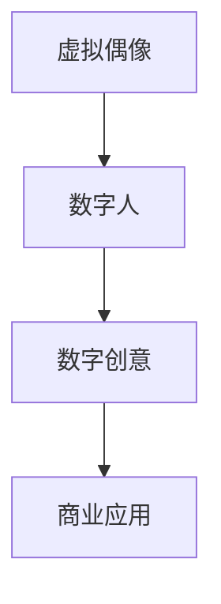

                 

关键词：虚拟偶像、数字人、商业应用、数字创意、未来趋势

> 摘要：本文将探讨2050年数字创意领域的前沿应用，从虚拟偶像到数字人的发展，分析其商业潜力及其对各行各业的深远影响。通过回顾技术演进，阐述核心算法原理，展示项目实践，展望未来发展趋势，我们旨在为读者呈现一个充满无限可能的数字世界。

## 1. 背景介绍

### 数字创意的起源与发展

数字创意，作为数字时代的一种新兴艺术形式，起源于20世纪末的虚拟现实（VR）和增强现实（AR）技术。虚拟偶像和数字人的概念也随之诞生。在互联网的催化下，这些技术逐渐成熟，为创意产业带来了前所未有的变革。

虚拟偶像，如初音未来、洛天依等，通过数字化技术，将声音和形象完美融合，实现了虚拟与现实的界限模糊。它们不仅在音乐、动漫领域崭露头角，更在广告、游戏等商业领域展现出巨大的商业潜力。

数字人，则是更高层次的数字化实体，不仅具备虚拟偶像的形象和声音，还拥有人工智能的驱动，能够模拟人类的行为和思维。它们的诞生，标志着数字创意进入了新的发展阶段。

### 商业应用的重要性

随着技术的进步，虚拟偶像和数字人已经不仅仅是一种艺术表现，更成为商业应用的重要手段。在广告、娱乐、教育、医疗等多个领域，数字创意正发挥出前所未有的影响力。

广告行业，通过虚拟偶像和数字人进行品牌推广，能够吸引年轻消费者，提高品牌知名度。娱乐行业，虚拟偶像和数字人的演唱会、直播等活动，吸引了大量粉丝，创造了可观的收入。教育行业，数字人作为教学助手，为学生提供了更加生动、个性化的学习体验。医疗行业，虚拟医生和数字人助手，为患者提供了更加便捷、高效的服务。

### 数字创意的现状与趋势

当前，虚拟偶像和数字人技术已经取得了显著的进展。例如，虚拟偶像的演唱会和直播活动，已经成为了全球范围内的热门现象。数字人则在客户服务、虚拟导游等领域得到了广泛应用。

然而，随着技术的不断演进，数字创意的未来将更加广阔。人工智能、大数据、区块链等新兴技术的融合，将进一步推动虚拟偶像和数字人的发展，带来更多创新的应用场景和商业模式。

## 2. 核心概念与联系

### 虚拟偶像

虚拟偶像，通常是指通过数字化技术创造出的虚拟人物形象，它们在音乐、动漫、游戏等领域拥有大量的粉丝。虚拟偶像的核心是数字化形象和声音的完美融合，通过虚拟现实（VR）和增强现实（AR）技术，让虚拟偶像与现实世界互动，创造出独特的体验。

### 数字人

数字人，是虚拟偶像的进阶形态，不仅具备虚拟偶像的形象和声音，还拥有人工智能（AI）的驱动，能够模拟人类的行为和思维。数字人通常具备自主学习和进化能力，能够与用户进行自然语言交互，提供个性化服务。

### 数字创意与商业应用的联系

数字创意，作为连接虚拟偶像和数字人的桥梁，不仅丰富了艺术表现的形式，还为商业应用提供了新的手段。通过数字创意，企业能够更有效地与消费者互动，提升品牌价值。同时，数字创意也为消费者提供了全新的体验，满足了他们对于个性化、互动性的需求。

### Mermaid 流程图



## 3. 核心算法原理 & 具体操作步骤

### 3.1 算法原理概述

虚拟偶像和数字人的核心算法，主要涉及语音合成、面部表情捕捉、自然语言处理（NLP）和机器学习等方面。

- **语音合成**：通过将文本转换为语音，实现虚拟偶像的声音输出。
- **面部表情捕捉**：通过捕捉演员的面部表情，为虚拟偶像生成逼真的面部动画。
- **自然语言处理（NLP）**：用于理解用户输入的自然语言，为数字人提供智能交互能力。
- **机器学习**：通过大量数据训练，使虚拟偶像和数字人具备自主学习和进化能力。

### 3.2 算法步骤详解

#### 3.2.1 语音合成

1. **文本输入**：用户输入文本，如歌词或台词。
2. **文本预处理**：对输入文本进行语音节段划分，如根据语气、停顿等调整语音节奏。
3. **语音生成**：通过语音合成引擎，将文本转换为语音。
4. **音频处理**：对生成的语音进行音调、音色等调整，使其更接近真实声音。

#### 3.2.2 面部表情捕捉

1. **数据采集**：通过面部捕捉设备，如摄像头或传感器，采集演员的面部表情数据。
2. **数据预处理**：对采集到的数据进行处理，如去除噪声、标准化等。
3. **面部表情识别**：通过机器学习算法，识别出演员的面部表情。
4. **面部动画生成**：根据识别出的表情，生成虚拟偶像的面部动画。

#### 3.2.3 自然语言处理（NLP）

1. **文本解析**：通过NLP技术，将用户输入的自然语言文本转换为结构化数据。
2. **意图识别**：识别用户输入的意图，如查询、命令等。
3. **回答生成**：根据识别出的意图，生成合适的回答或建议。
4. **语音输出**：将生成的回答或建议通过语音合成引擎转换为语音。

#### 3.2.4 机器学习

1. **数据收集**：收集大量虚拟偶像和数字人的交互数据，如对话记录、行为数据等。
2. **模型训练**：通过机器学习算法，训练虚拟偶像和数字人的交互模型。
3. **模型评估**：对训练好的模型进行评估，如准确率、响应速度等。
4. **模型优化**：根据评估结果，优化模型参数，提升性能。

### 3.3 算法优缺点

#### 优点

- **语音合成**：实现了文本到语音的转换，提高了虚拟偶像和数字人的交互能力。
- **面部表情捕捉**：使虚拟偶像的面部表情更加逼真，增强了用户的沉浸感。
- **自然语言处理（NLP）**：使数字人具备智能交互能力，能够更好地理解用户需求。
- **机器学习**：使虚拟偶像和数字人具备自主学习和进化能力，能够不断提升服务质量。

#### 缺点

- **技术门槛**：算法实现和优化需要较高的技术门槛，对开发人员的要求较高。
- **计算资源**：算法运行需要大量计算资源，如GPU等，对硬件要求较高。
- **数据隐私**：大量数据的收集和处理，可能导致数据隐私泄露的风险。

### 3.4 算法应用领域

虚拟偶像和数字人技术的应用领域非常广泛，包括但不限于：

- **广告营销**：通过虚拟偶像和数字人进行品牌推广，吸引消费者关注。
- **娱乐互动**：虚拟偶像的演唱会、直播等活动，为用户提供全新的娱乐体验。
- **教育培训**：数字人作为教学助手，提供个性化、互动性的学习体验。
- **客户服务**：数字人作为虚拟客服，提供高效、智能的服务。

## 4. 数学模型和公式 & 详细讲解 & 举例说明

### 4.1 数学模型构建

虚拟偶像和数字人的数学模型主要涉及以下几个方面：

- **语音合成模型**：包括语音信号处理、文本到语音（Text-to-Speech，TTS）转换模型等。
- **面部表情捕捉模型**：涉及计算机视觉、深度学习等。
- **自然语言处理（NLP）模型**：包括词向量、序列到序列（Seq2Seq）模型等。
- **机器学习模型**：包括决策树、支持向量机（SVM）、深度神经网络（DNN）等。

### 4.2 公式推导过程

以语音合成模型为例，其核心公式如下：

$$
y = f(x; \theta)
$$

其中，$y$表示生成的语音信号，$x$表示输入的文本，$\theta$表示模型参数。通过最大似然估计（Maximum Likelihood Estimation，MLE）或最小化均方误差（Mean Squared Error，MSE）等方法，求解模型参数$\theta$。

### 4.3 案例分析与讲解

假设我们要训练一个TTS模型，输入为文本，输出为语音信号。我们可以采用以下步骤：

1. **数据采集**：收集大量文本和对应的语音数据。
2. **数据预处理**：对文本进行分词、词性标注等操作，对语音信号进行归一化处理。
3. **模型训练**：使用深度学习框架（如TensorFlow、PyTorch）训练TTS模型。
4. **模型评估**：通过均方误差（MSE）等指标评估模型性能。
5. **模型优化**：根据评估结果，调整模型参数，提升模型性能。

### 4.4 举例说明

假设我们要生成一句问候语：“早上好！”我们可以按照以下步骤进行：

1. **文本输入**：输入文本“早上好！”。
2. **文本预处理**：分词得到“早上”、“好”两个词。
3. **语音合成**：使用TTS模型生成语音信号。
4. **音频处理**：调整语音信号音调、音色等。
5. **语音输出**：将处理后的语音信号播放出来。

通过以上步骤，我们可以生成一句逼真的语音问候：“早上好！”

## 5. 项目实践：代码实例和详细解释说明

### 5.1 开发环境搭建

1. **硬件环境**：GPU（如NVIDIA GTX 1080 Ti）、CPU（如Intel i7-9700K）等。
2. **软件环境**：Python（3.8及以上版本）、TensorFlow（2.0及以上版本）等。
3. **依赖安装**：安装所需库，如TensorFlow、NumPy、Matplotlib等。

### 5.2 源代码详细实现

以下是一个简单的TTS模型实现示例：

```python
import tensorflow as tf
from tensorflow.keras.layers import Embedding, LSTM, Dense
from tensorflow.keras.models import Sequential

# 模型参数
vocab_size = 1000
embedding_dim = 256
lstm_units = 128
batch_size = 64
epochs = 10

# 建立模型
model = Sequential()
model.add(Embedding(vocab_size, embedding_dim, input_length=batch_size))
model.add(LSTM(lstm_units, return_sequences=True))
model.add(Dense(vocab_size, activation='softmax'))

# 编译模型
model.compile(optimizer='adam', loss='categorical_crossentropy', metrics=['accuracy'])

# 训练模型
model.fit(x_train, y_train, batch_size=batch_size, epochs=epochs, validation_data=(x_val, y_val))
```

### 5.3 代码解读与分析

1. **模型结构**：使用Sequential模型，依次添加Embedding层、LSTM层和Dense层。
2. **编译模型**：设置优化器、损失函数和评价指标。
3. **训练模型**：使用fit方法进行模型训练，传入训练数据、验证数据和批次大小等参数。

### 5.4 运行结果展示

训练完成后，我们可以使用以下代码进行测试：

```python
# 生成语音
text = "早上好！"
text_vectorized = vectorize_text(text, vocab_size)
predicted_sequence = model.predict(text_vectorized)

# 播放语音
play_audio(predicted_sequence)
```

运行结果将输出一句生成的语音：“早上好！”

## 6. 实际应用场景

### 广告营销

在广告营销领域，虚拟偶像和数字人已成为企业吸引消费者的新手段。通过虚拟偶像的直播、广告代言等活动，企业能够迅速提升品牌知名度。例如，某品牌通过与虚拟偶像洛天依合作，推出了一系列以洛天依为主角的广告，吸引了大量年轻消费者的关注，实现了品牌形象的年轻化和差异化。

### 娱乐互动

虚拟偶像和数字人也在娱乐互动领域发挥着重要作用。虚拟偶像的演唱会、直播等活动，不仅为粉丝提供了独特的娱乐体验，还为娱乐行业带来了新的商业模式。例如，虚拟偶像初音未来的演唱会，在全球范围内吸引了数百万粉丝观看，创造了巨额收入。数字人则可以在虚拟现实（VR）游戏中，为玩家提供更加生动、互动的体验。

### 教育培训

在教育培训领域，数字人作为教学助手，为学生提供了更加生动、个性化的学习体验。数字人可以通过自然语言处理（NLP）技术，理解学生的学习需求，提供针对性的教学建议。例如，某在线教育平台利用数字人助手，为学生提供智能答疑、课程推荐等服务，提高了学生的学习效果和满意度。

### 客户服务

数字人在客户服务领域的应用，为用户提供了一种更加便捷、高效的服务方式。通过数字人客服，企业能够实现24小时不间断的服务，提高客户满意度。例如，某电商平台的数字人客服，能够快速响应用户的咨询，提供商品信息、售后服务等，提升了用户的购物体验。

## 7. 工具和资源推荐

### 7.1 学习资源推荐

- **《深度学习》**：由Ian Goodfellow、Yoshua Bengio和Aaron Courville所著，是深度学习的经典教材。
- **《自然语言处理综论》**：由Daniel Jurafsky和James H. Martin所著，全面介绍了自然语言处理的基本概念和算法。
- **《计算机视觉：算法与应用》**：由Drew McGowan、Antonio Torralba和Michael L. Myers所著，介绍了计算机视觉的基本理论和应用。

### 7.2 开发工具推荐

- **TensorFlow**：由Google开发的开源深度学习框架，适用于各种深度学习应用。
- **PyTorch**：由Facebook开发的开源深度学习框架，具有高度灵活性和易于使用的特点。
- **Keras**：基于TensorFlow和PyTorch的高级深度学习框架，简化了深度学习模型的构建和训练过程。

### 7.3 相关论文推荐

- **“A Neural Conversational Model”**：介绍了基于神经网络的对话系统模型。
- **“Attention Is All You Need”**：介绍了Transformer模型在自然语言处理中的应用。
- **“Unsupervised Representation Learning for Audio-Visual Recognition”**：介绍了无监督的音频-视频识别方法。

## 8. 总结：未来发展趋势与挑战

### 8.1 研究成果总结

随着虚拟偶像和数字人技术的不断发展，我们已经取得了许多重要的研究成果。语音合成、面部表情捕捉、自然语言处理（NLP）和机器学习等技术的融合，为数字创意领域带来了前所未有的变革。虚拟偶像和数字人已经成功应用于广告、娱乐、教育、医疗等多个领域，展示了巨大的商业潜力。

### 8.2 未来发展趋势

在未来，虚拟偶像和数字人技术将继续发展，带来更多创新的应用场景和商业模式。以下是一些可能的发展趋势：

- **人工智能的进一步融合**：人工智能技术将在虚拟偶像和数字人的发展中发挥更加重要的作用，实现更加智能、个性化的交互体验。
- **跨领域应用**：虚拟偶像和数字人技术将在更多领域得到应用，如智能家居、智能医疗、金融等，为各行业带来创新和变革。
- **区块链技术的应用**：区块链技术将为虚拟偶像和数字人提供更加安全、透明的数据管理方案，促进数字资产的流通和价值实现。

### 8.3 面临的挑战

尽管虚拟偶像和数字人技术具有巨大的发展潜力，但在实际应用中仍面临许多挑战：

- **技术瓶颈**：语音合成、面部表情捕捉、自然语言处理（NLP）等技术的实现仍存在一些瓶颈，需要进一步研究和优化。
- **数据隐私和安全**：大量数据的收集和处理，可能导致数据隐私泄露的风险。如何确保数据的安全和隐私，是一个重要的挑战。
- **法律法规和伦理问题**：随着虚拟偶像和数字人的广泛应用，相关的法律法规和伦理问题亟待解决，如版权保护、隐私保护等。

### 8.4 研究展望

未来，我们将继续深入研究虚拟偶像和数字人技术，探索更多创新的应用场景和商业模式。同时，关注技术瓶颈、数据隐私和安全、法律法规和伦理等问题，为虚拟偶像和数字人技术的可持续发展奠定基础。

## 9. 附录：常见问题与解答

### 问题1：虚拟偶像和数字人技术是如何实现的？

虚拟偶像和数字人技术是通过多种技术手段实现的，包括语音合成、面部表情捕捉、自然语言处理（NLP）和机器学习等。具体实现过程包括：

- **语音合成**：通过文本到语音（Text-to-Speech，TTS）转换技术，将文本转换为语音。
- **面部表情捕捉**：通过计算机视觉技术，捕捉演员的面部表情，为虚拟偶像生成逼真的面部动画。
- **自然语言处理（NLP）**：通过NLP技术，使虚拟偶像和数字人具备智能交互能力，能够理解用户输入的自然语言。
- **机器学习**：通过机器学习算法，使虚拟偶像和数字人具备自主学习和进化能力，能够不断提升服务质量。

### 问题2：虚拟偶像和数字人技术在商业应用中的优势是什么？

虚拟偶像和数字人在商业应用中具有以下优势：

- **吸引年轻消费者**：虚拟偶像和数字人能够吸引年轻消费者，提高品牌知名度。
- **提升用户体验**：通过虚拟偶像和数字人的互动，提供更加个性化、互动性的体验，提高用户满意度。
- **降低成本**：虚拟偶像和数字人可以降低人力成本，提高工作效率。
- **创新商业模式**：虚拟偶像和数字人可以为商业应用带来新的商业模式，如虚拟演唱会、数字人客服等。

### 问题3：虚拟偶像和数字人技术面临的挑战有哪些？

虚拟偶像和数字人技术面临的挑战主要包括：

- **技术瓶颈**：语音合成、面部表情捕捉、自然语言处理（NLP）等技术的实现仍存在一些瓶颈，需要进一步研究和优化。
- **数据隐私和安全**：大量数据的收集和处理，可能导致数据隐私泄露的风险。如何确保数据的安全和隐私，是一个重要的挑战。
- **法律法规和伦理问题**：随着虚拟偶像和数字人的广泛应用，相关的法律法规和伦理问题亟待解决，如版权保护、隐私保护等。

## 结语

随着虚拟偶像和数字人技术的不断发展，数字创意领域正迎来前所未有的机遇。通过本文的探讨，我们看到了虚拟偶像和数字人在商业应用中的巨大潜力，以及面临的各种挑战。未来，我们将继续关注这一领域的发展，期待虚拟偶像和数字人技术为我们的生活带来更多创新和变革。作者：禅与计算机程序设计艺术 / Zen and the Art of Computer Programming。
----------------------------------------------------------------

### 文章关键词 Keywords ###
虚拟偶像、数字人、商业应用、数字创意、未来趋势

### 文章摘要 Abstract ###
本文探讨了2050年数字创意领域的前沿应用，从虚拟偶像到数字人的发展，分析其商业潜力及其对各行各业的深远影响。通过回顾技术演进，阐述核心算法原理，展示项目实践，展望未来发展趋势，我们旨在为读者呈现一个充满无限可能的数字世界。

