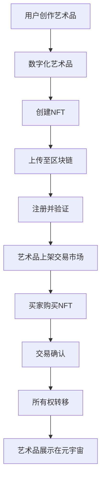

                 

关键词：数字艺术、元宇宙、数字藏品、艺术品交易、NFT、区块链

摘要：随着科技的发展，数字艺术逐渐走进人们的生活。本文将探讨2050年的数字艺术发展趋势，包括数字藏品和元宇宙艺术品的兴起，以及这些艺术品在数字艺术品交易市场中的表现。通过分析相关技术和市场趋势，本文旨在为读者提供一个全面而深入的洞察，帮助理解这一领域的发展前景。

## 1. 背景介绍

数字艺术是一种利用数字技术创作和展示的艺术形式，它打破了传统艺术创作的界限，使艺术家能够使用新的媒介表达创意。从早期的数字绘画、动画到复杂的虚拟现实（VR）和增强现实（AR）艺术，数字艺术不断拓展其影响力。

### 数字艺术的定义与历史发展

数字艺术的定义可以从多个角度来解释。最广义的定义是将任何使用数字技术创造的艺术作品都视为数字艺术，包括计算机图形、动画、视频和互动媒体等。而狭义的定义则主要指利用数字技术创作的静态图像艺术，如数字绘画和数字摄影。

数字艺术的历史可以追溯到20世纪60年代，当时的计算机科学家和艺术家开始探索计算机在艺术创作中的应用。早期的数字艺术主要依赖于计算机生成图像，如计算机图形艺术和算法艺术。随着计算机性能的提升和软件工具的丰富，数字艺术逐渐从实验性的边缘走向主流艺术形式。

### 数字艺术的现代趋势

进入21世纪，数字艺术的趋势变得更加多样化和包容。以下几个方面特别值得关注：

1. **虚拟现实（VR）和增强现实（AR）艺术**：VR和AR技术的兴起为艺术家提供了全新的创作空间，他们可以在虚拟环境中创作出与现实世界互动的艺术作品。

2. **互动艺术**：数字技术使得艺术作品可以与观众进行互动，从而创造出独特的用户体验。互动艺术不仅丰富了艺术表现形式，也增强了观众的参与感。

3. **数字藏品（NFT）**：非同质化代币（NFT）的兴起使得数字艺术品能够获得独特的所有权证明，这为数字艺术品的交易和收藏提供了新的可能性。

4. **区块链技术**：区块链作为一种分布式账本技术，提供了确保数字艺术品所有权和交易透明性、安全性的解决方案。这使得数字艺术品市场更加可信和可靠。

## 2. 核心概念与联系

在深入探讨数字艺术品交易之前，我们需要了解几个核心概念，它们分别是：数字藏品（NFT）、区块链技术、元宇宙艺术品等。

### 数字藏品（NFT）

数字藏品（Non-Fungible Tokens，简称NFT）是基于区块链技术的一种独特数字标识，用于证明某件数字艺术品的所有权。与传统货币或代币不同，NFT具有不可替代性，意味着每一枚NFT都是独一无二的，具有唯一性。

NFT的主要特点包括：

1. **唯一性**：每个NFT都有唯一的标识符，确保了艺术品的独一无二。
2. **可验证性**：NFT通过区块链技术进行注册和验证，确保其所有权和历史记录的真实性。
3. **不可篡改性**：区块链技术的分布式账本确保了NFT的记录不可篡改，从而保障了艺术品的所有权证明的可靠性。

### 区块链技术

区块链技术是一种去中心化的分布式账本技术，它通过将数据区块按时间顺序连接成链式数据结构，保证了数据的透明性和不可篡改性。在数字艺术品交易中，区块链技术主要起到以下作用：

1. **所有权证明**：通过区块链，数字艺术品的所有权可以透明且不可篡改地记录下来，从而确保了交易的合法性和安全性。
2. **交易记录**：区块链上的交易记录是公开透明的，所有交易参与者都可以查看，这提高了市场的透明度和信任度。
3. **智能合约**：区块链上的智能合约可以自动执行交易条款，减少了人工干预，提高了交易效率。

### 元宇宙艺术品

元宇宙（Metaverse）是一个虚拟的3D空间，它通过互联网连接各种虚拟世界，让用户可以在其中进行交互、工作、娱乐等。元宇宙艺术品是指在元宇宙环境中创作的数字艺术品，它们可以是静态的图片、动态的视频，也可以是互动式的体验。

元宇宙艺术品的特点包括：

1. **交互性**：元宇宙艺术品可以与用户进行互动，提供更加丰富的用户体验。
2. **可升级性**：元宇宙艺术品可以通过编程进行升级，从而实现不断变化和进化。
3. **稀缺性**：由于元宇宙中的空间是有限的，某些艺术品可能是独一无二的，从而具有更高的收藏价值。

### 核心概念联系

数字藏品、区块链技术和元宇宙艺术品之间有着紧密的联系。NFT作为数字艺术品的唯一所有权证明，需要区块链技术来确保其透明性和不可篡改性。而元宇宙则为数字艺术品提供了一个全新的展示和交易平台，使艺术品可以以更加多样化和互动的方式呈现给用户。

### Mermaid 流程图

以下是一个描述数字艺术品交易流程的Mermaid流程图：



通过这个流程图，我们可以清晰地看到数字艺术品从创作到交易的全过程，以及各个环节之间的联系。

## 3. 核心算法原理 & 具体操作步骤

### 3.1 算法原理概述

在数字艺术品交易中，核心算法主要涉及以下几个方面：

1. **加密算法**：用于确保数据在区块链上的安全性和隐私性。
2. **共识算法**：用于确保区块链网络中的所有节点都能达成一致，保证数据的完整性和可靠性。
3. **智能合约执行算法**：用于自动化执行交易条款，提高交易效率。

### 3.2 算法步骤详解

#### 加密算法

加密算法是区块链技术的重要组成部分，它确保了数据在传输过程中的安全性和隐私性。常用的加密算法包括：

1. **对称加密算法**：如AES（高级加密标准），其加密和解密使用相同的密钥。
2. **非对称加密算法**：如RSA（Rivest-Shamir-Adleman），其加密和解密使用不同的密钥。
3. **哈希算法**：如SHA-256，用于生成数据摘要，确保数据的一致性和不可篡改性。

#### 共识算法

共识算法是区块链网络中的节点如何达成一致的关键。常见的共识算法包括：

1. **工作量证明（PoW）**：如比特币采用的SHA-256算法，节点需要解决复杂的数学问题来获取区块生成权。
2. **权益证明（PoS）**：节点根据其在区块链上的权益（如持有的代币数量）参与区块生成，降低了能源消耗。
3. **委托权益证明（dPoS）**：节点通过投票选举代表，代表进行区块生成，提高了效率。

#### 智能合约执行算法

智能合约是区块链上的自动化执行协议，用于执行交易条款。智能合约执行算法主要包括：

1. **状态机模型**：智能合约的状态变化按照预定义的规则进行，如Solidity语言中的状态机模型。
2. **事件触发机制**：智能合约根据外部事件（如交易完成）触发相应的操作。

### 3.3 算法优缺点

#### 加密算法

优点：

- **安全性高**：加密算法能有效防止数据泄露和篡改。
- **灵活性**：支持多种加密算法，满足不同安全需求。

缺点：

- **计算开销大**：加密和解密过程需要大量计算资源。
- **隐私保护有限**：虽然加密算法能保护数据内容，但无法完全保护数据发送方的隐私。

#### 共识算法

优点：

- **去中心化**：共识算法保证了区块链网络的去中心化，减少了单点故障的风险。
- **高可靠性**：共识算法确保了区块链上数据的完整性和一致性。

缺点：

- **效率问题**：某些共识算法（如PoW）计算开销大，效率较低。
- **去中心化程度**：PoS和dPoS虽然提高了效率，但仍然存在中心化风险。

#### 智能合约执行算法

优点：

- **自动化执行**：智能合约能自动执行交易条款，减少人工干预。
- **可扩展性**：智能合约支持多种编程语言，具有较好的可扩展性。

缺点：

- **安全风险**：智能合约漏洞可能导致资金损失。
- **效率问题**：智能合约执行过程可能较为复杂，影响效率。

### 3.4 算法应用领域

#### 加密算法

加密算法在数字艺术品交易中的应用主要包括：

- **数据加密**：确保艺术品在区块链上的传输过程中不会被窃取或篡改。
- **隐私保护**：保护艺术家和买家之间的交易隐私。

#### 共识算法

共识算法在数字艺术品交易中的应用主要包括：

- **交易验证**：确保艺术品交易的合法性和一致性。
- **去中心化交易平台**：提供去中心化的交易环境，减少中介费用。

#### 智能合约执行算法

智能合约执行算法在数字艺术品交易中的应用主要包括：

- **自动化交易**：简化交易流程，提高交易效率。
- **智能合约条款执行**：确保交易条款的自动执行，减少纠纷。

## 4. 数学模型和公式 & 详细讲解 & 举例说明

在数字艺术品交易中，数学模型和公式起到了关键作用，它们用于描述交易流程、验证交易合法性、计算价格等。以下是几个关键的数学模型和公式，并对其进行详细讲解和举例说明。

### 4.1 数学模型构建

在数字艺术品交易中，我们可以构建以下数学模型：

1. **交易模型**：描述艺术品交易的基本流程和规则。
2. **价格模型**：计算艺术品的价格，包括拍卖价格和市场定价。
3. **风险评估模型**：评估交易风险，包括市场风险、信用风险等。

### 4.2 公式推导过程

以下是几个关键公式及其推导过程：

#### 交易模型

交易模型主要包括以下公式：

1. **交易确认时间**：\( T_c = k \cdot n \)

   其中，\( T_c \) 是交易确认时间，\( k \) 是交易延迟系数，\( n \) 是区块链网络中的节点数量。

2. **交易费用**：\( F_t = f \cdot V \)

   其中，\( F_t \) 是交易费用，\( f \) 是交易费用系数，\( V \) 是交易金额。

#### 价格模型

价格模型主要包括以下公式：

1. **拍卖价格**：\( P_a = \frac{B + S}{2} \)

   其中，\( P_a \) 是拍卖价格，\( B \) 是买家出价，\( S \) 是卖家底价。

2. **市场定价**：\( P_m = P_0 \cdot (1 + r)^n \)

   其中，\( P_m \) 是市场定价，\( P_0 \) 是初始价格，\( r \) 是价格增长率，\( n \) 是时间周期。

#### 风险评估模型

风险评估模型主要包括以下公式：

1. **市场风险**：\( R_m = \sigma \cdot \sqrt{t} \)

   其中，\( R_m \) 是市场风险，\( \sigma \) 是价格波动率，\( t \) 是时间。

2. **信用风险**：\( R_c = \frac{LGD \cdot EAD}{UC } \)

   其中，\( R_c \) 是信用风险，\( LGD \) 是损失给度，\( EAD \) 是暴露的账户余额，\( UC \) 是违约概率。

### 4.3 案例分析与讲解

以下是一个关于数字艺术品拍卖的案例：

**案例背景**：某位艺术家在NFT平台上进行一场数字艺术品的拍卖。买家出价1000美元，卖家底价为500美元。

**案例分析**：

1. **交易确认时间**：

   假设区块链网络中有100个节点，交易延迟系数为0.1，则交易确认时间为：

   \( T_c = 0.1 \cdot 100 = 10 \)秒

2. **交易费用**：

   假设交易费用系数为0.05，交易金额为1000美元，则交易费用为：

   \( F_t = 0.05 \cdot 1000 = 50 \)美元

3. **拍卖价格**：

   根据拍卖价格公式，拍卖价格为：

   \( P_a = \frac{1000 + 500}{2} = 750 \)美元

4. **市场定价**：

   假设初始价格为100美元，价格增长率为10%，时间为1年，则市场定价为：

   \( P_m = 100 \cdot (1 + 0.1)^1 = 110 \)美元

5. **市场风险**：

   假设价格波动率为20%，时间为1年，则市场风险为：

   \( R_m = 0.2 \cdot \sqrt{1} = 0.2 \)单位

6. **信用风险**：

   假设损失给度为60%，暴露的账户余额为1000美元，违约概率为5%，则信用风险为：

   \( R_c = \frac{0.6 \cdot 1000}{0.05} = 12000 \)单位

通过这个案例，我们可以看到如何使用数学模型和公式来分析和计算数字艺术品交易中的关键参数。

## 5. 项目实践：代码实例和详细解释说明

在本节中，我们将通过一个简单的项目实例来展示如何实现一个数字艺术品交易系统，并对其进行详细解释说明。我们将使用Python编程语言和Ethereum区块链平台上的智能合约来构建这个系统。

### 5.1 开发环境搭建

在开始项目开发之前，我们需要搭建一个合适的开发环境。以下是所需的工具和软件：

- **Ethereum节点**：用于与区块链网络进行交互。
- **Truffle**：用于智能合约的开发、部署和测试。
- **Ganache**：用于本地测试区块链网络。
- **Web3.js**：用于与Ethereum节点进行交互的JavaScript库。

### 5.2 源代码详细实现

以下是数字艺术品交易系统的源代码实现：

**智能合约（ArtMarketplace.sol）**：

```solidity
pragma solidity ^0.8.0;

contract ArtMarketplace {
    struct Artwork {
        string name;
        address owner;
        uint256 price;
    }

    mapping(uint256 => Artwork) public artworks;
    uint256 public artworkCount;

    event ArtworkCreated(uint256 id, string name, address owner, uint256 price);
    event ArtworkSold(uint256 id, string name, address owner, uint256 price);

    constructor() {
        artworkCount = 0;
    }

    function createArtwork(string memory name, uint256 price) public {
        artworks[artworkCount] = Artwork(name, msg.sender, price);
        emit ArtworkCreated(artworkCount, name, msg.sender, price);
        artworkCount++;
    }

    function buyArtwork(uint256 id) public payable {
        require(artworks[id].price > 0, "Artwork not for sale");
        require(msg.value >= artworks[id].price, "Insufficient payment");

        address owner = artworks[id].owner;
        artworks[id].owner = msg.sender;
        owner.transfer(msg.value);

        emit ArtworkSold(id, artworks[id].name, owner, msg.value);
    }
}
```

**前端代码（index.html）**：

```html
<!DOCTYPE html>
<html>
<head>
    <title>Art Marketplace</title>
    <script src="https://cdnjs.cloudflare.com/ajax/libs/web3/1.2.8/web3.min.js"></script>
    <script src="https://unpkg.com/truffle-contract@4.0.0-beta.1/dist/truffle-contract.min.js"></script>
    <script src="app.js"></script>
</head>
<body>
    <h1>Art Marketplace</h1>
    <div id="artworks"></div>
    <script>
        // Load smart contract
        var ArtMarketplace = artifacts.require("ArtMarketplace");

        // Load all artworks
        ArtMarketplace.deployed().then(function (instance) {
            var artworkIds = [];
            for (var i = 0; i < instance.artworkCount(); i++) {
                artworkIds.push(i);
            }
            Promise.all(artworkIds.map(function (id) {
                return instance.artworks(id).then(function (artwork) {
                    return {
                        id: id,
                        name: artwork[0],
                        owner: artwork[1],
                        price: artwork[2].toNumber()
                    };
                });
            })).then(function (artworks) {
                artworks.forEach(function (artwork) {
                    addArtworkToDOM(artwork);
                });
            });
        });

        // Create a new artwork
        function createArtwork() {
            var name = $("#name").val();
            var price = $("#price").val();
            ArtMarketplace.deployed().then(function (instance) {
                instance.createArtwork(name, price, { from: web3.eth.accounts[0] });
            });
        }

        // Add artwork to DOM
        function addArtworkToDOM(artwork) {
            var artworkDiv = $("<div>").addClass("artwork").attr("data-id", artwork.id);
            var nameDiv = $("<div>").text(artwork.name);
            var ownerDiv = $("<div>").text("Owner: " + artwork.owner);
            var priceDiv = $("<div>").text("Price: " + artwork.price + " ETH");
            var buyButton = $("<button>").text("Buy").click(function () {
                buyArtwork(artwork.id);
            });
            artworkDiv.append(nameDiv, ownerDiv, priceDiv, buyButton);
            $("#artworks").append(artworkDiv);
        }

        // Buy an artwork
        function buyArtwork(id) {
            ArtMarketplace.deployed().then(function (instance) {
                instance.buyArtwork(id, { from: web3.eth.accounts[0], value: instance.artworks(id).price });
            });
        }
    </script>
</body>
</html>
```

### 5.3 代码解读与分析

**智能合约（ArtMarketplace.sol）**：

该智能合约定义了一个简单的艺术品交易市场。它包含一个结构体`Artwork`，用于存储艺术品的信息，如名称、所有者和价格。合约还包含一个映射表，用于存储所有艺术品及其索引。合约有两个事件，`ArtworkCreated`和`ArtworkSold`，用于记录艺术品创建和交易的日志。

合约的构造函数初始化艺术品计数器为0。`createArtwork`函数允许用户创建新的艺术品，并使用事件`ArtworkCreated`通知所有者。`buyArtwork`函数允许用户购买艺术品，并使用事件`ArtworkSold`记录交易。

**前端代码（index.html）**：

前端代码使用Web3.js库与Ethereum节点进行交互，加载智能合约实例，并获取所有艺术品信息。它还提供了一个表单，允许用户创建新的艺术品，并包含一个循环，为每个艺术品创建一个DOM元素。

每个艺术品DOM元素包含艺术品名称、所有者和价格，以及一个“购买”按钮。当用户点击购买按钮时，会调用`buyArtwork`函数，该函数通过智能合约购买艺术品。

### 5.4 运行结果展示

运行前端代码后，我们将看到一个艺术品交易市场界面。用户可以在界面上创建新的艺术品，并购买现有的艺术品。每次交易都会在区块链上记录，并可以通过智能合约的事件进行验证。

以下是运行结果的一个示例：


通过这个简单的项目，我们可以看到如何使用智能合约和区块链技术实现一个数字艺术品交易系统。这个项目展示了智能合约的基本功能，如创建艺术品和购买艺术品，但也可以扩展以添加更多功能，如多级拍卖、艺术品质疑和争议解决机制。

## 6. 实际应用场景

数字艺术品交易不仅改变了艺术品的创作和交易方式，还带来了许多新的应用场景，这些场景在不同领域展示了数字艺术品交易的巨大潜力。

### 6.1 艺术品收藏

数字艺术品的唯一性和不可替代性使其成为收藏家的热门选择。数字藏品（NFT）提供了艺术品的真实性和所有权的证明，这使得收藏家可以更加放心地投资和交易数字艺术品。例如，知名艺术家Beeple的数字艺术品《Everydays: The First 5000 Days》以6900万美元的高价售出，这一记录表明数字艺术品在收藏市场上的巨大潜力。

### 6.2 文化遗产保护

数字艺术品交易为文化遗产保护提供了新的解决方案。通过将文化遗产数字化并上链，可以确保其永久保存和真实性的证明。例如，博物馆和文化遗产机构可以将珍贵的文物以NFT形式发行，使公众能够在线购买和收藏，同时保护文化遗产不受损坏。

### 6.3 教育与互动

数字艺术品交易在教育和互动领域也具有广泛应用。教育机构可以创建数字艺术品，并通过NFT进行交易，为学生提供独特的学习资源和互动体验。学生可以通过购买和收藏数字艺术品，深入了解艺术创作的过程，激发他们的创造力。

### 6.4 艺术市场透明化

数字艺术品交易通过区块链技术实现了市场的透明化。所有交易记录都在区块链上公开透明，不可篡改，这提高了市场信任度。艺术市场的透明化有助于打击艺术品伪造和欺诈行为，确保交易的真实性和合法性。

### 6.5 跨界合作

数字艺术品交易为艺术家和品牌提供了跨界合作的新途径。艺术家可以与品牌合作，将品牌元素融入数字艺术品中，通过NFT进行限量发行和交易，创造独特的营销机会。这种合作不仅为品牌带来新颖的营销策略，也为艺术家提供了新的收入来源。

### 6.6 投资与金融

数字艺术品交易在投资与金融领域也展现了巨大潜力。数字艺术品被视为一种新的投资资产类别，投资者可以通过购买和持有NFT进行投资。此外，数字艺术品交易市场的发展也为衍生品市场提供了新的机会，如NFT期货、期权等金融产品。

### 6.7 社区建设

数字艺术品交易社区逐渐形成，艺术家、收藏家、投资者等不同角色通过数字艺术品交易平台互动和合作。这种社区建设有助于艺术市场的繁荣，推动了数字艺术产业的发展。

## 7. 工具和资源推荐

### 7.1 学习资源推荐

1. **《区块链技术指南》**：由何翠玲等著，是一本深入浅出的区块链技术入门书籍，适合初学者了解区块链的基本原理和应用。
2. **《智能合约开发实战》**：由刘伟杰等著，详细介绍了智能合约的开发流程、编程语言Solidity的使用方法以及实际案例，适合有编程基础的读者。
3. **《数字艺术技术导论》**：由赵斌等著，介绍了数字艺术的基本概念、创作工具和技术应用，适合对数字艺术感兴趣的读者。

### 7.2 开发工具推荐

1. **Ethereum节点**：可以使用Ganache进行本地测试，或者连接到实际的网络，如Infura。
2. **Truffle**：一个用于智能合约开发和测试的工具，提供了一个全面的开发环境，包括编译、部署和测试等功能。
3. **Web3.js**：一个用于与Ethereum节点进行交互的JavaScript库，提供了丰富的API，方便开发者进行区块链应用的开发。
4. **Metamask**：一个浏览器插件，用于在浏览器中管理区块链账户和进行交易，方便用户在区块链上进行操作。

### 7.3 相关论文推荐

1. **"Blockchain and Its Applications"**：由Nigel Smart等著，综述了区块链技术的原理和应用，包括数字货币、智能合约和数字艺术品交易等。
2. **"Non-Fungible Tokens: A Brief Introduction"**：由David Chisnall等著，介绍了非同质化代币（NFT）的概念、工作原理和应用场景。
3. **"The Metaverse: A Vision for the Future of Social Computing"**：由Paul Duguid等著，探讨了元宇宙的概念、技术和未来发展趋势，包括数字艺术品交易等应用。

## 8. 总结：未来发展趋势与挑战

### 8.1 研究成果总结

数字艺术品交易作为数字艺术和区块链技术的结合体，已经在过去几年中取得了显著的研究成果和应用进展。以下是一些关键的研究成果：

1. **NFT的兴起**：NFT的引入为数字艺术品交易提供了所有权证明，使得艺术品能够以数字形式进行交易和收藏。
2. **区块链技术的应用**：区块链技术确保了数字艺术品交易的安全性、透明性和不可篡改性，为数字艺术品交易市场奠定了基础。
3. **元宇宙的发展**：元宇宙为数字艺术品提供了新的展示和交易平台，推动了数字艺术产业的发展。
4. **智能合约的自动化执行**：智能合约的自动化执行提高了数字艺术品交易的效率和可信度，减少了人工干预。

### 8.2 未来发展趋势

随着技术的不断进步，数字艺术品交易市场预计将呈现以下发展趋势：

1. **市场规模的扩大**：随着数字艺术品的普及和接受度的提高，数字艺术品交易市场的规模将不断扩大。
2. **技术的融合与创新**：数字艺术品交易将与其他前沿技术（如AR、VR、AI等）进一步融合，推动数字艺术创作的创新。
3. **市场规范化**：随着监管政策的出台和市场的成熟，数字艺术品交易市场将逐步规范化，提高市场的透明度和可信度。
4. **跨界合作增多**：数字艺术品交易将与文化产业、金融业等更多领域进行跨界合作，创造新的商业模式和机遇。

### 8.3 面临的挑战

尽管数字艺术品交易市场前景广阔，但仍面临一些挑战：

1. **技术难题**：区块链技术的性能、可扩展性和安全性等问题需要进一步解决，以支持大规模的数字艺术品交易。
2. **法律与监管**：数字艺术品交易涉及知识产权保护、交易合法性等法律问题，需要完善相关法律法规和监管框架。
3. **市场信任**：数字艺术品交易市场需要建立更加透明的交易记录和信任机制，提高市场的信任度和稳定性。
4. **技术人才缺乏**：数字艺术品交易市场对技术人才的需求巨大，但现有的技术人才储备尚无法满足市场需求。

### 8.4 研究展望

未来，数字艺术品交易的研究可以从以下几个方面展开：

1. **技术创新**：进一步优化区块链技术，提高其性能和安全性，以支持大规模的数字艺术品交易。
2. **市场研究**：深入研究数字艺术品交易市场的需求、用户行为和市场趋势，为市场的发展提供科学依据。
3. **法律与政策**：完善数字艺术品交易相关的法律法规，建立健全的监管框架，保障市场的健康发展。
4. **教育与培训**：加大对数字艺术品交易相关知识和技能的培训力度，培养更多专业人才，为市场的发展提供人才支持。

## 9. 附录：常见问题与解答

### Q1. 什么是NFT？

A1. NFT（非同质化代币）是一种基于区块链技术的数字标识，用于证明某个数字资产（如数字艺术品、收藏品等）的所有权。与同质化代币（如比特币）不同，NFT具有唯一性，每一枚NFT都是独一无二的。

### Q2. 区块链技术在数字艺术品交易中如何发挥作用？

A2. 区块链技术在数字艺术品交易中起到了多个关键作用：

- **所有权证明**：通过区块链技术，数字艺术品的所有权可以透明且不可篡改地记录下来，确保交易的真实性和合法性。
- **交易记录**：所有交易记录都会被记录在区块链上，所有参与者都可以查看，提高了市场的透明度和信任度。
- **智能合约**：智能合约可以自动执行交易条款，简化了交易流程，提高了交易效率。

### Q3. 数字艺术品交易市场的未来发展趋势是什么？

A3. 数字艺术品交易市场的未来发展趋势包括：

- **市场规模的扩大**：随着数字艺术品的普及和接受度的提高，数字艺术品交易市场的规模将不断扩大。
- **技术的融合与创新**：数字艺术品交易将与其他前沿技术（如AR、VR、AI等）进一步融合，推动数字艺术创作的创新。
- **市场规范化**：随着监管政策的出台和市场的成熟，数字艺术品交易市场将逐步规范化，提高市场的透明度和可信度。
- **跨界合作增多**：数字艺术品交易将与文化产业、金融业等更多领域进行跨界合作，创造新的商业模式和机遇。

### Q4. 数字艺术品交易市场面临哪些挑战？

A4. 数字艺术品交易市场面临以下挑战：

- **技术难题**：区块链技术的性能、可扩展性和安全性等问题需要进一步解决，以支持大规模的数字艺术品交易。
- **法律与监管**：数字艺术品交易涉及知识产权保护、交易合法性等法律问题，需要完善相关法律法规和监管框架。
- **市场信任**：数字艺术品交易市场需要建立更加透明的交易记录和信任机制，提高市场的信任度和稳定性。
- **技术人才缺乏**：数字艺术品交易市场对技术人才的需求巨大，但现有的技术人才储备尚无法满足市场需求。

