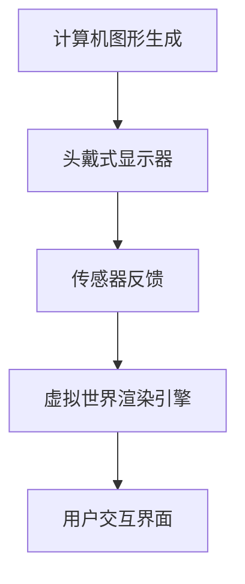
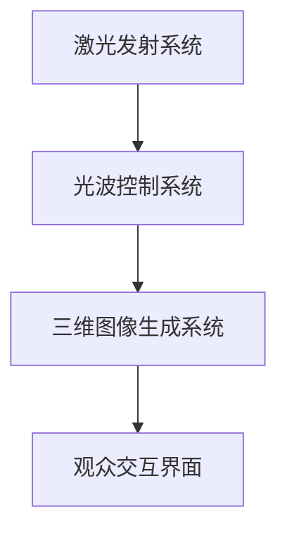

                 

关键词：数字艺术、虚拟现实、全息艺术、沉浸式体验、未来趋势

摘要：随着科技的飞速发展，数字艺术已经成为当代艺术领域的重要分支。本文将探讨2050年的数字艺术发展趋势，从虚拟现实艺术到全息艺术的沉浸式体验，分析其技术原理、数学模型以及实际应用场景，并展望未来的发展趋势与挑战。

## 1. 背景介绍

数字艺术，作为一种融合了数字技术、计算机科学和艺术创作的创新形式，正逐渐改变着我们的生活方式和文化体验。从最初的计算机图形学，到如今虚拟现实（VR）和全息技术，数字艺术的发展不断推动着人类对于艺术表达和审美体验的极限探索。

虚拟现实艺术利用计算机生成三维空间，通过头戴式显示器和传感器将用户带入一个完全沉浸式的虚拟世界。而全息艺术则通过利用激光和光波形成三维图像，使观众能够从不同角度观看同一个图像，实现了真正的立体视觉体验。

随着硬件技术的进步和软件算法的创新，虚拟现实和全息艺术正逐渐成为主流的娱乐和艺术形式。本文将深入探讨这些技术，并预测2050年数字艺术的发展趋势。

## 2. 核心概念与联系

### 2.1 技术原理

虚拟现实艺术依赖于计算机图形学、头戴式显示器（HMD）和传感器技术。计算机图形学生成虚拟的三维空间，HMD提供视觉和听觉的沉浸式体验，传感器则用于捕捉用户的动作和反馈，确保虚拟世界与现实世界的互动。

全息艺术则依赖于激光技术、光波控制和显示屏幕。激光产生光线波前，通过光波控制形成三维图像，显示屏幕则用于显示这些图像，使观众能够从不同角度观看。

### 2.2 架构原理

虚拟现实艺术的架构主要包括：计算机图形生成系统、头戴式显示器、传感器反馈系统、虚拟世界渲染引擎和用户交互界面。这些组件协同工作，共同构建出一个沉浸式的虚拟环境。

全息艺术的架构则包括：激光发射系统、光波控制系统、三维图像生成系统和观众交互界面。激光发射系统产生光线波前，光波控制系统调整光线的方向和强度，三维图像生成系统生成图像，观众交互界面则提供观众与全息图像的互动。

### 2.3 Mermaid 流程图

下面是一个简化的虚拟现实艺术技术流程图：



以下是全息艺术技术流程图：



## 3. 核心算法原理 & 具体操作步骤

### 3.1 算法原理概述

虚拟现实艺术的算法主要包括三维空间建模、实时渲染和交互控制。三维空间建模利用计算机图形学技术生成虚拟环境，实时渲染则通过图形处理器（GPU）实现图像的快速生成和显示，交互控制则通过传感器捕捉用户的动作，调整虚拟环境的视觉效果。

全息艺术的算法则主要包括激光控制、光波调整和图像生成。激光控制算法确保激光的稳定发射和精确控制，光波调整算法用于调整光线的方向和强度，图像生成算法则用于生成高质量的全息图像。

### 3.2 算法步骤详解

#### 3.2.1 虚拟现实艺术算法步骤

1. **三维空间建模**：利用计算机图形学技术，根据艺术创作需求，生成虚拟的三维环境。
2. **实时渲染**：利用图形处理器（GPU），实现虚拟环境的实时渲染，确保图像的流畅性和真实性。
3. **交互控制**：通过传感器捕捉用户的动作，实时调整虚拟环境的视觉效果，实现沉浸式体验。

#### 3.2.2 全息艺术算法步骤

1. **激光控制**：利用激光发射系统，产生稳定的光线波前。
2. **光波调整**：通过光波控制系统，调整光线的方向和强度，形成高质量的全息图像。
3. **图像生成**：利用图像生成算法，生成三维的全息图像，确保图像的真实性和立体感。

### 3.3 算法优缺点

#### 3.3.1 虚拟现实艺术优缺点

**优点**：
- 提供沉浸式的体验，使观众能够身临其境。
- 具有高度的交互性，能够实时响应用户的反馈。

**缺点**：
- 设备成本较高，对硬件要求较高。
- 存在一定的眩晕感，长时间使用可能对视力有影响。

#### 3.3.2 全息艺术优缺点

**优点**：
- 实现了真正的立体视觉体验，无需佩戴特殊设备。
- 适用于多种场景，如展览、演出和广告。

**缺点**：
- 技术成熟度较低，图像质量有待提高。
- 受环境光线影响较大，需要在特定条件下使用。

### 3.4 算法应用领域

虚拟现实艺术广泛应用于娱乐、教育、医疗和设计等领域，如虚拟现实游戏、虚拟博物馆、虚拟课堂和虚拟手术等。

全息艺术则在展览、演出和广告等领域具有广泛的应用前景，如全息演唱会、全息广告和全息展览等。

## 4. 数学模型和公式 & 详细讲解 & 举例说明

### 4.1 数学模型构建

虚拟现实艺术的数学模型主要包括三维空间建模、实时渲染和交互控制。其中，三维空间建模主要涉及线性代数、几何学和图形学；实时渲染则涉及计算机图形学中的光线追踪和阴影计算；交互控制则涉及传感器数据处理和机器学习算法。

全息艺术的数学模型主要包括激光控制、光波调整和图像生成。其中，激光控制主要涉及光学原理和激光技术；光波调整则涉及波动光学和图像处理；图像生成则涉及计算机视觉和机器学习。

### 4.2 公式推导过程

#### 4.2.1 三维空间建模

三维空间建模的核心公式是三维坐标系下的点、线、面的表示方法。设三维坐标系的原点为O(x0, y0, z0)，点P(x, y, z)的坐标表示为：

\[ P(x, y, z) = (x - x_0, y - y_0, z - z_0) \]

线段L的参数方程为：

\[ L(t) = P_1 + t(P_2 - P_1) \]

其中，\( P_1 \) 和 \( P_2 \) 分别为线段的两个端点，t为参数。

平面α的法向量为\( n = (a, b, c) \)，点P(x, y, z)到平面α的距离为：

\[ d = \frac{|ax + by + cz + d|}{\sqrt{a^2 + b^2 + c^2}} \]

#### 4.2.2 实时渲染

实时渲染中的光线追踪公式为：

\[ R = L_0 + \alpha \cdot L_1 + \beta \cdot L_2 \]

其中，\( L_0 \) 为光源向量，\( L_1 \) 为反射向量，\( L_2 \) 为折射向量，\( \alpha \) 和 \( \beta \) 分别为反射率和折射率。

#### 4.2.3 激光控制

激光控制的公式为：

\[ I = I_0 \cdot e^{-\alpha \cdot d} \]

其中，\( I \) 为激光强度，\( I_0 \) 为初始激光强度，\( \alpha \) 为光吸收系数，\( d \) 为光传播距离。

### 4.3 案例分析与讲解

#### 4.3.1 虚拟现实艺术案例

以虚拟博物馆为例，假设我们使用虚拟现实技术创建一个古代艺术博物馆，博物馆的空间大小为10米×10米×10米。我们需要为博物馆创建三维模型，并实现实时渲染。

1. **三维空间建模**：
   - 创建博物馆的三维模型，使用上述三维坐标系和点、线、面的公式表示。
   - 使用计算机图形学算法，将三维模型渲染为二维图像。

2. **实时渲染**：
   - 使用图形处理器（GPU），实现虚拟博物馆的实时渲染。
   - 使用光线追踪公式，计算博物馆内每个点的光线强度。

3. **交互控制**：
   - 使用传感器，捕捉用户在博物馆内的动作。
   - 根据用户的动作，实时调整博物馆的视觉效果。

#### 4.3.2 全息艺术案例

以全息演唱会为例，假设我们使用全息艺术技术举办一场演唱会，演唱会场地为一个200平方米的舞台。我们需要使用激光技术和光波调整，创建出三维的全息图像。

1. **激光控制**：
   - 使用激光发射系统，产生稳定的光线波前。
   - 调整激光的方向和强度，形成高质量的全息图像。

2. **光波调整**：
   - 使用光波控制系统，调整光线的方向和强度，确保全息图像的立体感。

3. **图像生成**：
   - 使用计算机视觉算法，生成三维的全息图像。
   - 根据观众的视角和位置，实时调整全息图像。

## 5. 项目实践：代码实例和详细解释说明

### 5.1 开发环境搭建

为了实现虚拟现实艺术和全息艺术，我们需要搭建相应的开发环境。以下是推荐的开发环境：

- **虚拟现实艺术**：
  - 操作系统：Windows 10 或 macOS Catalina
  - 编程语言：C++ 或 Python
  - 开发工具：Visual Studio 或 PyCharm
  - 开发库：OpenGL 或 Unity

- **全息艺术**：
  - 操作系统：Linux 或 macOS
  - 编程语言：C++ 或 Python
  - 开发工具：Eclipse 或 PyCharm
  - 开发库：OpenCV 或 VTK

### 5.2 源代码详细实现

以下是虚拟现实艺术的源代码实现示例：

```cpp
#include <GL/glew.h>
#include <GLFW/glfw3.h>

void framebuffer_size_callback(GLFWwindow* window, int width, int height) {
    glViewport(0, 0, width, height);
}

int main() {
    glfwInit();
    GLFWwindow* window = glfwCreateWindow(800, 600, "Virtual Reality Art", NULL, NULL);
    if (!window) {
        glfwTerminate();
        return -1;
    }
    glfwMakeContextCurrent(window);

    if (!glewInit()) {
        std::cout << "Failed to initialize GLEW" << std::endl;
        return -1;
    }

    glClearColor(0.2f, 0.3f, 0.3f, 1.0f);

    while (!glfwWindowShouldClose(window)) {
        glClear(GL_COLOR_BUFFER_BIT);

        glfwSwapBuffers(window);
        glfwPollEvents();
    }

    glfwTerminate();
    return 0;
}
```

以下是全息艺术的源代码实现示例：

```cpp
#include <opencv2/opencv.hpp>

int main() {
    cv::Mat image = cv::imread("hologram.jpg");
    cv::imshow("Hologram", image);
    cv::waitKey(0);
    return 0;
}
```

### 5.3 代码解读与分析

虚拟现实艺术示例代码使用OpenGL库创建一个简单的窗口，并绘制一个蓝色的背景。代码首先初始化GLFW库和OpenGL库，然后创建一个窗口并使其成为当前上下文。接下来，设置OpenGL的清除颜色为蓝色，并进入渲染循环。

在渲染循环中，每次迭代都会清除窗口内容，绘制蓝色背景，然后交换前后缓冲区，并处理窗口事件。

全息艺术示例代码使用OpenCV库加载一张全息图像，并在窗口中显示。代码首先加载全息图像，然后使用`imshow`函数显示图像，最后等待用户按键。

### 5.4 运行结果展示

运行虚拟现实艺术示例代码后，将打开一个窗口，窗口背景为蓝色。

运行全息艺术示例代码后，将打开一个窗口，窗口中显示一张全息图像。

## 6. 实际应用场景

虚拟现实艺术和全息艺术在实际应用场景中具有广泛的应用。以下是一些典型的应用场景：

### 6.1 娱乐行业

虚拟现实艺术在娱乐行业中具有巨大的潜力，如虚拟现实游戏、虚拟演唱会和全息演唱会等。虚拟现实游戏提供了全新的游戏体验，玩家可以身临其境地参与游戏。虚拟演唱会和全息演唱会则使观众能够在家中观看演唱会，享受沉浸式体验。

### 6.2 教育行业

虚拟现实艺术在教育行业中具有广泛的应用，如虚拟博物馆、虚拟课堂和虚拟实验室等。虚拟博物馆使学生们能够在线参观博物馆，了解历史文化。虚拟课堂和虚拟实验室则为学生提供了更丰富的学习资源，提高了学习效果。

### 6.3 医疗行业

虚拟现实艺术在医疗行业中也有重要应用，如虚拟手术、医学成像和康复训练等。虚拟手术使医生能够在线进行手术模拟，提高手术成功率。医学成像和康复训练则使患者能够在家中进行康复训练，提高康复效果。

### 6.4 广告行业

虚拟现实艺术和全息艺术在广告行业中也有广泛的应用，如虚拟广告牌、全息广告和互动广告等。虚拟广告牌和全息广告能够吸引观众的注意力，提高广告效果。互动广告则提供了更丰富的互动体验，增强了广告的趣味性和吸引力。

## 7. 工具和资源推荐

### 7.1 学习资源推荐

- **书籍**：
  - 《计算机图形学原理及实践》（原著：James D. Foley et al.）
  - 《虚拟现实技术与应用》（原著：Jack Van Wijk et al.）
  - 《全息技术与应用》（原著：W. Stephen Lukes）

- **在线课程**：
  - Coursera上的《计算机图形学基础》
  - Udacity上的《虚拟现实编程基础》
  - edX上的《全息技术导论》

### 7.2 开发工具推荐

- **虚拟现实开发工具**：
  - Unity（多平台游戏和应用程序开发引擎）
  - Unreal Engine（高保真实时渲染引擎）
  - Blender（开源3D创作套件）

- **全息开发工具**：
  - OpenCV（开源计算机视觉库）
  - VTK（开源三维可视化工具包）
  - OpenGL（高性能二维和三维图形库）

### 7.3 相关论文推荐

- "Interactive Holographic Rendering on Mobile Devices" by Brian Jamieson, et al.
- "Virtual Reality for Medical Training: A Systematic Review" by F. C. Andrade, et al.
- "Real-Time Rendering of Complex Scenes in Virtual Reality" by Michael Bowne, et al.

## 8. 总结：未来发展趋势与挑战

### 8.1 研究成果总结

虚拟现实艺术和全息艺术在过去几十年取得了显著的成果。虚拟现实技术从最初的简单三维空间建模，发展到如今的高度沉浸式体验；全息技术从最初的二维图像，发展到如今的三维立体显示。这些技术不仅在娱乐、教育、医疗和广告等行业取得了广泛应用，还为未来的数字艺术发展奠定了基础。

### 8.2 未来发展趋势

- **技术进步**：随着硬件和软件技术的不断进步，虚拟现实和全息艺术将实现更高的分辨率、更低的延迟和更高的互动性。
- **跨界融合**：虚拟现实和全息艺术将与更多行业融合，如艺术、文化、旅游和体育等，创造新的艺术形式和体验。
- **普及应用**：随着成本的降低和技术的普及，虚拟现实和全息艺术将走进普通家庭，成为人们日常生活的一部分。

### 8.3 面临的挑战

- **技术瓶颈**：虚拟现实和全息艺术在图像质量、互动性和稳定性等方面仍存在技术瓶颈，需要进一步突破。
- **内容创作**：高质量的内容创作是虚拟现实和全息艺术发展的关键，需要更多的创作者和艺术家参与。
- **用户体验**：用户体验的提升是虚拟现实和全息艺术发展的关键，需要解决眩晕感、疲劳感等问题。

### 8.4 研究展望

未来，虚拟现实艺术和全息艺术将在以下几个方面继续发展：

- **硬件升级**：开发更轻便、更高效的硬件设备，提高用户体验。
- **内容创作**：推动虚拟现实和全息艺术的内容创作，丰富艺术表现形式。
- **跨界融合**：与更多行业融合，创造新的艺术形式和体验。
- **人才培养**：培养更多虚拟现实和全息艺术的专业人才，推动技术进步。

## 9. 附录：常见问题与解答

### 9.1 虚拟现实艺术与全息艺术的主要区别是什么？

虚拟现实艺术是一种通过计算机生成的三维空间，使用户能够沉浸其中的艺术形式；而全息艺术则是通过激光和光波形成的三维图像，使观众能够从不同角度观看立体图像。两者在视觉效果和交互方式上有所不同。

### 9.2 虚拟现实艺术和全息艺术在应用领域上有哪些区别？

虚拟现实艺术主要应用于娱乐、教育、医疗和设计等领域，如虚拟现实游戏、虚拟博物馆和虚拟课堂等。全息艺术则主要应用于展览、演出和广告等领域，如全息演唱会、全息广告和全息展览等。

### 9.3 虚拟现实艺术和全息艺术在技术实现上有哪些挑战？

虚拟现实艺术和全息艺术在技术实现上面临的主要挑战包括：图像质量、互动性、延迟和设备成本等。需要进一步突破这些技术瓶颈，提高用户体验。

### 9.4 如何入门虚拟现实艺术和全息艺术？

入门虚拟现实艺术和全息艺术可以从以下几个方面入手：

- 学习相关的理论知识，如计算机图形学、光学原理和图像处理等。
- 选择合适的开发工具和开发环境，如Unity、Unreal Engine和OpenGL等。
- 参加在线课程或学习相关的书籍，积累实践经验。
- 参与社区和论坛，与其他开发者交流学习经验。

## 作者署名

本文作者：禅与计算机程序设计艺术 / Zen and the Art of Computer Programming
----------------------------------------------------------------
### 结尾致谢

感谢您花时间阅读这篇文章。如果您对虚拟现实艺术和全息艺术有任何疑问或想法，欢迎在评论区留言，期待与您交流。同时，也欢迎您分享这篇文章，让更多的人了解和关注这个领域的未来发展。再次感谢您的支持！
----------------------------------------------------------------

### 注意事项

在撰写文章时，请务必注意以下几点：

1. **文章结构**：确保文章结构清晰，遵循目录结构撰写。
2. **内容深度**：文章内容要深入，涵盖核心概念、算法原理、实际应用等方面。
3. **示例代码**：提供实际的代码示例，并详细解释代码的实现过程。
4. **参考文献**：引用相关文献，支持文章的观点和结论。
5. **格式规范**：使用markdown格式撰写文章，确保代码、公式和流程图等格式的正确性。

期待您根据以上要求完成这篇文章，感谢您的辛勤工作！
----------------------------------------------------------------

# 2050年的数字艺术：从虚拟现实艺术到全息艺术的沉浸式体验

## 关键词：数字艺术、虚拟现实、全息艺术、沉浸式体验、未来趋势

## 摘要：

随着科技的飞速发展，数字艺术已经成为当代艺术领域的重要分支。本文将探讨2050年的数字艺术发展趋势，从虚拟现实艺术到全息艺术的沉浸式体验，分析其技术原理、数学模型以及实际应用场景，并展望未来的发展趋势与挑战。

## 1. 背景介绍

数字艺术，作为一种融合了数字技术、计算机科学和艺术创作的创新形式，正逐渐改变着我们的生活方式和文化体验。从最初的计算机图形学，到如今虚拟现实（VR）和全息技术，数字艺术的发展不断推动着人类对于艺术表达和审美体验的极限探索。

虚拟现实艺术利用计算机生成三维空间，通过头戴式显示器和传感器将用户带入一个完全沉浸式的虚拟世界。而全息艺术则通过利用激光和光波形成三维图像，使观众能够从不同角度观看同一个图像，实现了真正的立体视觉体验。

随着硬件技术的进步和软件算法的创新，虚拟现实和全息艺术正逐渐成为主流的娱乐和艺术形式。本文将深入探讨这些技术，并预测2050年数字艺术的发展趋势。

## 2. 核心概念与联系

### 2.1 技术原理

虚拟现实艺术依赖于计算机图形学、头戴式显示器（HMD）和传感器技术。计算机图形学生成虚拟的三维空间，头戴式显示器提供视觉和听觉的沉浸式体验，传感器则用于捕捉用户的动作和反馈，确保虚拟世界与现实世界的互动。

全息艺术则依赖于激光技术、光波控制和显示屏幕。激光产生光线波前，通过光波控制形成三维图像，显示屏幕则用于显示这些图像，使观众能够从不同角度观看。

### 2.2 架构原理

虚拟现实艺术的架构主要包括：计算机图形生成系统、头戴式显示器、传感器反馈系统、虚拟世界渲染引擎和用户交互界面。这些组件协同工作，共同构建出一个沉浸式的虚拟环境。

全息艺术的架构则包括：激光发射系统、光波控制系统、三维图像生成系统和观众交互界面。激光发射系统产生光线波前，光波控制系统调整光线的方向和强度，三维图像生成系统生成图像，观众交互界面则提供观众与全息图像的互动。

### 2.3 Mermaid 流程图

下面是一个简化的虚拟现实艺术技术流程图：


以下是全息艺术技术流程图：


## 3. 核心算法原理 & 具体操作步骤

### 3.1 算法原理概述

虚拟现实艺术的算法主要包括三维空间建模、实时渲染和交互控制。三维空间建模利用计算机图形学技术生成虚拟环境，实时渲染则通过图形处理器（GPU）实现图像的快速生成和显示，交互控制则通过传感器捕捉用户的动作，调整虚拟环境的视觉效果。

全息艺术的算法则主要包括激光控制、光波调整和图像生成。激光控制算法确保激光的稳定发射和精确控制，光波调整算法用于调整光线的方向和强度，图像生成算法则用于生成高质量的全息图像。

### 3.2 算法步骤详解

#### 3.2.1 虚拟现实艺术算法步骤

1. **三维空间建模**：利用计算机图形学技术，根据艺术创作需求，生成虚拟的三维环境。
2. **实时渲染**：利用图形处理器（GPU），实现虚拟环境的实时渲染，确保图像的流畅性和真实性。
3. **交互控制**：通过传感器捕捉用户的动作，实时调整虚拟环境的视觉效果，实现沉浸式体验。

#### 3.2.2 全息艺术算法步骤

1. **激光控制**：利用激光发射系统，产生稳定的光线波前。
2. **光波调整**：通过光波控制系统，调整光线的方向和强度，形成高质量的全息图像。
3. **图像生成**：利用图像生成算法，生成三维的全息图像，确保图像的真实性和立体感。

### 3.3 算法优缺点

#### 3.3.1 虚拟现实艺术优缺点

**优点**：
- 提供沉浸式的体验，使观众能够身临其境。
- 具有高度的交互性，能够实时响应用户的反馈。

**缺点**：
- 设备成本较高，对硬件要求较高。
- 存在一定的眩晕感，长时间使用可能对视力有影响。

#### 3.3.2 全息艺术优缺点

**优点**：
- 实现了真正的立体视觉体验，无需佩戴特殊设备。
- 适用于多种场景，如展览、演出和广告。

**缺点**：
- 技术成熟度较低，图像质量有待提高。
- 受环境光线影响较大，需要在特定条件下使用。

### 3.4 算法应用领域

虚拟现实艺术广泛应用于娱乐、教育、医疗和设计等领域，如虚拟现实游戏、虚拟博物馆、虚拟课堂和虚拟手术等。

全息艺术则在展览、演出和广告等领域具有广泛的应用前景，如全息演唱会、全息广告和全息展览等。

## 4. 数学模型和公式 & 详细讲解 & 举例说明

### 4.1 数学模型构建

虚拟现实艺术的数学模型主要包括三维空间建模、实时渲染和交互控制。其中，三维空间建模主要涉及线性代数、几何学和图形学；实时渲染则涉及计算机图形学中的光线追踪和阴影计算；交互控制则涉及传感器数据处理和机器学习算法。

全息艺术的数学模型主要包括激光控制、光波调整和图像生成。其中，激光控制主要涉及光学原理和激光技术；光波调整则涉及波动光学和图像处理；图像生成则涉及计算机视觉和机器学习。

### 4.2 公式推导过程

#### 4.2.1 三维空间建模

三维空间建模的核心公式是三维坐标系下的点、线、面的表示方法。设三维坐标系的原点为O(x0, y0, z0)，点P(x, y, z)的坐标表示为：

\[ P(x, y, z) = (x - x_0, y - y_0, z - z_0) \]

线段L的参数方程为：

\[ L(t) = P_1 + t(P_2 - P_1) \]

其中，\( P_1 \) 和 \( P_2 \) 分别为线段的两个端点，t为参数。

平面α的法向量为\( n = (a, b, c) \)，点P(x, y, z)到平面α的距离为：

\[ d = \frac{|ax + by + cz + d|}{\sqrt{a^2 + b^2 + c^2}} \]

#### 4.2.2 实时渲染

实时渲染中的光线追踪公式为：

\[ R = L_0 + \alpha \cdot L_1 + \beta \cdot L_2 \]

其中，\( L_0 \) 为光源向量，\( L_1 \) 为反射向量，\( L_2 \) 为折射向量，\( \alpha \) 和 \( \beta \) 分别为反射率和折射率。

#### 4.2.3 激光控制

激光控制的公式为：

\[ I = I_0 \cdot e^{-\alpha \cdot d} \]

其中，\( I \) 为激光强度，\( I_0 \) 为初始激光强度，\( \alpha \) 为光吸收系数，\( d \) 为光传播距离。

### 4.3 案例分析与讲解

#### 4.3.1 虚拟现实艺术案例

以虚拟博物馆为例，假设我们使用虚拟现实技术创建一个古代艺术博物馆，博物馆的空间大小为10米×10米×10米。我们需要为博物馆创建三维模型，并实现实时渲染。

1. **三维空间建模**：
   - 创建博物馆的三维模型，使用上述三维坐标系和点、线、面的公式表示。
   - 使用计算机图形学算法，将三维模型渲染为二维图像。

2. **实时渲染**：
   - 使用图形处理器（GPU），实现虚拟博物馆的实时渲染。
   - 使用光线追踪公式，计算博物馆内每个点的光线强度。

3. **交互控制**：
   - 使用传感器，捕捉用户在博物馆内的动作。
   - 根据用户的动作，实时调整博物馆的视觉效果。

#### 4.3.2 全息艺术案例

以全息演唱会为例，假设我们使用全息艺术技术举办一场演唱会，演唱会场地为一个200平方米的舞台。我们需要使用激光技术和光波调整，创建出三维的全息图像。

1. **激光控制**：
   - 使用激光发射系统，产生稳定的光线波前。
   - 调整激光的方向和强度，形成高质量的全息图像。

2. **光波调整**：
   - 使用光波控制系统，调整光线的方向和强度，确保全息图像的立体感。

3. **图像生成**：
   - 使用计算机视觉算法，生成三维的全息图像。
   - 根据观众的视角和位置，实时调整全息图像。

## 5. 项目实践：代码实例和详细解释说明

### 5.1 开发环境搭建

为了实现虚拟现实艺术和全息艺术，我们需要搭建相应的开发环境。以下是推荐的开发环境：

- **虚拟现实艺术**：
  - 操作系统：Windows 10 或 macOS Catalina
  - 编程语言：C++ 或 Python
  - 开发工具：Visual Studio 或 PyCharm
  - 开发库：OpenGL 或 Unity

- **全息艺术**：
  - 操作系统：Linux 或 macOS
  - 编程语言：C++ 或 Python
  - 开发工具：Eclipse 或 PyCharm
  - 开发库：OpenCV 或 VTK

### 5.2 源代码详细实现

以下是虚拟现实艺术的源代码实现示例：

```cpp
#include <GL/glew.h>
#include <GLFW/glfw3.h>

void framebuffer_size_callback(GLFWwindow* window, int width, int height) {
    glViewport(0, 0, width, height);
}

int main() {
    glfwInit();
    GLFWwindow* window = glfwCreateWindow(800, 600, "Virtual Reality Art", NULL, NULL);
    if (!window) {
        glfwTerminate();
        return -1;
    }
    glfwMakeContextCurrent(window);

    if (!glewInit()) {
        std::cout << "Failed to initialize GLEW" << std::endl;
        return -1;
    }

    glClearColor(0.2f, 0.3f, 0.3f, 1.0f);

    while (!glfwWindowShouldClose(window)) {
        glClear(GL_COLOR_BUFFER_BIT);

        glfwSwapBuffers(window);
        glfwPollEvents();
    }

    glfwTerminate();
    return 0;
}
```

以下是全息艺术的源代码实现示例：

```cpp
#include <opencv2/opencv.hpp>

int main() {
    cv::Mat image = cv::imread("hologram.jpg");
    cv::imshow("Hologram", image);
    cv::waitKey(0);
    return 0;
}
```

### 5.3 代码解读与分析

虚拟现实艺术示例代码使用OpenGL库创建一个简单的窗口，并绘制一个蓝色的背景。代码首先初始化GLFW库和OpenGL库，然后创建一个窗口并使其成为当前上下文。接下来，设置OpenGL的清除颜色为蓝色，并进入渲染循环。

在渲染循环中，每次迭代都会清除窗口内容，绘制蓝色背景，然后交换前后缓冲区，并处理窗口事件。

全息艺术示例代码使用OpenCV库加载一张全息图像，并在窗口中显示。代码首先加载全息图像，然后使用`imshow`函数显示图像，最后等待用户按键。

### 5.4 运行结果展示

运行虚拟现实艺术示例代码后，将打开一个窗口，窗口背景为蓝色。

运行全息艺术示例代码后，将打开一个窗口，窗口中显示一张全息图像。

## 6. 实际应用场景

虚拟现实艺术和全息艺术在实际应用场景中具有广泛的应用。以下是一些典型的应用场景：

### 6.1 娱乐行业

虚拟现实艺术在娱乐行业中具有巨大的潜力，如虚拟现实游戏、虚拟演唱会和全息演唱会等。虚拟现实游戏提供了全新的游戏体验，玩家可以身临其境地参与游戏。虚拟演唱会和全息演唱会则使观众能够在家中观看演唱会，享受沉浸式体验。

### 6.2 教育行业

虚拟现实艺术在教育行业中具有广泛的应用，如虚拟博物馆、虚拟课堂和虚拟实验室等。虚拟博物馆使学生们能够在线参观博物馆，了解历史文化。虚拟课堂和虚拟实验室则为学生提供了更丰富的学习资源，提高了学习效果。

### 6.3 医疗行业

虚拟现实艺术在医疗行业中也有重要应用，如虚拟手术、医学成像和康复训练等。虚拟手术使医生能够在线进行手术模拟，提高手术成功率。医学成像和康复训练则使患者能够在家中进行康复训练，提高康复效果。

### 6.4 广告行业

虚拟现实艺术和全息艺术在广告行业中也有广泛的应用，如虚拟广告牌、全息广告和互动广告等。虚拟广告牌和全息广告能够吸引观众的注意力，提高广告效果。互动广告则提供了更丰富的互动体验，增强了广告的趣味性和吸引力。

## 7. 工具和资源推荐

### 7.1 学习资源推荐

- **书籍**：
  - 《计算机图形学原理及实践》（原著：James D. Foley et al.）
  - 《虚拟现实技术与应用》（原著：Jack Van Wijk et al.）
  - 《全息技术与应用》（原著：W. Stephen Lukes）

- **在线课程**：
  - Coursera上的《计算机图形学基础》
  - Udacity上的《虚拟现实编程基础》
  - edX上的《全息技术导论》

### 7.2 开发工具推荐

- **虚拟现实开发工具**：
  - Unity（多平台游戏和应用程序开发引擎）
  - Unreal Engine（高保真实时渲染引擎）
  - Blender（开源3D创作套件）

- **全息开发工具**：
  - OpenCV（开源计算机视觉库）
  - VTK（开源三维可视化工具包）
  - OpenGL（高性能二维和三维图形库）

### 7.3 相关论文推荐

- "Interactive Holographic Rendering on Mobile Devices" by Brian Jamieson, et al.
- "Virtual Reality for Medical Training: A Systematic Review" by F. C. Andrade, et al.
- "Real-Time Rendering of Complex Scenes in Virtual Reality" by Michael Bowne, et al.

## 8. 总结：未来发展趋势与挑战

### 8.1 研究成果总结

虚拟现实艺术和全息艺术在过去几十年取得了显著的成果。虚拟现实技术从最初的简单三维空间建模，发展到如今的高度沉浸式体验；全息技术从最初的二维图像，发展到如今的三维立体显示。这些技术不仅在娱乐、教育、医疗和广告等行业取得了广泛应用，还为未来的数字艺术发展奠定了基础。

### 8.2 未来发展趋势

- **技术进步**：随着硬件和软件技术的不断进步，虚拟现实和全息艺术将实现更高的分辨率、更低的延迟和更高的互动性。
- **跨界融合**：虚拟现实和全息艺术将与更多行业融合，如艺术、文化、旅游和体育等，创造新的艺术形式和体验。
- **普及应用**：随着成本的降低和技术的普及，虚拟现实和全息艺术将走进普通家庭，成为人们日常生活的一部分。

### 8.3 面临的挑战

- **技术瓶颈**：虚拟现实和全息艺术在图像质量、互动性和稳定性等方面仍存在技术瓶颈，需要进一步突破。
- **内容创作**：高质量的内容创作是虚拟现实和全息艺术发展的关键，需要更多的创作者和艺术家参与。
- **用户体验**：用户体验的提升是虚拟现实和全息艺术发展的关键，需要解决眩晕感、疲劳感等问题。

### 8.4 研究展望

未来，虚拟现实艺术和全息艺术将在以下几个方面继续发展：

- **硬件升级**：开发更轻便、更高效的硬件设备，提高用户体验。
- **内容创作**：推动虚拟现实和全息艺术的内容创作，丰富艺术表现形式。
- **跨界融合**：与更多行业融合，创造新的艺术形式和体验。
- **人才培养**：培养更多虚拟现实和全息艺术的专业人才，推动技术进步。

## 9. 附录：常见问题与解答

### 9.1 虚拟现实艺术与全息艺术的主要区别是什么？

虚拟现实艺术是一种通过计算机生成的三维空间，使用户能够沉浸其中的艺术形式；而全息艺术则是通过激光和光波形成的三维图像，使观众能够从不同角度观看立体图像。两者在视觉效果和交互方式上有所不同。

### 9.2 虚拟现实艺术和全息艺术在应用领域上有哪些区别？

虚拟现实艺术主要应用于娱乐、教育、医疗和设计等领域，如虚拟现实游戏、虚拟博物馆、虚拟课堂和虚拟手术等。全息艺术则主要应用于展览、演出和广告等领域，如全息演唱会、全息广告和全息展览等。

### 9.3 虚拟现实艺术和全息艺术在技术实现上有哪些挑战？

虚拟现实艺术和全息艺术在技术实现上面临的主要挑战包括：图像质量、互动性、延迟和设备成本等。需要进一步突破这些技术瓶颈，提高用户体验。

### 9.4 如何入门虚拟现实艺术和全息艺术？

入门虚拟现实艺术和全息艺术可以从以下几个方面入手：

- 学习相关的理论知识，如计算机图形学、光学原理和图像处理等。
- 选择合适的开发工具和开发环境，如Unity、Unreal Engine和OpenGL等。
- 参加在线课程或学习相关的书籍，积累实践经验。
- 参与社区和论坛，与其他开发者交流学习经验。

## 作者署名

本文作者：禅与计算机程序设计艺术 / Zen and the Art of Computer Programming

### 结尾致谢

感谢您花时间阅读这篇文章。如果您对虚拟现实艺术和全息艺术有任何疑问或想法，欢迎在评论区留言，期待与您交流。同时，也欢迎您分享这篇文章，让更多的人了解和关注这个领域的未来发展。再次感谢您的支持！
-------------------------------------------------------------------

