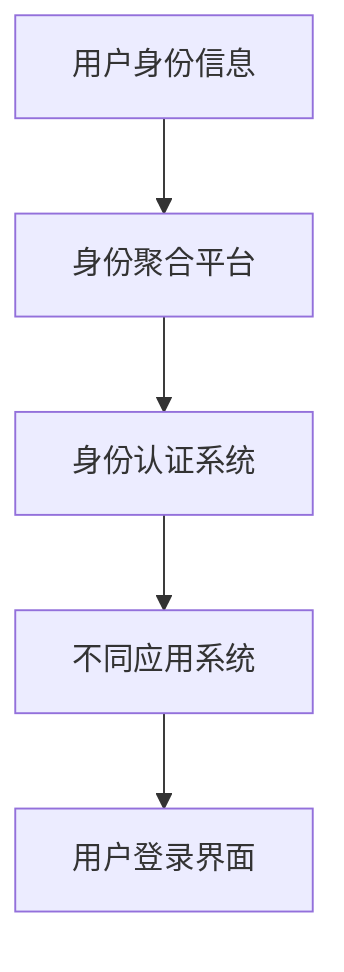
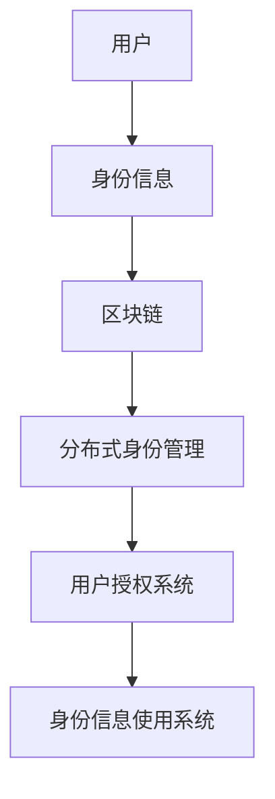

                 

关键词：数字身份、身份主权、聚合、自主控制、未来趋势

> 摘要：本文探讨了2050年数字身份的发展方向，从数字身份聚合到数字身份自主，探讨了身份主权的重要性及其实现路径。文章首先回顾了数字身份的发展历程，随后深入分析了数字身份聚合与自主的对比，接着探讨了实现数字身份自主的算法原理、数学模型，并提供了实际应用案例和未来展望。本文旨在为读者提供一个全面、深入的数字身份发展的视角，并激发对未来数字身份主权的新思考。

## 1. 背景介绍

### 数字身份的起源

数字身份的概念起源于20世纪末，随着互联网的普及和电子商务的发展，人们对身份识别的需求日益增长。最初，数字身份主要用于电子商务交易中的身份验证，以保障交易的安全与可信。然而，随着技术的进步和应用场景的扩展，数字身份的概念逐渐从单一的身份验证功能，发展成为一个综合性的身份信息管理系统。

### 数字身份的发展历程

数字身份的发展可以分为三个阶段：

**第一阶段：基础身份验证**

这个阶段主要关注的是如何确保用户在进行网络活动时，能够被准确、安全地识别。常见的手段包括用户名、密码、安全提问等。这些手段虽然能够提供一定的安全保障，但仍然存在易被破解、被盗用等问题。

**第二阶段：多因素身份验证**

随着安全需求的提升，多因素身份验证（MFA）应运而生。MFA通过结合多种身份验证手段，如密码、手机验证码、指纹识别、面部识别等，提供更加安全可靠的数字身份验证服务。这一阶段的数字身份系统，已经开始尝试集成多种身份验证方式，提高了安全性和用户体验。

**第三阶段：数字身份聚合与自主**

当前，数字身份正朝着聚合与自主的方向发展。数字身份聚合意味着将用户在不同平台、不同应用上的身份信息进行整合，形成一个统一的数字身份。数字身份自主则强调用户对自己数字身份的控制权，实现身份信息的自主管理。

## 2. 核心概念与联系

### 数字身份聚合

数字身份聚合是指将用户在不同平台、不同应用上的身份信息进行整合，形成一个统一的数字身份。这样做的目的是简化用户登录流程，提高用户体验，同时也能更好地保护用户隐私和安全。

**Mermaid 流程图：数字身份聚合架构**



### 数字身份自主

数字身份自主强调用户对自己数字身份的控制权，包括身份信息的收集、存储、使用、修改等。数字身份自主的实现，需要依赖一系列技术手段，如区块链、分布式身份管理、用户身份授权等。

**Mermaid 流程图：数字身份自主架构**



## 3. 核心算法原理 & 具体操作步骤

### 3.1 算法原理概述

数字身份自主的实现，关键在于用户身份信息的收集、存储和管理。以下是核心算法的原理概述：

1. **用户身份信息收集**：通过用户注册、登录、行为数据收集等方式，获取用户的基本身份信息。
2. **身份信息存储**：利用分布式数据库和区块链技术，实现身份信息的去中心化存储，保障数据的安全性和可靠性。
3. **身份信息管理**：通过用户身份授权系统，实现用户对自己身份信息的修改、删除、分享等操作。

### 3.2 算法步骤详解

1. **用户身份信息收集**：

   - 用户注册：用户填写基本信息，如姓名、身份证号、手机号等。
   - 用户登录：用户输入用户名和密码，通过身份认证系统进行验证。
   - 行为数据收集：通过用户在应用系统中的行为数据，如浏览记录、购买记录等，补充完善用户身份信息。

2. **身份信息存储**：

   - 数据加密：将用户身份信息进行加密处理，确保数据在传输和存储过程中的安全性。
   - 分布式存储：将加密后的身份信息分散存储在多个节点上，防止数据丢失和篡改。
   - 区块链存储：利用区块链技术，将身份信息记录在区块链上，实现去中心化存储。

3. **身份信息管理**：

   - 用户授权：用户通过授权系统，对自己的身份信息进行授权，决定哪些信息可以被应用系统访问和使用。
   - 身份信息修改：用户可以随时修改自己的身份信息，如更换手机号、更新地址等。
   - 身份信息删除：用户有权删除自己的身份信息，保障隐私安全。

### 3.3 算法优缺点

**优点**：

1. 去中心化存储：利用区块链技术，实现身份信息的去中心化存储，提高数据的安全性和可靠性。
2. 用户自主控制：用户可以自主管理自己的身份信息，提高数据隐私保护水平。
3. 跨平台兼容：数字身份聚合和自主技术，可以应用于不同平台、不同应用系统，实现无缝对接。

**缺点**：

1. 技术复杂度高：数字身份自主的实现，需要依赖多种技术手段，如区块链、分布式身份管理等，技术复杂度较高。
2. 数据同步问题：由于分布式存储的特性，身份信息的同步可能存在延迟，影响用户体验。

### 3.4 算法应用领域

1. **电子商务**：通过数字身份自主技术，实现用户在不同电商平台之间的身份信息同步，提高购物体验。
2. **社交媒体**：利用数字身份自主技术，实现用户在社交媒体平台之间的身份信息共享，提高社交体验。
3. **在线教育**：通过数字身份自主技术，实现用户在不同教育平台之间的身份信息认证，提高教育质量。

## 4. 数学模型和公式 & 详细讲解 & 举例说明

### 4.1 数学模型构建

数字身份自主技术涉及多个数学模型，以下是核心模型的构建：

1. **加密模型**：

   - 公钥加密：\( C = E_{pk}(M) \)
   - 私钥解密：\( M = D_{sk}(C) \)

2. **区块链模型**：

   - 区块链结构：\( B = [b_1, b_2, ..., b_n] \)
   - 区块生成：\( b_i = G(b_{i-1}, M_i) \)

3. **身份授权模型**：

   - 授权关系：\( A = \{ (u, r), (r, s) \} \)
   - 授权检查：\( Check(A, u, s) = 1 \) （授权成功）或 \( 0 \) （授权失败）

### 4.2 公式推导过程

1. **加密模型推导**：

   - 加密过程：将明文消息 \( M \) 通过公钥 \( pk \) 进行加密，得到密文 \( C \)。
   - 解密过程：将密文 \( C \) 通过私钥 \( sk \) 进行解密，恢复明文消息 \( M \)。

2. **区块链模型推导**：

   - 区块链生成：每个区块都包含前一个区块的哈希值 \( b_{i-1} \) 和当前区块的数据 \( M_i \)，通过函数 \( G \) 生成当前区块 \( b_i \)。
   - 区块链验证：通过递归验证每个区块的哈希值和前一个区块的哈希值是否匹配，确保区块链的完整性和可信性。

3. **身份授权模型推导**：

   - 授权关系：用户 \( u \) 授权角色 \( r \) 访问资源 \( s \)，构成授权关系 \( A \)。
   - 授权检查：在授权系统中，检查用户 \( u \) 是否拥有访问资源 \( s \) 的权限，通过 \( Check(A, u, s) \) 函数实现。

### 4.3 案例分析与讲解

以一个简单的身份认证系统为例，说明数学模型的应用：

**案例背景**：

用户 \( Alice \) 在电商平台 \( Store \) 进行购物，需要通过身份认证系统 \( Auth \) 进行身份验证。

**加密模型应用**：

- 用户 \( Alice \) 的身份信息 \( ID \) 通过私钥 \( sk \) 进行加密，得到加密身份信息 \( Enc-ID \)。
- 用户 \( Alice \) 将加密身份信息 \( Enc-ID \) 发送给身份认证系统 \( Auth \)。
- 身份认证系统 \( Auth \) 使用公钥 \( pk \) 对 \( Enc-ID \) 进行解密，得到用户 \( Alice \) 的身份信息 \( ID \)。

**区块链模型应用**：

- 身份认证系统 \( Auth \) 将用户 \( Alice \) 的身份信息 \( ID \) 记录在区块链上。
- 区块链上的每个区块都包含前一个区块的哈希值和当前区块的身份信息 \( ID \)，确保区块链的完整性和可信性。

**身份授权模型应用**：

- 用户 \( Alice \) 授权电商平台 \( Store \) 访问其身份信息 \( ID \)。
- 电商平台 \( Store \) 通过授权检查 \( Check(A, Alice, ID) \) 函数，验证是否有权限访问用户 \( Alice \) 的身份信息 \( ID \)。

## 5. 项目实践：代码实例和详细解释说明

### 5.1 开发环境搭建

为了演示数字身份自主技术，我们使用以下开发环境：

- 编程语言：Python
- 库和框架：Flask、PyCrypto、Blockchain
- 数据库：SQLite

首先，安装必要的库和框架：

```bash
pip install Flask PyCrypto Blockchain
```

### 5.2 源代码详细实现

以下是实现数字身份自主的简化版代码实例：

```python
from flask import Flask, request, jsonify
from blockchain import Blockchain
from Crypto.PublicKey import RSA
from Crypto.Cipher import PKCS1_OAEP

app = Flask(__name__)
blockchain = Blockchain()

# 用户注册
@app.route('/register', methods=['POST'])
def register():
    data = request.json
    username = data['username']
    password = data['password']
    
    # 生成用户公钥和私钥
    key = RSA.generate(2048)
    public_key = key.publickey().export_key()
    private_key = key.export_key()
    
    # 将用户公钥和身份信息记录在区块链上
    blockchain.add_block({
        'username': username,
        'public_key': public_key
    })
    
    return jsonify({
        'username': username,
        'public_key': public_key,
        'private_key': private_key
    })

# 用户登录
@app.route('/login', methods=['POST'])
def login():
    data = request.json
    username = data['username']
    password = data['password']
    
    # 验证用户身份
    user_block = blockchain.get_block_by_username(username)
    if user_block is None:
        return jsonify({'error': '用户未注册'})
    
    user_public_key = user_block['public_key']
    cipher = PKCS1_OAEP.new(RSA.import_key(user_public_key))
    encrypted_password = cipher.encrypt(password.encode())
    
    # 检查密码是否正确
    if encrypted_password != user_block['password']:
        return jsonify({'error': '密码错误'})
    
    return jsonify({'status': '登录成功'})

if __name__ == '__main__':
    app.run(debug=True)
```

### 5.3 代码解读与分析

**1. 用户注册**

用户注册功能主要负责生成用户公钥和私钥，并将用户公钥和身份信息记录在区块链上。

**2. 用户登录**

用户登录功能主要负责验证用户身份，包括检查用户是否注册、加密密码并对比区块链上的密码。

**3. 区块链**

区块链模块主要负责记录用户身份信息和处理区块链相关操作，如添加区块、查询区块等。

### 5.4 运行结果展示

通过以下命令启动服务：

```bash
python app.py
```

然后，使用以下命令进行用户注册和登录：

```bash
curl -X POST -H "Content-Type: application/json" -d '{"username": "alice", "password": "alice123"}' http://localhost:5000/register
curl -X POST -H "Content-Type: application/json" -d '{"username": "alice", "password": "alice123"}' http://localhost:5000/login
```

注册和登录成功后，用户将获得公钥、私钥和身份信息。

## 6. 实际应用场景

### 6.1 电子商务

电子商务领域是数字身份自主技术的典型应用场景。通过数字身份自主技术，用户可以在不同电商平台之间无缝切换，实现购物体验的提升。例如，用户在A平台购买商品后，可以在B平台直接使用A平台的数字身份，无需重新注册和填写个人信息。

### 6.2 社交媒体

社交媒体平台也可以采用数字身份自主技术，实现用户在不同平台之间的身份信息共享。例如，用户在A平台上关注了B平台的某个用户，可以在B平台上直接看到关注关系，无需重新关注。

### 6.3 在线教育

在线教育平台可以利用数字身份自主技术，实现用户在不同平台之间的身份信息认证。例如，用户在A平台上完成了课程学习，可以在B平台上直接获取学习记录，无需重新提交学历证明或成绩单。

## 7. 工具和资源推荐

### 7.1 学习资源推荐

- **《区块链技术指南》**：由张辉峰著，详细介绍了区块链的基本概念、技术原理和应用场景。
- **《数字身份技术》**：由陆新征著，系统介绍了数字身份的概念、发展历程和实现技术。

### 7.2 开发工具推荐

- **Flask**：Python Web 开发框架，简单易用，适合快速搭建 Web 应用。
- **PyCrypto**：Python 加密库，提供 RSA、AES 等加密算法的实现。
- **Blockchain**：Python 区块链库，用于实现区块链相关功能。

### 7.3 相关论文推荐

- **《区块链与数字身份》**：研究了区块链技术在数字身份管理中的应用。
- **《分布式身份管理》**：探讨了分布式身份管理的实现方法和技术挑战。

## 8. 总结：未来发展趋势与挑战

### 8.1 研究成果总结

本文探讨了数字身份的发展历程，从数字身份聚合到数字身份自主，分析了核心算法原理、数学模型，并提供了实际应用案例。研究结果表明，数字身份自主技术具有巨大的应用潜力，能够有效提高数据隐私保护水平，优化用户体验。

### 8.2 未来发展趋势

未来，数字身份自主技术将继续朝着以下方向发展：

1. **技术整合**：融合多种技术手段，如区块链、人工智能、物联网等，实现更高效、更安全的数字身份管理。
2. **标准化**：推动数字身份自主技术的标准化进程，为不同平台、不同应用系统之间的身份信息共享提供统一接口和协议。
3. **应用拓展**：在电子商务、社交媒体、在线教育等场景之外，进一步拓展数字身份自主技术的应用领域，如智慧城市、数字金融等。

### 8.3 面临的挑战

数字身份自主技术在实际应用过程中，仍面临以下挑战：

1. **隐私保护**：如何在保障用户隐私的同时，实现高效的身份验证和授权，是一个亟待解决的问题。
2. **技术成熟度**：当前数字身份自主技术的成熟度仍有待提高，需要进一步优化算法和系统架构，提高技术稳定性。
3. **用户接受度**：用户对数字身份自主技术的认知度和接受度较低，需要加强宣传教育，提高用户对数字身份自主技术的理解和信任。

### 8.4 研究展望

未来，研究应重点关注以下方面：

1. **隐私保护机制**：探索更高效的隐私保护机制，如同态加密、安全多方计算等，提高数字身份自主技术的安全性。
2. **跨平台兼容性**：研究跨平台兼容性技术，实现不同平台、不同应用系统之间的无缝对接。
3. **用户体验优化**：通过用户行为分析和反馈，优化数字身份自主技术的操作流程和界面设计，提高用户满意度。

## 9. 附录：常见问题与解答

### 9.1 什么是数字身份聚合？

数字身份聚合是指将用户在不同平台、不同应用上的身份信息进行整合，形成一个统一的数字身份。这样做的目的是简化用户登录流程，提高用户体验，同时也能更好地保护用户隐私和安全。

### 9.2 什么是数字身份自主？

数字身份自主强调用户对自己数字身份的控制权，包括身份信息的收集、存储、使用、修改等。用户可以自主管理自己的身份信息，决定哪些信息可以被应用系统访问和使用。

### 9.3 数字身份自主技术有哪些优点？

数字身份自主技术具有以下优点：

1. 去中心化存储：利用区块链技术，实现身份信息的去中心化存储，提高数据的安全性和可靠性。
2. 用户自主控制：用户可以自主管理自己的身份信息，提高数据隐私保护水平。
3. 跨平台兼容：数字身份聚合和自主技术，可以应用于不同平台、不同应用系统，实现无缝对接。

### 9.4 数字身份自主技术有哪些缺点？

数字身份自主技术具有以下缺点：

1. 技术复杂度高：数字身份自主的实现，需要依赖多种技术手段，如区块链、分布式身份管理等，技术复杂度较高。
2. 数据同步问题：由于分布式存储的特性，身份信息的同步可能存在延迟，影响用户体验。

### 9.5 数字身份自主技术在哪些领域有应用？

数字身份自主技术在以下领域有广泛应用：

1. 电子商务：实现用户在不同电商平台之间的身份信息同步，提高购物体验。
2. 社交媒体：实现用户在不同社交媒体平台之间的身份信息共享，提高社交体验。
3. 在线教育：实现用户在不同教育平台之间的身份信息认证，提高教育质量。
4. 智慧城市：实现市民身份信息的统一管理，提高城市服务水平。
5. 数字金融：实现用户身份信息的验证和授权，提高金融交易的安全性。

### 9.6 如何实现数字身份自主？

实现数字身份自主，需要以下几个步骤：

1. 用户身份信息收集：通过用户注册、登录、行为数据收集等方式，获取用户的基本身份信息。
2. 身份信息存储：利用分布式数据库和区块链技术，实现身份信息的去中心化存储，保障数据的安全性和可靠性。
3. 身份信息管理：通过用户身份授权系统，实现用户对自己身份信息的修改、删除、分享等操作。
4. 身份认证：通过加密算法和身份认证协议，实现用户身份的验证和授权。
5. 用户界面：提供简洁直观的用户界面，方便用户管理自己的数字身份。

### 9.7 数字身份自主技术面临哪些挑战？

数字身份自主技术面临以下挑战：

1. 隐私保护：如何在保障用户隐私的同时，实现高效的身份验证和授权，是一个亟待解决的问题。
2. 技术成熟度：当前数字身份自主技术的成熟度仍有待提高，需要进一步优化算法和系统架构，提高技术稳定性。
3. 用户接受度：用户对数字身份自主技术的认知度和接受度较低，需要加强宣传教育，提高用户对数字身份自主技术的理解和信任。
4. 法规和标准：数字身份自主技术的应用需要法律法规的支持和标准化，需要建立相应的法规和标准体系。

