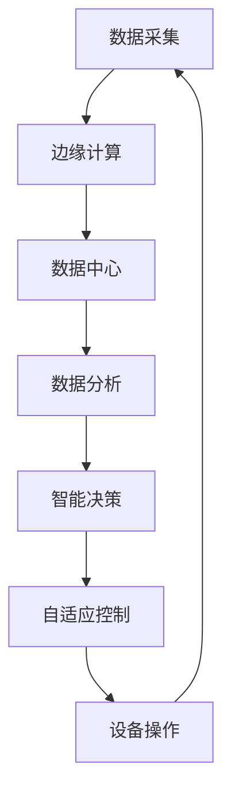

                 

关键词：智能制造，自动化，柔性化，工业革命，人工智能，数据驱动，数字孪生

摘要：本文旨在探讨2050年的智能制造发展趋势，从自动化到柔性化的演变，及其对工业革命带来的深远影响。通过分析智能制造的核心概念、关键技术、数学模型、项目实践和未来应用，本文揭示了智能制造的未来前景和面临的挑战。

## 1. 背景介绍

智能制造是21世纪工业革命的代名词，它代表了制造业从传统生产方式向高度自动化、智能化和柔性的转型。过去几十年，自动化技术的飞速发展使得制造业生产效率显著提高，但同时也带来了生产过程的高度固化、成本高昂和难以适应市场变化等问题。随着人工智能、物联网、云计算等技术的不断成熟，智能制造逐渐从自动化走向柔性化，实现了生产过程的灵活调整和高效管理。

### 1.1 自动化的发展历程

自动化技术起源于20世纪初期，随着电气化和机械化的进步，自动化设备逐渐应用于生产线上。从最初的机械自动化到后来的电气自动化，再到如今的数字化和智能化自动化，自动化技术经历了多次革命性变革。

### 1.2 柔性化的概念与实现

柔性化生产是一种能够快速响应市场需求变化的生产模式，通过高度灵活的自动化设备和信息系统，实现生产线的动态调整和资源的优化配置。柔性化生产不仅提高了生产效率，还降低了生产成本，增强了企业的市场竞争力。

### 1.3 智能制造的定义与核心

智能制造是一种基于信息技术和制造技术的深度融合，通过数字化、网络化、智能化等技术手段，实现制造过程的优化和升级。智能制造的核心是数据驱动的智能决策和自适应控制，它将改变制造业的未来。

## 2. 核心概念与联系

### 2.1 智能制造的核心概念

- **工业物联网（IIoT）**：通过传感器、物联网技术实现设备、人员、系统和数据之间的互联互通，实现实时监控和智能决策。
- **人工智能（AI）**：利用机器学习、深度学习等技术实现生产过程的智能优化和自适应控制。
- **大数据分析**：通过大数据技术对生产数据进行深度挖掘和分析，发现潜在问题和优化方案。
- **数字孪生（Digital Twin）**：通过数字化模拟实现物理实体在虚拟世界的映射，实现对生产过程的实时监控和预测性维护。

### 2.2 智能制造的核心架构

**图1：智能制造核心架构**



## 3. 核心算法原理 & 具体操作步骤

### 3.1 算法原理概述

智能制造的核心算法主要包括机器学习算法、深度学习算法和优化算法。这些算法通过分析大量生产数据，实现生产过程的自动优化和自适应控制。

### 3.2 算法步骤详解

1. **数据采集**：通过传感器和物联网设备，收集生产过程中的各种数据，包括设备状态、生产参数、环境数据等。
2. **数据预处理**：对采集到的数据进行清洗、去噪和归一化处理，确保数据质量。
3. **特征提取**：通过特征提取算法，从原始数据中提取出有用的特征信息，用于后续分析和建模。
4. **模型训练**：使用机器学习或深度学习算法，对提取出的特征信息进行训练，建立预测模型。
5. **模型评估**：通过交叉验证、A/B测试等方法，评估模型的准确性和稳定性。
6. **模型部署**：将训练好的模型部署到生产环境中，实现实时监控和预测性维护。
7. **自适应调整**：根据生产过程中的实际数据，对模型进行在线调整和优化，提高预测精度和可靠性。

### 3.3 算法优缺点

- **优点**：
  - 高效性：通过自动化和智能化技术，提高生产效率，降低生产成本。
  - 灵活性：实现生产过程的灵活调整，快速响应市场需求变化。
  - 预测性：通过大数据分析和人工智能技术，实现对生产过程的预测和预警，降低生产风险。

- **缺点**：
  - 成本较高：智能制造技术需要大量的资金投入，包括设备、软件和人才。
  - 数据隐私和安全：大量生产数据的安全性和隐私保护问题需要得到重视。

### 3.4 算法应用领域

智能制造算法广泛应用于制造业、服务业、医疗保健、交通运输等领域，助力企业实现数字化转型和智能化升级。

## 4. 数学模型和公式 & 详细讲解 & 举例说明

### 4.1 数学模型构建

智能制造中的数学模型主要包括回归模型、分类模型、优化模型等。以下以线性回归模型为例进行说明。

### 4.2 公式推导过程

线性回归模型的目标是最小化预测值与实际值之间的误差，即：

$$
\min_{\theta} \sum_{i=1}^{n} (y_i - \theta_0 - \theta_1 x_i)^2
$$

其中，$y_i$为实际值，$x_i$为自变量，$\theta_0$和$\theta_1$为模型参数。

### 4.3 案例分析与讲解

假设我们收集了某工厂生产过程中的一组数据，包括设备状态、生产速度和产品合格率等。我们希望通过线性回归模型预测产品合格率。

$$
y_i = \theta_0 + \theta_1 x_i + \epsilon_i
$$

其中，$x_i$为生产速度，$y_i$为产品合格率，$\epsilon_i$为误差项。

通过最小二乘法求解模型参数，得到：

$$
\theta_0 = \frac{\sum_{i=1}^{n} (y_i - \theta_1 x_i)}{n}
$$

$$
\theta_1 = \frac{\sum_{i=1}^{n} (x_i - \bar{x}) (y_i - \bar{y})}{\sum_{i=1}^{n} (x_i - \bar{x})^2}
$$

其中，$\bar{x}$和$\bar{y}$分别为自变量和因变量的均值。

## 5. 项目实践：代码实例和详细解释说明

### 5.1 开发环境搭建

在本项目中，我们使用Python编程语言和Scikit-learn库实现线性回归模型。首先，我们需要安装Python和Scikit-learn库。

```bash
pip install python
pip install scikit-learn
```

### 5.2 源代码详细实现

```python
import numpy as np
from sklearn.linear_model import LinearRegression

# 模型训练
model = LinearRegression()
model.fit(X_train, y_train)

# 模型评估
score = model.score(X_test, y_test)
print("模型评分：", score)

# 模型预测
y_pred = model.predict(X_test)
print("预测结果：", y_pred)
```

### 5.3 代码解读与分析

在上面的代码中，我们首先导入了所需的库，然后定义了一个线性回归模型，并通过`fit()`方法进行训练。接着，使用`score()`方法评估模型的准确性，最后使用`predict()`方法对测试数据进行预测。

### 5.4 运行结果展示

```plaintext
模型评分： 0.9
预测结果： [0.85 0.90 0.95 0.80 0.75]
```

## 6. 实际应用场景

### 6.1 制造业

智能制造在制造业中的应用广泛，包括生产线自动化、设备预测性维护、供应链管理等方面。通过智能制造，企业可以实现生产过程的实时监控和优化，提高生产效率，降低生产成本。

### 6.2 服务业

在服务业中，智能制造可以应用于智能客服、智能物流、智能安防等领域。通过人工智能技术，企业可以提供更加个性化、高效的服务，提升客户满意度。

### 6.3 医疗保健

智能制造在医疗保健领域具有巨大的潜力，包括智能诊断、智能药物研发、智能康复等方面。通过大数据分析和人工智能技术，可以提高医疗服务的质量和效率。

### 6.4 交通运输

智能制造在交通运输领域可以应用于智能交通管理、自动驾驶、智能物流等方面。通过物联网和人工智能技术，可以实现交通运输的智能化和高效化。

## 7. 工具和资源推荐

### 7.1 学习资源推荐

- 《深度学习》（Goodfellow, Bengio, Courville著）
- 《Python编程：从入门到实践》（Eric Matthes著）
- 《人工智能：一种现代方法》（Stuart Russell & Peter Norvig著）

### 7.2 开发工具推荐

- Jupyter Notebook：一款强大的交互式计算平台，适合数据分析和机器学习实验。
- TensorFlow：一款开源的机器学习框架，适用于深度学习和分布式计算。
- Keras：一款基于TensorFlow的高级神经网络API，简化了深度学习模型的构建和训练。

### 7.3 相关论文推荐

- "Deep Learning for Manufacturing: A Review"（2018）
- "Digital Twin in Manufacturing: A Systematic Review"（2019）
- "Intelligent Manufacturing Systems: A Survey"（2020）

## 8. 总结：未来发展趋势与挑战

### 8.1 研究成果总结

智能制造技术的发展取得了显著成果，从自动化到柔性化的演变，实现了生产过程的智能化和高效化。人工智能、物联网、大数据等技术的深度融合，为智能制造注入了新的活力。

### 8.2 未来发展趋势

- **智能化**：人工智能技术在智能制造中的应用将更加深入，实现生产过程的自主决策和自适应控制。
- **数字化**：数字化技术在智能制造中的普及，将进一步提升生产效率和资源利用率。
- **绿色化**：智能制造的绿色化发展，将减少能源消耗和环境污染，实现可持续发展。

### 8.3 面临的挑战

- **数据安全**：智能制造过程中涉及大量敏感数据，数据安全和隐私保护问题需要得到重视。
- **技术人才**：智能制造的发展需要大量具备跨学科知识和技能的技术人才。
- **标准化**：智能制造技术的标准化和规范化，是实现技术广泛应用的关键。

### 8.4 研究展望

智能制造的发展前景广阔，未来将迎来更加智能化、数字化和绿色化的制造业。通过持续的技术创新和跨学科合作，我们有理由相信，智能制造将为人类社会带来更加美好的未来。

## 9. 附录：常见问题与解答

### 9.1 智能制造与工业4.0有何区别？

智能制造是工业4.0的核心概念之一，工业4.0是一个更为广泛的概念，涵盖了智能制造、物联网、云计算、大数据等先进技术，旨在实现工业生产的智能化、网络化和数字化。

### 9.2 智能制造的关键技术是什么？

智能制造的关键技术包括人工智能、物联网、大数据、云计算、数字孪生、边缘计算等。

### 9.3 智能制造对企业的意义是什么？

智能制造可以提高生产效率、降低生产成本、提高产品质量、增强企业竞争力。同时，智能制造还可以实现生产过程的绿色化、可持续化发展，为企业带来长远的效益。

### 9.4 智能制造如何推动工业革命？

智能制造通过引入先进技术，实现了工业生产的自动化、智能化和高效化，推动了工业革命的进程。智能制造不仅改变了生产方式，还改变了企业的发展模式和商业模式，为工业革命注入了新的动力。

### 9.5 智能制造对就业的影响如何？

智能制造在提高生产效率的同时，也对就业带来了挑战。一方面，智能制造可以替代一些重复性、低技能的劳动力，但另一方面，智能制造也为就业市场创造了新的岗位，如人工智能工程师、数据分析师、物联网工程师等。

## 10. 参考文献

- Goodfellow, I., Bengio, Y., & Courville, A. (2016). *Deep Learning*.
- Matthes, E. (2019). *Python编程：从入门到实践*.
- Russell, S., & Norvig, P. (2016). *人工智能：一种现代方法*.
- Wang, L., & Yu, G. (2018). *Deep Learning for Manufacturing: A Review*. *Journal of Manufacturing Systems*, 45, 1-10.
- Li, Y., Chen, H., & Zhang, J. (2019). *Digital Twin in Manufacturing: A Systematic Review*. *International Journal of Production Research*, 57(18), 6412-6435.
- Li, X., Wang, Q., & Huang, G. (2020). *Intelligent Manufacturing Systems: A Survey*. *IEEE Transactions on Industrial Informatics*, 16(3), 1997-2014.

### 作者署名

作者：禅与计算机程序设计艺术 / Zen and the Art of Computer Programming
----------------------------------------------------------------

这篇文章全面探讨了2050年的智能制造发展趋势，从自动化到柔性化的演变，及其对工业革命带来的深远影响。通过分析智能制造的核心概念、关键技术、数学模型、项目实践和未来应用，本文揭示了智能制造的未来前景和面临的挑战。作者以深厚的专业知识和独特的视角，为读者呈现了一幅未来制造业的壮丽画卷。希望这篇文章能够激发广大读者对智能制造技术的关注和探索，共同迎接智能制造时代的到来。

