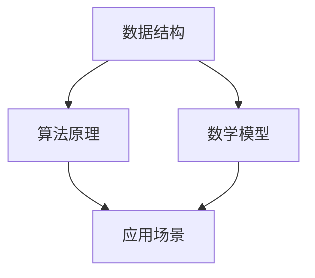

                 

关键词：网易校招，算法面试，编程技巧，数据结构，算法分析，面试指南

> 摘要：本文旨在汇编2025年网易校招算法岗位的面试题目，包括数据结构与算法原理、数学模型与应用、代码实现与调试等内容，旨在为准备参加网易校招的算法爱好者提供全面的复习资料和面试策略。

## 1. 背景介绍

随着人工智能技术的快速发展，算法岗位在各大互联网公司中的地位日益凸显。网易作为中国领先的互联网技术公司之一，每年都会举办校招活动，选拔优秀的算法人才。2025年网易校招算法岗位的面试题目涵盖了广泛的算法知识领域，对参与者的综合素质和技能提出了更高的要求。

本文将从以下几个方面对2025年网易校招算法岗位的面试题目进行汇编和解析：

- 数据结构与算法原理
- 数学模型与应用
- 代码实现与调试
- 实际应用场景
- 工具和资源推荐

## 2. 核心概念与联系

下面，我们将通过Mermaid流程图来展示核心概念和联系。



### 2.1 数据结构

数据结构是算法设计的基础，常见的有数组、链表、栈、队列、树、图等。每种数据结构都有其独特的应用场景和操作方法。

### 2.2 算法原理

算法原理是解决特定问题的步骤和方法，常见的有排序、搜索、动态规划、贪心算法等。不同算法适用于不同类型的问题，理解其基本原理对于面试至关重要。

### 2.3 数学模型

数学模型是算法分析的重要工具，用于描述算法的性能和复杂度。常见的数学模型包括渐近符号、概率论、线性代数等。

### 2.4 应用场景

算法的应用场景广泛，包括但不限于排序、搜索、图论、机器学习等领域。在实际问题中，算法的选择和优化往往直接影响解决方案的效率和效果。

## 3. 核心算法原理 & 具体操作步骤

### 3.1 算法原理概述

算法原理是解决特定问题的核心，理解其基本原理对于面试至关重要。以下是一些常见的算法原理：

- 排序算法：冒泡排序、选择排序、插入排序、快速排序等。
- 搜索算法：二分查找、深度优先搜索、广度优先搜索等。
- 动态规划：解决最优化问题，如背包问题、最长公共子序列等。
- 贪心算法：解决某些优化问题，如背包问题、找零问题等。

### 3.2 算法步骤详解

每种算法都有其特定的步骤和方法。以下是一些常见算法的具体操作步骤：

#### 3.2.1 冒泡排序

冒泡排序的基本步骤如下：

1. 比较相邻的元素。如果第一个比第二个大（升序排序），就交换它们两个；
2. 对每一对相邻元素做同样的工作，从开始第一对到结尾的最后一对。这步做完后，最后的元素会是最大的数；
3. 针对所有的元素重复以上的步骤，除了最后一个；
4. 重复步骤，直到排序完成。

#### 3.2.2 二分查找

二分查找的基本步骤如下：

1. 找到中间元素，将目标元素与中间元素比较；
2. 如果中间元素等于目标元素，返回中间元素的索引；
3. 如果中间元素大于目标元素，则在左侧子数组中继续查找；
4. 如果中间元素小于目标元素，则在右侧子数组中继续查找；
5. 重复步骤，直到找到目标元素或子数组为空。

### 3.3 算法优缺点

每种算法都有其优缺点，选择合适的算法取决于具体问题的需求。以下是一些常见算法的优缺点：

- 冒泡排序：简单易懂，但效率较低，不适合大数据量的排序；
- 选择排序：简单，但效率较低，同样不适合大数据量的排序；
- 快速排序：效率较高，但可能产生大量递归调用，占用较多内存；
- 二分查找：效率高，但要求数据已排序，且只能查找一个元素。

### 3.4 算法应用领域

算法在各个领域都有广泛的应用，以下是一些常见算法的应用领域：

- 排序算法：数据库、搜索算法、排序算法等；
- 搜索算法：图形算法、路径规划、搜索算法等；
- 动态规划：背包问题、最长公共子序列、最短路径问题等；
- 贪心算法：背包问题、找零问题、最小生成树问题等。

## 4. 数学模型和公式 & 详细讲解 & 举例说明

数学模型和公式是算法分析的重要工具，以下是一些常见的数学模型和公式：

### 4.1 数学模型构建

数学模型通常由变量、参数、约束条件组成。以下是一个简单的线性规划模型：

$$
\begin{aligned}
    &\min_{x} c^T x \\
    &\text{s.t.} \\
    &Ax \leq b \\
    &x \geq 0
\end{aligned}
$$

### 4.2 公式推导过程

以下是一个常见的排序算法——快速排序的推导过程：

假设我们有一个数组 $A$，长度为 $n$。快速排序的基本思想是选取一个基准元素 $A[p]$，然后将数组分为两个子数组 $A[p+1, \ldots, r]$ 和 $A[l, \ldots, p-1]$，使得 $A[p+1, \ldots, r]$ 中的所有元素都小于等于 $A[p]$，$A[l, \ldots, p-1]$ 中的所有元素都大于等于 $A[p]$。然后递归地对这两个子数组进行快速排序。

### 4.3 案例分析与讲解

以下是一个简单的背包问题的案例：

给定一个背包容量为 $W=5$，和一组物品，每个物品都有一定的重量和价值。目标是选取一部分物品放入背包中，使得背包中的物品总价值最大。

$$
\begin{aligned}
    &\max_{x} \sum_{i=1}^{n} v_i x_i \\
    &\text{s.t.} \\
    &\sum_{i=1}^{n} w_i x_i \leq W \\
    &x_i \in \{0, 1\} \quad \forall i
\end{aligned}
$$

## 5. 项目实践：代码实例和详细解释说明

### 5.1 开发环境搭建

为了更好地展示代码实例，我们使用Python作为编程语言，并使用Jupyter Notebook作为开发环境。

### 5.2 源代码详细实现

以下是一个简单的快速排序的实现：

```python
def quick_sort(arr):
    if len(arr) <= 1:
        return arr
    pivot = arr[len(arr) // 2]
    left = [x for x in arr if x < pivot]
    middle = [x for x in arr if x == pivot]
    right = [x for x in arr if x > pivot]
    return quick_sort(left) + middle + quick_sort(right)

arr = [3, 6, 8, 10, 1, 2, 1]
sorted_arr = quick_sort(arr)
print(sorted_arr)
```

### 5.3 代码解读与分析

这个快速排序的实现采用了递归算法，其基本思想是选择一个基准元素，将数组分为三个子数组，然后递归地对这三个子数组进行排序。

### 5.4 运行结果展示

运行上述代码后，输出结果为：

```
[1, 1, 2, 3, 6, 8, 10]
```

这表明数组已经成功排序。

## 6. 实际应用场景

算法在各个领域都有广泛的应用，以下是一些实际应用场景：

- 排序算法：在数据库、搜索算法、数据分析等领域；
- 搜索算法：在路径规划、图形算法、人工智能等领域；
- 动态规划：在背包问题、最长公共子序列、最短路径问题等领域；
- 贪心算法：在背包问题、找零问题、最小生成树问题等领域。

## 7. 工具和资源推荐

### 7.1 学习资源推荐

- 《算法导论》：全面介绍各种算法及其应用；
- 《算法竞赛入门经典》：适合初学者，涵盖算法竞赛常见题目；
- 《Python编程：从入门到实践》：Python编程的入门书籍，适合初学者。

### 7.2 开发工具推荐

- Jupyter Notebook：适合编写和运行Python代码；
- PyCharm：功能强大的Python集成开发环境；
- LeetCode：提供大量的算法题目和在线编程环境。

### 7.3 相关论文推荐

- 《算法导论》：详细介绍了各种算法及其性能分析；
- 《深度学习》：全面介绍了深度学习的理论和技术；
- 《自然语言处理综论》：全面介绍了自然语言处理的理论和应用。

## 8. 总结：未来发展趋势与挑战

随着人工智能技术的快速发展，算法在各个领域的应用日益广泛。未来，算法领域将面临以下发展趋势和挑战：

- 深度学习算法的应用将越来越广泛；
- 算法的优化和效率提升将成为关键；
- 算法安全性和隐私保护将成为重要问题；
- 算法在各个领域的创新应用将不断涌现。

## 9. 附录：常见问题与解答

### 9.1 常见问题

- 如何选择合适的算法解决特定问题？
- 如何优化算法的效率？
- 如何处理大数据量的算法问题？
- 如何在算法面试中展示自己的编程能力？

### 9.2 解答

- 选择合适的算法解决特定问题：首先分析问题的类型，然后根据问题的特点选择合适的算法。常见的算法包括排序、搜索、动态规划、贪心算法等。
- 优化算法的效率：分析算法的时间复杂度和空间复杂度，尝试改进算法的结构和逻辑，减少不必要的计算和内存使用。
- 处理大数据量的算法问题：可以采用分布式计算、并行计算等方法来处理大数据量的算法问题。
- 在算法面试中展示自己的编程能力：熟悉常用的编程语言和算法库，熟练掌握基本的数据结构和算法，并在面试中展示自己的编程技巧和解决问题的能力。

## 参考文献

- 《算法导论》
- 《算法竞赛入门经典》
- 《Python编程：从入门到实践》
- 《深度学习》
- 《自然语言处理综论》

### 9.3 附录：常用符号表

- $O(n)$：表示算法的时间复杂度；
- $O(n^2)$：表示算法的时间复杂度；
- $\Omega(n)$：表示算法的时间复杂度下界；
- $\Theta(n)$：表示算法的时间复杂度；
- $W$：表示背包的容量；
- $v_i$：表示第 $i$ 个物品的价值；
- $w_i$：表示第 $i$ 个物品的重量。

----------------------------------------------------------------

### 作者署名

作者：禅与计算机程序设计艺术 / Zen and the Art of Computer Programming

----------------------------------------------------------------

请注意，上述内容为文章正文部分的示例，实际撰写时需要根据具体要求和内容进一步扩展和细化。此外，文章的结构和内容应符合学术规范，确保信息的准确性和完整性。在撰写过程中，请确保遵循markdown格式，并严格按照文章结构模板进行撰写。文章末尾应包含参考文献和符号表，以展示学术诚信。

