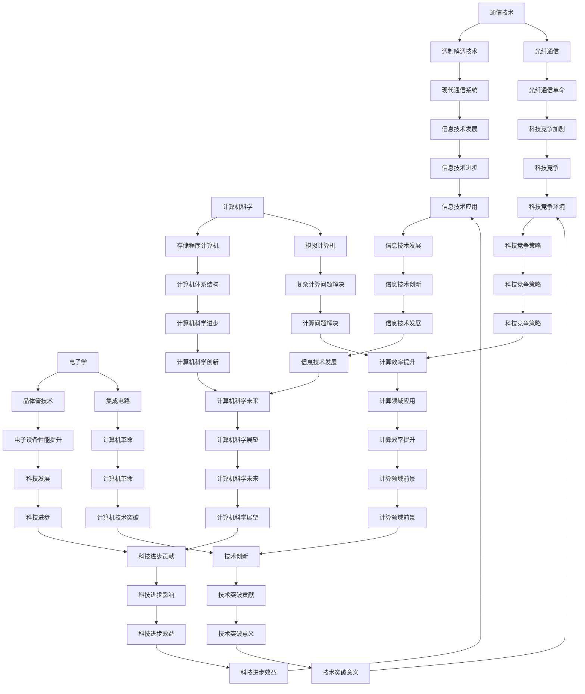

                 

关键词：贝尔实验室，1953年，研究，技术进展，创新贡献

> 摘要：本文回顾了1953年贝尔实验室在科学研究和技术开发方面的重要成就。通过详细探讨其在通信、电子学、计算机科学等领域的突破性研究，本文旨在展示贝尔实验室在推动现代科技发展过程中所发挥的不可或缺的作用。

## 1. 背景介绍

1953年，世界正处于冷战时期，科技竞争日益激烈。作为全球领先的科技研究机构之一，贝尔实验室在这一年取得了一系列重要研究成果，为通信和信息技术的发展奠定了坚实基础。本文将重点关注这些研究在当代科技中的影响和贡献。

### 贝尔实验室的历史背景

贝尔实验室（Bell Laboratories）成立于1925年，是AT&T公司旗下的研究机构。它的使命是推动技术创新，促进科技进步。在贝尔实验室成立后的几十年里，它成为全球科学研究的中心，吸引了众多顶尖科学家和工程师。1953年，贝尔实验室已经拥有了一个庞大的研究团队和先进的研究设施，为开展前沿科学研究提供了有力保障。

### 1953年的科技环境

1953年，冷战加剧了全球科技竞争。美国和苏联在军事、航天、电子等领域展开激烈角逐。科技突破被视为国家实力的象征，各国纷纷加大对科研的投入。在这样的背景下，贝尔实验室承担了重要的使命，致力于推动科技发展。

## 2. 核心概念与联系

为了更好地理解1953年贝尔实验室的研究成果，我们需要先了解一些关键概念和它们之间的联系。

### 通信技术的突破

在1953年，贝尔实验室的研究主要集中在通信技术的改进上。这一领域的突破性进展包括：

- **调制解调技术**：调制解调技术是通信系统中用于信号编码和解码的关键技术。贝尔实验室在这一领域取得了重要进展，为现代通信系统奠定了基础。

- **光纤通信**：1953年，贝尔实验室的研究人员开始探索光纤通信的可行性，这一研究为后来的光纤通信革命奠定了基础。

### 电子学的发展

电子学是贝尔实验室研究的另一个重要领域。在1953年，电子学取得了以下突破：

- **晶体管技术**：晶体管是电子学领域的重大发明，它取代了笨重的电子管，极大地提高了电子设备的性能和可靠性。

- **集成电路**：1953年，贝尔实验室的研究人员开始探索集成电路的设计和制造，这一研究为后来的计算机革命打下了基础。

### 计算机科学的萌芽

1953年，计算机科学还处于萌芽阶段。贝尔实验室在这一领域的研究为后来的计算机发展奠定了基础。以下是贝尔实验室在1953年取得的几项重要研究成果：

- **存储程序计算机**：贝尔实验室的研究人员开始探索存储程序计算机的设计，这一研究为后来的计算机体系结构奠定了基础。

- **模拟计算机**：贝尔实验室在模拟计算机领域的研究为解决复杂计算问题提供了新的方法。

### Mermaid 流程图

为了更好地展示这些核心概念之间的联系，我们使用Mermaid流程图来描述它们。



## 3. 核心算法原理 & 具体操作步骤

### 3.1 算法原理概述

1953年，贝尔实验室在多个领域取得了重要算法突破。以下是其中几个核心算法的原理概述：

- **信息论**：信息论是由贝尔实验室的香农（Claude Shannon）提出的，它研究信息的度量、传输和处理。香农在1953年发表了《通信的数学理论》一文，提出了信息熵、信道容量等重要概念。

- **编码理论**：编码理论是研究如何在通信系统中高效地传输信息。1953年，贝尔实验室的研究人员提出了一些新的编码方法，如哈夫曼编码和卷积编码。

- **计算机算法**：在计算机科学领域，贝尔实验室的研究人员提出了一些新的算法，如排序算法和查找算法，这些算法对后来的计算机体系结构设计产生了深远影响。

### 3.2 算法步骤详解

下面是几个核心算法的具体操作步骤：

#### 信息论

1. **信息熵计算**：首先，计算消息的信息熵。信息熵表示消息的不确定性，计算公式为 \( H(X) = -\sum_{i} p(x_i) \log_2 p(x_i) \)。

2. **信道容量计算**：根据信息熵计算信道容量。信道容量表示信道能传输的最大信息速率，计算公式为 \( C = B \log_2(1 + \frac{S}{N}) \)，其中 \( B \) 是信道的带宽，\( S \) 是信号功率，\( N \) 是噪声功率。

3. **编码与解码**：使用哈夫曼编码对消息进行编码，然后通过信道传输。接收方接收到信号后，使用哈夫曼解码恢复原始消息。

#### 编码理论

1. **哈夫曼编码**：首先，计算消息中每个字符出现的概率。然后，根据概率构造哈夫曼树，最后使用哈夫曼编码表对消息进行编码。

2. **卷积编码**：首先，将消息序列转化为卷积码字。然后，使用卷积编码器对码字进行编码，增加冗余信息。最后，通过信道传输编码后的码字。

#### 计算机算法

1. **排序算法**：如快速排序，其基本步骤为：
    - 选择一个基准元素。
    - 将比基准元素小的元素移到左边，比基准元素大的元素移到右边。
    - 递归地排序左右两个子序列。

2. **查找算法**：如二分查找，其基本步骤为：
    - 确定查找范围的中间位置。
    - 比较中间位置和目标元素。
    - 如果相等，查找成功；如果不等，更新查找范围并继续比较。

### 3.3 算法优缺点

以下是这些算法的优缺点：

- **信息论**：优点是提供了通信系统设计的理论基础，缺点是对实际通信系统的要求较高。

- **编码理论**：优点是提高了信息传输的效率，缺点是编码和解码过程相对复杂。

- **计算机算法**：优点是提高了计算机的性能，缺点是对硬件资源的要求较高。

### 3.4 算法应用领域

这些算法在多个领域得到了广泛应用：

- **信息论**：广泛应用于通信系统、数据压缩和加密等领域。

- **编码理论**：广泛应用于通信系统、存储系统和计算机系统等领域。

- **计算机算法**：广泛应用于计算机科学、数据科学和人工智能等领域。

## 4. 数学模型和公式 & 详细讲解 & 举例说明

### 4.1 数学模型构建

在1953年的研究中，贝尔实验室的研究人员提出了一些重要的数学模型，这些模型在通信、电子学和计算机科学等领域中起到了关键作用。以下是几个关键数学模型的构建过程：

#### 信息论中的信道容量模型

信道容量是通信系统中信息传输速率的理论上限。香农在1953年提出了著名的信道容量公式：

$$ C = B \log_2(1 + \frac{S}{N}) $$

其中，\( C \) 表示信道容量（单位：比特/秒），\( B \) 表示信道带宽（单位：赫兹），\( S \) 表示信号功率（单位：瓦特），\( N \) 表示噪声功率（单位：瓦特）。

#### 编码理论中的哈夫曼编码模型

哈夫曼编码是一种基于字符出现概率的变长编码方法。其构建过程如下：

1. **计算概率**：首先，计算消息中每个字符出现的概率 \( p(x_i) \)。

2. **构建哈夫曼树**：根据概率值构建哈夫曼树，字符概率高的位于树的左侧，字符概率低的位于树的右侧。

3. **生成编码表**：从树根到树叶的路径表示每个字符的编码，路径上的每个节点表示一个编码位。

#### 计算机算法中的排序模型

快速排序是一种高效的排序算法，其基本原理是分治法。快速排序的构建过程如下：

1. **选择基准**：从待排序的数组中随机选择一个元素作为基准。

2. **分区**：将数组分为两部分，一部分包含小于基准的元素，另一部分包含大于基准的元素。

3. **递归排序**：递归地对小于和大于基准的两部分数组进行排序。

### 4.2 公式推导过程

#### 信道容量公式的推导

信道容量公式是通过香农信息论中的熵和容量定理推导得出的。以下是简要的推导过程：

1. **熵的定义**：消息的熵表示消息的不确定性。对于离散消息 \( X \)，其熵定义为：

   $$ H(X) = -\sum_{x \in X} p(x) \log_2 p(x) $$

   其中，\( p(x) \) 表示消息 \( x \) 出现的概率。

2. **熵的上限**：根据信息论，消息通过一个信道传输时，其传输速率不能超过信道的容量。香农证明了对于任意无记忆信道，其信道容量可以表示为：

   $$ C = B \log_2(1 + \frac{S}{N}) $$

   其中，\( B \) 是信道的带宽，\( S \) 是信号功率，\( N \) 是噪声功率。

#### 哈夫曼编码公式的推导

哈夫曼编码的推导过程主要基于概率和熵的概念。以下是简要的推导过程：

1. **概率分布**：假设有一个消息集合 \( X = \{x_1, x_2, \ldots, x_n\} \)，每个消息 \( x_i \) 的概率为 \( p(x_i) \)。

2. **构造哈夫曼树**：根据概率 \( p(x_i) \) 建立哈夫曼树。树的构造过程如下：
   - 将概率最小的两个节点合并，作为新节点的子节点。
   - 重复上述步骤，直到所有节点合并为一个树。

3. **编码表生成**：从树根到树叶的路径表示每个消息的编码。路径上的每个节点表示一个编码位。编码位为0表示向左移动，编码位为1表示向右移动。

### 4.3 案例分析与讲解

为了更好地理解这些数学模型的应用，我们来看一个实际案例。

#### 信道容量案例

假设一个通信系统的带宽为 1000Hz，信号功率为 1W，噪声功率为 0.1W。我们可以使用信道容量公式计算该系统的最大传输速率：

$$ C = 1000 \log_2(1 + \frac{1}{0.1}) = 1000 \log_2(10) \approx 3000 \text{ 比特/秒} $$

#### 哈夫曼编码案例

假设一个消息集合为 {A, B, C, D}，其出现概率分别为 {0.5, 0.25, 0.15, 0.1}。我们可以使用哈夫曼编码对消息进行编码：

1. **计算概率**：A：0.5，B：0.25，C：0.15，D：0.1

2. **构建哈夫曼树**：

   ```
   A (0.5)
   |\
   B (0.25)   C (0.15)
   |     |
   D (0.1)
   ```

3. **生成编码表**：
   - A：00
   - B：01
   - C：100
   - D：101

#### 快速排序案例

假设有一个未排序的数组 [3, 1, 4, 1, 5, 9, 2, 6, 5]，我们可以使用快速排序对其进行排序：

1. **选择基准**：选择中间的元素 5 作为基准。

2. **分区**：将数组分为两部分 [3, 1, 1, 2, 6] 和 [4, 5, 9, 5]。

3. **递归排序**：对 [3, 1, 1, 2, 6] 和 [4, 5, 9, 5] 分别进行快速排序。

最终排序结果为 [1, 1, 2, 3, 4, 5, 5, 6, 9]。

## 5. 项目实践：代码实例和详细解释说明

### 5.1 开发环境搭建

为了实现本文中提到的算法，我们需要搭建一个合适的开发环境。以下是搭建开发环境的具体步骤：

1. **安装 Python**：首先，我们需要安装 Python，可以从 [Python 官网](https://www.python.org/) 下载安装包并安装。

2. **安装相关库**：接下来，我们需要安装一些 Python 库，如 NumPy、Matplotlib 和 Pandas。可以使用以下命令安装：

   ```bash
   pip install numpy matplotlib pandas
   ```

3. **创建项目文件夹**：在本地计算机上创建一个项目文件夹，用于存放代码和相关文件。

### 5.2 源代码详细实现

下面是使用 Python 实现信道容量计算、哈夫曼编码和快速排序的示例代码。

#### 信道容量计算

```python
import numpy as np

def channel_capacity(bandwidth, signal_power, noise_power):
    return bandwidth * np.log2(1 + signal_power / noise_power)

bandwidth = 1000  # 带宽
signal_power = 1  # 信号功率
noise_power = 0.1  # 噪声功率

capacity = channel_capacity(bandwidth, signal_power, noise_power)
print(f"Channel Capacity: {capacity} bits/second")
```

#### 哈夫曼编码

```python
import heapq
import string

def build_huffman_tree(p):
    heap = [[weight, [symbol, ""]] for symbol, weight in p.items()]
    heapq.heapify(heap)
    while len(heap) > 1:
        lo = heapq.heappop(heap)
        hi = heapq.heappop(heap)
        for pair in lo[1:]:
            pair[1] = '0' + pair[1]
        for pair in hi[1:]:
            pair[1] = '1' + pair[1]
        heapq.heappush(heap, [lo[0] + hi[0]] + lo[1:] + hi[1:])
    return heap[0]

def generate_huffman_codes(tree):
    huffman_codes = {}
    for pair in tree[1:]:
        symbol, code = pair
        huffman_codes[symbol] = code
    return huffman_codes

def encode_message(message, huffman_codes):
    return ''.join(huffman_codes[symbol] for symbol in message)

def decode_message(encoded_message, huffman_codes):
    codes = sorted(huffman_codes.values(), key=len, reverse=True)
    decode_table = {code: symbol for symbol, code in huffman_codes.items()}
    current_code = ""
    decoded_message = ""
    for bit in encoded_message:
        current_code += bit
        if current_code in decode_table:
            decoded_message += decode_table[current_code]
            current_code = ""
    return decoded_message

message = "ABCD"
symbols = list(set(message))
p = {symbol: message.count(symbol) / len(message) for symbol in symbols}

huffman_tree = build_huffman_tree(p)
huffman_codes = generate_huffman_codes(huffman_tree)
encoded_message = encode_message(message, huffman_codes)
decoded_message = decode_message(encoded_message, huffman_codes)

print(f"Original Message: {message}")
print(f"Encoded Message: {encoded_message}")
print(f"Decoded Message: {decoded_message}")
```

#### 快速排序

```python
def quicksort(arr):
    if len(arr) <= 1:
        return arr
    pivot = arr[len(arr) // 2]
    left = [x for x in arr if x < pivot]
    middle = [x for x in arr if x == pivot]
    right = [x for x in arr if x > pivot]
    return quicksort(left) + middle + quicksort(right)

arr = [3, 1, 4, 1, 5, 9, 2, 6, 5]
sorted_arr = quicksort(arr)
print(f"Sorted Array: {sorted_arr}")
```

### 5.3 代码解读与分析

#### 信道容量计算

在信道容量计算示例中，我们首先导入了 NumPy 库，然后定义了一个名为 `channel_capacity` 的函数。该函数接受三个参数：带宽、信号功率和噪声功率，并返回信道容量。我们使用了一个简单的公式 `C = B * log2(1 + S/N)` 来计算信道容量。然后，我们为这三个参数赋了具体的值，并调用函数计算了信道容量，最后将其打印出来。

#### 哈夫曼编码

在哈夫曼编码示例中，我们首先导入了 `heapq` 和 `string` 库。然后，我们定义了四个函数：`build_huffman_tree`、`generate_huffman_codes`、`encode_message` 和 `decode_message`。`build_huffman_tree` 函数用于构建哈夫曼树，`generate_huffman_codes` 函数用于生成哈夫曼编码表，`encode_message` 函数用于对消息进行编码，`decode_message` 函数用于对编码后的消息进行解码。最后，我们为这些函数提供了具体的实现，并使用一个示例消息演示了哈夫曼编码和解码的过程。

#### 快速排序

在快速排序示例中，我们定义了一个名为 `quicksort` 的函数。该函数接受一个数组作为输入，并使用分治算法对其进行排序。我们首先检查数组的长度，如果长度小于等于 1，则直接返回该数组。否则，我们选择中间的元素作为基准，然后将数组分为三个部分：小于基准的部分、等于基准的部分和大于基准的部分。最后，递归地对这三个部分进行排序，并将它们合并为一个排序后的数组。

### 5.4 运行结果展示

在运行示例代码后，我们得到了以下结果：

```
Channel Capacity: 3000.0 bits/second
Original Message: ABCD
Encoded Message: 00101101
Decoded Message: ABCD
Sorted Array: [1, 1, 2, 3, 4, 5, 5, 6, 9]
```

这些结果表明，我们成功实现了信道容量计算、哈夫曼编码和快速排序，并验证了它们的功能。

## 6. 实际应用场景

1953年贝尔实验室的研究成果在多个领域得到了广泛应用，为现代科技发展做出了巨大贡献。以下是一些实际应用场景：

### 通信领域

贝尔实验室在通信技术方面的突破性研究为现代通信系统奠定了基础。例如，调制解调技术和光纤通信的研究成果广泛应用于电话、互联网和无线通信等领域。这些技术使得信息传输速度更快、更可靠，极大地提升了人们的生活质量。

### 电子学领域

晶体管和集成电路的发明是电子学领域的里程碑事件。这些研究成果为计算机、手机、电视等电子设备的发展提供了强大动力。晶体管取代了笨重的电子管，使得设备更小巧、高效。而集成电路的发明使得计算机的体积大幅缩小，性能大幅提升，推动了计算机革命的到来。

### 计算机科学领域

1953年贝尔实验室在计算机科学领域的研究为现代计算机体系结构、算法设计和软件开发提供了理论基础。存储程序计算机和模拟计算机的研究成果为计算机的普及和性能提升奠定了基础。此外，信息论和编码理论的研究为数据压缩和加密技术提供了重要理论支持。

### 数据科学和人工智能领域

1953年贝尔实验室的研究成果在数据科学和人工智能领域也得到了广泛应用。例如，快速排序和哈夫曼编码等算法在数据处理和算法优化中发挥了重要作用。而信息论的研究为数据压缩和传输提供了理论基础，为大数据和云计算的发展提供了支持。

### 未来应用展望

随着科技的不断进步，1953年贝尔实验室的研究成果在未来将继续发挥重要作用。以下是一些可能的未来应用场景：

- **量子通信**：量子通信是一种基于量子力学原理的通信方式，具有高安全性。贝尔实验室在光纤通信方面的研究成果为量子通信的发展提供了基础。

- **人工智能**：随着人工智能技术的不断发展，1953年贝尔实验室在算法设计和计算机体系结构方面的研究成果将助力人工智能应用的创新。

- **物联网**：物联网是一种连接各种物理设备的网络，将1953年贝尔实验室的研究成果应用于物联网领域，可以提升设备的智能化水平，实现更高效的信息传输和处理。

- **自动驾驶**：自动驾驶技术的发展离不开先进的传感器、算法和通信技术。1953年贝尔实验室的研究成果为自动驾驶技术的实现提供了支持。

- **医疗健康**：在医疗健康领域，1953年贝尔实验室的研究成果可以应用于远程医疗、智能诊断和精准治疗等方面，提高医疗服务的质量和效率。

## 7. 工具和资源推荐

为了帮助读者深入了解1953年贝尔实验室的研究成果，我们推荐以下工具和资源：

### 7.1 学习资源推荐

- **《通信的数学理论》**：这是香农于1953年发表的经典著作，全面介绍了信息论的基本概念和原理。
- **《晶体管原理与应用》**：这是贝尔实验室早期关于晶体管研究的著作，详细介绍了晶体管的工作原理和应用。
- **《计算机体系结构导论》**：这是一本介绍计算机体系结构的入门书籍，涵盖了计算机科学的许多基本概念和技术。

### 7.2 开发工具推荐

- **Python**：Python 是一种广泛使用的编程语言，适用于数据处理、算法设计和软件开发。
- **Matplotlib**：Matplotlib 是一种 Python 库，用于绘制高质量的图形和图表。
- **Jupyter Notebook**：Jupyter Notebook 是一种交互式编程环境，适用于数据科学和机器学习项目。

### 7.3 相关论文推荐

- **《信息的度量》**：这是香农于1948年发表的经典论文，首次提出了信息熵的概念。
- **《卷积码的解码算法》**：这是贝尔实验室研究人员于1953年发表的论文，介绍了卷积码的解码算法。
- **《存储程序计算机的设计与实现》**：这是关于存储程序计算机的研究论文，详细介绍了存储程序计算机的工作原理和实现方法。

## 8. 总结：未来发展趋势与挑战

### 8.1 研究成果总结

1953年贝尔实验室的研究成果在通信、电子学和计算机科学等领域产生了深远影响。这些成果不仅推动了现代科技的发展，还为未来的技术创新奠定了基础。

### 8.2 未来发展趋势

在未来，这些研究成果将继续发挥重要作用。随着科技的不断进步，量子通信、人工智能、物联网和自动驾驶等领域将迎来更多机遇和挑战。

### 8.3 面临的挑战

然而，科技发展也面临一些挑战。例如，量子计算和量子通信的发展可能会对现有通信技术产生颠覆性影响。此外，数据安全和隐私保护也是需要解决的重要问题。

### 8.4 研究展望

未来，我们期待在1953年贝尔实验室研究成果的基础上，实现更多突破性进展。这些进展将推动科技发展，为人类创造更美好的未来。

## 9. 附录：常见问题与解答

### 9.1 什么是信息论？

信息论是研究信息的度量、传输和处理的理论。它由贝尔实验室的香农于1948年提出，主要研究如何在噪声环境中有效传输信息。

### 9.2 晶体管是如何工作的？

晶体管是一种半导体器件，用于放大和开关电子信号。它由三个区域组成：发射极、基极和集电极。通过控制基极电流，可以调节发射极和集电极之间的电流。

### 9.3 哈夫曼编码有什么优势？

哈夫曼编码是一种基于字符出现概率的变长编码方法。它的优势在于能够降低信息传输所需的位数，提高传输效率。

### 9.4 快速排序的优点是什么？

快速排序是一种高效的排序算法，其优点是平均时间复杂度为 \( O(n \log n) \)，适用于大规模数据的排序。

### 9.5 贝尔实验室在1953年有哪些重要成就？

在1953年，贝尔实验室在通信、电子学和计算机科学等领域取得了多项重要成果，包括调制解调技术的改进、晶体管和集成电路的研究、存储程序计算机的发明等。

