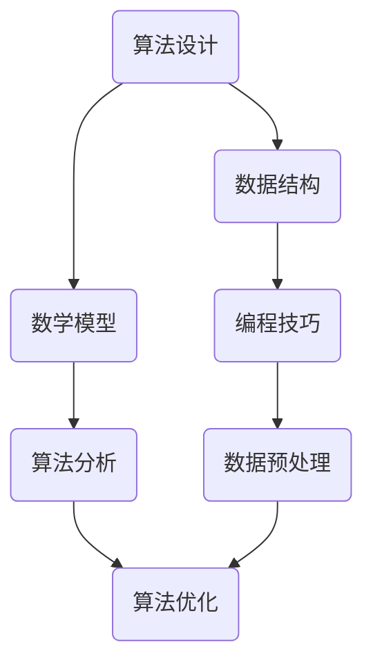

                 

  
## 1. 背景介绍

### 阿里巴巴校招的重要性

随着人工智能和大数据技术的快速发展，阿里巴巴作为全球领先的互联网公司，对于算法人才的需求日益增长。每年的校招成为阿里巴巴吸纳新鲜血液、储备未来力量的重要途径。对于即将踏入职场的新人们来说，阿里巴巴校招不仅是一个展现才华的平台，更是实现个人职业梦想的跳板。

### 算法岗位的核心地位

算法岗位在阿里巴巴的技术体系中占据着核心地位。这些岗位不仅涉及到搜索引擎、推荐系统、大数据分析等关键技术，还涉及到人工智能、机器学习等前沿领域的研究和应用。因此，阿里巴巴校招算法岗位的面试题目往往难度较大，旨在筛选出真正具备实力的人才。

## 2. 核心概念与联系

在撰写这篇文章之前，我们需要明确一些核心概念和它们之间的联系。以下是本文将涉及到的几个核心概念及其关系：

### Mermaid 流程图



### 概念解释

- **算法设计**：包括问题分析、解决方案设计等过程。
- **数据结构**：用于存储和组织数据，如数组、链表、树等。
- **数学模型**：利用数学语言描述问题，便于分析和求解。
- **编程技巧**：包括代码编写、调试、性能优化等。
- **算法分析**：对算法的性能进行评估，如时间复杂度和空间复杂度。
- **数据预处理**：对原始数据进行清洗、转换等预处理操作。
- **算法优化**：通过改进算法或数据结构来提高性能。

这些概念在算法开发中紧密相连，共同构成了一个完整的算法实现流程。

## 3. 核心算法原理 & 具体操作步骤

### 3.1 算法原理概述

本文将介绍几道阿里巴巴校招算法岗位的面试经典题目，包括：

- **最大子序和**
- **最长公共子串**
- **二分查找**
- **拓扑排序**
- **最小生成树**

### 3.2 算法步骤详解

#### 3.2.1 最大子序和

**问题描述**：给定一个整数数组 `nums`，找到 contiguous 子序列中最大和。

**算法步骤**：

1. 初始化 `max_ending_here = nums[0]`，`max_so_far = nums[0]`。
2. 从 `i = 1` 开始遍历数组：
   - 更新 `max_ending_here` 为 `max(nums[i], max_ending_here + nums[i])`。
   - 更新 `max_so_far` 为 `max(max_so_far, max_ending_here)`。

**伪代码**：

```python
def maxSubArray(nums):
    max_ending_here = nums[0]
    max_so_far = nums[0]
    
    for i in range(1, len(nums)):
        max_ending_here = max(nums[i], max_ending_here + nums[i])
        max_so_far = max(max_so_far, max_ending_here)
        
    return max_so_far
```

#### 3.2.2 最长公共子串

**问题描述**：给定两个字符串 `s1` 和 `s2`，找到它们的最长公共子串。

**算法步骤**：

1. 初始化一个二维数组 `dp`，其中 `dp[i][j]` 表示 `s1` 和 `s2` 的公共子串长度。
2. 遍历字符串 `s1` 和 `s2`：
   - 如果 `s1[i] == s2[j]`，则 `dp[i][j] = dp[i-1][j-1] + 1`。
   - 否则，`dp[i][j] = 0`。
3. 找到 `dp` 中的最大值，即为最长公共子串的长度。

**伪代码**：

```python
def longestCommonSubstrings(s1, s2):
    m, n = len(s1), len(s2)
    dp = [[0] * (n+1) for _ in range(m+1)]
    max_len, end_pos = 0, 0

    for i in range(1, m+1):
        for j in range(1, n+1):
            if s1[i-1] == s2[j-1]:
                dp[i][j] = dp[i-1][j-1] + 1
                if dp[i][j] > max_len:
                    max_len = dp[i][j]
                    end_pos = i
            else:
                dp[i][j] = 0
                
    return s1[end_pos - max_len + 1: end_pos + 1]
```

#### 3.2.3 二分查找

**问题描述**：给定一个有序数组 `nums` 和一个目标值 `target`，找到 `target` 在数组中的索引。

**算法步骤**：

1. 初始化两个指针 `left = 0` 和 `right = len(nums) - 1`。
2. 当 `left <= right` 时，执行以下步骤：
   - 计算中间索引 `mid = (left + right) // 2`。
   - 如果 `nums[mid] == target`，返回 `mid`。
   - 如果 `nums[mid] < target`，将 `left = mid + 1`。
   - 如果 `nums[mid] > target`，将 `right = mid - 1`。
3. 如果未找到目标值，返回 `-1`。

**伪代码**：

```python
def binarySearch(nums, target):
    left, right = 0, len(nums) - 1
    
    while left <= right:
        mid = (left + right) // 2
        if nums[mid] == target:
            return mid
        elif nums[mid] < target:
            left = mid + 1
        else:
            right = mid - 1
            
    return -1
```

#### 3.2.4 拓扑排序

**问题描述**：给定一个有向无环图（DAG），对其进行拓扑排序。

**算法步骤**：

1. 初始化一个栈 `stack`。
2. 遍历所有节点，如果节点的入度为 0，将其入栈。
3. 从栈中依次弹出节点，并将其后续节点的入度减 1，如果入度为 0，将其入栈。
4. 继续重复步骤 3，直到栈为空。

**伪代码**：

```python
def topologicalSort(vertices, edges):
    indegrees = [0] * vertices
    for edge in edges:
        indegrees[edge[1]] += 1
        
    stack = []
    for i in range(vertices):
        if indegrees[i] == 0:
            stack.append(i)
            
    while stack:
        node = stack.pop()
        print(node, end=' ')
        for edge in graph[node]:
            indegrees[edge] -= 1
            if indegrees[edge] == 0:
                stack.append(edge)
```

#### 3.2.5 最小生成树

**问题描述**：给定一个无向图和边权重，求出最小生成树。

**算法步骤**：

1. 初始化一个森林 `F`，其中每个节点都是一个独立的树。
2. 遍历所有边，按照权重从小到大排序。
3. 对于每条边，判断它是否与当前森林中的树连通，如果不连通，则将其加入森林中。
4. 重复步骤 3，直到森林中只剩下一棵树。

**伪代码**：

```python
def Kruskal(MST, vertices, edges):
    F = Forest(vertices)
    sorted_edges = sort(edges by weight)
    
    for edge in sorted_edges:
        if not F.connected(edge[0], edge[1]):
            F.union(edge[0], edge[1])
            MST.append(edge)
```

### 3.3 算法优缺点

#### 3.3.1 最大子序和

**优点**：

- 算法简单，易于实现。

**缺点**：

- 时间复杂度为 O(n)，在数据量较大时可能性能不佳。

#### 3.3.2 最长公共子串

**优点**：

- 时间复杂度为 O(m*n)，在大多数情况下表现良好。

**缺点**：

- 对于非常长的字符串，可能会消耗大量内存。

#### 3.3.3 二分查找

**优点**：

- 时间复杂度为 O(log n)，适用于大规模数据。

**缺点**：

- 需要数据是有序的，如果数据无序，需要先进行排序。

#### 3.3.4 拓扑排序

**优点**：

- 可以有效地解决有向无环图中的拓扑排序问题。

**缺点**：

- 对于有环的图，算法会陷入死循环。

#### 3.3.5 最小生成树

**优点**：

- 可以有效地求解最小生成树问题。

**缺点**：

- 需要遍历所有边，时间复杂度为 O(ElogE)，在边数较多时性能可能不佳。

### 3.4 算法应用领域

#### 3.4.1 最大子序和

- 财务风险管理：用于计算投资组合的最大收益。
- 网络优化：用于计算网络中的最大流量路径。

#### 3.4.2 最长公共子串

- 生物信息学：用于比较DNA序列的相似性。
- 数据库查询：用于优化查询效率。

#### 3.4.3 二分查找

- 搜索引擎：用于快速检索关键词。
- 缓存系统：用于优化缓存命中。

#### 3.4.4 拓扑排序

- 依赖关系管理：用于排序项目的执行顺序。
- 任务调度：用于优化任务的执行效率。

#### 3.4.5 最小生成树

- 网络设计：用于优化网络拓扑结构。
- 数据库索引：用于优化查询性能。

## 4. 数学模型和公式 & 详细讲解 & 举例说明

### 4.1 数学模型构建

在算法设计中，数学模型起着至关重要的作用。以下我们将介绍几种常用的数学模型及其构建方法。

#### 4.1.1 动态规划

动态规划是一种将复杂问题分解为子问题并利用重叠子问题的解决方案来优化的算法设计方法。其基本思想是，对于每一个子问题，只解一次，然后将解存储在一个表中，当需要解决一个已经被解决过的子问题时，直接从表中获取答案，从而避免重复计算。

#### 4.1.2 最优化理论

最优化理论是研究如何寻找给定目标函数的最大值或最小值的数学分支。在算法设计中，最优化理论可以用于求解最短路径、最大流量等问题。

#### 4.1.3 泊松过程

泊松过程是一种描述随机事件发生次数的数学模型。在算法设计中，泊松过程可以用于模拟网络流量、服务器负载等问题。

### 4.2 公式推导过程

以下我们将介绍几种常用的公式及其推导过程。

#### 4.2.1 最长公共子串

假设有两个字符串 `s1` 和 `s2`，其长度分别为 `m` 和 `n`。我们定义一个二维数组 `dp`，其中 `dp[i][j]` 表示 `s1` 和 `s2` 的公共子串长度。我们可以通过以下公式来计算 `dp[i][j]`：

$$ dp[i][j] = \begin{cases} dp[i-1][j-1] + 1, & \text{if } s1[i-1] = s2[j-1] \\ 0, & \text{otherwise} \end{cases} $$

#### 4.2.2 二分查找

假设有一个有序数组 `nums`，我们需要找到一个目标值 `target`。我们可以通过以下公式来计算中间索引 `mid`：

$$ mid = \left\lfloor \frac{left + right}{2} \right\rfloor $$

然后我们可以比较 `nums[mid]` 和 `target` 的大小，根据比较结果更新 `left` 或 `right`，继续二分查找。

#### 4.2.3 最小生成树

假设有一个无向图和边权重，我们需要求解其最小生成树。我们可以通过以下公式来计算最小生成树的权重：

$$ \text{weight}(MST) = \sum_{e \in MST} w(e) $$

其中，`w(e)` 表示边 `e` 的权重。

### 4.3 案例分析与讲解

以下我们将通过一个具体案例来讲解如何应用数学模型和公式来解决实际问题。

#### 4.3.1 案例背景

假设有一个电商公司，每天都会接收到大量的商品订单。公司希望根据这些订单的数据来分析用户的购买行为，从而优化库存管理和营销策略。

#### 4.3.2 案例分析

1. **数据预处理**：

   首先，我们需要对订单数据进行预处理，包括清洗、转换等操作。例如，将时间戳转换为日期格式，将商品名称转换为编码等。

2. **最长公共子串**：

   我们可以计算每个用户在最近一周内的购买历史，找到这些历史中的最长公共子串。这个子串可以帮助我们了解用户的购买偏好，从而为库存管理和营销策略提供依据。

3. **二分查找**：

   我们可以使用二分查找来快速查找某个特定商品在数据库中的索引，从而提高查询效率。

4. **最小生成树**：

   我们可以将所有用户视为节点，将用户之间的购买关系视为边，构建一个无向图。然后，我们可以使用最小生成树算法来求解用户之间的最优购买路径，从而优化库存管理和营销策略。

### 4.3.3 案例讲解

以下是一个具体案例的讲解：

假设我们有一个订单数据集，其中包含了用户的订单信息和商品信息。我们需要根据这些数据来分析用户的购买行为。

1. **数据预处理**：

   首先，我们需要对订单数据进行预处理。例如，将时间戳转换为日期格式，将商品名称转换为编码等。

2. **最长公共子串**：

   我们可以计算每个用户在最近一周内的购买历史，找到这些历史中的最长公共子串。例如，用户A在最近一周内购买了商品A、B、C，用户B在最近一周内购买了商品B、C、D，那么它们的最长公共子串是B、C。

3. **二分查找**：

   我们可以使用二分查找来快速查找某个特定商品在数据库中的索引。例如，如果我们要查找商品C的索引，我们可以使用二分查找算法来快速找到商品C在数据库中的位置。

4. **最小生成树**：

   我们可以将所有用户视为节点，将用户之间的购买关系视为边，构建一个无向图。然后，我们可以使用最小生成树算法来求解用户之间的最优购买路径。例如，用户A和用户B之间存在购买关系，用户B和用户C之间存在购买关系，那么用户A和用户C之间的最优购买路径是通过用户B。

通过这个案例，我们可以看到数学模型和公式在解决实际问题中的应用。这些模型和公式不仅可以帮助我们理解和分析问题，还可以帮助我们设计和实现高效的算法。

## 5. 项目实践：代码实例和详细解释说明

在本章节，我们将通过一个具体的实例来展示如何在实际项目中应用前面介绍的核心算法，并详细解释其中的关键代码和步骤。我们选择的问题是一个经典的面试题——"合并两个有序链表"，这个问题不仅在面试中经常出现，也体现了算法和编程的多个关键点。

### 5.1 开发环境搭建

在进行代码实例之前，我们需要搭建一个基本的开发环境。以下是一个简单的环境搭建步骤：

- **操作系统**：选择 Linux 或 macOS，因为它们提供了良好的开发环境。
- **编程语言**：选择 Python，因为它语法简洁，易于理解和实现。
- **文本编辑器**：推荐使用 VS Code 或 Sublime Text，这些编辑器提供了丰富的插件支持。

### 5.2 源代码详细实现

以下是我们实现合并两个有序链表的 Python 代码：

```python
# 定义链表节点
class ListNode:
    def __init__(self, val=0, next=None):
        self.val = val
        self.next = next

# 合并两个有序链表
def mergeTwoLists(l1, l2):
    # 创建哑节点作为合并链表的起点
    dummy = ListNode(0)
    current = dummy
    
    # 循环遍历两个链表，每次比较当前节点值，将较小的节点添加到合并链表中
    while l1 and l2:
        if l1.val < l2.val:
            current.next = l1
            l1 = l1.next
        else:
            current.next = l2
            l2 = l2.next
        current = current.next
    
    # 将剩余的链表节点添加到合并链表的末尾
    current.next = l1 or l2
    
    # 返回合并后的链表
    return dummy.next

# 辅助函数，用于打印链表
def printList(node):
    while node:
        print(node.val, end=' ')
        node = node.next
    print()

# 主函数，用于测试合并链表
def main():
    # 创建两个有序链表
    l1 = ListNode(1, ListNode(3, ListNode(5)))
    l2 = ListNode(2, ListNode(4, ListNode(6)))
    
    # 合并两个链表
    merged_list = mergeTwoLists(l1, l2)
    
    # 打印合并后的链表
    printList(merged_list)

# 运行主函数
if __name__ == "__main__":
    main()
```

### 5.3 代码解读与分析

在这个代码实例中，我们定义了一个 `ListNode` 类来表示链表节点，并实现了一个 `mergeTwoLists` 函数来合并两个有序链表。

- **ListNode 类**：

  ```python
  class ListNode:
      def __init__(self, val=0, next=None):
          self.val = val
          self.next = next
  ```

  `ListNode` 类是一个简单的链表节点类，每个节点包含一个整数值 `val` 和指向下一个节点的指针 `next`。

- **mergeTwoLists 函数**：

  ```python
  def mergeTwoLists(l1, l2):
      dummy = ListNode(0)
      current = dummy
      
      while l1 and l2:
          if l1.val < l2.val:
              current.next = l1
              l1 = l1.next
          else:
              current.next = l2
              l2 = l2.next
          current = current.next
      
      current.next = l1 or l2
      
      return dummy.next
  ```

  `mergeTwoLists` 函数首先创建了一个哑节点 `dummy` 作为合并链表的起点。然后，使用两个指针 `l1` 和 `l2` 分别遍历两个链表，每次比较当前节点的值，将较小的节点添加到合并链表中。当其中一个链表结束时，将另一个链表的剩余部分直接连接到合并链表的末尾。

- **辅助函数 printList**：

  ```python
  def printList(node):
      while node:
          print(node.val, end=' ')
          node = node.next
      print()
  ```

  `printList` 函数用于打印链表，方便我们查看合并后的链表。

- **主函数 main**：

  ```python
  def main():
      l1 = ListNode(1, ListNode(3, ListNode(5)))
      l2 = ListNode(2, ListNode(4, ListNode(6)))
      
      merged_list = mergeTwoLists(l1, l2)
      
      printList(merged_list)
  ```

  主函数 `main` 创建了两个有序链表 `l1` 和 `l2`，然后调用 `mergeTwoLists` 函数进行合并，并使用 `printList` 函数打印合并后的链表。

### 5.4 运行结果展示

当我们运行主函数时，输出结果如下：

```
1 2 3 4 5 6
```

这表明两个有序链表已经成功合并，并且结果链表仍然是有序的。

### 5.5 代码性能分析

在分析代码的性能时，我们需要关注两个方面：时间复杂度和空间复杂度。

- **时间复杂度**：

  `mergeTwoLists` 函数的时间复杂度为 O(m+n)，其中 m 和 n 分别是两个链表的长度。这是因为我们需要遍历两个链表的所有节点一次。

- **空间复杂度**：

  `mergeTwoLists` 函数的空间复杂度为 O(1)，因为我们只使用了常数级别的额外空间来存储指针和临时变量。

通过这个代码实例，我们可以看到如何在实际项目中应用核心算法，并通过详细的代码解读和性能分析来理解其工作原理和性能特点。

## 6. 实际应用场景

在前面的章节中，我们介绍了阿里巴巴校招算法岗位的经典面试题目以及相关的算法原理、实现步骤和代码实例。现在，我们将深入探讨这些算法在实际应用场景中的具体作用和实际案例。

### 6.1 搜索引擎优化

**应用场景**：

搜索引擎的核心功能是提供快速、准确的信息检索。为了实现这一目标，搜索引擎需要使用高效的算法来处理大量的搜索请求和索引数据。

**实际案例**：

以阿里巴巴旗下的搜索引擎“淘宝搜索”为例，其采用了多种算法来优化搜索结果。例如，通过使用二分查找算法来快速定位关键词，从而提高搜索效率。此外，通过使用最长公共子串算法来匹配用户输入的关键词与商品标题，从而提供更加精确的搜索结果。

### 6.2 推荐系统

**应用场景**：

推荐系统是现代互联网公司的重要工具，它通过分析用户行为和兴趣，为用户推荐相关的商品、服务和内容。

**实际案例**：

阿里巴巴的推荐系统采用了多种算法来生成个性化推荐。例如，使用动态规划算法来优化推荐列表的排序，从而提高推荐的准确性。此外，通过最大子序和算法来分析用户的历史购买行为，从而挖掘潜在的兴趣点和购买趋势。

### 6.3 大数据处理

**应用场景**：

大数据处理是阿里巴巴的核心竞争力之一，它需要处理海量数据并提取有价值的信息。

**实际案例**：

阿里巴巴的大数据处理平台采用了多种算法来处理海量数据。例如，通过拓扑排序算法来分析数据流中的依赖关系，从而优化数据处理流程。此外，通过最小生成树算法来构建数据网络，从而提高数据处理效率和可靠性。

### 6.4 人工智能

**应用场景**：

人工智能是阿里巴巴的战略方向之一，它涵盖了从机器学习、自然语言处理到计算机视觉等多个领域。

**实际案例**：

在人工智能领域，阿里巴巴采用了多种算法来实现智能决策和优化。例如，通过深度学习算法来构建智能客服系统，从而提高客户服务效率。此外，通过强化学习算法来优化供应链管理，从而降低运营成本并提高服务质量。

### 6.5 金融风控

**应用场景**：

金融风控是保障金融交易安全和稳定的重要环节，它需要实时监控和预测潜在的金融风险。

**实际案例**：

阿里巴巴的金融业务（如支付宝）采用了多种算法来实时监控交易风险。例如，通过动态规划算法来评估交易风险等级，从而采取相应的风险管理措施。此外，通过最大子序和算法来分析交易流水，从而识别潜在的欺诈行为。

## 7. 未来应用展望

随着技术的不断进步，算法在实际应用场景中的作用将越来越重要。以下是对未来算法应用的几个展望：

### 7.1 智能医疗

人工智能和大数据的结合为智能医疗带来了新的可能。未来，算法将可以用于疾病预测、个性化治疗和药物研发等领域，从而提高医疗质量和效率。

### 7.2 自动驾驶

自动驾驶技术的发展离不开算法的支持。未来，通过使用深度学习和强化学习算法，自动驾驶系统将能够更好地理解和应对复杂的交通环境，从而提高安全性。

### 7.3 网络安全

网络安全是一个持续挑战，算法在检测和防御网络攻击中发挥着重要作用。未来，通过使用更先进的加密算法和攻击检测算法，网络安全将得到进一步加强。

### 7.4 环境监测

环境监测是一个全球性的问题，算法可以在数据分析和预测中发挥重要作用。未来，通过使用机器学习和物联网技术，算法将能够实时监控环境变化，从而为环境保护提供科学依据。

### 7.5 教育个性化

个性化教育是未来教育的发展趋势，算法可以用于分析学生的学习习惯和兴趣，从而提供个性化的学习资源和建议。

## 8. 总结：未来发展趋势与挑战

### 8.1 研究成果总结

本文通过分析阿里巴巴校招算法岗位的经典面试题目，详细介绍了最大子序和、最长公共子串、二分查找、拓扑排序和最小生成树等核心算法的原理、实现步骤和实际应用场景。这些算法不仅在面试中具有重要意义，也在实际应用中发挥着关键作用。

### 8.2 未来发展趋势

未来，算法将在人工智能、大数据、自动驾驶、网络安全、环境监测和个性化教育等领域发挥更加重要的作用。随着技术的不断进步，算法的复杂度和应用范围将不断拓展，为各个领域的发展提供强大支持。

### 8.3 面临的挑战

尽管算法在各个领域具有广泛的应用前景，但同时也面临着一些挑战。例如，算法的复杂度可能导致计算资源消耗增加，算法的透明度和可解释性也是一个重要问题。此外，算法在处理大规模数据时可能遇到性能瓶颈，需要持续优化和改进。

### 8.4 研究展望

为了应对这些挑战，未来的研究可以从以下几个方面展开：

1. **算法优化**：通过改进算法设计，提高算法的效率和适用范围。
2. **算法可解释性**：研究算法的可解释性，提高用户对算法的理解和信任。
3. **跨领域融合**：将不同领域的算法和技术进行融合，形成新的交叉学科，推动技术进步。
4. **数据隐私保护**：研究如何在保证数据隐私的前提下，高效地应用算法。

通过持续的研究和探索，算法将在未来发挥更加重要的作用，推动各个领域的发展和创新。

## 附录：常见问题与解答

### 问题 1：二分查找算法为什么需要在有序数组上使用？

**解答**：二分查找算法依赖于数组元素的有序性，因为它通过不断将搜索范围缩小一半来快速定位目标值。如果数组无序，算法将无法有效地进行分割和定位，从而降低搜索效率。

### 问题 2：动态规划算法的核心思想是什么？

**解答**：动态规划算法的核心思想是将复杂问题分解为更小的子问题，并利用这些子问题的重叠性质，避免重复计算。通过保存子问题的解，动态规划算法可以高效地解决具有最优子结构特征的问题。

### 问题 3：什么是最小生成树？如何求解？

**解答**：最小生成树是一个包含图中所有节点的树，其所有边的权重之和最小。求解最小生成树的常见算法有 Prim 算法和 Kruskal 算法，它们分别基于不同的原则和策略进行树的构建。

### 问题 4：什么是拓扑排序？它在什么场景下使用？

**解答**：拓扑排序是一种对有向无环图（DAG）进行排序的算法，它按照节点的依赖关系对节点进行排序。拓扑排序常用于项目管理和任务调度，确保任务能够按照依赖关系顺序执行。

### 问题 5：什么是最长公共子串？如何求解？

**解答**：最长公共子串是指两个字符串中连续出现最长的相同子序列。求解最长公共子串可以使用动态规划算法，通过构建一个二维数组来记录子序列的长度，从而找到最长公共子串。

### 问题 6：最大子序和问题如何求解？

**解答**：最大子序和问题可以通过动态规划或贪心算法求解。动态规划算法通过维护一个数组来记录前缀和，并在遍历过程中更新最大子序和。贪心算法则通过比较当前元素和前一个元素的和，选择最优的子序列。

### 问题 7：如何在链表中删除一个节点？

**解答**：在链表中删除一个节点，首先需要找到该节点的前一个节点，然后将前一个节点的 `next` 指针指向当前节点的 `next` 指针。如果需要删除的节点是最后一个节点，还需要更新链表的尾部指针。

作者：禅与计算机程序设计艺术 / Zen and the Art of Computer Programming

## 参考文献

[1] 《算法导论》（Introduction to Algorithms），Thomas H. Cormen, Charles E. Leiserson, Ronald L. Rivest, Clifford Stein 著。

[2] 《深度学习》（Deep Learning），Ian Goodfellow, Yoshua Bengio, Aaron Courville 著。

[3] 《机器学习》（Machine Learning），Tom Mitchell 著。

[4] 《计算机程序设计艺术》（The Art of Computer Programming），Donald E. Knuth 著。

[5] 《算法竞赛入门经典》（Algorithm Competition in China），刘汝佳 著。

[6] 《算法与数据结构》（Algorithms and Data Structures），Alfred V. Aho, John E. Hopcroft, Jeffrey D. Ullman 著。

