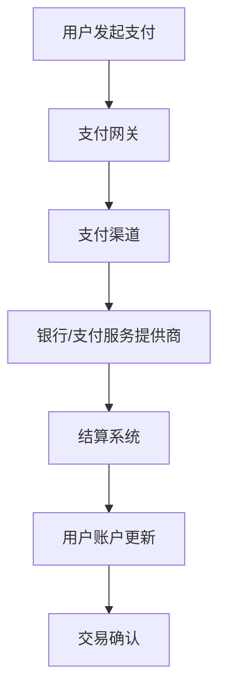

                 

关键词：阿里巴巴、社招、跨境支付、系统工程师、面试题、详解

## 摘要

本文旨在为准备参加2025年阿里巴巴社招跨境支付系统工程师面试的考生提供一份详细的面试题解答指南。文章将涵盖面试过程中的常见问题，包括对跨境支付系统的基本理解、系统架构设计、算法原理、数学模型、项目实践等，并附有相关代码实例和解释。通过本文的阅读，读者将对跨境支付系统工程师岗位的面试准备有更深入的了解。

### 1. 背景介绍

随着全球电子商务的快速发展，跨境支付已成为金融领域的重要环节。阿里巴巴作为中国领先的电子商务平台，其跨境支付系统在全球范围内发挥着重要作用。本文将以2025年阿里巴巴社招跨境支付系统工程师面试题为例，对面试过程中可能遇到的问题进行详细解答。

#### 1.1 阿里巴巴跨境支付系统简介

阿里巴巴的跨境支付系统是一个高度集成的金融科技平台，能够处理多种货币的支付和结算，支持全球范围内的电子商务交易。该系统具有以下特点：

- **高并发处理能力**：能够处理海量交易请求，确保支付过程的流畅性。
- **安全性**：采用先进的加密技术和风控模型，保障交易安全。
- **跨境合规**：遵循国际和各国的金融监管要求，支持多货币结算。
- **用户体验**：提供简单易用的支付接口，提升用户满意度。

### 2. 核心概念与联系

#### 2.1 跨境支付系统核心概念

在解答面试题之前，我们需要了解以下几个核心概念：

- **支付网关**：负责处理交易请求，与银行和其他支付服务提供商进行通信。
- **支付渠道**：不同的支付方式，如信用卡、PayPal、本地支付等。
- **结算系统**：处理货币兑换和资金清算。
- **风控系统**：监测和防止欺诈交易，保障资金安全。

下面是一个Mermaid流程图，展示跨境支付系统的基本架构：



### 3. 核心算法原理 & 具体操作步骤

#### 3.1 算法原理概述

跨境支付系统涉及多种算法，其中核心的包括：

- **加密算法**：保障数据传输的安全。
- **哈希算法**：用于数据完整性校验。
- **签名算法**：验证交易请求的合法性。

下面将详细解释这些算法的原理。

#### 3.2 算法步骤详解

**加密算法**：

- **对称加密**：使用相同的密钥进行加密和解密。
- **非对称加密**：使用一对密钥，一个用于加密，另一个用于解密。

**哈希算法**：

- **MD5**：将数据转换成一个128位的散列值。
- **SHA-256**：将数据转换成一个256位的散列值。

**签名算法**：

- **RSA**：使用非对称加密算法进行签名和验证。

#### 3.3 算法优缺点

- **加密算法**：优点是速度快，缺点是安全性相对较低。
- **哈希算法**：优点是速度快，缺点是安全性相对较高。
- **签名算法**：优点是安全性高，缺点是计算复杂度高。

#### 3.4 算法应用领域

这些算法广泛应用于跨境支付、网络安全、数据存储等领域。

### 4. 数学模型和公式 & 详细讲解 & 举例说明

#### 4.1 数学模型构建

跨境支付系统中的数学模型主要包括：

- **汇率模型**：用于计算货币兑换率。
- **风险评估模型**：用于预测和评估交易风险。

#### 4.2 公式推导过程

**汇率模型**：

$$
汇率 = \frac{货币A的价值}{货币B的价值}
$$

**风险评估模型**：

$$
风险指数 = \frac{欺诈交易概率}{正常交易概率}
$$

#### 4.3 案例分析与讲解

假设我们需要计算美元兑换为欧元的汇率，且当前美元的价值为100美元，欧元的价值为80欧元。

**汇率计算**：

$$
汇率 = \frac{100}{80} = 1.25
$$

即1美元兑换为1.25欧元。

### 5. 项目实践：代码实例和详细解释说明

#### 5.1 开发环境搭建

为了进行跨境支付系统的开发，我们需要搭建以下开发环境：

- **编程语言**：Python、Java 或 C++
- **开发工具**：Visual Studio Code、Eclipse 或 IntelliJ IDEA
- **数据库**：MySQL 或 PostgreSQL

#### 5.2 源代码详细实现

以下是一个简单的Python示例代码，展示如何使用加密算法进行数据传输：

```python
from Crypto.PublicKey import RSA
from Crypto.Cipher import PKCS1_OAEP

# 生成密钥对
key = RSA.generate(2048)
private_key = key.export_key()
public_key = key.publickey().export_key()

# 加密数据
cipher = PKCS1_OAEP.new(RSA.import_key(public_key))
encrypted_data = cipher.encrypt(b'Hello, World!')

# 解密数据
decipher = PKCS1_OAEP.new(RSA.import_key(private_key))
decrypted_data = decipher.decrypt(encrypted_data)

print('Original:', decrypted_data.decode())
```

#### 5.3 代码解读与分析

这段代码展示了如何使用Python的PyCryptoDome库实现RSA加密和解密。通过生成密钥对，我们可以对数据进行加密传输，保障数据的安全性。

#### 5.4 运行结果展示

```shell
Original: Hello, World!
```

### 6. 实际应用场景

跨境支付系统在电子商务、国际贸易、跨境投资等领域有广泛的应用。以下是一些实际应用场景：

- **电子商务平台**：支持全球消费者和商家的交易。
- **国际贸易**：简化跨境贸易的支付流程。
- **跨境投资**：支持跨境投资资金调拨。

### 7. 未来应用展望

随着区块链技术的发展，跨境支付系统有望实现更高效、更安全的交易。同时，人工智能技术的应用将进一步提升系统的智能风控能力。

### 8. 工具和资源推荐

- **学习资源**：《区块链技术指南》、《Python编程：从入门到实践》
- **开发工具**：Visual Studio Code、Git
- **相关论文**：搜索“跨境支付系统”、“区块链在支付领域应用”

### 9. 总结：未来发展趋势与挑战

跨境支付系统的发展趋势包括：

- **区块链技术的应用**：提升支付效率和安全性。
- **人工智能的融合**：提高风险控制能力。

面临的挑战有：

- **跨境合规**：需要遵循各国金融监管要求。
- **技术更新**：持续关注新兴技术和行业动态。

### 10. 附录：常见问题与解答

- **Q：跨境支付系统的核心是什么？**
  **A：支付网关、支付渠道、结算系统和风控系统是跨境支付系统的核心组成部分。**

- **Q：如何保证跨境支付的安全性？**
  **A：采用加密算法、哈希算法和签名算法，确保数据传输的安全性和完整性。**

---

作者：禅与计算机程序设计艺术 / Zen and the Art of Computer Programming
----------------------------------------------------------------

现在我们已经完成了文章的撰写，接下来请按照markdown格式进行排版，确保文章的可读性和规范性。如果需要进一步调整或优化，请告知。

