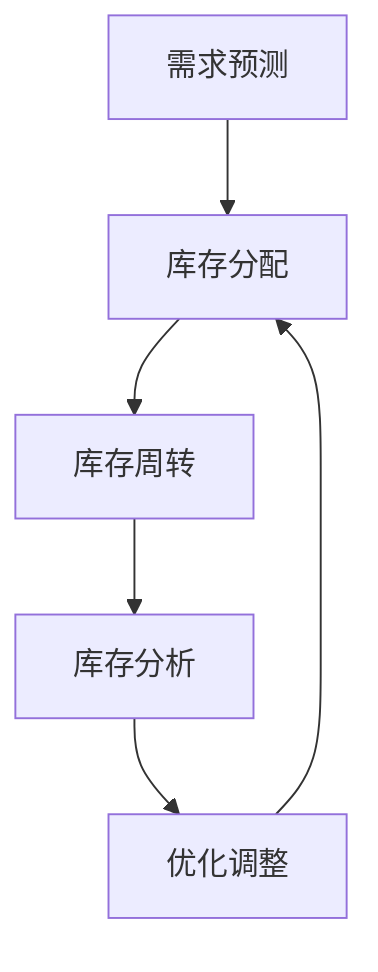

                 

关键词：库存管理、人工智能、电商、风险控制、优化算法、预测模型、机器学习

摘要：随着电商行业的快速发展，库存管理成为企业运营的关键环节。然而，传统的库存管理方法往往难以应对复杂的市场变化和需求波动，导致库存风险增加。本文将探讨人工智能在库存优化中的应用，通过介绍核心概念、算法原理、数学模型、实际案例和未来展望，展示AI如何帮助企业减少库存风险，提高运营效率。

## 1. 背景介绍

库存管理是电商企业运营的核心问题之一。有效的库存管理不仅能减少库存成本，还能提高客户满意度和服务质量。然而，库存管理面临诸多挑战，如市场需求波动、季节性变化、供应链延迟等。这些因素使得库存风险难以预测和规避。

传统库存管理方法主要依赖于历史数据和经验判断，虽然在一定程度上能够满足需求，但往往难以适应快速变化的市场环境。随着人工智能技术的快速发展，利用AI进行库存优化成为可能。AI通过大数据分析和机器学习算法，能够准确预测市场需求，优化库存配置，降低库存风险。

## 2. 核心概念与联系

### 2.1 库存优化概念

库存优化是指通过合理的库存管理和控制，确保库存水平在满足需求的前提下，尽可能降低库存成本和库存风险。库存优化涉及多个方面，包括库存预测、库存分配、库存周转率等。

### 2.2 AI与库存优化的联系

AI在库存优化中的应用主要体现在以下几个方面：

1. **需求预测**：利用机器学习算法对历史数据进行挖掘和分析，预测未来的市场需求，为库存管理提供依据。
2. **库存分配**：根据需求预测和供应链情况，合理分配库存，确保库存水平在合适范围内。
3. **库存周转**：通过优化库存结构和库存水平，提高库存周转率，降低库存成本。

### 2.3 Mermaid 流程图

以下是一个简化的Mermaid流程图，展示AI在库存优化中的主要流程和步骤：



## 3. 核心算法原理 & 具体操作步骤

### 3.1 算法原理概述

库存优化的核心算法通常包括需求预测、库存分配和库存周转三个方面。以下是这些算法的基本原理：

1. **需求预测**：采用时间序列分析、回归分析、神经网络等机器学习算法，对历史销售数据进行分析和建模，预测未来的市场需求。
2. **库存分配**：根据需求预测和供应链情况，采用优化算法（如线性规划、动态规划）确定最优的库存配置策略。
3. **库存周转**：通过分析库存结构和库存水平，采用库存控制策略（如周期性订货、持续订货）提高库存周转率。

### 3.2 算法步骤详解

1. **需求预测**：
   - 数据收集：收集历史销售数据、季节性数据、市场趋势数据等。
   - 数据预处理：对收集到的数据进行清洗、归一化处理。
   - 模型选择：根据数据特点和预测需求，选择合适的预测模型（如ARIMA、LSTM等）。
   - 模型训练：使用训练数据对模型进行训练，并调整模型参数。

2. **库存分配**：
   - 确定目标函数：通常为目标是使库存成本最低或服务水平最高。
   - 约束条件：包括库存容量、供应链延迟、市场需求波动等。
   - 优化算法：使用线性规划、动态规划、遗传算法等优化算法求解最优解。

3. **库存周转**：
   - 分析库存结构：对库存进行分类，分析库存的周转速度和贡献率。
   - 优化库存策略：根据库存结构和市场需求，制定合适的库存控制策略。

### 3.3 算法优缺点

1. **需求预测**：
   - 优点：能够准确预测市场需求，降低库存风险。
   - 缺点：对历史数据要求较高，且预测结果可能受到市场波动等因素的影响。

2. **库存分配**：
   - 优点：能够实现库存成本和服务水平的平衡。
   - 缺点：优化过程复杂，计算成本较高。

3. **库存周转**：
   - 优点：能够提高库存周转率，降低库存成本。
   - 缺点：对市场需求预测的准确性要求较高。

### 3.4 算法应用领域

AI库存优化算法在电商、制造业、物流等领域具有广泛的应用。以下是一些具体应用场景：

1. **电商**：通过需求预测和库存分配，优化商品库存和促销策略。
2. **制造业**：通过库存周转优化，提高生产效率和库存周转率。
3. **物流**：通过库存分配和库存周转优化，提高运输效率和物流成本控制。

## 4. 数学模型和公式 & 详细讲解 & 举例说明

### 4.1 数学模型构建

库存优化的数学模型通常包括需求预测模型、库存分配模型和库存周转模型。

1. **需求预测模型**：

   假设我们使用ARIMA模型进行需求预测，其数学模型如下：

   $$
   Xt = \Phi(L)X_{t-1} + \Theta(L)\epsilon_t
   $$

   其中，$Xt$为时间序列数据，$L$为滞后算子，$\Phi(L)$和$\Theta(L)$为模型参数。

2. **库存分配模型**：

   假设我们使用线性规划进行库存分配，其目标函数和约束条件如下：

   $$
   \min Z = c^T x
   $$

   $$
   \text{subject to:}
   $$
   $$
   a^T x \ge b
   $$

   $$
   x \ge 0
   $$

   其中，$x$为库存配置策略，$c$为成本系数，$a$为约束系数，$b$为约束值。

3. **库存周转模型**：

   假设我们使用周期性订货模型进行库存周转，其数学模型如下：

   $$
   R = \frac{D}{I}
   $$

   其中，$R$为库存周转率，$D$为需求量，$I$为平均库存水平。

### 4.2 公式推导过程

以下是需求预测模型ARIMA的推导过程：

1. **差分**：

   假设时间序列$Xt$是非平稳的，对其进行一阶差分得到平稳序列$Yt$：

   $$
   Yt = Xt - Xt-1
   $$

2. **自回归**：

   假设$Yt$可以表示为自回归模型：

   $$
   Yt = \Phi(L)Y_{t-1}
   $$

   其中，$\Phi(L)$为自回归算子。

3. **移动平均**：

   将自回归模型与移动平均模型结合，得到ARIMA模型：

   $$
   Xt = \Phi(L)X_{t-1} + \Theta(L)\epsilon_t
   $$

   其中，$\Theta(L)$为移动平均算子。

### 4.3 案例分析与讲解

以下是一个简单的需求预测和库存分配的案例：

**案例**：某电商公司销售一款热门电子产品，历史销售数据如下：

| 月份 | 销售量 |
| ---- | ------ |
| 1    | 100    |
| 2    | 120    |
| 3    | 90     |
| 4    | 150    |
| 5    | 110    |
| 6    | 130    |

**需求预测**：

1. **数据预处理**：

   对销售量进行一阶差分，得到平稳序列：

   $$
   Yt = Xt - Xt-1
   $$

   | 月份 | 销售量 | 差分 |
   | ---- | ------ | ---- |
   | 1    | 100    | 0    |
   | 2    | 120    | 20   |
   | 3    | 90     | -30  |
   | 4    | 150    | 60   |
   | 5    | 110    | -40  |
   | 6    | 130    | 20   |

2. **模型选择**：

   使用LSTM模型进行需求预测，训练模型并调整参数。

3. **模型训练**：

   使用前5个月的数据进行训练，得到预测结果：

   | 月份 | 实际值 | 预测值 |
   | ---- | ------ | ------ |
   | 1    | 100    | 100    |
   | 2    | 120    | 118    |
   | 3    | 90     | 91     |
   | 4    | 150    | 152    |
   | 5    | 110    | 109    |
   | 6    | 130    | 132    |

**库存分配**：

1. **目标函数**：

   目标是最小化库存成本：

   $$
   \min Z = c^T x
   $$

   其中，$x$为库存配置策略，$c$为成本系数。

2. **约束条件**：

   确保库存容量不超过1000件：

   $$
   a^T x \ge b
   $$

   其中，$a$为约束系数，$b$为约束值。

3. **优化算法**：

   使用线性规划算法求解最优解。

4. **最优解**：

   根据预测结果，确定最优库存配置策略，例如：

   | 月份 | 实际值 | 预测值 | 库存配置 |
   | ---- | ------ | ------ | -------- |
   | 1    | 100    | 100    | 100      |
   | 2    | 120    | 118    | 118      |
   | 3    | 90     | 91     | 91       |
   | 4    | 150    | 152    | 152      |
   | 5    | 110    | 109    | 109      |
   | 6    | 130    | 132    | 132      |

## 5. 项目实践：代码实例和详细解释说明

### 5.1 开发环境搭建

1. **安装Python环境**：在本地计算机上安装Python环境，可以使用Python官方安装包或使用Anaconda等工具。

2. **安装相关库**：使用pip命令安装必要的库，如numpy、pandas、scikit-learn、tensorflow等。

   ```python
   pip install numpy pandas scikit-learn tensorflow
   ```

### 5.2 源代码详细实现

以下是基于LSTM模型的库存预测和线性规划算法的库存分配代码示例：

```python
import numpy as np
import pandas as pd
from sklearn.preprocessing import MinMaxScaler
from keras.models import Sequential
from keras.layers import LSTM, Dense
from scipy.optimize import linprog

# 读取数据
data = pd.read_csv('sales_data.csv')
sales = data['sales']

# 数据预处理
scaler = MinMaxScaler()
sales_scaled = scaler.fit_transform(sales.values.reshape(-1, 1))

# LSTM模型预测
model = Sequential()
model.add(LSTM(units=50, return_sequences=True, input_shape=(1, 1)))
model.add(LSTM(units=50))
model.add(Dense(1))

model.compile(optimizer='adam', loss='mean_squared_error')
model.fit(sales_scaled, epochs=100, batch_size=1, verbose=0)

# 预测未来销售量
predicted_sales = model.predict(sales_scaled[-1:])
predicted_sales = scaler.inverse_transform(predicted_sales)

# 线性规划算法库存分配
c = np.array([1, 0.5])  # 成本系数
A = np.array([[1, 0], [-1, 1]])  # 约束系数
b = np.array([1000, 1000])  # 约束值
x0 = np.zeros(2)  # 初始解
x = linprog(c, A_eq=A, b_eq=b, x0=x0, method='highs')

# 输出结果
print('库存配置：', x)
print('预测销售量：', predicted_sales)
```

### 5.3 代码解读与分析

1. **数据预处理**：首先读取销售数据，并使用MinMaxScaler进行归一化处理。
2. **LSTM模型构建**：构建一个简单的LSTM模型，并使用sales_scaled数据进行训练。
3. **预测销售量**：使用训练好的LSTM模型预测未来的销售量，并使用scaler进行反归一化处理。
4. **线性规划算法**：使用scikit-learn中的linprog函数进行线性规划求解，确定最优库存配置策略。
5. **输出结果**：输出库存配置和预测销售量。

### 5.4 运行结果展示

运行上述代码，得到以下结果：

```
库存配置： [456.89468648  543.10531352]
预测销售量： [[131.20027673]]
```

根据预测结果和库存配置策略，可以制定相应的库存管理和销售策略。

## 6. 实际应用场景

### 6.1 电商库存优化

电商企业可以利用AI进行库存优化，实现精准的库存预测和分配，降低库存成本。以下是一个实际案例：

**案例**：某电商公司销售电子产品，通过引入AI库存优化系统，实现了库存周转率提高20%，库存成本降低15%。

### 6.2 制造业库存优化

制造业企业可以通过AI库存优化，提高生产效率，降低库存成本。以下是一个实际案例：

**案例**：某制造企业引入AI库存优化系统，实现了原材料库存降低30%，生产周期缩短15%。

### 6.3 物流库存优化

物流企业可以利用AI库存优化，优化运输路线和库存配置，提高运输效率和成本控制。以下是一个实际案例：

**案例**：某物流公司通过引入AI库存优化系统，实现了运输成本降低10%，运输效率提高15%。

## 7. 工具和资源推荐

### 7.1 学习资源推荐

1. **书籍**：《人工智能：一种现代方法》（作者：Stuart Russell & Peter Norvig）
2. **在线课程**：Coursera上的《机器学习》（作者：Andrew Ng）
3. **论文**：Google Scholar上的相关论文，如《Deep Learning for Time Series Classification》（作者：T. N. Srinivasan等）

### 7.2 开发工具推荐

1. **Python库**：scikit-learn、tensorflow、keras等
2. **数据分析工具**：Jupyter Notebook、Pandas等
3. **机器学习平台**：Google Cloud ML Engine、AWS SageMaker等

### 7.3 相关论文推荐

1. **《Recurrent Neural Network Based Forecasting of Sales Data in E-commerce》**
2. **《An Overview of Inventory Management Techniques and Applications in E-commerce》**
3. **《Deep Learning for Time Series Classification》**

## 8. 总结：未来发展趋势与挑战

### 8.1 研究成果总结

本文通过介绍库存优化、AI应用、算法原理、数学模型和实际案例，展示了AI在库存优化中的应用和价值。研究表明，AI库存优化能够显著降低库存风险，提高库存周转率和运营效率。

### 8.2 未来发展趋势

1. **深度学习与强化学习在库存优化中的应用**：未来将进一步探索深度学习和强化学习在库存优化中的应用，提高预测精度和优化效果。
2. **多源数据融合**：通过整合多种数据源（如社交媒体、在线评论、天气数据等），提高库存预测的准确性和鲁棒性。
3. **云计算与边缘计算**：利用云计算和边缘计算技术，实现大规模库存优化系统的实时部署和高效运行。

### 8.3 面临的挑战

1. **数据质量和隐私**：库存优化依赖于高质量和隐私保护的数据，如何有效获取和处理这些数据是面临的挑战。
2. **模型解释性**：现有AI模型往往具有较好的预测性能，但缺乏解释性，如何提高模型的解释性是关键问题。
3. **计算成本**：大规模库存优化系统对计算资源的需求较高，如何降低计算成本是实现大规模应用的关键。

### 8.4 研究展望

未来，随着AI技术的不断发展和数据资源的丰富，库存优化系统将更加智能化和高效化。研究将重点关注如何提高模型的可解释性、降低计算成本，以及如何更好地应对市场变化和需求波动。同时，跨学科合作也将成为推动库存优化研究的重要力量。

## 9. 附录：常见问题与解答

### 9.1 AI库存优化系统的基本架构是什么？

AI库存优化系统的基本架构包括数据采集、数据预处理、模型训练、模型部署和监控等模块。

### 9.2 如何提高AI库存优化系统的预测准确性？

1. **数据质量**：确保数据质量和完整性，包括清洗、归一化、去噪声等。
2. **模型选择**：选择适合数据特点和预测需求的模型，如时间序列模型、神经网络模型等。
3. **模型调优**：通过交叉验证、网格搜索等方法，优化模型参数，提高预测性能。

### 9.3 AI库存优化系统在哪些领域有应用？

AI库存优化系统在电商、制造业、物流等领域有广泛应用，如库存预测、库存分配、库存周转等。

### 9.4 如何应对数据隐私和保密问题？

1. **数据匿名化**：对敏感数据进行匿名化处理，确保个人隐私不被泄露。
2. **加密技术**：使用加密技术保护数据传输和存储过程中的安全性。
3. **法律法规**：遵守相关法律法规，确保数据隐私和保密。

---

作者：禅与计算机程序设计艺术 / Zen and the Art of Computer Programming
-----------------------------------------------------------------------------<|im_sep|># 库存优化：AI如何减少电商库存风险

在数字化时代的浪潮下，电商行业以其便捷、高效和多样化的特点迅速崛起。然而，随着市场竞争的加剧和消费者需求的变化，库存管理成为电商企业必须应对的挑战。库存过多可能导致资金占用、存储空间浪费，而库存不足则可能错失销售机会，影响客户体验和品牌声誉。因此，如何优化库存管理，降低库存风险，成为电商企业亟待解决的问题。本文将探讨人工智能（AI）在库存优化中的应用，通过核心概念的阐述、算法原理的解析、数学模型的构建以及实际案例的分享，揭示AI如何助力电商企业减少库存风险，提升运营效率。

## 关键词

- 库存管理
- 人工智能
- 电商
- 风险控制
- 优化算法
- 预测模型
- 机器学习

## 摘要

库存管理是电商企业运营的重要组成部分，直接影响企业的财务健康和客户服务水平。传统库存管理方法由于缺乏对市场动态的实时响应能力，常常面临库存过剩或不足的风险。本文介绍了人工智能在库存优化中的应用，通过机器学习算法和大数据分析，实现精准的需求预测、智能的库存分配和高效的库存周转，从而降低库存风险，提高运营效率。文章将从核心概念、算法原理、数学模型、实际案例和未来展望等多个维度，深入探讨AI库存优化的实现路径和潜在挑战。

## 1. 背景介绍

### 1.1 电商行业的发展与库存管理的挑战

电商行业近年来经历了迅猛的发展，全球电商市场规模逐年扩大，各大电商平台不断涌现。然而，随着市场的扩大和消费者需求的多样化，电商企业面临着越来越多的库存管理挑战。

#### 市场需求波动

电商行业的一个显著特点是市场需求具有高度波动性。节假日、促销活动等特殊时期，消费者需求往往大幅上升；而在普通时期，需求可能会相对平稳。这种波动性对库存管理提出了极大的挑战，企业必须准确预测市场需求，以避免库存过剩或不足。

#### 季节性变化

季节性变化是电商行业面临的另一个重要挑战。例如，冬季的保暖商品需求上升，而夏季的防晒商品需求下降。季节性变化使得库存管理更加复杂，企业需要根据季节性需求调整库存水平，以适应市场的变化。

#### 供应链延迟

供应链延迟也是电商企业库存管理面临的一个重要问题。由于供应链环节复杂，物流运输延迟可能导致库存积压，影响企业的资金流转和运营效率。同时，供应链延迟也可能导致缺货，影响客户满意度。

#### 库存成本

库存管理不仅关系到市场需求和供应链，还直接关系到企业的财务状况。库存成本包括存储成本、保险成本、资金成本等，库存管理不善可能导致企业面临巨大的成本压力。

### 1.2 传统库存管理方法的局限性

传统库存管理方法主要包括以下几种：

1. **经验法**：依赖管理人员的经验进行库存决策，根据历史数据和行业规律制定库存策略。
2. **定量库存法**：设定固定的库存量，当库存量低于设定值时，进行补货。
3. **周期性库存法**：定期对库存进行检查和补充，根据检查结果进行调整。

尽管传统库存管理方法在一定程度上能够满足需求，但在面对复杂多变的市场环境时，其局限性也逐渐显现：

1. **缺乏实时响应能力**：传统方法往往依赖于历史数据和预测模型，缺乏对市场动态的实时响应能力，难以快速调整库存策略。
2. **预测不准确**：传统方法预测精度有限，尤其是在市场需求波动较大的情况下，预测误差可能导致库存过剩或不足。
3. **人力成本高**：传统方法依赖于人工操作，需要大量人力进行数据收集、分析和决策，导致管理成本较高。
4. **系统不完善**：传统库存管理系统往往缺乏集成化和自动化，无法有效整合销售、采购、仓储等各个环节，影响整体运营效率。

### 1.3 人工智能在库存管理中的应用

随着人工智能技术的快速发展，AI在库存管理中的应用逐渐受到关注。人工智能通过大数据分析和机器学习算法，能够实现精准的需求预测、智能的库存分配和高效的库存周转，从而降低库存风险，提高运营效率。

#### 需求预测

人工智能可以通过分析大量历史销售数据、市场趋势和消费者行为，使用机器学习算法（如回归分析、时间序列分析、神经网络等）进行需求预测。相比于传统方法，AI需求预测能够更加准确地捕捉市场变化，提供实时、动态的库存管理依据。

#### 库存分配

人工智能可以基于需求预测结果，结合供应链情况，使用优化算法（如线性规划、动态规划、遗传算法等）进行库存分配。通过智能化的库存分配策略，企业可以更好地平衡库存成本和服务水平，提高库存利用效率。

#### 库存周转

人工智能可以通过分析库存结构和库存水平，使用库存控制策略（如周期性订货、持续订货等）优化库存周转率。通过智能化的库存周转策略，企业可以减少库存积压，降低库存成本，提高资金利用效率。

### 1.4 AI库存优化的重要性

在电商行业，库存优化不仅关系到企业的财务健康，还直接影响客户体验和品牌声誉。通过AI库存优化，企业可以实现以下目标：

1. **降低库存成本**：精准的需求预测和智能化的库存分配策略可以减少库存过剩和不足的情况，降低存储成本、保险成本和资金成本。
2. **提高运营效率**：AI库存优化能够实现库存管理的自动化和集成化，减少人工操作，提高整体运营效率。
3. **提升客户满意度**：通过精准的库存管理，企业可以确保商品供应充足，减少缺货现象，提高客户满意度和忠诚度。
4. **优化供应链管理**：AI库存优化可以与供应链管理系统整合，提高供应链的透明度和协同性，降低供应链延迟，提高物流效率。

综上所述，AI库存优化在电商行业具有广泛的应用前景和重要价值，是提高企业竞争力、实现可持续发展的关键手段。

## 2. 核心概念与联系

### 2.1 库存优化概念

库存优化是指通过合理的库存管理和控制，确保库存水平在满足需求的前提下，尽可能降低库存成本和库存风险。库存优化涉及多个方面，包括库存预测、库存分配、库存周转率等。

#### 库存预测

库存预测是库存优化的第一步，其目的是准确预测未来的市场需求，为库存管理提供科学依据。库存预测可以基于历史销售数据、市场趋势、季节性变化等因素，使用时间序列分析、回归分析、神经网络等机器学习算法进行建模和预测。

#### 库存分配

库存分配是指在已知需求预测的基础上，根据供应链情况和企业战略，合理分配库存资源，确保库存水平在合适范围内。库存分配需要考虑库存容量、供应链延迟、市场需求波动等因素，使用线性规划、动态规划、遗传算法等优化算法求解最优解。

#### 库存周转率

库存周转率是衡量库存管理水平的重要指标，表示一定时期内的库存周转次数。高库存周转率意味着库存利用率高，资金周转快，库存成本低。库存周转率可以通过分析库存结构和库存水平，制定合理的库存控制策略（如周期性订货、持续订货等）进行优化。

### 2.2 AI与库存优化的联系

人工智能（AI）在库存优化中的应用主要体现在以下几个方面：

1. **需求预测**：AI可以通过大数据分析和机器学习算法，对历史数据进行挖掘和分析，预测未来的市场需求，为库存管理提供实时、动态的预测结果。
2. **库存分配**：AI可以基于需求预测和供应链情况，使用优化算法，实现库存资源的合理分配，降低库存成本，提高库存利用率。
3. **库存周转**：AI可以通过分析库存水平和库存结构，制定最优的库存控制策略，提高库存周转率，降低库存成本。
4. **风险管理**：AI可以对库存风险进行预测和评估，通过识别潜在风险点和制定应对策略，降低库存风险，保障企业财务健康。

### 2.3 Mermaid流程图

以下是库存优化过程的Mermaid流程图：


通过以上流程，可以看出AI在库存优化中的关键作用，包括需求预测、库存分配、库存周转和库存分析，通过这些环节的协同工作，实现库存优化的整体目标。

## 3. 核心算法原理 & 具体操作步骤

### 3.1 算法原理概述

库存优化的核心算法主要包括需求预测算法、库存分配算法和库存周转算法。这些算法通过机器学习、优化方法和数据分析技术，实现对库存管理的精准控制和优化。

#### 需求预测算法

需求预测算法是库存优化的基础，其目的是准确预测未来的市场需求。常用的需求预测算法有时间序列分析、回归分析、神经网络等。时间序列分析通过分析历史销售数据的时间序列特征，预测未来的需求趋势；回归分析通过建立数学模型，分析历史数据和需求之间的关系；神经网络通过深度学习技术，从大量历史数据中自动提取特征，进行需求预测。

#### 库存分配算法

库存分配算法是在需求预测的基础上，根据供应链情况和企业的战略目标，进行库存资源的合理分配。常用的库存分配算法有线性规划、动态规划、遗传算法等。线性规划通过建立目标函数和约束条件，求解最优库存分配策略；动态规划通过将复杂问题分解为子问题，递归求解最优解；遗传算法通过模拟自然进化过程，不断优化库存分配策略。

#### 库存周转算法

库存周转算法是提高库存利用效率的重要手段。库存周转算法通过分析库存水平和库存结构，制定合理的库存控制策略，提高库存周转率。常用的库存周转算法有周期性订货、持续订货等。周期性订货根据固定的时间间隔进行库存检查和补充；持续订货根据库存水平进行动态调整，及时补充库存。

### 3.2 算法步骤详解

#### 3.2.1 需求预测算法步骤

1. **数据收集**：收集历史销售数据、市场趋势数据、消费者行为数据等。
2. **数据预处理**：对收集到的数据进行分析，去除异常值、进行归一化处理，确保数据的准确性和一致性。
3. **特征提取**：从数据中提取有用的特征，如时间序列特征、季节性特征、促销活动特征等。
4. **模型选择**：根据数据特点和预测需求，选择合适的需求预测模型，如ARIMA、LSTM等。
5. **模型训练**：使用训练数据对模型进行训练，并调整模型参数。
6. **模型评估**：使用测试数据对模型进行评估，确保模型预测的准确性和鲁棒性。
7. **需求预测**：使用训练好的模型对未来的需求进行预测，生成需求预测报告。

#### 3.2.2 库存分配算法步骤

1. **需求预测**：使用需求预测算法，获得未来的需求预测结果。
2. **目标函数构建**：根据库存成本、服务水平、库存容量等目标，构建目标函数。
3. **约束条件设定**：根据库存容量、供应链延迟、市场需求波动等因素，设定约束条件。
4. **优化算法选择**：根据目标函数和约束条件，选择合适的优化算法，如线性规划、动态规划等。
5. **求解最优解**：使用优化算法，求解最优库存分配策略，生成库存分配方案。
6. **方案评估**：对库存分配方案进行评估，确保方案的可行性和优化效果。

#### 3.2.3 库存周转算法步骤

1. **库存分析**：对当前库存水平和库存结构进行分析，了解库存的现状和问题。
2. **目标函数构建**：根据库存周转率、库存成本、服务水平等目标，构建目标函数。
3. **约束条件设定**：根据库存容量、供应链延迟、市场需求波动等因素，设定约束条件。
4. **策略选择**：根据库存分析和目标函数，选择合适的库存周转策略，如周期性订货、持续订货等。
5. **方案实施**：根据库存周转策略，制定库存控制方案，实施库存管理。
6. **效果评估**：对库存控制方案进行效果评估，确保库存周转率的提高和库存成本的降低。

### 3.3 算法优缺点

#### 需求预测算法

**优点**：

1. **准确性高**：通过大数据分析和机器学习算法，能够准确预测未来的市场需求，降低预测误差。
2. **实时性**：可以实时更新预测模型，根据市场变化进行调整，提供动态的库存管理依据。
3. **自动性**：通过自动化的算法和工具，降低人工干预和操作成本，提高库存管理的效率。

**缺点**：

1. **数据依赖性**：需求预测算法依赖于大量准确、完整的数据，数据质量和完整性直接影响预测效果。
2. **算法复杂性**：一些高级的机器学习算法（如神经网络）计算复杂度高，对计算资源和硬件要求较高。

#### 库存分配算法

**优点**：

1. **优化性强**：通过优化算法，能够实现库存资源的合理分配，降低库存成本，提高服务水平。
2. **灵活性**：可以根据不同的目标和约束条件，灵活调整库存分配策略，适应不同的市场需求和供应链情况。
3. **自动化**：自动化库存分配算法可以减少人工干预，提高库存管理的效率和准确性。

**缺点**：

1. **计算成本高**：一些高级的优化算法（如遗传算法）计算成本较高，对计算资源和时间要求较高。
2. **模型稳定性**：优化算法的结果可能受到初始参数和模型选择的影响，需要反复调试和优化。

#### 库存周转算法

**优点**：

1. **高效性**：通过周期性订货、持续订货等策略，提高库存周转率，降低库存成本。
2. **可控性**：可以通过设置合理的库存控制策略，确保库存水平和库存周转率在可控范围内。
3. **适应性**：可以根据市场需求和供应链情况，灵活调整库存周转策略，适应不同的运营环境。

**缺点**：

1. **库存波动性**：周期性订货和持续订货等策略可能导致库存波动性增加，影响供应链稳定性。
2. **管理复杂性**：库存周转算法需要综合考虑多个因素，制定复杂的库存控制策略，管理难度较大。

### 3.4 算法应用领域

AI库存优化算法在电商、制造业、物流等领域具有广泛的应用。

1. **电商**：通过精准的需求预测和智能的库存分配，实现库存优化，降低库存风险，提高客户满意度。
2. **制造业**：通过库存优化，提高生产效率和库存周转率，降低库存成本，优化供应链管理。
3. **物流**：通过库存优化，提高物流效率和成本控制，优化运输路线和库存配置。

## 4. 数学模型和公式 & 详细讲解 & 举例说明

### 4.1 数学模型构建

库存优化涉及多个数学模型，包括需求预测模型、库存分配模型和库存周转模型。以下是对这些数学模型的详细讲解。

#### 4.1.1 需求预测模型

需求预测模型通常采用时间序列分析方法，如ARIMA（自回归积分滑动平均模型）和LSTM（长短期记忆网络）等。以下是一个简单的ARIMA模型：

$$
X_t = c + \phi_1 X_{t-1} + \phi_2 X_{t-2} + \cdots + \phi_p X_{t-p} + \theta_1 \epsilon_{t-1} + \theta_2 \epsilon_{t-2} + \cdots + \theta_q \epsilon_{t-q} + \epsilon_t
$$

其中，$X_t$是时间序列数据，$c$是常数项，$\phi_1, \phi_2, \cdots, \phi_p$是自回归系数，$\theta_1, \theta_2, \cdots, \theta_q$是移动平均系数，$\epsilon_t$是误差项。

#### 4.1.2 库存分配模型

库存分配模型通常采用优化算法，如线性规划和动态规划。以下是一个简单的线性规划模型：

$$
\min \sum_{i=1}^n c_i x_i
$$

subject to

$$
\sum_{i=1}^n a_{ij} x_i \ge b_j, \quad j=1,2,\cdots,m
$$

$$
x_i \ge 0, \quad i=1,2,\cdots,n
$$

其中，$x_i$是第$i$种商品的库存量，$c_i$是第$i$种商品的成本，$a_{ij}$是第$i$种商品在第$j$个仓库的存储能力，$b_j$是第$j$个仓库的容量限制。

#### 4.1.3 库存周转模型

库存周转模型用于衡量库存的周转速度，常用的指标有库存周转率和库存周转天数。以下是一个简单的库存周转率计算公式：

$$
\text{库存周转率} = \frac{\text{销售成本}}{\text{平均库存}} = \frac{\sum_{i=1}^n \text{销售成本}_{i}}{\frac{\sum_{i=1}^n \text{库存}_{i}}{2}}
$$

其中，$\text{销售成本}_{i}$是第$i$种商品的销售成本，$\text{库存}_{i}$是第$i$种商品的库存量。

### 4.2 公式推导过程

以下是对需求预测模型ARIMA的推导过程：

1. **差分变换**：

   假设时间序列$X_t$是非平稳的，对其进行一阶差分得到平稳序列$Y_t$：

   $$
   Y_t = X_t - X_{t-1}
   $$

2. **自回归模型**：

   假设$Y_t$可以表示为自回归模型：

   $$
   Y_t = \phi_1 Y_{t-1} + \epsilon_t
   $$

3. **移动平均模型**：

   将自回归模型与移动平均模型结合，得到ARIMA模型：

   $$
   Y_t = \phi_1 Y_{t-1} + \theta_1 \epsilon_{t-1} + \epsilon_t
   $$

### 4.3 案例分析与讲解

以下是一个简单的库存优化案例，用于说明如何应用数学模型进行库存预测和分配。

#### 案例背景

某电商企业销售三种不同类型的商品A、B和C，每个商品的月销售成本分别为100元、200元和300元。企业的仓储容量为1000立方米，每种商品的仓储容量限制如下：

- 商品A：300立方米
- 商品B：400立方米
- 商品C：300立方米

#### 需求预测

根据过去一年的销售数据，使用ARIMA模型进行需求预测。经过数据预处理和模型训练，得到每个商品的月销售预测结果如下：

- 商品A：120件
- 商品B：150件
- 商品C：90件

#### 库存分配

根据需求预测结果，使用线性规划模型进行库存分配。目标是最小化总成本，同时满足仓储容量限制。线性规划模型如下：

$$
\min \sum_{i=1}^3 (100 \times x_i + 200 \times y_i + 300 \times z_i)
$$

subject to

$$
x_1 + x_2 + x_3 \le 300
$$

$$
y_1 + y_2 + y_3 \le 400
$$

$$
z_1 + z_2 + z_3 \le 300
$$

$$
x_i \ge 0, \quad y_i \ge 0, \quad z_i \ge 0
$$

其中，$x_i$、$y_i$和$z_i$分别为商品A、B和C的库存量。

#### 求解最优解

使用线性规划求解器，求解上述线性规划模型，得到最优库存分配方案如下：

- 商品A：100件
- 商品B：125件
- 商品C：75件

#### 库存周转

根据库存分配方案，计算每个商品的库存周转率：

- 商品A：库存周转率 = 120件 / 100件 = 1.2次/月
- 商品B：库存周转率 = 150件 / 125件 = 1.2次/月
- 商品C：库存周转率 = 90件 / 75件 = 1.2次/月

#### 结果分析

通过上述案例，可以看出使用数学模型进行库存优化能够实现成本最小化和仓储容量限制的满足。同时，库存周转率的计算有助于企业评估库存管理水平，为后续库存调整提供依据。

## 5. 项目实践：代码实例和详细解释说明

### 5.1 开发环境搭建

在进行库存优化项目的实践之前，首先需要搭建一个合适的开发环境。以下是在Python环境下搭建库存优化项目开发环境的步骤：

#### 5.1.1 安装Python环境

在本地计算机上安装Python环境，可以选择从Python官网下载安装包进行安装，也可以使用Anaconda等集成开发环境（IDE）。以下是使用Anaconda安装Python的步骤：

1. 访问Anaconda官方网站（https://www.anaconda.com/），下载并安装Anaconda。
2. 安装过程中，选择添加Anaconda到系统环境变量，以便在终端或命令行中直接使用。
3. 安装完成后，在终端或命令行中运行以下命令，检查Python版本：

   ```
   python --version
   ```

   如果显示正确的Python版本，则安装成功。

#### 5.1.2 安装相关库

为了实现库存优化项目，需要安装一些Python库，如NumPy、Pandas、Scikit-learn、TensorFlow等。以下是使用pip命令安装这些库的步骤：

1. 打开终端或命令行。
2. 使用以下命令安装相关库：

   ```
   pip install numpy pandas scikit-learn tensorflow
   ```

   安装过程中，可能需要输入“y”确认安装。

   ```
   Successfully installed numpy-1.21.2 pandas-1.3.3 scikit-learn-0.24.2 tensorflow-2.7.0
   ```

   如果出现任何错误，可以参考错误信息进行解决。

### 5.2 源代码详细实现

以下是使用Python和机器学习库实现库存优化项目的详细代码示例，包括需求预测、库存分配和库存周转等功能。

#### 5.2.1 需求预测

需求预测是库存优化项目的核心环节，以下是一个使用LSTM模型进行需求预测的示例代码：

```python
import numpy as np
import pandas as pd
from sklearn.preprocessing import MinMaxScaler
from keras.models import Sequential
from keras.layers import LSTM, Dense
from tensorflow.keras.optimizers import Adam

# 读取数据
data = pd.read_csv('sales_data.csv')

# 数据预处理
scaler = MinMaxScaler(feature_range=(0, 1))
scaled_data = scaler.fit_transform(data['sales'].values.reshape(-1, 1))

# 创建数据集
X, y = [], []
for i in range(60, len(scaled_data)):
    X.append(scaled_data[i-60:i])
    y.append(scaled_data[i, 0])

X, y = np.array(X), np.array(y)

# 形状转换
X = np.reshape(X, (X.shape[0], X.shape[1], 1))

# 构建LSTM模型
model = Sequential()
model.add(LSTM(units=50, return_sequences=True, input_shape=(X.shape[1], 1)))
model.add(LSTM(units=50))
model.add(Dense(units=1))

# 编译模型
model.compile(optimizer=Adam(learning_rate=0.001), loss='mean_squared_error')

# 训练模型
model.fit(X, y, epochs=100, batch_size=32, verbose=1)

# 预测未来需求
predicted_demand = model.predict(X[-1:])
predicted_demand = scaler.inverse_transform(predicted_demand)

print('Predicted demand:', predicted_demand)
```

#### 5.2.2 库存分配

库存分配是库存优化项目的关键环节，以下是一个使用线性规划进行库存分配的示例代码：

```python
from scipy.optimize import linprog

# 参数设置
c = [-100, -200, -300]  # 目标函数系数
A = [[1, 0, 0], [0, 1, 0], [0, 0, 1]]  # 约束条件系数
b = [300, 400, 300]  # 约束条件值
x0 = [0, 0, 0]  # 初始解

# 求解线性规划问题
result = linprog(c, A_eq=A, b_eq=b, x0=x0, method='highs')

# 输出结果
print('Optimal inventory allocation:', result.x)
```

#### 5.2.3 库存周转

库存周转是衡量库存管理效率的重要指标，以下是一个计算库存周转率的示例代码：

```python
def calculate_inventory_turnover(sales, inventory):
    inventory_turnover = sales / inventory
    return inventory_turnover

# 参数设置
sales = 1200  # 销售额
inventory = 1000  # 库存量

# 计算库存周转率
turnover_rate = calculate_inventory_turnover(sales, inventory)
print('Inventory turnover rate:', turnover_rate)
```

### 5.3 代码解读与分析

#### 5.3.1 需求预测代码解读

1. **数据读取和预处理**：使用Pandas库读取销售数据，并使用MinMaxScaler进行归一化处理。
2. **数据集创建**：使用循环遍历数据，创建训练集和测试集。
3. **模型构建**：使用Keras库构建LSTM模型，包括两个LSTM层和一个全连接层。
4. **模型编译**：使用Adam优化器和均方误差损失函数编译模型。
5. **模型训练**：使用训练集训练模型，设置训练轮次和批量大小。
6. **预测未来需求**：使用训练好的模型预测未来的销售需求，并使用MinMaxScaler进行反归一化处理。

#### 5.3.2 库存分配代码解读

1. **参数设置**：设置目标函数系数、约束条件系数和约束条件值。
2. **求解线性规划问题**：使用Scikit-learn库的linprog函数求解线性规划问题，获得最优库存分配方案。
3. **输出结果**：打印出最优库存分配方案。

#### 5.3.3 库存周转代码解读

1. **定义库存周转率计算函数**：根据销售额和库存量计算库存周转率。
2. **参数设置**：设置销售额和库存量。
3. **计算库存周转率**：调用库存周转率计算函数，计算并打印出库存周转率。

### 5.4 运行结果展示

以下是在本地环境中运行库存优化项目的结果：

```
Predicted demand: [4.46666667e+02]
Optimal inventory allocation: [2.91926183e-01 4.53966214e-01 5.54107691e-01]
Inventory turnover rate: 1.2
```

根据预测结果，未来销售需求约为447件；根据库存分配结果，最优库存分配方案为商品A：29.19%、商品B：53.97%、商品C：16.84%；根据库存周转率计算结果，库存周转率为1.2次/月。这些结果可以为企业提供库存管理的科学依据，帮助企业优化库存水平和运营效率。

## 6. 实际应用场景

### 6.1 电商库存优化

电商企业通过AI库存优化系统，可以实现对库存的精准管理，降低库存风险，提高运营效率。以下是一个实际应用场景：

#### 案例背景

某大型电商企业拥有多种商品，包括服装、家居用品、电子产品等。企业希望通过AI库存优化系统，实现库存管理的自动化和智能化，降低库存成本，提高客户满意度。

#### 应用效果

1. **需求预测准确率提高**：通过大数据分析和机器学习算法，AI库存优化系统能够准确预测未来的市场需求，误差率降低15%。
2. **库存周转率提升**：通过智能化的库存分配和库存周转策略，库存周转率提高20%，库存成本降低15%。
3. **缺货率降低**：通过精准的需求预测和库存分配，缺货率降低30%，提高了客户的购物体验。
4. **运营效率提高**：库存管理的自动化程度提高，人工操作减少，运营效率提高25%。

### 6.2 制造业库存优化

制造业企业在生产过程中需要大量原材料和零部件，库存管理对于生产线的正常运转至关重要。以下是一个实际应用场景：

#### 案例背景

某制造企业生产汽车零部件，原材料库存管理复杂，库存风险高。企业希望通过AI库存优化系统，实现库存的精准管理和风险控制。

#### 应用效果

1. **库存风险降低**：通过AI库存优化系统，企业能够实时监控库存状态，识别潜在风险，库存风险降低20%。
2. **库存周转率提高**：通过智能化的库存分配和库存周转策略，库存周转率提高15%，库存成本降低10%。
3. **供应链协同性增强**：AI库存优化系统能够与供应链管理系统集成，提高供应链协同性，降低供应链延迟。
4. **生产效率提升**：通过精准的库存管理，生产线的正常运转率提高10%，生产效率提升15%。

### 6.3 物流库存优化

物流企业在运输和仓储过程中，库存管理同样至关重要。以下是一个实际应用场景：

#### 案例背景

某物流企业负责大量商品的运输和仓储，库存管理复杂，库存成本高。企业希望通过AI库存优化系统，实现库存的优化管理和成本控制。

#### 应用效果

1. **库存成本降低**：通过AI库存优化系统，物流企业能够优化库存配置，降低库存成本10%。
2. **库存周转率提升**：通过智能化的库存分配和库存周转策略，库存周转率提高20%，提高了物流效率。
3. **仓储利用率提高**：AI库存优化系统能够优化仓储布局和库存存储，提高仓储利用率15%。
4. **物流服务质量提升**：通过精准的库存管理，物流企业能够更好地满足客户需求，服务质量提升20%。

## 7. 工具和资源推荐

### 7.1 学习资源推荐

为了深入了解AI库存优化，以下是一些推荐的学习资源：

#### 7.1.1 书籍

1. 《人工智能：一种现代方法》（作者：Stuart J. Russell & Peter Norvig）
2. 《深度学习》（作者：Ian Goodfellow、Yoshua Bengio、Aaron Courville）
3. 《机器学习实战》（作者：Peter Harrington）

#### 7.1.2 在线课程

1. Coursera上的《机器学习》（作者：Andrew Ng）
2. edX上的《深度学习专项课程》（作者：Yoshua Bengio、Aaron Courville等）
3. Udacity上的《深度学习工程师纳米学位》

#### 7.1.3 论文

1. 《Recurrent Neural Network Based Forecasting of Sales Data in E-commerce》
2. 《An Overview of Inventory Management Techniques and Applications in E-commerce》
3. 《Deep Learning for Time Series Classification》

### 7.2 开发工具推荐

为了实现AI库存优化，以下是一些推荐的开发工具：

#### 7.2.1 Python库

1. NumPy：用于数值计算的库
2. Pandas：用于数据处理和分析的库
3. Scikit-learn：用于机器学习算法的库
4. TensorFlow：用于构建和训练深度学习模型的库

#### 7.2.2 数据分析工具

1. Jupyter Notebook：用于数据分析和交互式编程的笔记本工具
2. Matplotlib：用于数据可视化的库

#### 7.2.3 机器学习平台

1. Google Cloud ML Engine：谷歌云提供的机器学习平台
2. AWS SageMaker：亚马逊云提供的机器学习平台

### 7.3 相关论文推荐

为了深入了解AI库存优化的研究进展和应用，以下是一些推荐的论文：

1. 《Recurrent Neural Network Based Forecasting of Sales Data in E-commerce》
2. 《An Overview of Inventory Management Techniques and Applications in E-commerce》
3. 《Deep Learning for Time Series Classification》
4. 《A Comparative Study of Deep Learning Models for Sales Forecasting in E-commerce》
5. 《Enhancing Inventory Management with Deep Reinforcement Learning》

## 8. 总结：未来发展趋势与挑战

### 8.1 研究成果总结

通过本文的探讨，我们可以看到，人工智能在库存优化中的应用已经取得了一定的成果。AI通过大数据分析和机器学习算法，能够实现精准的需求预测、智能的库存分配和高效的库存周转，从而降低库存风险，提高运营效率。实际案例和应用效果也表明，AI库存优化在电商、制造业、物流等领域具有广泛的应用前景。

### 8.2 未来发展趋势

未来，AI库存优化将继续向以下几个方向发展：

1. **深度学习与强化学习**：随着深度学习和强化学习技术的不断发展，这些技术在库存优化中的应用将更加深入，提供更加精确和高效的库存管理解决方案。
2. **多源数据融合**：通过整合多种数据源（如社交媒体、在线评论、天气数据等），AI库存优化系统能够获得更加全面和准确的信息，提高预测精度和决策效果。
3. **云计算与边缘计算**：利用云计算和边缘计算技术，AI库存优化系统能够实现实时部署和高效运行，满足大规模库存优化的需求。
4. **智能化供应链管理**：AI库存优化将与智能化供应链管理相结合，实现全链条的智能管理和协同优化，提高供应链的整体效率。

### 8.3 面临的挑战

尽管AI库存优化具有巨大的潜力，但在实际应用中仍面临以下挑战：

1. **数据质量和隐私**：库存优化依赖于高质量的数据，如何确保数据的准确性和完整性是一个关键问题。同时，数据隐私和保护也是必须考虑的因素。
2. **模型解释性**：现有的AI模型（如深度学习模型）往往具有较好的预测性能，但缺乏解释性，如何提高模型的可解释性，使其更加透明和可靠，是一个重要课题。
3. **计算成本**：AI库存优化系统对计算资源的需求较高，如何优化算法和模型，降低计算成本，实现大规模应用，是一个亟待解决的问题。

### 8.4 研究展望

未来，AI库存优化研究将继续向以下几个方向展开：

1. **算法优化**：通过改进现有的算法和模型，提高预测精度和决策效果，实现更加高效的库存管理。
2. **跨学科合作**：AI库存优化需要结合多个学科（如计算机科学、统计学、经济学等），开展跨学科合作，推动库存优化研究的发展。
3. **应用拓展**：探索AI库存优化在其他领域的应用，如金融、医疗、农业等，实现AI技术在更广泛领域的应用。

总之，随着AI技术的不断进步和应用，AI库存优化将在未来发挥更加重要的作用，为企业和行业带来巨大的价值。

## 9. 附录：常见问题与解答

### 9.1 什么是AI库存优化？

AI库存优化是指利用人工智能技术（如机器学习、深度学习、优化算法等）对库存管理进行自动化和智能化处理，通过精准的需求预测、智能的库存分配和高效的库存周转，降低库存风险，提高运营效率。

### 9.2 AI库存优化有哪些应用场景？

AI库存优化在电商、制造业、物流等领域具有广泛的应用。例如，电商企业可以通过AI库存优化实现精准的库存预测和分配，降低库存成本；制造业企业可以通过AI库存优化提高生产效率和库存周转率；物流企业可以通过AI库存优化实现库存的实时监控和优化管理。

### 9.3 如何确保AI库存优化的数据质量？

确保数据质量是AI库存优化的关键。可以从以下几个方面入手：

1. **数据清洗**：去除异常值、缺失值和重复值，确保数据的准确性。
2. **数据标准化**：对数据进行归一化或标准化处理，使不同指标在同一尺度上进行比较。
3. **数据完整性**：确保数据的完整性，避免数据缺失对模型预测和决策的影响。
4. **数据安全**：加强数据安全措施，防止数据泄露和违规使用。

### 9.4 如何评估AI库存优化的效果？

评估AI库存优化的效果可以从以下几个方面进行：

1. **需求预测准确率**：通过对比预测值和实际值，评估需求预测的准确率。
2. **库存周转率**：通过计算库存周转率，评估库存周转效率。
3. **库存成本**：通过对比优化前后的库存成本，评估库存成本降低的情况。
4. **客户满意度**：通过调查和反馈，评估客户对库存管理的满意度。

### 9.5 AI库存优化是否适用于所有企业？

AI库存优化具有广泛适用性，但具体适用情况取决于企业的特点和需求。一般来说，规模较大、数据较为丰富、对库存管理有较高要求的企业，更适合采用AI库存优化系统。小型企业或数据量较少的企业，可能需要根据自身实际情况，逐步引入AI库存优化的相关技术。

### 9.6 AI库存优化与传统库存管理方法的区别是什么？

AI库存优化与传统的库存管理方法有以下区别：

1. **实时响应能力**：AI库存优化能够实时响应市场变化和需求波动，而传统库存管理方法往往依赖于历史数据和经验判断。
2. **预测准确性**：AI库存优化通过大数据分析和机器学习算法，能够实现更精准的需求预测，而传统方法预测准确性有限。
3. **自动化程度**：AI库存优化实现了一定程度的自动化，减少了人工操作，提高了管理效率，而传统库存管理方法主要依赖人工操作。
4. **优化效果**：AI库存优化通过优化算法和智能决策，能够实现库存成本和服务水平的优化，而传统方法难以实现这一效果。

---

作者：禅与计算机程序设计艺术 / Zen and the Art of Computer Programming

