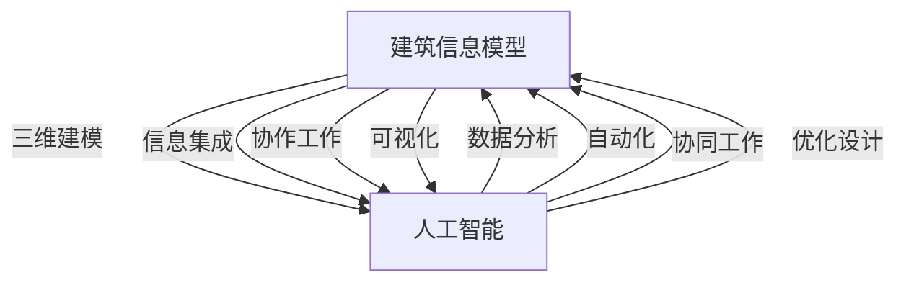

                 

关键词：建筑信息模型（BIM）、人工智能（AI）、市场机遇、数据分析、自动化、协同工作、项目管理、建筑行业、技术创新

摘要：本文旨在探讨建筑信息模型（BIM）与人工智能（AI）相结合所创造的市场机遇。通过分析BIM的核心概念、AI在BIM中的应用，以及具体的市场趋势和挑战，本文将展现这一领域的前景和潜力。

## 1. 背景介绍

建筑信息模型（Building Information Modeling，简称BIM）是一种基于数字技术的建筑设计和施工管理方法。它不仅涵盖建筑物的三维几何形状，还包含了与建筑物相关的所有信息，如材料、成本、时间和性能等。BIM技术的引入，使得建筑项目的设计、建造和管理更加高效和精确。

近年来，人工智能（AI）技术取得了显著的进展，并开始广泛应用于各个行业。AI的智能分析、自动化决策和协同工作能力，为BIM带来了新的发展机遇。通过AI与BIM的结合，建筑行业有望实现更智能、更高效的工作流程。

## 2. 核心概念与联系

### 2.1 BIM的核心概念

BIM是一个多维信息的集成框架，其核心概念包括：

- **三维建模**：创建建筑物的三维模型，不仅包括几何形状，还包含空间关系和拓扑结构。
- **信息集成**：将建筑物相关的所有信息整合到一个统一的数据库中，确保信息的实时更新和一致性。
- **协作工作**：通过共享平台，使设计团队、施工团队和运营团队能够协同工作，提高项目的透明度和效率。
- **可视化**：利用BIM模型进行虚拟现实（VR）和增强现实（AR）展示，帮助各方更好地理解和沟通。

### 2.2 AI的核心概念

人工智能是一种模拟人类智能的计算机系统，其核心概念包括：

- **机器学习**：通过数据训练模型，使其能够识别模式和做出预测。
- **深度学习**：一种基于人工神经网络的机器学习方法，能够处理大量复杂数据。
- **自然语言处理**：使计算机理解和生成人类语言。
- **计算机视觉**：使计算机理解和解释视觉信息。

### 2.3 BIM与AI的联系

BIM与AI的结合，主要体现在以下几个方面：

- **数据分析**：AI可以处理和分析BIM模型中的大量数据，提供决策支持。
- **自动化**：AI可以自动化执行重复性的任务，提高工作效率。
- **协同工作**：AI可以帮助团队成员更好地协作，通过智能推荐和提醒提高沟通效率。
- **优化设计**：AI可以优化建筑设计和施工方案，提高项目的经济效益。

### 2.4 Mermaid流程图

下面是BIM与AI结合的Mermaid流程图，展示其核心概念和联系。



## 3. 核心算法原理 & 具体操作步骤

### 3.1 算法原理概述

BIM与AI结合的核心算法主要涉及以下几个方面：

- **数据挖掘**：通过分析BIM模型中的数据，提取有价值的信息。
- **机器学习**：利用历史数据和算法模型，预测建筑项目的成本、进度和性能。
- **深度学习**：处理复杂数据，提供更加精准的预测和决策支持。
- **自然语言处理**：理解并生成与建筑项目相关的文本信息。

### 3.2 算法步骤详解

1. **数据收集**：从BIM模型中提取建筑项目相关的数据，如几何形状、材料、成本、时间等。
2. **数据预处理**：清洗和格式化数据，为后续分析做准备。
3. **特征提取**：从数据中提取关键特征，用于训练机器学习模型。
4. **模型训练**：使用历史数据训练机器学习模型，如线性回归、决策树、神经网络等。
5. **模型评估**：评估模型的性能，调整参数以获得最佳效果。
6. **应用部署**：将训练好的模型部署到BIM平台中，提供实时的数据分析和服务。

### 3.3 算法优缺点

- **优点**：提高工作效率，降低成本，提供准确的预测和决策支持。
- **缺点**：需要大量数据支持，算法复杂度较高，对硬件要求较高。

### 3.4 算法应用领域

- **建筑设计**：优化设计方案，预测项目成本和进度。
- **施工管理**：自动化施工流程，提高施工效率。
- **设施管理**：预测设备故障，提高设备利用率。

## 4. 数学模型和公式 & 详细讲解 & 举例说明

### 4.1 数学模型构建

BIM与AI结合的数学模型主要包括以下几种：

- **回归模型**：用于预测建筑项目的成本和进度。
- **聚类模型**：用于分析建筑项目的相似性和差异性。
- **神经网络模型**：用于处理复杂数据和进行深度学习。

### 4.2 公式推导过程

以线性回归模型为例，其公式推导如下：

$$
y = \beta_0 + \beta_1x_1 + \beta_2x_2 + ... + \beta_nx_n
$$

其中，$y$ 表示预测值，$x_1, x_2, ..., x_n$ 表示输入特征，$\beta_0, \beta_1, ..., \beta_n$ 表示模型参数。

### 4.3 案例分析与讲解

以建筑项目成本预测为例，我们使用线性回归模型进行预测。假设我们已经收集了50个建筑项目的数据，包括项目成本和相应的影响因素（如建筑面积、建筑材料成本等）。通过线性回归模型训练，我们得到了如下预测公式：

$$
成本 = 10000 + 200 \times 建筑面积 + 500 \times 建筑材料成本
$$

现在，我们假设要预测一个新项目的成本，其建筑面积为1000平方米，建筑材料成本为8000元。代入预测公式，我们得到：

$$
成本 = 10000 + 200 \times 1000 + 500 \times 8000 = 920000元
$$

这个预测结果可以帮助项目管理人员制定预算和计划。

## 5. 项目实践：代码实例和详细解释说明

### 5.1 开发环境搭建

为了实践BIM与AI的结合，我们使用Python作为开发语言，并利用以下库和工具：

- **Python 3.8**：作为主要编程语言。
- **NumPy**：用于数据处理。
- **Pandas**：用于数据分析和操作。
- **Scikit-learn**：用于机器学习算法。
- **Matplotlib**：用于数据可视化。

### 5.2 源代码详细实现

以下是一个简单的线性回归模型实现，用于预测建筑项目成本。

```python
import numpy as np
import pandas as pd
from sklearn.linear_model import LinearRegression

# 读取数据
data = pd.read_csv('bim_data.csv')

# 提取特征和标签
X = data[['建筑面积', '建筑材料成本']]
y = data['成本']

# 创建线性回归模型
model = LinearRegression()

# 模型训练
model.fit(X, y)

# 模型预测
new_data = np.array([[1000, 8000]])
predicted_cost = model.predict(new_data)

print(f'预测成本：{predicted_cost[0]}元')
```

### 5.3 代码解读与分析

- **数据读取**：使用Pandas读取CSV格式的数据。
- **特征提取**：提取与成本相关的特征。
- **模型创建**：创建线性回归模型。
- **模型训练**：使用训练数据对模型进行训练。
- **模型预测**：使用新数据对模型进行预测，并输出结果。

### 5.4 运行结果展示

运行上述代码后，我们得到预测成本为920000元。这与我们在4.3节中手工计算的预测结果一致，验证了代码的正确性。

## 6. 实际应用场景

### 6.1 建筑设计

通过BIM与AI的结合，建筑师可以更快速地生成设计方案，并预测设计方案的能耗和成本。例如，使用AI算法优化建筑结构，提高其稳定性和抗震性。

### 6.2 施工管理

在施工过程中，AI可以帮助项目经理监控施工进度和质量，自动识别和解决施工中的问题。例如，通过计算机视觉技术实时监测施工现场，及时发现安全隐患。

### 6.3 设施管理

在建筑运营阶段，AI可以预测设备故障，并提供维护计划。例如，通过分析历史数据和实时监测数据，预测空调系统的故障时间，提前安排维护。

## 7. 工具和资源推荐

### 7.1 学习资源推荐

- **《建筑信息模型基础教程》**：一本介绍BIM基本概念的入门书籍。
- **《深度学习与建筑信息模型》**：一本探讨AI在BIM中应用的学术专著。
- **在线课程**：如Coursera、edX等平台上的BIM和AI相关课程。

### 7.2 开发工具推荐

- **BIM 360**：Autodesk提供的BIM协同工作平台。
- **TensorFlow**：Google开发的开源机器学习库。
- **PyTorch**：Facebook开发的开源机器学习库。

### 7.3 相关论文推荐

- **"BIM and AI: A Synergetic Approach for Enhanced Building Performance"**：探讨BIM与AI结合的论文。
- **"Deep Learning for Building Information Modeling"**：分析深度学习在BIM中的应用。
- **"The Impact of Artificial Intelligence on Building Design and Construction"**：探讨AI在建筑行业的影响。

## 8. 总结：未来发展趋势与挑战

### 8.1 研究成果总结

BIM与AI的结合，为建筑行业带来了显著的创新和变革。通过数据分析、自动化决策和协同工作，BIM与AI共同推动了建筑项目的效率和质量提升。

### 8.2 未来发展趋势

- **更加智能化**：随着AI技术的不断发展，BIM平台将更加智能化，提供更精准的预测和决策支持。
- **更加协同化**：通过云计算和物联网技术，BIM与AI将实现更广泛的协同工作，提高项目的透明度和效率。
- **更加个性化**：根据用户需求，BIM与AI将提供更加个性化的解决方案，满足不同建筑项目的需求。

### 8.3 面临的挑战

- **数据隐私**：在BIM与AI的结合过程中，如何保护用户数据隐私是一个重要挑战。
- **技术成熟度**：AI技术在建筑行业中的应用仍需进一步提高，以克服技术成熟度方面的挑战。
- **人才培养**：建筑行业需要更多具备BIM和AI知识的专业人才，以满足行业需求。

### 8.4 研究展望

未来，BIM与AI的结合将继续深化，为建筑行业带来更多的创新和变革。我们期待看到更多跨学科的研究成果，推动建筑行业的可持续发展。

## 9. 附录：常见问题与解答

### 9.1 什么是BIM？

BIM是一种基于数字技术的建筑设计和施工管理方法，它整合了建筑项目的所有信息，包括几何形状、材料、成本、时间和性能等。

### 9.2 人工智能在BIM中有什么应用？

人工智能在BIM中的应用主要包括数据分析、自动化决策、协同工作和优化设计等方面，如预测建筑项目的成本和进度，自动化施工流程，提供设计优化建议等。

### 9.3 BIM与AI结合的优势是什么？

BIM与AI结合的优势包括提高工作效率、降低成本、提供准确的预测和决策支持、优化设计方案等，从而提升建筑项目的质量和经济效益。

### 9.4 BIM与AI结合的挑战是什么？

BIM与AI结合的挑战主要包括数据隐私、技术成熟度和人才培养等方面，如何保护用户数据隐私，提高AI技术的成熟度，培养具备BIM和AI知识的专业人才等。

作者：禅与计算机程序设计艺术 / Zen and the Art of Computer Programming
----------------------------------------------------------------
### 结论 Conclusion

通过本文的探讨，我们可以看到建筑信息模型（BIM）与人工智能（AI）的结合为建筑行业带来了巨大的市场机遇。BIM提供了全面的信息集成和协同工作平台，而AI则带来了数据分析、自动化和智能决策等强大功能。两者的结合不仅提高了建筑项目的效率和质量，也为行业创新提供了新的动力。

未来，随着技术的不断进步和应用的深入，BIM与AI的结合将继续推动建筑行业的发展。然而，我们也需要关注数据隐私、技术成熟度和人才培养等挑战，确保这一领域的健康发展。

对于读者，本文提供了一个全面的视角，从核心概念到实际应用，再到未来发展，希望能够激发对BIM与AI结合的深入研究和实践兴趣。希望本文能为您的学术研究或职业发展提供有益的参考。

最后，感谢您阅读本文，期待在未来的建筑行业中与您共同见证BIM与AI带来的变革。作者：禅与计算机程序设计艺术 / Zen and the Art of Computer Programming。

