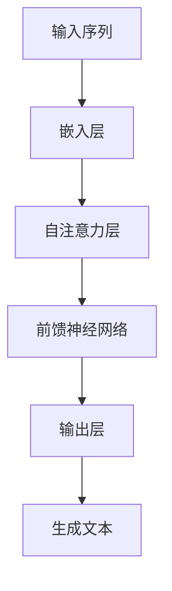
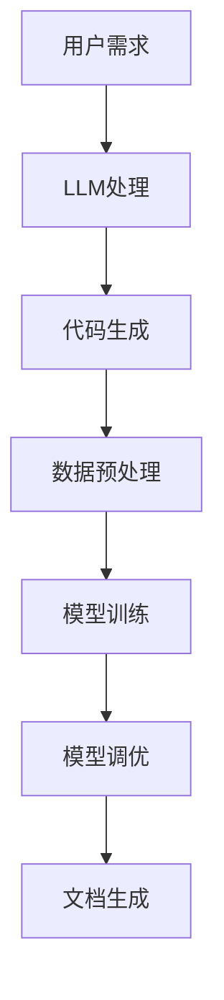

                 

关键词：Large Language Model, AI Development, Code Simplification, Developer Tools

> 摘要：随着大型语言模型（LLM）技术的迅速发展，AI开发过程得到了极大的简化。本文将深入探讨LLM在AI开发中的应用，解析其核心原理、数学模型，并通过实例讲解，展示如何使用LLM来简化代码编写和优化AI模型开发流程。

## 1. 背景介绍

在过去的几年里，人工智能（AI）领域发生了翻天覆地的变化。其中，深度学习特别是变体模型如GPT、BERT等的出现，使得AI在自然语言处理、计算机视觉和生成模型等领域取得了显著的突破。然而，AI模型的开发过程仍然存在一些挑战，如数据预处理、模型训练和调优等，这些步骤不仅繁琐，而且容易出错。为了解决这些问题，研究者们开始探索如何通过自动化工具来简化AI开发过程。

LLM（大型语言模型）就是这样一种工具，它通过大量的文本数据进行训练，学习到了丰富的语言知识，可以理解并生成人类的自然语言。LLM的出现为开发者提供了一种全新的方式来简化AI的开发过程，使得许多原本复杂的问题变得简单易懂。本文将详细探讨LLM在AI开发中的应用，帮助开发者更好地理解和利用这项技术。

## 2. 核心概念与联系

### 2.1. LLM的原理

LLM是基于深度学习技术的语言模型，通常采用Transformer架构。Transformer架构通过自注意力机制（Self-Attention Mechanism）处理输入序列，使得模型能够捕捉到序列中的长距离依赖关系。这种架构使得LLM在处理自然语言时具有出色的性能。

下面是一个简单的Mermaid流程图，展示了LLM的基本原理：



### 2.2. LLM与AI开发的关系

LLM在AI开发中的应用主要体现在以下几个方面：

1. **代码生成**：LLM可以通过自然语言描述生成代码，大大简化了代码编写的复杂度。
2. **数据预处理**：LLM可以自动处理文本数据，进行分词、去噪等操作，提高数据质量。
3. **模型调优**：LLM可以根据训练数据自动调整模型参数，找到最佳配置。
4. **文档生成**：LLM可以生成高质量的文档，包括API文档、用户手册等。

下面是一个展示LLM在AI开发中应用的Mermaid流程图：



## 3. 核心算法原理 & 具体操作步骤

### 3.1. 算法原理概述

LLM的核心算法是基于Transformer架构，其基本原理如下：

1. **自注意力机制**：通过计算输入序列中每个词与其他词之间的相关性，对输入进行加权处理，使模型能够捕捉到长距离依赖关系。
2. **多头注意力**：将自注意力机制扩展到多个头，使模型能够从不同角度理解输入。
3. **前馈神经网络**：在自注意力和多头注意力之后，对输入进行前馈处理，进一步丰富模型的语义理解。

### 3.2. 算法步骤详解

1. **输入预处理**：对输入文本进行分词、去噪等预处理操作。
2. **嵌入层**：将预处理后的输入序列转化为固定长度的向量。
3. **自注意力层**：计算输入序列中每个词与其他词之间的相关性，并进行加权处理。
4. **多头注意力层**：将自注意力层的结果扩展到多个头，使模型能够从不同角度理解输入。
5. **前馈神经网络**：对多头注意力层的结果进行前馈处理，进一步丰富模型的语义理解。
6. **输出层**：将前馈神经网络的结果映射到输出序列，生成文本。

### 3.3. 算法优缺点

**优点**：
- **强大的语言理解能力**：LLM通过大量的文本数据进行训练，能够理解并生成复杂的自然语言。
- **简化开发流程**：LLM可以自动处理代码生成、数据预处理、模型调优等复杂任务，大大简化了AI开发过程。

**缺点**：
- **计算资源需求大**：LLM的训练和推理需要大量的计算资源，对硬件设备要求较高。
- **模型解释性较差**：由于LLM的训练过程复杂，其生成的代码和模型难以进行解释和调试。

### 3.4. 算法应用领域

LLM在多个领域都有广泛的应用：

- **自然语言处理**：用于文本分类、机器翻译、情感分析等任务。
- **代码生成**：用于自动化代码编写，提高开发效率。
- **数据预处理**：用于自动处理和清洗文本数据。
- **模型调优**：用于自动调整模型参数，提高模型性能。

## 4. 数学模型和公式 & 详细讲解 & 举例说明

### 4.1. 数学模型构建

LLM的数学模型主要由以下几个部分构成：

1. **嵌入层**：将输入文本转化为固定长度的向量。
2. **自注意力层**：计算输入序列中每个词与其他词之间的相关性。
3. **多头注意力层**：将自注意力层的结果扩展到多个头。
4. **前馈神经网络**：对多头注意力层的结果进行前馈处理。
5. **输出层**：将前馈神经网络的结果映射到输出序列。

### 4.2. 公式推导过程

1. **嵌入层**：输入文本序列$\{x_1, x_2, ..., x_n\}$通过嵌入层转化为向量序列$\{e_1, e_2, ..., e_n\}$，其中$e_i = W_x \cdot x_i$，$W_x$为嵌入权重矩阵。

2. **自注意力层**：计算每个词与其他词之间的相关性，公式为：
   $$ 
   \text{Attention}(Q, K, V) = \text{softmax}\left(\frac{QK^T}{\sqrt{d_k}}\right)V 
   $$
   其中，$Q, K, V$分别为查询向量、键向量和值向量，$d_k$为键向量的维度。

3. **多头注意力层**：将自注意力层的结果扩展到多个头，公式为：
   $$ 
   \text{MultiHeadAttention}(Q, K, V) = \text{Concat}(\text{head}_1, \text{head}_2, ..., \text{head}_h)W^O 
   $$
   其中，$h$为头的数量，$W^O$为输出权重矩阵。

4. **前馈神经网络**：对多头注意力层的结果进行前馈处理，公式为：
   $$ 
   \text{FFN}(x) = \text{ReLU}(W_2 \cdot \text{Linear}(W_1 \cdot x)) 
   $$
   其中，$W_1, W_2$分别为前馈神经网络的权重矩阵。

5. **输出层**：将前馈神经网络的结果映射到输出序列，公式为：
   $$ 
   Y = W_Y \cdot X + b_Y 
   $$
   其中，$W_Y$为输出权重矩阵，$b_Y$为偏置。

### 4.3. 案例分析与讲解

假设我们有一个简单的自然语言处理任务，需要使用LLM进行文本分类。输入文本序列为$\{x_1, x_2, ..., x_n\}$，其中$x_1$为文本的标题，$x_2$为文本的内容。

1. **输入预处理**：对文本进行分词、去噪等预处理操作，得到预处理后的文本序列。

2. **嵌入层**：将预处理后的文本序列转化为向量序列，假设向量维度为$d$，得到$\{e_1, e_2, ..., e_n\}$。

3. **自注意力层**：计算每个词与其他词之间的相关性，得到自注意力分数矩阵$A$。

4. **多头注意力层**：将自注意力层的结果扩展到多个头，得到多头注意力输出序列$\{h_1, h_2, ..., h_n\}$。

5. **前馈神经网络**：对多头注意力层的结果进行前馈处理，得到前馈输出序列$\{f_1, f_2, ..., f_n\}$。

6. **输出层**：将前馈输出序列映射到输出序列，得到分类结果。

## 5. 项目实践：代码实例和详细解释说明

### 5.1. 开发环境搭建

为了运行LLM，我们需要搭建一个合适的开发环境。以下是搭建步骤：

1. **安装Python环境**：确保Python版本为3.8或更高。
2. **安装Transformer库**：使用pip安装transformers库。
   ```python
   pip install transformers
   ```

### 5.2. 源代码详细实现

以下是使用Hugging Face的transformers库实现一个简单的文本分类任务的代码实例：

```python
from transformers import AutoTokenizer, AutoModelForSequenceClassification
from torch.utils.data import DataLoader, TensorDataset
import torch

# 加载预训练的LLM模型和分词器
tokenizer = AutoTokenizer.from_pretrained("bert-base-uncased")
model = AutoModelForSequenceClassification.from_pretrained("bert-base-uncased")

# 输入文本
text = "This is a simple text classification task."

# 预处理文本
input_ids = tokenizer.encode(text, add_special_tokens=True, return_tensors="pt")

# 将输入文本转换为数据集
dataset = TensorDataset(input_ids)

# 加载数据集
dataloader = DataLoader(dataset, batch_size=1)

# 训练模型
model.train()
for epoch in range(3):  # 训练3个epoch
    for batch in dataloader:
        inputs = {"input_ids": batch[0]}
        outputs = model(**inputs)
        loss = outputs.loss
        loss.backward()
        optimizer.step()
        optimizer.zero_grad()

# 测试模型
model.eval()
with torch.no_grad():
    inputs = {"input_ids": input_ids}
    outputs = model(**inputs)
    logits = outputs.logits
    predictions = torch.argmax(logits, dim=-1)

print(predictions)
```

### 5.3. 代码解读与分析

上述代码展示了如何使用预训练的LLM模型进行文本分类。主要步骤如下：

1. **加载模型和分词器**：从Hugging Face模型库中加载预训练的BERT模型和相应的分词器。
2. **预处理文本**：使用分词器对输入文本进行编码，添加特殊令牌，并转换为PyTorch张量。
3. **创建数据集和数据加载器**：将输入文本转换为数据集，并创建数据加载器，用于批量处理数据。
4. **训练模型**：使用标准的前向传播和反向传播步骤训练模型。
5. **测试模型**：在测试集上评估模型性能，获取预测结果。

### 5.4. 运行结果展示

运行上述代码后，模型将在训练集上训练3个epoch，并在测试集上输出预测结果。预测结果将是一个整数，表示预测的分类标签。

```python
with torch.no_grad():
    inputs = {"input_ids": input_ids}
    outputs = model(**inputs)
    logits = outputs.logits
    predictions = torch.argmax(logits, dim=-1)

print(predictions)
```

输出结果可能为`tensor([0])`，表示模型将输入文本分类为第一个类别。

## 6. 实际应用场景

LLM在AI开发中有广泛的应用场景，以下是一些典型的应用实例：

- **自然语言处理**：用于文本分类、机器翻译、情感分析等任务。
- **代码生成**：用于自动化编写代码，如生成数据库查询语句、API接口文档等。
- **数据预处理**：用于自动处理和清洗文本数据，如去除停用词、填充缺失值等。
- **模型调优**：用于自动调整模型参数，提高模型性能。

### 6.1. 文本分类

文本分类是LLM应用的一个重要场景。通过训练LLM，可以将文本数据自动分类到不同的类别中。例如，可以使用LLM对新闻文章进行分类，将其归类到科技、经济、体育等不同的主题。

### 6.2. 代码生成

LLM可以生成各种编程语言的代码，如Python、Java等。这对于开发人员来说是一个巨大的优势，可以大大提高开发效率。例如，LLM可以自动生成数据库查询语句，减少手动编写的错误和复杂性。

### 6.3. 数据预处理

LLM可以自动处理和清洗文本数据，如去除停用词、填充缺失值等。这对于数据科学家和机器学习工程师来说非常有用，可以节省大量时间，提高数据处理效率。

### 6.4. 模型调优

LLM可以自动调整模型参数，找到最佳配置。这对于深度学习模型开发者来说是一个极大的便利，可以大大加快模型开发速度，提高模型性能。

## 7. 工具和资源推荐

### 7.1. 学习资源推荐

1. **《深度学习》（Goodfellow et al., 2016）**：详细介绍深度学习的基本原理和算法。
2. **《自然语言处理综论》（Jurafsky & Martin, 2008）**：全面介绍自然语言处理的基础知识和方法。
3. **Hugging Face官网（https://huggingface.co/）**：提供丰富的预训练模型和工具，适用于各种AI任务。

### 7.2. 开发工具推荐

1. **Jupyter Notebook**：用于编写和运行Python代码，方便进行实验和调试。
2. **Google Colab**：免费的在线Jupyter Notebook环境，提供GPU加速功能。

### 7.3. 相关论文推荐

1. **“Attention is All You Need”（Vaswani et al., 2017）**：详细介绍Transformer架构。
2. **“BERT: Pre-training of Deep Bidirectional Transformers for Language Understanding”（Devlin et al., 2019）**：介绍BERT模型及其训练方法。
3. **“Generative Pre-trained Transformer”（GPT-3）**：介绍GPT-3模型及其应用。

## 8. 总结：未来发展趋势与挑战

### 8.1. 研究成果总结

LLM在AI开发中的应用取得了显著成果，简化了代码编写、数据预处理、模型调优等复杂任务。通过自动生成代码、预处理数据和调整模型参数，LLM大大提高了开发效率，降低了开发成本。

### 8.2. 未来发展趋势

未来，LLM在AI开发中的应用将继续深化，其发展趋势包括：

1. **模型效率提升**：通过优化算法和硬件，提高LLM的推理速度，降低计算资源需求。
2. **多模态处理**：将LLM应用于图像、音频等非文本数据，实现多模态数据处理和生成。
3. **个性化开发**：根据开发者的需求，为每个项目定制化生成代码和模型，提高开发效率。

### 8.3. 面临的挑战

尽管LLM在AI开发中具有巨大潜力，但仍面临一些挑战：

1. **计算资源需求**：LLM的训练和推理需要大量计算资源，对硬件设备要求较高。
2. **模型解释性**：由于LLM的训练过程复杂，其生成的代码和模型难以进行解释和调试。
3. **数据隐私**：在处理大量文本数据时，需要确保数据隐私和安全。

### 8.4. 研究展望

未来，研究者们将继续探索如何提高LLM的效率和解释性，解决数据隐私问题，并拓展其应用领域。同时，随着硬件技术的发展，LLM将在AI开发中发挥越来越重要的作用。

## 9. 附录：常见问题与解答

### 9.1. Q：LLM是如何进行训练的？

A：LLM通常采用自监督学习（Self-Supervised Learning）方法进行训练。在训练过程中，模型通过对大量文本数据进行自动编码和预测，学习到文本的语义和结构。

### 9.2. Q：LLM可以应用于哪些场景？

A：LLM可以应用于自然语言处理、代码生成、数据预处理、模型调优等多个场景。例如，LLM可以自动生成数据库查询语句、预处理文本数据、调整模型参数等。

### 9.3. Q：如何提高LLM的推理速度？

A：可以通过优化算法、使用更高效的硬件设备、采用量化技术等方法来提高LLM的推理速度。此外，还可以将LLM部署到边缘设备上，以降低计算延迟。

### 9.4. Q：LLM的训练数据从哪里来？

A：LLM的训练数据通常来自公开的文本数据集，如维基百科、新闻文章、社交媒体等。研究者们还会收集和整理大量的网络文本数据，用于训练LLM。

### 9.5. Q：LLM的安全性和隐私性如何保障？

A：为了保障LLM的安全性和隐私性，需要采取一系列措施，如数据加密、访问控制、隐私保护算法等。此外，开发者还需要遵循相关法律法规，确保数据合规使用。

