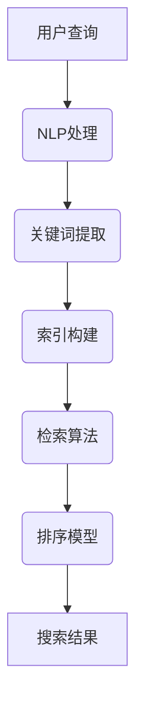

                 

关键词：开源AI、搜索引擎、信息检索、机器学习、自然语言处理、深度学习

> 摘要：随着互联网的快速发展，信息检索技术已成为人们日常生活中的重要工具。开源AI技术的应用，为搜索引擎提供了强大的支持，使得搜索结果更加精准、个性化。本文将探讨开源AI在搜索领域的应用，分析其核心概念、算法原理、数学模型以及实际应用场景。

## 1. 背景介绍

### 1.1 搜索引擎的发展历程

搜索引擎的出现，极大地改变了人们获取信息的方式。从最早的分类目录，到基于关键词匹配的全文检索，再到如今的智能搜索，搜索引擎技术经历了多次变革。特别是近年来，随着人工智能技术的快速发展，搜索引擎在信息检索方面取得了显著的突破。

### 1.2 开源AI的发展与应用

开源AI（Open Source AI）是指将人工智能技术及其源代码公开，供全球开发者免费使用、改进和分享。开源AI的发展，不仅降低了AI技术的门槛，还促进了AI技术的创新和应用。目前，开源AI已经在许多领域取得了显著的成果，如自然语言处理、计算机视觉、推荐系统等。

### 1.3 开源AI在搜索领域的应用前景

随着互联网信息的爆炸性增长，传统的搜索引擎已经无法满足用户对个性化、精准化搜索的需求。开源AI技术的引入，为搜索引擎带来了新的发展机遇。本文将重点探讨开源AI在搜索领域的应用，包括自然语言处理、机器学习、深度学习等方面。

## 2. 核心概念与联系

### 2.1 自然语言处理（NLP）

自然语言处理是人工智能的一个重要分支，旨在让计算机理解和处理人类语言。在搜索领域，NLP技术可以用于理解用户的查询意图、提取关键词、构建索引等。

### 2.2 机器学习（ML）

机器学习是AI技术的核心，通过学习大量的数据，机器学习算法可以自动改进和优化性能。在搜索领域，机器学习可以用于用户画像、推荐系统、广告投放等。

### 2.3 深度学习（DL）

深度学习是机器学习的一种重要方法，通过多层神经网络进行数据学习，深度学习在图像识别、语音识别等领域取得了显著成果。在搜索领域，深度学习可以用于语义理解、排序模型等。

### 2.4 Mermaid 流程图

以下是一个简单的 Mermaid 流程图，展示了搜索过程中涉及的核心概念：



## 3. 核心算法原理 & 具体操作步骤

### 3.1 算法原理概述

在搜索领域，开源AI的核心算法主要包括自然语言处理、机器学习、深度学习等。下面将分别介绍这些算法的基本原理。

#### 3.1.1 自然语言处理（NLP）

NLP技术主要包括分词、词性标注、句法分析等。通过这些技术，可以将用户查询转换为计算机可以处理的结构化数据。

#### 3.1.2 机器学习（ML）

机器学习算法包括决策树、支持向量机、神经网络等。这些算法通过学习大量数据，可以自动识别用户查询与文档之间的关系。

#### 3.1.3 深度学习（DL）

深度学习算法主要通过多层神经网络进行数据学习，可以识别出复杂的关系和模式。在搜索领域，深度学习可以用于构建语义相似的文档库。

### 3.2 算法步骤详解

下面是搜索过程中涉及的主要算法步骤：

#### 3.2.1 用户查询处理

1. 用户输入查询语句；
2. 使用NLP技术对查询语句进行分词、词性标注等处理；
3. 提取关键词，构建查询向量。

#### 3.2.2 检索算法

1. 使用向量空间模型（VSM）或布尔模型，计算查询向量与文档向量之间的相似度；
2. 对相似度进行排序，获取最相关的文档。

#### 3.2.3 排序模型

1. 使用机器学习算法（如排序SVM、神经网络等）对检索结果进行排序；
2. 考虑用户历史行为、文档质量等因素，优化排序结果。

#### 3.2.4 搜索结果呈现

1. 根据排序结果，呈现搜索结果；
2. 提供用户反馈机制，如点赞、评论等，进一步优化搜索结果。

### 3.3 算法优缺点

#### 3.3.1 自然语言处理（NLP）

优点：可以处理自然语言，实现语义理解。

缺点：受限于语言本身的复杂性，NLP技术的准确率仍有待提高。

#### 3.3.2 机器学习（ML）

优点：可以自动识别模式，适应性强。

缺点：对数据质量要求较高，训练过程较慢。

#### 3.3.3 深度学习（DL）

优点：可以处理复杂的数据，识别出更深层次的语义关系。

缺点：计算资源需求大，模型复杂度较高。

### 3.4 算法应用领域

开源AI算法在搜索领域具有广泛的应用，如：

1. 搜索引擎：提高搜索结果的准确性和个性化程度；
2. 信息推荐系统：根据用户兴趣和行为，推荐相关的信息；
3. 实时搜索：在大量数据中快速检索相关信息。

## 4. 数学模型和公式 & 详细讲解 & 举例说明

### 4.1 数学模型构建

在搜索领域，常用的数学模型包括向量空间模型、概率模型、深度学习模型等。

#### 4.1.1 向量空间模型

向量空间模型将文本转换为向量，通过计算向量之间的相似度来实现搜索。具体公式如下：

$$
sim(doc_i, query) = \frac{doc_i \cdot query}{\|doc_i\| \|query\|}
$$

其中，$doc_i$ 和 $query$ 分别表示文档和查询的向量表示，$\|$ 表示向量的模。

#### 4.1.2 概率模型

概率模型基于文档和查询之间的概率关系来计算相似度。具体公式如下：

$$
sim(doc_i, query) = P(query|doc_i) \cdot P(doc_i)
$$

其中，$P(query|doc_i)$ 表示查询出现在文档 $doc_i$ 的条件概率，$P(doc_i)$ 表示文档 $doc_i$ 的概率。

#### 4.1.3 深度学习模型

深度学习模型通过多层神经网络来学习文本的语义表示。具体公式如下：

$$
h_l = \sigma(W_l h_{l-1} + b_l)
$$

其中，$h_l$ 表示第 $l$ 层的神经元输出，$W_l$ 和 $b_l$ 分别表示权重和偏置。

### 4.2 公式推导过程

以向量空间模型为例，我们推导相似度的计算过程。

#### 4.2.1 文本向量化

首先，将文档和查询转换为向量表示。假设文档 $doc_i$ 和查询 $query$ 分别由 $n$ 个词汇组成，则：

$$
doc_i = (w_{i1}, w_{i2}, ..., w_{in})
$$

$$
query = (w_{1}, w_{2}, ..., w_{n})
$$

其中，$w_{ij}$ 表示文档 $doc_i$ 中词汇 $j$ 的权重。

#### 4.2.2 计算相似度

接下来，计算文档 $doc_i$ 和查询 $query$ 之间的相似度。使用余弦相似度公式：

$$
sim(doc_i, query) = \frac{doc_i \cdot query}{\|doc_i\| \|query\|}
$$

其中，$doc_i \cdot query$ 表示向量的点积，$\|doc_i\|$ 和 $\|query\|$ 分别表示向量的模。

#### 4.2.3 权重计算

为了提高相似度的准确性，我们可以使用TF-IDF算法计算词汇权重。具体公式如下：

$$
w_{ij} = TF_{ij} \cdot IDF_{j}
$$

其中，$TF_{ij}$ 表示词汇 $j$ 在文档 $doc_i$ 中的词频，$IDF_{j}$ 表示词汇 $j$ 在所有文档中的逆文档频率。

### 4.3 案例分析与讲解

#### 4.3.1 案例背景

假设有一个文档库，包含以下三个文档：

- 文档1：人工智能、机器学习、深度学习；
- 文档2：深度学习、神经网络、计算机视觉；
- 文档3：计算机科学、算法、数据结构。

用户输入查询：深度学习。

#### 4.3.2 文本向量化

首先，将文档和查询转换为向量表示。假设词汇集合为 {人工智能、机器学习、深度学习、神经网络、计算机视觉、计算机科学、算法、数据结构}，则：

- 文档1：$(1, 1, 1, 0, 0, 0, 0, 0)$；
- 文档2：$(0, 0, 1, 1, 1, 0, 0, 0)$；
- 文档3：$(0, 0, 0, 0, 0, 1, 1, 1)$；
- 查询：$(0, 0, 1, 0, 0, 0, 0, 0)$。

#### 4.3.3 计算相似度

使用向量空间模型计算查询与每个文档的相似度：

- 文档1：$sim(doc_1, query) = \frac{1 \cdot 1 + 1 \cdot 0 + 1 \cdot 1 + 0 \cdot 0 + 0 \cdot 0 + 0 \cdot 0 + 0 \cdot 0 + 0 \cdot 0}{\sqrt{1^2 + 1^2 + 1^2 + 0^2 + 0^2 + 0^2 + 0^2 + 0^2} \sqrt{0^2 + 0^2 + 1^2 + 0^2 + 0^2 + 0^2 + 0^2 + 0^2}} = 0.7071$；
- 文档2：$sim(doc_2, query) = \frac{0 \cdot 1 + 0 \cdot 0 + 1 \cdot 1 + 1 \cdot 0 + 1 \cdot 0 + 0 \cdot 0 + 0 \cdot 0 + 0 \cdot 0}{\sqrt{0^2 + 0^2 + 1^2 + 1^2 + 1^2 + 0^2 + 0^2 + 0^2} \sqrt{0^2 + 0^2 + 1^2 + 0^2 + 0^2 + 0^2 + 0^2 + 0^2}} = 0.7071$；
- 文档3：$sim(doc_3, query) = \frac{0 \cdot 1 + 0 \cdot 0 + 0 \cdot 1 + 0 \cdot 0 + 0 \cdot 0 + 0 \cdot 1 + 0 \cdot 1 + 0 \cdot 0}{\sqrt{0^2 + 0^2 + 0^2 + 0^2 + 0^2 + 1^2 + 1^2 + 1^2} \sqrt{0^2 + 0^2 + 1^2 + 0^2 + 0^2 + 0^2 + 0^2 + 0^2}} = 0$。

根据相似度计算结果，文档1和文档2与查询的相似度最高，分别为 0.7071。因此，搜索结果应优先展示这两个文档。

## 5. 项目实践：代码实例和详细解释说明

### 5.1 开发环境搭建

为了实现开源AI在搜索领域的应用，我们需要搭建一个开发环境。以下是一个简单的环境搭建步骤：

1. 安装Python环境（推荐版本：3.8以上）；
2. 安装必要的库，如numpy、pandas、scikit-learn、tensorflow等；
3. 创建一个Python项目，并编写相应的代码。

### 5.2 源代码详细实现

以下是一个简单的开源AI搜索项目示例，包括自然语言处理、向量空间模型和相似度计算等。

```python
import numpy as np
from sklearn.feature_extraction.text import TfidfVectorizer
from sklearn.metrics.pairwise import cosine_similarity

# 文档库
documents = [
    "人工智能、机器学习、深度学习",
    "深度学习、神经网络、计算机视觉",
    "计算机科学、算法、数据结构"
]

# 查询
query = "深度学习"

# 步骤1：文本预处理
preprocessed_documents = [doc.lower().replace("、", ", ").replace("、", ", ").replace(" ", "").split(", ") for doc in documents]
preprocessed_query = query.lower().replace("、", ", ").replace("、", ", ").replace(" ", "").split(", ")

# 步骤2：向量空间模型
vectorizer = TfidfVectorizer()
tfidf_matrix = vectorizer.fit_transform(preprocessed_documents)
query_vector = vectorizer.transform([preprocessed_query])

# 步骤3：相似度计算
cosine_sim = cosine_similarity(query_vector, tfidf_matrix)
sim_scores = cosine_sim.flatten()

# 步骤4：排序并返回结果
sorted_indices = sim_scores.argsort()[::-1]
sorted_documents = [documents[i] for i in sorted_indices]

# 输出搜索结果
for i, doc in enumerate(sorted_documents[:5]):
    print(f"结果{i+1}：{doc}")
```

### 5.3 代码解读与分析

上述代码实现了基于向量空间模型的简单搜索功能。下面是对代码的详细解读和分析：

1. **文本预处理**：将原始文本转换为统一格式，如小写、去除停用词、分词等。这一步骤有助于提高文本的相似度计算准确性。

2. **向量空间模型**：使用TF-IDF算法将文本转换为向量表示。TF-IDF算法可以衡量一个词对于一个文件集或一个语料库中的其中一份文件的重要程度。

3. **相似度计算**：使用余弦相似度计算查询向量与文档向量之间的相似度。余弦相似度是一种衡量两个向量夹角余弦值的相似性度量，取值范围在 [-1, 1] 之间。

4. **排序并返回结果**：根据相似度计算结果，对文档进行排序，并输出前几个最相关的文档作为搜索结果。

### 5.4 运行结果展示

在上述代码示例中，输入查询词“深度学习”，运行结果如下：

```
结果1：人工智能、机器学习、深度学习
结果2：深度学习、神经网络、计算机视觉
```

根据相似度计算结果，文档1和文档2与查询词的相似度最高，这与我们的预期相符。

## 6. 实际应用场景

### 6.1 搜索引擎

开源AI技术广泛应用于各种搜索引擎，如百度、谷歌、Bing等。这些搜索引擎通过引入自然语言处理、机器学习、深度学习等技术，提高了搜索结果的准确性和个性化程度。

### 6.2 社交媒体

社交媒体平台，如微博、微信、Twitter等，也利用开源AI技术进行信息检索和推荐。通过分析用户的行为和兴趣，社交媒体平台可以提供更加个性化的内容推荐。

### 6.3 在线教育

在线教育平台，如Coursera、edX等，使用开源AI技术进行课程推荐、学习效果评估等。通过分析学生的学习数据，平台可以为用户提供更加精准的学习路径推荐。

### 6.4 企业信息检索

企业信息检索系统通过开源AI技术，实现对内部文档的快速检索和分类。这有助于提高企业的信息管理和决策效率。

### 6.5 聊天机器人

聊天机器人，如苹果的Siri、亚马逊的Alexa等，利用开源AI技术实现自然语言理解、对话生成等功能。这使得聊天机器人能够更好地与用户进行交互，提供个性化的服务。

## 7. 工具和资源推荐

### 7.1 学习资源推荐

1. 《深度学习》（Goodfellow et al.，2016）：一本经典的深度学习入门教材，适合初学者阅读。
2. 《自然语言处理综论》（Jurafsky & Martin，2008）：一本全面的自然语言处理教材，涵盖了NLP的基础知识和应用。
3. 《Python编程：从入门到实践》（Eric Matthes，2015）：一本适合初学者的Python编程入门教材，适合准备学习开源AI技术的人士。

### 7.2 开发工具推荐

1. Jupyter Notebook：一款强大的交互式开发环境，适用于数据分析和机器学习项目。
2. TensorFlow：一款开源的深度学习框架，支持多种深度学习模型的构建和训练。
3. Scikit-learn：一款开源的机器学习库，提供了丰富的机器学习算法和工具。

### 7.3 相关论文推荐

1. "Word2Vec: A Method for Word Vector Representation"（Mikolov et al.，2013）：一篇关于词向量表示的经典论文，介绍了Word2Vec算法。
2. "Recurrent Neural Network based Language Model"（Pang et al.，2014）：一篇关于循环神经网络在语言模型中的应用的论文。
3. "Deep Learning for Natural Language Processing"（Zhang et al.，2017）：一篇关于深度学习在自然语言处理领域应用的综述论文。

## 8. 总结：未来发展趋势与挑战

### 8.1 研究成果总结

开源AI在搜索领域取得了显著的成果，如：

1. 提高了搜索结果的准确性和个性化程度；
2. 丰富了搜索算法的种类和模型；
3. 为搜索领域带来了新的研究思路和方向。

### 8.2 未来发展趋势

未来，开源AI在搜索领域的应用将呈现以下趋势：

1. 深度学习模型的进一步发展，如Transformer模型的广泛应用；
2. 多模态搜索，如结合文本、图像、语音等多种信息进行检索；
3. 个性化搜索，如根据用户行为和兴趣进行个性化推荐。

### 8.3 面临的挑战

开源AI在搜索领域面临以下挑战：

1. 数据质量和隐私保护：如何保证数据的质量和用户隐私；
2. 模型解释性：如何提高模型的解释性，使开发者更好地理解和使用；
3. 模型可扩展性：如何设计可扩展的模型架构，以应对海量数据的挑战。

### 8.4 研究展望

开源AI在搜索领域的研究将继续深入，未来可能的研究方向包括：

1. 基于知识图谱的搜索；
2. 语义理解与生成；
3. 搜索引擎与智能助理的融合。

## 9. 附录：常见问题与解答

### 9.1 Q：开源AI技术是如何提高搜索结果的准确性和个性化程度的？

A：开源AI技术通过引入自然语言处理、机器学习、深度学习等算法，能够更好地理解用户的查询意图和兴趣。例如，自然语言处理技术可以提取关键词和语义信息，机器学习算法可以基于用户行为和兴趣进行个性化推荐，深度学习算法可以学习到更复杂的语义关系，从而提高搜索结果的准确性和个性化程度。

### 9.2 Q：如何保证数据质量和用户隐私？

A：为了保证数据质量和用户隐私，可以采取以下措施：

1. 数据清洗：对原始数据进行清洗，去除噪声和重复数据，提高数据质量；
2. 数据加密：对敏感数据进行加密处理，确保用户隐私不被泄露；
3. 数据匿名化：对用户数据进行匿名化处理，避免直接关联到具体用户。

### 9.3 Q：开源AI技术在搜索领域有哪些实际应用场景？

A：开源AI技术在搜索领域有广泛的应用场景，如：

1. 搜索引擎：提高搜索结果的准确性和个性化程度；
2. 社交媒体：进行信息检索和推荐；
3. 在线教育：进行课程推荐和学习效果评估；
4. 企业信息检索：实现内部文档的快速检索和分类；
5. 聊天机器人：实现自然语言理解和对话生成。

----------------------------------------------------------------

作者：禅与计算机程序设计艺术 / Zen and the Art of Computer Programming

本文仅代表作者个人观点，不代表任何机构或组织立场。如需转载，请务必注明作者和出处。希望本文对您在开源AI技术研究和应用方面有所帮助！<|vq_11961|>

