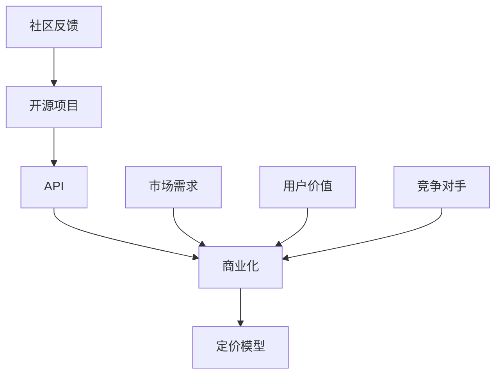

                 

 开源项目一直是技术创新的重要推动力，它们为开发者提供了丰富的资源，降低了研发成本，加速了软件开发的进程。然而，随着商业需求的增加，越来越多的开源项目开始考虑如何将API商业化，以实现可持续发展。本文将探讨开源项目的API商业化策略和定价模型，帮助项目维护者找到合适的商业化路径。

## 1. 背景介绍

开源项目的API商业化是一个复杂的议题。一方面，开源项目依赖于社区的贡献和支持，希望保持其开放性和透明性；另一方面，商业化可能会带来资金支持，有助于项目的长期发展。API商业化涉及多个方面，包括策略制定、定价模型设计、用户权益保护等。

### 开源项目的重要性

开源项目不仅在技术层面上推动了软件发展的进步，还在商业层面上为企业提供了大量创新的机会。例如，开源技术栈（如LAMP、MEAN）已成为许多企业的标准配置，而一些成功的商业软件也直接或间接地借鉴了开源项目的技术框架。此外，开源社区为项目维护者提供了宝贵的反馈，促进了技术的不断改进。

### API商业化的必要性

开源项目的商业化有助于确保项目的持续发展。API商业化不仅可以为项目提供资金支持，还可以通过盈利模式探索新的商业机会。例如，一些企业通过API服务获得收入，将其作为核心产品的一部分，从而扩大市场覆盖。

### 挑战与争议

开源项目的API商业化也引发了一些争议。一方面，商业化可能会影响开源精神，使得项目变得封闭；另一方面，定价策略不当可能会导致用户流失，影响项目的生态。因此，如何在商业化与开源精神之间找到平衡点，是项目维护者面临的一大挑战。

## 2. 核心概念与联系

为了深入探讨开源项目的API商业化，我们需要理解几个核心概念，包括API、商业化、定价模型等。

### API

API（应用程序编程接口）是一种允许应用程序互相通信的接口。在开源项目中，API通常提供了一种标准化的方式，使开发者能够轻松地集成和扩展项目功能。API的开放性是开源项目的一大特点，它使得开发者可以自由地使用、修改和分发代码。

### 商业化

商业化是指将开源项目转化为盈利模式的过程。在开源项目中，商业化可以通过多种方式实现，如提供付费API服务、销售相关产品或服务、赞助等。

### 定价模型

定价模型是商业化过程中的关键环节。一个合理的定价模型不仅能为项目带来收益，还能保持项目的可持续性。定价模型的设计需要考虑市场需求、用户价值、竞争对手等因素。

### 关联图

为了更好地理解这些概念之间的联系，我们可以使用Mermaid流程图来展示它们之间的关系：



## 3. 核心算法原理 & 具体操作步骤

### 3.1 算法原理概述

开源项目的API商业化需要一套合理的策略和定价模型。这些策略和模型需要综合考虑市场需求、用户价值、竞争对手等因素。核心算法原理主要包括以下几个步骤：

1. **市场调研**：了解市场需求和用户需求，确定API的商业价值。
2. **定价策略设计**：根据市场调研结果，设计合理的定价策略。
3. **用户权益保护**：确保用户在使用API时的权益得到保护。
4. **商业模式探索**：探索多种商业模式，找到最适合项目的盈利模式。
5. **持续优化**：根据市场反馈和运营数据，不断调整和优化商业化策略。

### 3.2 算法步骤详解

1. **市场调研**

   市场调研是制定商业化策略的第一步。通过问卷调查、用户访谈、市场数据分析等方式，了解目标用户的需求和痛点。这一步骤的关键是获取准确、可靠的数据，为后续的定价策略设计提供依据。

2. **定价策略设计**

   定价策略设计需要考虑多个因素，包括成本、市场需求、用户价值等。常见的定价策略有基于订阅的定价、基于流量的定价、基于功能的定价等。项目维护者可以根据具体情况进行选择。

3. **用户权益保护**

   用户权益保护是商业化过程中不可忽视的一环。在定价策略设计时，需要充分考虑用户的利益，确保他们能够合理地使用API，并在必要时得到支持。

4. **商业模式探索**

   商业模式探索是寻找最适合项目的盈利模式。常见的商业模式有API服务、销售相关产品、赞助等。项目维护者可以根据项目特点和市场需求，选择合适的商业模式。

5. **持续优化**

   持续优化是商业化过程中的关键。通过收集市场反馈和运营数据，项目维护者可以不断调整和优化商业化策略，以提高项目收益和用户体验。

### 3.3 算法优缺点

**优点**

1. **提高项目收益**：合理的商业化策略可以为项目带来稳定的资金支持，确保项目的可持续发展。
2. **提升用户体验**：用户权益保护和持续优化可以提升用户体验，增加用户黏性。
3. **扩大市场影响力**：商业化的成功可以提升项目在市场上的影响力，吸引更多开发者参与。

**缺点**

1. **影响开源精神**：过度商业化可能会使项目变得封闭，影响开源精神的推广。
2. **定价难度**：定价策略的设计需要考虑多个因素，难度较大。
3. **市场竞争**：在激烈的市场竞争中，项目需要不断调整和优化商业化策略，以保持竞争力。

### 3.4 算法应用领域

开源项目的API商业化策略和定价模型适用于多种场景，如云计算服务、大数据处理、人工智能应用等。在云计算服务中，API商业化可以帮助企业降低成本、提高效率；在大数据处理中，API商业化可以提供丰富的数据处理能力；在人工智能应用中，API商业化可以为企业提供强大的技术支持。

## 4. 数学模型和公式 & 详细讲解 & 举例说明

### 4.1 数学模型构建

在开源项目的API商业化过程中，我们可以构建以下数学模型：

1. **收入模型**

   收入模型可以表示为：收入 = 订阅费用 × 订阅用户数 + API调用费用 × API调用次数

   其中，订阅费用和API调用费用可以根据市场需求和用户价值进行设定。

2. **成本模型**

   成本模型可以表示为：成本 = 开发成本 × 项目维护成本 + 销售和营销成本

   其中，开发成本和项目维护成本主要包括人力、技术支持等费用。

3. **利润模型**

   利润模型可以表示为：利润 = 收入 - 成本

   利润模型可以帮助项目维护者评估商业化的可行性。

### 4.2 公式推导过程

1. **收入模型推导**

   收入模型是基于市场需求和用户价值的设定。设订阅费用为P，订阅用户数为N，API调用费用为Q，API调用次数为T，则有：

   收入 = P × N + Q × T

2. **成本模型推导**

   成本模型是基于项目开发和维护的成本计算。设开发成本为C1，项目维护成本为C2，销售和营销成本为C3，则有：

   成本 = C1 × 项目周期 + C2 × 维护周期 + C3 × 销售和营销投入

3. **利润模型推导**

   利润模型是基于收入和成本的计算。设利润为X，则有：

   利润 = 收入 - 成本
   X = (P × N + Q × T) - (C1 × 项目周期 + C2 × 维护周期 + C3 × 销售和营销投入)

### 4.3 案例分析与讲解

假设某个开源项目提供了API服务，订阅费用为每月100美元，API调用费用为每次0.1美元。项目开发和维护成本为每年100,000美元，销售和营销成本为每年50,000美元。

1. **收入模型计算**

   设订阅用户数为N，API调用次数为T，则有：

   收入 = 100 × N + 0.1 × T

2. **成本模型计算**

   设项目周期为Y年，维护周期为M个月，则有：

   成本 = 100,000 × Y + 50,000 × M

3. **利润模型计算**

   利润 = 收入 - 成本
   利润 = (100 × N + 0.1 × T) - (100,000 × Y + 50,000 × M)

   假设订阅用户数为1000，API调用次数为100,000，项目周期为1年，维护周期为12个月，则有：

   收入 = 100 × 1000 + 0.1 × 100,000 = 110,000美元
   成本 = 100,000 × 1 + 50,000 × 12 = 660,000美元
   利润 = 110,000 - 660,000 = -550,000美元

   从这个例子可以看出，尽管项目获得了收入，但由于成本过高，导致亏损。这表明在商业化过程中，定价和成本控制至关重要。

## 5. 项目实践：代码实例和详细解释说明

### 5.1 开发环境搭建

为了更好地理解开源项目的API商业化，我们可以以一个实际项目为例，展示其开发环境搭建、源代码实现、代码解读与分析以及运行结果展示。

假设我们选择一个流行的开源项目——Apache Kafka作为示例。Kafka是一个高吞吐量的分布式流处理平台，提供了丰富的API接口，我们可以将其API商业化。

#### 环境搭建

1. **安装Java环境**：Kafka是基于Java开发的，因此需要安装Java环境。可以在[Oracle官网](https://www.oracle.com/java/technologies/javase-jdk14-downloads.html)下载并安装Java SDK。

2. **安装Kafka**：从[Kafka官网](https://kafka.apache.org/downloads)下载最新的Kafka版本，解压到指定目录，并配置Kafka的环境变量。

3. **启动Kafka**：在命令行中进入Kafka的bin目录，运行以下命令启动Kafka服务器：

   ```bash
   ./kafka-server-start.sh config/server.properties
   ```

   同时，启动一个Kafka生产者：

   ```bash
   ./kafka-console-producer.sh --broker-list localhost:9092
   ```

   以及一个Kafka消费者：

   ```bash
   ./kafka-console-consumer.sh --bootstrap-server localhost:9092 --topic test-topic --from-beginning
   ```

### 5.2 源代码详细实现

以下是Kafka的一个简单生产者和消费者示例代码：

**生产者示例代码**

```java
import org.apache.kafka.clients.producer.*;
import java.util.Properties;

public class KafkaProducerDemo {
    public static void main(String[] args) {
        Properties props = new Properties();
        props.put("bootstrap.servers", "localhost:9092");
        props.put("key.serializer", "org.apache.kafka.common.serialization.StringSerializer");
        props.put("value.serializer", "org.apache.kafka.common.serialization.StringSerializer");

        Producer<String, String> producer = new KafkaProducer<>(props);

        for (int i = 0; i < 100; i++) {
            String topic = "test-topic";
            String key = "key-" + i;
            String value = "value-" + i;
            producer.send(new ProducerRecord<>(topic, key, value));
        }

        producer.close();
    }
}
```

**消费者示例代码**

```java
import org.apache.kafka.clients.consumer.*;
import org.apache.kafka.common.serialization.StringDeserializer;

import java.time.Duration;
import java.util.Collections;
import java.util.Properties;

public class KafkaConsumerDemo {
    public static void main(String[] args) {
        Properties props = new Properties();
        props.put("bootstrap.servers", "localhost:9092");
        props.put("group.id", "test-group");
        props.put("key.deserializer", StringDeserializer.class.getName());
        props.put("value.deserializer", StringDeserializer.class.getName());

        Consumer<String, String> consumer = new KafkaConsumer<>(props);
        consumer.subscribe(Collections.singletonList("test-topic"));

        while (true) {
            ConsumerRecords<String, String> records = consumer.poll(Duration.ofMillis(1000));
            for (ConsumerRecord<String, String> record : records) {
                System.out.printf("offset = %d, key = %s, value = %s\n", record.offset(), record.key(), record.value());
            }
        }
    }
}
```

### 5.3 代码解读与分析

**生产者代码解读**

- **Properties配置**：配置Kafka生产者所需的属性，如Kafka服务器地址、序列化器等。
- **Producer实例**：创建Kafka生产者实例。
- **发送消息**：使用`send`方法发送消息到Kafka服务器。

**消费者代码解读**

- **Properties配置**：配置Kafka消费者所需的属性，如Kafka服务器地址、组ID、序列化器等。
- **Consumer实例**：创建Kafka消费者实例。
- **订阅主题**：订阅特定的Kafka主题。
- **消费消息**：使用`poll`方法消费Kafka服务器上的消息。

### 5.4 运行结果展示

运行生产者代码后，生产者会向Kafka服务器发送100条消息，消息内容为`value-0`、`value-1`、`...`、`value-99`。

运行消费者代码后，消费者会从Kafka服务器消费这些消息，并打印到控制台上。

```bash
offset = 0, key = key-0, value = value-0
offset = 1, key = key-1, value = value-1
...
offset = 99, key = key-99, value = value-99
```

从运行结果可以看出，生产者成功地将消息发送到了Kafka服务器，消费者也成功从Kafka服务器消费了这些消息。

## 6. 实际应用场景

开源项目的API商业化在实际应用中具有广泛的应用场景，以下列举几个典型应用场景：

### 6.1 云计算服务

云计算服务提供商可以通过开源项目的API商业化，提供更加灵活和定制化的服务。例如，Kubernetes API可以用于管理云平台上的容器化应用，从而满足不同企业的需求。

### 6.2 大数据处理

大数据处理平台如Apache Hadoop和Spark提供了丰富的API接口，企业可以通过这些API接口进行大数据处理和分析。将这些API商业化，可以为大数据处理提供更加高效和可靠的解决方案。

### 6.3 人工智能应用

人工智能项目如TensorFlow和PyTorch提供了丰富的API接口，企业可以通过这些API接口进行机器学习和深度学习模型的开发和部署。将这些API商业化，可以为人工智能应用提供强大的技术支持。

### 6.4 实时数据处理

实时数据处理项目如Apache Kafka和Apache Pulsar提供了高效的实时数据处理能力。企业可以通过这些API接口实现实时数据采集、处理和分析，从而为业务提供实时支持。

## 7. 未来应用展望

随着技术的不断发展，开源项目的API商业化有望在更多领域得到应用。以下是对未来应用场景的展望：

### 7.1 物联网（IoT）

物联网领域的快速发展为开源项目提供了新的应用场景。通过开源项目的API商业化，可以为物联网设备提供高效的数据处理和分析能力，实现智能化的设备管理和运维。

### 7.2 区块链

区块链技术的兴起为开源项目提供了新的机遇。开源区块链项目如Ethereum和Hyperledger Fabric提供了丰富的API接口，企业可以通过这些API接口实现区块链应用的开发和部署。

### 7.3 区块链游戏

区块链游戏是区块链技术应用的一个重要方向。开源区块链游戏引擎如EOSIO和Axie Infinity提供了丰富的API接口，开发者可以通过这些API接口创建和部署区块链游戏。

### 7.4 跨平台开发

随着移动应用和Web应用的兴起，跨平台开发变得越来越重要。开源项目如React Native和Flutter提供了跨平台开发能力，通过将这些API商业化，可以为跨平台开发提供高效的技术支持。

## 8. 总结：未来发展趋势与挑战

开源项目的API商业化是一个充满机遇和挑战的领域。未来，随着技术的不断发展，开源项目的API商业化有望在更多领域得到应用。然而，项目维护者需要面对以下几个挑战：

### 8.1 融合开源精神

在商业化过程中，如何保持开源精神是一个重要的议题。项目维护者需要在商业化与开源精神之间找到平衡点，确保项目的长期发展。

### 8.2 合理定价

合理的定价策略是开源项目API商业化的关键。项目维护者需要充分了解市场需求和用户价值，制定合理的定价策略，以最大化收益。

### 8.3 用户权益保护

用户权益保护是商业化过程中不可忽视的一环。项目维护者需要确保用户在使用API时的权益得到充分保障，以提高用户满意度。

### 8.4 竞争压力

在激烈的市场竞争中，开源项目需要不断创新和优化，以保持竞争力。项目维护者需要密切关注市场动态，及时调整和优化商业化策略。

### 8.5 技术支持与维护

开源项目的API商业化需要强大的技术支持与维护能力。项目维护者需要建立完善的客户服务体系，确保用户在使用过程中得到及时的技术支持。

## 9. 附录：常见问题与解答

### 9.1 开源项目API商业化是否会影响项目的开源精神？

开源项目API商业化在一定程度上可能会影响项目的开源精神，但这并不一定是负面的。关键在于如何找到商业化与开源精神之间的平衡点。通过合理的设计和实施，可以实现商业化的同时保持开源精神。

### 9.2 如何确保用户在使用API时的权益得到保护？

确保用户权益可以通过以下措施实现：

1. **明确API使用条款**：制定详细的API使用条款，明确用户在使用API时的权益和义务。
2. **提供技术支持**：建立完善的客户服务体系，为用户提供及时的技术支持。
3. **透明化定价**：公开透明的定价策略有助于用户了解API服务的价格和权益。

### 9.3 开源项目API商业化需要考虑哪些因素？

开源项目API商业化需要考虑以下因素：

1. **市场需求**：了解目标用户的需求和市场趋势，为API服务提供有针对性的功能。
2. **用户价值**：评估API服务对用户的价值，制定合理的定价策略。
3. **成本控制**：合理控制开发、维护和销售成本，确保项目的盈利能力。
4. **竞争压力**：关注竞争对手的商业化策略，确保项目具有竞争力。

### 9.4 开源项目API商业化的成功案例有哪些？

开源项目API商业化的成功案例包括：

1. **Kubernetes**：Kubernetes的API商业化帮助企业实现容器化应用的自动化部署和管理。
2. **TensorFlow**：TensorFlow的API商业化为企业提供了强大的机器学习和深度学习技术支持。
3. **Apache Kafka**：Apache Kafka的API商业化为企业提供了高效的实时数据处理能力。

### 9.5 开源项目API商业化面临的主要挑战是什么？

开源项目API商业化面临的主要挑战包括：

1. **平衡开源精神与商业化**：在商业化过程中如何保持开源精神。
2. **合理定价**：制定合理的定价策略，确保项目具有盈利能力。
3. **用户权益保护**：确保用户在使用API时的权益得到充分保障。
4. **竞争压力**：在激烈的市场竞争中保持项目的竞争力。

## 参考文献

1. Bird, J. (2014). **Open Source Models and Revenue Streams**. IEEE Software, 31(6), 22-27.
2. Grady, B. (2017). **Commercializing Open Source**. O'Reilly Media.
3. Guglielmo, D. (2018). **Open Source API Strategy: A Practical Guide for Business Success**. Apress.
4. Krahel, C. (2016). **Open Source Business Models**. Springer.
5. O'Toole, M. (2019). **Open Source for Business Success**. Pearson Education.

---

本文旨在探讨开源项目的API商业化策略和定价模型，帮助项目维护者找到合适的商业化路径。在开源与商业之间找到平衡点，实现项目的可持续发展，是开源项目商业化成功的关键。希望通过本文，能为广大开源项目开发者提供有益的启示和借鉴。作者：禅与计算机程序设计艺术 / Zen and the Art of Computer Programming。

