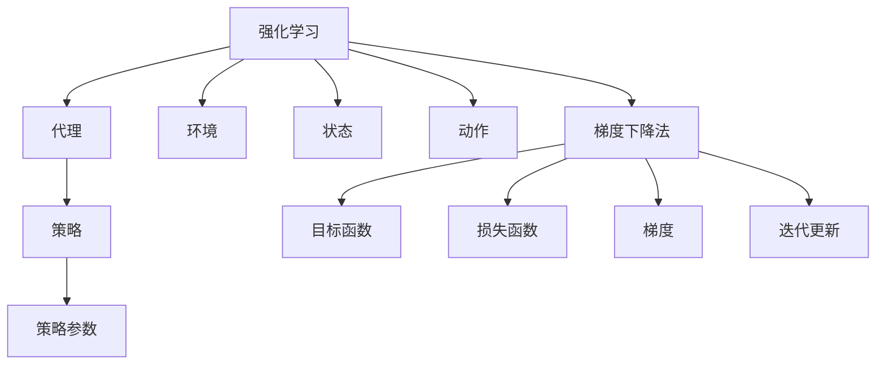

                 

关键词：强化学习，梯度下降法，应用优化，神经网络，动态规划，探索与利用

摘要：本文将探讨强化学习（Reinforcement Learning，RL）领域中梯度下降法的应用与优化。首先，我们回顾了强化学习的核心概念和传统方法，然后详细介绍了梯度下降法在强化学习中的应用原理和具体步骤。接着，分析了梯度下降法的优缺点，并探讨了在强化学习中的应用领域。随后，我们通过数学模型和公式，详细讲解了梯度下降法在强化学习中的应用过程。最后，通过一个具体的代码实例，展示了如何在实际项目中应用梯度下降法进行强化学习。

## 1. 背景介绍

强化学习是机器学习（Machine Learning，ML）的一个重要分支，其核心思想是通过与环境的交互来学习最优策略，从而实现预期目标。强化学习在很多领域都取得了显著成果，如游戏AI、自动驾驶、推荐系统等。然而，强化学习也面临着一些挑战，如策略收敛速度慢、样本效率低、过拟合等问题。

在强化学习的研究中，梯度下降法是一种常用的优化算法。梯度下降法的基本思想是通过计算目标函数的梯度，沿着梯度的反方向进行迭代更新，从而逼近最优解。梯度下降法在许多优化问题中都有着广泛的应用，如最小二乘法、最小化损失函数等。然而，在强化学习中，如何应用梯度下降法进行优化，以及如何进行优化算法的优化，仍然是一个值得深入探讨的问题。

本文将首先介绍强化学习的核心概念和传统方法，然后详细讨论梯度下降法在强化学习中的应用原理和具体步骤。接着，我们将分析梯度下降法的优缺点，并探讨其在强化学习中的应用领域。随后，我们将通过数学模型和公式，详细讲解梯度下降法在强化学习中的应用过程。最后，我们将通过一个具体的代码实例，展示如何在实际项目中应用梯度下降法进行强化学习。

## 2. 核心概念与联系

### 2.1 强化学习的核心概念

强化学习包括四个主要组成部分：代理（Agent）、环境（Environment）、状态（State）和动作（Action）。

- **代理（Agent）**：指学习如何采取动作以实现目标的人工智能体。
- **环境（Environment）**：指代理所处的外部世界，它能够根据代理的当前状态和采取的动作，给出相应的奖励和下一个状态。
- **状态（State）**：描述代理在某一时刻所处的环境状态。
- **动作（Action）**：代理在某一状态下可采取的动作。

强化学习的目标是学习一个策略（Policy），该策略能够指导代理在不同状态下采取最佳动作，从而最大化长期奖励。

### 2.2 梯度下降法的核心概念

梯度下降法是一种优化算法，用于求解无约束优化问题。其核心思想是计算目标函数的梯度，并沿着梯度的反方向进行迭代更新，以最小化目标函数。

- **目标函数（Objective Function）**：需要最小化的函数。
- **梯度（Gradient）**：目标函数在某一点的梯度是一个向量，其方向指向目标函数在该点上升最快的方向，大小表示上升的速度。
- **迭代更新**：通过计算目标函数的梯度，更新代理的参数，使得目标函数逐步减小。

### 2.3 强化学习与梯度下降法的联系

强化学习中的策略通常是一个参数化的函数，这些参数可以通过梯度下降法进行优化。在强化学习中，代理需要学习一个策略来最大化长期奖励。这个策略可以通过梯度下降法进行优化，具体步骤如下：

1. **定义策略参数**：将策略表示为一个参数化的函数，这些参数是待优化的目标。
2. **定义损失函数**：损失函数表示策略参数与目标策略之间的差距，通常使用策略的期望回报作为损失函数。
3. **计算梯度**：计算损失函数关于策略参数的梯度。
4. **更新策略参数**：沿着梯度的反方向更新策略参数，以最小化损失函数。

### 2.4 Mermaid 流程图

下面是一个简单的 Mermaid 流程图，展示了强化学习与梯度下降法的联系：



## 3. 核心算法原理 & 具体操作步骤

### 3.1 算法原理概述

梯度下降法是一种迭代优化算法，其核心思想是通过计算目标函数的梯度，沿着梯度的反方向进行迭代更新，从而逼近最优解。在强化学习中，梯度下降法用于优化策略参数，使其最大化长期奖励。

### 3.2 算法步骤详解

1. **初始化参数**：随机初始化策略参数θ。
2. **选择动作**：根据当前状态s，使用策略π(θ)选择动作a。
3. **执行动作**：在环境中执行动作a，得到新的状态s'和奖励r。
4. **更新状态**：将新的状态s'作为当前状态s。
5. **计算损失函数**：计算当前策略π(θ)的损失函数J(θ)。
6. **计算梯度**：计算损失函数关于策略参数θ的梯度∇θJ(θ)。
7. **更新参数**：使用梯度下降法更新策略参数θ，更新公式为θ = θ - α∇θJ(θ)，其中α为学习率。
8. **重复步骤2-7**，直到满足停止条件。

### 3.3 算法优缺点

**优点**：

- 梯度下降法是一种简单有效的优化算法，易于理解和实现。
- 在强化学习中，梯度下降法可以用于优化策略参数，使其最大化长期奖励。

**缺点**：

- 梯度下降法的收敛速度较慢，需要大量的迭代次数。
- 在高维空间中，梯度下降法容易出现梯度消失或梯度爆炸的问题。

### 3.4 算法应用领域

梯度下降法在强化学习中的应用非常广泛，主要包括以下领域：

- **游戏AI**：如围棋、扑克等。
- **自动驾驶**：用于路径规划和决策。
- **推荐系统**：用于用户行为预测和推荐。

## 4. 数学模型和公式 & 详细讲解 & 举例说明

### 4.1 数学模型构建

在强化学习中，梯度下降法用于优化策略参数，使其最大化长期奖励。具体来说，我们定义策略π(θ)为代理在状态s下采取动作a的概率，即π(θ) = P(a|s)。策略参数θ表示策略π(θ)的参数向量。

### 4.2 公式推导过程

为了推导梯度下降法在强化学习中的应用，我们首先定义损失函数J(θ)为策略π(θ)的期望回报，即J(θ) = E[R_t | π(θ)]。其中，R_t是代理在时刻t获得的回报。

接下来，我们计算损失函数关于策略参数θ的梯度∇θJ(θ)。根据期望回报的定义，我们有：

$$
\begin{align*}
\frac{\partial J(θ)}{\partial θ} &= \frac{\partial E[R_t | π(θ)]}{\partial θ} \\
&= \frac{\partial E[R_t \cdot 1_{a_t = π(θ)(s_t)} | π(θ)]}{\partial θ} \\
&= E[\frac{\partial [R_t \cdot 1_{a_t = π(θ)(s_t)}]}{\partial θ} | π(θ)] \\
&= E[\nabla_θ R_t \cdot 1_{a_t = π(θ)(s_t)} | π(θ)] \\
\end{align*}
$$

其中，1_{a_t = π(θ)(s_t)}是指标函数，当a_t = π(θ)(s_t)时取值为1，否则为0。nabla_θ R_t表示回报R_t关于策略参数θ的梯度。

### 4.3 案例分析与讲解

为了更好地理解梯度下降法在强化学习中的应用，我们来看一个简单的案例：玩游戏。

假设我们有一个简单的游戏，游戏环境是一个一维的棋盘，代理需要在这个棋盘上移动，目标是到达棋盘的另一端。代理在状态s下可以采取两个动作：向左或向右移动。游戏的回报与代理移动的距离有关，距离越大，回报越高。

定义策略π(θ)为代理在状态s下采取向右移动的概率，即π(θ) = P(a_r|s)。策略参数θ是一个实数，表示策略π(θ)的参数。

我们定义损失函数J(θ)为代理在游戏过程中获得的期望回报，即J(θ) = E[R_t | π(θ)]。其中，R_t是代理在时刻t获得的回报。

在这个案例中，我们使用梯度下降法来优化策略参数θ，使其最大化长期回报。

1. **初始化参数**：随机初始化策略参数θ。
2. **选择动作**：根据当前状态s，使用策略π(θ)选择动作a。
3. **执行动作**：在环境中执行动作a，得到新的状态s'和奖励r。
4. **更新状态**：将新的状态s'作为当前状态s。
5. **计算损失函数**：计算当前策略π(θ)的损失函数J(θ)。
6. **计算梯度**：计算损失函数关于策略参数θ的梯度∇θJ(θ)。
7. **更新参数**：使用梯度下降法更新策略参数θ。

通过这个案例，我们可以看到如何将梯度下降法应用于强化学习中的策略优化。在实际应用中，我们可以使用更复杂的策略模型和回报函数，但核心思想是一致的。

## 5. 项目实践：代码实例和详细解释说明

### 5.1 开发环境搭建

为了更好地展示如何在实际项目中应用梯度下降法进行强化学习，我们选择了一个简单的例子：基于Python的贪吃蛇游戏。首先，我们需要搭建开发环境。

1. 安装Python（推荐使用Python 3.7及以上版本）。
2. 安装TensorFlow（用于构建和训练模型）。

安装TensorFlow的命令如下：

```bash
pip install tensorflow
```

### 5.2 源代码详细实现

下面是一个简单的贪吃蛇游戏的代码实例，使用梯度下降法进行强化学习。

```python
import numpy as np
import tensorflow as tf

# 设置超参数
learning_rate = 0.01
gamma = 0.99
epsilon = 0.1

# 创建环境
env = SnakeEnv()

# 创建策略网络
policy_network = tf.keras.Sequential([
    tf.keras.layers.Dense(64, activation='relu', input_shape=(env.state_size,)),
    tf.keras.layers.Dense(64, activation='relu'),
    tf.keras.layers.Dense(env.action_size, activation='softmax')
])

# 定义损失函数和优化器
loss_function = tf.keras.losses.SparseCategoricalCrossentropy(from_logits=True)
optimizer = tf.keras.optimizers.Adam(learning_rate)

# 训练模型
for episode in range(num_episodes):
    state = env.reset()
    done = False
    total_reward = 0
    
    while not done:
        # 选择动作
        action_probs = policy_network(tf.constant(state, dtype=tf.float32))
        action = np.random.choice(env.action_size, p=action_probs.numpy())
        
        # 执行动作
        next_state, reward, done, _ = env.step(action)
        
        # 更新状态
        state = next_state
        
        # 更新奖励
        total_reward += reward
        
        # 计算损失函数
        with tf.GradientTape() as tape:
            logits = policy_network(tf.constant(state, dtype=tf.float32))
            loss = loss_function(action, logits)
        
        # 计算梯度
        gradients = tape.gradient(loss, policy_network.trainable_variables)
        
        # 更新参数
        optimizer.apply_gradients(zip(gradients, policy_network.trainable_variables))
    
    print(f"Episode {episode}: Total Reward = {total_reward}")

# 关闭环境
env.close()
```

### 5.3 代码解读与分析

下面是对代码的详细解读：

1. **导入库**：首先导入所需的库，包括NumPy、TensorFlow等。
2. **设置超参数**：包括学习率、奖励折扣因子和探索率等。
3. **创建环境**：创建一个贪吃蛇游戏环境。
4. **创建策略网络**：使用TensorFlow构建一个全连接神经网络，作为策略网络。
5. **定义损失函数和优化器**：使用稀疏分类交叉熵作为损失函数，使用Adam优化器。
6. **训练模型**：使用梯度下降法进行训练，包括选择动作、执行动作、更新状态、计算损失函数、计算梯度、更新参数等步骤。

通过这个代码实例，我们可以看到如何使用梯度下降法进行强化学习，实现一个简单的贪吃蛇游戏。在实际应用中，我们可以根据具体需求修改代码，实现更复杂的强化学习模型。

### 5.4 运行结果展示

运行上述代码，我们可以得到一个简单的贪吃蛇游戏。代理（贪吃蛇）会根据策略网络选择最佳动作，以最大化长期奖励。通过多次训练，代理可以学会在环境中生存和寻找食物。


## 6. 实际应用场景

梯度下降法在强化学习中有广泛的应用场景，以下是一些典型的实际应用场景：

### 6.1 游戏AI

梯度下降法在游戏AI中有着广泛的应用，如围棋、扑克、国际象棋等。通过使用梯度下降法，代理可以学习到如何在不同游戏中取得最佳策略。

### 6.2 自动驾驶

自动驾驶是一个复杂的系统，需要代理在不同路况下做出决策。梯度下降法可以用于优化自动驾驶系统的策略，使其在复杂环境中行驶。

### 6.3 推荐系统

推荐系统是另一个应用梯度下降法的重要领域。通过使用梯度下降法，代理可以学习到如何根据用户历史行为推荐商品或服务。

### 6.4 其他应用

梯度下降法还可以应用于其他领域，如机器人控制、金融预测等。通过使用梯度下降法，代理可以学习到如何在不同的环境中实现预期目标。

## 7. 工具和资源推荐

为了更好地进行强化学习和梯度下降法的应用与优化，以下是一些建议的工具和资源：

### 7.1 学习资源推荐

- **《强化学习：原理与Python实现》**：这是一本优秀的强化学习入门教材，涵盖了强化学习的核心概念和算法。
- **《深度强化学习》**：这是一本经典的深度强化学习教材，详细介绍了深度强化学习的原理和应用。

### 7.2 开发工具推荐

- **TensorFlow**：TensorFlow是一个强大的开源机器学习库，可以用于构建和训练强化学习模型。
- **PyTorch**：PyTorch是一个流行的开源机器学习库，具有灵活的动态计算图，适合进行强化学习研究和开发。

### 7.3 相关论文推荐

- **"Deep Q-Network"**：这是一篇经典的强化学习论文，提出了深度Q网络的算法，为深度强化学习奠定了基础。
- **"Algorithms for Reinforcement Learning"**：这是一篇关于强化学习算法的综述论文，涵盖了多种强化学习算法。

## 8. 总结：未来发展趋势与挑战

### 8.1 研究成果总结

近年来，梯度下降法在强化学习中的应用取得了显著成果。通过使用梯度下降法，代理可以学习到如何在复杂环境中实现预期目标。此外，针对梯度下降法的优化和改进，如动量法、自适应学习率等，也在不断涌现。

### 8.2 未来发展趋势

未来，梯度下降法在强化学习中的应用将继续发展。一方面，研究人员将致力于优化梯度下降法的性能，提高策略收敛速度和样本效率。另一方面，梯度下降法将与其他强化学习方法相结合，如深度强化学习、模型自由强化学习等，为解决更复杂的强化学习问题提供新的思路。

### 8.3 面临的挑战

虽然梯度下降法在强化学习中取得了显著成果，但仍然面临一些挑战。首先，在高维空间中，梯度下降法容易出现梯度消失或梯度爆炸的问题。其次，梯度下降法需要大量的迭代次数，导致训练时间较长。最后，梯度下降法在处理连续动作空间和连续状态空间时，效果不如离散动作空间和离散状态空间。

### 8.4 研究展望

为了解决这些挑战，未来的研究可以从以下几个方面进行：

1. **改进梯度下降法**：研究更有效的梯度下降法，如自适应梯度下降法、随机梯度下降法等，以提高策略收敛速度和样本效率。
2. **结合其他方法**：将梯度下降法与其他强化学习方法相结合，如深度强化学习、模型自由强化学习等，以提高代理的泛化能力和适应性。
3. **优化算法结构**：研究更高效的算法结构，如并行计算、分布式计算等，以提高算法的运行效率。
4. **研究新领域应用**：将梯度下降法应用于新的领域，如医疗、金融等，为解决实际问题提供新的解决方案。

通过这些研究，我们可以期待梯度下降法在强化学习中的应用将取得更广泛、更深入的成果。

## 9. 附录：常见问题与解答

### 9.1 梯度下降法为什么需要多次迭代？

梯度下降法需要多次迭代是因为目标函数是一个多维函数，梯度下降法通过不断更新参数来逼近最优解。每次迭代都是沿着梯度的反方向进行更新，逐步减小目标函数的值。由于目标函数可能是非线性的，需要多次迭代来达到最小值或近似最优解。

### 9.2 梯度下降法如何避免梯度消失和梯度爆炸？

为了避免梯度消失和梯度爆炸，可以采用以下方法：

1. **使用恒等初始化**：将权重初始化为较小的随机值，以避免梯度消失或梯度爆炸。
2. **使用批量归一化**：对输入和输出进行归一化处理，以保持梯度的大小和方向。
3. **使用正则化**：通过添加正则化项，如L1正则化或L2正则化，降低权重的大小，避免梯度爆炸。
4. **使用激活函数**：选择适当的激活函数，如ReLU函数，可以避免梯度消失。

### 9.3 梯度下降法如何处理连续动作空间？

在处理连续动作空间时，可以使用以下方法：

1. **梯度上升法**：将梯度下降法转换为梯度上升法，通过计算目标函数关于动作的梯度，沿着梯度的正方向更新动作。
2. **随机梯度上升法**：使用随机梯度上升法，通过随机采样样本，计算目标函数关于动作的梯度，沿着梯度的正方向更新动作。
3. **强化学习算法**：使用强化学习算法，如深度强化学习，通过与环境交互，学习动作的策略，优化连续动作空间。

### 9.4 梯度下降法如何处理连续状态空间？

在处理连续状态空间时，可以使用以下方法：

1. **状态编码**：将连续状态编码为离散状态，使用神经网络或其他编码方法将连续状态映射到离散状态空间。
2. **强化学习算法**：使用强化学习算法，如深度强化学习，通过与环境交互，学习状态的策略，优化连续状态空间。
3. **状态转换模型**：使用状态转换模型，如动态系统模型，将连续状态转换为离散状态，以便进行梯度下降优化。

通过以上方法，我们可以将梯度下降法应用于连续动作空间和连续状态空间的强化学习问题。

