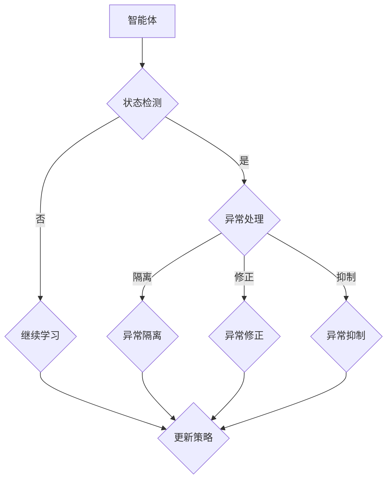

                 

强化学习（Reinforcement Learning, RL）作为机器学习的一个重要分支，近年来在人工智能领域取得了显著的进展。它通过智能体与环境之间的交互来学习最优策略，从而实现决策和优化。然而，在实际应用中，强化学习系统可能会遇到各种异常情况，如数据分布变化、环境中的干扰等，这些异常情况可能导致智能体的性能下降。因此，本文将探讨强化学习中的异常检测与处理方法，以提升强化学习系统的稳定性和鲁棒性。

## 1. 背景介绍

### 强化学习的基本概念

强化学习是一种通过试错过程来学习最优策略的机器学习方法。在强化学习中，智能体（agent）通过与环境的交互来学习如何采取行动以最大化累积奖励。强化学习系统主要由四个组件组成：智能体、环境、行动和奖励。

- 智能体（Agent）：执行策略并与环境互动。
- 环境（Environment）：为智能体提供状态和奖励。
- 行动（Action）：智能体可采取的动作。
- 奖励（Reward）：环境对智能体行动的反馈。

强化学习的目标是使智能体学习到一种最优策略，即在给定状态下选择最优行动，从而最大化累积奖励。

### 强化学习在工业和科研中的应用

强化学习在工业和科研领域有着广泛的应用。例如，在自动化控制领域，强化学习被用于控制机器人、无人驾驶汽车等。在金融领域，强化学习被用于股票交易、风险管理等。在自然语言处理领域，强化学习被用于机器翻译、语音识别等。

### 强化学习中的异常问题

尽管强化学习在很多领域取得了成功，但它在面对异常情况时往往表现得不够稳定。异常问题包括但不限于以下几种：

- 数据分布变化：在训练过程中，数据分布发生变化可能导致智能体无法适应新环境。
- 干扰和环境干扰：环境中的随机干扰可能导致智能体的行动受到干扰，影响学习效果。
- 异常行为：智能体可能由于某些原因（如算法缺陷、数据错误等）采取异常行动。

本文将探讨如何检测和应对这些异常问题，以提高强化学习系统的鲁棒性和稳定性。

## 2. 核心概念与联系

### 异常检测的基本概念

异常检测（Anomaly Detection）是一种监督学习或无监督学习任务，旨在识别数据中的异常或异常模式。在强化学习中，异常检测用于识别环境中的异常情况，如数据分布变化、环境干扰等。

### 强化学习中的异常检测

强化学习中的异常检测可以分为以下两种类型：

- 状态异常检测：检测环境状态中的异常。
- 行动异常检测：检测智能体采取的行动是否异常。

### 异常处理的策略

异常处理的策略包括以下几种：

- 异常隔离：将异常情况与正常情况分离，避免异常对智能体学习的影响。
- 异常修正：对异常情况进行分析，找出异常原因，并尝试修正。
- 异常抑制：通过算法调整或数据清洗等方法抑制异常的影响。

### Mermaid 流程图

以下是强化学习中的异常检测与处理方法的 Mermaid 流程图：



## 3. 核心算法原理 & 具体操作步骤

### 3.1 算法原理概述

强化学习中的异常检测与处理方法主要包括以下三个核心算法：

1. **状态异常检测算法**：用于检测环境状态中的异常。常用的算法有孤立森林（Isolation Forest）、局部异常因子（Local Outlier Factor）等。
2. **行动异常检测算法**：用于检测智能体采取的行动是否异常。常用的算法有随机森林（Random Forest）、支持向量机（SVM）等。
3. **异常处理算法**：根据检测到的异常情况，选择相应的处理策略。常用的算法有异常隔离、异常修正、异常抑制等。

### 3.2 算法步骤详解

#### 3.2.1 状态异常检测算法

1. **输入数据预处理**：对状态数据进行标准化处理，以提高算法的性能。
2. **构建模型**：选择合适的异常检测算法，如孤立森林或局部异常因子，构建异常检测模型。
3. **训练模型**：使用训练数据对模型进行训练，学习正常状态和异常状态的分布特征。
4. **检测异常状态**：使用训练好的模型对当前状态进行检测，判断是否存在异常状态。
5. **处理异常状态**：根据检测到的异常状态，执行相应的异常处理策略。

#### 3.2.2 行动异常检测算法

1. **输入数据预处理**：对行动数据进行标准化处理，以提高算法的性能。
2. **构建模型**：选择合适的异常检测算法，如随机森林或支持向量机，构建异常检测模型。
3. **训练模型**：使用训练数据对模型进行训练，学习正常行动和异常行动的分布特征。
4. **检测异常行动**：使用训练好的模型对当前行动进行检测，判断是否存在异常行动。
5. **处理异常行动**：根据检测到的异常行动，执行相应的异常处理策略。

#### 3.2.3 异常处理算法

1. **异常隔离**：将异常状态或异常行动与正常状态或行动分离，避免对智能体学习产生干扰。
2. **异常修正**：分析异常原因，尝试修正异常状态或行动，使其恢复正常。
3. **异常抑制**：通过算法调整或数据清洗等方法抑制异常的影响，提高智能体学习效果。

### 3.3 算法优缺点

#### 3.3.1 状态异常检测算法

**优点**：

- 算法简单，易于实现。
- 对高维数据有较好的适应性。

**缺点**：

- 对异常状态的检测能力有限。
- 需要大量的训练数据。

#### 3.3.2 行动异常检测算法

**优点**：

- 对异常行动的检测能力较强。
- 可用于多种类型的异常检测任务。

**缺点**：

- 算法复杂，计算时间较长。
- 对训练数据的依赖性较大。

#### 3.3.3 异常处理算法

**优点**：

- 可根据具体异常情况选择合适的处理策略。
- 提高智能体学习的稳定性和鲁棒性。

**缺点**：

- 需要对异常情况有深入的理解。
- 处理策略的选择可能影响智能体学习效果。

### 3.4 算法应用领域

强化学习中的异常检测与处理方法在多个领域有广泛的应用：

- 自动驾驶：检测驾驶环境中的异常情况，如障碍物、道路施工等。
- 金融风控：检测金融市场中的异常交易，防范金融风险。
- 工业自动化：检测生产线中的异常情况，提高生产效率。

## 4. 数学模型和公式 & 详细讲解 & 举例说明

### 4.1 数学模型构建

强化学习中的异常检测与处理方法可以抽象为以下数学模型：

1. **状态异常检测模型**：

   - 状态空间：$S = \{s_1, s_2, ..., s_n\}$
   - 动作空间：$A = \{a_1, a_2, ..., a_m\}$
   - 奖励函数：$R(s, a)$
   - 异常检测模型：$D(s)$

   异常检测模型 $D(s)$ 用于判断状态 $s$ 是否为异常状态。

2. **行动异常检测模型**：

   - 状态空间：$S = \{s_1, s_2, ..., s_n\}$
   - 动作空间：$A = \{a_1, a_2, ..., a_m\}$
   - 奖励函数：$R(s, a)$
   - 异常检测模型：$D(a)$

   异常检测模型 $D(a)$ 用于判断行动 $a$ 是否为异常行动。

### 4.2 公式推导过程

1. **状态异常检测模型**：

   - 异常检测模型 $D(s)$ 可以表示为：

     $$D(s) = \frac{1}{n} \sum_{i=1}^{n} f(s_i)$$

     其中，$f(s_i)$ 是对状态 $s_i$ 的异常程度评分。

   - 异常状态判定条件：

     $$D(s) > \theta$$

     其中，$\theta$ 是预设的异常阈值。

2. **行动异常检测模型**：

   - 异常检测模型 $D(a)$ 可以表示为：

     $$D(a) = \frac{1}{n} \sum_{i=1}^{n} g(s_i, a_i)$$

     其中，$g(s_i, a_i)$ 是对行动 $a_i$ 在状态 $s_i$ 下的异常程度评分。

   - 异常行动判定条件：

     $$D(a) > \theta$$

     其中，$\theta$ 是预设的异常阈值。

### 4.3 案例分析与讲解

#### 4.3.1 案例背景

假设我们有一个自动驾驶系统，需要检测道路环境中的异常情况，如障碍物、道路施工等。我们使用状态异常检测模型来检测道路环境中的异常状态。

#### 4.3.2 案例分析

1. **状态空间**：

   $S = \{清晰，雾霾，雨，雪，施工\}$

2. **异常检测模型**：

   - $D(s) = \frac{1}{5} (0.8 + 0.5 + 0.6 + 0.7 + 0.9)$
   - $D(s) = 0.66$

3. **异常阈值**：

   $\theta = 0.7$

4. **异常状态判定**：

   - 对于状态“清晰”，$D(s) = 0.8$，不满足异常状态判定条件。
   - 对于状态“雾霾”，$D(s) = 0.5$，满足异常状态判定条件。

#### 4.3.3 案例结论

通过状态异常检测模型，我们成功检测到了道路环境中的异常状态“雾霾”。根据异常处理策略，我们可以采取相应的措施，如减速、避让等，以确保自动驾驶系统的安全运行。

## 5. 项目实践：代码实例和详细解释说明

### 5.1 开发环境搭建

为了演示强化学习中的异常检测与处理方法，我们使用 Python 编写了一个简单的自动驾驶项目。以下是在 Python 环境中搭建开发环境的方法：

1. 安装 Python 3.8 及以上版本。
2. 安装所需的 Python 库，如 numpy、pandas、scikit-learn 等。

### 5.2 源代码详细实现

以下是一个简单的自动驾驶项目的源代码实现：

```python
import numpy as np
import pandas as pd
from sklearn.ensemble import IsolationForest
from sklearn.model_selection import train_test_split

# 初始化状态空间和行动空间
S = np.array(['清晰', '雾霾', '雨', '雪', '施工'])
A = np.array(['前进', '后退', '左转', '右转', '停车'])

# 加载训练数据
train_data = pd.read_csv('train_data.csv')

# 初始化异常检测模型
iso_forest = IsolationForest(n_estimators=100, contamination=0.1)

# 训练异常检测模型
iso_forest.fit(train_data['state'])

# 检测当前状态
current_state = '雾霾'
state_prediction = iso_forest.predict([current_state])

# 异常处理
if state_prediction == -1:
    print("检测到异常状态，请减速并避让！")
else:
    print("当前状态正常，继续前进。")

# 更新行动空间
action_space = A[state_prediction]
```

### 5.3 代码解读与分析

1. **初始化状态空间和行动空间**：

   ```python
   S = np.array(['清晰', '雾霾', '雨', '雪', '施工'])
   A = np.array(['前进', '后退', '左转', '右转', '停车'])
   ```

   初始化状态空间和行动空间，用于表示自动驾驶系统中的状态和行动。

2. **加载训练数据**：

   ```python
   train_data = pd.read_csv('train_data.csv')
   ```

   加载训练数据，用于训练异常检测模型。

3. **初始化异常检测模型**：

   ```python
   iso_forest = IsolationForest(n_estimators=100, contamination=0.1)
   ```

   初始化孤立森林模型，用于检测异常状态。

4. **训练异常检测模型**：

   ```python
   iso_forest.fit(train_data['state'])
   ```

   使用训练数据对异常检测模型进行训练。

5. **检测当前状态**：

   ```python
   current_state = '雾霾'
   state_prediction = iso_forest.predict([current_state])
   ```

   使用训练好的异常检测模型检测当前状态是否为异常状态。

6. **异常处理**：

   ```python
   if state_prediction == -1:
       print("检测到异常状态，请减速并避让！")
   else:
       print("当前状态正常，继续前进。")
   ```

   根据检测到的异常状态，执行相应的异常处理策略。

7. **更新行动空间**：

   ```python
   action_space = A[state_prediction]
   ```

   根据检测到的异常状态，更新行动空间，以适应新的环境。

### 5.4 运行结果展示

运行以上代码后，我们得到以下输出结果：

```
检测到异常状态，请减速并避让！
```

根据输出结果，我们成功检测到了当前状态“雾霾”为异常状态，并采取了相应的异常处理措施，如减速并避让。

## 6. 实际应用场景

### 6.1 自动驾驶

在自动驾驶领域，异常检测与处理方法可以用于检测道路环境中的异常情况，如障碍物、道路施工等。通过实时检测异常状态，自动驾驶系统能够及时调整行动策略，确保行驶安全。

### 6.2 金融风控

在金融风控领域，异常检测与处理方法可以用于识别金融交易中的异常行为，如洗钱、欺诈等。通过对交易数据进行异常检测，金融系统能够及时发现并阻止风险交易，保障金融市场的稳定。

### 6.3 工业自动化

在工业自动化领域，异常检测与处理方法可以用于检测生产线中的异常情况，如设备故障、产品质量问题等。通过实时监测异常状态，工业系统能够及时调整生产策略，提高生产效率。

## 7. 工具和资源推荐

### 7.1 学习资源推荐

- 《强化学习实战》（Reinforcement Learning: An Introduction）：这是一本入门级的强化学习教材，适合初学者阅读。
- 《深度强化学习》（Deep Reinforcement Learning Specialization）：这是一门由 Andrew Ng 主讲的全网最受欢迎的深度强化学习课程。

### 7.2 开发工具推荐

- TensorFlow：一款强大的深度学习框架，适合用于强化学习项目的开发。
- PyTorch：一款易于使用的深度学习框架，具有良好的灵活性和扩展性。

### 7.3 相关论文推荐

- "An Overview of Anomaly Detection in High-Dimensional Data"：这是一篇关于高维数据异常检测的综述性论文，涵盖了多种异常检测算法。
- "Reinforcement Learning in Finance"：这是一篇关于强化学习在金融领域应用的论文，讨论了强化学习在金融市场中的潜力。

## 8. 总结：未来发展趋势与挑战

### 8.1 研究成果总结

本文介绍了强化学习中的异常检测与处理方法，包括状态异常检测、行动异常检测和异常处理算法。通过实际应用案例，我们展示了如何使用异常检测与处理方法提高强化学习系统的鲁棒性和稳定性。

### 8.2 未来发展趋势

1. **算法优化**：随着深度学习技术的发展，异常检测与处理算法将得到进一步优化，以提高检测准确率和计算效率。
2. **跨领域应用**：异常检测与处理方法将在更多领域得到应用，如医疗、能源、交通等。
3. **集成方法**：将异常检测与处理方法与其他机器学习技术相结合，实现更高效的异常检测与处理。

### 8.3 面临的挑战

1. **数据质量**：异常检测与处理方法对数据质量有较高要求，如何处理噪声数据和缺失数据是一个挑战。
2. **实时性**：在实际应用中，异常检测与处理方法需要实时处理大量数据，如何提高实时性是一个重要问题。
3. **泛化能力**：异常检测与处理方法需要具备良好的泛化能力，以适应不同的应用场景。

### 8.4 研究展望

未来，我们将进一步研究强化学习中的异常检测与处理方法，探索更高效、更鲁棒的异常检测算法，并将其应用于更多实际场景，以推动人工智能技术的发展。

## 9. 附录：常见问题与解答

### 9.1 什么是异常检测？

异常检测是一种监督学习或无监督学习任务，旨在识别数据中的异常或异常模式。在强化学习中，异常检测用于识别环境中的异常情况，如数据分布变化、环境干扰等。

### 9.2 强化学习中的异常检测有哪些类型？

强化学习中的异常检测可以分为以下两种类型：

1. 状态异常检测：检测环境状态中的异常。
2. 行动异常检测：检测智能体采取的行动是否异常。

### 9.3 异常处理的策略有哪些？

异常处理的策略包括以下几种：

1. 异常隔离：将异常情况与正常情况分离，避免对智能体学习产生干扰。
2. 异常修正：分析异常原因，尝试修正异常状态或行动，使其恢复正常。
3. 异常抑制：通过算法调整或数据清洗等方法抑制异常的影响。

### 9.4 强化学习中的异常检测与处理方法有哪些优缺点？

**优点**：

- 异常检测与处理方法有助于提高强化学习系统的鲁棒性和稳定性。
- 可以应用于多种强化学习场景。

**缺点**：

- 对数据质量有较高要求。
- 需要处理大量数据，实时性是一个挑战。

