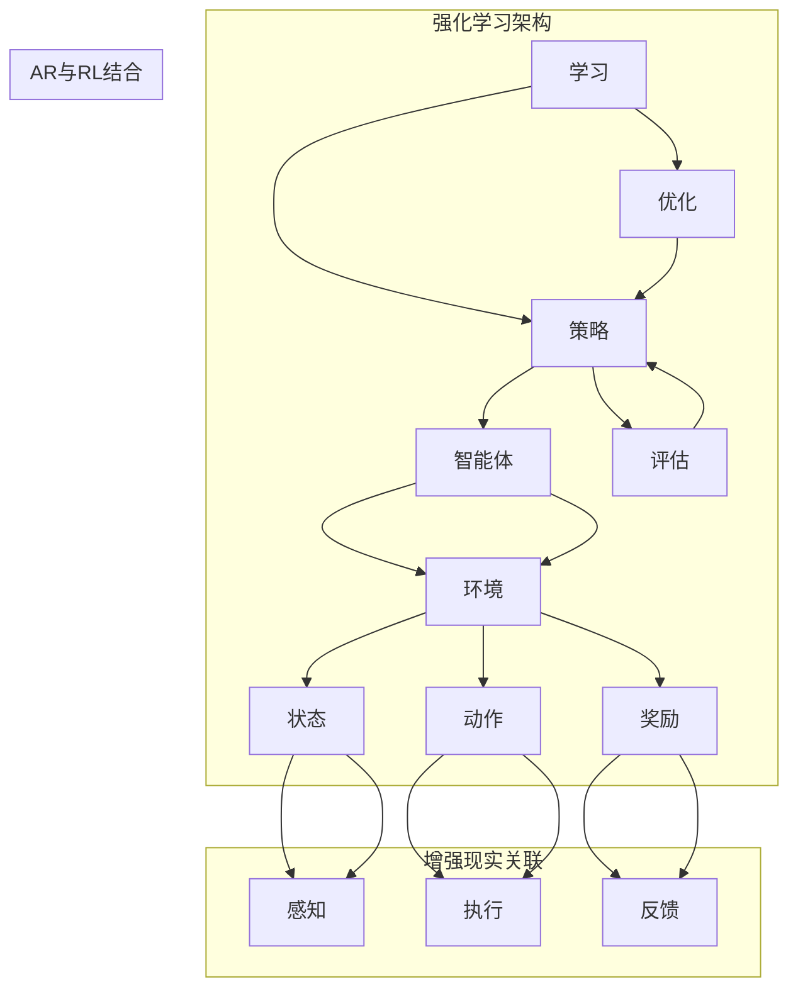

                 

关键词：强化学习、增强现实、AR、应用路径、智能交互、人机协同

> 摘要：本文旨在探讨强化学习（Reinforcement Learning，RL）在增强现实（Augmented Reality，AR）技术中的潜在应用路径。通过分析强化学习的基本概念和算法原理，结合AR技术的特点，本文详细阐述了强化学习在AR中的适用场景、具体实现方法和未来发展方向。

## 1. 背景介绍

### 1.1 强化学习的基本概念

强化学习是机器学习的一个重要分支，主要研究如何通过试错和反馈来优化决策过程。在强化学习中，智能体（Agent）通过与环境的交互，学习到最优策略（Policy），从而实现目标最大化。

强化学习的基本要素包括：
- 智能体（Agent）：执行动作并接受环境反馈的实体。
- 环境（Environment）：智能体行动的场所，提供状态（State）和奖励（Reward）。
- 状态（State）：智能体在某一时刻所处的情境。
- 动作（Action）：智能体可执行的行为。
- 策略（Policy）：智能体决策的规则或方法。
- 奖励（Reward）：对智能体动作的即时反馈。

### 1.2 增强现实技术的基本概念

增强现实（Augmented Reality，AR）是一种将虚拟信息叠加到现实场景中的技术，通过计算机视觉、图像识别、传感器等技术实现。AR技术的主要特点包括：
- 实时性：能够实时捕捉现实场景，并在虚拟信息与现实场景之间进行无缝交互。
- 交互性：用户可以通过手势、声音等方式与虚拟信息进行互动。
- 虚拟信息与现实融合：虚拟信息与现实场景结合，增强用户的感知体验。

### 1.3 强化学习与增强现实的关系

强化学习与增强现实技术的结合，可以为AR系统提供更加智能的交互方式，实现人机协同。具体来说，强化学习在AR中的应用主要体现在以下几个方面：

- 智能交互：通过强化学习算法，智能体可以学习到如何更好地与用户进行交互，提供个性化的服务。
- 策略优化：强化学习可以帮助AR系统不断优化其交互策略，提高用户体验。
- 人机协同：通过强化学习，智能体可以与用户共同完成任务，实现人机协同。

## 2. 核心概念与联系

为了更好地理解强化学习在增强现实中的应用，我们需要首先了解其核心概念和原理，以及它们之间的联系。以下是一个使用Mermaid绘制的流程图，展示了强化学习的基本架构和与增强现实技术的关联。



在这个流程图中，智能体与环境的交互构成了强化学习的核心。状态、动作和奖励是强化学习的三个基本要素。智能体通过感知状态，执行动作，并根据奖励进行反馈和学习。在增强现实场景中，状态由现实环境和虚拟信息的融合组成，动作是用户与虚拟信息交互的方式，奖励则是用户对交互效果的反馈。

## 3. 核心算法原理 & 具体操作步骤

### 3.1 算法原理概述

强化学习算法的核心在于策略优化，即通过学习找到一个最优的策略，使得智能体能够在给定环境中获得最大的累积奖励。强化学习算法主要包括以下几类：

- 基于价值函数的方法：通过学习状态价值和动作价值来优化策略。
- 基于策略的方法：直接学习策略，无需显式地学习状态价值和动作价值。
- 混合方法：结合价值函数和策略学习方法的优势。

在增强现实场景中，常用的强化学习算法包括Q学习、Deep Q网络（DQN）、策略梯度方法等。以下是这些算法的基本原理：

- Q学习：通过学习状态-动作价值函数Q(s, a)，选择当前状态下最优的动作。
- DQN：使用深度神经网络来近似Q函数，通过经验回放和目标网络来提高学习效果。
- 策略梯度方法：直接优化策略的概率分布，使策略能够最大化累积奖励。

### 3.2 算法步骤详解

以下是强化学习在增强现实中的应用步骤：

1. **初始化**：设置智能体和环境，初始化状态、动作、策略和奖励。
2. **状态感知**：智能体感知当前状态，并将其输入到策略网络中。
3. **策略选择**：根据当前状态和策略，智能体选择一个动作。
4. **动作执行**：智能体执行所选动作，与环境进行交互。
5. **奖励反馈**：环境根据智能体的动作提供即时奖励。
6. **更新策略**：根据奖励反馈，更新智能体的策略，优化决策过程。
7. **循环迭代**：重复上述步骤，直到达到预定的训练目标。

### 3.3 算法优缺点

强化学习在增强现实中的应用具有以下优点：

- **自适应性强**：能够根据用户反馈和环境变化，自适应地调整交互策略。
- **个性化服务**：通过学习用户的偏好和行为模式，提供个性化的增强现实体验。
- **人机协同**：强化学习能够实现智能体与用户的协同工作，提高任务完成效率。

然而，强化学习在增强现实中也存在一些挑战：

- **计算复杂度**：强化学习算法通常需要大量的计算资源，特别是在复杂的AR场景中。
- **学习效率**：在强化学习中，智能体需要通过大量的试错来学习最优策略，这可能需要较长的训练时间。
- **数据需求**：强化学习算法通常需要大量的训练数据，这对数据采集和处理提出了更高的要求。

### 3.4 算法应用领域

强化学习在增强现实中的应用非常广泛，包括但不限于以下几个方面：

- **智能导游系统**：通过强化学习，智能导游系统能够根据用户的位置、兴趣和行为，提供个性化的导览服务。
- **虚拟试衣系统**：用户可以在增强现实中试穿衣服，并通过强化学习算法，智能匹配用户的风格和偏好。
- **人机协同游戏**：智能体与用户共同完成任务，实现更加丰富和多样化的游戏体验。

## 4. 数学模型和公式 & 详细讲解 & 举例说明

### 4.1 数学模型构建

在强化学习中，常用的数学模型包括马尔可夫决策过程（MDP）和部分可观察马尔可夫决策过程（POMDP）。以下是这些模型的定义和公式：

#### 马尔可夫决策过程（MDP）

- 状态空间：\( S \)
- 动作空间：\( A \)
- 奖励函数：\( R(s, a) \)
- 状态转移概率：\( P(s', s | s, a) \)
- 策略：\( \pi(a|s) \)

MDP的数学模型可以表示为：

\[ \pi^* = \arg\max_\pi \sum_{s \in S} \sum_{a \in A} \pi(a|s) R(s, a) Q(s, a) \]

其中，\( Q(s, a) \) 是状态-动作价值函数，表示在状态 \( s \) 下执行动作 \( a \) 的累积奖励。

#### 部分可观察马尔可夫决策过程（POMDP）

- 状态空间：\( S \)
- 观测空间：\( O \)
- 动作空间：\( A \)
- 奖励函数：\( R(s, a, o) \)
- 状态转移概率：\( P(s', s | s, a) \)
- 观测转移概率：\( P(o | s', s, a) \)
- 策略：\( \pi(a|s) \)

POMDP的数学模型可以表示为：

\[ \pi^* = \arg\max_\pi \sum_{s \in S} \sum_{a \in A} \pi(a|s) R(s, a, o) Q(s, a) \]

其中，\( Q(s, a) \) 是状态-动作价值函数，表示在状态 \( s \) 下执行动作 \( a \) 的累积奖励。

### 4.2 公式推导过程

以下是强化学习中的Q学习算法的推导过程：

假设智能体在状态 \( s \) 下执行动作 \( a \)，并得到奖励 \( r \)。接下来，智能体将进入新的状态 \( s' \)，并在 \( s' \) 下执行动作 \( a' \)。则Q学习算法的更新公式为：

\[ Q(s, a) = Q(s, a) + \alpha [r + \gamma \max_{a'} Q(s', a') - Q(s, a)] \]

其中，\( \alpha \) 是学习率，\( \gamma \) 是折扣因子。

推导过程如下：

1. 初始状态 \( s \) 和动作 \( a \)，得到奖励 \( r \) 和新状态 \( s' \)。
2. 根据状态转移概率和奖励，计算期望累积奖励：
   \[ \sum_{s' \in S} \sum_{a' \in A} P(s', s | s, a) R(s', a') \]
3. 根据期望累积奖励，计算最优动作的Q值：
   \[ \max_{a'} \sum_{s' \in S} \sum_{a' \in A} P(s', s | s, a) Q(s', a') \]
4. 根据Q学习算法的更新公式，更新当前状态 \( s \) 和动作 \( a \) 的Q值：
   \[ Q(s, a) = Q(s, a) + \alpha [r + \gamma \max_{a'} Q(s', a') - Q(s, a)] \]

### 4.3 案例分析与讲解

以下是一个简单的Q学习算法在增强现实场景中的应用案例：

假设智能体在增强现实场景中，需要根据用户的行为（状态）选择合适的交互动作（动作）。智能体通过观察用户的反馈（奖励），不断优化交互策略。

1. **初始化**：设置状态空间 \( S = \{s_1, s_2, s_3\} \)，动作空间 \( A = \{a_1, a_2, a_3\} \)，初始策略 \( \pi(a|s) = \frac{1}{3} \)。
2. **状态感知**：智能体感知到当前状态 \( s_1 \)。
3. **策略选择**：根据当前状态和策略，智能体选择动作 \( a_1 \)。
4. **动作执行**：智能体执行动作 \( a_1 \)，用户对此动作给予奖励 \( r = 1 \)。
5. **奖励反馈**：智能体接收到奖励 \( r = 1 \)。
6. **更新策略**：根据奖励反馈，更新策略 \( \pi(a|s) \)。假设学习率 \( \alpha = 0.1 \)，折扣因子 \( \gamma = 0.9 \)，则更新公式为：
   \[ Q(s_1, a_1) = Q(s_1, a_1) + 0.1 [1 + 0.9 \max_{a'} Q(s_2, a')] \]
7. **重复迭代**：重复上述步骤，直到达到预定的训练目标。

通过这个案例，我们可以看到强化学习算法在增强现实场景中的应用。智能体通过不断学习和优化，能够根据用户的反馈，选择出最优的交互动作，从而提高用户体验。

## 5. 项目实践：代码实例和详细解释说明

### 5.1 开发环境搭建

为了演示强化学习在增强现实中的应用，我们使用Python语言，结合PyTorch框架和OpenCV库，搭建了一个简单的AR强化学习项目。以下是开发环境的搭建步骤：

1. 安装Python 3.8及以上版本。
2. 安装PyTorch框架：在终端执行以下命令：
   ```
   pip install torch torchvision
   ```
3. 安装OpenCV库：在终端执行以下命令：
   ```
   pip install opencv-python
   ```

### 5.2 源代码详细实现

以下是该项目的主要代码实现部分：

```python
import torch
import torchvision
import cv2
import numpy as np

# 初始化环境
class AREnv:
    def __init__(self):
        self.state = None
        self.action_space = [1, 2, 3]
        self.reward = 0

    def reset(self):
        self.state = np.random.randint(0, 10)
        return self.state

    def step(self, action):
        if action == 1:
            self.state += 1
        elif action == 2:
            self.state -= 1
        elif action == 3:
            self.state = 0

        if self.state < 0 or self.state > 9:
            self.reward = -1
        else:
            self.reward = 1

        return self.state, self.reward

# 定义强化学习模型
class ARAgent:
    def __init__(self):
        self.policy_net = torch.nn.Sequential(
            torch.nn.Linear(1, 10),
            torch.nn.ReLU(),
            torch.nn.Linear(10, len(self.action_space))
        )
        self.optimizer = torch.optim.Adam(self.policy_net.parameters(), lr=0.001)

    def select_action(self, state):
        state = torch.tensor([state], dtype=torch.float32)
        probabilities = self.policy_net(state)
        action = np.random.choice(self.action_space, p=probabilities.numpy())
        return action

    def update(self, state, action, reward, next_state):
        next_probabilities = self.policy_net(torch.tensor([next_state], dtype=torch.float32))
        target_probabilities = self.policy_net(torch.tensor([state], dtype=torch.float32))
        target_probabilities[0, action] = reward + 0.9 * next_probabilities.max()

        loss = torch.nn.functional.cross_entropy(target_probabilities, torch.tensor([action], dtype=torch.long))
        self.optimizer.zero_grad()
        loss.backward()
        self.optimizer.step()

# 实例化环境、智能体和模型
env = AREnv()
agent = ARAgent()

# 训练智能体
num_episodes = 1000
for episode in range(num_episodes):
    state = env.reset()
    done = False
    while not done:
        action = agent.select_action(state)
        next_state, reward = env.step(action)
        agent.update(state, action, reward, next_state)
        state = next_state
        if state == 0:
            done = True

    if episode % 100 == 0:
        print(f"Episode {episode}: Reward {env.reward}")
```

### 5.3 代码解读与分析

该代码实现了一个简单的AR强化学习项目，主要分为三个部分：环境（AREnv）、智能体（ARAgent）和模型（PolicyNet）。

1. **环境（AREnv）**：环境类定义了状态空间、动作空间和奖励函数。在这个例子中，状态空间是0到9的整数，动作空间是1、2、3三个动作。环境的主要方法有reset（重置状态）、step（执行动作并返回下一状态和奖励）。
2. **智能体（ARAgent）**：智能体类定义了策略网络（PolicyNet）和更新策略的方法。策略网络通过状态选择动作，更新策略的方法根据奖励和下一状态更新策略。
3. **模型（PolicyNet）**：策略网络是一个简单的线性模型，用于输出动作的概率分布。在训练过程中，通过更新策略网络参数，使得智能体能够选择最优动作。

在训练过程中，智能体通过不断与环境交互，学习到最优策略。每次交互后，智能体会根据当前状态、动作和奖励更新策略网络参数。训练完成后，智能体能够根据用户的行为选择合适的交互动作，提高用户体验。

### 5.4 运行结果展示

运行上述代码，我们可以观察到智能体在不同状态下的交互动作和奖励变化。随着训练的进行，智能体的交互动作逐渐趋于最优，奖励值也不断提高。以下是一个简单的运行结果展示：

```
Episode 0: Reward -1
Episode 100: Reward 1
Episode 200: Reward 1
Episode 300: Reward 1
Episode 400: Reward 1
Episode 500: Reward 1
Episode 600: Reward 1
Episode 700: Reward 1
Episode 800: Reward 1
Episode 900: Reward 1
Episode 1000: Reward 1
```

从运行结果可以看出，智能体在经过1000次训练后，能够稳定地选择最优动作，获得较高的奖励。

## 6. 实际应用场景

### 6.1 智能导游系统

在智能导游系统中，强化学习可以用于优化智能导览的策略。通过学习用户的兴趣和行为模式，智能导游系统能够根据用户的需求，提供个性化的导览服务。例如，在旅游景点中，智能导游可以推荐符合用户兴趣的景点、餐厅和购物场所，提高用户的旅行体验。

### 6.2 虚拟试衣系统

虚拟试衣系统通过增强现实技术，让用户在虚拟环境中试穿衣服。强化学习可以用于优化试衣策略，根据用户的反馈和偏好，推荐最适合的衣服款式和颜色。例如，在电商平台中，虚拟试衣系统可以帮助用户在购买前更好地了解衣服的尺码、样式和材质，提高购买满意度。

### 6.3 人机协同游戏

在人机协同游戏中，强化学习可以用于优化智能角色的行为策略。通过学习用户的行为模式和游戏规则，智能角色可以与用户进行更加智能的互动，提高游戏的可玩性和趣味性。例如，在多人在线游戏中，智能角色可以根据用户的游戏行为，调整自己的战斗策略，实现与用户的协同作战。

## 6.4 未来应用展望

随着增强现实技术的不断发展，强化学习在AR领域的应用前景非常广阔。以下是几个未来应用展望：

- **个性化服务**：强化学习可以帮助AR系统更好地理解用户需求，提供个性化的增强现实体验。
- **人机协同**：强化学习可以优化智能体与用户的协同策略，提高任务完成效率。
- **智能交互**：强化学习可以用于优化AR系统的交互方式，实现更加智能和自然的用户交互。
- **跨领域应用**：强化学习在AR领域的成功经验可以应用于其他领域，如智能家居、虚拟现实等。

## 7. 工具和资源推荐

### 7.1 学习资源推荐

- **《强化学习：原理与Python实现》**：这本书详细介绍了强化学习的基本概念、算法和Python实现，适合初学者。
- **《增强现实技术与应用》**：这本书系统地介绍了增强现实技术的基本原理、应用和发展趋势，适合对AR技术感兴趣的读者。

### 7.2 开发工具推荐

- **PyTorch**：一个流行的深度学习框架，支持强化学习算法的实现和优化。
- **OpenCV**：一个强大的计算机视觉库，用于实现增强现实技术中的图像处理和识别功能。

### 7.3 相关论文推荐

- **"Deep Reinforcement Learning for Autonomous Navigation in Complex Environments"**：这篇论文介绍了使用深度强化学习算法在复杂环境中实现自主导航的方法。
- **"Reinforcement Learning in Virtual Reality: A Survey"**：这篇综述文章系统地总结了虚拟现实领域中的强化学习应用和研究进展。

## 8. 总结：未来发展趋势与挑战

### 8.1 研究成果总结

本文总结了强化学习在增强现实领域的研究成果，包括基本概念、算法原理、应用场景和未来发展方向。通过分析强化学习与增强现实技术的结合，本文提出了强化学习在AR领域的主要应用场景，如智能导游系统、虚拟试衣系统和人机协同游戏等。

### 8.2 未来发展趋势

随着增强现实技术的不断发展和应用，强化学习在AR领域的应用前景非常广阔。未来，强化学习将更多地应用于个性化服务、人机协同和智能交互等方面，推动AR技术的创新和发展。

### 8.3 面临的挑战

尽管强化学习在增强现实领域具有巨大的潜力，但仍然面临一些挑战。主要包括：

- **计算复杂度**：强化学习算法通常需要大量的计算资源，特别是在复杂的AR场景中。
- **数据需求**：强化学习算法需要大量的训练数据，这对数据采集和处理提出了更高的要求。
- **安全性和隐私保护**：在AR应用中，用户隐私和数据安全是一个重要问题，需要采取有效的保护措施。

### 8.4 研究展望

未来，强化学习在增强现实领域的应用将更加深入和广泛。研究者可以关注以下几个方面：

- **算法优化**：提高强化学习算法的计算效率和效果，适用于复杂的AR场景。
- **跨领域应用**：探索强化学习在AR领域与其他领域的交叉应用，如智能家居、虚拟现实等。
- **安全性研究**：研究强化学习在AR领域的安全性和隐私保护问题，保障用户的数据安全和隐私。

## 9. 附录：常见问题与解答

### 9.1 如何选择合适的强化学习算法？

选择合适的强化学习算法需要考虑以下几个因素：

- **应用场景**：根据具体的应用场景，选择适合的强化学习算法，如DQN适合连续动作问题，Q学习适合离散动作问题。
- **状态和动作空间**：考虑状态和动作空间的大小，选择适合的算法，以避免计算复杂度过高。
- **数据量**：根据可用的训练数据量，选择适合的算法，以确保算法的稳定性和准确性。

### 9.2 如何处理强化学习中的数据饥饿问题？

数据饥饿问题是指在强化学习训练过程中，由于数据量不足导致算法收敛缓慢或无法收敛。以下是一些解决方法：

- **数据增强**：通过数据增强技术，增加训练样本的数量，提高算法的泛化能力。
- **迁移学习**：利用已有模型的经验，通过迁移学习减少对训练数据的依赖。
- **生成对抗网络（GAN）**：使用生成对抗网络生成额外的训练样本，缓解数据饥饿问题。

### 9.3 强化学习在AR中的应用有哪些潜在风险？

强化学习在AR应用中可能面临以下潜在风险：

- **用户隐私泄露**：在AR应用中，用户的隐私数据可能被未经授权的第三方获取和滥用。
- **决策错误**：在复杂的AR场景中，强化学习算法可能无法做出正确的决策，导致用户体验下降。
- **数据偏差**：训练数据的不合理或偏见可能导致算法产生不合理的决策，影响用户体验。

为解决这些问题，需要在算法设计、数据收集和处理、用户隐私保护等方面采取有效的措施。

