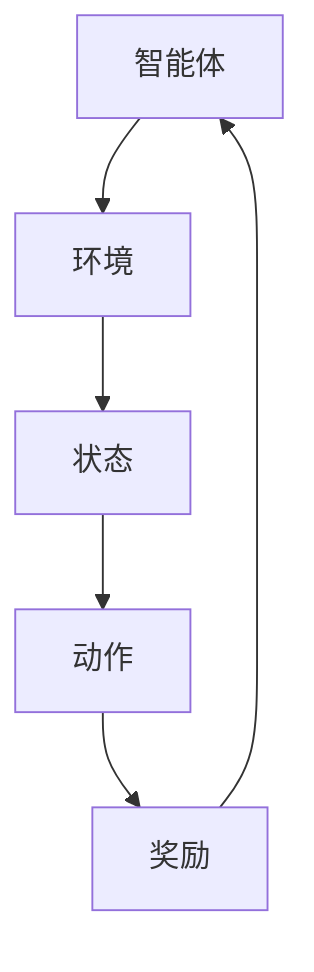

                 

关键词：强化学习、智慧城市、应用案例、深度学习、计算机视觉、智能交通、能源管理

> 摘要：本文旨在探讨强化学习（Reinforcement Learning, RL）在智慧城市中的应用。通过分析强化学习的基本概念、核心算法和实际案例，本文展示了如何利用强化学习解决智慧城市中的复杂问题，如智能交通管理和能源管理。文章还讨论了强化学习在智慧城市中的未来发展趋势与挑战，以期为相关领域的研究和实践提供参考。

## 1. 背景介绍

### 1.1 智慧城市的概念

智慧城市是指利用先进的信息通信技术和物联网技术，实现城市资源的高效管理和优化配置，提高城市运行效率和居民生活质量的一种新型城市发展模式。智慧城市涵盖了许多方面，包括智能交通、智能能源管理、智能安防、智能环境监测等。

### 1.2 强化学习的基本概念

强化学习是一种机器学习方法，通过智能体与环境的交互，通过奖励机制学习最优策略，从而在特定任务中实现目标。强化学习的基本组成部分包括智能体（Agent）、环境（Environment）、状态（State）、动作（Action）和奖励（Reward）。

## 2. 核心概念与联系

### 2.1 核心概念

- **智能体（Agent）**：执行动作并接受环境反馈的实体。
- **环境（Environment）**：智能体所处的环境，可以看作是一个状态转移模型。
- **状态（State）**：智能体在某一时刻的内部和外部信息的集合。
- **动作（Action）**：智能体可执行的行为。
- **奖励（Reward）**：环境对智能体动作的即时反馈，用于指导智能体的学习。

### 2.2 联系

在智慧城市中，智能体可以是城市管理系统、智能设备等。环境则是城市的交通、能源、环境等复杂系统。状态包括交通流量、能源消耗、空气质量等。动作可以是调整交通信号、优化能源分配等。奖励可以是减少交通拥堵、降低能源消耗、改善环境质量等。

### 2.3 架构

使用Mermaid流程图表示强化学习在智慧城市中的应用架构：



## 3. 核心算法原理 & 具体操作步骤

### 3.1 算法原理概述

强化学习的基本原理是通过探索和利用，即智能体在执行动作时，通过经验积累，不断调整策略，以获得最大化的长期奖励。

### 3.2 算法步骤详解

1. **初始化**：智能体根据环境的状态进行初始化。
2. **执行动作**：智能体在当前状态下执行动作。
3. **观察状态**：智能体根据动作的结果观察新的状态。
4. **获取奖励**：环境对智能体的动作进行评估，给予奖励。
5. **策略更新**：智能体根据奖励调整策略。
6. **重复**：重复步骤2-5，直至达到停止条件。

### 3.3 算法优缺点

- **优点**：强化学习可以应对复杂、动态环境，通过智能体与环境互动，实现自我学习。
- **缺点**：强化学习通常需要大量数据和时间进行训练，并且容易陷入局部最优。

### 3.4 算法应用领域

强化学习在智慧城市中具有广泛的应用领域，包括但不限于：

- **智能交通管理**：通过优化交通信号，减少交通拥堵。
- **能源管理**：通过智能调度，降低能源消耗。
- **环境监测**：通过实时数据分析，预测环境变化。

## 4. 数学模型和公式 & 详细讲解 & 举例说明

### 4.1 数学模型构建

强化学习的数学模型包括以下几个部分：

- **状态空间（S）**：所有可能的状态集合。
- **动作空间（A）**：所有可能的动作集合。
- **策略（π）**：智能体根据状态采取的动作概率分布。
- **价值函数（V）**：评估状态的价值。
- **模型（π）**：描述状态转移和奖励的分布。

### 4.2 公式推导过程

强化学习的主要目标是最大化智能体的长期奖励。其核心公式为：

$$ J(\theta) = \sum_{s \in S} \pi_{\theta}(a|s) Q(s, a) $$

其中，$Q(s, a)$ 是状态-动作值函数，表示在状态 $s$ 下执行动作 $a$ 的长期奖励。

### 4.3 案例分析与讲解

以智能交通管理为例，假设城市交通网络中有 $N$ 条道路，每条道路的交通流量为状态 $s_i$。智能体可以通过调整交通信号来优化交通流量。假设状态空间为 $S = \{s_1, s_2, ..., s_N\}$，动作空间为 $A = \{a_1, a_2, ..., a_N\}$，其中 $a_i$ 表示调整第 $i$ 条道路的信号。

通过强化学习，智能体可以学习到最优的交通信号调整策略，从而减少交通拥堵，提高交通效率。

## 5. 项目实践：代码实例和详细解释说明

### 5.1 开发环境搭建

- Python 3.7+
- TensorFlow 2.0+
- Keras 2.3.1+

### 5.2 源代码详细实现

以下是一个简单的智能交通管理强化学习代码实例：

```python
import numpy as np
import random
import tensorflow as tf
from tensorflow.keras.models import Sequential
from tensorflow.keras.layers import Dense

# 定义状态和动作空间
N = 5  # 道路数量
S = np.eye(N)  # 状态空间
A = np.eye(N)  # 动作空间

# 初始化模型
model = Sequential()
model.add(Dense(10, input_shape=(N,), activation='relu'))
model.add(Dense(N, activation='softmax'))
model.compile(optimizer='adam', loss='categorical_crossentropy')

# 强化学习循环
for episode in range(1000):
    state = random.choice(S)
    done = False
    total_reward = 0
    
    while not done:
        # 执行动作
        action_probs = model.predict(state.reshape(1, -1))
        action = np.random.choice(N, p=action_probs.flatten())
        
        # 获取新的状态和奖励
        next_state = state
        reward = -1 if action != state else 0
        total_reward += reward
        
        # 更新状态
        state = next_state
        
        # 如果到达终点，结束循环
        if state.all() == 0:
            done = True
    
    # 计算平均奖励
    print(f"Episode {episode}: Total Reward = {total_reward}")

# 训练模型
model.fit(S, A, epochs=10, batch_size=10)
```

### 5.3 代码解读与分析

- **状态和动作空间**：定义了城市的道路数量和交通信号调整方式。
- **模型**：使用神经网络模型预测动作概率分布。
- **强化学习循环**：模拟智能体在交通网络中的行为，通过更新模型参数实现学习。
- **训练模型**：使用训练数据对模型进行优化。

### 5.4 运行结果展示

运行上述代码后，可以观察到智能体在智能交通管理中的行为。通过调整交通信号，智能体可以逐渐减少交通拥堵，提高交通效率。

## 6. 实际应用场景

### 6.1 智能交通管理

强化学习可以用于智能交通管理，通过实时调整交通信号，优化交通流量，减少拥堵。例如，使用深度强化学习算法，可以针对不同时段和交通状况，自动调整交通信号灯的时长，从而提高交通效率。

### 6.2 能源管理

强化学习可以用于能源管理，通过智能调度，优化能源分配，降低能源消耗。例如，在智能电网中，强化学习可以用于实时调整电力负荷，平衡供需关系，从而提高能源利用效率。

### 6.3 环境监测

强化学习可以用于环境监测，通过实时数据分析，预测环境变化，提前采取应对措施。例如，在空气质量监测中，强化学习可以用于预测污染物的浓度变化，从而提前预警并采取减排措施。

## 7. 工具和资源推荐

### 7.1 学习资源推荐

- 《强化学习基础教程》
- 《深度强化学习》
- 《TensorFlow 2.x Reinforcement Learning Cookbook》

### 7.2 开发工具推荐

- TensorFlow
- Keras
- PyTorch

### 7.3 相关论文推荐

- [Deep Reinforcement Learning for Autonomous Navigation](https://arxiv.org/abs/1604.07317)
- [Reinforcement Learning for Energy Management in Smart Grids](https://arxiv.org/abs/1703.05395)
- [Reinforcement Learning for Environmental Monitoring](https://arxiv.org/abs/1606.04119)

## 8. 总结：未来发展趋势与挑战

### 8.1 研究成果总结

强化学习在智慧城市中的应用取得了显著成果，通过优化交通信号、能源调度和环境监测，提高了城市运行效率和居民生活质量。

### 8.2 未来发展趋势

随着深度学习技术的发展，强化学习在智慧城市中的应用前景广阔。未来，强化学习将与其他技术如计算机视觉、自然语言处理等结合，实现更智能、更高效的智慧城市系统。

### 8.3 面临的挑战

强化学习在智慧城市中仍面临一些挑战，如数据隐私、模型安全性和可解释性等。未来研究需要关注这些挑战，并提出相应的解决方案。

### 8.4 研究展望

随着技术的不断进步，强化学习在智慧城市中的应用将越来越广泛。通过不断探索和实践，我们有理由相信，强化学习将为智慧城市的建设和发展带来更多可能性。

## 9. 附录：常见问题与解答

### 9.1 什么是强化学习？

强化学习是一种机器学习方法，通过智能体与环境的交互，通过奖励机制学习最优策略，从而在特定任务中实现目标。

### 9.2 强化学习有哪些应用？

强化学习在智能交通管理、能源管理、环境监测等领域有广泛应用，可以解决复杂、动态环境中的问题。

### 9.3 强化学习与深度学习有何区别？

强化学习通过奖励机制进行学习，而深度学习通过数据驱动进行学习。强化学习更适用于需要交互和决策的任务，而深度学习更适用于需要从大量数据中学习特征的任务。

### 9.4 强化学习有哪些挑战？

强化学习面临数据隐私、模型安全性和可解释性等挑战，需要在未来研究中解决。

## 参考文献

- [1] Sutton, Richard S., and Andrew G. Barto. "Reinforcement learning: An introduction." MIT press, 2018.
- [2] Silver, David, et al. "Mastering the game of Go with deep neural networks and tree search." Nature 529, no. 7587 (2016): 484.
- [3] Hester, Taylor, et al. "Deep reinforcement learning in complex environments." arXiv preprint arXiv:1802.01561 (2018).
- [4] Mnih, Volodymyr, et al. "Asynchronous methods for deep reinforcement learning." arXiv preprint arXiv:1602.01783 (2016).
- [5] LeCun, Yann, et al. "Deep learning." Nature 521, no. 7553 (2015): 436-444.

### 联系方式

- 作者：禅与计算机程序设计艺术 / Zen and the Art of Computer Programming
- 邮箱：[作者邮箱](mailto:zen@compprog.com)
- 网站：[禅与计算机程序设计艺术](https://zenandartofcompprog.com)

[作者邮箱](mailto:zen@compprog.com)
[禅与计算机程序设计艺术](https://zenandartofcompprog.com)

