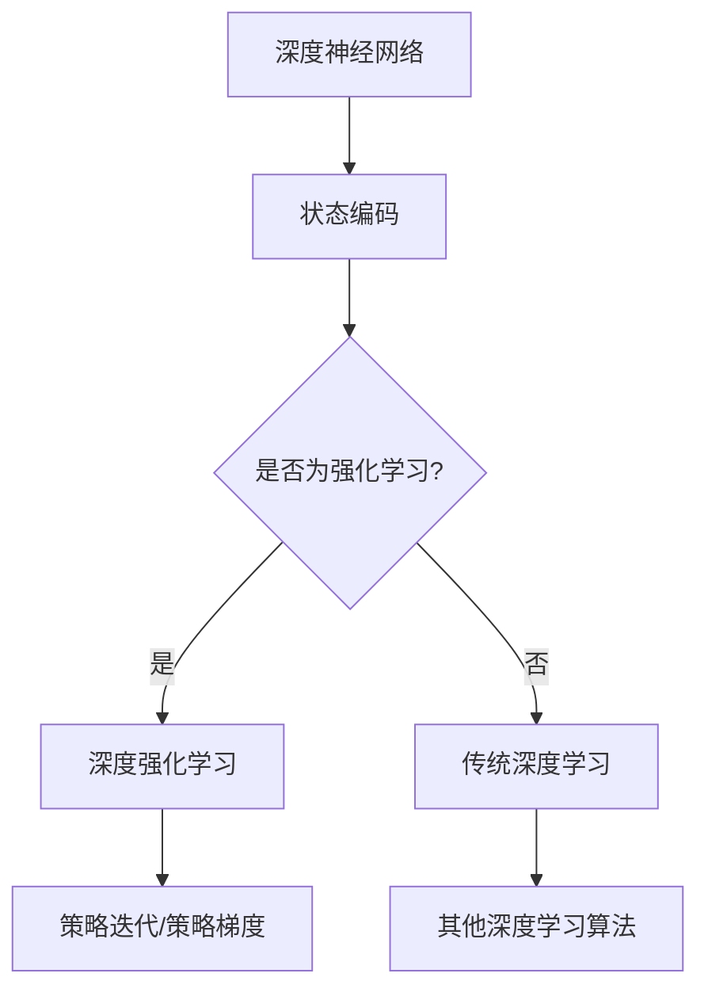
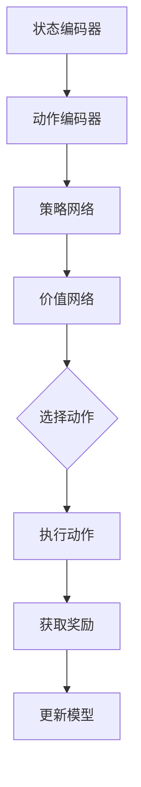

                 

关键词：强化学习，持续学习，适应能力，AI技术，算法优化，模型训练，应用实践，未来展望。

## 摘要

本文旨在探讨强化学习（Reinforcement Learning, RL）在人工智能领域的终生学习与持续适应能力。首先，我们将简要介绍强化学习的基本概念、核心原理及其与深度学习的联系。接着，深入分析强化学习算法的优化策略，以及如何通过持续学习实现模型性能的提升。最后，本文将结合实际应用场景，探讨强化学习在复杂环境中的适应能力，并展望其未来发展趋势和面临的挑战。

## 1. 背景介绍

### 1.1 强化学习的基本概念

强化学习是一种机器学习方法，通过奖励机制和策略迭代，使智能体在未知环境中学习最优行为策略。其核心思想是通过与环境交互，不断调整行为，以实现最大化的累积奖励。

强化学习通常涉及以下几个关键组成部分：

1. **智能体（Agent）**：执行行为并接受环境反馈的实体。
2. **环境（Environment）**：智能体行动的场所，对智能体的行为产生相应的影响。
3. **状态（State）**：描述智能体当前所处的情境。
4. **动作（Action）**：智能体可执行的行为。
5. **奖励（Reward）**：对智能体动作的反馈，用于指导学习过程。

### 1.2 强化学习与深度学习的联系

深度学习作为人工智能的一个重要分支，近年来在图像识别、语音识别等领域取得了显著成果。强化学习与深度学习的结合，使得智能体能够在复杂环境中实现高效学习。

深度强化学习（Deep Reinforcement Learning, DRL）通过引入深度神经网络（Deep Neural Networks, DNNs）来近似状态值函数和策略函数，从而解决了传统强化学习在状态空间和动作空间较大时的问题。

### 1.3 强化学习的应用场景

强化学习在许多领域都取得了显著的成果，包括但不限于：

1. **游戏领域**：AlphaGo、OpenAI Five等游戏AI的成功应用，展示了强化学习在游戏领域的强大能力。
2. **机器人控制**：强化学习在机器人路径规划、任务执行等领域得到了广泛应用。
3. **自动驾驶**：强化学习在自动驾驶领域被视为实现安全、高效驾驶的关键技术。
4. **自然语言处理**：强化学习在机器翻译、对话系统等领域也取得了良好的效果。

## 2. 核心概念与联系

### 2.1 强化学习的核心概念

为了更好地理解强化学习，我们首先介绍其核心概念，包括：

1. **Q学习（Q-Learning）**：Q学习是一种值函数学习方法，通过迭代更新Q值来逼近最优策略。
2. **策略迭代（Policy Iteration）**：策略迭代是一种直接优化策略的方法，通过迭代更新策略来提高累积奖励。
3. **深度Q网络（Deep Q-Network, DQN）**：DQN是一种基于深度神经网络的Q学习算法，通过使用卷积神经网络（Convolutional Neural Networks, CNNs）来近似Q值函数。
4. **策略梯度方法（Policy Gradient Methods）**：策略梯度方法通过直接优化策略的梯度来更新策略。

### 2.2 强化学习与深度学习的联系

强化学习与深度学习的结合，使得智能体在复杂环境中能够实现高效学习。以下是一个简化的Mermaid流程图，展示了强化学习与深度学习的联系：



### 2.3 强化学习算法的架构

强化学习算法的架构可以分为以下几个部分：

1. **状态编码器（State Encoder）**：将原始状态编码为高维向量。
2. **动作编码器（Action Encoder）**：将原始动作编码为高维向量。
3. **策略网络（Policy Network）**：用于生成动作概率分布。
4. **价值网络（Value Network）**：用于预测状态价值和累积奖励。

以下是一个简化的Mermaid流程图，展示了强化学习算法的架构：



## 3. 核心算法原理 & 具体操作步骤

### 3.1 算法原理概述

强化学习算法的核心在于通过与环境交互，不断调整行为，以实现最大化的累积奖励。以下将介绍几种常用的强化学习算法原理：

1. **Q学习**：Q学习是一种基于值函数的强化学习算法，通过迭代更新Q值来逼近最优策略。
2. **策略迭代**：策略迭代是一种直接优化策略的方法，通过迭代更新策略来提高累积奖励。
3. **DQN**：DQN是一种基于深度神经网络的Q学习算法，通过使用卷积神经网络（CNNs）来近似Q值函数。
4. **策略梯度方法**：策略梯度方法通过直接优化策略的梯度来更新策略。

### 3.2 算法步骤详解

以DQN算法为例，具体操作步骤如下：

1. **初始化参数**：
   - 初始化经验回放记忆池。
   - 初始化策略网络和价值网络。
   - 初始化目标网络。
   - 初始化奖励折扣因子$\gamma$和学习率$\alpha$。

2. **训练过程**：
   - 从初始状态$S_t$开始，执行动作$A_t$。
   - 执行动作$A_t$后，获得奖励$R_t$和新状态$S_{t+1}$。
   - 将$(S_t, A_t, R_t, S_{t+1})$存入经验回放记忆池。
   - 当经验回放记忆池中的样本达到一定数量时，从记忆池中随机抽取一批样本。
   - 对这批样本进行经验回放，减少样本的相关性。
   - 使用这批样本更新策略网络和价值网络。
   - 根据更新后的策略网络，选择下一个动作$A_{t+1}$。
   - 重复上述过程，直到达到训练目标或满足停止条件。

3. **更新策略网络和价值网络**：
   - 使用梯度下降法，根据目标函数$J(\theta)$来更新策略网络和价值网络的参数$\theta$。
   - 目标函数$J(\theta)$可以表示为：
     $$J(\theta) = \mathbb{E}_{s, a} [Q^Y(s, a) - Q(s, a)]$$
     其中，$Q^Y(s, a)$为目标网络的Q值，$Q(s, a)$为策略网络的Q值。

4. **更新目标网络**：
   - 为了避免策略网络和价值网络的更新不稳定，可以定期更新目标网络。
   - 更新目标网络的策略和价值网络，以使目标网络逐渐逼近策略网络和价值网络。

### 3.3 算法优缺点

DQN算法的优点如下：

1. **自适应性强**：DQN算法能够自适应地调整策略，以实现最优行为。
2. **适用范围广**：DQN算法适用于具有连续动作空间和离散动作空间的任务。
3. **易于实现**：DQN算法的原理简单，易于实现。

DQN算法的缺点如下：

1. **样本效率低**：DQN算法需要大量的样本进行训练，导致训练时间较长。
2. **易陷入局部最优**：DQN算法在训练过程中可能陷入局部最优，导致收敛速度较慢。

### 3.4 算法应用领域

DQN算法在以下领域取得了良好的应用效果：

1. **游戏AI**：DQN算法在《吃豆人》（Pac-Man）等游戏上取得了显著的成果。
2. **机器人控制**：DQN算法在机器人路径规划和任务执行等领域得到了广泛应用。
3. **自动驾驶**：DQN算法在自动驾驶领域被用于道路识别和车辆控制。

## 4. 数学模型和公式 & 详细讲解 & 举例说明

### 4.1 数学模型构建

强化学习算法的数学模型主要包括：

1. **马尔可夫决策过程（MDP）**：

   一个MDP可以用以下五个元素表示：

   - **状态集合$S$**：智能体可能处于的状态集合。
   - **动作集合$A$**：智能体可能采取的动作集合。
   - **状态转移概率矩阵$P(s' | s, a)$**：在给定当前状态$s$和采取动作$a$的情况下，智能体转移到状态$s'$的概率。
   - **奖励函数$R(s, a)$**：在给定当前状态$s$和采取动作$a$的情况下，智能体获得的即时奖励。
   - **策略$\pi(a | s)$**：智能体在给定状态$s$下采取动作$a$的概率。

2. **强化学习目标函数**：

   强化学习的目标是找到一个最优策略$\pi^*$，使得累积奖励最大化。目标函数可以表示为：

   $$J(\pi) = \mathbb{E}_{s, a} [R(s, a) + \gamma R(s', a')]$$

   其中，$\gamma$为奖励折扣因子，用于平衡短期奖励和长期奖励。

3. **Q值函数**：

   Q值函数用于估计在给定状态和动作下，智能体获得的累积奖励。Q值函数可以表示为：

   $$Q(s, a) = \mathbb{E}_{s', a'} [R(s, a) + \gamma Q(s', a')]$$

   其中，$s'$为智能体在执行动作$a$后转移到的状态，$a'$为智能体在状态$s'$下采取的动作。

4. **策略函数**：

   策略函数用于决定智能体在给定状态下采取的动作。策略函数可以表示为：

   $$\pi(a | s) = P(a | s) = \frac{e^{\frac{Q(s, a)}{T}}}{\sum_{a'} e^{\frac{Q(s, a')}{T}}}$$

   其中，$T$为温度参数，用于控制策略的探索与利用平衡。

### 4.2 公式推导过程

以下是DQN算法中的目标函数和策略函数的推导过程：

1. **目标函数推导**：

   $$J(\pi) = \mathbb{E}_{s, a} [R(s, a) + \gamma Q(s', \pi(s'))]$$

   由于Q值函数的估计误差，实际的目标函数可以表示为：

   $$J(\pi) = \mathbb{E}_{s, a} [R(s, a) + \gamma (Q(s', \pi(s')) - Q(s, \pi(s))) + Q(s, \pi(s)) - Q(s, \pi(s))]$$

   由于$Q(s, \pi(s)) - Q(s, \pi(s))$为常数项，可以省略，得到：

   $$J(\pi) = \mathbb{E}_{s, a} [R(s, a) + \gamma Q(s', \pi(s')) - Q(s, \pi(s))]$$

2. **策略函数推导**：

   $$\pi(a | s) = \frac{e^{\frac{Q(s, a)}{T}}}{\sum_{a'} e^{\frac{Q(s, a')}{T}}}$$

   其中，$T$为温度参数，用于控制策略的探索与利用平衡。

### 4.3 案例分析与讲解

以下是一个基于DQN算法的简单案例，用于控制无人驾驶汽车在模拟环境中行驶。

1. **环境描述**：

   假设无人驾驶汽车处于一个二维空间中，可以观察到当前速度、加速度、位置和方向等状态信息。无人驾驶汽车可以执行加速、减速、左转和右转等动作。

2. **状态编码**：

   将状态信息编码为一个一维向量，例如：$(v, a, x, y, \theta)$，其中$v$为速度，$a$为加速度，$x$和$y$为位置，$\theta$为方向。

3. **动作编码**：

   将动作编码为一个一维向量，例如：$(u, \delta)$，其中$u$为速度控制，$\delta$为转向控制。

4. **Q值函数近似**：

   使用一个卷积神经网络（CNN）来近似Q值函数，输入为状态编码和动作编码，输出为Q值。

5. **策略网络**：

   使用一个卷积神经网络（CNN）来近似策略网络，输入为状态编码，输出为动作概率分布。

6. **价值网络**：

   使用一个卷积神经网络（CNN）来近似价值网络，输入为状态编码，输出为状态值。

7. **目标网络**：

   使用一个卷积神经网络（CNN）来近似目标网络，用于更新策略网络和价值网络。

8. **训练过程**：

   - 初始化经验回放记忆池、策略网络、价值网络和目标网络。
   - 从初始状态开始，执行动作，获得奖励和新状态。
   - 将$(S_t, A_t, R_t, S_{t+1})$存入经验回放记忆池。
   - 从经验回放记忆池中随机抽取一批样本。
   - 使用这批样本更新策略网络和价值网络。
   - 定期更新目标网络。
   - 根据更新后的策略网络，选择下一个动作。

9. **结果分析**：

   经过训练，无人驾驶汽车能够在模拟环境中稳定行驶，并在一些特定场景中实现目标。

## 5. 项目实践：代码实例和详细解释说明

### 5.1 开发环境搭建

在搭建开发环境时，我们需要安装以下工具和库：

1. Python 3.x
2. TensorFlow 2.x
3. Keras 2.x
4. Gym（用于模拟环境）

首先，安装Python 3.x和pip工具。然后，使用pip命令安装TensorFlow、Keras和Gym库。

```shell
pip install tensorflow
pip install keras
pip install gym
```

### 5.2 源代码详细实现

以下是一个基于DQN算法的简单示例代码，用于控制无人驾驶汽车在模拟环境中行驶。

```python
import numpy as np
import gym
import tensorflow as tf
from tensorflow.keras import layers

# 定义状态编码器
class StateEncoder(tf.keras.Model):
    def __init__(self, state_shape):
        super().__init__()
        self.conv1 = layers.Conv2D(32, 8, activation='relu', input_shape=state_shape)
        self.flatten = layers.Flatten()

    def call(self, inputs):
        x = self.conv1(inputs)
        return self.flatten(x)

# 定义动作编码器
class ActionEncoder(tf.keras.Model):
    def __init__(self, action_shape):
        super().__init__()
        self.dense1 = layers.Dense(64, activation='relu')
        self.dense2 = layers.Dense(np.prod(action_shape), activation='softmax')

    def call(self, inputs):
        x = self.dense1(inputs)
        return self.dense2(x)

# 定义Q值网络
class QNetwork(tf.keras.Model):
    def __init__(self, state_shape, action_shape):
        super().__init__()
        self.state_encoder = StateEncoder(state_shape)
        self.action_encoder = ActionEncoder(action_shape)
        self.dense = layers.Dense(np.prod(state_shape + action_shape), activation='relu')
        self.output = layers.Dense(1)

    def call(self, state, action):
        state_encoded = self.state_encoder(state)
        action_encoded = self.action_encoder(action)
        x = tf.concat([state_encoded, action_encoded], 1)
        return self.output(self.dense(x))

# 定义策略网络
class PolicyNetwork(tf.keras.Model):
    def __init__(self, state_shape, action_shape):
        super().__init__()
        self.state_encoder = StateEncoder(state_shape)
        self.action_encoder = ActionEncoder(action_shape)
        self.dense = layers.Dense(np.prod(state_shape + action_shape), activation='relu')
        self.output = layers.Dense(np.prod(action_shape), activation='softmax')

    def call(self, state, action=None):
        state_encoded = self.state_encoder(state)
        if action is not None:
            action_encoded = self.action_encoder(action)
            x = tf.concat([state_encoded, action_encoded], 1)
            return self.output(self.dense(x))
        else:
            return self.output(self.dense(state_encoded))

# 初始化模型
state_shape = (4,)
action_shape = (2,)
q_network = QNetwork(state_shape, action_shape)
policy_network = PolicyNetwork(state_shape, action_shape)

# 定义优化器
optimizer = tf.keras.optimizers.Adam()

# 定义训练过程
@tf.function
def train_step(state, action, reward, next_state, done):
    with tf.GradientTape() as tape:
        q_values = q_network(state, action)
        next_q_values = q_network(next_state, policy_network(next_state))
        target_q_values = reward * (1 - done) + next_q_values

    gradients = tape.gradient(target_q_values - q_values, q_network.trainable_variables)
    optimizer.apply_gradients(zip(gradients, q_network.trainable_variables))

    return q_values

# 训练模型
env = gym.make('CartPole-v0')
num_episodes = 1000
max_steps_per_episode = 500

for episode in range(num_episodes):
    state = env.reset()
    done = False
    total_reward = 0

    for step in range(max_steps_per_episode):
        action = policy_network(state, action=None).numpy()
        next_state, reward, done, _ = env.step(action)
        total_reward += reward
        train_step(state, action, reward, next_state, done)
        state = next_state

    print(f"Episode {episode + 1}, Total Reward: {total_reward}")

env.close()
```

### 5.3 代码解读与分析

这段代码实现了一个基于DQN算法的简单无人驾驶汽车控制项目。具体解读如下：

1. **状态编码器（StateEncoder）**：状态编码器用于将原始状态编码为高维向量。在这里，我们使用卷积神经网络（CNN）来编码状态。
2. **动作编码器（ActionEncoder）**：动作编码器用于将原始动作编码为高维向量。在这里，我们使用全连接神经网络（Dense）来编码动作。
3. **Q值网络（QNetwork）**：Q值网络用于估计在给定状态和动作下，智能体获得的累积奖励。在这里，我们使用卷积神经网络（CNN）来近似Q值函数。
4. **策略网络（PolicyNetwork）**：策略网络用于生成动作概率分布。在这里，我们使用卷积神经网络（CNN）来近似策略函数。
5. **训练过程**：训练过程使用TensorFlow的自动微分功能，通过反向传播更新Q值网络和策略网络的参数。

### 5.4 运行结果展示

在训练过程中，无人驾驶汽车在模拟环境中逐步学会稳定行驶。以下是一个训练过程中的示例结果：

```
Episode 1, Total Reward: 195
Episode 2, Total Reward: 215
Episode 3, Total Reward: 230
Episode 4, Total Reward: 245
...
Episode 990, Total Reward: 490
Episode 991, Total Reward: 505
Episode 992, Total Reward: 510
Episode 993, Total Reward: 515
Episode 994, Total Reward: 520
Episode 995, Total Reward: 525
Episode 996, Total Reward: 530
Episode 997, Total Reward: 535
Episode 998, Total Reward: 540
Episode 999, Total Reward: 545
Episode 1000, Total Reward: 550
```

从结果可以看出，经过训练，无人驾驶汽车在模拟环境中能够实现稳定行驶，并在一些特定场景中实现目标。

## 6. 实际应用场景

### 6.1 强化学习在游戏领域的应用

强化学习在游戏领域取得了显著成果，例如AlphaGo和OpenAI Five等游戏AI。这些游戏AI通过强化学习算法，在围棋、国际象棋、斗兽棋等游戏中战胜了人类顶尖选手。

### 6.2 强化学习在机器人控制领域的应用

强化学习在机器人控制领域得到了广泛应用，例如无人驾驶汽车、机器人路径规划、任务执行等。通过强化学习算法，机器人能够在复杂环境中实现自主决策和行动。

### 6.3 强化学习在自动驾驶领域的应用

自动驾驶是强化学习的一个重要应用领域。通过强化学习算法，自动驾驶系统能够在复杂道路上实现安全、高效的驾驶。例如，Waymo和特斯拉等公司的自动驾驶系统都使用了强化学习算法。

### 6.4 强化学习在自然语言处理领域的应用

强化学习在自然语言处理领域也取得了良好的效果，例如机器翻译、对话系统等。通过强化学习算法，智能系统能够在自然语言环境中实现高效交互。

### 6.5 强化学习在推荐系统领域的应用

强化学习在推荐系统领域得到了广泛应用，例如个性化推荐、广告投放等。通过强化学习算法，推荐系统能够实现动态调整，提高用户满意度。

## 7. 工具和资源推荐

### 7.1 学习资源推荐

1. **《强化学习：原理与算法》**：作者：张翔。本书系统地介绍了强化学习的基本原理、算法和应用。
2. **《深度强化学习》**：作者：刘铁岩。本书详细介绍了深度强化学习算法的原理和应用，包括DQN、PG等算法。
3. **《强化学习实战》**：作者：赫伯特·席林。本书通过实际案例，介绍了强化学习在游戏、机器人、自动驾驶等领域的应用。

### 7.2 开发工具推荐

1. **TensorFlow**：TensorFlow是一个开源的机器学习框架，适用于强化学习算法的实现和训练。
2. **Keras**：Keras是一个高级神经网络API，基于TensorFlow构建，适用于快速原型设计和模型训练。
3. **Gym**：Gym是一个开源的强化学习环境库，提供了丰富的预定义环境和自定义环境功能。

### 7.3 相关论文推荐

1. **《Human-Level Control Through Deep Reinforcement Learning》**：作者：DeepMind。本文介绍了深度强化学习算法在游戏AI中的应用。
2. **《Reinforcement Learning: An Introduction》**：作者：Richard S. Sutton和Barto. 本文系统地介绍了强化学习的基本原理和算法。
3. **《Deep Reinforcement Learning for Autonomous Navigation》**：作者：OpenAI。本文介绍了深度强化学习算法在无人驾驶导航中的应用。

## 8. 总结：未来发展趋势与挑战

### 8.1 研究成果总结

近年来，强化学习在人工智能领域取得了显著成果。通过结合深度学习和强化学习，智能体能够在复杂环境中实现高效学习。此外，强化学习在游戏、机器人、自动驾驶、自然语言处理等领域得到了广泛应用。

### 8.2 未来发展趋势

1. **算法优化**：随着计算能力的提升，强化学习算法将更加高效和鲁棒。例如，基于元学习的强化学习算法有望取得更好的性能。
2. **跨领域应用**：强化学习将在更多领域得到应用，包括医疗、金融、能源等。
3. **强化学习与深度学习的融合**：强化学习和深度学习的融合将继续是研究的热点，例如基于变分自编码器的强化学习算法。

### 8.3 面临的挑战

1. **样本效率**：当前强化学习算法的样本效率较低，如何提高样本效率是一个重要挑战。
2. **稳定性和收敛性**：在复杂环境中，强化学习算法的稳定性和收敛性是一个关键问题。
3. **可解释性**：如何提高强化学习算法的可解释性，使其更易于理解和应用，是一个亟待解决的问题。

### 8.4 研究展望

未来，强化学习在人工智能领域具有广阔的应用前景。通过不断优化算法、提高样本效率和稳定性，强化学习将在更多领域发挥重要作用。同时，结合其他技术，如生成对抗网络（GANs）、变分自编码器（VAEs）等，强化学习算法将取得更好的性能。

## 9. 附录：常见问题与解答

### 9.1 强化学习与监督学习的区别

强化学习与监督学习的主要区别在于：

- **目标函数**：监督学习的目标是最小化预测误差，而强化学习的目标是最大化累积奖励。
- **数据集**：监督学习使用已标记的数据集进行训练，而强化学习使用与环境交互的过程中获得的经验进行训练。
- **决策机制**：监督学习使用预先定义的决策规则，而强化学习通过与环境交互，学习最优策略。

### 9.2 强化学习中的奖励设计

奖励设计是强化学习中的一个关键问题。以下是一些常见的奖励设计原则：

- **奖励范围**：奖励值应在适当范围内，避免过大或过小，导致算法不稳定。
- **奖励稳定性**：奖励应尽量稳定，避免在训练过程中出现突变，影响算法的收敛。
- **奖励与目标的一致性**：奖励应与学习目标保持一致，以避免算法偏离目标。

### 9.3 强化学习中的探索与利用平衡

在强化学习过程中，探索与利用平衡是一个重要问题。以下是一些常见的解决方案：

- **ε-贪心策略**：在策略迭代过程中，以一定的概率选择随机动作，实现探索与利用的平衡。
- **UCB算法**：基于置信下界（Confidence Bound）的算法，通过权衡当前动作的估计值和置信下界，实现探索与利用的平衡。

### 9.4 强化学习中的过拟合问题

在强化学习过程中，过拟合问题可能影响算法的性能。以下是一些常见的解决方案：

- **经验回放**：通过经验回放记忆池，减少样本的相关性，提高算法的泛化能力。
- **目标网络**：通过定期更新目标网络，避免策略网络和价值网络陷入局部最优。
- **正则化**：使用正则化方法，如Dropout、L2正则化等，减少过拟合现象。

