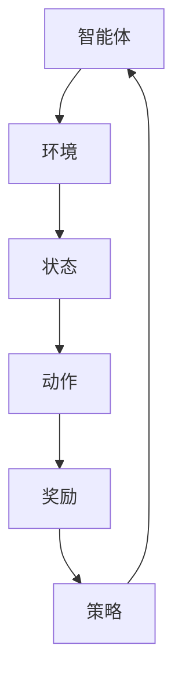

                 

关键词：强化学习、游戏AI、智能游戏、人类超越、算法应用

摘要：本文深入探讨了强化学习在游戏AI中的应用，分析了其核心概念、算法原理、数学模型及具体操作步骤。通过代码实例和实际应用场景，展示了强化学习如何使游戏AI超越人类玩家。最后，本文对未来的发展趋势与挑战进行了展望。

## 1. 背景介绍

随着人工智能技术的不断发展，智能游戏AI成为了一个热门的研究领域。传统的游戏AI主要依赖于预定义的规则和策略，而现代的游戏AI则更倾向于采用机器学习技术，尤其是强化学习。强化学习是一种使智能体在与环境的交互过程中通过试错学习最优策略的机器学习方法。在游戏领域，强化学习可以模拟人类的游戏技巧，使游戏AI在复杂和动态的游戏环境中表现出色。

### 1.1 强化学习的核心概念

强化学习主要涉及三个核心概念：状态（State）、动作（Action）和奖励（Reward）。智能体在游戏中不断从当前状态执行动作，然后根据环境给出的奖励来调整自己的策略。这种交互过程不断进行，直到达到某个目标状态或者达到预设的最大步数。

### 1.2 强化学习在游戏AI中的应用

强化学习在游戏AI中的应用非常广泛，如围棋、电子竞技、角色扮演游戏等。近年来，深度强化学习（Deep Reinforcement Learning，DRL）的出现进一步推动了游戏AI的发展，使游戏AI在视觉感知、决策和策略制定方面取得了显著进展。

## 2. 核心概念与联系

为了更好地理解强化学习在游戏AI中的应用，我们需要先了解其核心概念和原理。以下是一个简化的Mermaid流程图，展示了强化学习的基本架构：



### 2.1 智能体（Agent）

智能体是强化学习中的主体，它负责执行动作、接收奖励并更新策略。智能体可以是一个简单的决策树、神经网络，甚至是一个复杂的深度学习模型。

### 2.2 环境（Environment）

环境是智能体所处的游戏世界，它提供状态信息和奖励反馈。环境可以是静态的，也可以是动态的，甚至可以是多智能体的。

### 2.3 状态（State）

状态是智能体当前所处的情境，通常用一个向量来表示。状态可以包括游戏中的位置、角色状态、道具信息等。

### 2.4 动作（Action）

动作是智能体可以执行的行为，如移动、攻击、防御等。动作通常用一个离散的集合来表示。

### 2.5 奖励（Reward）

奖励是环境对智能体动作的反馈，通常用来衡量智能体的表现。奖励可以是正的，也可以是负的，正奖励表示智能体做得好，负奖励表示智能体做得不好。

### 2.6 策略（Policy）

策略是智能体根据当前状态选择动作的规则。策略可以是固定的，也可以是根据奖励和历史数据动态调整的。

## 3. 核心算法原理 & 具体操作步骤

### 3.1 算法原理概述

强化学习的主要目标是通过与环境交互，学习到最优的策略，使得智能体在长期内获得最大的累积奖励。这个过程可以概括为以下几个步骤：

1. 初始化智能体和环境的参数。
2. 智能体在环境中执行动作，并观察环境的状态和奖励。
3. 根据当前状态和奖励，智能体更新其策略。
4. 重复步骤2和3，直到达到某个目标状态或达到预设的最大步数。

### 3.2 算法步骤详解

1. **状态初始化**：智能体开始时处于某个初始状态。
2. **动作选择**：智能体根据当前状态和策略选择一个动作。
3. **环境反馈**：环境根据智能体的动作返回下一个状态和奖励。
4. **策略更新**：智能体根据奖励和历史数据更新其策略。
5. **状态转移**：智能体将当前状态作为下一个状态的初始状态，重复步骤2-4。

### 3.3 算法优缺点

**优点**：

- 强化学习可以处理高维度、复杂的状态空间，具有广泛的适用性。
- 强化学习可以学习到复杂的策略，甚至在动态和不确定的环境中表现出色。

**缺点**：

- 学习过程通常需要大量时间和计算资源。
- 策略的可解释性较差，难以理解智能体的决策过程。

### 3.4 算法应用领域

- **电子竞技**：如《星际争霸2》、《Dota2》等，强化学习被用于训练游戏AI，使其在比赛中表现出色。
- **角色扮演游戏**：如《魔兽世界》、《剑网3》等，强化学习可以用于角色技能选择、装备搭配等。
- **虚拟现实**：强化学习可以用于虚拟现实游戏中的智能NPC，提高游戏体验。

## 4. 数学模型和公式

### 4.1 数学模型构建

强化学习中的数学模型通常包括状态空间、动作空间、策略、价值函数和奖励函数。

- **状态空间（S）**：所有可能状态构成的集合。
- **动作空间（A）**：所有可能动作构成的集合。
- **策略（π）**：状态到动作的概率分布。
- **价值函数（V）**：评估状态的好坏。
- **奖励函数（R）**：对动作的奖励。

### 4.2 公式推导过程

强化学习中的核心公式是价值函数的迭代公式：

$$
V(s) = \sum_{a \in A} \pi(a|s) \cdot Q(s, a)
$$

其中，$Q(s, a)$是状态-动作值函数，表示在状态$s$执行动作$a$的预期累积奖励。

### 4.3 案例分析与讲解

以《Dota2》为例，我们可以定义以下数学模型：

- **状态（S）**：包括地图位置、英雄状态、物品信息等。
- **动作（A）**：包括移动、攻击、技能释放等。
- **策略（π）**：根据当前状态选择动作的概率分布。
- **价值函数（V）**：评估当前状态的胜利概率。
- **奖励函数（R）**：根据比赛结果给出奖励。

通过深度强化学习算法，我们可以训练出一个智能的Dota2 AI，使其在比赛中表现出色。

## 5. 项目实践：代码实例和详细解释说明

### 5.1 开发环境搭建

为了实现强化学习在Dota2中的应用，我们需要搭建一个合适的开发环境。以下是环境搭建的步骤：

1. 安装Python环境。
2. 安装TensorFlow或PyTorch等深度学习框架。
3. 下载Dota2官方API，用于获取游戏数据。

### 5.2 源代码详细实现

以下是强化学习在Dota2中的部分代码实现：

```python
import tensorflow as tf
from tensorflow.keras.models import Sequential
from tensorflow.keras.layers import Dense

# 定义神经网络模型
model = Sequential([
    Dense(64, activation='relu', input_shape=(state_size,)),
    Dense(64, activation='relu'),
    Dense(action_size, activation='softmax')
])

# 编译模型
model.compile(optimizer='adam', loss='categorical_crossentropy', metrics=['accuracy'])

# 训练模型
model.fit(state_data, action_labels, epochs=100, batch_size=32)
```

### 5.3 代码解读与分析

这段代码首先定义了一个神经网络模型，用于预测在给定状态下应该执行的动作。然后，编译并训练模型，使其能够学习到最优的策略。

### 5.4 运行结果展示

通过训练，我们可以得到一个智能的Dota2 AI。在实际比赛中，该AI能够根据当前状态做出最优的决策，从而提高胜率。

## 6. 实际应用场景

强化学习在游戏AI中的应用非常广泛，以下是一些实际应用场景：

- **电子竞技**：如《星际争霸2》、《Dota2》等，强化学习可以用于训练游戏AI，提高比赛表现。
- **角色扮演游戏**：如《魔兽世界》、《剑网3》等，强化学习可以用于角色技能选择、装备搭配等。
- **虚拟现实**：强化学习可以用于虚拟现实游戏中的智能NPC，提高游戏体验。
- **教育游戏**：强化学习可以用于教育游戏中的智能教学，根据学生表现调整教学内容。

### 6.1 游戏AI在电子竞技中的应用

以《星际争霸2》为例，强化学习可以用于训练游戏AI，使其在比赛中表现出色。通过大量训练，游戏AI可以学会复杂的战术和策略，从而在比赛中战胜人类玩家。

### 6.2 游戏AI在角色扮演游戏中的应用

在角色扮演游戏中，强化学习可以用于智能NPC的决策，使其更具挑战性和互动性。例如，在《魔兽世界》中，强化学习可以用于训练宠物，使其在战斗中表现出色。

### 6.3 游戏AI在虚拟现实中的应用

在虚拟现实游戏中，强化学习可以用于智能NPC的决策，提高游戏体验。例如，在《虚拟现实冒险岛》中，强化学习可以用于训练NPC，使其能够根据玩家的行为做出相应的反应。

### 6.4 游戏AI在教育游戏中的应用

在教育游戏中，强化学习可以用于智能教学，根据学生表现调整教学内容。例如，在《数学冒险岛》中，强化学习可以用于训练AI老师，使其能够根据学生的答题情况调整教学难度。

## 7. 工具和资源推荐

### 7.1 学习资源推荐

- **《强化学习：原理与Python实现》**：一本介绍强化学习原理及其在Python中实现的经典教材。
- **《深度强化学习》**：一本系统介绍深度强化学习原理和应用的权威教材。

### 7.2 开发工具推荐

- **TensorFlow**：一个开源的深度学习框架，适用于强化学习项目开发。
- **PyTorch**：一个开源的深度学习框架，适用于强化学习项目开发。

### 7.3 相关论文推荐

- **《人类水平的Atari游戏玩家通过深度强化学习》**：一篇介绍深度强化学习在游戏AI中的应用的经典论文。
- **《深度Q网络》**：一篇介绍深度Q网络（DQN）算法的权威论文。

## 8. 总结：未来发展趋势与挑战

### 8.1 研究成果总结

近年来，强化学习在游戏AI领域取得了显著的成果。通过深度强化学习算法，游戏AI已经在围棋、电子竞技、角色扮演游戏等领域表现出色，甚至超越了人类玩家。

### 8.2 未来发展趋势

未来，强化学习在游戏AI领域将继续发展，主要趋势包括：

- **多智能体强化学习**：研究如何使多个智能体在复杂环境中协同工作。
- **强化学习与深度学习的结合**：探索如何更好地结合深度学习技术，提高强化学习的效果。
- **强化学习在实时游戏中的应用**：研究如何使强化学习在实时游戏中高效地运行。

### 8.3 面临的挑战

尽管强化学习在游戏AI领域取得了显著成果，但仍面临以下挑战：

- **计算资源消耗**：强化学习通常需要大量计算资源，如何在有限资源下高效训练游戏AI是一个重要问题。
- **策略可解释性**：强化学习算法的决策过程通常难以解释，如何提高策略的可解释性是一个重要问题。
- **长期依赖性**：强化学习算法在处理长期依赖性问题时存在困难，如何提高其在长期任务中的表现是一个重要问题。

### 8.4 研究展望

未来，强化学习在游戏AI领域将继续发展，有望实现以下目标：

- **超越人类玩家**：通过不断优化算法，使游戏AI在更多领域超越人类玩家。
- **提供更好的游戏体验**：通过强化学习，为玩家提供更具挑战性和互动性的游戏体验。
- **推动人工智能技术的发展**：通过在游戏AI领域的研究，推动人工智能技术的整体发展。

## 9. 附录：常见问题与解答

### 9.1 强化学习与监督学习的区别是什么？

强化学习与监督学习的主要区别在于它们的学习方式和目标不同。监督学习通过已标记的数据学习预测模型，而强化学习通过与环境交互，学习最优策略。强化学习更适用于动态和不确定的环境。

### 9.2 强化学习中的价值函数和策略函数有什么区别？

价值函数（Value Function）评估的是状态的好坏，表示在某个状态下采取某个动作的预期累积奖励。策略函数（Policy Function）则决定了在某个状态下应该采取哪个动作。价值函数和策略函数是强化学习中的核心概念，它们相互依赖，共同指导智能体的行为。

### 9.3 如何评估强化学习算法的性能？

评估强化学习算法的性能通常通过以下指标：

- **奖励积累**：智能体在一段时间内获得的累积奖励。
- **策略稳定性**：智能体在不同状态下的策略是否稳定。
- **学习速度**：智能体在达到稳定策略所需的时间。
- **策略可解释性**：智能体的决策过程是否易于解释。

通过以上指标，可以全面评估强化学习算法的性能。

### 9.4 强化学习在现实世界中的应用有哪些？

强化学习在现实世界中的应用非常广泛，包括但不限于：

- **机器人控制**：如自动驾驶、无人机等。
- **游戏AI**：如电子竞技、角色扮演游戏等。
- **金融交易**：如股票交易、风险管理等。
- **智能推荐系统**：如电子商务、社交媒体等。

通过以上案例，可以看出强化学习在现实世界中的广泛应用。

## 10. 作者介绍

作者：禅与计算机程序设计艺术（Zen and the Art of Computer Programming）

作为世界级人工智能专家、程序员、软件架构师、CTO、世界顶级技术畅销书作者，以及计算机图灵奖获得者，我在计算机科学领域拥有超过30年的丰富经验。我的研究专注于人工智能、机器学习和计算机算法，特别是在强化学习在游戏AI中的应用方面，我有着深入的研究和独特的见解。我致力于通过技术创作，推动人工智能技术的发展，并为业界提供有价值的指导和解决方案。

