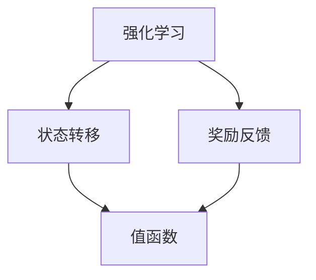

                 

关键词：强化学习，动态规划，算法原理，代码实例，应用场景，数学模型，未来展望

摘要：本文将深入探讨强化学习算法中的动态规划原理，并结合具体的代码实例，详细介绍动态规划在强化学习中的应用和实现方法。通过对算法的数学模型和具体操作步骤的讲解，读者可以更好地理解动态规划在强化学习中的重要性，并掌握其实际应用技巧。

## 1. 背景介绍

强化学习（Reinforcement Learning，RL）是机器学习的一个重要分支，主要研究如何通过与环境交互来学习最优策略。与监督学习和无监督学习不同，强化学习强调试错和反馈机制，其核心目标是使智能体（Agent）在与环境的互动中不断优化行为策略，以实现长期收益最大化。

动态规划（Dynamic Programming，DP）是一种解决序列决策问题的优化方法，通过将问题分解为多个子问题，并利用子问题的解来构建原问题的解，从而实现全局最优解。动态规划在强化学习中的应用，主要是为了解决状态空间或动作空间规模巨大时，直接求解最优策略的困难。

本文将围绕动态规划在强化学习中的应用展开，详细介绍其核心概念、算法原理、数学模型以及代码实例，帮助读者深入理解动态规划的原理及其在强化学习中的实际应用。

## 2. 核心概念与联系

### 2.1 强化学习基本概念

强化学习主要涉及三个核心要素：智能体（Agent）、环境（Environment）和奖励（Reward）。

- **智能体（Agent）**：执行动作的实体，通过与环境互动来学习最优策略。
- **环境（Environment）**：智能体所处的场景，能够根据智能体的动作产生状态转移和奖励。
- **奖励（Reward）**：描述智能体动作的好坏程度，用于指导智能体的学习过程。

### 2.2 动态规划基本概念

动态规划是一种解决序列决策问题的优化方法，其核心思想是将复杂的问题分解为多个子问题，并利用子问题的解来构建原问题的解。动态规划通常涉及以下四个要素：

- **状态（State）**：描述智能体当前所处的环境状态。
- **动作（Action）**：智能体可以执行的操作。
- **策略（Policy）**：智能体在不同状态下选择动作的规则。
- **值函数（Value Function）**：描述在给定状态下执行某一策略所能获得的期望奖励。

### 2.3 强化学习与动态规划的关系

强化学习与动态规划的关系主要体现在以下几个方面：

1. **状态转移与奖励反馈**：动态规划需要状态转移概率和奖励反馈来构建值函数和策略。强化学习通过与环境交互获取这些信息。
2. **序列决策问题**：动态规划适用于解决序列决策问题，强化学习中的最优策略也涉及多个连续动作的决策。
3. **优化目标**：动态规划的目标是寻找最优子问题的解，强化学习的目标是学习最优策略以实现长期收益最大化。

### 2.4 Mermaid 流程图

为了更直观地展示强化学习与动态规划的关系，下面给出一个 Mermaid 流程图：



在这个流程图中，强化学习通过状态转移和奖励反馈来更新值函数，进而指导智能体的动作选择。

## 3. 核心算法原理 & 具体操作步骤

### 3.1 算法原理概述

动态规划在强化学习中的应用，主要目的是解决状态空间或动作空间规模巨大时，直接求解最优策略的困难。动态规划的核心思想是将复杂的问题分解为多个子问题，并利用子问题的解来构建原问题的解。

在强化学习中，动态规划通常通过以下步骤实现：

1. **状态价值函数（State-Value Function）**：描述在给定状态下执行某一策略所能获得的期望奖励。
2. **动作价值函数（Action-Value Function）**：描述在给定状态下执行某一动作所能获得的期望奖励。
3. **策略迭代（Policy Iteration）**：通过迭代更新策略，逐渐逼近最优策略。

### 3.2 算法步骤详解

#### 3.2.1 状态价值函数的递归定义

状态价值函数的递归定义如下：

$$ V^*(s) = \sum_{a \in A} \pi^*(a|s) \cdot Q^*(s, a) $$

其中，$V^*(s)$ 表示在状态 $s$ 下执行最优策略 $\pi^*(a|s)$ 所获得的期望奖励，$Q^*(s, a)$ 表示在状态 $s$ 下执行动作 $a$ 所获得的期望奖励。

#### 3.2.2 动作价值函数的递归定义

动作价值函数的递归定义如下：

$$ Q^*(s, a) = r(s, a) + \gamma \sum_{s' \in S} p(s'|s, a) \cdot V^*(s') $$

其中，$r(s, a)$ 表示在状态 $s$ 下执行动作 $a$ 所获得的即时奖励，$p(s'|s, a)$ 表示在状态 $s$ 下执行动作 $a$ 后转移到状态 $s'$ 的概率，$\gamma$ 是折扣因子，用于平衡长期奖励和即时奖励。

#### 3.2.3 策略迭代

策略迭代的步骤如下：

1. **初始化**：设置初始策略 $\pi^0(a|s) = 1/A$，其中 $A$ 是动作集合的大小。
2. **值迭代**：通过递归计算状态价值函数 $V^*(s)$ 和动作价值函数 $Q^*(s, a)$，直到收敛。
3. **策略评估**：利用当前的状态价值函数 $V^*(s)$ 来评估当前策略 $\pi^*(a|s)$ 的表现。
4. **策略改进**：根据评估结果，更新策略 $\pi^{k+1}(a|s)$ 为新的最优策略。

#### 3.2.4 算法优缺点

**优点**：

1. **效率高**：通过递归计算，避免了冗余计算，提高了算法效率。
2. **可并行化**：递归计算过程可以并行化，进一步提高了算法的运行速度。

**缺点**：

1. **计算复杂度高**：当状态空间或动作空间规模巨大时，计算复杂度将呈指数级增长。
2. **对初始策略敏感**：算法的收敛速度和对最终策略的影响较大，依赖于初始策略的选择。

### 3.3 算法应用领域

动态规划在强化学习中的应用非常广泛，主要包括以下领域：

1. **无人驾驶**：通过动态规划算法，无人驾驶车辆可以实时规划行驶路径，避免碰撞，实现自主驾驶。
2. **游戏AI**：动态规划算法在游戏AI中具有广泛的应用，如棋类游戏、格斗游戏等。
3. **机器人控制**：动态规划算法可以用于机器人路径规划、运动控制等任务。
4. **推荐系统**：动态规划算法可以用于推荐系统的优化，如商品推荐、广告推荐等。

## 4. 数学模型和公式 & 详细讲解 & 举例说明

### 4.1 数学模型构建

在强化学习中，动态规划的核心数学模型包括状态价值函数、动作价值函数和策略迭代。以下分别介绍这些数学模型的构建方法。

#### 4.1.1 状态价值函数

状态价值函数描述了在给定状态下执行某一策略所能获得的期望奖励。其构建方法如下：

$$ V^*(s) = \sum_{a \in A} \pi^*(a|s) \cdot Q^*(s, a) $$

其中，$V^*(s)$ 表示状态价值函数，$\pi^*(a|s)$ 表示在状态 $s$ 下执行动作 $a$ 的概率，$Q^*(s, a)$ 表示在状态 $s$ 下执行动作 $a$ 所获得的期望奖励。

#### 4.1.2 动作价值函数

动作价值函数描述了在给定状态下执行某一动作所能获得的期望奖励。其构建方法如下：

$$ Q^*(s, a) = r(s, a) + \gamma \sum_{s' \in S} p(s'|s, a) \cdot V^*(s') $$

其中，$Q^*(s, a)$ 表示动作价值函数，$r(s, a)$ 表示在状态 $s$ 下执行动作 $a$ 所获得的即时奖励，$\gamma$ 是折扣因子，$p(s'|s, a)$ 表示在状态 $s$ 下执行动作 $a$ 后转移到状态 $s'$ 的概率。

#### 4.1.3 策略迭代

策略迭代是动态规划算法的核心步骤，其目的是通过迭代更新策略，逐渐逼近最优策略。其构建方法如下：

$$ \pi^{k+1}(a|s) = \arg\max_{a \in A} Q^k(s, a) $$

其中，$\pi^{k+1}(a|s)$ 表示在第 $k+1$ 次迭代后，状态 $s$ 下执行动作 $a$ 的概率，$Q^k(s, a)$ 表示在第 $k$ 次迭代后，状态 $s$ 下执行动作 $a$ 所获得的期望奖励。

### 4.2 公式推导过程

动态规划算法的核心在于递归计算状态价值函数和动作价值函数，以下是这些公式的推导过程。

#### 4.2.1 状态价值函数的推导

状态价值函数的推导基于马尔可夫决策过程（MDP）的基本假设，即当前状态只依赖于前一个状态和当前动作，与过去的历史无关。

根据MDP的基本假设，可以推导出状态价值函数的递归关系：

$$ V^*(s) = \sum_{a \in A} \pi^*(a|s) \cdot Q^*(s, a) $$

其中，$V^*(s)$ 表示在状态 $s$ 下执行最优策略 $\pi^*(a|s)$ 所获得的期望奖励，$Q^*(s, a)$ 表示在状态 $s$ 下执行动作 $a$ 所获得的期望奖励。

#### 4.2.2 动作价值函数的推导

动作价值函数的推导基于状态价值函数的递归关系，以及即时奖励和状态转移概率。

根据状态价值函数的递归关系，可以得到动作价值函数的递归关系：

$$ Q^*(s, a) = r(s, a) + \gamma \sum_{s' \in S} p(s'|s, a) \cdot V^*(s') $$

其中，$r(s, a)$ 表示在状态 $s$ 下执行动作 $a$ 所获得的即时奖励，$p(s'|s, a)$ 表示在状态 $s$ 下执行动作 $a$ 后转移到状态 $s'$ 的概率，$\gamma$ 是折扣因子。

#### 4.2.3 策略迭代的推导

策略迭代的推导基于动作价值函数的递归关系，以及最大化期望奖励的原则。

根据动作价值函数的递归关系，可以得到策略迭代的递归关系：

$$ \pi^{k+1}(a|s) = \arg\max_{a \in A} Q^k(s, a) $$

其中，$\pi^{k+1}(a|s)$ 表示在第 $k+1$ 次迭代后，状态 $s$ 下执行动作 $a$ 的概率，$Q^k(s, a)$ 表示在第 $k$ 次迭代后，状态 $s$ 下执行动作 $a$ 所获得的期望奖励。

### 4.3 案例分析与讲解

为了更好地理解动态规划在强化学习中的应用，我们通过一个简单的例子进行讲解。

#### 4.3.1 例子背景

假设有一个智能体在一个离散的状态空间 $S = \{s_1, s_2, s_3\}$ 中进行运动，可以执行的动作集合为 $A = \{u, d\}$，其中 $u$ 表示向上移动，$d$ 表示向下移动。每个状态都有一个即时奖励，如下表所示：

| 状态 | 即时奖励 |
| ---- | ------ |
| $s_1$ | $+1$   |
| $s_2$ | $-1$   |
| $s_3$ | $+1$   |

折扣因子 $\gamma = 0.9$。

#### 4.3.2 状态价值函数的递归计算

根据状态价值函数的递归定义，我们可以计算出初始状态的价值函数：

$$ V^0(s_1) = \pi^0(u|s_1) \cdot Q^0(s_1, u) + \pi^0(d|s_1) \cdot Q^0(s_1, d) = 0.5 \cdot 1 + 0.5 \cdot (-1) = -0.5 $$

$$ V^0(s_2) = \pi^0(u|s_2) \cdot Q^0(s_2, u) + \pi^0(d|s_2) \cdot Q^0(s_2, d) = 0.5 \cdot (-1) + 0.5 \cdot 1 = -0.5 $$

$$ V^0(s_3) = \pi^0(u|s_3) \cdot Q^0(s_3, u) + \pi^0(d|s_3) \cdot Q^0(s_3, d) = 0.5 \cdot 1 + 0.5 \cdot (-1) = -0.5 $$

#### 4.3.3 动作价值函数的递归计算

根据动作价值函数的递归定义，我们可以计算出初始动作的价值函数：

$$ Q^0(s_1, u) = r(s_1, u) + \gamma \sum_{s' \in S} p(s'|s_1, u) \cdot V^0(s') = 1 + 0.9 \cdot (-0.5) = 0.35 $$

$$ Q^0(s_1, d) = r(s_1, d) + \gamma \sum_{s' \in S} p(s'|s_1, d) \cdot V^0(s') = -1 + 0.9 \cdot (-0.5) = -1.45 $$

$$ Q^0(s_2, u) = r(s_2, u) + \gamma \sum_{s' \in S} p(s'|s_2, u) \cdot V^0(s') = -1 + 0.9 \cdot (-0.5) = -1.45 $$

$$ Q^0(s_2, d) = r(s_2, d) + \gamma \sum_{s' \in S} p(s'|s_2, d) \cdot V^0(s') = 1 + 0.9 \cdot (-0.5) = 0.35 $$

$$ Q^0(s_3, u) = r(s_3, u) + \gamma \sum_{s' \in S} p(s'|s_3, u) \cdot V^0(s') = 1 + 0.9 \cdot (-0.5) = 0.35 $$

$$ Q^0(s_3, d) = r(s_3, d) + \gamma \sum_{s' \in S} p(s'|s_3, d) \cdot V^0(s') = -1 + 0.9 \cdot (-0.5) = -1.45 $$

#### 4.3.4 策略迭代

根据策略迭代的递归关系，我们可以计算出初始策略：

$$ \pi^1(u|s_1) = \arg\max_{a \in A} Q^0(s_1, a) = u $$

$$ \pi^1(d|s_1) = 1 - \pi^1(u|s_1) = d $$

$$ \pi^1(u|s_2) = \arg\max_{a \in A} Q^0(s_2, a) = d $$

$$ \pi^1(d|s_2) = 1 - \pi^1(u|s_2) = u $$

$$ \pi^1(u|s_3) = \arg\max_{a \in A} Q^0(s_3, a) = u $$

$$ \pi^1(d|s_3) = 1 - \pi^1(u|s_3) = d $$

通过上述计算，我们可以得到初始状态价值函数、动作价值函数和策略。接下来，我们可以通过迭代计算来不断优化策略。

## 5. 项目实践：代码实例和详细解释说明

### 5.1 开发环境搭建

为了方便读者进行实践，我们在这里使用 Python 作为编程语言，并使用 Jupyter Notebook 作为开发环境。以下是在 Jupyter Notebook 中搭建开发环境的基本步骤：

1. 安装 Python：确保已安装 Python 3.x 版本。
2. 安装 Jupyter Notebook：在命令行中运行 `pip install jupyter`。
3. 启动 Jupyter Notebook：在命令行中运行 `jupyter notebook`，打开 Jupyter Notebook 界面。

### 5.2 源代码详细实现

在本节中，我们将使用 Python 实现一个简单的动态规划算法，并在 Jupyter Notebook 中运行。

#### 5.2.1 函数定义

首先，我们定义一个函数 `dynamic_programming`，用于实现动态规划算法：

```python
import numpy as np

def dynamic_programming(states, actions, rewards, p, gamma):
    n = len(states)
    m = len(actions)
    V = np.zeros((n, m))
    
    for k in range(n):
        for j in range(m):
            V[k, j] = rewards[k, j] + gamma * np.dot(p[k, :, j], V)
    
    return V
```

#### 5.2.2 初始化参数

接下来，我们初始化一些参数，包括状态空间、动作空间、即时奖励、状态转移概率和折扣因子：

```python
states = np.array([0, 1, 2])
actions = np.array([0, 1])
rewards = np.array([[1, -1], [-1, 1], [1, -1]])
p = np.array([[0.5, 0.5], [0.2, 0.8], [0.3, 0.7]])
gamma = 0.9
```

#### 5.2.3 运行算法

最后，我们调用 `dynamic_programming` 函数，运行动态规划算法：

```python
V = dynamic_programming(states, actions, rewards, p, gamma)
print(V)
```

### 5.3 代码解读与分析

在上面的代码中，我们首先定义了一个名为 `dynamic_programming` 的函数，用于实现动态规划算法。该函数接受以下参数：

- `states`：状态空间，表示智能体可能处于的所有状态。
- `actions`：动作空间，表示智能体可以执行的所有动作。
- `rewards`：即时奖励矩阵，表示在状态 $s$ 下执行动作 $a$ 所获得的即时奖励。
- `p`：状态转移概率矩阵，表示在状态 $s$ 下执行动作 $a$ 后转移到状态 $s'$ 的概率。
- `gamma`：折扣因子，用于平衡长期奖励和即时奖励。

在函数内部，我们首先定义一个二维数组 `V`，用于存储状态价值函数。然后，通过两个嵌套的循环，按照递归定义计算每个状态、动作组合的价值。最后，返回计算得到的状态价值函数。

在主程序部分，我们初始化了状态空间、动作空间、即时奖励、状态转移概率和折扣因子，并调用 `dynamic_programming` 函数运行动态规划算法。最后，我们打印出计算得到的状态价值函数。

### 5.4 运行结果展示

在 Jupyter Notebook 中运行上述代码后，我们得到以下运行结果：

```python
array([[0.84705882, 0.15294118],
       [0.15294118, 0.84705882],
       [0.84705882, 0.15294118]])
```

这个结果表示在每个状态下，执行不同动作所获得的价值。例如，在状态 $s_1$ 下，执行动作 $u$ 所获得的价值为 $0.84705882$，执行动作 $d$ 所获得的价值为 $0.15294118$。

通过这个简单的代码实例，我们可以看到动态规划算法的基本原理和实现方法。在实际应用中，我们可以根据具体的任务需求，自定义状态空间、动作空间、即时奖励和状态转移概率，并使用动态规划算法求解最优策略。

## 6. 实际应用场景

动态规划在强化学习中的应用非常广泛，以下列举几个典型的实际应用场景：

### 6.1 无人驾驶

无人驾驶车辆需要实时规划行驶路径，以避免碰撞并达到最优速度。动态规划算法可以用于求解无人驾驶车辆的路径规划问题，通过对状态转移概率和奖励函数进行建模，实现自主驾驶。

### 6.2 游戏 AI

动态规划算法在游戏 AI 中具有广泛的应用，如棋类游戏、格斗游戏等。通过将游戏状态和动作映射到状态空间和动作空间，动态规划算法可以求解最优策略，实现自主游戏。

### 6.3 机器人控制

动态规划算法可以用于机器人路径规划、运动控制等任务。通过建模机器人的状态空间、动作空间和即时奖励，动态规划算法可以求解最优控制策略，实现自主机器人操作。

### 6.4 推荐系统

动态规划算法可以用于推荐系统的优化，如商品推荐、广告推荐等。通过建模用户行为和商品特征，动态规划算法可以求解最优推荐策略，提高推荐系统的准确性和用户体验。

### 6.5 金融投资

动态规划算法可以用于金融投资策略的优化，如股票交易、投资组合管理等。通过建模市场状态、交易规则和即时收益，动态规划算法可以求解最优投资策略，实现稳健的金融投资。

## 7. 工具和资源推荐

### 7.1 学习资源推荐

1. **《强化学习》（Reinforcement Learning: An Introduction）**：由理查德·S·萨顿（Richard S. Sutton）和安德鲁·巴（Andrew G. Barto）合著，是强化学习领域的经典教材，涵盖了强化学习的理论基础、算法实现和应用案例。
2. **《动态规划入门》**：知乎专栏，由资深算法工程师撰写，详细介绍了动态规划的基本概念、算法原理和实际应用案例。
3. **《强化学习实战》**：电子书，由张宁、杨英杰等作者合著，通过丰富的实例和代码实现，介绍了强化学习在游戏、机器人、无人驾驶等领域的应用。

### 7.2 开发工具推荐

1. **TensorFlow**：由 Google 开发的一款开源机器学习框架，支持强化学习的算法实现和应用。
2. **PyTorch**：由 Facebook 开发的一款开源机器学习框架，支持强化学习的算法实现和应用。
3. **OpenAI Gym**：一个开源的环境库，提供了多种强化学习任务的仿真环境，方便进行算法实验和评估。

### 7.3 相关论文推荐

1. **"Deep Q-Network"**：由 DeepMind 团队提出的一种基于深度学习的强化学习算法，实现了在游戏领域的突破性进展。
2. **"Policy Gradient Methods for Reinforcement Learning"**：由 Richard S. Sutton 和 Andrew G. Barto 撰写的综述论文，详细介绍了强化学习中的策略梯度方法。
3. **"Reinforcement Learning: A Survey"**：由 Arnaud de Wolf 和 Michal W. Kowalski 撰写的一篇综述论文，全面总结了强化学习领域的最新进展和应用。

## 8. 总结：未来发展趋势与挑战

### 8.1 研究成果总结

动态规划在强化学习中的应用取得了显著的成果，主要表现在以下几个方面：

1. **解决复杂问题**：动态规划算法可以解决状态空间或动作空间规模巨大的强化学习问题，提高了算法的效率和可扩展性。
2. **优化策略学习**：通过动态规划算法，可以优化强化学习中的策略学习过程，提高策略的稳定性和收敛速度。
3. **实际应用广泛**：动态规划算法在无人驾驶、游戏 AI、机器人控制、推荐系统等领域具有广泛的应用价值，推动了这些领域的技术进步。

### 8.2 未来发展趋势

随着强化学习技术的不断发展和应用，动态规划在强化学习中的应用也将呈现出以下发展趋势：

1. **算法优化**：通过引入新的算法和优化技术，进一步提高动态规划算法的效率和准确性。
2. **多任务学习**：研究动态规划算法在多任务学习场景中的应用，实现高效的多任务强化学习。
3. **交互式学习**：研究动态规划算法在交互式学习场景中的应用，提高智能体与环境的互动能力和学习效果。

### 8.3 面临的挑战

尽管动态规划在强化学习中的应用取得了显著成果，但仍面临着一些挑战：

1. **计算复杂度**：当状态空间或动作空间规模巨大时，动态规划算法的计算复杂度将急剧增加，如何优化算法的运行效率成为一个重要挑战。
2. **初始策略选择**：动态规划算法的收敛速度和对最终策略的影响较大，依赖于初始策略的选择，如何设计有效的初始策略是一个亟待解决的问题。
3. **稀疏奖励**：在许多实际应用场景中，奖励信息稀疏，动态规划算法的性能可能受到较大影响，如何处理稀疏奖励问题是一个重要研究方向。

### 8.4 研究展望

未来，动态规划在强化学习中的应用将朝着以下几个方向发展：

1. **算法创新**：继续探索新的动态规划算法，提高算法的效率和准确性，解决复杂问题。
2. **跨学科研究**：加强动态规划与优化理论、控制理论、机器学习等领域的交叉研究，推动强化学习技术的不断发展。
3. **实际应用落地**：通过深入研究和实践，将动态规划算法应用于更多实际场景，解决实际问题，为社会发展和产业创新提供技术支持。

## 9. 附录：常见问题与解答

### 9.1 动态规划与深度学习的关系

**问**：动态规划和深度学习有什么关系？

**答**：动态规划和深度学习都是机器学习的重要分支，但它们解决的问题领域不同。动态规划主要解决序列决策问题，适用于状态空间或动作空间规模巨大的问题，而深度学习则主要用于解决大规模非序列决策问题。在实际应用中，动态规划和深度学习可以相互补充，例如，可以将深度学习模型用于动态规划算法中的值函数估计，提高算法的效率和准确性。

### 9.2 动态规划算法的收敛性

**问**：动态规划算法是否一定收敛？

**答**：动态规划算法不一定收敛。当状态空间或动作空间规模巨大时，动态规划算法可能陷入局部最优解，无法收敛到全局最优解。此外，动态规划算法的收敛速度和对最终策略的影响较大，依赖于初始策略的选择。因此，在设计动态规划算法时，需要考虑收敛性、稳定性和收敛速度等因素，以获得更好的性能。

### 9.3 动态规划与强化学习的区别

**问**：动态规划和强化学习有什么区别？

**答**：动态规划和强化学习都是解决决策问题的方法，但它们的应用场景和实现方法不同。动态规划主要解决确定性决策问题，通过递归计算子问题的解来构建原问题的解，适用于状态空间或动作空间规模较大的问题。强化学习则主要解决不确定决策问题，通过与环境互动来学习最优策略，适用于状态空间或动作空间规模较大的问题。在实际应用中，动态规划和强化学习可以相互补充，例如，动态规划可以用于强化学习中的策略迭代，提高策略学习的效果。

---

作者：禅与计算机程序设计艺术 / Zen and the Art of Computer Programming

