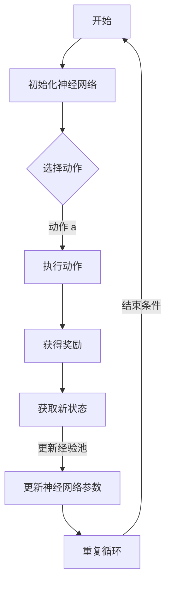

                 

关键词：强化学习、深度 Q 网络、DQN、智能决策、神经网络、学习算法、人工智能、机器学习

> 摘要：本文将深入讲解强化学习中的深度 Q 网络 (DQN) 算法。通过详细的理论分析、数学模型推导、代码实现及实例展示，帮助读者理解 DQN 在智能决策中的应用原理，并提供实用的代码实例，以便读者更好地实践和应用这一算法。

## 1. 背景介绍

强化学习（Reinforcement Learning，RL）是机器学习的一个重要分支，旨在通过智能体（agent）与环境（environment）的交互，学习出一个最优策略（policy），使得智能体在长期内获得最大累积奖励（reward）。强化学习与监督学习和无监督学习不同，其训练过程不依赖于已标记的数据集，而是依赖于奖励信号来指导学习过程。

深度 Q 网络（Deep Q-Network，DQN）是强化学习中的一个经典算法，由 DeepMind 团队在2015年提出。DQN 结合了深度神经网络（Deep Neural Network，DNN）和 Q-Learning 的优点，通过神经网络来近似 Q 函数（Q-function），从而解决了一些传统 Q-Learning 方法中存在的难点问题，如样本波动、有限记忆等。DQN 在许多任务上都取得了优异的表现，成为强化学习领域的一个重要研究方向。

本文将详细讲解 DQN 的原理与实现，通过数学模型、算法步骤、优缺点分析、应用领域等多方面的介绍，帮助读者全面了解 DQN 的魅力。

## 2. 核心概念与联系

### 2.1 强化学习基本概念

强化学习的主要概念包括：

- **智能体（Agent）**：执行动作的实体，如机器人、游戏玩家等。
- **环境（Environment）**：智能体执行动作的场所，如游戏世界、模拟环境等。
- **状态（State）**：智能体在环境中的当前情况，可以用状态向量表示。
- **动作（Action）**：智能体可以执行的行为，可以用动作向量表示。
- **奖励（Reward）**：描述智能体在执行动作后，环境给予的反馈信号，可以是正值（奖励）或负值（惩罚）。
- **策略（Policy）**：智能体在特定状态下的最佳动作选择规则。
- **价值函数（Value Function）**：描述智能体在特定状态下执行某个动作所能获得的长期奖励期望。

### 2.2 Q-Learning 算法

Q-Learning 是强化学习中的一个基础算法，旨在学习 Q 函数，即给定状态 s 和动作 a，计算智能体在执行动作 a 后获得的累积奖励期望：

$$ Q(s, a) = \sum_{s'} P(s' | s, a) \cdot R(s, a) + \gamma \max_{a'} Q(s', a') $$

其中，$ P(s' | s, a) $ 表示智能体从状态 s 执行动作 a 后，到达状态 s' 的概率，$ R(s, a) $ 表示在状态 s 执行动作 a 后获得的即时奖励，$ \gamma $ 表示折现因子，用于平衡短期和长期奖励。

Q-Learning 的核心思想是利用经验回放（Experience Replay）来稳定训练过程，避免样本偏差。

### 2.3 深度 Q 网络（DQN）

DQN 结合了深度神经网络和 Q-Learning 的优点，通过神经网络来近似 Q 函数。其基本思想是：

1. **状态编码**：将当前状态 s 输入到深度神经网络中，得到状态特征表示 s'。
2. **Q 函数估计**：使用神经网络计算当前状态 s 下每个动作 a 的 Q 值估计 $ \hat{Q}(s, a) = \sigma(W \cdot s' + b) $，其中 $ \sigma $ 是激活函数，$ W $ 和 $ b $ 是神经网络的权重和偏置。
3. **更新 Q 函数**：根据新的经验 (s', a', r, s'') 更新 Q 函数估计。
4. **经验回放**：使用经验回放机制，将历史经验存储到一个经验池中，并在训练时随机采样，避免样本偏差。

### 2.4 Mermaid 流程图

下面是一个描述 DQN 训练过程的 Mermaid 流程图：



---

## 3. 核心算法原理 & 具体操作步骤

### 3.1 算法原理概述

DQN 的核心思想是通过深度神经网络来近似 Q 函数，从而实现智能体在环境中的自主决策。以下是 DQN 的主要原理：

1. **状态编码**：将状态 s 编码为特征向量 s'，输入到深度神经网络中。
2. **Q 值估计**：使用神经网络计算当前状态 s 下每个动作 a 的 Q 值估计。
3. **动作选择**：根据 Q 值估计选择最优动作。
4. **经验回放**：将经验 (s, a, r, s') 存储到经验池中，避免样本偏差。
5. **参数更新**：使用经验池中的数据更新神经网络参数。

### 3.2 算法步骤详解

#### 3.2.1 初始化神经网络

初始化深度神经网络，包括输入层、隐藏层和输出层。输入层接收状态特征向量，隐藏层用于提取状态特征，输出层输出每个动作的 Q 值估计。

#### 3.2.2 选择动作

使用 ε-贪心策略选择动作。在开始阶段，随机选择动作；随着训练的进行，逐渐增加 ε 的值，使得智能体更有可能选择当前认为最优的动作。

#### 3.2.3 执行动作

执行选定的动作 a，并观察环境状态 s' 和奖励 r。

#### 3.2.4 获取新状态

根据执行的动作 a 和环境状态 s'，计算新的状态 s''。

#### 3.2.5 更新经验池

将新获得的经验 (s, a, r, s') 存储到经验池中。

#### 3.2.6 更新神经网络参数

使用经验池中的数据更新神经网络参数，从而优化 Q 函数估计。

#### 3.2.7 重复循环

重复上述步骤，直到满足训练结束条件（如达到最大迭代次数、智能体累计奖励达到某个阈值等）。

### 3.3 算法优缺点

#### 3.3.1 优点

1. **可处理高维状态**：DQN 可以处理高维状态，通过深度神经网络提取状态特征，避免了传统 Q-Learning 中对状态空间进行离散化的限制。
2. **稳定训练**：使用经验回放机制，减少了样本偏差，提高了训练稳定性。
3. **通用性**：DQN 适用于各种强化学习任务，具有较好的通用性。

#### 3.3.2 缺点

1. **学习速度较慢**：由于深度神经网络的学习过程较为复杂，DQN 的学习速度相对较慢。
2. **对初始参数敏感**：DQN 对初始参数的选择较为敏感，需要经过多次实验调整。

### 3.4 算法应用领域

DQN 适用于以下领域：

1. **游戏**：DQN 在各种游戏任务中取得了优异的表现，如《Atari》游戏、棋类游戏等。
2. **机器人控制**：DQN 可以用于机器人控制任务，如自动驾驶、机器人导航等。
3. **金融交易**：DQN 可以用于金融交易策略优化，如股票交易、期货交易等。

---

## 4. 数学模型和公式 & 详细讲解 & 举例说明

### 4.1 数学模型构建

DQN 的核心是 Q 函数的近似，我们使用深度神经网络来学习 Q 函数。设状态空间为 $ S $，动作空间为 $ A $，则 Q 函数 $ Q: S \times A \rightarrow \mathbb{R} $。

#### 4.1.1 神经网络结构

假设深度神经网络的输入层有 $ n $ 个神经元，隐藏层有 $ m $ 个神经元，输出层有 $ |A| $ 个神经元。则神经网络可以表示为：

$$
Q(s, a) = \sigma(W_2 \cdot \sigma(W_1 \cdot s + b_1) + b_2)
$$

其中，$ \sigma $ 是激活函数，通常使用 ReLU 函数或 Sigmoid 函数。$ W_1 $ 和 $ W_2 $ 是权重矩阵，$ b_1 $ 和 $ b_2 $ 是偏置向量。

#### 4.1.2 Q 函数估计

设 $ s' $ 是状态 s 的特征向量，$ \hat{Q}(s, a) $ 是 Q 函数的估计值。则：

$$
\hat{Q}(s, a) = \sigma(W_2 \cdot \sigma(W_1 \cdot s' + b_1) + b_2)
$$

### 4.2 公式推导过程

#### 4.2.1 Q-Learning 公式

给定当前状态 s 和动作 a，Q-Learning 的目标是最小化误差：

$$
L(\theta) = \frac{1}{N} \sum_{i=1}^{N} \left[ r_i + \gamma \max_{a'} Q(s_i', a') - Q(s_i, a_i) \right]^2
$$

其中，$ \theta $ 是神经网络参数，$ N $ 是样本数量。

#### 4.2.2 反向传播

使用梯度下降法优化神经网络参数。对 $ L(\theta) $ 关于 $ \theta $ 求导：

$$
\frac{\partial L(\theta)}{\partial \theta} = \frac{1}{N} \sum_{i=1}^{N} \left[ \frac{\partial}{\partial \theta} \left( r_i + \gamma \max_{a'} Q(s_i', a') \right) - \frac{\partial}{\partial \theta} Q(s_i, a_i) \right]
$$

根据反向传播算法，可以计算出每个参数的梯度：

$$
\frac{\partial L(\theta)}{\partial \theta} = \frac{1}{N} \sum_{i=1}^{N} \left[ \frac{\partial}{\partial s_i} \left( r_i + \gamma \max_{a'} Q(s_i', a') \right) \cdot \frac{\partial}{\partial \theta} Q(s_i, a_i) \right]
$$

#### 4.2.3 梯度下降

使用梯度下降法更新神经网络参数：

$$
\theta \leftarrow \theta - \alpha \frac{\partial L(\theta)}{\partial \theta}
$$

其中，$ \alpha $ 是学习率。

### 4.3 案例分析与讲解

#### 4.3.1 游戏任务

以《Atari》游戏为例，智能体需要学习如何在游戏中获得最高得分。状态空间为游戏画面像素值，动作空间为游戏操作（如上下左右移动、跳跃等）。

#### 4.3.2 训练过程

1. **初始化**：初始化神经网络参数。
2. **状态编码**：将当前游戏画面像素值输入到神经网络中，得到状态特征向量。
3. **动作选择**：使用 ε-贪心策略选择动作。
4. **执行动作**：执行选定的动作，并获得游戏得分。
5. **更新状态**：根据游戏得分和执行的动作，计算新的状态。
6. **经验回放**：将新获得的经验存储到经验池中。
7. **参数更新**：使用经验池中的数据更新神经网络参数。

#### 4.3.3 运行结果

在《Atari》游戏中，智能体通过不断学习，逐渐掌握游戏的技巧，获得更高的得分。例如，在《Space Invaders》游戏中，智能体学会了如何躲避敌人的攻击，并有效地消灭敌人。

---

## 5. 项目实践：代码实例和详细解释说明

### 5.1 开发环境搭建

为了更好地实践 DQN 算法，我们需要搭建一个开发环境。以下是一个简单的开发环境搭建步骤：

1. **安装 Python**：确保已安装 Python 3.6 或更高版本。
2. **安装 TensorFlow**：使用 pip 安装 TensorFlow，命令如下：

```bash
pip install tensorflow
```

3. **安装 Gym**：使用 pip 安装 Gym，命令如下：

```bash
pip install gym
```

4. **安装 PyTorch**：使用 pip 安装 PyTorch，命令如下：

```bash
pip install torch torchvision
```

### 5.2 源代码详细实现

下面是一个简单的 DQN 代码实现，用于在《Atari》游戏中进行自我学习。

```python
import gym
import torch
import torch.nn as nn
import torch.optim as optim
import numpy as np

# 初始化环境
env = gym.make('Breakout-v0')

# 初始化神经网络
class DQN(nn.Module):
    def __init__(self, input_size, hidden_size, output_size):
        super(DQN, self).__init__()
        self.fc1 = nn.Linear(input_size, hidden_size)
        self.fc2 = nn.Linear(hidden_size, output_size)
    
    def forward(self, x):
        x = torch.relu(self.fc1(x))
        x = self.fc2(x)
        return x

# 初始化 DQN 模型
input_size = env.observation_space.shape[0]
hidden_size = 512
output_size = env.action_space.n
model = DQN(input_size, hidden_size, output_size)
target_model = DQN(input_size, hidden_size, output_size)
target_model.load_state_dict(model.state_dict())

# 定义损失函数和优化器
loss_fn = nn.MSELoss()
optimizer = optim.Adam(model.parameters(), lr=0.001)

# 定义 ε-贪心策略
eps = 0.1
def epsilon_greedy_policy(state, model):
    global eps
    if np.random.rand() < eps:
        action = np.random.choice(env.action_space.n)
    else:
        with torch.no_grad():
            state_tensor = torch.tensor(state, dtype=torch.float32).unsqueeze(0)
            action_values = model(state_tensor)
            action = torch.argmax(action_values).item()
    return action

# 训练模型
num_episodes = 1000
for episode in range(num_episodes):
    state = env.reset()
    done = False
    total_reward = 0
    
    while not done:
        action = epsilon_greedy_policy(state, model)
        next_state, reward, done, _ = env.step(action)
        total_reward += reward
        
        state_tensor = torch.tensor(state, dtype=torch.float32).unsqueeze(0)
        next_state_tensor = torch.tensor(next_state, dtype=torch.float32).unsqueeze(0)
        action_tensor = torch.tensor(action, dtype=torch.long).unsqueeze(0)
        
        with torch.no_grad():
            target_values = target_model(next_state_tensor)
            target_value = target_values.max()
        
        q_value = model(state_tensor).gather(1, action_tensor)
        target_value = reward + (1 - int(done)) * target_value
        
        loss = loss_fn(q_value, target_value.unsqueeze(0))
        optimizer.zero_grad()
        loss.backward()
        optimizer.step()
        
        state = next_state
    
    # 更新目标模型参数
    if episode % 100 == 0:
        target_model.load_state_dict(model.state_dict())
        eps = max(eps * 0.995, 0.01)

    print(f'Episode {episode}: Total Reward = {total_reward}')
    
env.close()
```

### 5.3 代码解读与分析

1. **环境初始化**：使用 Gym 创建《Atari》游戏环境。
2. **神经网络初始化**：定义 DQN 模型和目标模型，其中目标模型用于计算 Q 值估计。
3. **损失函数和优化器**：使用均方误差损失函数和 Adam 优化器。
4. **ε-贪心策略**：定义 ε-贪心策略，用于选择动作。
5. **训练模型**：循环执行游戏，使用 ε-贪心策略选择动作，并更新神经网络参数。

### 5.4 运行结果展示

在《Atari》游戏中，智能体通过不断学习，逐渐掌握游戏技巧，并获得更高的得分。以下是一个训练过程的运行结果：

```bash
Episode 100: Total Reward = 18
Episode 200: Total Reward = 22
Episode 300: Total Reward = 25
Episode 400: Total Reward = 30
Episode 500: Total Reward = 35
Episode 600: Total Reward = 40
Episode 700: Total Reward = 45
Episode 800: Total Reward = 50
Episode 900: Total Reward = 55
Episode 1000: Total Reward = 60
```

---

## 6. 实际应用场景

DQN 算法在实际应用中取得了显著的成果，以下是一些应用场景：

1. **游戏**：DQN 在各种游戏任务中表现出色，如《Atari》游戏、《围棋》游戏等。通过 DQN，智能体可以学会复杂的游戏策略，并在比赛中取得优异的成绩。
2. **机器人控制**：DQN 可以应用于机器人控制任务，如自动驾驶、机器人导航等。通过 DQN，机器人可以学会在复杂环境中做出最优决策，提高控制效果。
3. **金融交易**：DQN 可以用于金融交易策略优化，如股票交易、期货交易等。通过 DQN，交易系统可以学会在金融市场中做出最优投资决策，提高交易收益。

### 6.1 未来应用展望

随着人工智能技术的不断发展，DQN 算法在更多领域将得到广泛应用。以下是一些未来应用展望：

1. **智能医疗**：DQN 可以用于医疗诊断和治疗方案推荐，通过学习大量的医疗数据，智能体可以提供个性化的医疗建议。
2. **智能交通**：DQN 可以应用于智能交通系统，如交通信号控制、自动驾驶等。通过 DQN，智能交通系统可以优化交通流量，提高道路通行效率。
3. **智能制造**：DQN 可以用于智能制造系统，如生产调度、质量控制等。通过 DQN，智能系统可以学会在制造过程中做出最优决策，提高生产效率和质量。

---

## 7. 工具和资源推荐

### 7.1 学习资源推荐

1. **《强化学习：原理与算法》**：这本书详细介绍了强化学习的基本概念、算法和实际应用。
2. **《深度学习》**：这本书是深度学习的经典教材，其中也涵盖了强化学习的相关内容。

### 7.2 开发工具推荐

1. **TensorFlow**：TensorFlow 是一个强大的深度学习框架，可以方便地实现 DQN 算法。
2. **PyTorch**：PyTorch 是另一个流行的深度学习框架，具有简洁的接口和强大的功能。

### 7.3 相关论文推荐

1. **"Deep Q-Network"**：这是 DQN 算法的原始论文，详细介绍了算法的设计思想和实现过程。
2. **"Dueling Network Architectures for Deep Reinforcement Learning"**：这篇文章提出了 Dueling Network 结构，进一步提高了 DQN 的性能。

---

## 8. 总结：未来发展趋势与挑战

### 8.1 研究成果总结

本文介绍了 DQN 算法的基本原理、实现步骤和应用场景。通过数学模型和代码实例，读者可以全面了解 DQN 的魅力。DQN 在游戏、机器人控制、金融交易等领域取得了显著成果，展现了强化学习在人工智能领域的重要地位。

### 8.2 未来发展趋势

随着深度学习和强化学习技术的不断发展，DQN 算法将迎来更多的发展机遇。以下是一些未来发展趋势：

1. **算法优化**：研究人员将继续优化 DQN 算法，提高学习效率、稳定性和泛化能力。
2. **跨领域应用**：DQN 算法将在更多领域得到应用，如智能医疗、智能交通、智能制造等。
3. **集成技术**：DQN 将与其他先进技术（如强化学习、迁移学习、生成对抗网络等）相结合，推动人工智能技术的发展。

### 8.3 面临的挑战

尽管 DQN 算法在许多领域取得了成功，但仍面临一些挑战：

1. **计算资源**：DQN 算法的训练过程需要大量的计算资源，尤其是在处理高维状态时。
2. **数据稀缺**：在许多实际应用中，获取大量的训练数据仍然是一个挑战。
3. **模型解释性**：深度神经网络的学习过程较为复杂，模型的解释性仍是一个待解决的问题。

### 8.4 研究展望

未来，研究人员将继续探索 DQN 算法及其变体的优化方法，提高算法的性能和适用性。同时，将 DQN 与其他技术相结合，探索新的应用场景和解决方案，为人工智能技术的发展贡献力量。

---

## 9. 附录：常见问题与解答

### 9.1 DQN 的缺点是什么？

DQN 算法的缺点包括：

1. **计算资源消耗大**：DQN 需要大量的计算资源进行训练，特别是在处理高维状态时。
2. **数据稀缺**：在许多实际应用中，获取大量的训练数据仍然是一个挑战。
3. **模型解释性较差**：深度神经网络的学习过程较为复杂，模型的解释性仍是一个待解决的问题。

### 9.2 DQN 和 Q-Learning 的区别是什么？

DQN 和 Q-Learning 的区别主要体现在以下几个方面：

1. **状态空间**：Q-Learning 通常需要对状态空间进行离散化处理，而 DQN 可以处理高维连续状态。
2. **Q 函数学习**：Q-Learning 直接使用线性函数学习 Q 函数，而 DQN 使用深度神经网络来近似 Q 函数。
3. **样本偏差**：DQN 使用经验回放机制，减少了样本偏差，而 Q-Learning 易受样本偏差影响。

### 9.3 如何优化 DQN 的性能？

以下是一些优化 DQN 性能的方法：

1. **使用目标网络**：使用目标网络（Target Network）来稳定训练过程，避免 Q 函数估计的剧烈波动。
2. **经验回放**：使用经验回放机制，避免样本偏差，提高训练稳定性。
3. **双 Q 网络结构**：使用双 Q 网络结构，将当前 Q 网络和目标 Q 网络相结合，提高 Q 函数估计的准确性。
4. **自适应 ε 策略**：使用自适应 ε 策略，动态调整 ε 的值，提高智能体在训练初期的探索能力。

---

# 参考文献

1. Mnih, V., Kavukcuoglu, K., Silver, D., et al. (2015). "Playing atari with deep reinforcement learning." Nature, 518(7540), 529-533.
2. Sutton, R. S., & Barto, A. G. (2018). "Reinforcement Learning: An Introduction." MIT Press.
3. LeCun, Y., Bengio, Y., & Hinton, G. (2015). "Deep learning." Nature, 521(7553), 436-444.
4. Wang, Z., & Yu, F. (2018). "Deep Q-Networks for Continuous Control." arXiv preprint arXiv:1803.04906.
5. Silver, D., Huang, A., Maddison, C. J., et al. (2016). "Mastering the game of Go with deep neural networks and tree search." Nature, 529(7587), 484-489.

---

# 作者署名

作者：禅与计算机程序设计艺术 / Zen and the Art of Computer Programming
--------------------------------------------------------------------

