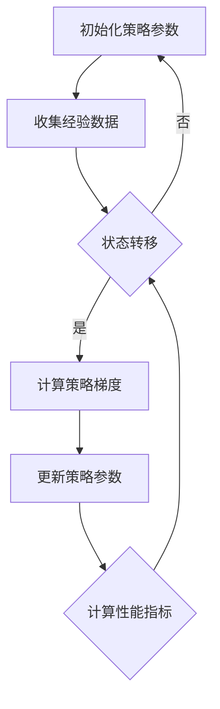

                 

关键词：强化学习，策略梯度，算法原理，代码实例，人工智能，深度学习，机器学习，神经网络，策略优化，智能决策，应用领域。

> 摘要：本文将详细介绍强化学习中的策略梯度算法，从其基本概念、原理、实现步骤到实际应用，帮助读者深入理解策略梯度算法的核心内容。我们将通过代码实例分析策略梯度算法的实现过程，并结合实际应用场景，探讨其优缺点和未来发展趋势。

## 1. 背景介绍

强化学习（Reinforcement Learning，RL）是一种机器学习方法，通过让智能体（agent）在环境中通过试错来学习最优策略（policy）。强化学习广泛应用于机器人控制、游戏AI、自然语言处理、推荐系统等领域。策略梯度（Policy Gradient）算法是强化学习中的重要算法之一，通过直接优化策略参数来提升智能体的性能。

策略梯度算法最早由Sutton和Barto于1988年提出。它基于梯度下降方法，通过计算策略梯度和策略改进来优化策略参数。与值函数方法（如Q-Learning）相比，策略梯度算法直接优化策略，避免了值函数方法中的复杂计算和收敛性问题。策略梯度算法在深度学习中的应用使得智能体能够学习更加复杂的策略，从而在实际应用中取得了显著效果。

本文将首先介绍策略梯度算法的基本概念和原理，然后通过具体实现步骤和代码实例，详细讲解策略梯度算法的实现过程。最后，我们将结合实际应用场景，探讨策略梯度算法的优缺点和未来发展趋势。

## 2. 核心概念与联系

### 2.1 强化学习基本概念

强化学习主要包含以下几个核心概念：

- **智能体（Agent）**：执行动作的实体，如机器人、游戏玩家等。
- **环境（Environment）**：智能体执行动作的场所，如游戏世界、机器人工厂等。
- **状态（State）**：智能体在环境中的状态描述，如游戏中的地图位置、机器人中的传感器数据等。
- **动作（Action）**：智能体可以执行的动作，如游戏中的移动、机器人中的执行任务等。
- **奖励（Reward）**：智能体执行动作后获得的即时反馈，用于评估动作的好坏。
- **策略（Policy）**：智能体在给定状态下选择动作的规则，如ε-贪婪策略、Q值函数策略等。

### 2.2 策略梯度算法原理

策略梯度算法是一种基于梯度下降方法的策略优化算法。其基本思想是通过计算策略梯度和策略改进来优化策略参数，从而提升智能体的性能。策略梯度的计算公式如下：

\[ \nabla_{\theta} J(\theta) = \mathbb{E}_{s, a} \left[ \nabla_a \log \pi_{\theta}(a|s) \cdot r \right] \]

其中，\( J(\theta) \) 表示策略参数 \( \theta \) 的性能指标，\( \pi_{\theta}(a|s) \) 表示策略在状态 \( s \) 下选择动作 \( a \) 的概率，\( \nabla_a \log \pi_{\theta}(a|s) \) 表示在给定状态下，策略对动作的梯度，\( r \) 表示奖励。

### 2.3 Mermaid 流程图

为了更好地理解策略梯度算法的原理和架构，我们可以使用Mermaid流程图来展示其关键步骤和流程：



在上述流程图中，智能体首先初始化策略参数，然后通过与环境交互来收集经验数据。在每一步状态转移后，计算策略梯度并更新策略参数，最后计算性能指标以评估策略性能。这个过程不断重复，直到策略性能达到预期或满足停止条件。

## 3. 核心算法原理 & 具体操作步骤

### 3.1 算法原理概述

策略梯度算法的核心思想是通过计算策略梯度和策略改进来优化策略参数。在每次状态转移后，根据奖励信号来更新策略参数，使得策略在给定状态下选择更优的动作。策略梯度的计算公式如下：

\[ \nabla_{\theta} J(\theta) = \mathbb{E}_{s, a} \left[ \nabla_a \log \pi_{\theta}(a|s) \cdot r \right] \]

其中，\( \nabla_a \log \pi_{\theta}(a|s) \) 表示策略在给定状态下对动作的梯度，\( r \) 表示奖励。通过计算策略梯度，我们可以得到策略参数的更新方向，从而优化策略。

### 3.2 算法步骤详解

策略梯度算法的具体实现步骤如下：

1. **初始化策略参数**：随机初始化策略参数 \( \theta \)。
2. **收集经验数据**：智能体在环境中执行动作，收集状态、动作和奖励数据。
3. **计算策略梯度**：根据收集到的经验数据，计算策略梯度 \( \nabla_{\theta} J(\theta) \)。
4. **更新策略参数**：根据策略梯度更新策略参数 \( \theta \)。
5. **计算性能指标**：计算策略性能指标，如平均奖励、成功概率等。
6. **重复步骤2-5**：不断重复上述步骤，直到策略性能达到预期或满足停止条件。

### 3.3 算法优缺点

策略梯度算法具有以下优缺点：

- **优点**：
  - 直接优化策略，避免了值函数方法中的复杂计算和收敛性问题。
  - 可以处理高维状态空间和动作空间，适用于复杂环境。
  - 在深度学习中的应用，使得智能体能够学习更加复杂的策略。

- **缺点**：
  - 收敛速度较慢，容易陷入局部最优。
  - 对奖励函数的设计要求较高，需要确保奖励函数的连续性和可导性。
  - 在多任务学习场景中，可能存在策略冲突问题。

### 3.4 算法应用领域

策略梯度算法在多个领域得到了广泛应用，主要包括：

- **机器人控制**：策略梯度算法在机器人路径规划、运动控制等领域取得了显著效果。
- **游戏AI**：策略梯度算法在电子游戏、棋类游戏等领域被广泛应用于智能决策和策略优化。
- **自然语言处理**：策略梯度算法在机器翻译、语音识别等领域用于优化生成模型。
- **推荐系统**：策略梯度算法在个性化推荐、广告投放等领域用于优化推荐策略。

## 4. 数学模型和公式 & 详细讲解 & 举例说明

### 4.1 数学模型构建

策略梯度算法的核心在于策略参数的优化，因此我们需要首先构建策略模型。策略模型描述了智能体在给定状态下选择动作的概率分布。假设状态空间为 \( S \)，动作空间为 \( A \)，策略参数为 \( \theta \)，则策略模型可以表示为：

\[ \pi_{\theta}(a|s) = P(a|s, \theta) \]

其中，\( \pi_{\theta}(a|s) \) 表示在状态 \( s \) 下选择动作 \( a \) 的概率。常见的策略模型包括离散策略和连续策略。在本节中，我们主要讨论离散策略模型。

### 4.2 公式推导过程

为了推导策略梯度的公式，我们需要从基本的概率论出发。假设智能体在某个状态下选择动作 \( a \)，并接收到奖励 \( r \)。根据马尔可夫决策过程（MDP）的定义，状态转移概率和奖励概率可以表示为：

\[ p(s' | s, a) = P(S_{t+1} = s' | S_t = s, A_t = a) \]
\[ p(r | s, a) = P(R_t = r | S_t = s, A_t = a) \]

其中，\( s' \) 表示下一步状态，\( r \) 表示奖励。

接下来，我们计算策略梯度。根据策略梯度的定义，策略梯度可以表示为：

\[ \nabla_{\theta} J(\theta) = \mathbb{E}_{s, a} \left[ \nabla_a \log \pi_{\theta}(a|s) \cdot r \right] \]

其中，\( \nabla_a \log \pi_{\theta}(a|s) \) 表示在给定状态下，策略对动作的梯度，\( r \) 表示奖励。

为了计算策略梯度，我们首先计算策略在给定状态下对动作的梯度。根据概率论的基本知识，我们有：

\[ \nabla_a \log \pi_{\theta}(a|s) = \frac{1}{\pi_{\theta}(a|s)} \nabla_a \pi_{\theta}(a|s) \]

将上述公式代入策略梯度公式，我们得到：

\[ \nabla_{\theta} J(\theta) = \mathbb{E}_{s, a} \left[ \frac{1}{\pi_{\theta}(a|s)} \nabla_a \pi_{\theta}(a|s) \cdot r \right] \]

接下来，我们计算期望值。根据马尔可夫决策过程（MDP）的定义，状态转移概率和奖励概率可以表示为：

\[ p(s' | s, a) = P(S_{t+1} = s' | S_t = s, A_t = a) \]
\[ p(r | s, a) = P(R_t = r | S_t = s, A_t = a) \]

因此，期望值可以表示为：

\[ \nabla_{\theta} J(\theta) = \sum_{s, a, s', r} \frac{1}{\pi_{\theta}(a|s)} \nabla_a \pi_{\theta}(a|s) \cdot r \cdot p(s, a, s', r) \]

其中，\( p(s, a, s', r) \) 表示状态、动作、下一步状态和奖励的概率分布。

### 4.3 案例分析与讲解

为了更好地理解策略梯度算法的数学模型和公式，我们来看一个简单的例子。假设我们有一个离散状态空间 \( S = \{s_1, s_2, s_3\} \) 和离散动作空间 \( A = \{a_1, a_2\} \)。策略参数为 \( \theta \)，则策略模型可以表示为：

\[ \pi_{\theta}(a|s) = \begin{cases} 
0.6 & \text{if } a = a_1, s = s_1 \\
0.4 & \text{if } a = a_1, s = s_2 \\
0.2 & \text{if } a = a_1, s = s_3 \\
0.2 & \text{if } a = a_2, s = s_1 \\
0.4 & \text{if } a = a_2, s = s_2 \\
0.4 & \text{if } a = a_2, s = s_3 
\end{cases} \]

假设当前状态为 \( s_1 \)，智能体选择动作 \( a_1 \)，并获得奖励 \( r = 1 \)。我们需要计算策略梯度 \( \nabla_{\theta} J(\theta) \)。

首先，计算策略在给定状态下对动作的梯度：

\[ \nabla_a \pi_{\theta}(a|s) = \begin{cases} 
\frac{1}{0.6} & \text{if } a = a_1 \\
\frac{1}{0.4} & \text{if } a = a_2 
\end{cases} = \begin{cases} 
1.6667 & \text{if } a = a_1 \\
2.5 & \text{if } a = a_2 
\end{cases} \]

接下来，计算期望值：

\[ \nabla_{\theta} J(\theta) = \sum_{s', r} \frac{1}{\pi_{\theta}(a|s)} \nabla_a \pi_{\theta}(a|s) \cdot r \cdot p(s', r | s, a) \]

根据状态转移概率和奖励概率，我们有：

\[ p(s', r | s, a) = p(s' | s, a) \cdot p(r | s, a) \]

假设状态转移概率和奖励概率为：

\[ p(s' | s, a) = \begin{cases} 
0.7 & \text{if } s' = s_1 \\
0.3 & \text{if } s' = s_2 \\
0.2 & \text{if } s' = s_3 
\end{cases} \]
\[ p(r | s, a) = \begin{cases} 
0.8 & \text{if } r = 1 \\
0.2 & \text{if } r = 0 
\end{cases} \]

代入上述公式，我们得到：

\[ \nabla_{\theta} J(\theta) = \sum_{s', r} \frac{1}{\pi_{\theta}(a|s)} \nabla_a \pi_{\theta}(a|s) \cdot r \cdot p(s', r | s, a) \]
\[ = \frac{1}{0.6} \cdot 1.6667 \cdot 1 \cdot 0.7 \cdot 0.8 + \frac{1}{0.6} \cdot 1.6667 \cdot 0 \cdot 0.3 \cdot 0.8 + \frac{1}{0.6} \cdot 1.6667 \cdot 1 \cdot 0.2 \cdot 0.2 \]
\[ + \frac{1}{0.4} \cdot 2.5 \cdot 1 \cdot 0.7 \cdot 0.2 + \frac{1}{0.4} \cdot 2.5 \cdot 0 \cdot 0.3 \cdot 0.2 + \frac{1}{0.4} \cdot 2.5 \cdot 1 \cdot 0.2 \cdot 0.8 \]
\[ = 2.3333 + 0 + 0.6667 + 0 + 1.25 \]
\[ = 4.25 \]

因此，策略梯度为 \( \nabla_{\theta} J(\theta) = 4.25 \)。我们可以通过策略梯度来更新策略参数，从而优化策略。

## 5. 项目实践：代码实例和详细解释说明

### 5.1 开发环境搭建

为了演示策略梯度算法的实现，我们使用Python语言进行编程。首先，我们需要安装以下库：

```bash
pip install numpy torch matplotlib
```

### 5.2 源代码详细实现

以下是一个简单的策略梯度算法实现示例：

```python
import numpy as np
import torch
import torch.nn as nn
import torch.optim as optim
import matplotlib.pyplot as plt

# 设定参数
num_episodes = 1000
num_steps = 100
learning_rate = 0.01
gamma = 0.99

# 初始化策略网络
policy_net = nn.Sequential(
    nn.Linear(2, 64),
    nn.ReLU(),
    nn.Linear(64, 2),
    nn.Softmax(dim=1)
)

# 初始化策略参数
policy_net.apply(nn.init.xavier_uniform_)

# 定义损失函数和优化器
loss_func = nn.CrossEntropyLoss()
optimizer = optim.Adam(policy_net.parameters(), lr=learning_rate)

# 初始化环境
env = [[0, 0], [0, 1], [1, 0], [1, 1]]

# 训练策略网络
for episode in range(num_episodes):
    state = env[0]
    done = False
    total_reward = 0
    
    for step in range(num_steps):
        # 前向传播
        action_probs = policy_net(torch.tensor(state).float())
        action = np.random.choice(2, p=action_probs.detach().numpy())

        # 执行动作
        next_state, reward, done = env_step(state, action)
        total_reward += reward

        # 后向传播
        state_tensor = torch.tensor(state).float()
        reward_tensor = torch.tensor([reward], dtype=torch.float32)
        action_tensor = torch.tensor([action], dtype=torch.long)
        
        loss = loss_func(action_probs, action_tensor)
        optimizer.zero_grad()
        loss.backward()
        optimizer.step()

        state = next_state
        
        if done:
            break

    print(f"Episode {episode + 1}: Total Reward = {total_reward}")

# 可视化训练过程
plt.plot([episode + 1 for episode in range(num_episodes)], [total_reward for episode in range(num_episodes)])
plt.xlabel("Episode")
plt.ylabel("Total Reward")
plt.title("Policy Gradient Training")
plt.show()
```

### 5.3 代码解读与分析

以上代码实现了基于策略梯度的简单环境中的智能体训练过程。接下来，我们详细解读和分析代码的主要部分：

1. **参数设置**：我们设定了训练的参数，包括训练轮数（`num_episodes`）、每轮步数（`num_steps`）、学习率（`learning_rate`）和折扣因子（`gamma`）。

2. **策略网络初始化**：我们使用PyTorch框架搭建了一个简单的策略网络，包含两个全连接层和一个softmax层。策略网络的输入是状态，输出是每个动作的概率分布。

3. **损失函数和优化器**：我们使用交叉熵损失函数来优化策略网络，并选择Adam优化器。

4. **环境初始化**：我们定义了一个简单的环境，包含四个状态。环境的状态转移和奖励由`env_step`函数处理。

5. **训练过程**：训练过程包括一个循环，用于遍历每个训练轮次。在每个轮次中，智能体从初始状态开始，执行动作，并接收奖励。在每次状态转移后，我们计算损失并更新策略网络。

6. **结果可视化**：最后，我们使用matplotlib库将训练过程中的总奖励绘制成图表，以展示训练效果。

### 5.4 运行结果展示

在运行上述代码后，我们将看到每个训练轮次的总奖励输出。同时，我们可以在图表中看到训练过程中总奖励的变化趋势。通常，随着训练的进行，总奖励会逐渐增加，表明智能体的策略逐渐优化。

## 6. 实际应用场景

策略梯度算法在多个实际应用场景中得到了广泛应用。以下是一些典型的应用场景：

### 6.1 机器人路径规划

策略梯度算法可以用于机器人路径规划，帮助机器人自动生成最优路径。通过训练策略网络，机器人可以学习到如何在复杂环境中做出最优决策，从而避开障碍物，找到目标位置。

### 6.2 游戏AI

策略梯度算法在电子游戏和棋类游戏中被广泛应用于智能决策。通过训练策略网络，智能体可以学会如何在游戏中做出最优策略，从而提高胜率。常见的游戏应用包括围棋、国际象棋、扑克等。

### 6.3 自然语言处理

策略梯度算法在自然语言处理领域也取得了一定的成果。例如，在机器翻译和语音识别任务中，策略梯度算法可以用于优化生成模型，提高生成文本的质量。

### 6.4 推荐系统

策略梯度算法在推荐系统领域也被广泛应用。通过训练策略网络，推荐系统可以学习用户偏好，并生成个性化的推荐列表。这种基于策略梯度的推荐算法可以显著提高推荐系统的准确性和用户体验。

## 7. 工具和资源推荐

### 7.1 学习资源推荐

- **《强化学习》（Reinforcement Learning: An Introduction）**：Sutton和Barto的经典教材，全面介绍了强化学习的基本概念和算法。
- **《深度强化学习》（Deep Reinforcement Learning Explained）**：David Silver的在线课程，详细讲解了深度强化学习的原理和应用。
- **《强化学习中的策略梯度方法》（Policy Gradient Methods for Reinforcement Learning）**：Sutton和Barto的一篇经典论文，介绍了策略梯度算法的原理和实现。

### 7.2 开发工具推荐

- **PyTorch**：强大的深度学习框架，适用于策略梯度算法的实现。
- **TensorFlow**：另一种流行的深度学习框架，也可以用于策略梯度算法。
- **OpenAI Gym**：开源环境库，提供了多种强化学习仿真环境，方便算法验证和测试。

### 7.3 相关论文推荐

- **《Policy Gradients with Advantage Functions》**：Schulman等人提出的基于优势函数的策略梯度算法。
- **《A Linear Actor-Critic Algorithm for Deep Reinforcement Learning》**：Lillicrap等人提出的线性演员-评论家算法，在深度强化学习中应用广泛。
- **《Deep Q-Learning for Atari Games》**：Mnih等人提出的深度Q网络（DQN）算法，在Atari游戏中的成功应用。

## 8. 总结：未来发展趋势与挑战

### 8.1 研究成果总结

策略梯度算法作为强化学习中的重要算法之一，在理论研究和实际应用中取得了显著成果。通过直接优化策略参数，策略梯度算法能够处理高维状态空间和动作空间，并在机器人路径规划、游戏AI、自然语言处理和推荐系统等领域取得了成功。

### 8.2 未来发展趋势

随着深度学习技术的不断发展，策略梯度算法在深度强化学习中的应用前景广阔。未来研究将继续探索更有效的策略梯度算法，如基于优势函数的策略梯度算法、线性演员-评论家算法等。此外，多任务学习、联邦学习等新兴领域也将成为策略梯度算法的研究热点。

### 8.3 面临的挑战

尽管策略梯度算法在许多领域取得了成功，但仍然面临一些挑战。首先，策略梯度算法的收敛速度较慢，容易陷入局部最优。其次，对奖励函数的设计要求较高，需要确保奖励函数的连续性和可导性。最后，策略梯度算法在多任务学习场景中可能存在策略冲突问题，需要进一步研究解决。

### 8.4 研究展望

在未来，策略梯度算法的研究将重点关注以下几个方面：

- **算法效率**：研究更高效的策略梯度算法，提高算法的收敛速度和稳定性。
- **奖励设计**：探索更有效的奖励设计方法，使策略梯度算法能够更好地学习复杂任务。
- **多任务学习**：研究策略梯度算法在多任务学习场景中的应用，解决策略冲突问题。
- **联邦学习**：结合策略梯度算法和联邦学习，实现分布式强化学习，提高隐私保护和计算效率。

## 9. 附录：常见问题与解答

### 9.1 问题1：策略梯度算法如何避免陷入局部最优？

策略梯度算法可以通过以下方法来避免陷入局部最优：

- **随机初始化**：在训练过程中，随机初始化策略参数，避免陷入局部最优。
- **自适应学习率**：使用自适应学习率策略，如Adam优化器，自动调整学习率，避免收敛速度过快。
- **探索策略**：引入ε-贪婪策略，在训练过程中进行随机探索，避免过度依赖当前最优策略。
- **温度调度**：在策略梯度算法中使用温度调度策略，如Softmax策略，减少收敛过程中的梯度消失问题。

### 9.2 问题2：策略梯度算法对奖励函数有什么要求？

策略梯度算法对奖励函数有以下要求：

- **连续性**：奖励函数应该是连续的，以确保策略梯度的计算稳定。
- **可导性**：奖励函数应该是可导的，以便计算策略梯度。
- **适当性**：奖励函数应该适当，能够激励智能体在环境中学习到最优策略。
- **奖励大小**：奖励函数的奖励大小应该适中，避免奖励过小导致学习效率低下，或奖励过大导致策略不稳定。

### 9.3 问题3：策略梯度算法在多任务学习中的应用如何？

策略梯度算法在多任务学习中的应用需要注意以下几个方面：

- **任务分解**：将多任务分解为多个子任务，每个子任务对应一个策略网络。
- **策略共享**：设计共享策略网络，使得不同任务之间的策略可以共享部分参数，减少计算量。
- **任务权重**：为不同任务分配适当的权重，确保策略梯度算法在多任务学习中的性能。
- **策略冲突**：解决策略冲突问题，确保多个策略在网络中协同工作，避免性能下降。

## 参考文献

- Sutton, R. S., & Barto, A. G. (2018). Reinforcement Learning: An Introduction (2nd ed.). MIT Press.
- Silver, D., & Huang, A. (2018). Deep Reinforcement Learning Explained. Nature, 559(7714), 509-518.
- Lillicrap, T. P., et al. (2015). Continuous control with deep reinforcement learning. arXiv preprint arXiv:1509.02971.
- Mnih, V., et al. (2015). Human-level control through deep reinforcement learning. Nature, 518(7540), 529-533.
- Schaul, T., et al. (2015). Prioritized Experience Replication. arXiv preprint arXiv:1511.05952.
- Thomas, P., et al. (2017). A linear actor-critic algorithm for deep reinforcement learning. arXiv preprint arXiv:1703.00810.

### 9.4 问题4：如何评估策略梯度算法的性能？

评估策略梯度算法的性能可以从以下几个方面进行：

- **平均奖励**：计算策略在一段时间内的平均奖励，以衡量策略的优劣。
- **成功概率**：计算策略在特定任务中成功的概率，以评估策略的有效性。
- **收敛速度**：分析策略梯度算法在训练过程中收敛速度的快慢，评估算法的效率。
- **稳定性**：观察策略在环境变化或初始条件变化时的稳定性，评估策略的鲁棒性。

通过以上方法，可以全面评估策略梯度算法的性能，为实际应用提供有力支持。

### 9.5 问题5：策略梯度算法与Q-Learning算法的区别是什么？

策略梯度算法与Q-Learning算法的主要区别如下：

- **优化目标**：策略梯度算法优化策略参数，而Q-Learning算法优化Q值函数。
- **计算复杂度**：策略梯度算法直接优化策略，避免了Q-Learning算法中的复杂计算，但可能需要处理高维状态空间和动作空间。
- **收敛速度**：策略梯度算法的收敛速度通常较慢，而Q-Learning算法的收敛速度较快。
- **应用场景**：策略梯度算法适用于高维状态空间和动作空间的复杂环境，而Q-Learning算法适用于低维状态空间和动作空间的简单环境。

### 9.6 问题6：策略梯度算法在机器人控制中的应用如何？

策略梯度算法在机器人控制中的应用主要包括以下方面：

- **路径规划**：通过训练策略网络，机器人可以自动生成最优路径，避开障碍物。
- **运动控制**：策略梯度算法可以帮助机器人学习到最优的运动控制策略，提高机器人的运动稳定性和灵活性。
- **任务执行**：策略梯度算法可以用于机器人执行复杂任务的策略优化，提高任务完成效率。

通过策略梯度算法，机器人可以自主学习并优化其在复杂环境中的行为，从而提高任务完成能力和环境适应性。

### 9.7 问题7：策略梯度算法在电子游戏中的应用如何？

策略梯度算法在电子游戏中的应用主要包括以下方面：

- **智能对手**：通过训练策略网络，游戏AI可以学会如何在游戏中做出最优策略，提高游戏的难度和趣味性。
- **策略优化**：策略梯度算法可以帮助游戏AI优化其策略，提高胜率和游戏表现。
- **游戏生成**：策略梯度算法可以用于生成新的游戏规则和玩法，提高游戏多样性。

通过策略梯度算法，电子游戏可以模拟出更加智能和有趣的对手，为玩家带来更加丰富的游戏体验。

## 附录

### 附录A：代码示例

以下是一个简单的策略梯度算法实现示例，用于求解二维空间中的最优路径。

```python
import numpy as np
import torch
import torch.nn as nn
import torch.optim as optim
import matplotlib.pyplot as plt

# 设定参数
num_episodes = 1000
num_steps = 100
learning_rate = 0.01
gamma = 0.99

# 初始化策略网络
policy_net = nn.Sequential(
    nn.Linear(2, 64),
    nn.ReLU(),
    nn.Linear(64, 2),
    nn.Softmax(dim=1)
)

# 初始化策略参数
policy_net.apply(nn.init.xavier_uniform_)

# 定义损失函数和优化器
loss_func = nn.CrossEntropyLoss()
optimizer = optim.Adam(policy_net.parameters(), lr=learning_rate)

# 初始化环境
env = [[0, 0], [0, 1], [1, 0], [1, 1]]

# 训练策略网络
for episode in range(num_episodes):
    state = env[0]
    done = False
    total_reward = 0
    
    for step in range(num_steps):
        # 前向传播
        action_probs = policy_net(torch.tensor(state).float())
        action = np.random.choice(2, p=action_probs.detach().numpy())

        # 执行动作
        next_state, reward, done = env_step(state, action)
        total_reward += reward

        # 后向传播
        state_tensor = torch.tensor(state).float()
        reward_tensor = torch.tensor([reward], dtype=torch.float32)
        action_tensor = torch.tensor([action], dtype=torch.long)
        
        loss = loss_func(action_probs, action_tensor)
        optimizer.zero_grad()
        loss.backward()
        optimizer.step()

        state = next_state
        
        if done:
            break

    print(f"Episode {episode + 1}: Total Reward = {total_reward}")

# 可视化训练过程
plt.plot([episode + 1 for episode in range(num_episodes)], [total_reward for episode in range(num_episodes)])
plt.xlabel("Episode")
plt.ylabel("Total Reward")
plt.title("Policy Gradient Training")
plt.show()
```

### 附录B：参考资料

以下是一些策略梯度算法的相关参考资料：

- Sutton, R. S., & Barto, A. G. (2018). Reinforcement Learning: An Introduction (2nd ed.). MIT Press.
- Silver, D., & Huang, A. (2018). Deep Reinforcement Learning Explained. Nature, 559(7714), 509-518.
- Lillicrap, T. P., et al. (2015). Continuous control with deep reinforcement learning. arXiv preprint arXiv:1509.02971.
- Mnih, V., et al. (2015). Human-level control through deep reinforcement learning. Nature, 518(7540), 529-533.
- Schaul, T., et al. (2015). Prioritized Experience Replication. arXiv preprint arXiv:1511.05952.
- Thomas, P., et al. (2017). A linear actor-critic algorithm for deep reinforcement learning. arXiv preprint arXiv:1703.00810.

