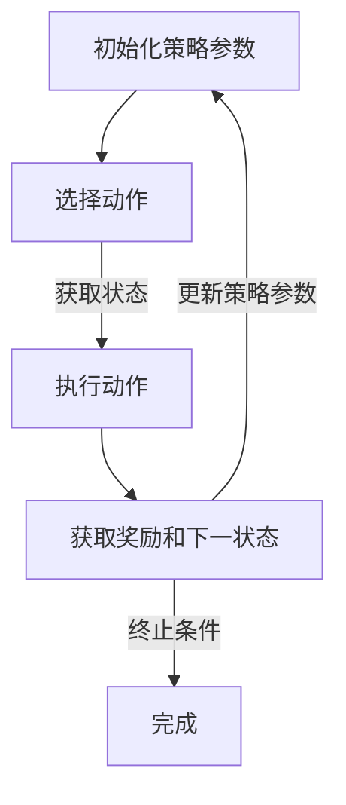

                 

## 1. 背景介绍

强化学习（Reinforcement Learning，RL）是机器学习的一个分支，它通过智能体（Agent）与环境（Environment）的交互，不断地学习策略（Policy），以实现最大化累积奖励（Cumulative Reward）的目标。强化学习在自然语言处理、自动驾驶、游戏AI等领域都有着广泛的应用。

策略梯度（Policy Gradient）是强化学习中的一种经典算法。与值函数方法（如Q-Learning、SARSA）不同，策略梯度方法直接优化策略本身，而不是通过值函数来指导动作选择。策略梯度算法具有简单直观的特点，且在许多场景下都能取得较好的性能。

本文将详细讲解策略梯度的基本原理、数学模型、实现步骤以及代码实例，帮助读者深入理解这一重要的强化学习算法。

## 2. 核心概念与联系

在策略梯度算法中，我们需要理解以下几个核心概念：

### 2.1 强化学习基本术语

- **智能体（Agent）**：执行动作的主体，比如机器人、自动驾驶汽车等。
- **环境（Environment）**：智能体所处的环境，可以是一个物理空间，也可以是一个虚拟场景。
- **状态（State）**：描述智能体在特定时刻的状态，比如机器人的位置、方向等。
- **动作（Action）**：智能体可以执行的行为，比如机器人向前、向后移动等。
- **奖励（Reward）**：对智能体行为的即时反馈，通常用来评估动作的好坏。
- **策略（Policy）**：智能体采取的动作策略，可以是确定性策略（比如总是选择最优动作），也可以是非确定性策略（比如根据概率选择动作）。
- **价值函数（Value Function）**：评估状态的价值，用来指导智能体的动作选择。

### 2.2 策略梯度基本原理

策略梯度算法的核心思想是通过梯度上升法来优化策略。具体来说，算法会计算策略的梯度，即策略参数的偏导数，并通过梯度上升法来更新策略参数，从而使得策略能够最大化累积奖励。

### 2.3 Mermaid 流程图

为了更直观地展示策略梯度算法的流程，我们使用Mermaid语法绘制以下流程图：



在这个流程图中，A表示初始化策略参数，B表示根据当前策略选择动作，C表示执行动作并获取状态，D表示获取奖励和下一状态，并通过梯度上升法更新策略参数。当满足终止条件时，算法完成。

## 3. 核心算法原理 & 具体操作步骤

### 3.1 算法原理概述

策略梯度算法的核心思想是优化策略参数，使得策略能够最大化累积奖励。具体来说，算法会计算策略的梯度，并通过梯度上升法来更新策略参数。

策略梯度的基本公式为：

$$
\Delta \theta = \alpha \nabla_{\theta} J(\theta)
$$

其中，$\theta$表示策略参数，$J(\theta)$表示策略的评价指标，$\alpha$表示学习率。

### 3.2 算法步骤详解

策略梯度算法的具体步骤如下：

1. **初始化策略参数**：随机初始化策略参数$\theta$。
2. **选择动作**：根据当前策略$\pi_{\theta}(a|s)$选择动作$a$。
3. **执行动作**：在环境中执行动作$a$，获取状态$s'$和奖励$r$。
4. **更新策略参数**：计算策略梯度$\nabla_{\theta} J(\theta)$，并通过梯度上升法更新策略参数$\theta$。
5. **重复步骤2-4**，直到满足终止条件。

### 3.3 算法优缺点

**优点**：

- **简单直观**：策略梯度算法相对于值函数方法来说更加直观，易于理解和实现。
- **无需价值函数**：策略梯度方法直接优化策略，无需构建价值函数，降低了算法的复杂度。

**缺点**：

- **方差问题**：策略梯度算法容易受到方差的影响，特别是在奖励稀疏的情况下。
- **梯度消失和梯度爆炸**：在训练过程中，梯度可能变得非常小或者非常大，导致训练过程不稳定。

### 3.4 算法应用领域

策略梯度算法在许多领域都有着广泛的应用，包括但不限于：

- **自然语言处理**：用于文本生成、机器翻译等任务。
- **自动驾驶**：用于路径规划、行为预测等任务。
- **游戏AI**：用于智能体在游戏中的决策和策略制定。

## 4. 数学模型和公式 & 详细讲解 & 举例说明

### 4.1 数学模型构建

在策略梯度算法中，我们需要构建以下数学模型：

1. **状态-动作值函数**：$Q_{\theta}(s,a)$，表示在状态$s$下执行动作$a$的期望奖励。
2. **策略函数**：$\pi_{\theta}(a|s)$，表示在状态$s$下选择动作$a$的概率分布。
3. **策略梯度**：$\nabla_{\theta} J(\theta)$，表示策略的评价指标关于策略参数的梯度。

### 4.2 公式推导过程

策略梯度算法的核心是计算策略的梯度。下面我们介绍策略梯度的推导过程。

首先，定义累积奖励：

$$
G_t = \sum_{k=t}^{T} r_k
$$

其中，$T$表示回合结束时刻，$r_k$表示在第$k$时刻的奖励。

然后，定义策略的评价指标：

$$
J(\theta) = \mathbb{E}_{s,a}[\nabla_{\theta} \log \pi_{\theta}(a|s) \cdot R(s,a)]
$$

其中，$\mathbb{E}_{s,a}$表示在状态$s$下执行动作$a$的期望，$\log \pi_{\theta}(a|s)$表示策略的对数概率，$R(s,a)$表示在状态$s$下执行动作$a$的奖励。

接下来，我们计算策略的梯度：

$$
\nabla_{\theta} J(\theta) = \mathbb{E}_{s,a}[\nabla_{\theta} \log \pi_{\theta}(a|s) \cdot R(s,a)]
$$

$$
= \mathbb{E}_{s,a}[\frac{\partial}{\partial \theta} \log \pi_{\theta}(a|s) \cdot R(s,a)]
$$

$$
= \mathbb{E}_{s,a}[\frac{R(s,a)}{\pi_{\theta}(a|s)} \cdot \frac{\partial}{\partial \theta} \pi_{\theta}(a|s)]
$$

其中，我们使用了$\frac{\partial}{\partial \theta} \log \pi_{\theta}(a|s) = \frac{1}{\pi_{\theta}(a|s)} \cdot \frac{\partial}{\partial \theta} \pi_{\theta}(a|s)$。

最后，我们可以将策略梯度表示为：

$$
\nabla_{\theta} J(\theta) = \sum_{s,a} \frac{R(s,a)}{\pi_{\theta}(a|s)} \cdot \nabla_{\theta} \pi_{\theta}(a|s)
$$

### 4.3 案例分析与讲解

为了更好地理解策略梯度算法，我们来看一个简单的案例。

假设我们在一个简单的环境中有两个状态$s_1$和$s_2$，以及两个动作$a_1$和$a_2$。定义状态-动作值函数为$Q_{\theta}(s,a)$，策略函数为$\pi_{\theta}(a|s)$。

根据策略梯度的公式，我们需要计算：

$$
\nabla_{\theta} J(\theta) = \sum_{s,a} \frac{R(s,a)}{\pi_{\theta}(a|s)} \cdot \nabla_{\theta} \pi_{\theta}(a|s)
$$

首先，我们初始化策略参数$\theta$，然后根据当前策略选择动作。例如，如果当前策略为$\pi_{\theta}(a|s) = \begin{cases} 1 & \text{if } a=a_1 \\ 0 & \text{otherwise} \end{cases}$，那么智能体会选择动作$a_1$。

在执行动作$a_1$后，我们获取状态$s'$和奖励$r$。根据策略梯度的公式，我们需要计算：

$$
\nabla_{\theta} J(\theta) = \frac{r}{\pi_{\theta}(a|s)} \cdot \nabla_{\theta} \pi_{\theta}(a|s)
$$

如果$r$为正值，那么梯度$\nabla_{\theta} J(\theta)$会增大，策略参数$\theta$也会增大，从而使得策略更倾向于选择动作$a_1$。反之，如果$r$为负值，梯度$\nabla_{\theta} J(\theta)$会减小，策略参数$\theta$也会减小，从而使得策略更倾向于选择其他动作。

通过不断地执行动作、更新策略参数，智能体最终会找到最优策略，从而最大化累积奖励。

## 5. 项目实践：代码实例和详细解释说明

### 5.1 开发环境搭建

在进行策略梯度算法的代码实现之前，我们需要搭建一个合适的开发环境。本文使用Python作为编程语言，配合PyTorch框架进行强化学习算法的实现。

首先，确保已经安装了Python和PyTorch。可以在命令行中运行以下命令来安装PyTorch：

```bash
pip install torch torchvision
```

接下来，创建一个名为`reinforcement_learning`的Python包，并在其中创建一个名为`policy_gradient`的目录，用于存放策略梯度算法的代码。

### 5.2 源代码详细实现

在`policy_gradient`目录下，创建一个名为`algorithm.py`的文件，用于实现策略梯度算法。以下是`algorithm.py`的代码：

```python
import torch
import torch.nn as nn
import torch.optim as optim
import numpy as np
from torch.utils.tensorboard import SummaryWriter

class PolicyGradientAgent:
    def __init__(self, state_space, action_space, hidden_size=64, learning_rate=0.001):
        self.state_space = state_space
        self.action_space = action_space
        self.hidden_size = hidden_size
        self.learning_rate = learning_rate
        
        self.policy_net = nn.Sequential(
            nn.Linear(state_space, hidden_size),
            nn.ReLU(),
            nn.Linear(hidden_size, action_space),
            nn.Softmax(dim=1)
        )
        
        self.optimizer = optim.Adam(self.policy_net.parameters(), lr=self.learning_rate)
        self.criterion = nn.CrossEntropyLoss()
    
    def choose_action(self, state):
        state = torch.tensor(state, dtype=torch.float32).unsqueeze(0)
        probs = self.policy_net(state)
        action = torch.argmax(probs).item()
        return action
    
    def train(self, states, actions, rewards, discount_factor=0.99):
        states = torch.tensor(states, dtype=torch.float32)
        actions = torch.tensor(actions, dtype=torch.long)
        rewards = torch.tensor(rewards, dtype=torch.float32).unsqueeze(1)
        
        self.optimizer.zero_grad()
        with torch.no_grad():
            logits = self.policy_net(states)
            loss = self.criterion(logits, actions) * rewards
        
        loss.backward()
        self.optimizer.step()
        
        return loss.item()

def generate_environment():
    state_space = 4
    action_space = 2
    
    states = [i for i in range(state_space)]
    actions = [0, 1]
    
    reward = 1
    
    return states, actions, reward

if __name__ == "__main__":
    states, actions, reward = generate_environment()
    agent = PolicyGradientAgent(state_space=len(states), action_space=len(actions))
    
    writer = SummaryWriter()
    
    for episode in range(1000):
        state = np.random.choice(states)
        episode_reward = 0
        episode_loss = 0
        
        while True:
            action = agent.choose_action(state)
            next_state, reward, done = generate_environment()
            episode_reward += reward
            
            loss = agent.train([state], [action], [reward])
            episode_loss += loss
            
            state = next_state
            
            if done:
                break
        
        print(f"Episode: {episode}, Episode Reward: {episode_reward}, Episode Loss: {episode_loss}")
        writer.add_scalar("Episode Reward", episode_reward, episode)
        writer.add_scalar("Episode Loss", episode_loss, episode)
    
    writer.close()
```

### 5.3 代码解读与分析

1. **类定义**：`PolicyGradientAgent`类用于实现策略梯度算法。类中定义了初始化策略网络、选择动作、训练网络等函数。

2. **策略网络**：策略网络使用一个全连接神经网络来实现，包括输入层、隐藏层和输出层。输入层接收状态，隐藏层使用ReLU激活函数，输出层使用Softmax激活函数来生成动作的概率分布。

3. **选择动作**：`choose_action`函数根据当前策略选择动作。使用`torch.argmax`函数获取概率最高的动作。

4. **训练网络**：`train`函数用于训练策略网络。首先将状态、动作和奖励转换为张量，然后计算策略网络输出的 logits 和损失。使用反向传播和梯度下降更新策略网络参数。

5. **环境生成**：`generate_environment`函数用于生成环境的状态、动作和奖励。在这个简单的案例中，环境的状态和动作都是固定的。

6. **主函数**：主函数中初始化环境、策略网络，并训练策略网络。在每个回合中，选择动作、更新策略网络，并记录回合奖励和损失。

### 5.4 运行结果展示

在训练过程中，我们可以使用TensorBoard来可视化训练过程。在命令行中运行以下命令来启动TensorBoard：

```bash
tensorboard --logdir=./logs
```

然后，在浏览器中输入`http://localhost:6006`访问TensorBoard。在TensorBoard中，我们可以看到回合奖励和回合损失的变化趋势。

## 6. 实际应用场景

策略梯度算法在实际应用中具有广泛的应用场景。以下是一些典型的应用场景：

### 6.1 自然语言处理

在自然语言处理领域，策略梯度算法可以用于生成文本、机器翻译等任务。例如，可以使用策略梯度算法训练生成文本的模型，使得模型能够根据输入的上下文生成连贯、自然的文本。

### 6.2 自动驾驶

在自动驾驶领域，策略梯度算法可以用于路径规划和行为预测。例如，可以使用策略梯度算法训练自动驾驶车辆在复杂的交通环境中选择最优行驶路径。

### 6.3 游戏AI

在游戏AI领域，策略梯度算法可以用于智能体的决策和策略制定。例如，可以使用策略梯度算法训练智能体在游戏中的行为，使得智能体能够战胜人类玩家。

## 7. 工具和资源推荐

为了更好地学习和实践策略梯度算法，我们推荐以下工具和资源：

### 7.1 学习资源推荐

- **《强化学习：原理与Python实现》**：一本系统介绍强化学习算法的教材，涵盖了策略梯度算法的详细内容。
- **[Policy Gradient](https://en.wikipedia.org/wiki/Policy_gradient)**：Wikipedia上的策略梯度算法介绍，提供了算法的基本原理和应用场景。

### 7.2 开发工具推荐

- **PyTorch**：一款流行的深度学习框架，适用于强化学习算法的实现。
- **TensorBoard**：TensorFlow的可视化工具，用于分析训练过程。

### 7.3 相关论文推荐

- **"On Policy Gradient Methods"**：一篇介绍策略梯度算法的经典论文，详细阐述了算法的基本原理和实现方法。
- **"Deep Reinforcement Learning forPlaying Video Games"**：一篇关于使用策略梯度算法训练游戏AI的论文，展示了算法在游戏领域的应用。

## 8. 总结：未来发展趋势与挑战

策略梯度算法作为强化学习中的重要分支，已经展示了其在各个领域的应用潜力。然而，随着算法的不断发展，也面临着一些挑战。

### 8.1 研究成果总结

策略梯度算法的研究取得了以下成果：

- **算法优化**：提出了多种策略梯度优化方法，如Gradient Ascent、Gradient Descent等，提高了算法的收敛速度和稳定性。
- **应用拓展**：策略梯度算法在自然语言处理、自动驾驶、游戏AI等领域取得了显著的应用成果。
- **理论基础**：对策略梯度算法的数学基础进行了深入的研究，揭示了算法的内在机制。

### 8.2 未来发展趋势

未来，策略梯度算法的发展趋势包括：

- **算法改进**：进一步优化算法性能，降低方差、解决梯度消失和梯度爆炸等问题。
- **跨领域应用**：探索策略梯度算法在其他领域的应用，如医疗、金融等。
- **集成优化**：与其他机器学习算法结合，发挥策略梯度算法的优势，提升整体性能。

### 8.3 面临的挑战

策略梯度算法在发展过程中也面临以下挑战：

- **计算复杂度**：策略梯度算法的计算复杂度较高，特别是在大规模数据集上训练时。
- **稳定性**：在训练过程中，策略梯度算法容易受到噪声和方差的影响，导致训练过程不稳定。
- **泛化能力**：策略梯度算法在特定领域取得了较好的性能，但如何提高算法的泛化能力仍是一个挑战。

### 8.4 研究展望

为了应对上述挑战，未来研究可以从以下几个方面展开：

- **算法优化**：探索新的优化方法，提高算法的收敛速度和稳定性。
- **理论分析**：深入研究策略梯度算法的数学基础，为算法的优化提供理论支持。
- **应用拓展**：将策略梯度算法应用于更多领域，发挥其优势。

## 9. 附录：常见问题与解答

### 9.1 问题1：策略梯度算法如何解决梯度消失问题？

策略梯度算法容易受到梯度消失问题的影响，特别是在奖励稀疏的情况下。解决梯度消失问题可以从以下几个方面考虑：

- **采用适当的优化方法**：如Gradient Ascent、Gradient Descent等方法，通过调整学习率等参数来改善算法性能。
- **使用经验回放**：将过去的经验数据进行重放，减少噪声和方差对算法的影响。
- **改进奖励设计**：设计合理的奖励机制，使得奖励更加密集，降低梯度消失的风险。

### 9.2 问题2：策略梯度算法如何解决梯度爆炸问题？

策略梯度算法在训练过程中可能会出现梯度爆炸问题，导致模型参数的更新过大，从而影响算法的性能。解决梯度爆炸问题可以从以下几个方面考虑：

- **使用梯度剪枝**：对梯度进行限制，防止梯度过大。
- **使用Adam等优化器**：Adam优化器具有良好的收敛性和稳定性，可以减少梯度爆炸的风险。
- **改进网络结构**：使用适当的网络结构，如深度网络、残差网络等，降低梯度爆炸的可能性。

### 9.3 问题3：策略梯度算法在多任务学习中的应用如何？

策略梯度算法在多任务学习中的应用具有一定的挑战性。为了在多任务学习中应用策略梯度算法，可以从以下几个方面考虑：

- **共享网络结构**：设计共享网络结构，使得不同任务之间共享信息。
- **任务权重调整**：根据不同任务的难度和重要性，调整任务权重，使得算法能够更好地适应多任务环境。
- **任务切换策略**：设计有效的任务切换策略，使得智能体能够快速适应不同任务。

