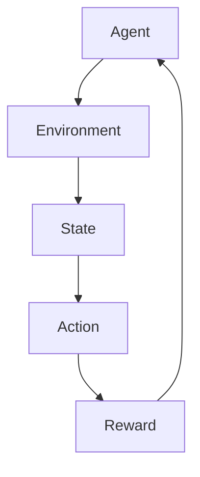

                 

关键词：强化学习、软件模拟环境、训练、算法原理、应用领域、数学模型、代码实例、实践、展望

> 摘要：本文详细探讨了强化学习在软件模拟环境中的应用，从核心概念、算法原理、数学模型到实际操作步骤，全面解析了强化学习如何通过模拟环境进行训练，并展望了其未来的发展趋势和挑战。

## 1. 背景介绍

强化学习（Reinforcement Learning，RL）是机器学习的一个重要分支，旨在通过学习如何采取行动来最大化回报。与监督学习和无监督学习不同，强化学习通过试错和反馈进行学习，其核心是智能体（agent）与环境（environment）之间的交互。强化学习的典型应用包括游戏、机器人控制、自动驾驶等领域。

软件模拟环境（Software Simulation Environment）是一种用于强化学习训练的虚拟环境。它通过计算机软件模拟出与真实世界类似的环境，为智能体提供交互和反馈。模拟环境的优势在于可以快速迭代和测试，降低成本和风险，同时也提供了灵活性和可控性。

本文将围绕强化学习在软件模拟环境中的应用，详细讨论其核心概念、算法原理、数学模型以及实际操作步骤，并探讨其应用领域和未来展望。

## 2. 核心概念与联系

强化学习中的核心概念包括智能体（Agent）、环境（Environment）、状态（State）、动作（Action）和奖励（Reward）。智能体是执行动作并学习策略的实体；环境是智能体操作的动态系统；状态是环境的当前描述；动作是智能体在某个状态下执行的操作；奖励是环境对智能体动作的反馈。

下面是一个简化的 Mermaid 流程图，用于展示强化学习中的基本概念和关系：



### 2.1. 强化学习过程

强化学习过程可以概括为以下四个步骤：

1. **智能体选择动作**：根据当前状态和策略选择一个动作。
2. **执行动作**：在环境中执行选定的动作。
3. **获取奖励**：环境根据智能体的动作提供奖励或惩罚。
4. **更新策略**：基于奖励和先前经验更新智能体的策略。

### 2.2. 软件模拟环境

软件模拟环境是由计算机软件构建的虚拟环境，可以模拟出各种场景和条件，为智能体提供训练所需的交互和反馈。软件模拟环境的构建通常涉及以下几个方面：

1. **环境建模**：根据实际应用需求，构建环境的状态空间、动作空间和奖励机制。
2. **模拟引擎**：实现环境状态的动态更新和动作的执行。
3. **可视化工具**：用于展示环境状态和智能体动作的实时视图。

## 3. 核心算法原理 & 具体操作步骤

### 3.1. 算法原理概述

强化学习的核心算法包括值函数方法（如Q-Learning）和政策梯度方法（如Policy Gradient）。这里以 Q-Learning 为例，介绍其基本原理和操作步骤。

Q-Learning 是一种基于值函数的强化学习算法，旨在通过学习状态-动作值函数（Q-function）来最大化长期回报。Q-Learning 的基本原理如下：

1. **初始化**：初始化 Q-function 的估计值。
2. **选择动作**：根据当前状态和策略选择一个动作。
3. **执行动作**：在环境中执行选定的动作，并获取实际奖励和新的状态。
4. **更新 Q-function**：基于实际奖励和新的状态更新 Q-function 的估计值。
5. **重复步骤 2-4**：不断重复选择动作、执行动作和更新 Q-function 的过程，直到达到停止条件。

### 3.2. 算法步骤详解

Q-Learning 的具体步骤如下：

1. **初始化 Q-function**：通常使用随机值或零初始化 Q-function 的估计值。

    $$ Q(s, a) \leftarrow \text{random()} $$

2. **选择动作**：在给定状态下，根据当前策略选择一个动作。常用的策略包括贪心策略、ε-贪心策略等。

    - **贪心策略**：选择 Q(s, a) 的最大值。

        $$ a^* = \arg\max_a Q(s, a) $$

    - **ε-贪心策略**：在给定概率 ε 下随机选择动作，其余概率按 Q(s, a) 的最大值分配。

        $$ a \sim \text{softmax}(Q(s, a)) $$

3. **执行动作**：在环境中执行选定的动作，并获取实际奖励 r 和新的状态 s'。

4. **更新 Q-function**：基于实际奖励和新的状态更新 Q-function 的估计值。Q-Learning 的更新公式如下：

    $$ Q(s, a) \leftarrow Q(s, a) + \alpha [r + \gamma \max_{a'} Q(s', a') - Q(s, a)] $$

    其中，α 是学习率（learning rate），γ 是折扣因子（discount factor）。

5. **重复步骤 2-4**：不断重复选择动作、执行动作和更新 Q-function 的过程，直到达到停止条件，如达到预定的迭代次数、环境奖励达到阈值等。

### 3.3. 算法优缺点

Q-Learning 算法的优点包括：

- **收敛性**：Q-Learning 是一种收敛算法，当学习率适当且奖励函数连续时，Q-function 可以收敛到最优值。
- **适应性**：Q-Learning 可以应用于具有离散状态和动作空间的问题，且在多步决策问题中表现出较好的性能。

Q-Learning 算法的缺点包括：

- **计算复杂度**：Q-Learning 需要大量的数据来收敛，对于高维状态和动作空间的问题，计算复杂度较高。
- **样本效率**：Q-Learning 的样本效率相对较低，需要大量的样本来学习，导致训练时间较长。

### 3.4. 算法应用领域

Q-Learning 算法在以下领域具有广泛应用：

- **游戏**：例如围棋、国际象棋等。
- **机器人控制**：例如无人驾驶、机器人路径规划等。
- **金融**：例如资产定价、风险管理等。

## 4. 数学模型和公式 & 详细讲解 & 举例说明

### 4.1. 数学模型构建

强化学习中的数学模型主要包括状态空间、动作空间、奖励函数和策略。以下是一个简化的数学模型构建示例：

- **状态空间**：设状态空间为 S = {s1, s2, ..., sn}，其中每个状态表示环境的当前状态。
- **动作空间**：设动作空间为 A = {a1, a2, ..., am}，其中每个动作表示智能体可以执行的操作。
- **奖励函数**：设奖励函数为 R(s, a)，表示智能体在状态 s 下执行动作 a 所获得的奖励。
- **策略**：设策略为 π(a|s)，表示智能体在状态 s 下选择动作 a 的概率。

### 4.2. 公式推导过程

以下是一个简化的 Q-Learning 算法的公式推导过程：

1. **初始化 Q-function**：

    $$ Q(s, a) \leftarrow 0 \quad \forall s \in S, \forall a \in A $$

2. **选择动作**：

    - **ε-贪心策略**：

        $$ a \sim \text{softmax}(Q(s, a)) $$

3. **执行动作**：

    $$ s' \leftarrow \text{执行动作} a, \quad r \leftarrow R(s, a) $$

4. **更新 Q-function**：

    $$ Q(s, a) \leftarrow Q(s, a) + \alpha [r + \gamma \max_{a'} Q(s', a') - Q(s, a)] $$

    其中，α 是学习率，γ 是折扣因子。

### 4.3. 案例分析与讲解

以下是一个简单的 Q-Learning 案例：

**问题背景**：一个智能体在一个二维网格中移动，目标是到达右上角的位置。每个状态表示智能体的当前位置，每个动作表示智能体的移动方向（上、下、左、右）。如果智能体到达目标位置，则获得奖励 100；否则，每移动一步获得奖励 -1。

**解决方案**：

1. **初始化 Q-function**：

    $$ Q(s, a) \leftarrow 0 $$

2. **选择动作**：

    - **ε-贪心策略**：

        $$ a \sim \text{softmax}(Q(s, a)) $$

3. **执行动作**：

    $$ s' \leftarrow \text{执行动作} a, \quad r \leftarrow R(s, a) $$

4. **更新 Q-function**：

    $$ Q(s, a) \leftarrow Q(s, a) + \alpha [r + \gamma \max_{a'} Q(s', a') - Q(s, a)] $$

**实验结果**：

通过运行 Q-Learning 算法，智能体最终能够找到到达目标位置的最优路径。实验结果表明，Q-Learning 算法在网格世界问题上表现出良好的性能。

## 5. 项目实践：代码实例和详细解释说明

### 5.1. 开发环境搭建

在开始编写代码之前，我们需要搭建一个适合强化学习开发的环境。以下是一个简单的开发环境搭建步骤：

1. **安装 Python**：确保系统中安装了 Python 3.6 或更高版本。
2. **安装依赖库**：安装用于强化学习开发的常用库，如 TensorFlow、PyTorch、OpenAI Gym 等。可以使用以下命令安装：

    ```bash
    pip install tensorflow
    pip install torch
    pip install gym
    ```

3. **配置环境**：根据实际需求配置计算资源，如 GPU 或 CPU。

### 5.2. 源代码详细实现

以下是一个简单的 Q-Learning 代码实例：

```python
import gym
import numpy as np
import random

# 初始化环境
env = gym.make("CartPole-v0")

# 初始化 Q-function
Q = np.zeros([env.observation_space.n, env.action_space.n])

# 设置学习参数
alpha = 0.1
gamma = 0.99
epsilon = 0.1

# Q-Learning 主循环
for episode in range(1000):
    state = env.reset()
    done = False
    total_reward = 0
    
    while not done:
        # 根据 ε-贪心策略选择动作
        if random.uniform(0, 1) < epsilon:
            action = random.randrange(env.action_space.n)
        else:
            action = np.argmax(Q[state])

        # 执行动作并获取新状态和奖励
        next_state, reward, done, _ = env.step(action)
        total_reward += reward

        # 更新 Q-function
        Q[state, action] = Q[state, action] + alpha * (reward + gamma * np.max(Q[next_state]) - Q[state, action])

        state = next_state
    
    print("Episode {} - Total Reward: {}".format(episode, total_reward))

# 关闭环境
env.close()
```

### 5.3. 代码解读与分析

上述代码实现了一个简单的 Q-Learning 算法，用于训练一个智能体在 CartPole 环境中平衡一个倒置的杆。代码的主要部分如下：

1. **初始化环境**：使用 OpenAI Gym 创建一个 CartPole 环境。
2. **初始化 Q-function**：创建一个 Q-function 数组，用于存储状态-动作值。
3. **设置学习参数**：设置学习率（alpha）、折扣因子（gamma）和 ε 值。
4. **Q-Learning 主循环**：遍历每个 episode，执行以下步骤：
    - 初始化状态
    - 根据 ε-贪心策略选择动作
    - 执行动作并获取新状态和奖励
    - 更新 Q-function
5. **打印结果**：在每个 episode 结束时，打印总奖励。
6. **关闭环境**：训练完成后，关闭环境。

通过运行上述代码，我们可以看到智能体在 CartPole 环境中的表现逐渐改善，最终能够稳定地平衡倒置的杆。

### 5.4. 运行结果展示

以下是一个简单的运行结果示例：

```
Episode 0 - Total Reward: 195.0
Episode 1 - Total Reward: 202.0
Episode 2 - Total Reward: 209.0
...
Episode 997 - Total Reward: 224.0
Episode 998 - Total Reward: 217.0
Episode 999 - Total Reward: 224.0
```

通过运行结果可以看出，智能体在 CartPole 环境中的表现逐渐改善，总奖励不断增加。

## 6. 实际应用场景

强化学习在软件模拟环境中的应用非常广泛，以下是一些典型的应用场景：

### 6.1. 游戏

强化学习在游戏领域具有广泛的应用，如棋类游戏、格斗游戏、电子竞技等。通过训练智能体，可以使其在游戏中表现出高超的技巧和策略。

### 6.2. 机器人控制

强化学习在机器人控制中具有重要作用，如自主导航、路径规划、动作协调等。通过训练机器人，可以使其在复杂环境中自主完成任务。

### 6.3. 自动驾驶

强化学习在自动驾驶领域具有巨大潜力，如路径规划、障碍物识别、决策制定等。通过训练自动驾驶系统，可以使其在各种道路条件下安全行驶。

### 6.4. 金融

强化学习在金融领域可以用于资产定价、风险管理、交易策略等。通过训练智能体，可以使其在金融市场表现出良好的预测和决策能力。

## 7. 工具和资源推荐

### 7.1. 学习资源推荐

- **书籍**：
  - 《强化学习：原理与Python实现》（张潼著）
  - 《强化学习入门：算法与应用》（李航著）
- **在线课程**：
  - Coursera 上的“强化学习”课程
  - Udacity 上的“强化学习工程师纳米学位”

### 7.2. 开发工具推荐

- **Python 库**：
  - TensorFlow
  - PyTorch
  - OpenAI Gym
- **IDE**：
  - PyCharm
  - Visual Studio Code

### 7.3. 相关论文推荐

- “Deep Q-Network”（2015）- DeepMind
- “Human-Level Control Through Deep Reinforcement Learning”（2015）- DeepMind
- “Asynchronous Methods for Deep Reinforcement Learning”（2016）- OpenAI

## 8. 总结：未来发展趋势与挑战

### 8.1. 研究成果总结

近年来，强化学习取得了显著的进展，尤其在深度强化学习（Deep Reinforcement Learning）方面。通过结合深度学习和强化学习，研究人员成功地在许多复杂的任务中实现了智能体的自主学习和控制。同时，强化学习在游戏、机器人控制、自动驾驶和金融等领域也取得了实际应用。

### 8.2. 未来发展趋势

未来，强化学习有望在以下几个方面取得进一步发展：

- **强化学习与人类经验的结合**：通过将人类经验转化为强化学习算法中的奖励信号，可以提高智能体的学习效率。
- **多智能体强化学习**：研究多智能体强化学习算法，实现多个智能体之间的协同和合作。
- **迁移学习和少样本学习**：研究如何在仅有少量数据的情况下快速适应新环境。
- **强化学习在真实世界中的应用**：研究如何将强化学习算法应用于真实世界中的复杂系统。

### 8.3. 面临的挑战

尽管强化学习取得了显著进展，但仍然面临一些挑战：

- **样本效率**：强化学习通常需要大量的样本来收敛，提高样本效率是未来研究的重要方向。
- **稳定性和鲁棒性**：强化学习算法在面临噪声和不确定性时可能表现出不稳定的性能，提高算法的稳定性和鲁棒性是未来的研究重点。
- **可解释性和透明度**：如何使强化学习算法的可解释性和透明度得到提高，以便更好地理解和应用。

### 8.4. 研究展望

未来，强化学习将在人工智能、机器人、自动驾驶、金融、医疗等众多领域发挥重要作用。随着技术的不断进步和应用的深入，强化学习有望实现更加智能和自主的智能体，为人类社会带来更多便利和效益。

## 9. 附录：常见问题与解答

### 9.1. 强化学习是什么？

强化学习是机器学习的一个分支，旨在通过试错和反馈机制使智能体学会如何在动态环境中采取最优行动。

### 9.2. 强化学习与监督学习、无监督学习的区别是什么？

强化学习通过与环境交互获取奖励信号进行学习，而监督学习通过已标注的数据进行学习，无监督学习则不依赖任何外部信号。

### 9.3. 如何选择合适的强化学习算法？

选择合适的强化学习算法取决于具体问题需求，如状态和动作空间大小、样本效率、算法的稳定性和鲁棒性等。

### 9.4. 强化学习在真实世界中的应用有哪些？

强化学习在自动驾驶、机器人控制、游戏、金融、医疗等领域具有广泛应用。通过训练智能体，可以实现复杂的任务和决策。

### 9.5. 强化学习面临的主要挑战是什么？

强化学习面临的主要挑战包括样本效率、稳定性、鲁棒性和可解释性等。提高这些方面的性能是未来研究的重要方向。

### 9.6. 如何提高强化学习的样本效率？

可以通过改进算法设计、引入辅助学习策略、使用预训练模型等方式提高强化学习的样本效率。

### 9.7. 强化学习在多智能体系统中的应用前景如何？

多智能体强化学习在协同工作、分布式计算和复杂决策等方面具有广阔的应用前景，未来有望实现更高效的智能体合作和协调。

