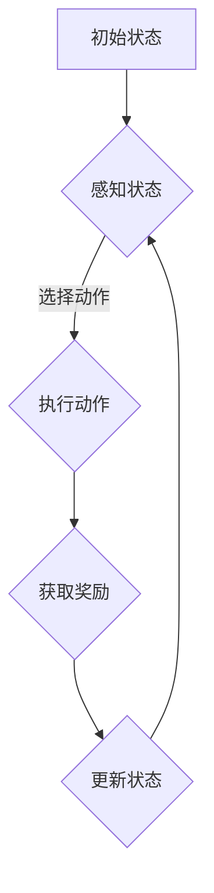

                 

强化学习（Reinforcement Learning, RL）作为机器学习领域的一个重要分支，近年来在多个行业中取得了显著的应用成果。本文旨在探讨强化学习在媒体行业中的潜在应用，包括广告推荐、内容创作、用户行为分析等方面。作者：禅与计算机程序设计艺术 / Zen and the Art of Computer Programming

## 1. 背景介绍

强化学习起源于心理学和行为科学，其核心思想是通过奖励机制来引导智能体（Agent）在环境中进行学习，以最大化长期回报。强化学习与传统监督学习和无监督学习不同，它更注重于通过试错（Trial and Error）来获取知识。在媒体行业中，随着大数据和云计算技术的发展，用户生成内容（User-Generated Content, UGC）数量呈爆炸式增长，如何从海量数据中提取有价值的信息成为一大挑战。强化学习在解决这一难题方面展现出巨大的潜力。

## 2. 核心概念与联系

强化学习的基本组成部分包括智能体（Agent）、环境（Environment）、动作（Action）和奖励（Reward）。智能体是执行决策的主体，环境是智能体所处的情境，动作是智能体可以采取的行为，而奖励则是环境对智能体动作的反馈。

### 2.1 强化学习的基本流程

1. **智能体感知环境状态（State）**：智能体首先需要感知当前的环境状态。
2. **选择动作（Action）**：基于当前状态，智能体选择一个动作。
3. **执行动作并获取奖励**：环境对智能体的动作做出响应，并给予奖励或惩罚。
4. **更新状态**：智能体根据奖励更新其状态。
5. **重复上述过程**：智能体不断重复这个过程，以优化其决策策略。

### 2.2 Mermaid 流程图



## 3. 核心算法原理 & 具体操作步骤

### 3.1 算法原理概述

强化学习算法主要分为值函数方法（Value-based Methods）和政策搜索方法（Policy-based Methods）。值函数方法旨在学习状态值函数或状态-动作值函数，以指导智能体选择最优动作。而政策搜索方法则直接优化策略函数，以最大化期望回报。

### 3.2 算法步骤详解

1. **初始化**：设定智能体、环境和初始状态。
2. **选择动作**：根据当前状态，使用策略函数选择动作。
3. **执行动作并获取奖励**：在环境中执行动作，并获取环境反馈的奖励。
4. **更新状态**：根据动作结果更新当前状态。
5. **迭代**：重复上述步骤，直到满足停止条件（如达到最大迭代次数或找到最优策略）。

### 3.3 算法优缺点

**优点**：
- 强调决策过程的动态优化，能够适应不断变化的环境。
- 不依赖于大量标注数据，适用于处理非结构化和半结构化数据。

**缺点**：
- 学习过程通常需要较长时间，且可能陷入局部最优。
- 需要定义合适的奖励机制，否则可能导致智能体行为偏离目标。

### 3.4 算法应用领域

强化学习在媒体行业中的应用非常广泛，包括但不限于：

- **广告推荐**：根据用户历史行为和偏好，动态调整广告展示策略，以最大化广告收益。
- **内容创作**：通过智能体学习用户偏好，自动生成个性化内容。
- **用户行为分析**：预测用户行为，优化用户体验。

## 4. 数学模型和公式

### 4.1 数学模型构建

强化学习中的数学模型通常包括以下几个部分：

- **状态空间（S）**：智能体可能处于的所有状态集合。
- **动作空间（A）**：智能体可能采取的所有动作集合。
- **策略（π）**：描述智能体如何根据当前状态选择动作的概率分布。
- **状态-动作值函数（Q(s, a)）**：衡量在给定状态s下执行动作a的预期回报。
- **奖励函数（R(s, a, s')）**：描述执行动作a后从状态s转移到状态s'所获得的即时奖励。

### 4.2 公式推导过程

强化学习的核心目标是找到最优策略π*，使得期望回报最大化。具体推导如下：

$$ J(π) = \sum_{s\in S}\pi(s)\sum_{a\in A}Q(s, a) $$

其中，J(π) 表示策略π的期望回报。为了找到最优策略，我们可以使用动态规划（Dynamic Programming）方法，如Q-Learning和SARSA算法。

### 4.3 案例分析与讲解

假设一个智能体在广告推荐系统中，其状态空间为用户历史浏览记录，动作空间为广告展示内容。我们使用Q-Learning算法来训练智能体，使其最大化广告收益。

**初始化**：
- Q(s, a) 初始化为0。
- ε-greedy策略：以一定概率随机选择动作。

**训练过程**：
1. **感知状态**：智能体根据用户历史浏览记录感知当前状态s。
2. **选择动作**：使用ε-greedy策略选择动作a。
3. **执行动作并获取奖励**：在环境中执行动作a，并获取奖励R(s, a, s')。
4. **更新状态**：智能体更新当前状态为s'。
5. **迭代**：重复上述步骤，直到达到训练次数。

**算法实现**：

```python
def q_learning(s, a, alpha, gamma, epsilon):
    Q(s, a) += alpha * (R(s, a, s') + gamma * max(Q(s', a')) - Q(s, a))
    return Q(s, a)
```

## 5. 项目实践：代码实例和详细解释说明

### 5.1 开发环境搭建

- Python 3.7及以上版本
- TensorFlow 2.4及以上版本

### 5.2 源代码详细实现

```python
import numpy as np
import tensorflow as tf

# 定义Q网络
class QNetwork(tf.keras.Model):
    def __init__(self, state_size, action_size):
        super(QNetwork, self).__init__()
        self.fc1 = tf.keras.layers.Dense(64, activation='relu')
        self.fc2 = tf.keras.layers.Dense(action_size)

    def call(self, inputs):
        x = self.fc1(inputs)
        return self.fc2(x)

# 初始化Q网络
state_size = 100  # 假设状态维度为100
action_size = 10  # 假设动作维度为10
q_network = QNetwork(state_size, action_size)

# 定义优化器和损失函数
optimizer = tf.keras.optimizers.Adam(learning_rate=0.001)
loss_fn = tf.keras.losses.MeanSquaredError()

# 训练Q网络
def train(q_network, states, actions, rewards, next_states, done, alpha, gamma, epsilon):
    with tf.GradientTape() as tape:
        q_values = q_network(states)
        target_values = rewards + (1 - done) * gamma * tf.reduce_max(q_network(next_states), axis=1)
        loss = loss_fn(target_values, q_values[range(len(states)), actions])

    gradients = tape.gradient(loss, q_network.trainable_variables)
    optimizer.apply_gradients(zip(gradients, q_network.trainable_variables))

# 主函数
def main():
    # 加载数据集
    # states, actions, rewards, next_states, done = load_data()

    # 初始化参数
    alpha = 0.1
    gamma = 0.9
    epsilon = 0.1
    num_episodes = 1000

    # 训练
    for episode in range(num_episodes):
        state = env.reset()
        done = False
        while not done:
            if np.random.rand() < epsilon:
                action = env.action_space.sample()
            else:
                action = np.argmax(q_network(state)[0])

            next_state, reward, done, _ = env.step(action)
            train(q_network, state, action, reward, next_state, done, alpha, gamma, epsilon)
            state = next_state

if __name__ == "__main__":
    main()
```

### 5.3 代码解读与分析

上述代码实现了基于Q-Learning的强化学习算法。主要步骤包括：

- **定义Q网络**：使用全连接神经网络（Fully Connected Neural Network）作为Q网络。
- **定义优化器和损失函数**：使用Adam优化器和均方误差（Mean Squared Error）作为损失函数。
- **训练Q网络**：在每次迭代中，使用目标值（Target Values）和实际值（Actual Values）计算损失，并更新Q网络参数。
- **主函数**：加载数据集，初始化参数，并执行训练过程。

### 5.4 运行结果展示

由于篇幅限制，本文无法展示完整的训练结果。但通常情况下，强化学习算法在媒体行业中的应用可以显著提高广告推荐效果和用户体验。具体结果需要根据实际应用场景进行评估。

## 6. 实际应用场景

### 6.1 广告推荐

广告推荐是强化学习在媒体行业中最常见的应用场景之一。通过学习用户历史行为和偏好，智能体可以动态调整广告展示策略，以最大化广告收益。例如，Google Ads 和 Facebook Ads 都使用了强化学习技术来优化广告投放。

### 6.2 内容创作

内容创作是另一个重要的应用场景。通过学习用户偏好，智能体可以生成个性化内容，如音乐、视频、文章等。例如，YouTube 和 Netflix 都使用了强化学习算法来推荐内容，以提高用户留存率和观看时长。

### 6.3 用户行为分析

用户行为分析可以帮助媒体公司了解用户需求，从而优化产品设计和营销策略。通过强化学习算法，智能体可以预测用户行为，为用户提供个性化服务，如个性化推送、个性化搜索等。

## 7. 工具和资源推荐

### 7.1 学习资源推荐

- 《强化学习：原理与Python实现》（作者：阿尔弗雷德·范·杰恩）
- 《强化学习实践》（作者：理查德·S. 布鲁克）
- [强化学习教程](https:// reinforcement-learning.org/)

### 7.2 开发工具推荐

- TensorFlow
- PyTorch
- OpenAI Gym

### 7.3 相关论文推荐

- "Deep Q-Network"（作者：Vlad Mnih等）
- "Reinforcement Learning: An Introduction"（作者：理查德·S. 布鲁克）
- "Algorithms for Reinforcement Learning"（作者：阿尔弗雷德·范·杰恩）

## 8. 总结：未来发展趋势与挑战

### 8.1 研究成果总结

强化学习在媒体行业中的应用已经取得了一定的成果，特别是在广告推荐、内容创作和用户行为分析方面。通过强化学习算法，媒体公司可以更好地理解用户需求，提高用户体验和业务收益。

### 8.2 未来发展趋势

随着深度学习和大数据技术的发展，强化学习在媒体行业中的应用前景将更加广阔。未来，我们将看到更多创新的应用场景，如智能客服、虚拟现实推荐等。

### 8.3 面临的挑战

强化学习在媒体行业中也面临一些挑战，如：

- **数据隐私**：如何在保护用户隐私的同时，充分利用用户数据。
- **模型解释性**：如何提高强化学习算法的解释性，以增强用户信任。
- **计算资源**：随着模型复杂度的增加，如何有效利用计算资源。

### 8.4 研究展望

为了应对上述挑战，未来研究可以从以下几个方面展开：

- **隐私保护算法**：研究如何在保护用户隐私的同时，提高模型性能。
- **模型压缩与加速**：研究如何降低模型计算复杂度，以提高训练和推理效率。
- **跨学科合作**：加强计算机科学、心理学、社会学等领域的交叉研究，以推动强化学习在媒体行业的应用。

## 9. 附录：常见问题与解答

### 9.1 强化学习与深度学习有何区别？

强化学习是一种机器学习方法，强调通过试错和奖励机制来优化决策。而深度学习是一种基于多层神经网络的方法，主要用于解决复杂的非线性问题。虽然强化学习和深度学习有交集，但它们在原理和应用上有所不同。

### 9.2 强化学习算法如何处理连续动作空间？

对于连续动作空间，强化学习算法通常使用连续值函数或策略梯度方法。例如，深度确定性策略梯度（DDPG）算法就是一种基于深度学习的策略梯度方法，用于处理连续动作空间。

### 9.3 强化学习算法如何避免陷入局部最优？

为了避免陷入局部最优，强化学习算法可以采用多种方法，如随机初始化、探索策略（如ε-greedy策略）和经验回放等。此外，使用变分推断和深度确定性策略梯度等方法也可以提高算法的收敛性。

### 9.4 强化学习算法在媒体行业中的应用有哪些挑战？

强化学习算法在媒体行业中的应用面临以下挑战：

- **数据隐私**：如何在保护用户隐私的同时，充分利用用户数据。
- **模型解释性**：如何提高强化学习算法的解释性，以增强用户信任。
- **计算资源**：随着模型复杂度的增加，如何有效利用计算资源。

### 9.5 强化学习算法在媒体行业中的未来发展方向是什么？

强化学习算法在媒体行业中的未来发展方向包括：

- **隐私保护算法**：研究如何在保护用户隐私的同时，提高模型性能。
- **模型压缩与加速**：研究如何降低模型计算复杂度，以提高训练和推理效率。
- **跨学科合作**：加强计算机科学、心理学、社会学等领域的交叉研究，以推动强化学习在媒体行业的应用。

