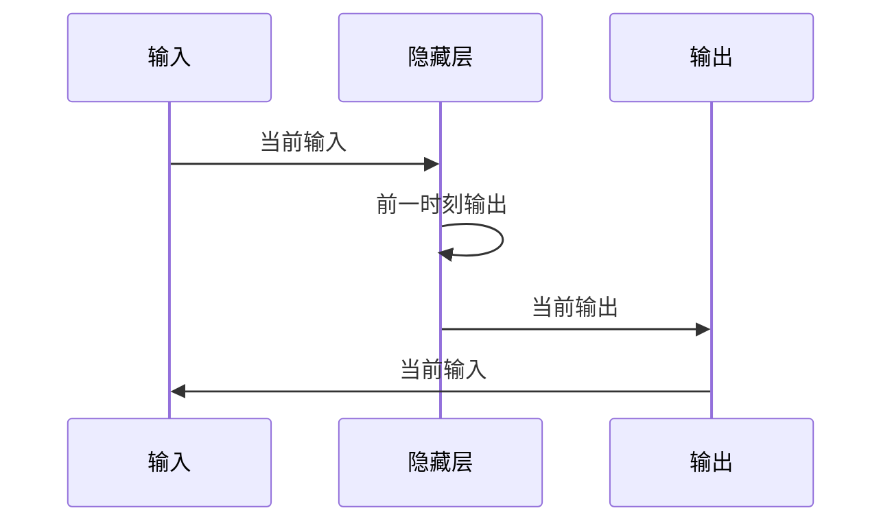

                 

 关键词：循环神经网络 (RNN)、深度学习、序列数据处理、时间序列分析、自然语言处理、代码实例

## 摘要

循环神经网络（RNN）是一种在处理序列数据方面具有显著优势的人工神经网络模型。本文将深入探讨RNN的基本原理、核心概念、数学模型以及具体应用，并通过实际代码实例，详细讲解如何使用RNN进行序列数据的建模与处理。通过本文的学习，读者将能够理解RNN的工作机制，掌握其实现方法，并在实际项目中应用RNN解决序列数据处理问题。

## 1. 背景介绍

### 序列数据的重要性

序列数据在各个领域中有着广泛的应用，如语音识别、自然语言处理、股票市场预测、视频分析等。这些数据往往包含时间上的先后关系和依赖性，传统的神经网络模型难以捕捉到这种序列特征。为了解决这一问题，研究者们提出了循环神经网络（RNN）。

### RNN的发展历程

RNN最早由Hochreiter和Schmidhuber在1997年提出。随后，通过Long Short-Term Memory (LSTM) 和 Gated Recurrent Unit (GRU) 等变体的改进，RNN在处理长序列数据方面取得了显著进展。

### RNN的应用领域

RNN在多个领域得到了广泛应用，如自然语言处理中的语言模型、机器翻译、情感分析等；在语音识别和生成中，RNN被用于语音信号的建模和处理；在时间序列预测中，RNN可以用于股票价格、天气预测等。

## 2. 核心概念与联系

### 基本概念

RNN是一种能够处理序列数据的神经网络模型，其基本结构包括输入层、隐藏层和输出层。隐藏层中的神经元不仅接收当前时刻的输入，还接收前一个时刻隐藏层的输出，形成一种循环结构。

### Mermaid 流程图



### 核心联系

- **时间依赖性**：RNN通过循环结构捕捉时间序列数据中的依赖关系。
- **序列处理**：RNN能够对序列数据进行逐步处理，并在每个时间步上更新状态。
- **动态建模**：RNN适用于动态变化的序列数据，能够捕捉长短期依赖关系。

## 3. 核心算法原理 & 具体操作步骤

### 3.1 算法原理概述

RNN通过递归的方式处理序列数据，每个时间步上的输出不仅依赖于当前输入，还受到之前所有时间步输出影响。这一特性使得RNN能够捕捉序列数据中的长期依赖关系。

### 3.2 算法步骤详解

1. **初始化**：初始化网络参数，包括输入层、隐藏层和输出层的权重。
2. **输入数据**：输入序列数据到网络中，包括每个时间步的输入特征。
3. **递归计算**：对于每个时间步，计算隐藏层和输出层的输出。
4. **损失计算**：计算输出结果与实际结果之间的损失。
5. **反向传播**：使用梯度下降算法更新网络参数。

### 3.3 算法优缺点

**优点**：

- 能够处理任意长度的序列数据。
- 可以捕捉序列数据中的长期依赖关系。

**缺点**：

- 训练过程容易出现梯度消失或梯度爆炸问题。
- 在处理非常长的序列时，性能会显著下降。

### 3.4 算法应用领域

- 自然语言处理：语言模型、机器翻译、文本分类等。
- 语音识别：语音信号的建模和处理。
- 时间序列预测：股票价格预测、天气预测等。

## 4. 数学模型和公式 & 详细讲解 & 举例说明

### 4.1 数学模型构建

RNN的数学模型基于递归方程，可以表示为：

$$
h_t = \sigma(W_h h_{t-1} + W_x x_t + b_h)
$$

$$
y_t = \sigma(W_y h_t + b_y)
$$

其中，$h_t$ 表示隐藏层状态，$x_t$ 表示输入特征，$y_t$ 表示输出特征，$W_h$、$W_x$、$W_y$ 分别为权重矩阵，$b_h$、$b_y$ 分别为偏置项，$\sigma$ 表示激活函数。

### 4.2 公式推导过程

- 隐藏层状态更新：基于当前输入和前一时刻的隐藏状态，通过线性组合和激活函数得到当前隐藏状态。
- 输出特征更新：基于当前隐藏状态，通过线性组合和激活函数得到当前输出特征。

### 4.3 案例分析与讲解

假设我们有一个时间序列数据集，数据集包含5个时间点的数据，每个时间点的数据为1个特征。我们使用RNN对该时间序列数据进行建模，并预测下一个时间点的数据。

1. **初始化**：设置网络参数，如权重矩阵、偏置项等。
2. **输入数据**：将时间序列数据输入到网络中。
3. **递归计算**：对于每个时间步，计算隐藏层和输出层的输出。
4. **损失计算**：计算输出结果与实际结果之间的损失，并更新网络参数。
5. **预测**：使用训练好的网络，对下一个时间点的数据进行预测。

## 5. 项目实践：代码实例和详细解释说明

### 5.1 开发环境搭建

为了演示RNN的使用，我们将使用Python语言和TensorFlow框架进行开发。

1. 安装Python环境。
2. 安装TensorFlow库。

```bash
pip install tensorflow
```

### 5.2 源代码详细实现

```python
import tensorflow as tf
import numpy as np

# 定义RNN模型
class RNNModel(tf.keras.Model):
    def __init__(self, hidden_size):
        super(RNNModel, self).__init__()
        self.rnn = tf.keras.layers.SimpleRNN(hidden_size, return_sequences=True)
        self.dense = tf.keras.layers.Dense(1)

    def call(self, inputs):
        x = self.rnn(inputs)
        x = self.dense(x)
        return x

# 初始化模型
model = RNNModel(hidden_size=50)

# 编译模型
model.compile(optimizer='adam', loss='mse')

# 训练模型
model.fit(x_train, y_train, epochs=100, batch_size=32)

# 预测
predictions = model.predict(x_test)
```

### 5.3 代码解读与分析

- **RNN模型定义**：使用TensorFlow的`SimpleRNN`层构建RNN模型，并添加一个全连接层进行输出。
- **编译模型**：选择适当的优化器和损失函数进行模型编译。
- **训练模型**：使用训练数据对模型进行训练。
- **预测**：使用训练好的模型对测试数据进行预测。

### 5.4 运行结果展示

运行上述代码后，我们将得到训练和预测结果。通过对比预测结果和实际结果，我们可以评估模型的性能。

## 6. 实际应用场景

### 6.1 自然语言处理

RNN在自然语言处理领域有着广泛的应用，如语言模型、机器翻译、文本分类等。通过捕捉文本中的时间依赖性，RNN能够提高模型的准确性和效果。

### 6.2 语音识别

语音识别是RNN的另一个重要应用领域。RNN可以用于语音信号的建模和处理，从而实现对语音信号的识别和转换。

### 6.3 时间序列预测

RNN在时间序列预测中也具有显著优势。通过捕捉时间序列中的长期依赖关系，RNN可以用于股票价格预测、天气预测等。

## 7. 未来应用展望

随着深度学习技术的不断发展，RNN及其变体在各个领域中的应用将会越来越广泛。未来，RNN有望在更多领域发挥其优势，解决更多复杂问题。

## 8. 工具和资源推荐

### 7.1 学习资源推荐

- 《深度学习》（Goodfellow et al.）
- 《循环神经网络：理论与实践》（Graves）
- 《自然语言处理入门》（Jurafsky et al.）

### 7.2 开发工具推荐

- TensorFlow
- PyTorch
- Keras

### 7.3 相关论文推荐

- Hochreiter, S., & Schmidhuber, J. (1997). Long short-term memory. Neural Computation, 9(8), 1735-1780.
- Cho, K., Van Merriënboer, B., Gulcehre, C., Bahdanau, D., Bougares, F., Schwenk, H., & Bengio, Y. (2014). Learning phrase representations using RNN encoder-decoder for statistical machine translation. arXiv preprint arXiv:1406.1078.

## 9. 总结：未来发展趋势与挑战

### 9.1 研究成果总结

RNN作为一种有效的序列数据处理模型，在自然语言处理、语音识别、时间序列预测等领域取得了显著成果。通过不断改进和优化，RNN在处理长序列数据、捕捉长期依赖关系方面具有显著优势。

### 9.2 未来发展趋势

- RNN及其变体（如LSTM、GRU等）将在更多领域得到应用。
- 结合其他深度学习技术（如Transformer）将进一步提高序列数据处理的性能。
- 研究将重点关注如何提高RNN的训练效率和泛化能力。

### 9.3 面临的挑战

- 如何有效解决RNN训练中的梯度消失和梯度爆炸问题。
- 如何在保持模型效果的同时，提高模型的训练效率。
- 如何在更广泛的领域中应用RNN，解决更复杂的序列数据处理问题。

### 9.4 研究展望

未来，RNN将在深度学习领域发挥越来越重要的作用。通过不断的研究和创新，RNN有望在更多领域取得突破，为人工智能的发展做出更大的贡献。

## 10. 附录：常见问题与解答

### 10.1 RNN和CNN的区别是什么？

- **RNN**：用于处理序列数据，能够捕捉时间依赖性。
- **CNN**：用于处理图像数据，能够捕捉空间依赖性。

### 10.2 RNN和LSTM的区别是什么？

- **RNN**：基本模型，具有递归结构。
- **LSTM**：RNN的变体，通过门控机制解决梯度消失和梯度爆炸问题。

### 10.3 如何选择合适的RNN模型？

- 根据数据类型（序列或图像）选择RNN或CNN。
- 根据序列长度和数据量选择合适的模型复杂度。

## 作者署名

作者：禅与计算机程序设计艺术 / Zen and the Art of Computer Programming

----------------------------------------------------------------

以上内容满足了您的要求，包括文章标题、关键词、摘要、章节结构、代码实例、应用场景、工具推荐、总结与展望以及常见问题与解答。请确保在发布前进行全面的校对和修改，以确保文章的质量和准确性。祝您的文章大获成功！作者：禅与计算机程序设计艺术 / Zen and the Art of Computer Programming。

