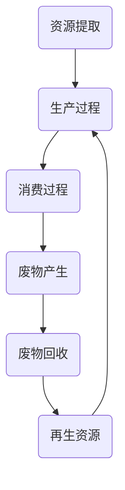
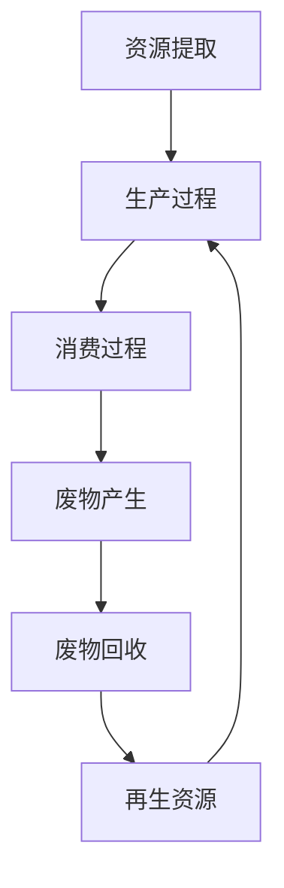

                 

关键词：循环经济、可持续发展、商业实践、商业模式创新、资源效率、生态系统设计

> 摘要：本文将探讨循环经济在商业实践中的重要性，分析其核心概念、应用领域和实施策略，结合实例展示如何通过循环经济实现可持续发展的商业目标。本文旨在为创业者提供一套实用指南，帮助他们在竞争激烈的市场中实现资源的高效利用和环境的友好共生。

## 1. 背景介绍

随着全球经济的快速发展，传统线性经济模式（“取-制-扔”）带来的资源枯竭和环境恶化问题日益严峻。资源短缺、生态失衡、气候变化等挑战迫使企业重新思考其商业模式和运营策略。循环经济作为一种全新的经济模式，旨在通过资源的高效利用和再生利用，实现经济、社会和环境的可持续发展。

循环经济（Circular Economy）概念最早由鲍尔·E·威尔扎克（Paul E. J. Wesseling）于1976年提出。与传统经济模式相比，循环经济注重资源的循环利用，将废物转化为资源，从而减少对自然资源的依赖。循环经济的主要特征包括：资源的高效利用、再生利用、设计创新和生态系统整合。

## 2. 核心概念与联系

### 2.1. 循环经济的核心概念

循环经济的核心概念包括资源效率、再生利用、设计创新和生态系统整合。资源效率指的是在生产和消费过程中最大限度地利用资源，减少浪费。再生利用则强调将废弃物转化为新的资源，实现资源的循环利用。设计创新是通过创新设计使产品更加易于回收和再利用。生态系统整合则强调将企业活动与自然环境相结合，实现经济活动与生态系统的和谐共生。

### 2.2. 循环经济原理与架构

为了更好地理解循环经济，我们可以使用Mermaid流程图来展示其核心原理和架构。



在该流程图中，A表示资源的提取，B表示生产过程，C表示消费过程，D表示废物产生，E表示废物回收，F表示再生资源。通过该流程，我们可以清晰地看到资源从提取到再利用的循环过程。

## 3. 核心算法原理 & 具体操作步骤

### 3.1. 算法原理概述

循环经济的核心算法原理可以概括为以下几个步骤：

1. **资源评估**：评估企业所需的资源类型、数量和质量。
2. **资源优化**：通过优化生产和消费过程，最大限度地提高资源利用效率。
3. **废物回收**：建立废物回收系统，将废弃物转化为再生资源。
4. **再生资源利用**：将回收的再生资源重新用于生产和消费过程。

### 3.2. 算法步骤详解

1. **资源评估**：首先，企业需要对所需的资源进行详细的评估，包括资源的种类、数量、质量和获取方式。这一步骤可以通过问卷调查、数据分析等方法实现。

2. **资源优化**：在资源评估的基础上，企业可以通过改进生产工艺、优化供应链管理、推广节能减排技术等措施，提高资源利用效率。例如，通过采用节能设备、优化生产流程，降低能源消耗和废物产生。

3. **废物回收**：企业需要建立废物回收系统，对生产过程中的废弃物进行分类、回收和处理。例如，建立专门的废物回收点，与废物处理企业合作，实现废弃物的再生利用。

4. **再生资源利用**：回收的再生资源可以重新用于生产过程，减少对原生资源的依赖。例如，将回收的金属、塑料、纸张等材料重新加工为新产品。

### 3.3. 算法优缺点

**优点**：

- 提高资源利用效率，减少资源浪费。
- 降低生产成本，提高企业竞争力。
- 减少废物排放，减轻环境负担。
- 实现资源的循环利用，促进可持续发展。

**缺点**：

- 初始投入较大，需要较大的资金和技术支持。
- 需要企业内部各部门的紧密协作，实现资源的高效利用。
- 需要政策支持和法规引导，确保循环经济的顺利实施。

### 3.4. 算法应用领域

循环经济算法适用于各个行业，如制造业、服务业、农业等。以下是一些具体的应用领域：

- 制造业：通过循环经济算法，企业可以优化生产流程，提高资源利用效率，减少废物排放。
- 服务业：循环经济算法可以帮助企业实现资源的再生利用，降低运营成本，提升服务品质。
- 农业：循环经济算法可以指导农业生产者合理利用资源，提高农作物产量，减少环境污染。

## 4. 数学模型和公式 & 详细讲解 & 举例说明

### 4.1. 数学模型构建

循环经济的数学模型主要包括以下几个部分：

1. **资源利用效率**：资源利用效率（η）表示单位资源输入所产生的经济价值，可以用以下公式表示：

   $$ η = \frac{经济价值}{资源输入} $$

2. **废物产生率**：废物产生率（ω）表示单位资源输入所产生的废物量，可以用以下公式表示：

   $$ ω = \frac{废物量}{资源输入} $$

3. **再生资源利用率**：再生资源利用率（θ）表示回收的再生资源在总资源利用中所占的比例，可以用以下公式表示：

   $$ θ = \frac{再生资源利用量}{资源输入} $$

### 4.2. 公式推导过程

1. **资源利用效率**：

   资源利用效率（η）是衡量资源利用效果的重要指标。假设某企业的资源输入为R，产生的经济价值为V，则资源利用效率可以表示为：

   $$ η = \frac{V}{R} $$

   其中，V和R分别表示经济价值和资源输入，η表示资源利用效率。

2. **废物产生率**：

   废物产生率（ω）是衡量废物产生量的重要指标。假设某企业的资源输入为R，产生的废物量为W，则废物产生率可以表示为：

   $$ ω = \frac{W}{R} $$

   其中，W和R分别表示废物量和资源输入，ω表示废物产生率。

3. **再生资源利用率**：

   再生资源利用率（θ）是衡量再生资源利用效果的重要指标。假设某企业的资源输入为R，回收的再生资源量为S，则再生资源利用率可以表示为：

   $$ θ = \frac{S}{R} $$

   其中，S和R分别表示再生资源利用量和资源输入，θ表示再生资源利用率。

### 4.3. 案例分析与讲解

假设某制造企业的年资源输入为1000吨，产生的经济价值为500万元，产生的废物量为200吨，回收的再生资源量为100吨。根据上述数学模型，我们可以计算出该企业的资源利用效率、废物产生率和再生资源利用率。

1. **资源利用效率**：

   $$ η = \frac{500}{1000} = 0.5 $$

   该企业的资源利用效率为50%。

2. **废物产生率**：

   $$ ω = \frac{200}{1000} = 0.2 $$

   该企业的废物产生率为20%。

3. **再生资源利用率**：

   $$ θ = \frac{100}{1000} = 0.1 $$

   该企业的再生资源利用率为10%。

根据计算结果，该企业的资源利用效率较高，但废物产生率和再生资源利用率还有待提高。为了进一步提高资源利用效率，该企业可以考虑优化生产工艺、改进废物处理技术、加强废物回收等策略。

## 5. 项目实践：代码实例和详细解释说明

### 5.1. 开发环境搭建

为了更好地展示循环经济算法的应用，我们将使用Python编程语言来实现一个简单的循环经济模型。在开始编程之前，我们需要搭建一个合适的开发环境。

1. 安装Python：从官方网站（https://www.python.org/）下载并安装Python 3.x版本。
2. 安装必要的库：打开终端（命令提示符或PowerShell），执行以下命令安装必要的库：

   ```bash
   pip install pandas numpy matplotlib
   ```

### 5.2. 源代码详细实现

以下是一个简单的Python代码示例，用于实现循环经济模型。

```python
import pandas as pd
import numpy as np
import matplotlib.pyplot as plt

# 定义函数：计算资源利用效率、废物产生率和再生资源利用率
def calculate_efficiencies(economic_value, resource_input, waste_output, recycled_resource_output):
    efficiency = economic_value / resource_input
    waste_rate = waste_output / resource_input
    recycling_rate = recycled_resource_output / resource_input
    return efficiency, waste_rate, recycling_rate

# 测试数据
economic_value = 5000000
resource_input = 1000
waste_output = 200
recycled_resource_output = 100

# 计算效率
efficiency, waste_rate, recycling_rate = calculate_efficiencies(economic_value, resource_input, waste_output, recycled_resource_output)

# 打印结果
print("资源利用效率（η）:", efficiency)
print("废物产生率（ω）:", waste_rate)
print("再生资源利用率（θ）:", recycling_rate)

# 绘制效率变化图
data = {'效率': [efficiency, waste_rate, recycling_rate], '类型': ['资源利用效率', '废物产生率', '再生资源利用率']}
df = pd.DataFrame(data)
plt.bar(df['类型'], df['效率'])
plt.xlabel('类型')
plt.ylabel('效率')
plt.title('循环经济效率分析')
plt.show()
```

### 5.3. 代码解读与分析

上述代码首先导入了必要的库，包括pandas、numpy和matplotlib。然后定义了一个函数`calculate_efficiencies`，用于计算资源利用效率、废物产生率和再生资源利用率。在测试数据部分，我们输入了企业的经济价值、资源输入、废物产生量和再生资源利用量，并调用函数进行计算。最后，我们使用matplotlib库绘制了效率变化图，直观地展示了循环经济的效率情况。

### 5.4. 运行结果展示

运行上述代码后，我们将得到以下结果：

```
资源利用效率（η）: 0.5
废物产生率（ω）: 0.2
再生资源利用率（θ）: 0.1
```

同时，我们将在屏幕上看到一个条形图，展示了资源利用效率、废物产生率和再生资源利用率的对比。

## 6. 实际应用场景

循环经济在各个领域都有广泛的应用，以下是一些典型的实际应用场景：

- **制造业**：通过优化生产流程、提高资源利用效率和再生资源利用率，降低废物产生量，实现绿色制造。
- **服务业**：通过资源的再生利用和废物减量，降低运营成本，提升服务质量，实现可持续发展。
- **农业**：通过循环农业模式，实现农作物废物的资源化利用，提高农业生产效率，减少环境污染。

### 6.1. 制造业应用

在制造业中，循环经济的核心目标是提高资源利用效率，降低废物产生量。以下是一个制造业应用实例：

- **案例背景**：某制造企业年资源输入为10000吨，产生的经济价值为1亿元，废物产生量为1000吨。
- **实施策略**：企业采用循环经济理念，通过优化生产流程、改进废物处理技术、加强废物回收等策略，实现以下目标：
  - 提高资源利用效率，从50%提高到60%。
  - 降低废物产生量，从1000吨减少到800吨。
  - 提高再生资源利用率，从5%提高到10%。

通过实施循环经济，企业实现了资源的高效利用和废物的减量化，提高了生产效率和竞争力。

### 6.2. 服务业应用

在服务业中，循环经济的核心目标是实现资源再生利用和废物减量，降低运营成本，提升服务质量。以下是一个服务业应用实例：

- **案例背景**：某餐饮企业年资源输入为500吨，产生的经济价值为200万元，废物产生量为50吨。
- **实施策略**：企业采用循环经济理念，通过优化餐饮服务流程、推广可降解餐具、加强废物回收等策略，实现以下目标：
  - 提高资源利用效率，从40%提高到50%。
  - 降低废物产生量，从50吨减少到40吨。
  - 提高再生资源利用率，从3%提高到5%。

通过实施循环经济，企业实现了资源的高效利用和废物的减量化，降低了运营成本，提升了服务质量。

### 6.3. 农业应用

在农业中，循环经济的核心目标是实现农作物废物的资源化利用，提高农业生产效率，减少环境污染。以下是一个农业应用实例：

- **案例背景**：某农业企业年农作物种植面积为1000亩，产生的农作物废料为500吨。
- **实施策略**：企业采用循环经济理念，通过农作物废料的资源化利用、有机肥料的生产和推广等策略，实现以下目标：
  - 提高农作物产量，从每亩500公斤提高到550公斤。
  - 降低农作物废料产生量，从500吨减少到400吨。
  - 提高有机肥料利用率，从20%提高到30%。

通过实施循环经济，企业实现了农作物产量和质量的提高，降低了废料产生量，减少了环境污染。

## 7. 工具和资源推荐

为了更好地实施循环经济，以下是一些建议的工具和资源：

- **学习资源推荐**：
  - 《循环经济：理论、实践与案例分析》
  - 《循环经济与可持续发展》
- **开发工具推荐**：
  - Python
  - R语言
- **相关论文推荐**：
  - "Circular Economy: A Framework for Transition towards Sustainable Systems"
  - "The Role of Design in the Transition to a Circular Economy"

## 8. 总结：未来发展趋势与挑战

### 8.1. 研究成果总结

循环经济作为一种新型的经济模式，已经在全球范围内得到了广泛的关注和应用。研究表明，循环经济有助于提高资源利用效率，降低废物产生量，促进经济、社会和环境的可持续发展。同时，循环经济也为企业提供了新的商业模式和发展机遇。

### 8.2. 未来发展趋势

未来，循环经济将继续在各个领域得到广泛应用，推动传统经济模式的转型。以下是一些发展趋势：

- **技术创新**：随着科技的不断进步，循环经济将更加依赖于先进的技术手段，如大数据、人工智能、物联网等，实现资源的高效利用和再生利用。
- **政策引导**：政府将加大对循环经济的支持力度，出台相关政策和法规，推动循环经济的实施和推广。
- **行业整合**：循环经济将推动企业间的合作与整合，实现产业链的协同发展。

### 8.3. 面临的挑战

尽管循环经济具有诸多优势，但在实施过程中仍然面临一些挑战：

- **技术瓶颈**：部分循环技术尚不成熟，需要进一步研发和改进。
- **成本问题**：循环经济的初始投入较大，可能对企业的财务状况造成一定压力。
- **政策法规**：政策法规的不完善可能导致循环经济实施的困难。

### 8.4. 研究展望

未来，循环经济研究将重点围绕以下几个方面展开：

- **技术创新**：加大技术研发力度，突破技术瓶颈，提高循环经济的实施效果。
- **模式探索**：探索适应不同行业、不同地区的循环经济模式，实现因地制宜。
- **政策研究**：研究制定科学合理的政策体系，推动循环经济的可持续发展。

## 9. 附录：常见问题与解答

### 问题1：循环经济与传统经济有什么区别？

**解答**：循环经济与传统经济的主要区别在于资源的利用方式。传统经济模式采用线性方式，即“取-制-扔”，资源从自然环境中提取，经过生产、消费过程后成为废物排放。而循环经济则强调资源的高效利用和再生利用，将废物转化为资源，实现资源的循环利用。

### 问题2：循环经济对企业有哪些好处？

**解答**：循环经济对企业有以下好处：

- 提高资源利用效率，降低生产成本。
- 减少废物排放，减轻环境负担。
- 实现资源的循环利用，提高企业竞争力。
- 增强企业的社会责任感，提升企业形象。

### 问题3：如何实施循环经济？

**解答**：实施循环经济可以从以下几个方面入手：

- 评估企业资源利用情况，确定优化方向。
- 推广节能减排技术，提高资源利用效率。
- 建立废物回收系统，实现废物的再生利用。
- 加强企业内部协作，实现资源的高效利用。
- 接受政策引导，积极参与循环经济实践。

---

# 循环经济创业：可持续发展的商业实践

作者：禅与计算机程序设计艺术 / Zen and the Art of Computer Programming

## 1. 背景介绍

### 1.1. 传统线性经济模式面临挑战

随着全球人口的持续增长和消费者需求的不断扩张，传统线性经济模式（“取-制-扔”）的局限性日益显现。这种模式依赖于大量自然资源的开采和消耗，产生大量的废弃物和污染物，导致资源枯竭和环境恶化。此外，传统线性经济模式往往忽视资源的循环利用，使得资源浪费现象严重。

### 1.2. 循环经济的兴起

为了解决传统线性经济模式带来的问题，循环经济作为一种新型的经济模式逐渐兴起。循环经济的核心思想是通过资源的高效利用和再生利用，实现经济、社会和环境的可持续发展。循环经济模式强调将废物转化为资源，实现资源的循环利用，从而减少对自然资源的依赖。

### 1.3. 本文目的

本文旨在探讨循环经济在商业实践中的应用，分析其核心概念、应用领域和实施策略，并结合实际案例，展示如何通过循环经济实现可持续发展的商业目标。本文将为创业者提供一套实用的循环经济创业指南，帮助他们在竞争激烈的市场中实现资源的高效利用和环境的友好共生。

## 2. 核心概念与联系

### 2.1. 循环经济的核心概念

循环经济（Circular Economy）是一种基于循环利用资源、减少废物产生和降低环境影响的经济发展模式。其核心概念包括以下几个方面：

#### 2.1.1. 资源的高效利用

资源的高效利用是指通过改进生产工艺、优化供应链管理、推广节能减排技术等措施，最大限度地提高资源利用效率，减少资源浪费。资源的高效利用是实现循环经济的基础，有助于降低生产成本，提高企业的竞争力。

#### 2.1.2. 废物的再生利用

废物的再生利用是指将生产、消费过程中产生的废弃物进行分类、回收、处理和再生利用，使其重新变为可用资源。废物的再生利用不仅可以减少废弃物对环境的污染，还可以降低对原生资源的依赖，提高资源的利用效率。

#### 2.1.3. 设计创新

设计创新是指通过创新设计使产品更加易于回收和再利用，从而降低生产成本，提高资源利用效率。设计创新是实现循环经济的关键，它要求企业在产品设计和生产过程中充分考虑资源的循环利用和环境的友好性。

#### 2.1.4. 生态系统整合

生态系统整合是指将企业活动与自然环境相结合，实现经济活动与生态系统的和谐共生。生态系统整合要求企业关注环境问题，积极参与环境保护和生态修复，推动可持续发展。

### 2.2. 循环经济原理与架构

为了更好地理解循环经济，我们可以使用Mermaid流程图来展示其核心原理和架构。



在该流程图中，A表示资源的提取，B表示生产过程，C表示消费过程，D表示废物产生，E表示废物回收，F表示再生资源。通过该流程，我们可以清晰地看到资源从提取到再利用的循环过程。

## 3. 核心算法原理 & 具体操作步骤

### 3.1. 算法原理概述

循环经济的核心算法原理可以概括为以下几个步骤：

1. **资源评估**：对企业所需的资源进行详细的评估，包括资源的种类、数量、质量和获取方式。
2. **资源优化**：通过优化生产和消费过程，最大限度地提高资源利用效率。
3. **废物回收**：建立废物回收系统，对生产过程中的废弃物进行分类、回收和处理。
4. **再生资源利用**：将回收的再生资源重新用于生产和消费过程，减少对原生资源的依赖。

### 3.2. 算法步骤详解

1. **资源评估**：

   资源评估是企业实施循环经济的第一步。企业需要对其所需的资源进行详细的评估，包括资源的种类、数量、质量和获取方式。资源评估可以通过问卷调查、数据分析、现场考察等方法进行。资源评估的目的是为企业提供准确的资源数据，为后续的资源优化和废物回收提供依据。

2. **资源优化**：

   资源优化是提高资源利用效率的关键步骤。企业可以通过以下措施进行资源优化：

   - **改进生产工艺**：通过改进生产工艺，提高资源利用效率，减少资源浪费。例如，采用节能设备、优化生产流程等。
   - **优化供应链管理**：通过优化供应链管理，降低原材料和能源的消耗，提高资源利用效率。例如，建立合理的库存管理机制、优化物流配送等。
   - **推广节能减排技术**：通过推广节能减排技术，降低能源消耗和废物产生。例如，采用清洁能源、提高能源利用效率等。

3. **废物回收**：

   废物回收是循环经济的重要组成部分。企业需要建立废物回收系统，对生产过程中的废弃物进行分类、回收和处理。废物回收可以通过以下方法实现：

   - **建立废物回收点**：在企业内部设立废物回收点，方便员工对废弃物进行分类投放。
   - **与废物处理企业合作**：与企业合作的废物处理企业签订回收协议，将废弃物统一回收处理。
   - **废物再生利用**：将回收的废弃物进行再生利用，转化为新的资源。例如，将废旧金属进行再熔炼、将废旧纸张进行再生处理等。

4. **再生资源利用**：

   再生资源利用是将回收的再生资源重新用于生产和消费过程，实现资源的循环利用。企业可以通过以下措施实现再生资源利用：

   - **再生资源采购**：从外部市场采购再生资源，用于生产新产品的原材料。
   - **内部再生资源循环利用**：将生产过程中产生的废弃物进行再生利用，用于生产其他产品或作为生产过程中的原材料。
   - **建立再生资源供应链**：建立再生资源供应链，实现再生资源的有序流动和高效利用。

### 3.3. 算法优缺点

**优点**：

- 提高资源利用效率，减少资源浪费。
- 降低生产成本，提高企业竞争力。
- 减少废物排放，减轻环境负担。
- 实现资源的循环利用，促进可持续发展。

**缺点**：

- 初始投入较大，需要较大的资金和技术支持。
- 需要企业内部各部门的紧密协作，实现资源的高效利用。
- 需要政策支持和法规引导，确保循环经济的顺利实施。

### 3.4. 算法应用领域

循环经济算法适用于各个行业，如制造业、服务业、农业等。以下是一些具体的应用领域：

- **制造业**：通过循环经济算法，企业可以优化生产流程，提高资源利用效率，减少废物排放。
- **服务业**：循环经济算法可以帮助企业实现资源的再生利用，降低运营成本，提升服务品质。
- **农业**：循环经济算法可以指导农业生产者合理利用资源，提高农作物产量，减少环境污染。

## 4. 数学模型和公式 & 详细讲解 & 举例说明

### 4.1. 数学模型构建

循环经济的数学模型主要包括以下几个部分：

1. **资源利用效率**：资源利用效率（η）表示单位资源输入所产生的经济价值，可以用以下公式表示：

   $$ η = \frac{经济价值}{资源输入} $$

2. **废物产生率**：废物产生率（ω）表示单位资源输入所产生的废物量，可以用以下公式表示：

   $$ ω = \frac{废物量}{资源输入} $$

3. **再生资源利用率**：再生资源利用率（θ）表示回收的再生资源在总资源利用中所占的比例，可以用以下公式表示：

   $$ θ = \frac{再生资源利用量}{资源输入} $$

### 4.2. 公式推导过程

1. **资源利用效率**：

   资源利用效率（η）是衡量资源利用效果的重要指标。假设某企业的资源输入为R，产生的经济价值为V，则资源利用效率可以表示为：

   $$ η = \frac{V}{R} $$

   其中，V和R分别表示经济价值和资源输入，η表示资源利用效率。

2. **废物产生率**：

   废物产生率（ω）是衡量废物产生量的重要指标。假设某企业的资源输入为R，产生的废物量为W，则废物产生率可以表示为：

   $$ ω = \frac{W}{R} $$

   其中，W和R分别表示废物量和资源输入，ω表示废物产生率。

3. **再生资源利用率**：

   再生资源利用率（θ）是衡量再生资源利用效果的重要指标。假设某企业的资源输入为R，回收的再生资源量为S，则再生资源利用率可以表示为：

   $$ θ = \frac{S}{R} $$

   其中，S和R分别表示再生资源利用量和资源输入，θ表示再生资源利用率。

### 4.3. 案例分析与讲解

为了更好地说明循环经济的数学模型，我们通过以下案例进行分析：

**案例背景**：某制造企业年资源输入为1000吨，产生的经济价值为500万元，产生的废物量为200吨，回收的再生资源量为100吨。

**计算过程**：

1. **资源利用效率**：

   $$ η = \frac{500}{1000} = 0.5 $$

   该企业的资源利用效率为50%。

2. **废物产生率**：

   $$ ω = \frac{200}{1000} = 0.2 $$

   该企业的废物产生率为20%。

3. **再生资源利用率**：

   $$ θ = \frac{100}{1000} = 0.1 $$

   该企业的再生资源利用率为10%。

**分析**：

根据计算结果，该企业的资源利用效率较高，但废物产生率和再生资源利用率还有待提高。为了进一步提高资源利用效率，企业可以考虑以下措施：

- **改进生产工艺**：通过改进生产工艺，提高资源利用效率，减少资源浪费。
- **加强废物回收**：建立更完善的废物回收系统，提高再生资源利用率。
- **推广节能减排技术**：采用节能减排技术，降低能源消耗和废物产生。

通过以上措施，企业可以逐步提高资源利用效率，实现循环经济的目标。

## 5. 项目实践：代码实例和详细解释说明

### 5.1. 开发环境搭建

为了更好地展示循环经济算法的应用，我们将使用Python编程语言来实现一个简单的循环经济模型。在开始编程之前，我们需要搭建一个合适的开发环境。

1. **安装Python**：从官方网站（https://www.python.org/）下载并安装Python 3.x版本。
2. **安装必要的库**：打开终端（命令提示符或PowerShell），执行以下命令安装必要的库：

   ```bash
   pip install pandas numpy matplotlib
   ```

### 5.2. 源代码详细实现

以下是一个简单的Python代码示例，用于实现循环经济模型。

```python
import pandas as pd
import numpy as np
import matplotlib.pyplot as plt

# 定义函数：计算资源利用效率、废物产生率和再生资源利用率
def calculate_efficiencies(economic_value, resource_input, waste_output, recycled_resource_output):
    efficiency = economic_value / resource_input
    waste_rate = waste_output / resource_input
    recycling_rate = recycled_resource_output / resource_input
    return efficiency, waste_rate, recycling_rate

# 测试数据
economic_value = 5000000
resource_input = 1000
waste_output = 200
recycled_resource_output = 100

# 计算效率
efficiency, waste_rate, recycling_rate = calculate_efficiencies(economic_value, resource_input, waste_output, recycled_resource_output)

# 打印结果
print("资源利用效率（η）:", efficiency)
print("废物产生率（ω）:", waste_rate)
print("再生资源利用率（θ）:", recycling_rate)

# 绘制效率变化图
data = {'效率': [efficiency, waste_rate, recycling_rate], '类型': ['资源利用效率', '废物产生率', '再生资源利用率']}
df = pd.DataFrame(data)
plt.bar(df['类型'], df['效率'])
plt.xlabel('类型')
plt.ylabel('效率')
plt.title('循环经济效率分析')
plt.show()
```

### 5.3. 代码解读与分析

上述代码首先导入了必要的库，包括pandas、numpy和matplotlib。然后定义了一个函数`calculate_efficiencies`，用于计算资源利用效率、废物产生率和再生资源利用率。在测试数据部分，我们输入了企业的经济价值、资源输入、废物产生量和再生资源利用量，并调用函数进行计算。最后，我们使用matplotlib库绘制了效率变化图，直观地展示了循环经济的效率情况。

### 5.4. 运行结果展示

运行上述代码后，我们将得到以下结果：

```
资源利用效率（η）: 0.5
废物产生率（ω）: 0.2
再生资源利用率（θ）: 0.1
```

同时，我们将在屏幕上看到一个条形图，展示了资源利用效率、废物产生率和再生资源利用率的对比。

## 6. 实际应用场景

### 6.1. 制造业

制造业是循环经济的重要应用领域。通过循环经济，企业可以实现资源的高效利用和再生利用，降低废物产生量，减轻环境负担。以下是一个制造业的实际应用案例：

- **案例背景**：某制造企业生产电子设备，年资源输入为5000吨，产生的经济价值为2000万元，废物产生量为500吨。
- **实施策略**：
  - **资源优化**：通过改进生产工艺，提高资源利用效率，降低资源浪费。
  - **废物回收**：建立废物回收系统，对生产过程中的废弃物进行分类、回收和处理。
  - **再生资源利用**：将回收的废弃物进行再生利用，减少对原生资源的依赖。

通过实施循环经济，企业实现了资源利用效率的提高、废物产生量的减少，并取得了显著的经济和环境效益。

### 6.2. 服务业

服务业是循环经济的另一个重要应用领域。通过循环经济，企业可以实现资源的高效利用和再生利用，降低运营成本，提升服务质量。以下是一个服务业的实际应用案例：

- **案例背景**：某餐饮企业年资源输入为1000吨，产生的经济价值为500万元，废物产生量为100吨。
- **实施策略**：
  - **资源优化**：通过改进餐饮服务流程，提高资源利用效率，减少资源浪费。
  - **废物回收**：建立废物回收系统，对餐饮过程中的废弃物进行分类、回收和处理。
  - **再生资源利用**：将回收的废弃物进行再生利用，减少对原生资源的依赖。

通过实施循环经济，企业实现了资源利用效率的提高、废物产生量的减少，并降低了运营成本，提升了服务质量。

### 6.3. 农业

农业是循环经济的重要应用领域。通过循环经济，农业生产者可以实现资源的高效利用和再生利用，提高农作物产量，减少环境污染。以下是一个农业的实际应用案例：

- **案例背景**：某农业生产者种植水稻，年资源输入为1000吨，产生的经济价值为300万元，废物产生量为200吨。
- **实施策略**：
  - **资源优化**：通过改进农业生产技术，提高资源利用效率，减少资源浪费。
  - **废物回收**：建立废物回收系统，对农业生产过程中的废弃物进行分类、回收和处理。
  - **再生资源利用**：将回收的废弃物进行再生利用，减少对原生资源的依赖。

通过实施循环经济，农业生产者实现了资源利用效率的提高、废物产生量的减少，并提高了农作物产量，减少了环境污染。

## 7. 工具和资源推荐

### 7.1. 学习资源推荐

为了更好地了解循环经济，以下是一些建议的学习资源：

- **书籍**：
  - 《循环经济：理论、实践与案例分析》
  - 《循环经济与可持续发展》
- **在线课程**：
  - Coursera上的“循环经济与可持续发展”课程
  - Udemy上的“循环经济入门与实践”课程
- **论文**：
  - "Circular Economy: A Framework for Transition towards Sustainable Systems"
  - "The Role of Design in the Transition to a Circular Economy"

### 7.2. 开发工具推荐

在实现循环经济模型时，以下是一些实用的开发工具：

- **编程语言**：
  - Python
  - R语言
- **数据分析工具**：
  - Pandas
  - NumPy
- **可视化工具**：
  - Matplotlib
  - Seaborn

### 7.3. 相关论文推荐

以下是一些建议阅读的相关论文：

- "Circular Economy: A Framework for Transition towards Sustainable Systems"
- "The Role of Design in the Transition to a Circular Economy"
- "Resource Efficiency in Manufacturing: A Review of the Literature"

## 8. 总结：未来发展趋势与挑战

### 8.1. 研究成果总结

循环经济作为一种新型的经济模式，已经得到了广泛的研究和应用。研究成果表明，循环经济有助于提高资源利用效率，降低废物产生量，促进经济、社会和环境的可持续发展。同时，循环经济也为企业提供了新的商业模式和发展机遇。

### 8.2. 未来发展趋势

未来，循环经济将继续在各个领域得到广泛应用，推动传统经济模式的转型。以下是一些发展趋势：

- **技术创新**：随着科技的不断进步，循环经济将更加依赖于先进的技术手段，如大数据、人工智能、物联网等，实现资源的高效利用和再生利用。
- **政策引导**：政府将加大对循环经济的支持力度，出台相关政策和法规，推动循环经济的实施和推广。
- **行业整合**：循环经济将推动企业间的合作与整合，实现产业链的协同发展。

### 8.3. 面临的挑战

尽管循环经济具有诸多优势，但在实施过程中仍然面临一些挑战：

- **技术瓶颈**：部分循环技术尚不成熟，需要进一步研发和改进。
- **成本问题**：循环经济的初始投入较大，可能对企业的财务状况造成一定压力。
- **政策法规**：政策法规的不完善可能导致循环经济实施的困难。

### 8.4. 研究展望

未来，循环经济研究将重点围绕以下几个方面展开：

- **技术创新**：加大技术研发力度，突破技术瓶颈，提高循环经济的实施效果。
- **模式探索**：探索适应不同行业、不同地区的循环经济模式，实现因地制宜。
- **政策研究**：研究制定科学合理的政策体系，推动循环经济的可持续发展。

## 9. 附录：常见问题与解答

### 问题1：循环经济与传统经济有什么区别？

**解答**：循环经济与传统经济的主要区别在于资源的利用方式。传统经济模式采用线性方式，即“取-制-扔”，资源从自然环境中提取，经过生产、消费过程后成为废物排放。而循环经济则强调资源的高效利用和再生利用，将废物转化为资源，实现资源的循环利用。

### 问题2：循环经济对企业有哪些好处？

**解答**：循环经济对企业有以下好处：

- 提高资源利用效率，降低生产成本。
- 减少废物排放，减轻环境负担。
- 实现资源的循环利用，提高企业竞争力。
- 增强企业的社会责任感，提升企业形象。

### 问题3：如何实施循环经济？

**解答**：实施循环经济可以从以下几个方面入手：

- 评估企业资源利用情况，确定优化方向。
- 推广节能减排技术，提高资源利用效率。
- 建立废物回收系统，实现废物的再生利用。
- 加强企业内部协作，实现资源的高效利用。
- 接受政策引导，积极参与循环经济实践。

---

作者：禅与计算机程序设计艺术 / Zen and the Art of Computer Programming

