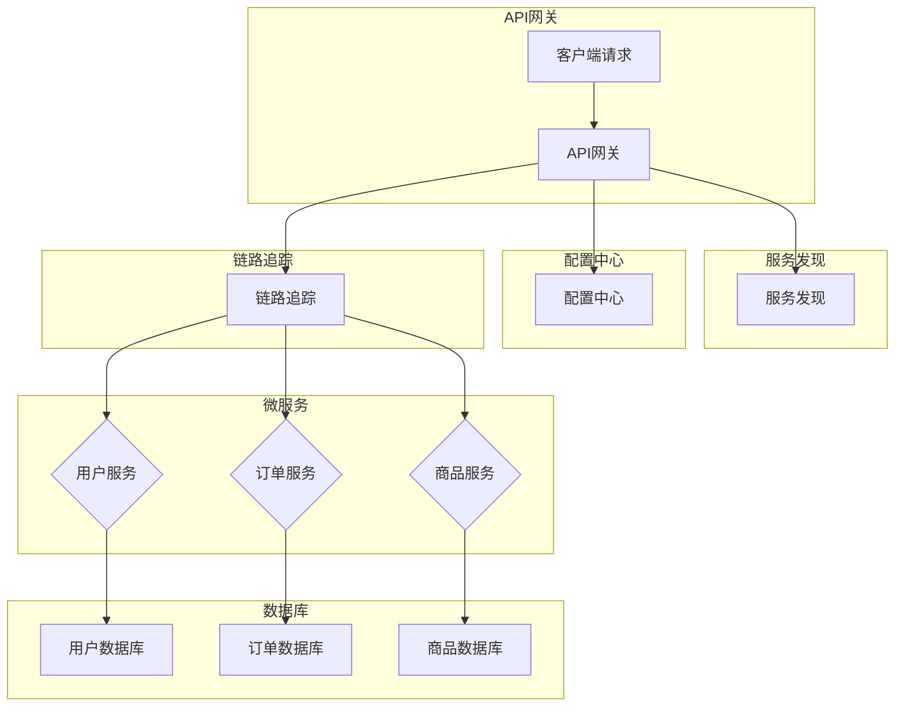

                 

微服务架构是近年来在软件开发领域迅速崛起的一种设计理念，它将大型单体应用拆分成若干个独立的小服务，通过解耦和接口方式实现系统的可扩展性和高可用性。随着互联网和云计算的快速发展，微服务架构已经成为许多企业应对业务需求波动、实现系统持续迭代和优化的重要手段。本文将深入探讨微服务架构在高扩展性中的应用，包括其核心概念、设计原则、具体实现方法以及面临的挑战和解决方案。

## 1. 背景介绍

在传统的单体应用架构中，整个系统通常是一个单一的、紧密耦合的应用程序，所有功能都集成在同一个代码库中。这样的架构在系统规模较小、功能相对简单的情况下表现良好，但随着业务的发展，系统复杂性不断增加，单体应用面临以下问题：

1. **扩展性差**：单体应用难以水平扩展，当业务量激增时，系统性能会急剧下降。
2. **维护成本高**：随着代码量的增加，代码库变得复杂，维护成本随之上升。
3. **部署困难**：单体应用的部署需要协调多个模块，一旦某个模块出现问题，整个系统都会受到影响。
4. **故障风险高**：整个系统的可靠性依赖于单一的应用实例，一旦出现故障，影响面极大。

为了解决这些问题，微服务架构应运而生。它通过将系统拆分成多个独立的小服务，每个服务负责特定的业务功能，通过轻量级的通信机制（如RESTful API）进行交互，从而实现系统的可扩展性、高可用性和易维护性。

## 2. 核心概念与联系

### 2.1 微服务的定义

微服务（Microservices）是一种设计方法，它将应用程序作为一套小型服务组合起来构建，每个服务运行在其独立的进程中，并且各个服务通过轻量级通信机制（通常是HTTP RESTful API）进行协调和通信。

### 2.2 微服务的核心概念

- **服务自治**：每个微服务都是独立开发、部署和管理的，服务之间解耦合，可以独立扩展和更新。
- **独立数据库**：每个微服务通常有自己的数据库，这样可以避免跨服务的数据库锁定问题，提高系统的性能和可用性。
- **分布式系统**：微服务架构本质上是一个分布式系统，服务之间通过网络进行通信。
- **事件驱动**：微服务之间通过事件驱动的方式进行通信，这样可以减少同步调用的依赖性，提高系统的灵活性和可扩展性。

### 2.3 微服务的架构模式


#### API网关

API网关是微服务架构中的核心组件之一，它位于客户端和微服务之间，负责将客户端请求路由到相应的微服务，并进行负载均衡、请求缓存、安全性控制等功能。

#### 服务发现

服务发现是指微服务架构中自动发现和注册服务实例的过程。服务注册中心（如Eureka、Consul）维护了一个服务实例的列表，每个服务实例启动时都会向服务注册中心注册，并在关闭时注销。

#### 配置中心

配置中心负责管理微服务的配置信息，包括服务地址、参数等。通过配置中心，可以方便地管理和更新配置，而无需修改代码和重新部署。

#### 链路追踪

链路追踪是指在整个分布式系统中追踪请求流程的能力。通过链路追踪，可以诊断服务之间的延迟和故障，优化系统性能。

### 2.4 微服务架构的 Mermaid 流程图



## 3. 核心算法原理 & 具体操作步骤

### 3.1 算法原理概述

微服务架构的核心算法原理在于如何实现服务之间的解耦合和高效通信。以下是一些关键点：

1. **服务自治**：每个微服务运行在其独立的进程中，可以独立部署和扩展，从而提高了系统的可扩展性和容错性。
2. **API通信**：微服务之间通过轻量级的API接口进行通信，通常采用RESTful风格，这使得服务之间可以解耦，降低系统复杂度。
3. **分布式服务发现**：通过服务注册中心和动态服务发现机制，微服务可以自动发现和注册其他服务的位置，从而实现动态路由和负载均衡。
4. **配置管理**：配置中心负责管理微服务的配置信息，使得配置的变更可以无需重启服务，提高了系统的灵活性。

### 3.2 算法步骤详解

1. **服务拆分**：根据业务需求，将单体应用拆分成若干个独立的微服务，每个服务负责特定的业务功能。
2. **服务注册与发现**：每个微服务启动时，向服务注册中心注册其地址和端口，其他服务通过服务注册中心发现其他服务的位置。
3. **API网关**：客户端请求首先到达API网关，API网关进行身份验证、请求解析和路由，将请求转发到相应的微服务。
4. **服务调用**：微服务之间通过API接口进行通信，实现业务逻辑的协作。
5. **配置管理**：微服务的配置信息存储在配置中心，可以动态更新，无需重启服务。
6. **日志收集**：通过日志收集系统，将微服务的日志集中存储，便于监控和分析。
7. **链路追踪**：通过链路追踪系统，记录请求在分布式系统中的处理流程，便于故障诊断和性能优化。

### 3.3 算法优缺点

#### 优点

- **高扩展性**：服务自治和分布式架构使得系统可以水平扩展，提高系统性能。
- **高可用性**：服务之间解耦合，某个服务故障不会影响整个系统。
- **易维护性**：微服务独立部署和扩展，使得系统的维护变得更加简单。
- **灵活性**：服务可以独立开发和迭代，适应业务变化。

#### 缺点

- **复杂度增加**：分布式系统引入了额外的复杂度，需要管理和协调多个服务。
- **通信开销**：服务之间的通信需要通过网络进行，可能会增加通信开销。
- **性能瓶颈**：服务之间的调用可能会导致性能瓶颈。

### 3.4 算法应用领域

微服务架构在以下领域有广泛应用：

- **电子商务**：电商系统可以通过微服务架构实现商品管理、订单处理、用户管理等功能的解耦和独立扩展。
- **金融科技**：金融系统可以通过微服务架构实现账户管理、交易处理、风险管理等功能的独立部署和扩展。
- **物流运输**：物流系统可以通过微服务架构实现订单管理、运力调度、仓储管理等功能的独立开发和迭代。

## 4. 数学模型和公式 & 详细讲解 & 举例说明

### 4.1 数学模型构建

在微服务架构中，我们可以使用一些数学模型来描述服务的扩展性和性能。

#### 服务扩展性模型

服务扩展性模型可以表示为：

$$
S = f(N, P)
$$

其中，$S$表示服务的扩展性，$N$表示服务的数量，$P$表示服务的性能。该模型表明，服务的扩展性与服务的数量和性能呈正相关关系。

#### 性能模型

服务的性能可以表示为：

$$
P = \frac{C}{N}
$$

其中，$P$表示服务的性能，$C$表示服务的总处理能力，$N$表示服务的数量。该模型表明，服务的性能与服务的数量和总处理能力呈反比关系。

### 4.2 公式推导过程

#### 服务扩展性模型推导

我们假设一个服务在独立运行时，其处理能力为$C$，当有$N$个服务同时运行时，总处理能力为$C'$。根据并行处理原理，我们可以推导出：

$$
C' = N \times C
$$

因此，服务的扩展性可以表示为：

$$
S = \frac{C'}{C} = N
$$

#### 性能模型推导

我们假设一个服务的处理能力为$C$，当有$N$个服务同时运行时，总处理能力为$C'$。根据负载均衡原理，我们可以推导出：

$$
C' = \frac{C}{N}
$$

因此，服务的性能可以表示为：

$$
P = \frac{C'}{N}
$$

### 4.3 案例分析与讲解

假设我们有一个电商系统，最初只有1个商品服务，处理能力为1000次/秒。为了应对日益增长的订单量，我们决定将商品服务拆分为3个独立的微服务，每个微服务的处理能力为333.33次/秒。

根据服务扩展性模型：

$$
S = \frac{C'}{C} = 3
$$

因此，服务的扩展性提高了3倍。

根据性能模型：

$$
P = \frac{C'}{N} = \frac{1000}{3} \approx 333.33
$$

因此，每个服务的性能降低了，但总处理能力增加了。

通过微服务架构，我们可以实现系统的水平扩展，提高系统的性能和可用性。

## 5. 项目实践：代码实例和详细解释说明

### 5.1 开发环境搭建

为了演示微服务架构，我们使用Spring Boot和Docker来构建一个简单的电商系统。以下是开发环境搭建的步骤：

1. 安装Java开发工具包（JDK）。
2. 安装Docker和Docker Compose。
3. 创建一个新的Spring Boot项目，并添加依赖项（如Spring Web、Spring Boot Starter Test等）。
4. 编写微服务的代码，包括用户服务、订单服务和商品服务。

### 5.2 源代码详细实现

以下是用户服务的源代码：

```java
@SpringBootApplication
public class UserServiceApplication {
    public static void main(String[] args) {
        SpringApplication.run(UserServiceApplication.class, args);
    }
}

@RestController
@RequestMapping("/users")
public class UserController {
    @Autowired
    private UserService userService;

    @GetMapping("/{id}")
    public User getUserById(@PathVariable Long id) {
        return userService.getUserById(id);
    }

    @PostMapping("/")
    public User createUser(@RequestBody User user) {
        return userService.createUser(user);
    }
}
```

### 5.3 代码解读与分析

以上代码实现了用户服务的两个功能：根据ID查询用户和创建新用户。用户服务通过Spring Boot启动类进行配置，并通过RESTful API对外提供服务。

在 UserController 类中，我们定义了两个接口方法：getUserById 和 createUser。这两个方法分别调用 UserService 接口中的相应方法，实现用户查询和创建功能。

### 5.4 运行结果展示

1. 运行用户服务：`mvn spring-boot:run`。
2. 使用Postman工具发送请求：
   - 查询用户：`GET http://localhost:8080/users/1`。
   - 创建用户：`POST http://localhost:8080/users`，请求体为`{"id": 1, "name": "张三", "email": "zhangsan@example.com"}`。

运行结果如下：

```
{
    "id": 1,
    "name": "张三",
    "email": "zhangsan@example.com"
}
```

通过以上示例，我们可以看到如何使用微服务架构构建一个简单的电商系统，并实现服务的独立部署和扩展。

## 6. 实际应用场景

### 6.1 电子商务平台

电子商务平台通常需要处理大量的用户请求，包括商品浏览、购物车管理、订单处理等。通过微服务架构，可以将这些功能拆分成独立的微服务，如商品服务、订单服务、用户服务等。每个微服务可以独立部署和扩展，从而提高系统的性能和可用性。

### 6.2 金融系统

金融系统通常需要处理高并发的交易请求，如转账、支付、结算等。通过微服务架构，可以将这些功能拆分成独立的微服务，如账户服务、交易服务、支付服务等。每个微服务可以独立部署和扩展，从而提高系统的性能和可用性。

### 6.3 物流系统

物流系统通常需要处理大量的物流请求，如订单生成、运力调度、仓储管理等。通过微服务架构，可以将这些功能拆分成独立的微服务，如订单服务、运力服务、仓储服务等。每个微服务可以独立部署和扩展，从而提高系统的性能和可用性。

## 6.4 未来应用展望

随着云计算、大数据和人工智能技术的不断发展，微服务架构在未来的应用前景将更加广阔。以下是一些未来的应用展望：

1. **云计算原生应用**：随着Kubernetes等容器编排技术的发展，微服务架构将成为云计算原生应用的首选架构。
2. **AI与微服务融合**：将人工智能模型集成到微服务中，实现智能决策和自动化处理，提高系统的智能化水平。
3. **微服务与区块链结合**：利用区块链技术的去中心化和不可篡改特性，实现微服务之间的安全通信和数据共享。
4. **云原生微服务**：通过容器化和自动化部署，实现微服务的自动化扩展、容错和恢复，提高系统的弹性和可靠性。
5. **微服务与大数据平台融合**：利用大数据平台处理和分析微服务产生的海量数据，实现业务智能和优化。

## 7. 工具和资源推荐

### 7.1 学习资源推荐

- 《微服务设计》：这是一本经典的微服务架构教材，详细介绍了微服务的核心概念、设计原则和实践方法。
- 《微服务实战》：本书通过实际案例，展示了如何使用微服务架构构建高可用、高扩展性的系统。

### 7.2 开发工具推荐

- Spring Boot：一款强大的微服务开发框架，可以快速构建独立的、可扩展的微服务。
- Docker：一款流行的容器化技术，可以方便地部署和管理微服务。
- Kubernetes：一款开源的容器编排平台，可以自动化部署、扩展和管理微服务。

### 7.3 相关论文推荐

- Martin Fowler的《Microservices》
- Sam Newman的《Building Microservices》
- Erlang的《Understanding Messages》

## 8. 总结：未来发展趋势与挑战

### 8.1 研究成果总结

本文通过深入探讨微服务架构的核心概念、设计原则、具体实现方法和实际应用场景，总结了微服务架构在高扩展性中的应用优势和研究成果。主要包括：

- **高扩展性**：微服务架构通过服务自治和分布式架构，实现了系统的水平扩展，提高了系统的性能和可用性。
- **高可用性**：微服务架构通过服务解耦合和独立的部署方式，提高了系统的容错性和可靠性。
- **易维护性**：微服务架构使得系统的维护变得更加简单，服务可以独立更新和扩展，降低了维护成本。
- **灵活性**：微服务架构使得系统可以快速适应业务变化，实现业务的快速迭代和优化。

### 8.2 未来发展趋势

随着云计算、大数据和人工智能技术的不断发展，微服务架构在未来的发展趋势包括：

- **云计算原生应用**：随着Kubernetes等容器编排技术的发展，微服务架构将成为云计算原生应用的首选架构。
- **AI与微服务融合**：将人工智能模型集成到微服务中，实现智能决策和自动化处理，提高系统的智能化水平。
- **微服务与区块链结合**：利用区块链技术的去中心化和不可篡改特性，实现微服务之间的安全通信和数据共享。
- **云原生微服务**：通过容器化和自动化部署，实现微服务的自动化扩展、容错和恢复，提高系统的弹性和可靠性。
- **微服务与大数据平台融合**：利用大数据平台处理和分析微服务产生的海量数据，实现业务智能和优化。

### 8.3 面临的挑战

尽管微服务架构具有许多优势，但在实际应用中仍然面临以下挑战：

- **复杂度增加**：分布式系统引入了额外的复杂度，需要管理和协调多个服务。
- **通信开销**：服务之间的通信需要通过网络进行，可能会增加通信开销。
- **性能瓶颈**：服务之间的调用可能会导致性能瓶颈。
- **调试难度**：分布式系统中的故障诊断和调试变得更加复杂。

### 8.4 研究展望

为了解决微服务架构面临的挑战，未来的研究可以从以下几个方面进行：

- **服务治理与监控**：研究更高效的服务治理和监控方法，提高系统的可观测性和可维护性。
- **分布式数据一致性**：研究分布式数据一致性机制，解决数据一致性问题。
- **服务通信优化**：研究更高效的服务通信机制，降低通信开销和性能瓶颈。
- **故障恢复与容错**：研究更有效的故障恢复和容错机制，提高系统的可靠性和稳定性。

通过不断的研究和优化，微服务架构将在未来的软件系统开发中发挥更大的作用。

## 9. 附录：常见问题与解答

### 9.1 什么是微服务？

微服务是一种设计方法，它将大型单体应用拆分成若干个独立的小服务，通过轻量级的通信机制（通常是HTTP RESTful API）进行交互，从而实现系统的可扩展性、高可用性和易维护性。

### 9.2 微服务架构的优势是什么？

微服务架构的优势包括：

- **高扩展性**：服务自治和分布式架构使得系统可以水平扩展，提高系统性能。
- **高可用性**：服务之间解耦合，某个服务故障不会影响整个系统。
- **易维护性**：微服务独立部署和扩展，使得系统的维护变得更加简单。
- **灵活性**：服务可以独立开发和迭代，适应业务变化。

### 9.3 微服务架构有哪些缺点？

微服务架构的缺点包括：

- **复杂度增加**：分布式系统引入了额外的复杂度，需要管理和协调多个服务。
- **通信开销**：服务之间的通信需要通过网络进行，可能会增加通信开销。
- **性能瓶颈**：服务之间的调用可能会导致性能瓶颈。

### 9.4 微服务架构适合哪些场景？

微服务架构适合以下场景：

- **高并发、高可扩展性**：如电子商务平台、金融系统等。
- **功能复杂、业务变化快**：如物流系统、社交媒体平台等。
- **分布式部署**：如跨地域、跨云部署的应用系统。

### 9.5 微服务架构如何实现服务治理？

微服务架构可以通过以下方法实现服务治理：

- **服务注册与发现**：通过服务注册中心和动态服务发现机制，实现服务的自动注册和发现。
- **配置管理**：通过配置中心，实现服务的配置动态更新。
- **链路追踪**：通过链路追踪系统，实现服务的监控和故障诊断。
- **监控与告警**：通过监控系统，实时监控服务的运行状态，并及时发出告警。

### 9.6 微服务架构中的数据一致性如何保证？

微服务架构中的数据一致性可以通过以下方法保证：

- **分布式事务**：通过分布式事务框架（如Seata），实现跨服务的分布式事务。
- **最终一致性**：通过消息队列和事件驱动的方式，实现最终一致性。
- **数据同步**：通过数据同步机制（如CDC），实现数据在不同服务之间的同步。

### 9.7 微服务架构中的安全性如何保障？

微服务架构中的安全性可以通过以下方法保障：

- **API网关**：通过API网关，实现身份验证、请求过滤和安全性控制。
- **服务鉴权**：通过服务鉴权机制（如OAuth2），实现服务的访问控制。
- **加密传输**：通过HTTPS协议，实现数据传输的加密。
- **安全编码**：遵循安全编码规范，避免常见的安全漏洞。

通过以上方法，可以有效保障微服务架构的安全性。 

### 结束语

微服务架构作为一种先进的软件系统设计方法，已经在许多领域得到广泛应用，并展现出强大的生命力和广阔的发展前景。本文从多个角度探讨了微服务架构在高扩展性中的应用，包括其核心概念、设计原则、具体实现方法以及面临的挑战和解决方案。希望本文能够为读者提供有益的参考和启示，助力他们在实际项目中成功应用微服务架构。作者：禅与计算机程序设计艺术 / Zen and the Art of Computer Programming。
----------------------------------------------------------------

### 文章末尾段落

在文章的末尾，我们可以总结全文的主要观点，并鼓励读者进一步学习和实践微服务架构。

---

总结全文，微服务架构以其高扩展性、高可用性和易维护性等优点，成为现代软件系统设计的重要方法。通过本文的详细探讨，我们深入理解了微服务架构的核心概念、设计原则和实际应用场景。然而，微服务架构也面临着复杂度增加、通信开销和性能瓶颈等挑战，需要我们不断研究和优化。未来，随着云计算、大数据和人工智能技术的不断发展，微服务架构的应用前景将更加广阔。

在此，我鼓励读者继续学习和探索微服务架构，并将其应用到实际项目中。通过实践，我们可以更好地理解微服务架构的精髓，解决业务需求，提升系统的性能和可靠性。希望本文能为您的学习和实践提供一些启示和帮助。

感谢您的阅读，如果您有任何疑问或建议，欢迎在评论区留言交流。作者：禅与计算机程序设计艺术 / Zen and the Art of Computer Programming。再次感谢您的关注与支持！
---

