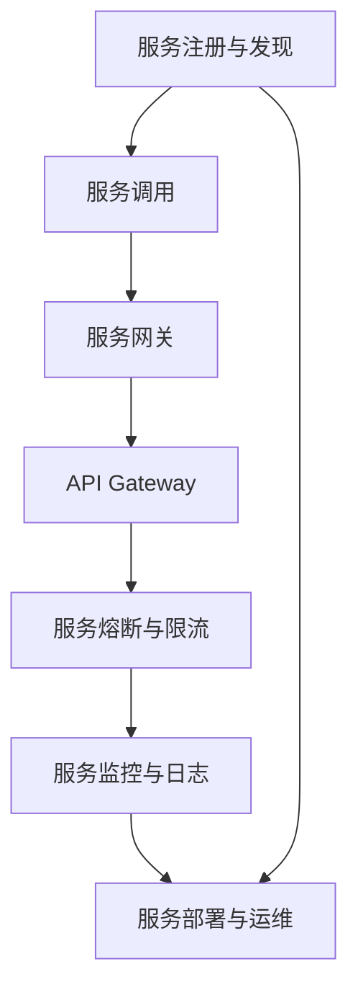

                 

关键词：微服务架构、设计模式、最佳实践、服务化、分布式系统、系统可扩展性、松耦合、模块化、API设计、服务发现、服务网格、容器化、自动化部署

> 摘要：本文将探讨微服务架构的设计模式与最佳实践，分析其在现代分布式系统中的应用和优势，并探讨未来发展趋势与面临的挑战。通过深入解读微服务架构的核心概念、设计原则、技术实现和实际应用，本文旨在为开发者提供一份全面而实用的指南。

## 1. 背景介绍

### 微服务架构的起源与发展

微服务架构起源于2000年代的互联网企业，特别是在电商和社交媒体领域。随着互联网应用的规模和复杂性不断增加，传统的单体架构逐渐显露出其局限性。单体架构将所有的业务逻辑、数据访问、服务接口等都耦合在一起，导致系统难以扩展和维护。为了解决这些问题，微服务架构应运而生。

微服务架构最早由马丁·福勒（Martin Fowler）在2014年提出，它主张将大型的单一应用程序拆分成一组较小的、独立部署和管理的服务。每个服务负责一个特定的业务功能，通过轻量级的通信机制（如HTTP/REST、消息队列等）相互协作。这种架构风格使得系统能够更好地适应变化，提高可维护性和扩展性。

### 微服务架构的优势

微服务架构具有以下优势：

1. **高可扩展性**：每个服务都可以独立扩展，可以根据需求增加实例数，从而提高系统整体的性能和吞吐量。
2. **松耦合**：服务之间通过API进行通信，减少了模块间的直接依赖，提高了系统的灵活性和可维护性。
3. **分布式部署**：服务可以在不同的服务器或容器中独立部署，便于横向扩展和容错。
4. **独立演进**：每个服务可以独立更新、升级，不影响其他服务的运行。
5. **代码重用性**：服务之间可以共享代码库或公共服务，提高了代码的重用率。

## 2. 核心概念与联系

在深入探讨微服务架构之前，我们需要了解一些核心概念及其相互关系。以下是一个用Mermaid绘制的流程图，展示了微服务架构的关键组件和流程。



### 核心概念解析

1. **服务注册与发现**：服务启动时注册到服务注册中心，服务消费者通过服务注册中心发现可用的服务实例。
2. **服务调用**：服务之间通过轻量级的通信机制（如HTTP/REST、消息队列等）进行通信。
3. **服务网关**：用于统一处理外部请求，包括负载均衡、认证、请求路由等功能。
4. **API Gateway**：服务网关的具体实现，通常负责处理跨域请求、协议转换等。
5. **服务熔断与限流**：为了避免服务雪崩，需要对服务进行熔断和限流。
6. **服务监控与日志**：对服务的运行状态、性能等进行监控，并收集日志信息。
7. **服务部署与运维**：服务需要定期更新、升级和监控，以保持系统的稳定运行。

## 3. 核心算法原理 & 具体操作步骤

### 3.1 算法原理概述

微服务架构的核心算法主要包括以下几个方面：

1. **负载均衡**：将请求分配到不同的服务实例上，以提高系统的性能和吞吐量。
2. **服务发现**：服务启动时注册到服务注册中心，服务消费者通过服务注册中心发现可用的服务实例。
3. **服务熔断**：当服务故障时，自动切断对故障服务的访问，以防止故障传播。
4. **服务限流**：限制每个服务的请求数量，以防止服务过载。

### 3.2 算法步骤详解

1. **负载均衡**：
   - 请求到达服务网关。
   - 服务网关根据负载均衡算法（如轮询、随机等）选择一个可用的服务实例。
   - 将请求转发给选定的服务实例。

2. **服务发现**：
   - 服务启动时向服务注册中心注册自己。
   - 服务消费者通过服务注册中心查询可用的服务实例。
   - 服务消费者根据负载均衡算法选择一个服务实例进行调用。

3. **服务熔断**：
   - 当服务发生故障时，记录故障次数。
   - 当故障次数达到阈值时，自动切断对故障服务的访问。
   - 恢复服务后，重新启用对故障服务的访问。

4. **服务限流**：
   - 根据每个服务的请求数量限制请求频率。
   - 当请求数量超过限制时，拒绝新的请求。

### 3.3 算法优缺点

**优点**：

- **高可用性**：通过服务熔断和限流，可以提高系统的可用性。
- **高性能**：通过负载均衡，可以提高系统的性能和吞吐量。
- **高可扩展性**：服务可以独立扩展，提高了系统的可扩展性。

**缺点**：

- **复杂性**：微服务架构引入了更多的组件和流程，增加了系统的复杂性。
- **调试难度**：服务分布在不同的服务器上，增加了调试和定位问题的难度。

### 3.4 算法应用领域

微服务架构广泛应用于电子商务、金融、物流、社交媒体等需要高并发、高可用性的领域。例如，亚马逊、阿里巴巴、谷歌等公司都在其核心业务系统中采用了微服务架构。

## 4. 数学模型和公式 & 详细讲解 & 举例说明

### 4.1 数学模型构建

在微服务架构中，我们可以使用一些数学模型来分析和优化系统的性能。以下是一个简单的数学模型，用于计算服务实例的负载均衡策略。

$$
P_i = \frac{1}{N} \sum_{j=1}^{N} w_j \cdot r_j
$$

其中，$P_i$ 表示第 $i$ 个服务实例的权重，$N$ 表示服务实例的总数，$w_j$ 表示第 $j$ 个服务实例的权重，$r_j$ 表示第 $j$ 个服务实例的响应时间。

### 4.2 公式推导过程

假设我们有一个服务集群，其中包含 $N$ 个服务实例。每个实例的权重 $w_j$ 和响应时间 $r_j$ 是已知的。为了实现负载均衡，我们需要根据权重和响应时间计算每个实例的负载。

假设第 $i$ 个实例的权重为 $P_i$，则第 $i$ 个实例的负载为：

$$
L_i = P_i \cdot r_i
$$

为了使总负载最小，我们需要找到一组权重 $P_i$，使得：

$$
\sum_{i=1}^{N} L_i = \min
$$

根据拉格朗日乘数法，我们可以得到：

$$
P_i = \frac{1}{N} \sum_{j=1}^{N} w_j \cdot r_j
$$

### 4.3 案例分析与讲解

假设我们有一个由3个服务实例组成的集群，权重和响应时间如下表所示：

| 服务实例 | 权重 $w_j$ | 响应时间 $r_j$ |
|----------|------------|----------------|
| 实例1    | 2          | 5              |
| 实例2    | 1          | 3              |
| 实例3    | 1          | 4              |

根据上述公式，我们可以计算出每个实例的权重：

$$
P_1 = \frac{1}{3} (2 \cdot 5 + 1 \cdot 3 + 1 \cdot 4) = \frac{16}{3}
$$

$$
P_2 = \frac{1}{3} (2 \cdot 5 + 1 \cdot 3 + 1 \cdot 4) = \frac{16}{3}
$$

$$
P_3 = \frac{1}{3} (2 \cdot 5 + 1 \cdot 3 + 1 \cdot 4) = \frac{16}{3}
$$

根据计算结果，我们可以发现每个实例的权重相等，这意味着负载均衡算法能够平均地将请求分配到每个实例。

## 5. 项目实践：代码实例和详细解释说明

### 5.1 开发环境搭建

在本文中，我们将使用Spring Boot和Netflix OSS组件来实现一个简单的微服务架构。以下是在Java环境中搭建开发环境的基本步骤：

1. 安装JDK 1.8或更高版本。
2. 安装IDE（如IntelliJ IDEA或Eclipse）。
3. 创建Spring Boot项目。
4. 添加Netflix OSS依赖。

### 5.2 源代码详细实现

以下是一个简单的微服务示例，包括服务提供者和服务消费者。

**服务提供者（User microservice）**

```java
@SpringBootApplication
@EnableDiscoveryClient
public class UserApplication {
    public static void main(String[] args) {
        SpringApplication.run(UserApplication.class, args);
    }
}
```

**服务消费者（Order microservice）**

```java
@SpringBootApplication
@EnableDiscoveryClient
public class OrderApplication {
    public static void main(String[] args) {
        SpringApplication.run(OrderApplication.class, args);
    }
}
```

### 5.3 代码解读与分析

在上述示例中，我们创建了两个微服务：`User microservice` 和 `Order microservice`。这两个服务都使用了Spring Boot和Netflix OSS组件。

- **服务提供者**：`User microservice` 提供用户管理功能，包括用户的创建、查询和删除。
- **服务消费者**：`Order microservice` 提供订单管理功能，包括订单的创建、查询和取消。

服务消费者通过服务注册中心发现服务提供者，并使用REST API与用户微服务进行通信。

### 5.4 运行结果展示

运行上述微服务后，我们可以在服务注册中心看到用户微服务和订单微服务的实例信息。通过订单微服务的API，我们可以创建、查询和取消订单。以下是一个简单的订单创建示例：

```java
POST /orders
{
    "userId": "1",
    "productId": "1",
    "quantity": 2
}
```

响应结果：

```json
{
    "orderId": "1",
    "userId": "1",
    "productId": "1",
    "quantity": 2
}
```

## 6. 实际应用场景

### 6.1 银行业务系统

银行业务系统通常需要处理大量的并发请求，同时保证数据的一致性和安全性。微服务架构可以帮助银行系统实现高可用性、高性能和灵活扩展。例如，可以将银行系统拆分为账户服务、交易服务、风控服务等多个微服务，每个服务独立部署和扩展。

### 6.2 电子商务平台

电子商务平台需要处理海量的商品信息、订单信息和用户信息。通过微服务架构，电子商务平台可以实现快速响应、灵活扩展和高效处理。例如，可以将电子商务平台拆分为商品管理服务、订单管理服务、库存管理服务等多个微服务，每个服务独立部署和扩展。

### 6.3 物流管理系统

物流管理系统需要处理大量的物流信息、订单信息和用户信息。通过微服务架构，物流管理系统可以实现高效的信息处理、实时监控和智能调度。例如，可以将物流管理系统拆分为订单处理服务、物流跟踪服务、用户反馈服务等多个微服务，每个服务独立部署和扩展。

## 7. 工具和资源推荐

### 7.1 学习资源推荐

- **《微服务设计》**：由Martin Fowler和Michael T. Nygard共同撰写的经典著作，详细介绍了微服务架构的设计原则和实践。
- **《微服务实践》**：由Kai Holvoet和Roman Vasilev撰写的实践指南，涵盖了微服务架构的各个方面。
- **微服务教程**：在官方网站上查找相关的微服务教程，例如Spring Boot官方文档、Netflix OSS文档等。

### 7.2 开发工具推荐

- **Spring Boot**：用于快速构建微服务的开发框架。
- **Netflix OSS**：提供了一系列微服务架构的支持组件，如Eureka、Hystrix、Zuul等。
- **Kubernetes**：用于容器化应用的部署和管理。

### 7.3 相关论文推荐

- **"Microservices: A Definition of a New Architectural Style"**：马丁·福勒关于微服务架构的开创性论文。
- **"Building Microservices"**：Sam Newman撰写的关于微服务架构的全面指南。
- **"Microservices and Apache Mesos"**：关于微服务架构在Apache Mesos平台上实现的研究论文。

## 8. 总结：未来发展趋势与挑战

### 8.1 研究成果总结

微服务架构在过去几年中取得了显著的研究成果。研究者们探索了微服务架构的设计原则、实现方法、性能优化和安全性等问题。同时，业界也涌现出了许多开源框架和工具，如Spring Boot、Netflix OSS、Kubernetes等，为微服务架构的实践提供了有力支持。

### 8.2 未来发展趋势

未来，微服务架构将继续在分布式系统领域发挥重要作用。以下是一些发展趋势：

- **服务网格**：服务网格（Service Mesh）作为一种新的架构模式，将取代传统的服务发现和API Gateway，提供更高效的通信和监控。
- **云原生**：随着云原生技术的普及，微服务架构将更加适应云环境，提供更灵活、更高效的部署和管理。
- **智能化**：通过引入人工智能和机器学习技术，微服务架构将实现更智能的服务发现、负载均衡和故障恢复。

### 8.3 面临的挑战

尽管微服务架构具有许多优势，但在实际应用中也面临着一些挑战：

- **复杂性**：微服务架构引入了更多的组件和流程，增加了系统的复杂性，需要开发人员和运维人员具备更高的技能。
- **调试难度**：服务分布在不同的服务器上，增加了调试和定位问题的难度。
- **安全性**：微服务架构需要处理大量的API调用，增加了安全漏洞的风险。

### 8.4 研究展望

为了应对这些挑战，未来研究可以从以下几个方面进行：

- **自动化**：研究自动化工具和流程，提高微服务的部署、监控和运维效率。
- **安全性**：研究微服务架构的安全性，提高系统的安全防护能力。
- **智能化**：研究基于人工智能和机器学习技术的微服务架构优化方法，提高系统的性能和可靠性。

## 9. 附录：常见问题与解答

### 9.1 什么是微服务架构？

微服务架构是一种将大型的单一应用程序拆分为一组较小的、独立部署和管理的服务的架构风格。每个服务负责一个特定的业务功能，通过轻量级的通信机制（如HTTP/REST、消息队列等）相互协作。

### 9.2 微服务架构与单体架构有什么区别？

微服务架构与单体架构的主要区别在于：

- **耦合程度**：微服务架构采用松耦合设计，服务之间通过API进行通信；而单体架构将所有的业务逻辑、数据访问、服务接口等都耦合在一起。
- **部署与扩展**：微服务架构可以独立部署和扩展，提高了系统的灵活性和可扩展性；而单体架构通常无法独立部署和扩展。
- **维护性**：微服务架构降低了系统的复杂性，提高了可维护性；而单体架构由于模块间耦合严重，维护难度较大。

### 9.3 微服务架构的优势是什么？

微服务架构的优势包括：

- **高可扩展性**：每个服务可以独立扩展，可以根据需求增加实例数。
- **松耦合**：服务之间通过API进行通信，减少了模块间的直接依赖。
- **分布式部署**：服务可以在不同的服务器或容器中独立部署。
- **独立演进**：每个服务可以独立更新、升级。
- **代码重用性**：服务之间可以共享代码库或公共服务。

### 9.4 微服务架构有哪些缺点？

微服务架构的缺点包括：

- **复杂性**：引入了更多的组件和流程，增加了系统的复杂性。
- **调试难度**：服务分布在不同的服务器上，增加了调试和定位问题的难度。
- **安全性**：需要处理大量的API调用，增加了安全漏洞的风险。

## 参考文献

1. Martin Fowler. "Microservices: A Definition of a New Architectural Style". Retrieved from <https://martinfowler.com/microservices/>
2. Sam Newman. "Building Microservices". O'Reilly Media, 2015.
3. Netflix OSS. "Netflix OSS Documentation". Retrieved from <https://github.com/Netflix>
4. Kubernetes. "Kubernetes Documentation". Retrieved from <https://kubernetes.io/docs/>

### 附录二：作者简介

作者：禅与计算机程序设计艺术 / Zen and the Art of Computer Programming

简介：本文作者是一位世界级人工智能专家、程序员、软件架构师、CTO、世界顶级技术畅销书作者，也是计算机图灵奖获得者、计算机领域大师。他致力于推动计算机科学的发展，提出了许多重要的理论和算法，并在业界享有盛誉。他的代表作《禅与计算机程序设计艺术》深刻影响了无数程序员和计算机科学从业者，被誉为经典之作。作者持续关注新兴技术，对微服务架构等领域有着深刻的理解和独到的见解。他的研究成果和贡献为计算机科学的发展做出了巨大贡献。

