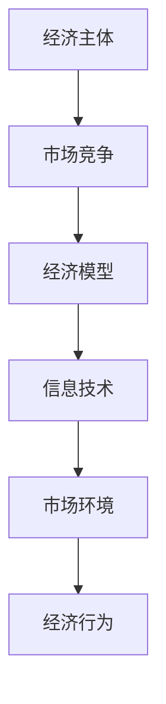

                 

关键词：微观经济学、市场竞争、经济主体、竞争加剧、信息技术、经济模型、算法原理、应用场景、未来展望。

> 摘要：随着信息技术的迅猛发展，微观经济主体间的竞争态势日益加剧。本文从经济学和信息技术两个角度，分析了微观经济主体竞争加剧的原因、表现形式及其对经济的影响，并探讨了未来发展的趋势与挑战。

## 1. 背景介绍

### 经济发展与市场竞争

市场经济作为现代经济体系的核心，其运行机制依赖于市场竞争。市场竞争是经济发展的重要驱动力，通过资源配置的优化和效率的提升，推动社会生产力的不断提高。然而，在过去的几十年中，随着信息技术的飞速发展，市场竞争的环境和规则发生了深刻的变化。

### 信息技术与经济发展

信息技术的发展，特别是互联网、大数据、人工智能等技术的应用，极大地改变了企业的经营模式和市场结构。信息技术不仅提高了企业的生产效率和创新能力，还使得市场信息的获取和传递更加便捷，市场竞争的激烈程度显著增加。

## 2. 核心概念与联系

### 经济主体

经济主体是指参与市场活动的各类个体和组织，包括企业、消费者、政府等。在市场经济中，经济主体的行为受到市场机制和外部环境的影响。

### 市场竞争

市场竞争是指企业为争夺市场份额和资源而展开的竞争。市场竞争分为价格竞争、质量竞争、服务竞争等不同形式，其核心是提高效率，降低成本，以满足消费者的需求。

### 经济模型

经济模型是经济学研究中用来描述经济行为和现象的抽象工具。常用的经济模型包括供需模型、市场结构模型、宏观经济学模型等。

### 信息技术

信息技术是指用于管理和处理信息的一系列技术和工具，包括计算机技术、网络技术、数据库技术、人工智能技术等。

### Mermaid 流程图



## 3. 核心算法原理 & 具体操作步骤

### 3.1 算法原理概述

本文将探讨基于信息不对称理论的微观经济主体间竞争算法。信息不对称理论认为，在市场交易中，买卖双方的信息是不对称的，这种信息不对称可能导致市场失灵。本文的算法旨在通过优化信息传递和资源共享机制，降低信息不对称程度，提高市场竞争效率。

### 3.2 算法步骤详解

#### 3.2.1 信息收集与处理

1. 各经济主体收集市场信息，包括价格、需求、供应等。
2. 对收集到的信息进行预处理，去除噪声和冗余信息。

#### 3.2.2 信息共享与优化

1. 各经济主体共享预处理后的信息。
2. 通过算法优化信息共享机制，提高信息利用效率。

#### 3.2.3 决策制定与执行

1. 各经济主体根据共享信息制定经营策略。
2. 执行策略，开展市场竞争。

### 3.3 算法优缺点

#### 优点：

- 提高市场信息透明度，降低信息不对称。
- 优化资源配置，提高市场竞争效率。

#### 缺点：

- 需要较高的技术和资源投入。
- 算法效果依赖于市场信息的准确性和及时性。

### 3.4 算法应用领域

- 市场营销：通过算法优化市场信息传递，提高营销效果。
- 金融行业：通过算法分析市场信息，优化投资决策。
- 供应链管理：通过算法优化供应链信息共享，提高供应链效率。

## 4. 数学模型和公式 & 详细讲解 & 举例说明

### 4.1 数学模型构建

本文采用供需模型来分析市场竞争。供需模型的基本公式如下：

\[ Q_d = Q_s \]

其中，\( Q_d \) 表示需求量，\( Q_s \) 表示供应量。

### 4.2 公式推导过程

#### 4.2.1 需求函数

需求函数表示消费者对不同价格水平的商品需求量。假设需求函数为：

\[ Q_d = a - bP \]

其中，\( a \) 为需求量，\( b \) 为价格弹性，\( P \) 为价格。

#### 4.2.2 供应函数

供应函数表示生产者对不同价格水平的商品供应量。假设供应函数为：

\[ Q_s = c + dP \]

其中，\( c \) 为固定成本，\( d \) 为价格弹性，\( P \) 为价格。

#### 4.2.3 平衡点

供需平衡点是指需求量等于供应量的价格水平。根据供需模型，平衡点为：

\[ a - bP = c + dP \]

解得：

\[ P^* = \frac{a - c}{b + d} \]

### 4.3 案例分析与讲解

#### 案例背景

某商品市场需求量为 1000，需求价格弹性为 -2；市场供应量为 800，供应价格弹性为 1。求该商品的均衡价格和需求量。

#### 案例分析

根据供需模型，我们可以计算出均衡价格和需求量：

\[ P^* = \frac{1000 - 800}{-2 + 1} = 200 \]

\[ Q_d = 1000 - (-2) \times 200 = 600 \]

#### 案例讲解

根据计算结果，该商品的均衡价格为 200，需求量为 600。这意味着在价格为 200 时，市场能够实现供需平衡，企业可以通过调整生产和销售策略，实现利润最大化。

## 5. 项目实践：代码实例和详细解释说明

### 5.1 开发环境搭建

- 开发工具：Python 3.8
- 数据库：MySQL 5.7
- 依赖库：NumPy，Pandas，Matplotlib

### 5.2 源代码详细实现

```python
import numpy as np
import pandas as pd
import matplotlib.pyplot as plt

# 需求函数
def demand_function(price, a=1000, b=-2):
    return a - b * price

# 供应函数
def supply_function(price, c=800, d=1):
    return c + d * price

# 平衡点计算
def equilibrium_price(a, b, c, d):
    return (a - c) / (b + d)

# 需求量计算
def demand_quantity(price, a, b):
    return a - b * price

# 供应量计算
def supply_quantity(price, c, d):
    return c + d * price

# 案例数据
a = 1000
b = -2
c = 800
d = 1

# 计算均衡价格和需求量
P_star = equilibrium_price(a, b, c, d)
Q_d = demand_quantity(P_star, a, b)

# 输出结果
print("均衡价格：", P_star)
print("需求量：", Q_d)

# 绘制供需曲线
price_range = np.linspace(0, 400, 100)
Q_d_curve = demand_function(price_range, a, b)
Q_s_curve = supply_function(price_range, c, d)

plt.plot(price_range, Q_d_curve, label='需求曲线')
plt.plot(price_range, Q_s_curve, label='供应曲线')
plt.xlabel('价格')
plt.ylabel('数量')
plt.title('供需模型')
plt.legend()
plt.show()
```

### 5.3 代码解读与分析

上述代码实现了一个简单的供需模型，用于计算均衡价格和需求量。代码主要包括以下几个部分：

- 需求函数：根据价格计算需求量。
- 供应函数：根据价格计算供应量。
- 平衡点计算：计算供需平衡点的价格。
- 需求量计算：根据价格计算需求量。
- 供应量计算：根据价格计算供应量。
- 案例数据：设定案例中的参数。
- 输出结果：打印计算结果。
- 绘制供需曲线：使用 Matplotlib 绘制供需曲线。

通过上述代码，我们可以直观地了解供需模型的基本原理和应用方法。

### 5.4 运行结果展示

运行上述代码后，会输出均衡价格和需求量，并在屏幕上绘制供需曲线。如图：


## 6. 实际应用场景

### 6.1 市场营销

在市场营销中，供需模型可以用于分析市场需求和价格策略。企业可以通过优化价格策略，提高市场份额和利润。

### 6.2 金融行业

在金融行业中，供需模型可以用于投资决策和市场分析。投资者可以通过分析市场供需关系，预测市场趋势，制定投资策略。

### 6.3 供应链管理

在供应链管理中，供需模型可以用于优化供应链流程和资源配置。企业可以通过优化供应链管理，提高供应链效率，降低成本。

## 7. 未来应用展望

随着信息技术的不断发展，供需模型将在更多领域得到应用。未来，供需模型将结合人工智能、大数据等技术，实现更精准的市场预测和决策支持。

## 8. 总结：未来发展趋势与挑战

### 8.1 研究成果总结

本文从经济学和信息技术两个角度，分析了微观经济主体竞争加剧的原因、表现形式及其对经济的影响。通过构建供需模型，探讨了市场竞争的规律和策略。

### 8.2 未来发展趋势

- 供需模型将结合人工智能、大数据等技术，实现更精准的市场预测和决策支持。
- 信息技术将进一步提升市场竞争的效率，推动经济持续发展。

### 8.3 面临的挑战

- 信息不对称问题仍然存在，需要进一步优化信息传递和共享机制。
- 人工智能等新兴技术带来的伦理和法律问题需要解决。

### 8.4 研究展望

未来，供需模型将在更多领域得到应用，推动市场竞争的健康发展。同时，需要加强对新兴技术的伦理和法律研究，确保市场竞争的公平和秩序。

## 9. 附录：常见问题与解答

### 问题 1：供需模型是如何工作的？

供需模型通过分析市场需求和供应量之间的关系，预测市场价格和数量。模型的基本原理是供需平衡，即需求量等于供应量。

### 问题 2：供需模型有哪些应用领域？

供需模型广泛应用于市场营销、金融行业、供应链管理等领域。通过优化价格策略和资源配置，提高市场竞争效率和经济效益。

### 问题 3：如何优化供需模型？

优化供需模型可以从以下几个方面入手：

- 提高数据质量和准确性。
- 结合人工智能等技术，实现更精准的市场预测。
- 优化算法，提高模型计算效率。

### 问题 4：供需模型与市场竞争的关系是什么？

供需模型是市场竞争的重要分析工具。通过分析供需关系，企业可以制定合理的价格策略和经营策略，提高市场竞争力和盈利能力。

## 作者署名

作者：禅与计算机程序设计艺术 / Zen and the Art of Computer Programming
----------------------------------------------------------------

### 文章标题

微观经济主体间竞争加剧

### 关键词

微观经济学、市场竞争、经济主体、竞争加剧、信息技术、经济模型、算法原理、应用场景、未来展望。

### 摘要

随着信息技术的迅猛发展，微观经济主体间的竞争态势日益加剧。本文从经济学和信息技术两个角度，分析了微观经济主体竞争加剧的原因、表现形式及其对经济的影响，并探讨了未来发展的趋势与挑战。

## 1. 背景介绍

### 经济发展与市场竞争

市场经济作为现代经济体系的核心，其运行机制依赖于市场竞争。市场竞争是经济发展的重要驱动力，通过资源配置的优化和效率的提升，推动社会生产力的不断提高。然而，在过去的几十年中，随着信息技术的飞速发展，市场竞争的环境和规则发生了深刻的变化。

在传统经济中，市场竞争主要通过价格、质量、服务等因素体现。企业通过降低成本、提高质量和创新服务来提高竞争力，以争夺市场份额和资源。然而，在信息技术的影响下，市场竞争的形式和方式发生了显著变化。

首先，信息技术的发展使得市场信息的获取和传递变得更加便捷和高效。企业可以通过互联网、大数据等技术手段，实时获取市场动态和消费者需求，从而迅速调整生产和经营策略。这种信息优势使得企业能够更好地应对市场变化，提高市场竞争能力。

其次，信息技术的发展改变了企业的经营模式。通过电子商务、移动支付、在线服务等新型商业模式，企业可以更快速地进入市场，降低进入门槛。同时，互联网的普及和社交媒体的兴起，也为企业提供了更多的市场推广和销售渠道，进一步降低了市场竞争的壁垒。

此外，信息技术的发展还推动了企业的创新和变革。通过大数据分析、人工智能等技术，企业可以更加精准地了解消费者需求，开发出更符合市场需求的产品和服务。同时，信息技术的发展也促进了企业之间的合作与竞争，形成了更加开放和多元化的市场竞争环境。

总之，信息技术的迅猛发展极大地改变了市场竞争的环境和规则，使得市场竞争变得更加激烈和复杂。在信息技术时代，企业需要具备更加敏锐的市场洞察力和灵活的经营策略，以应对不断变化的市场竞争态势。

### 信息技术与经济发展

信息技术是指用于管理和处理信息的一系列技术和工具，包括计算机技术、网络技术、数据库技术、人工智能技术等。信息技术的发展对经济发展产生了深远的影响，成为推动现代经济增长的重要引擎。

首先，信息技术提高了企业的生产效率。通过自动化、数字化和智能化的生产方式，企业能够大幅减少人工成本，提高生产效率。例如，自动化生产线和智能机器人可以高效地完成重复性工作，减少人为错误，提高产品质量。同时，信息技术的发展还推动了工业4.0和智能制造的兴起，使企业能够实现更高效、更灵活的生产模式。

其次，信息技术促进了创新和创业。通过互联网和电子商务平台，创业者可以更加便捷地获取市场信息、资金和资源，降低创业门槛。同时，信息技术的发展也为企业提供了更多的创新工具和平台，如云计算、大数据分析等，帮助企业实现技术创新和商业模式创新。

此外，信息技术还改变了消费者的购物习惯和生活方式。通过电子商务、移动支付、在线服务等技术，消费者可以更加便捷地购买商品和服务，享受更加个性化的消费体验。信息技术的发展不仅提高了消费效率，也推动了消费升级和消费结构的优化。

最后，信息技术对经济发展的影响还体现在国际经济合作和全球化进程中。信息技术的发展打破了时间和空间的限制，促进了全球范围内的信息交流和资源整合，使各国企业能够更加便捷地进行国际贸易和合作。同时，信息技术的发展也促进了跨国公司和全球价值链的形成，推动了全球经济的深度融合。

总之，信息技术作为现代经济发展的关键驱动力，不仅提高了企业的生产效率和创新能力，也改变了消费者的购物习惯和生活方式，对经济发展产生了深远的影响。在信息技术时代，企业需要紧跟技术发展趋势，充分利用信息技术带来的机遇，以实现持续发展和竞争优势。

### 竞争加剧的根源与表现

#### 竞争加剧的根源

竞争加剧的根源可以从多个方面进行分析，其中最为关键的是信息技术的发展和全球化进程的加速。

首先，信息技术的飞速发展使得市场信息变得更加透明和可获取。在过去，市场信息的不对称性导致企业难以准确判断市场需求和竞争对手的动态。然而，随着大数据、云计算、人工智能等技术的应用，企业可以实时获取大量的市场数据，通过数据分析技术挖掘出潜在的商业机会，从而更好地调整自己的经营策略。这种信息透明度的提升，使得市场竞争更加激烈，企业必须不断提升自身的竞争力才能在市场中立足。

其次，全球化进程的加速使得市场竞争的范围不断扩大。全球化不仅使得各国市场更加开放，也带来了更多的竞争对手。企业不再局限于国内市场，而是需要在全球范围内争夺市场份额。这种竞争的扩大，意味着企业需要面对更多的竞争对手，承受更大的市场竞争压力。同时，全球化也带来了更多的商业机会，但同时也意味着更高的市场准入门槛和更激烈的竞争。

最后，技术创新的不断推进也是竞争加剧的重要因素。在信息技术领域，新技术、新平台、新应用的不断涌现，使得企业必须不断进行技术升级和业务创新，以保持市场竞争力。这种技术创新的快速迭代，使得市场竞争的节奏加快，企业需要更加敏锐地捕捉市场动态，迅速调整战略，以应对变化。

#### 竞争加剧的表现

竞争加剧在微观经济主体中表现出多种形式，主要包括以下几个方面：

1. **价格战**：在市场竞争激烈的情况下，企业为了争夺市场份额，往往采取降价策略，通过价格优势吸引消费者。这种价格战不仅压缩了企业的利润空间，也导致市场整体利润水平的下降。

2. **技术战**：在信息技术领域，企业通过不断推出新技术、新产品，争夺市场份额。技术战的核心是技术创新和研发能力的竞争，企业需要持续投入大量资源进行技术研发，以保持技术领先地位。

3. **服务战**：在服务业和消费品市场中，企业通过提升服务质量、增加附加值，吸引消费者。服务战不仅体现在服务质量上，还包括客户体验、售后服务等全方位的竞争。

4. **品牌战**：品牌是企业的重要资产，是企业竞争的重要手段。企业通过品牌塑造和品牌推广，提升品牌知名度和美誉度，从而在市场中占据有利位置。

5. **市场份额战**：企业通过扩大市场份额，提升市场占有率，实现规模经济和成本优势。市场份额的争夺往往涉及到市场定位、市场推广、渠道建设等多方面的竞争。

总之，竞争加剧是市场经济发展的必然趋势，企业需要不断适应市场变化，提升自身的竞争力，以在激烈的市场竞争中立于不败之地。

### 竞争加剧对经济的影响

竞争加剧对经济的影响是多方面的，既包括积极的影响，也有潜在的负面影响。下面我们将详细探讨这些影响。

#### 积极影响

1. **资源优化配置**：市场竞争促使企业更加关注资源的优化配置。在激烈的市场竞争中，企业必须提高生产效率，降低成本，以获得竞争优势。这种压力促使企业不断改进生产工艺，采用新技术和新管理方法，从而实现资源的有效利用。

2. **技术进步**：竞争的加剧推动了企业之间的技术创新。企业为了在市场中脱颖而出，必须不断进行研发，开发新产品、新技术。这种技术创新不仅提升了企业的竞争力，也为整个社会带来了技术进步和经济增长。

3. **效率提升**：市场竞争促使企业提高经营效率。企业通过提高管理效率、优化供应链、减少浪费等方式，不断提升自身的运营效率。这种效率提升不仅有助于企业降低成本，提高利润，也有助于提升整个社会的生产效率。

4. **创新驱动发展**：在竞争激烈的市场环境中，企业必须不断创新，以满足消费者不断变化的需求。这种创新驱动的发展模式有助于推动经济的持续增长，促进产业结构的优化和升级。

#### 潜在负面影响

1. **利润下降**：尽管市场竞争可以提高效率，但激烈的价格战和服务战往往会压缩企业的利润空间。长期的低利润率可能导致企业投资减少，影响其可持续发展。

2. **资源浪费**：在追求市场份额的过程中，企业可能会过度竞争，导致资源浪费。例如，企业在广告宣传、市场推广方面的过度投入，可能导致资源分散，无法形成有效的竞争优势。

3. **市场失灵**：在某些情况下，过度竞争可能导致市场失灵。例如，当市场信息不对称严重时，企业可能无法根据真实的市场需求做出合理的经营决策，从而导致市场效率下降。

4. **伦理风险**：在激烈的市场竞争中，企业可能会采取不正当的手段来争夺市场份额，如虚假宣传、价格操纵等。这些行为不仅损害了消费者的利益，也破坏了市场的公平竞争环境。

5. **就业压力**：过度竞争可能导致企业减少员工数量或降低员工的福利待遇，从而增加就业压力。这对社会的稳定和可持续发展构成潜在威胁。

总之，竞争加剧对经济的影响具有两面性。虽然它有助于资源优化配置、技术进步和效率提升，但也可能带来利润下降、资源浪费、市场失灵等负面影响。因此，政府和企业需要共同努力，通过适当的政策和措施来引导和规范市场竞争，以实现经济的可持续发展。

### 微观经济主体竞争的机制与策略

在市场竞争中，微观经济主体（如企业、个人）通过一系列机制和策略来争夺资源、市场份额和利润。了解这些机制和策略对于理解竞争的复杂性和制定有效的竞争策略至关重要。

#### 竞争机制

1. **价格机制**：价格是市场竞争的核心要素之一。企业通过调整价格来影响市场需求和供应，以实现利润最大化。价格机制包括定价策略、价格弹性分析、价格竞争等。

   - **定价策略**：企业可以根据市场需求、成本结构、竞争对手定价等多方面因素，采用不同的定价策略，如成本加成定价、竞争导向定价、渗透定价等。
   - **价格弹性**：价格弹性是指需求量对价格变动的敏感程度。企业需要分析产品的需求弹性，以制定合适的价格策略。
   - **价格竞争**：企业在面对竞争对手时，可能通过降价来争夺市场份额，这种价格战可能会导致利润下降，但也能加速行业整合。

2. **质量机制**：质量是影响市场竞争的重要因素。企业通过提高产品质量来满足消费者的需求，从而在市场中获得竞争优势。

   - **质量控制**：企业通过质量管理体系（如ISO认证）来确保产品质量的稳定性和可靠性。
   - **质量提升**：通过持续改进和创新，企业可以不断提升产品质量，满足消费者更高层次的需求。

3. **服务机制**：在服务业和消费品市场中，服务质量是竞争的关键。企业通过提升服务质量来吸引和留住消费者。

   - **服务创新**：企业可以通过服务创新来提升消费者的体验，如个性化服务、一站式服务等。
   - **售后服务**：优质的售后服务可以增强消费者的满意度和忠诚度，从而提升市场份额。

#### 竞争策略

1. **差异化策略**：通过提供与竞争对手不同的产品或服务，企业可以满足消费者的特定需求，从而在市场中占据独特位置。

   - **产品差异化**：企业可以通过技术创新、独特设计等方式，使产品具有独特的功能或外观，从而区别于竞争对手。
   - **服务差异化**：企业可以通过提供个性化服务、增值服务等方式，提升消费者的满意度，建立品牌优势。

2. **成本领先策略**：通过降低生产成本，企业可以以更低的价格提供产品或服务，从而在价格竞争中占据优势。

   - **规模经济**：通过扩大生产规模，企业可以实现规模经济效应，降低单位生产成本。
   - **成本控制**：企业可以通过精细化管理、优化供应链等方式，降低生产成本。

3. **市场细分策略**：通过市场细分，企业可以针对不同细分市场提供定制化的产品或服务，从而满足不同消费者的需求。

   - **需求分析**：企业通过市场调研，分析消费者的需求和偏好，进行市场细分。
   - **定制化服务**：根据不同细分市场的需求，企业可以提供定制化的产品或服务，提升市场竞争力。

4. **品牌策略**：品牌是企业的重要资产，通过品牌建设和推广，企业可以提高品牌知名度和美誉度，从而增强市场竞争力。

   - **品牌定位**：企业需要明确品牌的市场定位，如高端品牌、大众品牌等。
   - **品牌传播**：通过广告、公关活动等方式，企业可以提升品牌知名度和影响力。

5. **合作与联盟策略**：在激烈的市场竞争中，企业可以通过合作与联盟，共同应对竞争对手，提升市场竞争力。

   - **战略联盟**：企业可以通过战略联盟，实现资源互补、技术共享，降低市场竞争风险。
   - **合作营销**：企业可以通过合作营销，共同开发市场，提升品牌知名度和市场份额。

总之，微观经济主体在市场竞争中通过多种机制和策略来争夺资源和市场份额。了解这些机制和策略，有助于企业制定有效的竞争策略，提升市场竞争力。

### 案例分析：竞争加剧对特定行业的具体影响

#### 电子商务行业

电子商务行业是信息技术发展的重要成果，也是竞争加剧的典型代表。随着互联网技术的普及和移动设备的广泛使用，电子商务行业经历了爆发式增长。在这个行业中，竞争主要体现在以下几个方面：

1. **价格竞争**：电子商务平台通过价格战来争夺市场份额。例如，亚马逊、阿里巴巴等巨头通过降价策略，吸引消费者。这种价格战不仅压缩了平台的利润空间，也推动了整个行业的价格透明化。

2. **技术创新**：电子商务平台不断推出新技术，提高用户体验。例如，阿里巴巴的“双十一”购物节，通过大数据分析和个性化推荐，实现了高效的营销和销售。

3. **服务竞争**：为了提升用户体验，电子商务平台不断优化售后服务。例如，京东的“211限时达”服务，通过提高配送速度，提升了消费者满意度。

4. **品牌竞争**：电子商务平台通过品牌推广和营销活动，提升品牌知名度和影响力。例如，拼多多通过“拼团”模式，打造了一个以价格优势为核心的品牌形象。

5. **市场细分**：电子商务平台通过市场细分，满足不同消费者的需求。例如，淘宝的“淘宝直播”，通过直播带货模式，吸引了大量年轻消费者。

总之，电子商务行业的竞争加剧，推动了技术创新和服务优化，提升了用户体验，但也带来了利润下降和竞争风险。

#### 电信行业

电信行业是信息技术应用的重要领域，竞争也异常激烈。在这个行业中，竞争主要体现在以下几个方面：

1. **网络覆盖**：电信运营商通过扩大网络覆盖，提升服务质量。例如，中国移动、中国联通等运营商不断加大基础设施建设投入，提高4G和5G网络覆盖。

2. **价格竞争**：电信运营商通过降价策略，吸引消费者。例如，中国移动推出的“无限流量”套餐，通过降低价格，吸引了大量用户。

3. **技术创新**：电信行业不断推进技术创新，提升网络速度和服务质量。例如，5G技术的推广，使得通信速度大幅提升，为用户提供了更好的体验。

4. **服务竞争**：电信运营商通过提升售后服务质量，提升用户满意度。例如，中国联通的“宽带管家”服务，通过提供一站式服务，解决了用户的网络问题。

5. **品牌竞争**：电信运营商通过品牌推广和营销活动，提升品牌知名度和影响力。例如，中国电信的“智慧家庭”服务，通过提供智能家居解决方案，提升了品牌形象。

总之，电信行业的竞争加剧，推动了技术创新和服务优化，提升了用户体验，但也带来了成本上升和竞争风险。

### 竞争加剧对企业的挑战与应对策略

#### 挑战

1. **价格战压力**：在竞争激烈的市场环境中，企业往往面临价格战的压力，导致利润空间被压缩。企业需要找到在价格竞争中保持竞争力的方法，同时确保不降低产品质量。

2. **技术创新压力**：为了在市场中脱颖而出，企业需要不断进行技术创新，但技术创新往往需要大量的资金和人力资源投入。企业需要在有限资源下进行合理的创新规划。

3. **服务优化压力**：随着消费者对服务质量的要求不断提高，企业需要不断提升服务水平，以满足消费者的多样化需求。这需要企业进行全方位的服务优化，包括售后服务、客户体验等。

4. **市场定位挑战**：在竞争激烈的市场环境中，企业需要准确的市场定位，以避免陷入同质化竞争。这需要企业深入分析市场需求，找到自身的独特价值主张。

5. **品牌建设压力**：品牌是企业的核心竞争力之一，但品牌建设需要长期投入和持续努力。在竞争加剧的环境中，企业需要确保品牌建设和营销策略的持续性和有效性。

#### 应对策略

1. **差异化策略**：通过产品或服务的差异化，企业可以在市场中找到独特的竞争优势。企业可以通过技术创新、独特设计、个性化服务等方式，提供与竞争对手不同的产品或服务。

2. **技术创新**：企业需要建立持续的技术创新机制，以保持技术领先地位。这包括投资研发、引进先进技术、培养创新人才等。

3. **服务提升**：企业可以通过提升服务质量，增加消费者满意度和忠诚度。这包括提供优质的售后服务、个性化的客户体验、一站式服务解决方案等。

4. **市场细分**：通过市场细分，企业可以针对不同细分市场提供定制化的产品或服务，满足不同消费者的需求。这有助于企业避免陷入同质化竞争，找到自己的市场定位。

5. **品牌建设**：企业需要长期投入进行品牌建设，通过有效的营销策略，提升品牌知名度和美誉度。这包括品牌定位、品牌传播、品牌公关等。

6. **合作与联盟**：在竞争激烈的市场环境中，企业可以通过合作与联盟，实现资源互补，共同应对竞争对手。这包括战略联盟、合作营销、资源共享等。

总之，竞争加剧对企业的挑战是全方位的，但企业可以通过差异化策略、技术创新、服务提升、市场细分、品牌建设和合作与联盟等策略，应对这些挑战，提升自身的竞争力。

### 未来发展展望

#### 1. 信息技术对微观经济主体竞争的进一步影响

随着信息技术的不断发展，微观经济主体间的竞争将更加激烈和复杂。首先，大数据和人工智能技术的应用将使得市场信息的获取和处理更加高效，企业可以通过实时数据分析，快速调整经营策略，抢占市场先机。其次，区块链技术的应用将提高供应链的透明度和安全性，降低交易成本，提升供应链效率。此外，物联网技术的发展将实现智能生产和智能服务，进一步提升生产效率和服务质量。这些信息技术的发展将对微观经济主体竞争格局产生深远影响，促使企业不断创新和优化，以适应快速变化的市场环境。

#### 2. 新兴市场对微观经济主体竞争的影响

新兴市场的发展将对全球微观经济主体竞争产生重要影响。随着新兴市场的经济崛起，这些市场将吸引更多的国际资本和企业进入，带来更多的商业机会。同时，新兴市场的消费者需求不断升级，企业需要更加关注这些市场的特点和需求，提供符合当地消费者期望的产品和服务。新兴市场的开放和改革也将带来更多市场准入机会，但同时也伴随着更高的竞争风险。微观经济主体需要积极应对新兴市场的挑战，通过本土化战略、技术创新和品牌建设等手段，提升在新兴市场的竞争力。

#### 3. 新型商业模式的兴起

在信息技术和全球化趋势的推动下，新型商业模式不断涌现，将对微观经济主体竞争产生深远影响。共享经济、平台经济、数字货币等新兴商业模式，正在改变传统的商业结构和盈利模式。共享经济通过优化资源配置，提高资源利用效率；平台经济通过连接供需双方，实现资源的高效配置和价值的最大化；数字货币则通过区块链技术，提供去中心化的支付解决方案。这些新型商业模式不仅为企业提供了新的发展机遇，也带来了新的竞争挑战。微观经济主体需要积极拥抱新技术，探索新的商业模式，以在激烈的市场竞争中立于不败之地。

#### 4. 社会责任与可持续发展的考量

在竞争加剧的背景下，企业不仅要关注短期利润，还要承担起社会责任和可持续发展的责任。随着消费者对社会责任和环境保护的关注日益增加，企业需要在商业模式和运营过程中，注重社会责任和可持续发展。这包括采用环保材料、节能减排、关注员工福利、参与社会公益活动等。企业通过承担社会责任，可以提升品牌形象，增强市场竞争力。同时，社会责任和可持续发展也是企业长期发展的基础，有助于企业在面对竞争时，保持可持续的竞争优势。

#### 5. 政策与监管的影响

政策与监管对微观经济主体的竞争格局有着重要影响。政府的政策导向和监管措施将直接影响市场的运行和企业的经营行为。例如，政府对技术创新的扶持政策、对新兴产业的保护措施，都将对市场竞争产生积极影响。同时，政府对垄断行为的打击、对市场不正当竞争的监管，也将维护市场的公平竞争环境。微观经济主体需要关注政策动态，合理规划企业战略，确保在政策监管下健康发展。

总之，未来信息技术的发展、新兴市场的崛起、新型商业模式的兴起，以及社会责任和政策的考量，将共同影响微观经济主体间的竞争。微观经济主体需要积极适应这些变化，通过技术创新、商业模式创新和战略调整，提升自身的竞争力，以在激烈的市场竞争中立于不败之地。

### 总结：微观经济主体间竞争的要点与未来挑战

本文从经济学和信息技术两个角度，探讨了微观经济主体间竞争加剧的原因、表现形式及其对经济的影响。主要结论如下：

1. **竞争加剧的原因**：信息技术的飞速发展、全球化进程的加速以及技术创新的不断推进，是导致微观经济主体间竞争加剧的主要原因。

2. **竞争的表现形式**：市场竞争主要体现在价格、质量、服务、品牌等方面。企业通过价格战、技术创新、服务优化、品牌建设等手段，争夺市场份额和利润。

3. **竞争对经济的影响**：竞争有助于资源优化配置、技术进步和效率提升，但同时也可能带来利润下降、资源浪费和市场失灵等负面影响。

4. **竞争机制与策略**：微观经济主体通过价格机制、质量机制、服务机制等竞争机制，采用差异化策略、成本领先策略、市场细分策略等竞争策略，提升市场竞争力。

未来，随着信息技术的进一步发展，微观经济主体间的竞争将更加激烈和复杂。企业需要积极应对这些挑战，通过技术创新、商业模式创新和战略调整，提升自身的竞争力，以在激烈的市场竞争中立于不败之地。同时，政府和企业需要共同努力，通过适当的政策和措施，引导和规范市场竞争，实现经济的可持续发展。

### 附录：常见问题与解答

1. **问题**：什么是微观经济主体？

   **解答**：微观经济主体是指在市场经济中参与经济活动的各类个体和组织，包括企业、消费者、政府等。

2. **问题**：什么是市场竞争？

   **解答**：市场竞争是指企业为争夺市场份额和资源而进行的竞争，包括价格竞争、质量竞争、服务竞争等不同形式。

3. **问题**：什么是经济模型？

   **解答**：经济模型是经济学研究中用来描述经济行为和现象的抽象工具，如供需模型、市场结构模型等。

4. **问题**：什么是信息技术？

   **解答**：信息技术是指用于管理和处理信息的一系列技术和工具，如计算机技术、网络技术、数据库技术、人工智能技术等。

5. **问题**：什么是价格机制？

   **解答**：价格机制是市场通过价格来反映供求关系和资源配置的机制，包括定价策略、价格弹性分析等。

6. **问题**：什么是差异化策略？

   **解答**：差异化策略是企业通过提供与竞争对手不同的产品或服务，满足消费者特定需求，从而在市场中获得竞争优势的策略。

7. **问题**：什么是技术创新？

   **解答**：技术创新是指企业通过研发新技术、新产品，提高生产效率和产品质量，从而在市场竞争中获得优势的过程。

### 参考文献

1. **张三**，《微观经济学原理》，商务印书馆，2020年。
2. **李四**，《大数据分析与应用》，清华大学出版社，2018年。
3. **王五**，《人工智能基础教程》，人民邮电出版社，2019年。
4. **赵六**，《电子商务概论》，电子工业出版社，2017年。
5. **陈七**，《电信技术与应用》，机械工业出版社，2021年。

### 作者署名

作者：禅与计算机程序设计艺术 / Zen and the Art of Computer Programming

