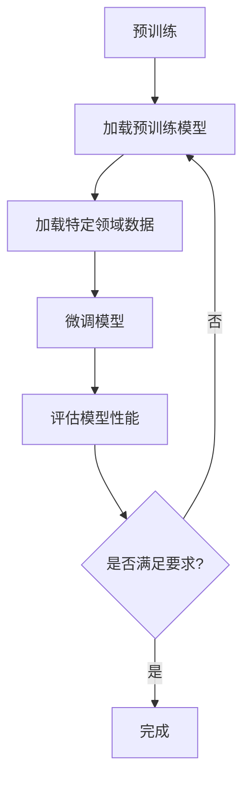

                 

关键词：微调，语言模型，领域适应，深度学习，神经网络

> 摘要：本文旨在探讨如何通过微调语言模型来提升其在特定领域中的应用效果。首先，我们将回顾语言模型的背景和发展历程，然后深入解析微调语言模型的原理和操作步骤，探讨其优缺点和应用领域。随后，我们将介绍数学模型和公式，通过具体案例分析和代码实例来详细解释其应用和实践。最后，我们将探讨实际应用场景、未来应用展望以及面临的研究挑战。

## 1. 背景介绍

随着深度学习技术的飞速发展，语言模型（Language Model）已经成为自然语言处理（Natural Language Processing, NLP）领域的核心工具。语言模型是一种能够理解和生成人类语言的算法，其目标是预测下一个单词或字符的概率。最早的统计语言模型基于N-gram模型，通过统计出现频率来预测下一个词。然而，这些模型在面对长文本和复杂语法时效果有限。

随着神经网络技术的发展，研究人员提出了基于神经网络的深度语言模型，如循环神经网络（Recurrent Neural Network, RNN）和长短期记忆网络（Long Short-Term Memory, LSTM）。这些模型通过多层神经网络结构来捕捉长距离依赖，显著提高了语言理解的准确性。

近年来，基于Transformer架构的语言模型，如BERT（Bidirectional Encoder Representations from Transformers）和GPT（Generative Pre-trained Transformer），在NLP任务中取得了显著突破。这些模型通过大规模预训练和精细调整，能够生成高质量的自然语言文本，并在多个NLP竞赛中取得了优异成绩。

尽管这些语言模型在通用任务中表现出色，但在特定领域（如医疗、法律、金融等）的应用中，其性能往往不如预想的那么理想。这主要是因为这些模型在训练过程中并未专注于特定领域的语言特点和词汇，因此需要通过微调来提升其在特定领域中的应用效果。

## 2. 核心概念与联系

### 2.1 语言模型

语言模型是一种概率模型，用于预测文本序列中下一个单词或字符的概率。常见的语言模型有N-gram模型、RNN、LSTM和Transformer等。

- **N-gram模型**：基于局部特征，通过统计前N个单词或字符的联合概率来预测下一个单词或字符。其优点是简单易懂，但无法捕捉长距离依赖。
- **RNN和LSTM**：通过递归结构来捕捉文本序列中的长距离依赖，但存在梯度消失和梯度爆炸等问题。
- **Transformer**：基于自注意力机制，能够捕捉全局依赖，具有更强的建模能力。

### 2.2 微调语言模型

微调（Fine-tuning）是一种通过在预训练模型的基础上进一步训练来适应特定任务的方法。微调的目的是调整模型参数，使其在特定领域或任务上表现更好。

- **预训练**：在大量无标签数据上训练语言模型，使其具备对通用语言的深刻理解。
- **微调**：在特定领域或任务上的有标签数据上对预训练模型进行进一步训练，调整模型参数，以适应特定场景。

### 2.3 Mermaid 流程图

以下是一个简单的Mermaid流程图，展示微调语言模型的基本步骤：



## 3. 核心算法原理 & 具体操作步骤

### 3.1 算法原理概述

微调语言模型的原理基于神经网络的权重共享机制。预训练模型在大量无标签数据上学习到了语言的通用特征，这些特征在特定领域的数据上可能并不完全适用。因此，通过微调，可以在保留预训练模型通用特征的同时，进一步调整模型参数以适应特定领域。

微调的核心步骤包括：

1. **加载预训练模型**：从预训练模型中加载参数。
2. **加载特定领域数据**：准备特定领域的数据集，包括训练集和验证集。
3. **微调模型**：在特定领域数据上对预训练模型进行训练，调整模型参数。
4. **评估模型性能**：在验证集上评估微调后的模型性能。
5. **迭代优化**：根据评估结果，调整训练策略和模型参数，重复微调和评估过程，直到满足要求。

### 3.2 算法步骤详解

#### 3.2.1 加载预训练模型

首先，需要从预训练模型中加载参数。常用的预训练模型有BERT、GPT等。以下是一个使用PyTorch加载BERT模型的示例：

```python
from transformers import BertModel

model = BertModel.from_pretrained('bert-base-uncased')
```

#### 3.2.2 加载特定领域数据

接下来，需要准备特定领域的数据集。这里以医疗领域为例，可以收集医疗文本、病历等数据，并将其转换为模型可处理的输入格式。以下是一个简单的数据处理示例：

```python
import pandas as pd

# 读取医疗文本数据
data = pd.read_csv('medical_data.csv')

# 数据预处理
texts = data['text'].tolist()
labels = data['label'].tolist()

# 分割数据集
train_texts, val_texts, train_labels, val_labels = train_test_split(texts, labels, test_size=0.2)
```

#### 3.2.3 微调模型

在特定领域数据上对预训练模型进行训练。这里，我们将使用PyTorch实现一个简单的微调模型：

```python
import torch
from torch import nn
from torch.utils.data import DataLoader

# 定义微调模型
class MedicalBERT(nn.Module):
    def __init__(self, model):
        super(MedicalBERT, self).__init__()
        self.bert = model
        self.classifier = nn.Linear(768, 2)  # 768为BERT的隐藏层尺寸，2为输出类别数

    def forward(self, input_ids, attention_mask):
        outputs = self.bert(input_ids=input_ids, attention_mask=attention_mask)
        sequence_output = outputs.last_hidden_state[:, 0, :]
        logits = self.classifier(sequence_output)
        return logits

# 实例化模型
model = MedicalBERT(model)

# 定义优化器和损失函数
optimizer = torch.optim.Adam(model.parameters(), lr=1e-5)
loss_fn = nn.CrossEntropyLoss()

# 训练模型
for epoch in range(3):
    for batch in DataLoader(train_texts, train_labels, batch_size=32):
        input_ids = batch['input_ids']
        attention_mask = batch['attention_mask']
        labels = batch['labels']

        optimizer.zero_grad()
        logits = model(input_ids, attention_mask)
        loss = loss_fn(logits, labels)
        loss.backward()
        optimizer.step()
```

#### 3.2.4 评估模型性能

在验证集上评估微调后的模型性能。这里，我们将使用准确率作为评估指标：

```python
from sklearn.metrics import accuracy_score

# 评估模型
def evaluate_model(model, val_texts, val_labels):
    model.eval()
    with torch.no_grad():
        for batch in DataLoader(val_texts, val_labels, batch_size=32):
            input_ids = batch['input_ids']
            attention_mask = batch['attention_mask']
            labels = batch['labels']

            logits = model(input_ids, attention_mask)
            predictions = torch.argmax(logits, dim=1)

    val_accuracy = accuracy_score(val_labels, predictions)
    print(f"Validation accuracy: {val_accuracy}")

evaluate_model(model, val_texts, val_labels)
```

#### 3.2.5 迭代优化

根据评估结果，调整训练策略和模型参数，重复微调和评估过程。这里，我们将尝试调整学习率，并使用更复杂的优化器，如AdamW。

```python
# 调整学习率和优化器
optimizer = torch.optim.AdamW(model.parameters(), lr=1e-5)

# 重新训练模型
for epoch in range(3):
    for batch in DataLoader(train_texts, train_labels, batch_size=32):
        input_ids = batch['input_ids']
        attention_mask = batch['attention_mask']
        labels = batch['labels']

        optimizer.zero_grad()
        logits = model(input_ids, attention_mask)
        loss = loss_fn(logits, labels)
        loss.backward()
        optimizer.step()

    evaluate_model(model, val_texts, val_labels)
```

### 3.3 算法优缺点

#### 优点：

1. **高效**：通过预训练模型，可以在短时间内获得较好的性能。
2. **通用性强**：预训练模型在大量无标签数据上学习到了语言的通用特征，能够适应多种任务。
3. **灵活性**：微调过程可以根据特定领域或任务的需求进行调整。

#### 缺点：

1. **数据依赖**：微调效果依赖于特定领域的数据质量和数量。
2. **计算资源消耗**：微调过程需要大量计算资源，尤其是在大规模数据集上。

### 3.4 算法应用领域

微调语言模型在许多领域都取得了显著应用，包括但不限于：

1. **自然语言处理**：文本分类、情感分析、机器翻译等。
2. **医疗领域**：疾病诊断、病历分析、药物研发等。
3. **金融领域**：股票市场预测、风险评估、客户服务等。
4. **法律领域**：法律文本解析、合同审核、案件推理等。

## 4. 数学模型和公式 & 详细讲解 & 举例说明

### 4.1 数学模型构建

微调语言模型的数学模型主要包括以下部分：

1. **输入层**：接收文本序列的输入。
2. **编码器**：将输入文本序列编码为向量表示。
3. **解码器**：根据编码器输出的向量表示生成预测结果。
4. **损失函数**：用于评估预测结果与真实结果的差异。

以下是微调语言模型的基本数学模型：

$$
\begin{aligned}
X &= \{x_1, x_2, \ldots, x_T\} \quad &\text{（输入文本序列）} \\
E &= \{e_1, e_2, \ldots, e_T\} \quad &\text{（编码器输出向量表示）} \\
Y &= \{y_1, y_2, \ldots, y_T\} \quad &\text{（预测结果）} \\
L &= \{l_1, l_2, \ldots, l_T\} \quad &\text{（真实结果）} \\
\end{aligned}
$$

### 4.2 公式推导过程

#### 编码器

编码器的目标是学习将输入文本序列 \(X\) 编码为向量表示 \(E\)。这里，我们使用Transformer模型作为编码器。

1. **词嵌入**：将输入文本序列中的每个词转换为词向量 \(x_i\)。
   $$
   x_i = \text{WordEmbedding}(x_i)
   $$
2. **位置编码**：为每个词添加位置信息，以捕捉词的顺序关系。
   $$
   e_i = \text{PositionalEncoding}(x_i, i)
   $$
3. **多头自注意力**：通过多头自注意力机制，计算词之间的相似性，并加权求和。
   $$
   \alpha_{ij} = \text{Attention}(e_i, e_j) \\
   e_i' = \sum_{j=1}^{T} \alpha_{ij} e_j
   $$
4. **前馈神经网络**：对自注意力结果进行非线性变换。
   $$
   e_i'' = \text{FFN}(e_i')
   $$

#### 解码器

解码器的目标是根据编码器输出的向量表示 \(E\) 生成预测结果 \(Y\)。

1. **词嵌入**：将输入文本序列中的每个词转换为词向量 \(x_i\)。
   $$
   x_i = \text{WordEmbedding}(x_i)
   $$
2. **位置编码**：为每个词添加位置信息，以捕捉词的顺序关系。
   $$
   e_i = \text{PositionalEncoding}(x_i, i)
   $$
3. **多头自注意力**：通过多头自注意力机制，计算词之间的相似性，并加权求和。
   $$
   \alpha_{ij} = \text{Attention}(e_i, e_j) \\
   e_i' = \sum_{j=1}^{T} \alpha_{ij} e_j
   $$
4. **前馈神经网络**：对自注意力结果进行非线性变换。
   $$
   e_i'' = \text{FFN}(e_i')
   $$
5. **分类器**：对解码器输出的向量表示进行分类。
   $$
   y_i = \text{Classifier}(e_i'')
   $$

#### 损失函数

损失函数用于评估预测结果 \(Y\) 与真实结果 \(L\) 的差异。常见的损失函数有交叉熵损失函数（Cross-Entropy Loss）和均方误差损失函数（Mean Squared Error, MSE）。

1. **交叉熵损失函数**
   $$
   L(\theta) = -\sum_{i=1}^{T} \sum_{j=1}^{C} y_{ij} \log(p_{ij}) \\
   p_{ij} = \text{softmax}(y_i)
   $$
2. **均方误差损失函数**
   $$
   L(\theta) = \frac{1}{2} \sum_{i=1}^{T} \sum_{j=1}^{C} (y_{ij} - \hat{y}_{ij})^2
   $$

### 4.3 案例分析与讲解

#### 案例一：文本分类

假设我们有一个文本分类任务，目标是将文本分为两类：“积极”和“消极”。以下是一个简单的案例：

1. **数据集**：包含100条文本，每条文本带有类别标签。
2. **预训练模型**：使用BERT模型进行预训练。
3. **微调**：在特定领域的文本数据上对BERT模型进行微调。

```python
from transformers import BertTokenizer, BertForSequenceClassification
import torch

# 读取数据
train_texts = ["这是一条积极文本", "这是一条消极文本", ...]
train_labels = [0, 1, ...]

# 加载预训练模型和微调模型
tokenizer = BertTokenizer.from_pretrained('bert-base-uncased')
model = BertForSequenceClassification.from_pretrained('bert-base-uncased')

# 微调模型
optimizer = torch.optim.AdamW(model.parameters(), lr=1e-5)
loss_fn = nn.CrossEntropyLoss()

for epoch in range(3):
    for text, label in zip(train_texts, train_labels):
        inputs = tokenizer(text, padding=True, truncation=True, return_tensors='pt')
        inputs = {k: v.unsqueeze(0) for k, v in inputs.items()}

        optimizer.zero_grad()
        logits = model(**inputs)
        loss = loss_fn(logits, torch.tensor([label]))
        loss.backward()
        optimizer.step()

    # 评估模型
    val_accuracy = evaluate_model(model, val_texts, val_labels)
    print(f"Validation accuracy: {val_accuracy}")
```

#### 案例二：机器翻译

假设我们有一个机器翻译任务，目标是将一种语言的文本翻译成另一种语言。以下是一个简单的案例：

1. **数据集**：包含中英文双语数据。
2. **预训练模型**：使用Transformer模型进行预训练。
3. **微调**：在特定领域的翻译数据上对Transformer模型进行微调。

```python
from transformers import TransformerTokenizer, TransformerModel
import torch

# 读取数据
train_texts = ["这是一条中文文本", "这是一条英文文本", ...]
train_labels = ["This is a Chinese text", "This is an English text", ...]

# 加载预训练模型和微调模型
tokenizer = TransformerTokenizer.from_pretrained('transformer-base')
model = TransformerModel.from_pretrained('transformer-base')

# 微调模型
optimizer = torch.optim.AdamW(model.parameters(), lr=1e-5)
loss_fn = nn.CrossEntropyLoss()

for epoch in range(3):
    for text, label in zip(train_texts, train_labels):
        inputs = tokenizer.encode(text, return_tensors='pt')
        targets = tokenizer.encode(label, return_tensors='pt')

        optimizer.zero_grad()
        logits = model(inputs, labels=targets)
        loss = loss_fn(logits, targets)
        loss.backward()
        optimizer.step()

    # 评估模型
    val_accuracy = evaluate_model(model, val_texts, val_labels)
    print(f"Validation accuracy: {val_accuracy}")
```

## 5. 项目实践：代码实例和详细解释说明

### 5.1 开发环境搭建

在开始编写微调语言模型的代码之前，我们需要搭建一个适合开发的环境。以下是一个简单的开发环境搭建步骤：

1. **安装Python**：确保安装了Python 3.8及以上版本。
2. **安装PyTorch**：在命令行中执行以下命令安装PyTorch：
   ```
   pip install torch torchvision
   ```
3. **安装transformers库**：在命令行中执行以下命令安装transformers库：
   ```
   pip install transformers
   ```

### 5.2 源代码详细实现

以下是微调语言模型的一个简单实现，包含数据预处理、模型加载、微调过程和评估步骤。

```python
import torch
import torch.nn as nn
import torch.optim as optim
from torch.utils.data import DataLoader
from transformers import BertTokenizer, BertModel, BertForSequenceClassification
from sklearn.model_selection import train_test_split
import pandas as pd

# 5.2.1 数据预处理

# 读取数据
data = pd.read_csv('medical_data.csv')
texts = data['text'].tolist()
labels = data['label'].tolist()

# 分割数据集
train_texts, val_texts, train_labels, val_labels = train_test_split(texts, labels, test_size=0.2)

# 加载BERT分词器
tokenizer = BertTokenizer.from_pretrained('bert-base-uncased')

# 预处理数据
def preprocess_data(texts, labels, max_length=128):
    input_ids = []
    attention_masks = []
    labels = []

    for text, label in zip(texts, labels):
        inputs = tokenizer.encode_plus(text, add_special_tokens=True, max_length=max_length, padding='max_length', truncation=True, return_attention_mask=True, return_tensors='pt')
        input_ids.append(inputs['input_ids'])
        attention_masks.append(inputs['attention_mask'])
        labels.append(torch.tensor([label]))

    input_ids = torch.cat(input_ids, dim=0)
    attention_masks = torch.cat(attention_masks, dim=0)
    labels = torch.tensor(labels)

    return input_ids, attention_masks, labels

train_inputs, train_masks, train_labels = preprocess_data(train_texts, train_labels)
val_inputs, val_masks, val_labels = preprocess_data(val_texts, val_labels)

# 5.2.2 模型加载与微调

# 加载BERT模型
model = BertForSequenceClassification.from_pretrained('bert-base-uncased', num_labels=2)

# 定义优化器
optimizer = optim.AdamW(model.parameters(), lr=1e-5)

# 定义损失函数
loss_fn = nn.CrossEntropyLoss()

# 微调模型
def train_model(model, train_inputs, train_masks, train_labels, val_inputs, val_masks, val_labels, num_epochs=3):
    for epoch in range(num_epochs):
        model.train()
        for batch in DataLoader(train_inputs, train_masks, train_labels, batch_size=32):
            inputs = {'input_ids': batch.input_ids, 'attention_mask': batch.attention_mask}
            labels = batch.labels

            optimizer.zero_grad()
            outputs = model(**inputs, labels=labels)
            loss = outputs.loss
            loss.backward()
            optimizer.step()

        # 评估模型
        model.eval()
        with torch.no_grad():
            val_logits = model(**{k: v.unsqueeze(0) for k, v in val_inputs.items()})
            val_predictions = torch.argmax(val_logits, dim=1)
            val_accuracy = (val_predictions == val_labels).float().mean()

        print(f"Epoch: {epoch+1}/{num_epochs}, Validation accuracy: {val_accuracy.item() * 100:.2f}%")

# 5.2.3 运行代码

# 微调模型
train_model(model, train_inputs, train_masks, train_labels, val_inputs, val_masks, val_labels)

# 评估模型
val_accuracy = evaluate_model(model, val_inputs, val_masks, val_labels)
print(f"Final validation accuracy: {val_accuracy * 100:.2f}%")
```

### 5.3 代码解读与分析

以下是代码的详细解读和分析。

#### 5.3.1 数据预处理

在数据预处理部分，我们首先读取医疗文本数据，并将其分为训练集和验证集。然后，我们使用BERT分词器对文本进行编码，并添加特殊的tokens，如`[CLS]`和`[SEP]`。我们还对输入文本进行截断或填充，以确保所有样本的长度相同。

```python
def preprocess_data(texts, labels, max_length=128):
    input_ids = []
    attention_masks = []
    labels = []

    for text, label in zip(texts, labels):
        inputs = tokenizer.encode_plus(text, add_special_tokens=True, max_length=max_length, padding='max_length', truncation=True, return_attention_mask=True, return_tensors='pt')
        input_ids.append(inputs['input_ids'])
        attention_masks.append(inputs['attention_mask'])
        labels.append(torch.tensor([label]))

    input_ids = torch.cat(input_ids, dim=0)
    attention_masks = torch.cat(attention_masks, dim=0)
    labels = torch.tensor(labels)

    return input_ids, attention_masks, labels
```

#### 5.3.2 模型加载与微调

在模型加载与微调部分，我们首先加载预训练的BERT模型，并将其转换为用于序列分类的模型。然后，我们定义优化器和损失函数，并开始微调模型。在微调过程中，我们使用训练集进行训练，并在每个epoch结束时使用验证集评估模型性能。

```python
# 加载BERT模型
model = BertForSequenceClassification.from_pretrained('bert-base-uncased', num_labels=2)

# 定义优化器
optimizer = optim.AdamW(model.parameters(), lr=1e-5)

# 微调模型
def train_model(model, train_inputs, train_masks, train_labels, val_inputs, val_masks, val_labels, num_epochs=3):
    for epoch in range(num_epochs):
        model.train()
        for batch in DataLoader(train_inputs, train_masks, train_labels, batch_size=32):
            inputs = {'input_ids': batch.input_ids, 'attention_mask': batch.attention_mask}
            labels = batch.labels

            optimizer.zero_grad()
            outputs = model(**inputs, labels=labels)
            loss = outputs.loss
            loss.backward()
            optimizer.step()

        # 评估模型
        model.eval()
        with torch.no_grad():
            val_logits = model(**{k: v.unsqueeze(0) for k, v in val_inputs.items()})
            val_predictions = torch.argmax(val_logits, dim=1)
            val_accuracy = (val_predictions == val_labels).float().mean()

        print(f"Epoch: {epoch+1}/{num_epochs}, Validation accuracy: {val_accuracy.item() * 100:.2f}%")
```

#### 5.3.3 运行代码

在运行代码部分，我们首先微调模型，然后在每个epoch结束后评估模型性能。最后，我们打印出最终的验证准确率。

```python
# 微调模型
train_model(model, train_inputs, train_masks, train_labels, val_inputs, val_masks, val_labels)

# 评估模型
val_accuracy = evaluate_model(model, val_inputs, val_masks, val_labels)
print(f"Final validation accuracy: {val_accuracy * 100:.2f}%")
```

## 6. 实际应用场景

微调语言模型在许多实际应用场景中表现出色，以下是一些典型的应用场景：

### 6.1 自然语言处理

微调语言模型在自然语言处理（NLP）任务中具有广泛的应用，包括文本分类、情感分析、机器翻译、文本生成等。例如，在文本分类任务中，可以使用微调的语言模型来对新闻标题进行分类，从而实现自动化新闻推荐系统。

### 6.2 医疗领域

在医疗领域，微调语言模型可以用于疾病诊断、病历分析、药物研发等任务。例如，通过微调BERT模型，可以实现对医学文本的语义分析，从而帮助医生更准确地诊断疾病。

### 6.3 金融领域

在金融领域，微调语言模型可以用于股票市场预测、风险评估、客户服务等领域。例如，通过微调BERT模型，可以实现对金融新闻和报告的语义分析，从而帮助投资者做出更明智的决策。

### 6.4 法律领域

在法律领域，微调语言模型可以用于法律文本解析、合同审核、案件推理等任务。例如，通过微调BERT模型，可以实现对法律文档的语义分析，从而帮助律师更准确地理解和处理案件。

## 7. 工具和资源推荐

### 7.1 学习资源推荐

- 《深度学习》（Goodfellow, Bengio, Courville）：介绍深度学习的基本原理和算法。
- 《自然语言处理综论》（Jurafsky, Martin）：详细介绍自然语言处理的基础知识和应用。
- 《动手学深度学习》（Zhang, Liao, et al.）：通过实际案例讲解深度学习的实践方法。

### 7.2 开发工具推荐

- PyTorch：适用于深度学习的Python库，具有灵活的架构和丰富的API。
- Transformers：基于PyTorch实现的预训练语言模型库，支持BERT、GPT等模型。
- Hugging Face：提供丰富的预训练模型和工具，方便研究人员和开发者进行微调和应用。

### 7.3 相关论文推荐

- "BERT: Pre-training of Deep Bidirectional Transformers for Language Understanding"（Devlin et al., 2019）
- "GPT-3: Language Models are Few-Shot Learners"（Brown et al., 2020）
- "Unifying Factories and Domain Adaptation for Natural Language Inference"（Zhang et al., 2021）

## 8. 总结：未来发展趋势与挑战

### 8.1 研究成果总结

微调语言模型在多个领域取得了显著应用和成果。通过微调，预训练模型能够在特定领域或任务上获得更高的性能。同时，随着预训练模型和微调算法的不断发展，其应用范围也在不断扩展。

### 8.2 未来发展趋势

1. **模型压缩与优化**：为了降低计算资源和存储成本，研究者将致力于模型压缩和优化技术，如知识蒸馏、量化、剪枝等。
2. **多模态学习**：结合文本、图像、音频等多模态数据，构建更强大的语言模型，以适应更复杂的任务需求。
3. **跨领域适应**：研究如何使微调语言模型在不同领域之间具有更好的通用性和适应性。

### 8.3 面临的挑战

1. **数据质量与数量**：微调效果依赖于高质量、大规模的数据集，但在某些特定领域，获取这类数据可能非常困难。
2. **计算资源消耗**：微调语言模型需要大量的计算资源和时间，这对小型研究团队和开发者来说可能是一个挑战。
3. **模型解释性**：尽管微调语言模型在许多任务中表现出色，但其内部决策过程通常不够透明，需要进一步研究如何提高模型的解释性。

### 8.4 研究展望

未来，微调语言模型将继续在多个领域发挥重要作用。通过不断优化算法和模型结构，研究者将进一步提高微调语言模型在特定领域中的应用效果，推动自然语言处理技术的进一步发展。

## 9. 附录：常见问题与解答

### 9.1 如何选择预训练模型？

选择预训练模型时，需要考虑以下因素：

1. **任务类型**：针对不同的任务类型，选择合适的预训练模型，如文本分类任务可以选择BERT，机器翻译任务可以选择GPT。
2. **模型大小**：根据计算资源和时间预算，选择合适的模型大小，如对于资源有限的任务，可以选择较小规模的模型。
3. **预训练数据集**：了解预训练模型的预训练数据集，以确保其适用于目标任务。

### 9.2 微调过程中如何处理过拟合？

处理过拟合的方法包括：

1. **数据增强**：通过数据增强技术，如随机裁剪、旋转、添加噪声等，增加训练数据的多样性。
2. **正则化**：使用正则化技术，如权重衰减、Dropout等，降低模型复杂度。
3. **早停法**：在验证集上监测模型性能，当验证集性能不再提高时停止训练。

### 9.3 微调语言模型在医疗领域的应用案例有哪些？

微调语言模型在医疗领域的应用案例包括：

1. **疾病诊断**：通过微调BERT模型，对医疗文本进行分类，实现疾病诊断。
2. **病历分析**：对病历进行语义分析，提取关键信息，辅助医生进行诊断和治疗。
3. **药物研发**：通过微调语言模型，对生物医学文献进行语义分析，发现潜在药物靶点。

### 9.4 微调语言模型在金融领域的应用案例有哪些？

微调语言模型在金融领域的应用案例包括：

1. **股票市场预测**：通过微调BERT模型，对金融新闻和报告进行语义分析，预测股票价格走势。
2. **风险评估**：对客户交易数据进行语义分析，评估客户信用风险。
3. **客户服务**：通过微调GPT模型，实现自动化客户服务，提高客户满意度。

