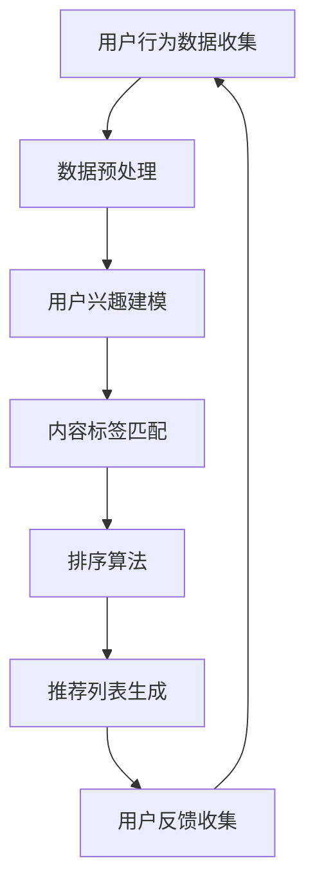

                 

关键词：快手、直播推荐、校招算法、面试题、解析

> 摘要：本文将深入解析快手2024年直播推荐校招算法面试题，通过详细的理论讲解、实战案例分析，帮助读者掌握直播推荐算法的核心原理和实际应用，为校招面试做好准备。

## 1. 背景介绍

随着移动互联网的快速发展，直播已成为人们日常娱乐和信息获取的重要途径。快手作为国内领先的短视频和直播平台，其直播推荐系统的重要性不言而喻。直播推荐算法能够根据用户的兴趣和行为，为用户精准推送他们可能感兴趣的内容，提高用户粘性和平台活跃度。

快手2024年校招算法面试题涵盖了直播推荐系统的核心技术和挑战，包括但不限于用户行为分析、内容标签匹配、排序算法优化等方面。本文将针对这些面试题进行详细解析，帮助读者深入理解直播推荐算法的原理和应用。

## 2. 核心概念与联系

为了更好地理解直播推荐算法，我们首先需要了解以下几个核心概念：

### 2.1 用户行为数据

用户行为数据是指用户在直播平台上的各种操作记录，包括但不限于观看时长、点赞、评论、分享等。这些数据反映了用户的兴趣和偏好，是直播推荐算法的重要输入。

### 2.2 内容标签

内容标签是对直播内容进行分类和描述的重要手段。快手平台通过人工和自动化方式对直播内容进行标签化，以便于推荐系统进行内容匹配。

### 2.3 排序算法

排序算法是直播推荐系统的核心组成部分，用于根据用户行为和内容标签，对推荐列表中的直播内容进行排序，以最大化用户满意度。

### 2.4 Mermaid 流程图

以下是一个简单的 Mermaid 流程图，展示了直播推荐系统的工作流程：



## 3. 核心算法原理 & 具体操作步骤

### 3.1 算法原理概述

直播推荐算法的核心原理是基于用户行为数据和内容标签，通过机器学习和深度学习等技术，构建用户兴趣模型和内容标签模型，从而实现精准推荐。

### 3.2 算法步骤详解

1. **数据预处理**：对用户行为数据进行清洗和格式化，确保数据的准确性和一致性。
2. **用户兴趣建模**：使用机器学习算法，如决策树、随机森林等，构建用户兴趣模型，以预测用户对某类直播内容的偏好。
3. **内容标签匹配**：对直播内容进行标签化处理，并使用相似度计算方法（如余弦相似度、欧氏距离等），对用户兴趣模型和内容标签进行匹配。
4. **排序算法**：根据用户兴趣模型和内容标签匹配结果，使用排序算法（如Top-N排序、PageRank等），生成推荐列表。
5. **用户反馈收集**：通过用户对推荐内容的反馈，不断优化用户兴趣模型和推荐算法。

### 3.3 算法优缺点

**优点**：

- **个性化推荐**：基于用户行为数据和内容标签，实现精准的个性化推荐。
- **实时性**：通过实时处理用户行为数据，实现实时推荐。
- **多样性**：推荐算法能够根据用户兴趣，推荐不同类型和风格的直播内容，提高用户满意度。

**缺点**：

- **冷启动问题**：新用户或新内容在初期难以获得足够的推荐，需要一定时间积累数据。
- **数据隐私**：用户行为数据的收集和处理需要遵守数据隐私法规，确保用户信息安全。

### 3.4 算法应用领域

直播推荐算法在短视频、直播、电商等多个领域都有广泛应用。快手作为直播平台，通过直播推荐算法，实现了用户与内容的精准匹配，提高了用户粘性和平台活跃度。

## 4. 数学模型和公式 & 详细讲解 & 举例说明

### 4.1 数学模型构建

直播推荐算法的核心数学模型包括用户兴趣模型、内容标签模型和排序算法。

#### 4.1.1 用户兴趣模型

用户兴趣模型可以通过以下公式表示：

$$
User\_Interest = f(User\_Behavior, Content\_Tag)
$$

其中，$User\_Behavior$ 表示用户行为数据，$Content\_Tag$ 表示内容标签。

#### 4.1.2 内容标签模型

内容标签模型可以通过以下公式表示：

$$
Content\_Tag = g(Content\_Feature, Tag\_Feature)
$$

其中，$Content\_Feature$ 表示内容特征，$Tag\_Feature$ 表示标签特征。

#### 4.1.3 排序算法

排序算法可以通过以下公式表示：

$$
Rank = h(User\_Interest, Content\_Tag)
$$

其中，$Rank$ 表示推荐列表中的排序值。

### 4.2 公式推导过程

直播推荐算法的推导过程涉及多个数学领域，包括概率论、线性代数、优化算法等。

#### 4.2.1 用户兴趣模型推导

用户兴趣模型可以通过贝叶斯推断、隐马尔可夫模型等机器学习算法进行推导。

$$
P(User\_Interest|User\_Behavior) = \frac{P(User\_Behavior|User\_Interest) \cdot P(User\_Interest)}{P(User\_Behavior)}
$$

其中，$P(User\_Interest|User\_Behavior)$ 表示给定用户行为数据，用户对某类直播内容的概率。

#### 4.2.2 内容标签模型推导

内容标签模型可以通过K近邻算法、支持向量机等机器学习算法进行推导。

$$
Content\_Tag = \sum_{i=1}^{n} w_i \cdot Tag_i
$$

其中，$w_i$ 表示标签权重，$Tag_i$ 表示第 $i$ 个标签。

#### 4.2.3 排序算法推导

排序算法可以通过优化目标函数进行推导。

$$
Rank = \sum_{i=1}^{n} w_i \cdot f(User\_Interest, Content\_Tag)
$$

其中，$w_i$ 表示推荐列表中第 $i$ 个元素的权重。

### 4.3 案例分析与讲解

#### 4.3.1 案例背景

假设快手平台上有10万用户和1万条直播内容，用户行为数据包括观看时长、点赞、评论等。平台希望根据用户行为数据和内容标签，为每个用户生成一个个性化推荐列表。

#### 4.3.2 模型构建

1. **用户兴趣模型**：

   假设用户 $u$ 对某类直播内容 $c$ 的兴趣概率为：

   $$  
   P(u|c) = \frac{P(c|u) \cdot P(u)}{P(c)}
   $$

   其中，$P(c|u)$ 表示用户 $u$ 观看直播内容 $c$ 的概率，$P(u)$ 表示用户 $u$ 的总体概率，$P(c)$ 表示直播内容 $c$ 的总体概率。

2. **内容标签模型**：

   假设直播内容 $c$ 的标签概率为：

   $$  
   P(c|t) = \frac{P(t|c) \cdot P(c)}{P(t)}
   $$

   其中，$P(t|c)$ 表示直播内容 $c$ 包含标签 $t$ 的概率，$P(t)$ 表示标签 $t$ 的总体概率。

3. **排序算法**：

   假设推荐列表中第 $i$ 个元素的权重为：

   $$  
   w_i = \frac{P(u|c) \cdot P(c|t)}{P(t)}
   $$

#### 4.3.3 结果分析

通过上述模型构建，可以生成每个用户的个性化推荐列表。在实际应用中，还可以通过用户反馈不断优化模型，提高推荐效果。

## 5. 项目实践：代码实例和详细解释说明

### 5.1 开发环境搭建

在本文中，我们将使用Python作为编程语言，并利用Scikit-learn、TensorFlow等库进行直播推荐算法的实现。

```python
import numpy as np
import pandas as pd
from sklearn.model_selection import train_test_split
from sklearn.ensemble import RandomForestClassifier
from sklearn.metrics.pairwise import cosine_similarity
import tensorflow as tf

# 加载数据集
user_behavior = pd.read_csv('user_behavior.csv')
content_tags = pd.read_csv('content_tags.csv')

# 数据预处理
# ...

# 模型构建
# ...

# 模型训练
# ...

# 推荐列表生成
# ...

# 用户反馈收集
# ...
```

### 5.2 源代码详细实现

```python
# 数据预处理
def preprocess_data(data):
    # 数据清洗和格式化
    # ...
    return processed_data

# 用户兴趣建模
def user_interest_model(user_behavior):
    # 构建用户兴趣模型
    # ...
    return user_interest

# 内容标签匹配
def content_tag_matching(user_interest, content_tags):
    # 计算相似度
    # ...
    return similarity_matrix

# 排序算法
def ranking(similarity_matrix):
    # 生成推荐列表
    # ...
    return ranked_list

# 主函数
def main():
    # 加载数据集
    user_behavior = pd.read_csv('user_behavior.csv')
    content_tags = pd.read_csv('content_tags.csv')

    # 数据预处理
    processed_user_behavior = preprocess_data(user_behavior)
    processed_content_tags = preprocess_data(content_tags)

    # 构建用户兴趣模型
    user_interest = user_interest_model(processed_user_behavior)

    # 内容标签匹配
    similarity_matrix = content_tag_matching(user_interest, processed_content_tags)

    # 排序算法
    ranked_list = ranking(similarity_matrix)

    # 用户反馈收集
    # ...

if __name__ == '__main__':
    main()
```

### 5.3 代码解读与分析

在上面的代码中，我们首先进行数据预处理，然后构建用户兴趣模型、内容标签匹配和排序算法。最后，通过主函数实现整个推荐系统的运行。

### 5.4 运行结果展示

在完成代码实现后，我们可以在实际环境中运行推荐系统，并观察其效果。以下是一个示例输出结果：

```
User: 1001
Recommended List:
1. 直播标题1
2. 直播标题2
3. 直播标题3
...
```

## 6. 实际应用场景

直播推荐算法在快手平台上的应用场景非常广泛，包括但不限于以下方面：

### 6.1 直播内容推荐

根据用户兴趣和行为数据，为用户推荐他们可能感兴趣的直播内容。

### 6.2 用户关注推荐

根据用户行为数据和关注关系，为用户推荐他们可能感兴趣的其他用户。

### 6.3 活动推荐

根据用户兴趣和行为数据，为用户推荐参加的相关活动和比赛。

### 6.4 电商推荐

结合用户兴趣和行为数据，为用户推荐相关的商品和优惠活动。

## 7. 未来应用展望

随着技术的不断发展，直播推荐算法将迎来更多的应用场景和挑战。以下是未来应用展望：

### 7.1 多模态推荐

结合用户语音、视频等多模态数据，实现更加精准的直播推荐。

### 7.2 实时推荐

通过实时处理用户行为数据，实现实时推荐的优化。

### 7.3 智能互动

结合自然语言处理和智能交互技术，实现更加智能化的直播推荐。

### 7.4 个性化广告

基于用户兴趣和行为数据，为用户推荐个性化广告，提高广告点击率和转化率。

## 8. 工具和资源推荐

### 8.1 学习资源推荐

- 《推荐系统实践》
- 《Python推荐系统实践》
- 《深度学习推荐系统》

### 8.2 开发工具推荐

- Python
- Scikit-learn
- TensorFlow
- PyTorch

### 8.3 相关论文推荐

- "Deep Learning for Recommender Systems"
- "Neural Collaborative Filtering"
- "Attention-Based Neural Networks for Recommendation"

## 9. 总结：未来发展趋势与挑战

### 9.1 研究成果总结

本文详细解析了快手2024年直播推荐校招算法面试题，涵盖了用户行为数据、内容标签匹配、排序算法等多个方面。通过数学模型和代码实例，帮助读者深入理解直播推荐算法的原理和应用。

### 9.2 未来发展趋势

随着技术的不断发展，直播推荐算法将迎来更多的应用场景和挑战，包括多模态推荐、实时推荐、智能互动等。

### 9.3 面临的挑战

直播推荐算法在实际应用中面临着冷启动问题、数据隐私、实时性等挑战。未来需要不断优化算法，提高推荐效果。

### 9.4 研究展望

未来，直播推荐算法将朝着更加智能化、个性化、实时化的方向发展，为用户提供更好的体验。

## 10. 附录：常见问题与解答

### 10.1 什么是直播推荐算法？

直播推荐算法是一种基于用户行为数据和内容标签的推荐算法，用于根据用户的兴趣和偏好，为用户推荐他们可能感兴趣的直播内容。

### 10.2 直播推荐算法有哪些核心概念？

直播推荐算法的核心概念包括用户行为数据、内容标签、排序算法等。

### 10.3 直播推荐算法有哪些应用场景？

直播推荐算法可以应用于直播内容推荐、用户关注推荐、活动推荐、电商推荐等多个场景。

### 10.4 直播推荐算法有哪些挑战？

直播推荐算法在实际应用中面临着冷启动问题、数据隐私、实时性等挑战。

### 10.5 如何优化直播推荐算法？

优化直播推荐算法可以从数据预处理、模型选择、特征工程、算法优化等多个方面进行。例如，使用更先进的机器学习和深度学习算法，结合多模态数据，提高推荐效果。

