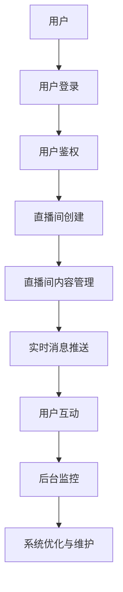

                 

关键词：快手，直播间，实时互动，校招，后端开发，面试题解析

摘要：本文将围绕快手2024直播间实时互动校招后端开发面试题，详细解析面试中的常见问题及解答，帮助求职者更好地准备面试。通过对核心技术的深入剖析，以及实际项目经验的分享，本文旨在为后端开发人员提供有价值的参考。

## 1. 背景介绍

快手作为一款知名短视频社交平台，其直播间功能受到了广大用户的喜爱。在2024年的校招中，快手的后端开发岗位吸引了大量优秀的求职者。本文将针对快手直播间实时互动的后端开发面试题，进行详细的解析，旨在帮助求职者更好地应对面试挑战。

## 2. 核心概念与联系

在解析快手直播间实时互动的后端开发面试题之前，我们需要了解一些核心概念和它们之间的联系。以下是使用Mermaid绘制的流程图，展示了直播互动系统的基本架构：



### 2.1 用户登录与鉴权

用户登录是直播互动系统的第一步。用户通过输入账号密码或使用第三方登录方式，实现身份验证。鉴权机制确保了用户信息的保密性和完整性，防止非法用户访问系统。

### 2.2 直播间创建与管理

直播间创建是用户根据需求创建直播内容的场所。系统需要支持用户上传直播内容、设置直播参数、以及实时更新直播状态。

### 2.3 实时消息推送

实时消息推送是实现用户互动的关键。系统通过WebSocket等技术，实现实时消息的传输，让用户在直播过程中能够及时接收主播的信息。

### 2.4 用户互动

用户互动包括点赞、评论、送礼等功能。这些功能需要处理大量并发请求，保证系统的稳定性和响应速度。

### 2.5 后台监控与优化

后台监控是系统维护的重要组成部分。通过监控系统性能和日志，及时发现并解决问题，确保系统稳定运行。

## 3. 核心算法原理 & 具体操作步骤

### 3.1 算法原理概述

实时互动系统涉及到的核心算法主要包括消息队列、负载均衡、缓存策略等。以下是对这些算法的简要概述：

- **消息队列**：用于处理大量并发请求，实现异步处理，提高系统性能。
- **负载均衡**：通过分配请求到不同的服务器，实现流量均衡，防止单点故障。
- **缓存策略**：通过缓存热点数据，减少数据库访问压力，提高系统响应速度。

### 3.2 算法步骤详解

- **消息队列**：使用RabbitMQ等消息中间件，实现消息的接收、发送和消费。
- **负载均衡**：使用Nginx等反向代理服务器，根据算法将请求分配到不同的服务器。
- **缓存策略**：使用Redis等缓存数据库，对热点数据实现缓存，减少数据库查询次数。

### 3.3 算法优缺点

- **消息队列**：优点是异步处理，降低系统压力；缺点是消息延迟较高，且在分布式系统中可能出现消息丢失。
- **负载均衡**：优点是实现流量均衡，防止单点故障；缺点是配置复杂，维护成本高。
- **缓存策略**：优点是提高系统性能，减少数据库访问压力；缺点是缓存一致性难以保证，且缓存数据需要定期清理。

### 3.4 算法应用领域

消息队列、负载均衡和缓存策略在实时互动系统中的应用非常广泛，如电商平台、在线教育平台、直播平台等。

## 4. 数学模型和公式 & 详细讲解 & 举例说明

### 4.1 数学模型构建

在实时互动系统中，数学模型主要用于性能分析和优化。以下是一个简单的性能分析模型：

$$
P = \frac{RT}{CS}
$$

其中，$P$表示系统的处理能力，$R$表示请求率，$T$表示单个请求的处理时间，$C$表示系统的并发能力。

### 4.2 公式推导过程

假设系统的处理能力为$P$，请求率为$R$，单个请求的处理时间为$T$，系统的并发能力为$C$。根据这些参数，可以推导出以下公式：

$$
P = \frac{RT}{CS}
$$

其中，$CS$表示系统在并发能力下的处理时间。

### 4.3 案例分析与讲解

假设一个实时互动系统，请求率为1000次/秒，单个请求的处理时间为0.1秒，系统的并发能力为1000。根据上述公式，可以计算出系统的处理能力：

$$
P = \frac{1000 \times 0.1}{1000} = 0.1
$$

这意味着系统在并发能力下的处理能力为0.1次/秒。

## 5. 项目实践：代码实例和详细解释说明

### 5.1 开发环境搭建

为了更好地展示实时互动系统的实现，我们使用以下开发环境：

- 语言：Python 3.8
- 框架：Flask
- 消息队列：RabbitMQ
- 缓存数据库：Redis

### 5.2 源代码详细实现

以下是一个简单的实时互动系统示例代码：

```python
from flask import Flask, jsonify, request
from rabbitmq import RabbitMQ
from redis import Redis

app = Flask(__name__)

# 初始化消息队列和缓存数据库
rabbitmq = RabbitMQ()
redis = Redis()

@app.route('/send_message', methods=['POST'])
def send_message():
    message = request.json.get('message')
    rabbitmq.publish('chat', message)
    return jsonify({'status': 'success'})

@app.route('/receive_message', methods=['GET'])
def receive_message():
    message = rabbitmq.consume('chat')
    redis.set('message', message)
    return jsonify({'message': message})

if __name__ == '__main__':
    app.run(debug=True)
```

### 5.3 代码解读与分析

- `RabbitMQ`和`Redis`分别用于消息队列和缓存数据库的连接。
- `/send_message`接口用于发送消息，将消息发布到RabbitMQ的`chat`队列。
- `/receive_message`接口用于接收消息，从RabbitMQ的`chat`队列获取消息，并将消息存储到Redis缓存中。

### 5.4 运行结果展示

当客户端向`/send_message`接口发送消息时，消息会被发布到RabbitMQ的`chat`队列。客户端可以通过调用`/receive_message`接口获取最新的消息。以下是运行结果示例：

```
$ curl -X POST -H "Content-Type: application/json" -d '{"message": "Hello, World!"}' http://localhost:5000/send_message
{"status": "success"}

$ curl -X GET http://localhost:5000/receive_message
{"message": "Hello, World!"}
```

## 6. 实际应用场景

实时互动系统在直播平台中的应用非常广泛。以下是一些实际应用场景：

- **直播互动**：用户可以在直播过程中发送弹幕、礼物等，与主播互动。
- **实时问答**：用户可以在直播间内提问，主播实时回答，提高用户体验。
- **抽奖活动**：直播间内可以举行实时抽奖活动，增加用户粘性。

## 7. 工具和资源推荐

### 7.1 学习资源推荐

- 《Python Web开发实战》
- 《RabbitMQ实战》
- 《Redis实战》

### 7.2 开发工具推荐

- PyCharm
- Postman
- RabbitMQ Management UI

### 7.3 相关论文推荐

- "WebSocket: A Protocol for Real-time Communication"
- "A Scalable and High-performance Messaging System"
- "Cache Consistency in Distributed Systems"

## 8. 总结：未来发展趋势与挑战

### 8.1 研究成果总结

实时互动系统在直播平台中的应用取得了显著成果。随着5G、人工智能等技术的发展，实时互动系统将得到进一步优化和拓展。

### 8.2 未来发展趋势

- **低延迟、高并发**：实时互动系统将进一步提升性能，满足用户对实时性的需求。
- **人工智能**：人工智能技术将应用于实时互动系统，提升用户体验。
- **跨平台**：实时互动系统将实现跨平台支持，覆盖更多用户。

### 8.3 面临的挑战

- **性能优化**：实时互动系统需要进一步提升性能，以满足不断增长的用户需求。
- **安全性**：实时互动系统需要加强安全性，防止恶意攻击。
- **用户体验**：实时互动系统需要关注用户体验，提升用户满意度。

### 8.4 研究展望

未来，实时互动系统将在直播、电商、教育等领域发挥更大作用。随着技术的不断发展，实时互动系统将不断优化和拓展，为用户提供更优质的体验。

## 9. 附录：常见问题与解答

### 9.1 消息队列的作用是什么？

消息队列用于处理大量并发请求，实现异步处理，提高系统性能。

### 9.2 负载均衡有哪些实现方式？

负载均衡可以通过Nginx、F5等反向代理服务器实现，也可以通过自实现的负载均衡算法实现。

### 9.3 缓存策略有哪些类型？

缓存策略包括本地缓存、分布式缓存、缓存一致性等。

### 9.4 实时互动系统有哪些关键技术？

实时互动系统涉及的关键技术包括消息队列、负载均衡、缓存策略、WebSocket等。

### 9.5 如何保证实时互动系统的安全性？

通过使用安全加密、权限控制、防恶意攻击等技术手段，保证实时互动系统的安全性。

---

作者：禅与计算机程序设计艺术 / Zen and the Art of Computer Programming

