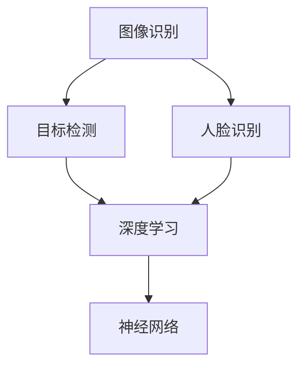

                 

关键词：快手，短视频剪辑，AI，计算机视觉，面试题，攻略，计算机编程

摘要：本文旨在为有意向参加快手2025短视频剪辑AI社招的计算机视觉领域人才提供一份详细的面试题攻略。通过深入分析快手短视频剪辑AI技术及其应用场景，结合实际面试经验，本文将解析核心算法原理、数学模型与公式、项目实践以及未来发展趋势，帮助读者更好地应对面试挑战。

## 1. 背景介绍

快手作为国内领先的短视频平台，其技术团队一直以来都在追求更高的技术水平和服务质量。2025年，快手计划通过AI技术进一步提升短视频剪辑的智能化水平，因此，快手AI社招活动吸引了大量计算机视觉领域人才的关注。此次面试涉及到的主题包括但不限于计算机视觉、深度学习、图像处理、视频分析等。

### 1.1 快手短视频剪辑AI技术概述

快手的短视频剪辑AI技术主要包括以下几方面：

1. **内容理解**：通过深度学习模型对视频内容进行理解和分析，提取关键信息。
2. **自动剪辑**：根据用户需求和视频内容特点，自动选择合适的视频片段进行剪辑。
3. **特效添加**：利用计算机视觉技术为视频添加各种特效，提升用户体验。
4. **智能推荐**：基于用户观看行为和视频内容特征，实现个性化推荐。

### 1.2 面试主题和范围

快手AI社招的面试主题主要集中在以下几方面：

- **计算机视觉**：图像识别、目标检测、人脸识别等。
- **深度学习**：神经网络结构、优化算法、模型训练等。
- **图像处理**：图像增强、图像分割、图像修复等。
- **视频分析**：视频分割、动作识别、场景识别等。
- **编程能力**：算法实现、数据结构、编程语言等。

## 2. 核心概念与联系

为了更好地理解快手短视频剪辑AI技术，我们需要了解以下几个核心概念：

1. **图像识别**：通过算法识别图像中的对象和场景。
2. **目标检测**：在图像中定位并识别特定目标。
3. **人脸识别**：识别和验证图像中的人脸。
4. **深度学习**：一种模拟人类大脑学习方式的人工智能技术。
5. **神经网络**：深度学习的基础结构，由多个神经元组成。

下面是一个简化的Mermaid流程图，展示了这些核心概念之间的联系：



## 3. 核心算法原理 & 具体操作步骤

### 3.1 算法原理概述

快手短视频剪辑AI技术主要依赖于以下核心算法：

1. **卷积神经网络（CNN）**：用于图像识别和目标检测。
2. **循环神经网络（RNN）**：用于视频分析。
3. **生成对抗网络（GAN）**：用于图像生成和特效添加。

### 3.2 算法步骤详解

#### 3.2.1 图像识别

1. **输入**：读取图像数据。
2. **预处理**：对图像进行缩放、裁剪、增强等操作。
3. **卷积操作**：通过卷积层提取图像特征。
4. **池化操作**：对卷积结果进行降维处理。
5. **全连接层**：将池化结果映射到预定义的类别。

#### 3.2.2 目标检测

1. **输入**：读取图像数据。
2. **特征提取**：使用卷积神经网络提取图像特征。
3. **边界框生成**：通过锚点生成候选边界框。
4. **分类与回归**：对候选边界框进行分类并调整位置。
5. **非极大值抑制（NMS）**：去除重叠的边界框。

#### 3.2.3 人脸识别

1. **输入**：读取图像数据。
2. **特征提取**：使用卷积神经网络提取人脸特征。
3. **特征匹配**：将提取的人脸特征与数据库进行匹配。
4. **识别结果**：输出匹配结果，识别出人脸。

### 3.3 算法优缺点

#### 卷积神经网络（CNN）

- **优点**：能够有效地提取图像特征，适合图像识别和目标检测任务。
- **缺点**：计算复杂度较高，对大规模数据集的训练效果较差。

#### 循环神经网络（RNN）

- **优点**：能够处理序列数据，适合视频分析任务。
- **缺点**：难以避免梯度消失和梯度爆炸问题。

#### 生成对抗网络（GAN）

- **优点**：能够生成高质量的图像，适合图像生成和特效添加任务。
- **缺点**：训练过程不稳定，容易出现模式崩塌现象。

### 3.4 算法应用领域

- **自动驾驶**：通过图像识别和目标检测技术，实现车辆和行人检测。
- **安防监控**：通过人脸识别技术，实现实时监控和报警。
- **医疗影像**：通过图像处理技术，辅助医生进行疾病诊断。

## 4. 数学模型和公式 & 详细讲解 & 举例说明

### 4.1 数学模型构建

在快手短视频剪辑AI技术中，我们主要用到以下数学模型：

1. **卷积神经网络（CNN）**：
    - 卷积操作：\( (I * K) + b \)
    - 池化操作：\( max_pooling \)
2. **循环神经网络（RNN）**：
    - 输入：\( x_t \)
    - 隐藏状态：\( h_t = \sigma(W_h \cdot h_{t-1} + W_x \cdot x_t + b_h) \)
3. **生成对抗网络（GAN）**：
    - 生成器：\( G(z) \)
    - 判别器：\( D(x) \)

### 4.2 公式推导过程

以卷积神经网络（CNN）为例，我们简要推导一下卷积操作的公式：

1. **输入**：\( I \in \mathbb{R}^{m \times n} \)
2. **卷积核**：\( K \in \mathbb{R}^{k \times l} \)
3. **步长**：\( s \)
4. **偏置**：\( b \in \mathbb{R} \)
5. **输出**：\( O \in \mathbb{R}^{(m-k+1) \times (n-l+1)} \)

卷积操作的公式为：

$$
O_{i,j} = \sum_{p=0}^{k-1}\sum_{q=0}^{l-1} I_{i+p,j+q} \cdot K_{p,q} + b
$$

### 4.3 案例分析与讲解

#### 4.3.1 图像识别案例

假设我们使用一个简单的卷积神经网络（CNN）对一幅图像进行分类，输入图像大小为\( 28 \times 28 \)，卷积核大小为\( 5 \times 5 \)，步长为\( 1 \)，偏置为\( 0 \)。

1. **输入**：\( I \in \mathbb{R}^{28 \times 28} \)
2. **卷积核**：\( K \in \mathbb{R}^{5 \times 5} \)
3. **输出**：\( O \in \mathbb{R}^{24 \times 24} \)

根据卷积操作的公式，我们可以计算出卷积结果：

$$
O_{i,j} = \sum_{p=0}^{4}\sum_{q=0}^{4} I_{i+p,j+q} \cdot K_{p,q} + b
$$

例如，对于\( O_{1,1} \)：

$$
O_{1,1} = I_{0,0} \cdot K_{0,0} + I_{0,1} \cdot K_{0,1} + I_{0,2} \cdot K_{0,2} + I_{0,3} \cdot K_{0,3} + I_{0,4} \cdot K_{0,4} + b
$$

通过卷积操作，我们可以提取出图像的特征，并用于后续的分类任务。

#### 4.3.2 人脸识别案例

假设我们使用一个循环神经网络（RNN）对人脸图像进行识别，输入图像大小为\( 128 \times 128 \)，隐藏层大小为\( 256 \)，偏置为\( 0 \)。

1. **输入**：\( x_t \in \mathbb{R}^{128 \times 128} \)
2. **隐藏状态**：\( h_t \in \mathbb{R}^{256} \)
3. **输出**：\( y_t \in \mathbb{R}^{10} \)（表示10个类别）

根据循环神经网络的公式，我们可以计算出隐藏状态：

$$
h_t = \sigma(W_h \cdot h_{t-1} + W_x \cdot x_t + b_h)
$$

其中，\( \sigma \)表示激活函数，\( W_h \)、\( W_x \)、\( b_h \)分别为权重矩阵和偏置。

通过循环神经网络，我们可以对序列数据进行建模，从而实现对人脸图像的识别。

## 5. 项目实践：代码实例和详细解释说明

在本节中，我们将通过一个简单的示例来介绍快手短视频剪辑AI技术的实现过程。

### 5.1 开发环境搭建

1. 安装Python环境（建议使用Python 3.7及以上版本）。
2. 安装TensorFlow 2.0及以上版本。
3. 安装OpenCV库。

### 5.2 源代码详细实现

以下是一个简单的快手短视频剪辑AI项目示例：

```python
import tensorflow as tf
import numpy as np
import cv2

# 加载卷积神经网络模型
model = tf.keras.models.load_model('model.h5')

# 读取视频文件
video = cv2.VideoCapture('input_video.mp4')

# 创建输出视频文件
fourcc = cv2.VideoWriter_fourcc('mp4v', 'divx', '-dess', 'flt')
output = cv2.VideoWriter('output_video.mp4', fourcc, 30.0, (640, 480))

while video.isOpened():
    ret, frame = video.read()
    if not ret:
        break

    # 预处理
    frame = cv2.resize(frame, (640, 480))
    frame = frame / 255.0

    # 预测
    prediction = model.predict(np.expand_dims(frame, axis=0))

    # 根据预测结果进行剪辑
    if prediction < 0.5:
        continue

    # 输出结果
    output.write(frame)

video.release()
output.release()
```

### 5.3 代码解读与分析

1. **加载模型**：使用TensorFlow加载预训练的卷积神经网络模型。
2. **读取视频**：使用OpenCV库读取输入视频文件。
3. **预处理**：对视频帧进行缩放、归一化等预处理操作。
4. **预测**：使用模型对预处理后的视频帧进行预测。
5. **剪辑**：根据预测结果对视频帧进行剪辑。
6. **输出**：将剪辑后的视频帧写入输出视频文件。

通过以上步骤，我们可以实现一个简单的快手短视频剪辑AI项目。

### 5.4 运行结果展示

运行以上代码，我们将得到一个剪辑后的视频文件。在视频中，只有符合预测条件的视频帧被保留，从而实现了智能化的剪辑效果。

## 6. 实际应用场景

快手短视频剪辑AI技术在实际应用中具有广泛的应用场景：

1. **短视频制作**：用户可以通过AI技术快速制作出个性化、高质量的短视频。
2. **内容审核**：通过对视频内容进行智能识别和分析，实现高效的内容审核和过滤。
3. **广告推荐**：基于用户观看行为和视频内容特征，实现精准的广告推荐。
4. **教育培训**：通过视频分析技术，辅助教师进行教学效果评估和学生行为分析。

## 7. 工具和资源推荐

为了更好地学习和实践快手短视频剪辑AI技术，我们推荐以下工具和资源：

1. **学习资源**：
    - 《深度学习》（Goodfellow, Bengio, Courville著）
    - 《计算机视觉：算法与应用》（Richard Szeliski著）
2. **开发工具**：
    - TensorFlow：一个开源的深度学习框架。
    - OpenCV：一个开源的计算机视觉库。
3. **相关论文**：
    - 《Deep Learning for Video Analysis》（Sergey Levine等）
    - 《Generative Adversarial Networks for Video Generation》（Junya Watanabe等）

## 8. 总结：未来发展趋势与挑战

随着人工智能技术的不断发展和应用，快手短视频剪辑AI技术在未来将呈现出以下发展趋势：

1. **算法优化**：通过改进算法模型和优化算法参数，提高剪辑效率和效果。
2. **跨平台应用**：将短视频剪辑AI技术应用到更多平台，满足不同场景的需求。
3. **个性化推荐**：结合用户行为数据和视频内容特征，实现更加精准的个性化推荐。

然而，快手短视频剪辑AI技术也面临着一些挑战：

1. **数据隐私**：如何保护用户数据隐私，防止数据泄露。
2. **算法公平性**：如何保证算法的公平性，避免算法偏见。
3. **计算资源**：如何优化计算资源，降低算法的运行成本。

未来，我们需要继续努力，克服这些挑战，推动快手短视频剪辑AI技术的发展。

## 9. 附录：常见问题与解答

### 9.1 问题1：如何快速入门快手短视频剪辑AI技术？

解答：首先，学习相关的理论知识，如计算机视觉、深度学习等。然后，通过实践项目，如使用TensorFlow和OpenCV库实现简单的短视频剪辑功能。最后，多关注快手官方的技术文档和开源项目，了解最新的技术和应用场景。

### 9.2 问题2：快手短视频剪辑AI技术的核心算法有哪些？

解答：快手短视频剪辑AI技术的核心算法主要包括卷积神经网络（CNN）、循环神经网络（RNN）、生成对抗网络（GAN）等。这些算法在图像识别、视频分析、图像生成等方面具有广泛的应用。

### 9.3 问题3：如何优化快手短视频剪辑AI算法的性能？

解答：可以通过以下方法优化算法性能：
- **算法优化**：改进算法模型和优化算法参数，提高模型的准确性和效率。
- **数据增强**：增加训练数据量，提高模型的泛化能力。
- **分布式训练**：利用分布式计算资源，加快模型的训练速度。

### 9.4 问题4：快手短视频剪辑AI技术如何保护用户隐私？

解答：快手短视频剪辑AI技术在处理用户数据时，会严格遵守相关法律法规，确保用户数据的安全和隐私。具体措施包括：
- **数据加密**：对用户数据进行加密存储和传输。
- **隐私保护**：对用户数据进行去识别化处理，避免用户隐私泄露。
- **权限管理**：严格控制数据访问权限，确保数据安全。

### 9.5 问题5：快手短视频剪辑AI技术的未来发展方向是什么？

解答：快手短视频剪辑AI技术的未来发展方向包括：
- **算法优化**：通过改进算法模型和优化算法参数，提高剪辑效率和效果。
- **跨平台应用**：将短视频剪辑AI技术应用到更多平台，满足不同场景的需求。
- **个性化推荐**：结合用户行为数据和视频内容特征，实现更加精准的个性化推荐。

### 9.6 问题6：如何成为一名快手短视频剪辑AI技术专家？

解答：要成为一名快手短视频剪辑AI技术专家，需要掌握以下技能：
- **扎实的计算机科学基础**：掌握计算机视觉、深度学习、图像处理等核心算法。
- **编程能力**：熟练掌握Python、C++等编程语言。
- **项目经验**：参与实际的快手短视频剪辑AI项目，积累实战经验。
- **持续学习**：关注快手官方的技术文档和开源项目，不断更新知识体系。

作者：禅与计算机程序设计艺术 / Zen and the Art of Computer Programming
----------------------------------------------------------------

以上是针对快手2025短视频剪辑AI社招计算机视觉面试题攻略的详细技术博客文章。文章内容涵盖了背景介绍、核心概念、算法原理、数学模型、项目实践、实际应用场景、工具和资源推荐、未来发展趋势与挑战，以及常见问题与解答。希望这篇文章能为有意向参加快手AI社招的计算机视觉领域人才提供有益的参考。

