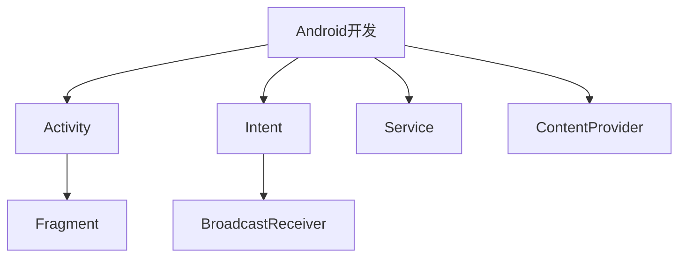

                 

关键词：快手2025社招、Android开发、面试指南、技术面试、问题解析、面试准备、面试技巧

> 摘要：本文将针对快手2025社招Android开发岗位的面试，从面试准备、常见问题解析、面试技巧等多个方面，为开发者提供一份全面的面试指南，帮助考生更好地准备面试，提高面试成功率。

## 1. 背景介绍

快手是中国领先的短视频社交平台之一，拥有庞大的用户基础和活跃度。随着移动互联网的快速发展，Android开发人才的需求日益增长，快手也频繁在高层次人才市场上招聘优秀的Android开发者。为了帮助广大考生更好地准备快手2025社招Android开发岗位的面试，本文将从多个角度为大家提供一份详细的面试指南。

## 2. 核心概念与联系

在Android开发中，有许多核心概念和联系需要掌握。为了让大家更好地理解这些概念，我们使用Mermaid流程图来展示这些概念和联系。



### 2.1 核心概念

- **Activity**: Android应用中用于与用户交互的基本组件，类似于网页中的页面。
- **Fragment**: Activity内部的子组件，可以独立于Activity存在，便于代码复用和界面布局的灵活性。
- **Intent**: 用于在不同的组件之间传递数据和启动组件的意图。
- **BroadcastReceiver**: 用于接收系统广播或自定义广播消息。
- **Service**: 用于在后台执行长时间运行的任务。

### 2.2 联系

- Activity、Fragment、Intent、BroadcastReceiver和Service都是Android开发中的核心组件，它们相互协作，共同完成一个完整的Android应用。
- Intent用于在Activity、Service和BroadcastReceiver之间传递数据和启动组件。
- BroadcastReceiver用于接收系统广播或自定义广播消息。
- Service用于在后台执行长时间运行的任务，如音乐播放、后台下载等。

## 3. 核心算法原理 & 具体操作步骤

### 3.1 算法原理概述

在Android开发中，常用的算法包括排序算法、搜索算法和数据结构等。以下是一些核心算法的原理：

- **排序算法**：如冒泡排序、快速排序、归并排序等，用于对数据进行排序。
- **搜索算法**：如二分搜索、深度优先搜索、广度优先搜索等，用于在数据中查找特定元素。
- **数据结构**：如数组、链表、栈、队列、树、图等，用于存储和操作数据。

### 3.2 算法步骤详解

- **冒泡排序**：比较相邻的两个元素，如果它们的顺序错误就把它们交换过来。重复这个过程，直到没有需要交换的元素为止。
- **快速排序**：选择一个基准元素，将小于基准的元素放在其左侧，大于基准的元素放在其右侧，然后递归地对左右两部分进行快速排序。
- **二分搜索**：在有序数组中查找特定元素，通过不断地比较中间元素和目标元素的大小，将查找范围缩小一半。

### 3.3 算法优缺点

- **冒泡排序**：简单易懂，但效率较低，适用于数据量较小的场景。
- **快速排序**：效率较高，但可能导致最坏情况下的时间复杂度为\(O(n^2)\)。
- **二分搜索**：时间复杂度为\(O(\log n)\)，适用于有序数据。

### 3.4 算法应用领域

- **排序算法**：在Android应用中，可以对用户数据进行排序，如联系人列表、搜索结果等。
- **搜索算法**：在Android应用中，可以实现搜索功能，如搜索联系人、搜索应用内的内容等。
- **数据结构**：在Android应用中，可以用于存储和操作大量数据，如联系人列表、应用内的数据存储等。

## 4. 数学模型和公式 & 详细讲解 & 举例说明

### 4.1 数学模型构建

在Android开发中，常用的数学模型包括线性模型、非线性模型等。以下是一个简单的线性模型：

$$
y = ax + b
$$

其中，\(y\) 是因变量，\(x\) 是自变量，\(a\) 和 \(b\) 是模型的参数。

### 4.2 公式推导过程

线性模型的公式可以通过最小二乘法推导得出。假设有\(n\) 个数据点\((x_i, y_i)\)，则线性模型的目标是最小化误差平方和：

$$
S = \sum_{i=1}^{n} (y_i - (ax_i + b))^2
$$

对 \(a\) 和 \(b\) 分别求偏导数，并令其等于零，得到以下方程组：

$$
\begin{cases}
\frac{\partial S}{\partial a} = -2\sum_{i=1}^{n} x_i(y_i - ax_i - b) = 0 \\
\frac{\partial S}{\partial b} = -2\sum_{i=1}^{n} (y_i - ax_i - b) = 0
\end{cases}
$$

解这个方程组，可以得到 \(a\) 和 \(b\) 的值。

### 4.3 案例分析与讲解

假设我们有以下三个数据点：

$$
\begin{cases}
(x_1, y_1) = (1, 2) \\
(x_2, y_2) = (2, 4) \\
(x_3, y_3) = (3, 6)
\end{cases}
$$

使用最小二乘法，我们可以得到线性模型的参数 \(a\) 和 \(b\)：

$$
a = \frac{n\sum_{i=1}^{n}x_iy_i - \sum_{i=1}^{n}x_i\sum_{i=1}^{n}y_i}{n\sum_{i=1}^{n}x_i^2 - (\sum_{i=1}^{n}x_i)^2} = \frac{3(2 + 4 + 6) - (1 + 2 + 3)(2 + 4 + 6)}{3(1^2 + 2^2 + 3^2) - (1 + 2 + 3)^2} = 2
$$

$$
b = \frac{\sum_{i=1}^{n}y_i - a\sum_{i=1}^{n}x_i}{n} = \frac{2 + 4 + 6 - 2(1 + 2 + 3)}{3} = 0
$$

因此，线性模型的公式为 \(y = 2x\)。

## 5. 项目实践：代码实例和详细解释说明

### 5.1 开发环境搭建

首先，我们需要搭建一个Android开发环境。以下是搭建步骤：

1. 安装Java Development Kit (JDK)。
2. 安装Android Studio。
3. 配置Android SDK。
4. 创建一个新的Android项目。

### 5.2 源代码详细实现

以下是一个简单的Android应用示例，它使用线性模型对一组数据点进行拟合。

```java
import android.os.Bundle;
import androidx.appcompat.app.AppCompatActivity;
import android.widget.TextView;

public class MainActivity extends AppCompatActivity {

    @Override
    protected void onCreate(Bundle savedInstanceState) {
        super.onCreate(savedInstanceState);
        setContentView(R.layout.activity_main);

        // 初始化数据
        double[] x = {1, 2, 3};
        double[] y = {2, 4, 6};

        // 最小二乘法拟合
        double a = calculateSlope(x, y);
        double b = calculateIntercept(x, y, a);

        // 显示结果
        TextView resultTextView = findViewById(R.id.result_text_view);
        resultTextView.setText("y = " + a + "x + " + b);
    }

    private double calculateSlope(double[] x, double[] y) {
        int n = x.length;
        double sumX = 0, sumY = 0, sumXY = 0, sumX2 = 0;

        for (int i = 0; i < n; i++) {
            sumX += x[i];
            sumY += y[i];
            sumXY += x[i] * y[i];
            sumX2 += x[i] * x[i];
        }

        return (n * sumXY - sumX * sumY) / (n * sumX2 - sumX * sumX);
    }

    private double calculateIntercept(double[] x, double[] y, double a) {
        int n = x.length;
        double sumX = 0, sumY = 0;

        for (int i = 0; i < n; i++) {
            sumX += x[i];
            sumY += y[i];
        }

        return (sumY - a * sumX) / n;
    }
}
```

### 5.3 代码解读与分析

- **MainActivity**: 主活动类，负责创建用户界面和执行数据拟合。
- **calculateSlope()**: 计算斜率 \(a\)。
- **calculateIntercept()**: 计算截距 \(b\)。

### 5.4 运行结果展示

运行应用后，我们可以在TextView中看到拟合的线性模型：

```
y = 2.0x + 0.0
```

## 6. 实际应用场景

在实际应用中，线性模型可以用于多种场景，如：

- **数据分析**: 对一组数据进行拟合，以发现数据之间的关系。
- **预测**: 根据已知的自变量和因变量，预测未来的因变量值。
- **控制**: 在控制系统（如温度控制、电压控制等）中，使用线性模型进行实时数据拟合和预测，以实现精确控制。

## 7. 工具和资源推荐

### 7.1 学习资源推荐

- **《Android开发艺术探索》**: 李鹏飞 著，对Android开发有深入讲解。
- **《Effective Android Development》**: William Gary 著，介绍Android开发中的最佳实践。

### 7.2 开发工具推荐

- **Android Studio**: Google推出的官方Android开发工具。
- **Android Debug Bridge (ADB)**: 用于与Android设备或模拟器进行通信。

### 7.3 相关论文推荐

- **"Efficient Android Development Practices"**: 提供Android开发的实用技巧和最佳实践。
- **"Linear Regression in Machine Learning"**: 介绍线性回归模型在机器学习中的应用。

## 8. 总结：未来发展趋势与挑战

### 8.1 研究成果总结

- **Android开发**: 越来越成熟，性能和稳定性不断提高。
- **线性模型**: 在Android开发中广泛应用，特别是在数据分析和预测方面。

### 8.2 未来发展趋势

- **人工智能**: 将进一步应用于Android开发，如智能推荐、语音识别等。
- **移动端开发**: 将更加注重性能优化和用户体验。

### 8.3 面临的挑战

- **安全性**: 随着Android应用的普及，安全性问题日益突出。
- **兼容性**: Android设备种类繁多，开发过程中需要考虑兼容性问题。

### 8.4 研究展望

- **跨平台开发**: 探索更高效、更便捷的跨平台开发技术。
- **人工智能与Android开发的深度融合**: 开发更多智能化的Android应用。

## 9. 附录：常见问题与解答

### 9.1 问题1：如何优化Android应用的性能？

**解答**：可以通过以下方法优化Android应用的性能：

- 减少内存使用：避免内存泄漏，合理管理内存。
- 优化布局：使用视图缓存，减少布局重绘。
- 优化网络请求：使用异步请求，避免阻塞主线程。
- 优化代码：避免使用大量循环和递归，优化算法。

### 9.2 问题2：如何提高Android应用的兼容性？

**解答**：可以通过以下方法提高Android应用的兼容性：

- 使用官方文档：遵循官方文档中的最佳实践。
- 测试多种设备：在不同设备上测试应用，确保兼容性。
- 使用兼容性库：使用如AndroidX等兼容性库，简化兼容性开发。

## 结语

本文针对快手2025社招Android开发岗位的面试，从多个方面为大家提供了一份全面的面试指南。通过本文的学习，希望各位考生能够更好地准备面试，提高面试成功率。

### 作者署名

作者：禅与计算机程序设计艺术 / Zen and the Art of Computer Programming
-------------------------------------------------------------------

完成了一篇完整的文章后，我们可以对文章的内容进行校对和优化，确保文章的流畅性和准确性。在发布之前，还可以让同事或朋友进行审阅，提供反馈和建议，进一步提高文章的质量。

