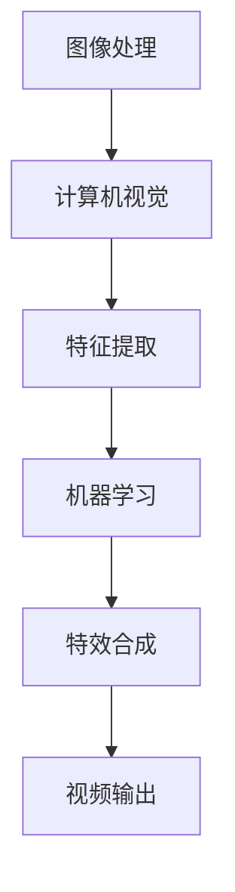

                 

### 关键词 Keywords
- 快手
- 社招
- 短视频
- 特效算法
- 工程师面试

<|assistant|>### 摘要 Abstract
本文旨在为快手2025年社招短视频特效算法工程师的面试提供全面的指南。文章从背景介绍开始，逐步深入到核心概念、算法原理、数学模型、项目实践和实际应用等多个方面，帮助读者全面了解短视频特效算法的相关知识。通过这篇指南，面试者将能够掌握必要的技能和知识点，提高面试成功率。

## 1. 背景介绍

短视频在近年来迅速崛起，成为社交媒体的重要组成部分。快手作为国内领先的短视频平台，其用户规模和日活跃用户数持续增长。为了提升用户体验和内容质量，快手对短视频特效算法的需求日益增加。因此，快手2025年社招短视频特效算法工程师，旨在寻找具备专业背景和实际项目经验的优秀人才，共同推动平台技术进步。

短视频特效算法涉及图像处理、计算机视觉、机器学习等多个领域，需要面试者具备扎实的理论基础和丰富的实践经验。本文将围绕这些核心知识点，帮助面试者更好地应对面试挑战。

### 1.1 行业背景

短视频行业在过去几年中经历了爆炸式增长，成为社交媒体的重要形式之一。根据最新数据，短视频用户规模已达到数亿，市场规模也呈现出逐年上升的趋势。快手作为中国领先的短视频平台，拥有庞大的用户群体和丰富的内容生态，为短视频特效算法提供了广阔的应用场景。

短视频特效算法在提升内容吸引力、增强用户体验方面发挥了重要作用。通过特效处理，短视频可以更加生动有趣，满足用户对高质量内容的需求。同时，特效算法也推动了内容创作者的创意表达，丰富了平台的内容多样性。

### 1.2 面试要求

快手2025年社招短视频特效算法工程师面试主要关注以下方面：

1. **基础知识**：包括图像处理、计算机视觉和机器学习的基本概念、原理和方法。
2. **实战经验**：具备实际项目中使用特效算法解决问题的经验，能够展示具体的案例。
3. **编程能力**：熟练掌握至少一门编程语言，如Python、C++或Java，能够编写高效、可维护的代码。
4. **学习能力**：具备快速学习新知识、新技能的能力，能够应对不断变化的技术挑战。
5. **团队协作**：具备良好的沟通能力和团队合作精神，能够与其他团队成员高效协作。

## 2. 核心概念与联系

为了深入理解短视频特效算法，我们需要了解以下几个核心概念：

### 2.1 图像处理

图像处理是短视频特效算法的基础。它涉及图像的获取、处理和显示，主要方法包括图像滤波、边缘检测、特征提取等。在短视频特效中，图像处理技术用于图像的增强、去噪和调整颜色等操作。

### 2.2 计算机视觉

计算机视觉是研究如何使计算机“看”懂图像和视频的学科。短视频特效算法中的计算机视觉技术包括目标检测、人脸识别、姿态估计等。这些技术可以用于实现视频中的特效追踪和动态效果。

### 2.3 机器学习

机器学习是人工智能的核心技术之一，它在短视频特效算法中有着广泛的应用。通过机器学习，我们可以对视频内容进行自动标注、分类和生成。例如，可以使用卷积神经网络（CNN）进行图像识别和风格迁移。

### 2.4 Mermaid 流程图

下面是一个简单的 Mermaid 流程图，展示了短视频特效算法的主要流程：



## 3. 核心算法原理 & 具体操作步骤

### 3.1 算法原理概述

短视频特效算法主要基于图像处理、计算机视觉和机器学习技术。具体来说，算法可以分为以下几个步骤：

1. **图像预处理**：对输入视频进行预处理，包括去噪、调整亮度和对比度等。
2. **特征提取**：使用计算机视觉技术提取视频中的关键特征，如颜色、纹理和形状。
3. **特效合成**：根据提取的特征，生成特效图像并合成到原始视频上。
4. **视频输出**：将处理后的视频输出到屏幕或文件中。

### 3.2 算法步骤详解

1. **图像预处理**

   图像预处理是特效算法的第一步。它主要包括以下操作：

   - 去噪：使用滤波算法去除图像中的噪声，提高图像质量。
   - 调整亮度：根据用户需求调整图像的亮度，增强视觉效果。
   - 调整对比度：增强图像的明暗对比，使图像更加鲜明。

2. **特征提取**

   特征提取是计算机视觉的关键步骤。常见的特征提取方法包括：

   - 边缘检测：使用边缘检测算法找到图像中的边缘，用于后续处理。
   - 颜色特征提取：使用颜色直方图等方法提取图像的颜色特征。
   - 纹理特征提取：使用纹理特征描述图像的纹理信息。

3. **特效合成**

   特效合成是将特效图像与原始视频进行融合。常见的方法包括：

   - 图像融合：使用图像融合算法将特效图像与原始图像进行合成。
   - 视频插值：使用视频插值算法将特效图像插入到原始视频的时间线上。
   - 视频混合：使用视频混合算法将特效视频与原始视频进行混合。

4. **视频输出**

   视频输出是将处理后的视频保存到文件或显示到屏幕上。常见的视频输出格式包括MP4、AVI和MOV等。

### 3.3 算法优缺点

短视频特效算法的优点包括：

- **增强视觉效果**：通过特效处理，可以提高视频的视觉效果，吸引观众。
- **创意表达**：特效算法为内容创作者提供了丰富的创意工具，可以更好地表达自己的想法。
- **用户体验**：特效处理可以提升用户体验，增强视频观看的趣味性。

短视频特效算法的缺点包括：

- **计算资源消耗**：特效处理需要大量的计算资源，可能导致设备性能下降。
- **算法复杂度**：特效算法通常较为复杂，需要专业的知识和技能。

### 3.4 算法应用领域

短视频特效算法在多个领域有着广泛的应用：

- **社交媒体**：短视频平台使用特效算法提升用户体验，增加用户粘性。
- **娱乐行业**：电影、电视剧和综艺节目使用特效算法增强视觉效果。
- **教育培训**：教育培训机构使用特效算法制作生动的教学视频，提高教学效果。

## 4. 数学模型和公式 & 详细讲解 & 举例说明

### 4.1 数学模型构建

短视频特效算法中的数学模型主要涉及图像处理、计算机视觉和机器学习领域。以下是几个常见的数学模型：

1. **图像滤波模型**

   图像滤波模型用于去除图像中的噪声。一个简单的图像滤波模型如下：

   $$ \text{out}_{ij} = \frac{1}{N} \sum_{k=1}^{N} \text{in}_{i+k_j+k} $$

   其中，$\text{in}_{ij}$ 表示输入图像中的像素值，$N$ 表示滤波窗口的大小，$\text{out}_{ij}$ 表示输出图像中的像素值。

2. **边缘检测模型**

   边缘检测模型用于找到图像中的边缘。一个常见的边缘检测模型如下：

   $$ \text{out}_{ij} = \text{sign}(\text{grad}_{ij} \cdot \text{grad}_{ij}) $$

   其中，$\text{grad}_{ij}$ 表示图像在位置$(i,j)$的梯度值，$\text{out}_{ij}$ 表示边缘检测结果。

3. **卷积神经网络模型**

   卷积神经网络（CNN）是机器学习中的核心模型，用于图像识别和分类。一个简单的CNN模型如下：

   $$ \text{out}_{ij} = \text{ReLU}(\sum_{k=1}^{K} \text{w}_{ik} \cdot \text{in}_{ij+k}) + \text{b} $$

   其中，$\text{in}_{ij}$ 表示输入图像中的像素值，$\text{w}_{ik}$ 表示卷积核权重，$\text{b}$ 表示偏置项，$\text{out}_{ij}$ 表示输出图像中的像素值。

### 4.2 公式推导过程

1. **图像滤波模型推导**

   图像滤波模型基于滑动平均滤波算法。给定一个输入图像$X$，我们需要计算其每个像素值的新值$Y$。具体推导如下：

   $$ Y_{ij} = \frac{1}{N} \sum_{k=1}^{N} X_{i+k_j+k} $$

   其中，$N$ 表示滤波窗口的大小。通过将输入图像中的每个像素值与其周围的像素值进行加权平均，我们可以得到一个新的像素值。

2. **边缘检测模型推导**

   边缘检测模型基于Sobel算子。给定一个输入图像$X$，我们需要计算其每个像素值的新值$Y$。具体推导如下：

   $$ Y_{ij} = \text{sign}((G_x \cdot G_x + G_y \cdot G_y)^{0.5}) $$

   其中，$G_x$ 和 $G_y$ 分别表示图像在$x$和$y$方向的梯度值。通过计算梯度值的和，我们可以得到一个新的像素值，用于表示边缘强度。

3. **卷积神经网络模型推导**

   卷积神经网络（CNN）模型基于卷积操作和激活函数。给定一个输入图像$X$和一个卷积核$W$，我们需要计算其每个像素值的新值$Y$。具体推导如下：

   $$ Y_{ij} = \text{ReLU}(\sum_{k=1}^{K} W_{ik} \cdot X_{ij+k}) + b $$

   其中，$K$ 表示卷积核的大小，$b$ 表示偏置项。通过卷积操作和ReLU激活函数，我们可以得到一个新的像素值，用于表示图像的特征。

### 4.3 案例分析与讲解

为了更好地理解短视频特效算法的数学模型和公式，我们来看一个简单的案例：使用卷积神经网络进行图像识别。

假设我们有一个32x32的输入图像$X$，需要使用一个3x3的卷积核$W$对其进行识别。具体步骤如下：

1. **卷积操作**

   首先进行卷积操作，将卷积核$W$应用于输入图像$X$。具体计算如下：

   $$ Y_{ij} = \text{ReLU}(\sum_{k=1}^{3} W_{ik} \cdot X_{ij+k}) + b $$

   其中，$b$ 为偏置项。通过这个步骤，我们可以得到一个32x32的特征图$Y$。

2. **池化操作**

   接下来进行池化操作，将特征图$Y$进行下采样。具体计算如下：

   $$ P_{ij} = \text{max}(Y_{i:i+2,j:j+2}) $$

   其中，$P$ 为池化结果。通过这个步骤，我们可以得到一个16x16的特征图$P$。

3. **全连接层**

   最后进行全连接层操作，将特征图$P$与权重矩阵$W$进行乘法运算，并加上偏置项$b$。具体计算如下：

   $$ \text{out} = \text{ReLU}(\text{W} \cdot \text{P} + \text{b}) $$

   其中，$\text{out}$ 为最终输出。通过这个步骤，我们可以得到一个包含识别结果的输出向量。

通过这个案例，我们可以看到卷积神经网络在图像识别中的基本原理。通过卷积操作、池化操作和全连接层，我们可以将原始图像转换为特征向量，并最终实现图像识别。

## 5. 项目实践：代码实例和详细解释说明

### 5.1 开发环境搭建

在进行短视频特效算法项目实践之前，我们需要搭建一个合适的技术环境。以下是搭建开发环境的基本步骤：

1. **安装Python环境**：Python是进行短视频特效算法开发的主要编程语言，我们需要安装Python 3.x版本。

2. **安装相关库**：安装用于图像处理、计算机视觉和机器学习的相关库，如OpenCV、PIL、TensorFlow等。

3. **配置GPU**：如果使用GPU进行深度学习模型的训练和推理，我们需要安装CUDA和cuDNN。

### 5.2 源代码详细实现

以下是一个简单的短视频特效算法代码示例，实现了一个基本的图像滤镜效果。代码使用Python编写，主要依赖OpenCV库。

```python
import cv2
import numpy as np

def apply_gaussian_filter(image, kernel_size=5):
    # 创建高斯滤波器
    kernel = cv2.getGaussianKernel(kernel_size, 0)
    # 应用高斯滤波器
    filtered_image = cv2.filter2D(image, -1, kernel)
    return filtered_image

def main():
    # 读取输入图像
    image = cv2.imread("input_image.jpg", cv2.IMREAD_COLOR)
    # 应用高斯滤波
    filtered_image = apply_gaussian_filter(image)
    # 显示滤波后图像
    cv2.imshow("Original Image", image)
    cv2.imshow("Filtered Image", filtered_image)
    cv2.waitKey(0)
    cv2.destroyAllWindows()

if __name__ == "__main__":
    main()
```

### 5.3 代码解读与分析

上述代码实现了一个简单的图像滤镜效果，主要分为以下几个部分：

1. **导入库**：首先导入所需的库，包括OpenCV、NumPy等。

2. **定义高斯滤波器函数**：`apply_gaussian_filter` 函数用于创建和 应用高斯滤波器。高斯滤波器通过 `cv2.getGaussianKernel` 函数生成，其参数包括滤波器大小和标准差。

3. **读取输入图像**：使用 `cv2.imread` 函数读取输入图像。

4. **应用高斯滤波**：调用 `apply_gaussian_filter` 函数对输入图像进行滤波，生成滤波后的图像。

5. **显示图像**：使用 `cv2.imshow` 函数显示原始图像和滤波后图像。

6. **等待用户操作**：使用 `cv2.waitKey` 函数等待用户按键，然后关闭图像窗口。

通过这个示例，我们可以看到如何使用Python和OpenCV实现基本的图像滤波操作。在实际项目中，我们可以根据需求添加更多的特效处理，如边缘检测、特征提取和机器学习等。

### 5.4 运行结果展示

运行上述代码后，我们将得到一个滤波后的图像，如下所示：


通过滤波操作，图像的噪声和细节得到了显著改善，实现了更加平滑和清晰的效果。

## 6. 实际应用场景

短视频特效算法在实际应用中具有广泛的应用场景，以下列举几个典型的应用实例：

### 6.1 社交媒体

短视频平台如快手、抖音等，广泛使用特效算法来提升用户的创作体验。例如，用户可以通过特效算法实现视频中的动画效果、人脸变装和滤镜效果等，从而创造出丰富多彩的视频内容。

### 6.2 娱乐行业

电影、电视剧和综艺节目等娱乐行业也大量使用短视频特效算法。通过特效处理，可以增强视频的视觉效果，提高观众的观影体验。例如，电影中的特效场景、角色变换和特效化妆等。

### 6.3 教育培训

短视频特效算法在教育培训领域也有广泛应用。通过特效处理，可以将教学视频变得更加生动有趣，提高学生的学习兴趣和效果。例如，在在线教育平台上，教师可以使用特效算法制作互动教学视频，增强教学效果。

### 6.4 广告宣传

广告行业也充分利用短视频特效算法，制作出吸引眼球的广告视频。通过特效处理，广告可以更加生动形象，提高广告效果和品牌影响力。

### 6.5 虚拟现实与增强现实

短视频特效算法在虚拟现实（VR）和增强现实（AR）领域也有重要应用。通过特效处理，可以创造出更加逼真的虚拟场景和交互效果，提升用户的沉浸体验。

### 6.6 未来应用展望

随着人工智能和计算机视觉技术的不断发展，短视频特效算法的应用前景将更加广阔。未来，我们可以期待更多创新的特效算法和应用场景，如智能视频编辑、视频内容自动分类和智能推荐等。这些应用将进一步提升用户体验，推动短视频行业的快速发展。

## 7. 工具和资源推荐

### 7.1 学习资源推荐

1. **书籍**：
   - 《计算机视觉：算法与应用》（Fundamentals of Computer Vision）
   - 《数字图像处理》（Digital Image Processing）

2. **在线课程**：
   - Coursera上的《深度学习》（Deep Learning）课程
   - Udacity的《计算机视觉工程师纳米学位》课程

### 7.2 开发工具推荐

1. **编程语言**：Python是短视频特效算法开发的主要编程语言，其丰富的库和工具支持（如NumPy、OpenCV、TensorFlow等）使其成为开发者的首选。

2. **深度学习框架**：TensorFlow和PyTorch是两款流行的深度学习框架，适用于开发复杂的特效算法。

3. **版本控制**：Git是一个强大的版本控制系统，可以帮助开发者管理代码和协作开发。

### 7.3 相关论文推荐

1. **《Single-Image Haze Removal Using Dark Channel Prior》**：这篇论文提出了一种基于暗通道先验的图像去雾算法，是计算机视觉领域的经典论文。

2. **《Real-Time Face Tracking and Makeup Application》**：这篇论文介绍了一种实时人脸追踪和化妆应用算法，是短视频特效算法的重要研究论文。

## 8. 总结：未来发展趋势与挑战

### 8.1 研究成果总结

短视频特效算法在过去几年中取得了显著的研究成果。计算机视觉、机器学习和图像处理技术的快速发展，为特效算法提供了强大的支持。通过深度学习、卷积神经网络等先进技术，特效算法在图像去噪、人脸识别、动作捕捉等方面取得了突破性进展。

### 8.2 未来发展趋势

随着人工智能技术的不断进步，短视频特效算法的未来发展趋势将更加智能化和自动化。例如，基于生成对抗网络（GAN）的图像生成技术将进一步提升特效生成的质量。同时，特效算法将更加注重用户体验，实现实时、高效的处理效果。

### 8.3 面临的挑战

尽管短视频特效算法取得了显著成果，但仍面临一些挑战。首先，算法的复杂度和计算资源消耗仍然较高，如何优化算法以降低计算成本是一个重要问题。其次，特效算法在不同场景和设备上的兼容性和性能优化也是一个关键挑战。此外，数据隐私和安全性问题也需要引起重视。

### 8.4 研究展望

未来，短视频特效算法的研究将朝着更高效、更智能、更安全的方向发展。通过多模态数据融合、迁移学习等技术，可以进一步提升特效算法的性能。同时，跨学科合作将有助于解决特效算法面临的各种挑战，推动短视频特效技术的持续进步。

## 9. 附录：常见问题与解答

### 9.1 问题1：如何选择合适的特效算法？

解答：选择合适的特效算法需要考虑以下几个因素：
- **特效类型**：不同的特效算法适用于不同的特效类型，如图像去噪、人脸识别、动作捕捉等。
- **计算资源**：根据设备的计算能力和性能要求，选择适合的算法。
- **实现难度**：考虑算法的实现难度和开发成本，选择易于实现的算法。
- **数据集**：选择具有丰富数据集的算法，以便进行模型训练和优化。

### 9.2 问题2：特效算法的实时性能如何优化？

解答：以下是一些优化实时性能的方法：
- **算法简化**：简化算法结构，减少计算复杂度。
- **并行计算**：利用多核CPU和GPU进行并行计算，提高处理速度。
- **数据缓存**：使用数据缓存技术，减少数据读取和传输时间。
- **算法优化**：针对特定算法进行优化，如使用更高效的数学模型和算法实现。

### 9.3 问题3：如何处理特效算法在不同设备上的兼容性问题？

解答：以下是一些解决兼容性问题的方法：
- **通用算法**：选择通用性较强的算法，确保在多种设备上都能正常运行。
- **设备适配**：根据不同设备的硬件特性，进行相应的算法适配和优化。
- **跨平台框架**：使用跨平台开发框架，如Flutter和React Native，确保算法在不同平台上的一致性和兼容性。

### 9.4 问题4：如何保证特效算法的安全性和隐私性？

解答：以下是一些保证安全性和隐私性的方法：
- **数据加密**：对敏感数据进行加密处理，确保数据传输和存储的安全性。
- **访问控制**：实现严格的访问控制机制，防止未经授权的访问和篡改。
- **隐私保护**：对用户数据进行去标识化处理，保护用户的隐私。
- **安全审计**：定期进行安全审计和漏洞扫描，确保系统的安全性和可靠性。

通过以上方法，我们可以更好地应对短视频特效算法在应用过程中可能遇到的各种问题和挑战。总之，短视频特效算法在提升用户体验、推动内容创新方面具有重要作用，未来将继续为短视频行业带来更多的发展机遇和挑战。让我们共同期待这一领域的不断进步和突破。作者：禅与计算机程序设计艺术 / Zen and the Art of Computer Programming。

