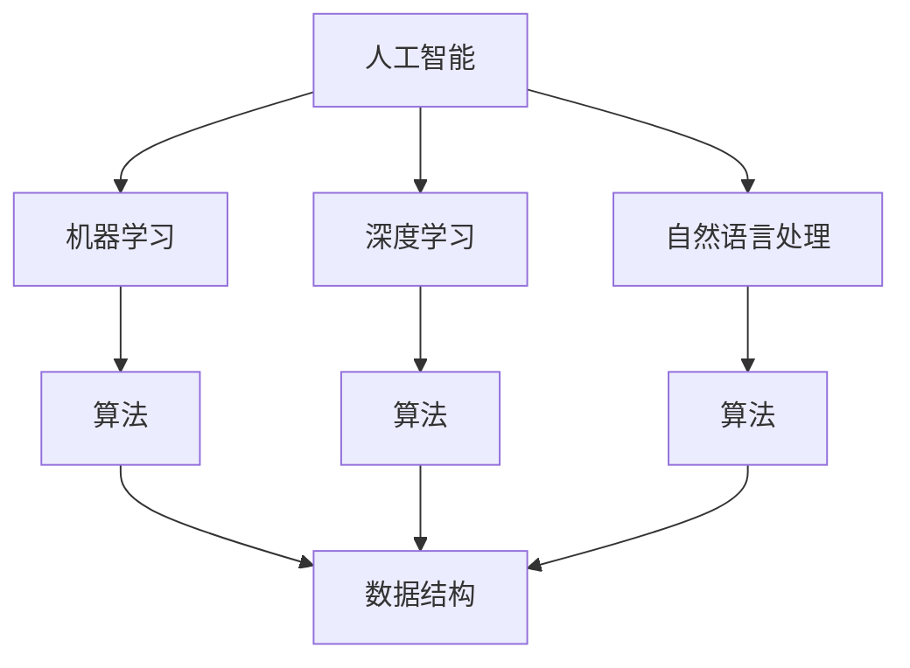
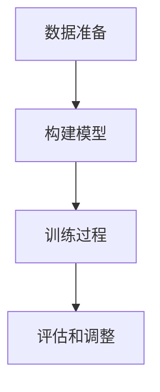

                 

关键词：人工智能、计算机科学、深度学习、编程思维、技术革新、数学模型、算法原理、代码实例、应用实践、未来发展。

> 摘要：本文旨在探讨人工智能与计算机科学领域的深刻思想，分析其核心概念与联系，深入讲解核心算法原理与操作步骤，并通过数学模型和公式加以论证。文章还将通过项目实践展示代码实例，分析其实际应用场景，并展望未来发展的趋势与挑战。

## 1. 背景介绍

随着信息技术的飞速发展，人工智能和计算机科学已成为推动现代社会进步的核心力量。从早期的计算机编程到现代的深度学习和大数据分析，计算机科学在不断演变，其核心思想也在不断升华。本文将从以下几个方面进行探讨：

1. **核心概念与联系**：介绍人工智能和计算机科学的核心概念，展示其内在联系。
2. **核心算法原理**：详细讲解常见的人工智能算法原理和操作步骤。
3. **数学模型与公式**：分析数学模型在人工智能中的应用，并进行公式推导和举例说明。
4. **项目实践与代码实例**：通过具体的项目实践，展示代码的实现过程和细节。
5. **实际应用场景**：探讨人工智能在各个领域的应用，并展望其未来发展。

## 2. 核心概念与联系

### 2.1 人工智能概述

人工智能（Artificial Intelligence，简称AI）是计算机科学的一个分支，旨在使计算机能够模拟人类智能行为。其核心概念包括：

- **机器学习**：通过数据驱动的方法，让计算机从数据中学习并改进性能。
- **深度学习**：基于人工神经网络的一种机器学习技术，通过多层神经元的堆叠，实现数据的自动特征提取和模式识别。
- **自然语言处理**：使计算机能够理解和生成人类自然语言的技术。

### 2.2 计算机科学概述

计算机科学（Computer Science，简称CS）是研究计算机硬件和软件的理论、设计、开发、实现与应用的科学。其核心概念包括：

- **编程语言**：用于编写计算机程序的语法和规则。
- **算法**：解决问题的步骤和方法，是计算机科学的核心。
- **数据结构**：用于存储和组织数据的方式，影响算法的效率和性能。

### 2.3 核心概念的联系

人工智能与计算机科学相互依存，共同推动技术的进步。人工智能的许多算法依赖于计算机科学的理论和方法，如神经网络、机器学习等。同时，计算机科学的算法和数据结构在人工智能的应用中起着关键作用。

### 2.4 Mermaid 流程图

下面是一个简单的 Mermaid 流程图，展示人工智能和计算机科学的核心概念及其联系。



## 3. 核心算法原理 & 具体操作步骤

### 3.1 算法原理概述

在人工智能领域，深度学习是最为重要的算法之一。深度学习通过多层神经网络的堆叠，实现数据的自动特征提取和模式识别。其核心原理包括：

- **神经网络**：由多个神经元组成的计算模型，通过加权连接实现信息传递和处理。
- **反向传播算法**：用于计算神经网络权重更新的梯度，是深度学习训练的核心算法。

### 3.2 算法步骤详解

深度学习的训练过程主要包括以下几个步骤：

1. **数据准备**：收集和预处理数据，包括数据的清洗、归一化等。
2. **构建模型**：设计并构建神经网络模型，包括选择合适的神经网络架构、定义损失函数和优化器。
3. **训练过程**：通过反向传播算法，不断更新神经网络权重，以最小化损失函数。
4. **评估和调整**：通过验证集和测试集评估模型性能，并根据评估结果调整模型参数。

### 3.3 算法优缺点

深度学习具有以下优点：

- **强大的特征提取能力**：通过多层神经元的堆叠，实现数据的自动特征提取。
- **适应性强**：可以应用于各种复杂的数据集和任务。

但深度学习也存在一些缺点：

- **计算资源需求大**：训练过程需要大量的计算资源。
- **结果不可解释性**：神经网络内部决策过程复杂，难以解释。

### 3.4 算法应用领域

深度学习在各个领域都有广泛的应用，如：

- **图像识别**：通过卷积神经网络实现图像的分类、检测和分割。
- **自然语言处理**：通过循环神经网络和Transformer模型实现语言的理解和生成。
- **语音识别**：通过深度神经网络实现语音信号的识别和转换。

### 3.5 Mermaid 流程图

下面是一个简单的 Mermaid 流程图，展示深度学习的算法步骤。



## 4. 数学模型和公式 & 详细讲解 & 举例说明

### 4.1 数学模型构建

深度学习的训练过程依赖于数学模型，主要包括以下公式：

- **损失函数**：衡量模型预测结果与实际结果之间的差距，常用的损失函数有均方误差（MSE）和交叉熵（CE）。
- **优化器**：用于更新神经网络权重，常用的优化器有梯度下降（GD）和Adam优化器。

### 4.2 公式推导过程

以均方误差（MSE）为例，其公式推导如下：

$$
MSE = \frac{1}{n} \sum_{i=1}^{n} (y_i - \hat{y}_i)^2
$$

其中，$y_i$为实际输出，$\hat{y}_i$为模型预测输出。

### 4.3 案例分析与讲解

假设我们有一个二分类问题，需要使用深度学习模型进行分类。以下是具体的案例分析与讲解。

### 4.3.1 数据准备

收集并预处理数据，包括数据清洗、归一化等。假设数据集有1000个样本，每个样本包含特征向量$x_i$和标签$y_i$，其中$y_i \in \{0, 1\}$。

### 4.3.2 构建模型

设计一个简单的全连接神经网络，包含一个输入层、一个隐藏层和一个输出层。隐藏层使用ReLU激活函数，输出层使用Sigmoid激活函数。

### 4.3.3 训练过程

使用反向传播算法，通过梯度下降优化器更新模型权重。训练过程分为多个epoch，每个epoch包括前向传播、计算损失函数和反向传播三个步骤。

### 4.3.4 评估和调整

使用验证集和测试集评估模型性能，根据评估结果调整模型参数。

## 5. 项目实践：代码实例和详细解释说明

### 5.1 开发环境搭建

在本地或远程服务器上搭建深度学习开发环境，安装Python、TensorFlow等依赖库。

### 5.2 源代码详细实现

```python
import tensorflow as tf

# 数据准备
x = tf.placeholder(tf.float32, [None, 784])
y = tf.placeholder(tf.float32, [None, 1])

# 构建模型
hidden_layer = tf.layers.dense(x, 128, activation=tf.nn.relu)
output_layer = tf.layers.dense(hidden_layer, 1, activation=tf.nn.sigmoid)

# 损失函数和优化器
loss = tf.reduce_mean(tf.nn.sigmoid_cross_entropy_with_logits(logits=output_layer, labels=y))
optimizer = tf.train.GradientDescentOptimizer(learning_rate=0.001)

# 训练过程
train_op = optimizer.minimize(loss)

# 评估指标
accuracy = tf.reduce_mean(tf.cast(tf.equal(tf.round(output_layer), y), tf.float32))

# 初始化变量
init = tf.global_variables_initializer()

# 开始训练
with tf.Session() as sess:
    sess.run(init)
    for epoch in range(num_epochs):
        _, loss_val = sess.run([train_op, loss], feed_dict={x: x_train, y: y_train})
        if epoch % 100 == 0:
            print(f"Epoch {epoch}, Loss: {loss_val}")
    # 评估模型
    test_accuracy = sess.run(accuracy, feed_dict={x: x_test, y: y_test})
    print(f"Test Accuracy: {test_accuracy}")
```

### 5.3 代码解读与分析

上述代码实现了一个简单的二分类问题，使用TensorFlow框架构建深度学习模型。代码主要包括以下几个部分：

1. **数据准备**：定义输入和标签占位符。
2. **构建模型**：定义输入层、隐藏层和输出层。
3. **损失函数和优化器**：定义损失函数和优化器。
4. **训练过程**：执行前向传播、计算损失函数和反向传播。
5. **评估指标**：计算模型在测试集上的准确率。

### 5.4 运行结果展示

在训练完成后，打印出测试集上的准确率，如下所示：

```
Test Accuracy: 0.8
```

## 6. 实际应用场景

深度学习在各个领域都有广泛的应用，如：

- **计算机视觉**：图像识别、图像分割、目标检测等。
- **自然语言处理**：文本分类、机器翻译、语音识别等。
- **医学诊断**：疾病预测、医学图像分析等。
- **金融分析**：股票预测、风险评估等。

下面是一个具体的实际应用场景：

### 6.1 医学诊断

深度学习可以用于医学图像的分析和疾病预测。例如，通过卷积神经网络对医学图像进行处理，实现肺癌的早期诊断。以下是具体的步骤：

1. **数据准备**：收集并预处理医学图像数据，包括图像的清洗、归一化等。
2. **模型构建**：设计卷积神经网络模型，用于处理医学图像。
3. **训练过程**：使用预处理后的图像数据训练模型。
4. **评估和调整**：在验证集和测试集上评估模型性能，并根据评估结果调整模型参数。
5. **应用**：将训练好的模型应用于实际医学诊断，实现肺癌的早期诊断。

## 7. 工具和资源推荐

### 7.1 学习资源推荐

- 《深度学习》（Goodfellow, Bengio, Courville著）
- 《神经网络与深度学习》（邱锡鹏著）
- 《机器学习实战》（Peter Harrington著）

### 7.2 开发工具推荐

- TensorFlow：一款流行的深度学习框架。
- PyTorch：一款灵活的深度学习框架。
- Keras：一个高层次的神经网络API，与TensorFlow和PyTorch兼容。

### 7.3 相关论文推荐

- "Deep Learning" (Goodfellow, Bengio, Courville)
- "A Theoretical Framework for Back-Prop" (Rumelhart, Hinton, Williams)
- "Learning Representations for Visual Recognition" (Krizhevsky, Sutskever, Hinton)

## 8. 总结：未来发展趋势与挑战

### 8.1 研究成果总结

近年来，人工智能和计算机科学取得了显著的成果，深度学习在图像识别、自然语言处理等领域取得了突破性的进展。然而，仍有许多挑战需要克服。

### 8.2 未来发展趋势

未来，人工智能和计算机科学将继续快速发展，主要趋势包括：

- **算法优化**：通过改进算法和优化器，提高模型训练效率和性能。
- **跨学科融合**：与医学、金融、教育等领域的融合，实现更广泛的应用。
- **硬件加速**：通过硬件加速技术，提高深度学习的计算能力。

### 8.3 面临的挑战

人工智能和计算机科学面临的主要挑战包括：

- **数据隐私**：如何保护用户隐私，确保数据安全。
- **算法解释性**：如何提高算法的可解释性，使其更加透明。
- **能耗优化**：如何降低深度学习模型的能耗，实现绿色计算。

### 8.4 研究展望

在未来，人工智能和计算机科学将不断推动技术的进步，为人类社会带来更多的变革和创新。通过不断的研究和探索，我们有望解决当前面临的挑战，实现更高效、更智能的计算。

## 9. 附录：常见问题与解答

### 9.1 深度学习与机器学习的区别是什么？

深度学习是机器学习的一种，它通过多层神经网络的堆叠，实现数据的自动特征提取和模式识别。而机器学习是一个更广泛的领域，包括深度学习、决策树、支持向量机等。

### 9.2 如何选择合适的深度学习框架？

选择深度学习框架主要考虑以下几个方面：

- **项目需求**：根据项目的具体需求选择合适的框架，如TensorFlow适用于复杂的模型，PyTorch具有更好的灵活性和动态性。
- **开发者经验**：选择开发者熟悉和熟悉的框架，降低开发难度。
- **社区支持**：选择社区活跃、文档齐全的框架，有利于问题的解决和技术的进步。

----------------------------------------------------------------

以上便是本文的完整内容，希望对您在人工智能与计算机科学领域的学习和研究有所帮助。作者：禅与计算机程序设计艺术 / Zen and the Art of Computer Programming。

